# Overview

In this lab, you will learn all about deploying AI workloads on AKS Automatic cluster. We'll start by running a containerized AI workload locally then deploy it to an AKS Automatic cluster. AKS Automatic is a new offering of AKS that simplifies the deployment of Kubernetes clusters. In a matter of minutes, you will have an enterprise ready Kubernetes cluster that is ready to run your AI workloads securely and at scale.

## Objectives

The overall objective is to get you familiar with deploying apps to AKS Automatic clusters by doing the following:

- Preparing an application for deployment to AKS
- Deploying an application to AKS using Automated Deployments
- Configuring ingress for an application
- Troubleshooting an application using AKS Container Insights
- Configuring AKS Workload Identity with AKS Service Connector

## Prerequisites

Before you begin this lab, you will need the following tools installed on your machine (I know... it's a lot 😅):

- [Azure subscription](https://azure.microsoft.com/free)
- [Git](https://git-scm.com/downloads)
- [Python](https://www.python.org/downloads)
- [Jupyter](https://jupyter.org/install)
- [Node.js](https://nodejs.org/en/download)
- [Docker Desktop](https://www.docker.com/get-started)
- [Terraform](https://developer.hashicorp.com/terraform/install)
- [Azure CLI](https://learn.microsoft.com/cli/azure/install-azure-cli)
- [Azure Developer CLI](https://learn.microsoft.com/azure/developer/azure-developer-cli/install-azd)
- [GitHub CLI](https://cli.github.com)
- [Visual Studio Code](https://code.visualstudio.com)
- POSIX compliant shell (e.g. bash, zsh)

<div class="info" data-title="Note">

> You can also run the lab in a GitHub Codespace or DevContainer. This environment has all the tools you need pre-installed. More on that in the next section.

</div>

<div class="important" data-title="Important">

> In order to deploy an AKS Automatic cluster, you will need to have at least 32 vCPU of Standard DSv2 quota available in the region you want to deploy the cluster. If you don't have this quota available, you can request a quota increase in the Azure portal. Instructions on how to request a quota increase can be found [here](https://learn.microsoft.com/azure/quotas/quickstart-increase-quota-portal).

</div>

---

# Lab environment setup

The application we will be deploying is a multi-agent creative writing assistant. The application will rely on multiple large language models hosted on [Azure OpenAI](https://learn.microsoft.com/azure/ai-services/openai/overview) to generate content. But the content will not be generated automatically from scratch, it will rely on product catalog indexed in Azure AI Search and related content gathered from Bing Search. With content grounded in facts and real-world data, the AI agents will generate creative writing pieces that are both engaging and informative, then an editor agent will review and accept the final piece.

Here is a high-level overview of the application and the Azure resources that it relies on, which can also be found in the repo at https://github.com/pauldotyu/contoso-creative-writer/.


This application relies on the services that you see listed in the diagram above with a few more to prepare for the AKS Automatic deployment. This workshop will include these additional Azure services:

- Azure Container Registry
- Azure Log Analytics
- Azure Monitor (Prometheus)
- Azure Managed Grafana
- Container Insights
- Azure Key Vault
- Azure DNS

## Fork and clone the repo

Start by forking the repo to your GitHub account. You can use the GitHub CLI.

```bash
# authenticate to GitHub
gh auth login --scopes repo,workflow,write:packages

# fork the repo
gh repo fork pauldotyu/contoso-creative-writer
```

Next, open your forked repo with GitHub Codespaces. Navigate to the repo in the GitHub UI and click on the Code button. Click on the **Codespaces** tab, then click **Create codespace on main**.

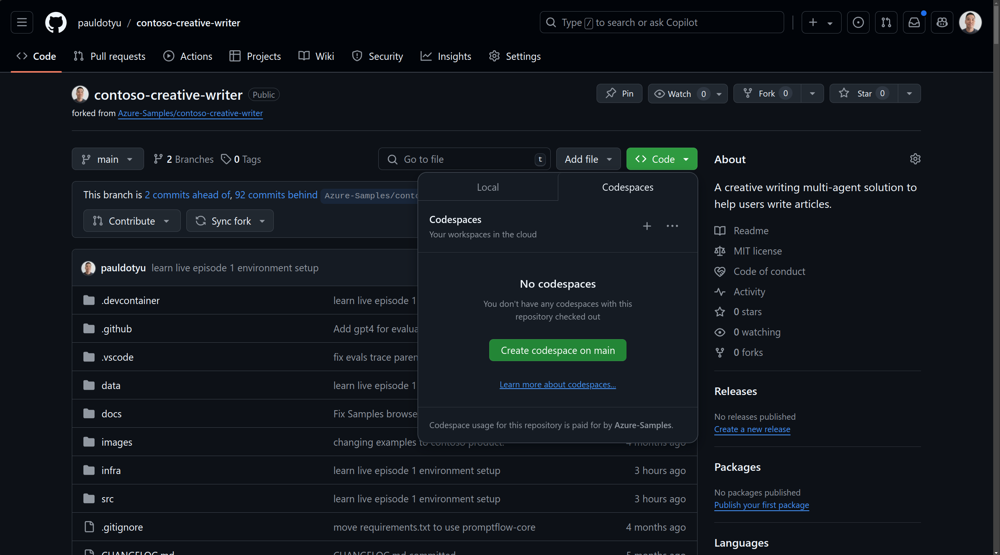

<div class="info" data-title="Note">

> If you want to use a DevContainer, clone the repo to your local machine and open it in Visual Studio Code. You should be prompted to open the repo in a DevContainer.

</div>

## Deploy Azure Resources 

As mentioned above, the application relies on a few Azure resources. We will use the existing Terraform configuration that is included in the repo and invoke the Terraform CLI using the Azure Developer CLI (AZD).

Run the following commands to set up the lab environment.

```bash
# login to Azure CLI
az login

# login to Azure Developer CLI
azd auth login

# create a new AZD environment
azd env new

# set the Azure subscription to use
azd env set AZURE_SUBSCRIPTION_ID $(az account show --query id -o tsv)

# set the Azure location that has all services and vCPU quota available for the workshop
azd env set AZURE_LOCATION "francecentral"

# provision the Azure resources
azd provision

# set environment variables
azd env get-values | awk '{gsub(/"/, "")}1' > .env

# set environment variables in the current shell
source .env
```

---

# Runs on my machine!

Great! We've quickly provisioned all the Azure resources needed to support this application. We can verify the application works locally before deploying it to containers, then to the cloud.

## Local development

The repo includes two applications: a backend api and a web frontend.

The backend api is a Python based application and we can run the following commands in a terminal to start the api locally.

```bash
# make sure you are in the root of the repo
cd src/api

# create a virtual environment
python -m venv .venv

# activate the virtual environment
source .venv/bin/activate

# install the dependencies
pip install -r requirements.txt

# copy the .env file from the root of the repo
cp ../../.env .

# start the api
.venv/bin/gunicorn -c gunicorn.conf.py api.app:app
```

With the api running, open a new terminal and start the web app. The web app is a Node.js application and we can run the following commands.

```bash
# make sure you are in the root of the repo
cd src/web

# install the dependencies
npm install

# start the web app
npm run dev
```

## Test the application

Browse to http://localhost:5173

Click the **Try an Example** button, then click **Get to Work!**.

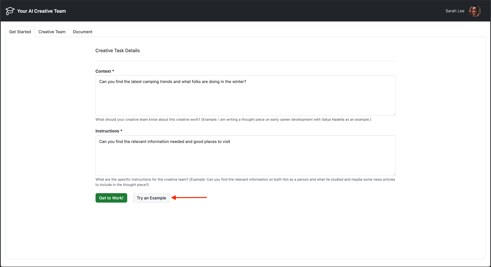

You should see the Agents working on the task and if you navigate back into your terminal, you should see logs from the api service that shows the task being processed.

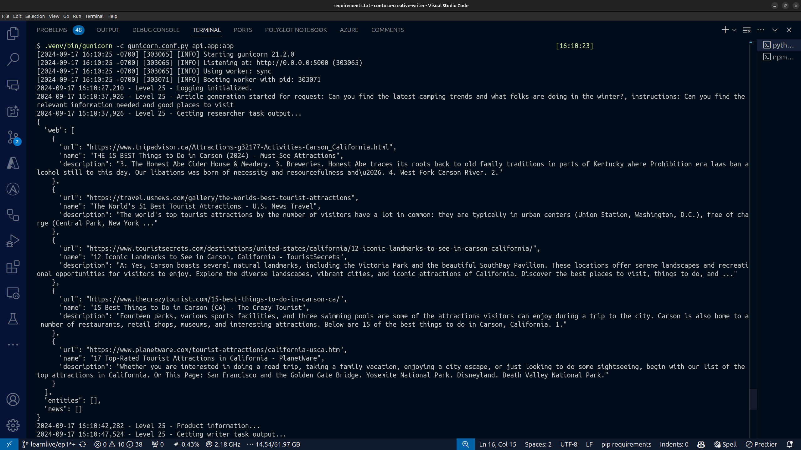

After a few minutes, you should see the status of **Editor accepted article**.

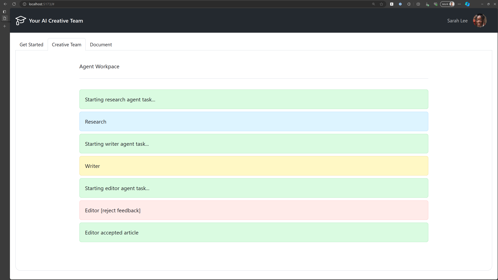

Click the **Document** tab to see the final document.

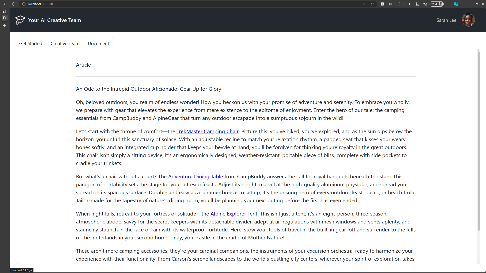

After you have verified the application works locally, you can stop the applications by pressing `Ctrl+C` in both terminals.

## Containerize the application

Next step is to ensure the applications can run in containers. The repo includes Dockerfiles for both the api and web projects. A [Dockerfile](https://docs.docker.com/get-started/docker-concepts/building-images/writing-a-dockerfile/) is a manifest that describes how to build a container image. To run a container you need to build an image from the Dockerfile and then run the image in a container.

When running multi-container applications, it is common to use Docker Compose. [Docker Compose](https://docs.docker.com/compose/) enables you to easily define the services that make up your application in a `docker-compose.yml` file. In this file, you can define the services, networks, volumes, and environment variables for your application. This is a common workflow for developing and testing multi-container applications locally.

<div class="tip" data-title="tip">

> Understanding how the docker-compose.yml file is structured is beneficial when deploying multi-container applications to Kubernetes.

</div>

Open a new terminal and run the following commands to build and start the applications in containers.

```bash
# make sure you are in the root of the repo
docker compose up --build
```

<div class="info" data-title="Note">

> While the containers build and start, let's move on to take a look at the Docker Compose file to understand how the applications are configured to run in containers.

</div>

### Exploring the Docker Compose file

The Docker Compose file begins with a **services** stanza. Here is where you define the services that make up your application. In this case, we have two services: api and web.

```yml
services:
...
```

Within the **services** stanza are the configurations for each service. For example, the api service is defined as follows:

```yml
...
  api:
    build:
      context: src/api
      dockerfile: Dockerfile.local
    ports:
      - "5000:5000"
    env_file: 
      - .env
    environment:
      - PYTHONUNBUFFERED=1
    volumes:
      - $HOME/.azure/:/root/.azure
...
```

The **build** stanza specifies the context and Dockerfile to use to build the image. There is a special Dockerfile.local file that is used to build the image specifically for running the container locally (more on that in a bit). The **ports** stanza specifies the port mapping between the host and the container. Remember the api service is running on port 5000. The **env_file** stanza loads the local **.env** file to load into the container. The **environment** stanza specifies individual environment variables to set in the container. Finally we get to the **volumes** stanza. Here we mount the local Azure CLI directory into the container so that the container can access your Azure CLI credentials for authentication. 

<div class="info" data-title="Note">

> A special Dockerfile is used to test the API container locally because of the fact that the API service is written to authenticate to Azure services the Azure Identity SDK in a passwordless manner. More specifically, it uses the DefaultAzureCredential class which tries several different methods to authenticate, ranging from environment variables, workload identity, and Azure CLI credentials. 
>
> In this case, the easiest way to authenticate from a local container is by using the Azure CLI credentials. However, the Azure CLI is not installed in the container by default, so a special Dockerfile.local is leveraged which installs the Azure CLI in the container.

</div>

The web service is defined similarly:

```yml
  web:
    build:
      context: src/web
    ports:
      - "3000:80"
    depends_on:
      - api
```

The **depends_on** stanza specifies that the web service depends on the api service. This means that the api service will start before the web service starts.

## Test the application

Browse to http://localhost:3000 and test the application as you did before.

Press `Ctrl+C` to stop the containers.

---

# Runs on all machines!

So we know the app works locally, both as standalone applications and within containers. Once we know the app works within containers, we can be _pretty_ sure that it'll work on all machines, and in our case, Kubernetes clusters.

## Deploy AKS Automatic cluster

[AKS Automatic](https://aka.ms/aks/automatic) greatly simplifies the design and deployment of Kubernetes clusters. Many of the design decisions that you would need to make when deploying a traditional AKS cluster are made and managed for you. This includes the network plugin, the authentication and authorization mode, and the monitoring and logging configuration, node pool configuration, and more.

Let's use the Azure portal to deploy an AKS Automatic cluster. 

Navigate to the [Azure Portal](https://portal.azure.com) and search for **kubernetes** in the search bar. 

Click on the **Kubernetes services** link under **Services**, click on the **Create** button, and then click on the **Automatic Kubernetes cluster (preview)** button.

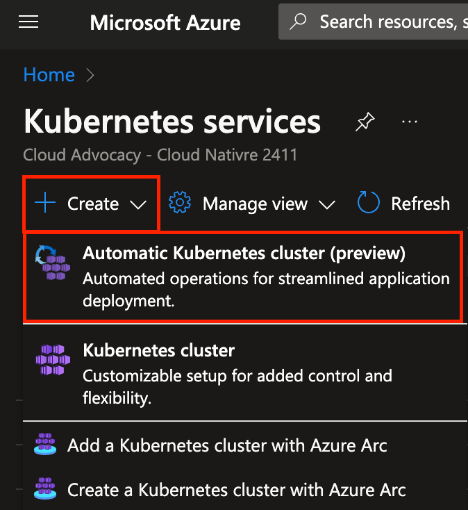

In the **Basics** tab, enter the following details:

- **Subscription**: Select your Azure subscription
- **Resource group**: Select the resource group you created earlier
- **Kubernetes cluster name**: aks-learnlive
- **Region**: Select the region your resource group is in

You can leave the rest of the settings as default then click **Next**.

In the **Monitoring** tab, note that monitoring, logging, and alerts are enabled by default. Since we have existing Azure Monitor, Azure Log Analytics, and Azure Managed Grafana resources, it automatically populated the dropdowns for you. Pretty awesome, right? 

Click **Review + create**, wait for the validation to complete, then click **Create**. It'll take a few minutes to deploy the AKS Automatic cluster. 

Once the deployment is complete, click the **Go to resource** button to navigate to the AKS cluster.

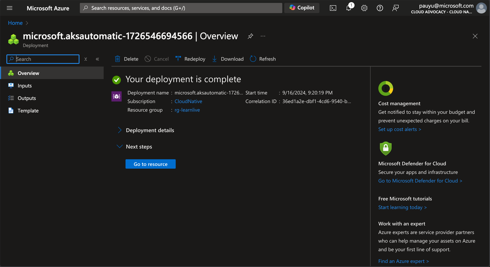

## Publish container images

Before we attempt to run the application containers in a Kubernetes cluster, we'll need to put our container images in a container registry. Common registries include [Docker Hub](https://hub.docker.com/), [Azure Container Registry (ACR)](https://learn.microsoft.com/azure/container-registry/), or [GitHub Container Registry (GHCR)](https://docs.github.com/en/packages/working-with-a-github-packages-registry/working-with-the-container-registry) just to name a few.

In order for your AKS cluster to pull images from ACR, you need to grant the AKS cluster access to the ACR instance.

Use the Azure CLI to give the AKS cluster access to ACR. Run the following command in the terminal to grant the AKS cluster access to ACR.

```bash
# run this in the root of the repo
source .env

# get the AKS cluster name
AZURE_KUBERNETES_SERVICE_NAME=$(az aks list -g $AZURE_RESOURCE_GROUP --query "[0].name" -o tsv)

# update the AKS cluster and attach the container registry
az aks update --resource-group $AZURE_RESOURCE_GROUP --name $AZURE_KUBERNETES_SERVICE_NAME --attach-acr $AZURE_CONTAINER_REGISTRY_NAME
```

<div class="info" data-title="Note">

> This can take a few minutes to complete. Move on and come back to this step later.

</div>

## Application configuration

We saw in the docker compose file, the **.env** file directly into the api container. We won't have this luxury in AKS. Instead we need to pass the environment variables to the container at runtime and we can do this using a [ConfigMap](https://kubernetes.io/docs/concepts/configuration/configmap/). The good news is that we can quickly create a ConfigMap from the **.env** file to start.

Open a new terminal and get the kubeconfig file which allows you to log into the AKS cluster.

```bash
# run this in the root of the repo
source .env

# get the AKS cluster name
export AZURE_KUBERNETES_SERVICE_NAME=$(az aks list -g $AZURE_RESOURCE_GROUP --query "[0].name" -o tsv)

# get the kubeconfig file
az aks get-credentials --resource-group $AZURE_RESOURCE_GROUP --name $AZURE_KUBERNETES_SERVICE_NAME
```

<div class="important" data-title="Important">

> If you get an error about not having kubelogin installed, you can install it by running the following command:
> `sudo az aks install-cli`

</div>

Run a command to verify that you are connected to the AKS cluster.

```bash
kubectl create namespace ccw
```

Since this is the first time you are connecting to the AKS cluster, you will be prompted to log in to the AKS cluster using Microsoft Entra ID.

After you've authenticated, run the following command to create a ConfigMap from the local .env file.

```bash
kubectl create configmap ccw-config -n ccw --from-env-file .env
```

Confirm the ConfigMap was created and view the contents.

```bash
kubectl get configmap ccw-config -n ccw -o yaml
```

<div class="warning" data-title="Warning">

> There are configs here that should really be secrets. This is not best practice, but let's just get the app running for now.

</div>

## Automated deployments

The easiest way to deploy apps to AKS is to use the Azure portal. 

AKS has a feature called [Automated Deployments](https://learn.microsoft.com/azure/aks/automated-deployments) that allows you to deploy applications to your AKS cluster directly from GitHub. This feature uses [GitHub Actions](https://docs.github.com/actions) to build container images, push them into ACR, then deploy it to your AKS cluster.

When you setup an Automated Deployment, it will do the following:

1. Create a Service Principal in your Microsoft Entra tenant
2. Assign Azure RBAC permissions to the Service Principal
3. Configure a federated credential for your GitHub repository which allows the GitHub Actions to authenticate to your Azure subscription and deploy the application to your AKS cluster
4. Create a GitHub Actions workflow file in your GitHub repository that builds the container image, pushes it to ACR, and deploys an updated manifest to your AKS cluster

Having a pipeline set up makes it very easy to deploy new versions of your application. Any changes to the code will trigger a new deployment. 

You will need to configure an Automated Deployment for the **api** app and the **web** app separately.

### Deploy the api app

Navigate to your AKS cluster in the Azure portal.

Click on **Automated deployments** under **Settings**

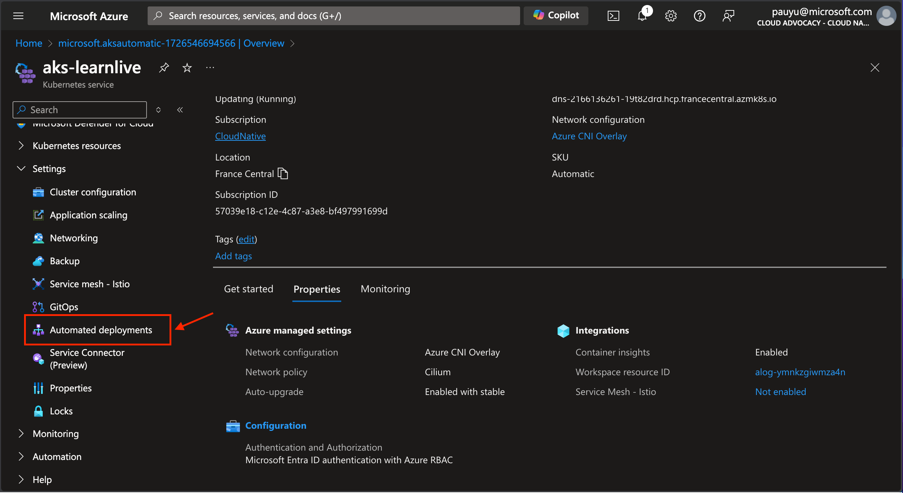

Click the **Create an automated deployment** button, then click **Deploy an application** option

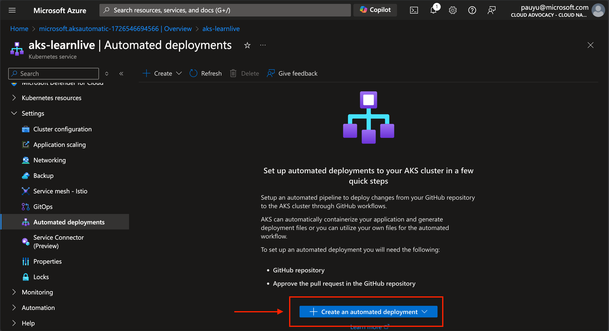

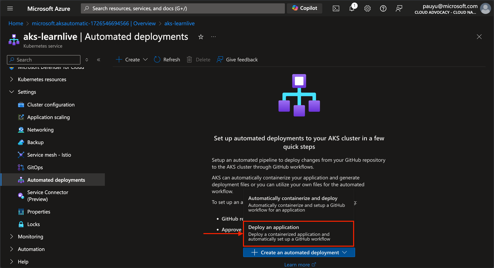

<div class="info" data-title="Note">

> Automated deployments is currently in preview and only supports GitHub repositories.

</div>

Fill in the following details.

In the **Repository** tab:

- **Workflow name:** ccw-api
- **Repository location:** GitHub (you may need to authenticate to GitHub)
- **Repository source:** My repositories
- **Repository:** Select your forked repo from the dropdown
- **Branch:** Select **main** from the dropdown

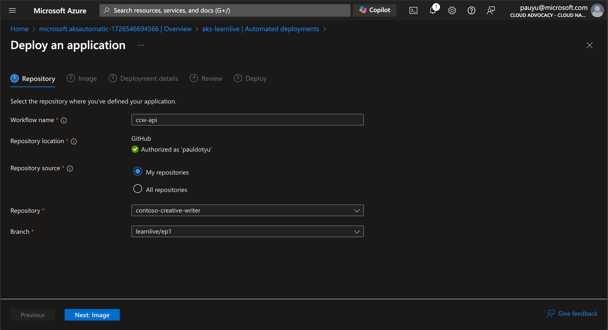

In the **Image** tab:

- **Dockerfile:** Click select and choose the existing **Dockerfile** in the `src/api` directory, then click **Select**
- **Dockerfile build context:** `./src/api`
- **Azure Container Registry:** Select your ACR from the dropdown
- **Azure Container Registry image:** Click the **Create new** link and enter `api` as the image name


In the **Deployment** details tab:

- **Deployment options:** Click on **Kubernetes manifests files**
- **Manifest files:** Click the **Select** link, navigate to the `infra/manifests/api` directory, check the **deployment.yaml** file, then click the **Select** button
- **Namespace:** Select **ccw** from the dropdown

<div class="info" data-title="Note">

> AKS Automated Deployments can create Kubernetes manifests for you. However, in this lab, we are using the existing manifests in the repo.

</div>

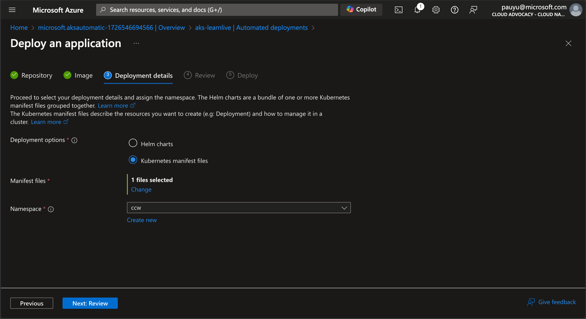

<div class="important" data-title="Important">

> The Automated Deployment generates a GitHub workflow file. In the workflow, the last workflow step uses the [Azure/k8s-deploy](https://github.com/Azure/k8s-deploy?tab=readme-ov-file#action-inputs) action to update the image to the most current version that was built and pushed in an earlier step. In order for this to work properly, the image MUST have the same container registry name and repository name as the one the workflow will be producing. There is a pattern match that occurs as part of the image update process on deployment so we need to ensure the existing manifest reflects the proper container registry and repository name. The tag can be anything as it will be updated by the workflow.

</div>

Open a new terminal and update the deployment.yaml file in the `infra/manifests/api` directory to reflect the image name that will be similar to what will be created by the Automated Deployment.

```bash
# run this in the root of the repo
source .env
sed -i "s|image: .*|image: ${AZURE_CONTAINER_REGISTRY_NAME}.azurecr.io/api:latest|" infra/manifests/api/deployment.yaml
sed -i "s|image: .*|image: ${AZURE_CONTAINER_REGISTRY_NAME}.azurecr.io/web:latest|" infra/manifests/web/deployment.yaml
```

Commit the changes to the deployment.yaml file.

```bash
git pull
git add infra/manifests/api/deployment.yaml infra/manifests/web/deployment.yaml
git commit -m "Update image name in deployment.yaml files"
git push
```

In the **Review** tab, review the deployment details then click **Next: Deploy**

This will create a new pull request in your forked repo.

When ready, click the **Approve pull request** button

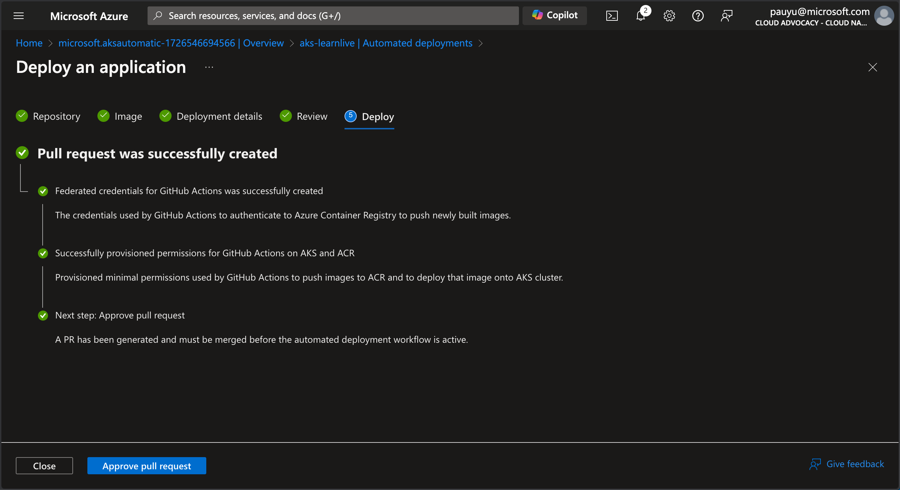

In the GitHub Pull request review page, click on the **Files changed** tab and view the workflow file that will be added to your repo. You can see that the workflow file has two jobs: one to build the container image and push it to ACR, and another to deploy the image to the AKS cluster.

Click on the **Conversation** tab and click the **Merge pull request** button.

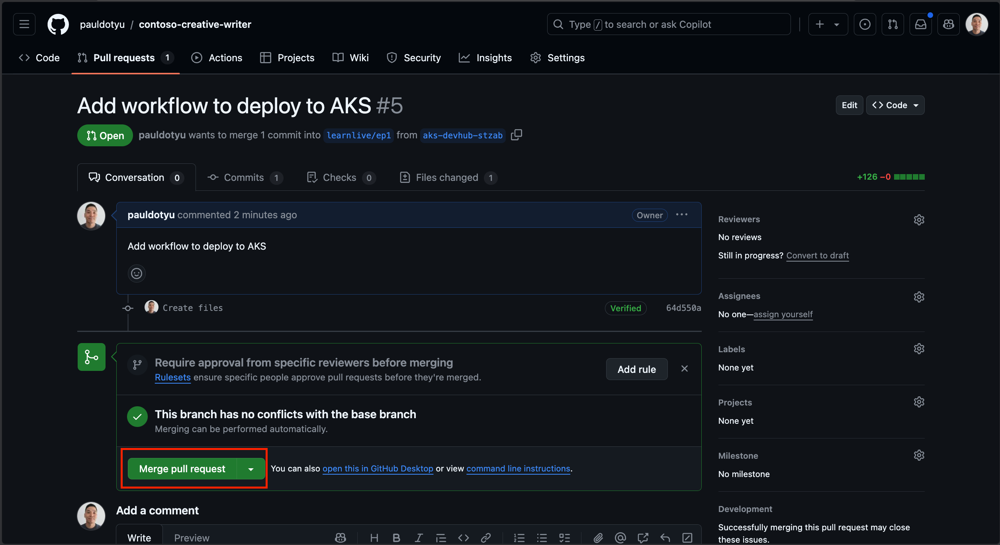

Click the **Confirm merge** button, then click the **Delete branch** button.

Navigate back to the Azure portal and click the **Close** button to close the Automated deployment for the api app and you will see the deployment in progress.

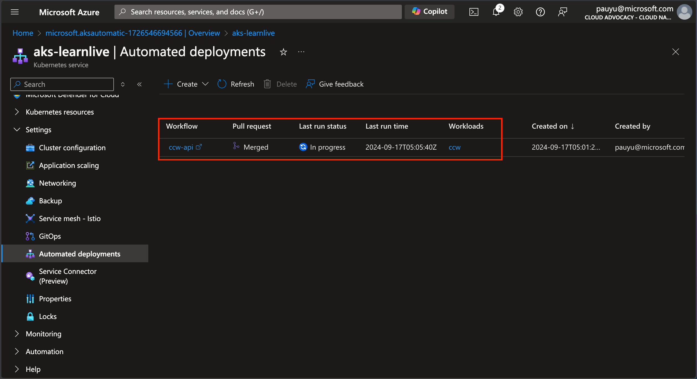

Repeat the same steps for the web app.

### Deploy the web app

Click the Create button at the top of the **Automated deployments** blade, then click **Deploy an application** option

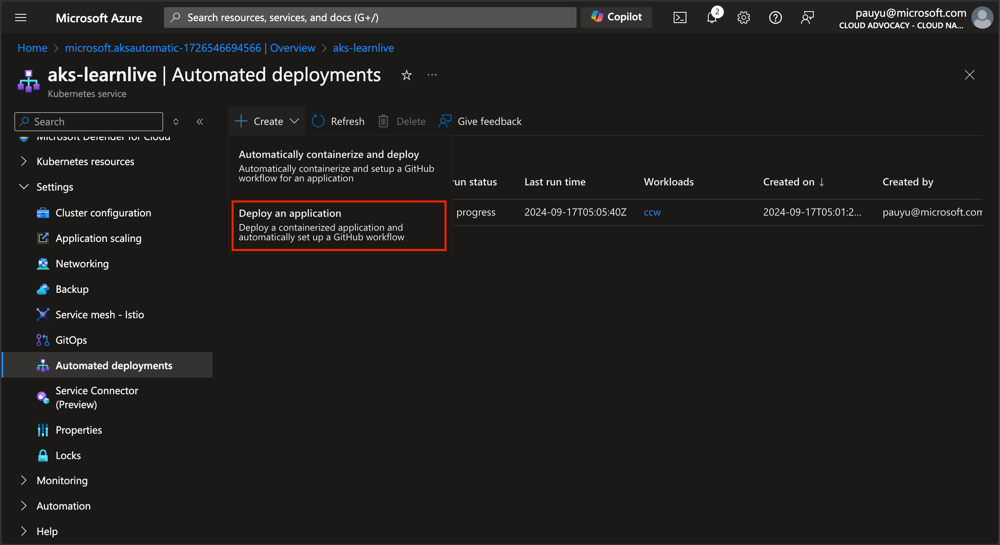

Fill in the following details.

In the **Repository** tab:

- **Workflow name:** ccw-web
- **Repository location:** GitHub
- **Repository source:** My repositories
- **Repository:** Select your forked repo from the dropdown
- **Branch:** Select **main** from the dropdown

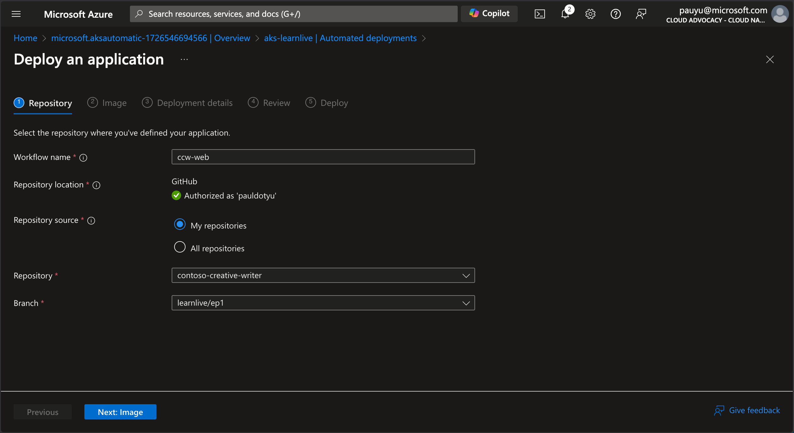

In the **Image** tab:

- **Dockerfile:** Click select and choose the **Dockerfile** in the `src/web` directory, then click **Select**
- **Dockerfile build context:** `./src/web`
- **Azure Container Registry:** Select your ACR from the dropdown
- **Azure Container Registry image:** Click the **Create new** link and enter `web` as the image name

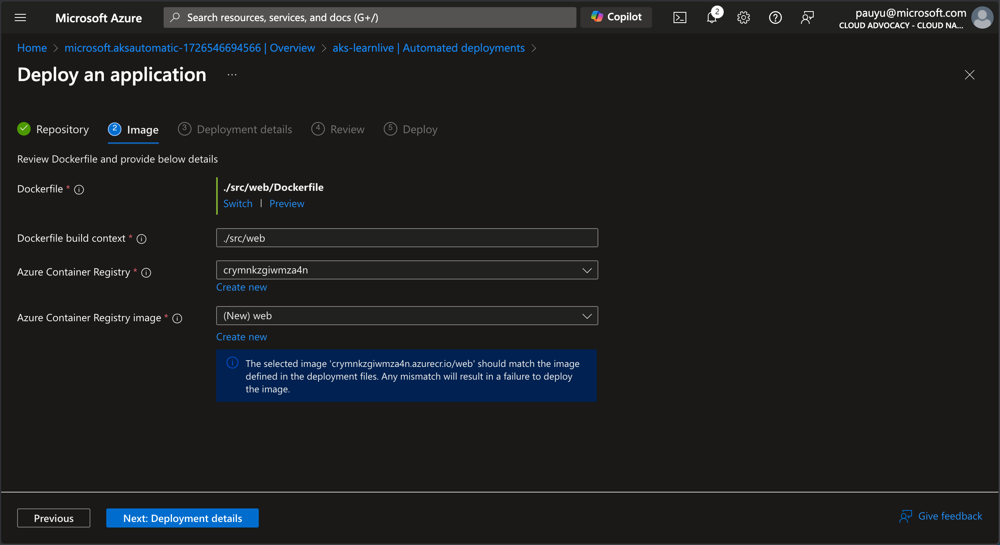

In the Deployment details tab:

- **Deployment options:** Click on **Kubernetes manifests files**
- **Manifest files:** Click the **Select** link, navigate to the `infra/manifests/web` directory, check the **deployment.yaml** file, then click **Select**
- **Namespace:** Select **ccw** from the dropdown

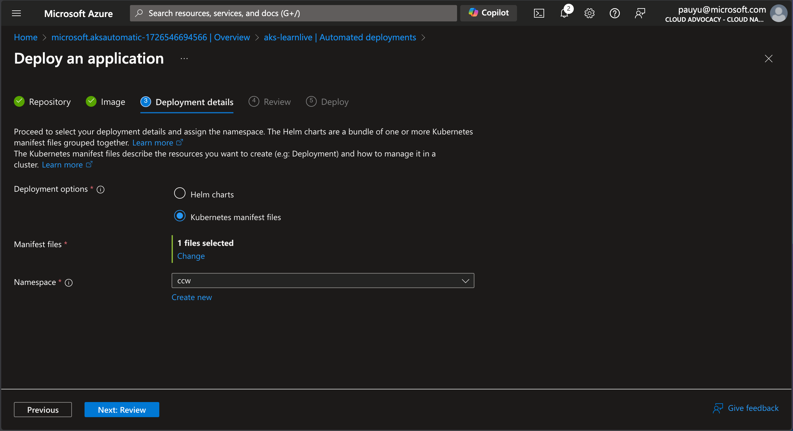

In the **Review** tab, review the deployment details, then click **Next: Deploy**

This will create another new pull request in your forked repo. Review and merge the pull request as you did for the **api** app.

### Confirm deployment

In the GitHub page, click on the **Actions** tab to view the deployment progress for workflows. Click on the workflow run to view the details of the deployment.

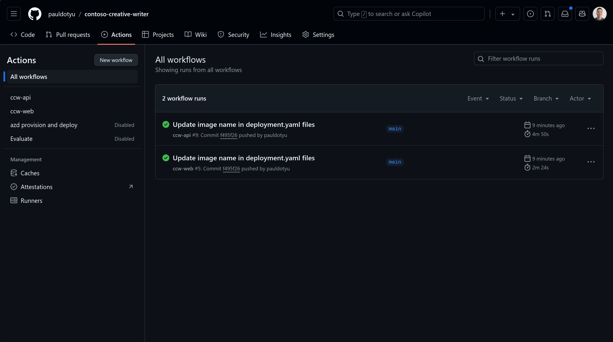

## Configure ingress

As mentioned earlier, AKS Automatic makes several design decisions for you. One of those decisions is to use the [AKS App Routing Add-On](https://learn.microsoft.com/azure/aks/app-routing) for ingress. This add-on provides a fully managed NGINX ingress controller that is automatically deployed to your AKS cluster. All you need to do is configure the ingress resource to route traffic to your applications.

This can also be achieved from the Azure portal. 

Navigate to the AKS cluster, click on the **Services and ingresses** tab

### Configure ingress for web service

Right-click on the **web** service, then click the **Add ingress** button.

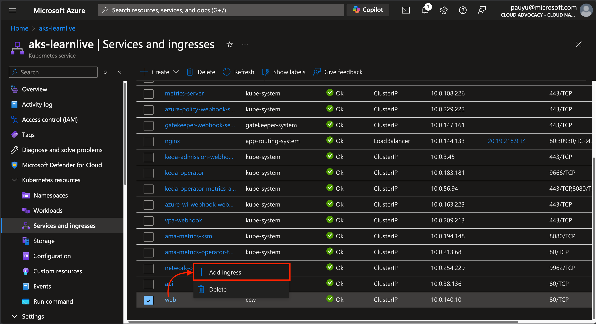

In the **Basic** tab, enter the following details:

- **Ingress name:** web
- **Namespace:** ccw
- **Service:** web
- **Key vault and primary certificate:** Click the **Select a certificate** link then select the key vault and self-signed certificate that has been created for you
- **DNS provider:** Select Azure DNS
- **Azure DNS Zone:** Select the Azure DNS zone that has been created for you
- **Subdomain name:** ccw

Click **Review + create**, then click **Create**.

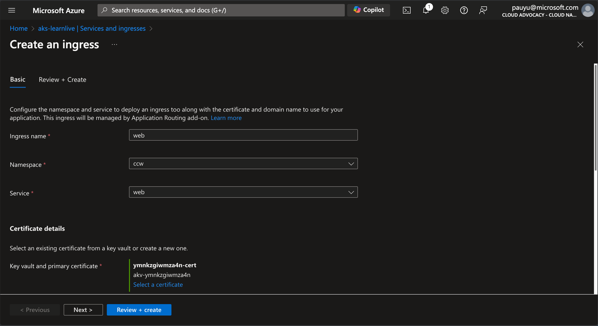

This will take a few minutes to create the ingress resource.

When it is complete, click the **Close** button and configure the ingress for the api service.

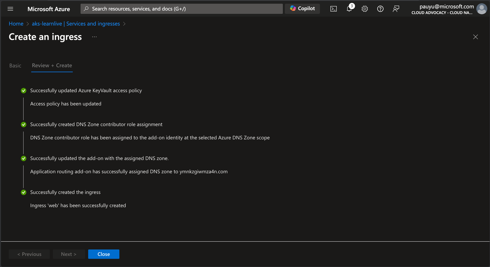

### Configure ingress for api service

Right-click on the **api** service, then click the **Add ingress** button.

In the **Basic** tab, enter the following details:

- **Ingress name:** api
- **Namespace:** ccw
- **Service:** api
- **Key vault and primary certificate:** Click the **Select a certificate** link then select the key vault and self-signed certificate that has been created for you
- **DNS provider:** Select Azure DNS
- **Azure DNS Zone:** Select the Azure DNS zone that has been created for you
- **Subdomain name:** ccw

Click **Review + create**, then click **Create**.

This will take a few minutes to create the ingress resource.

When it is complete, click the **Close** button.

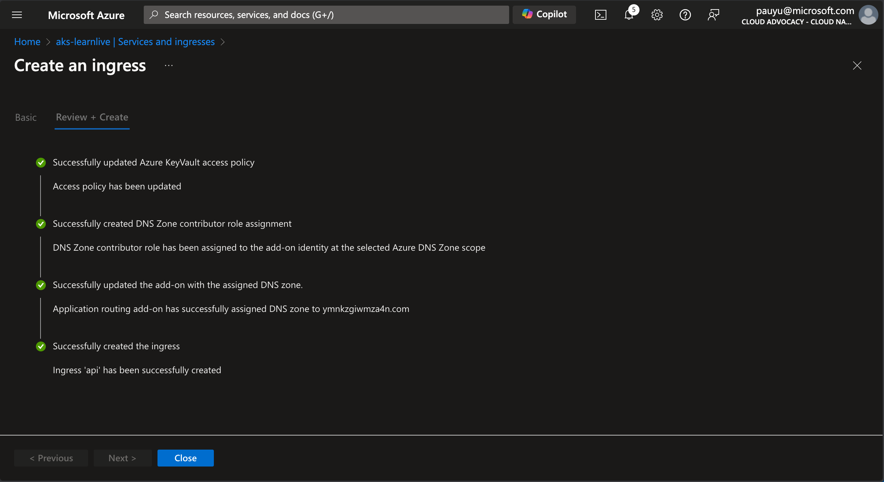

### Use Azure Copilot to fix the api ingress

Did you notice something about this api ingress configuration?

It's pointing to the same subdomain as the web ingress. This is because the api service is expected to be on the same subdomain but a different path `/api`. We need to update the api service to listen on the `/api` path.

Click on the **Ingresses** tab, then click on the **api** ingress.

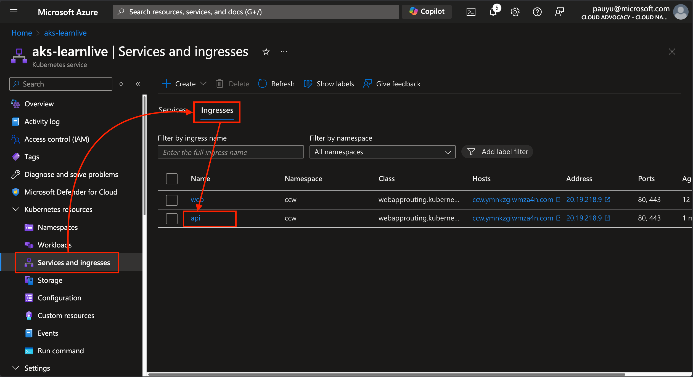

Click on the **YAML** tab.

Click on the **Copilot** to bring up the Azure Copilot prompt, and put your cursor in the text box.

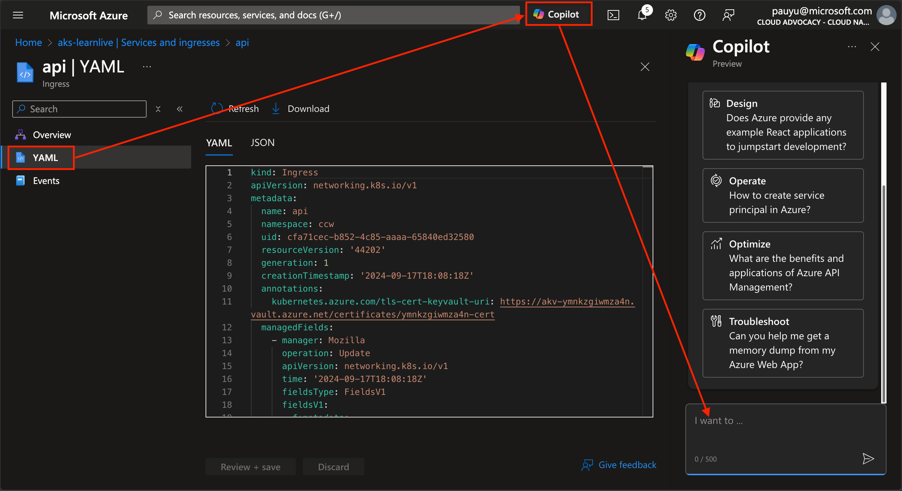

Copy and paste the following prompt into the text box, then click the **Send** button.

```text
update this ingress to listen on any request to /api path and add annotation to rewrite the url to remove /api to backend pods
```

Wait for Azure Copilot to suggest YAML file edits.

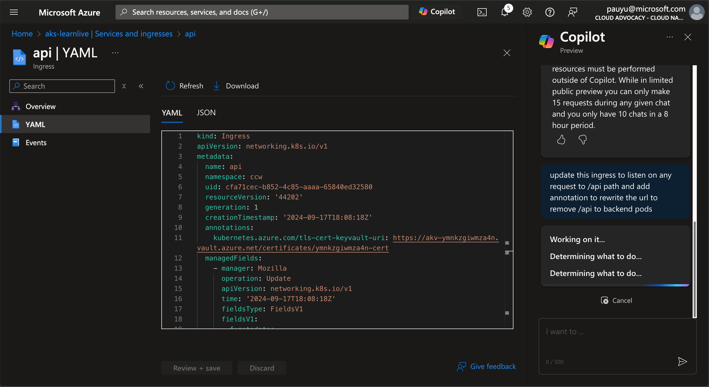

You should see Azure Copilot suggesting the following:

- Add annotations `nginx.ingress.kubernetes.io/rewrite-target: /$2` and `nginx.ingress.kubernetes.io/use-regex: "true"`
- Path be updated to `- path: /api(/|$)(.*)` with `pathType: ImplementationSpecific` 

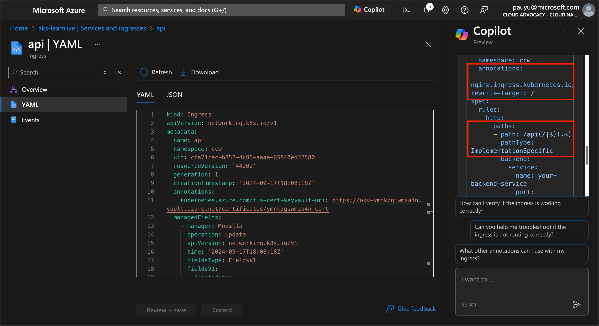

These configs will rewrite the url to remove the `/api` path when sending the request to the backend pods.

Make the necessary changes to the YAML file, then click the **Review + save** button.

Click the **Review + save** button, then confirm the changes by checking the **Confirm manifest changes** checkbox and click the **Save** button.

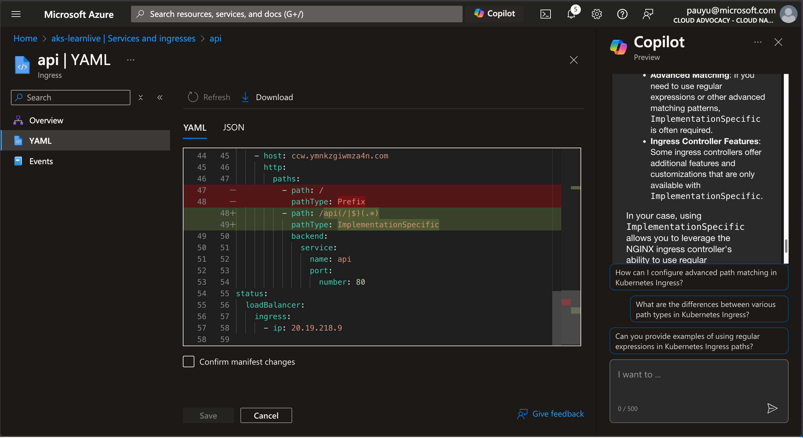

## Test the application

You should now be able to navigate to the web app. 

Run the following command in your terminal to get the url of the web app.

```bash
echo "https://$(kubectl get ingress -n ccw web -o jsonpath='{.spec.rules[0].host}')"
```

Test the app again now and see if it works.

<div class="tip" data-title="Hint">

> The web app is running but the api service is having issues. We will troubleshoot the api service in the next section.

</div>

---

# Debugging applications

You may have noticed, the app is not working as expected. It seems to be stuck on **Starting research agent task...** and the api service is not processing the task.

We can use [AKS Container Insights](https://learn.microsoft.com/azure/azure-monitor/containers/container-insights-overview#access-container-insights) to see what might be going wrong.

Navigate back to teh AKS portal, click on **Workloads**, then click the **api** deployment.

In the right-naviagtion pane, click on **Live logs**, then select a pod to view the logs.

<div class="info" data-title="Note">

> It can take a few minutes for the logs to appear. If logs do not appear, try clicking the **Looking for historical logs? View in Log Analytics** link.

</div>

Scroll through the logs and you will see that the api service is looking for details to authenticate to Azure OpenAI. We know from running this app locally that the api service uses the [Azure Identity SDK](https://learn.microsoft.com/python/api/overview/azure/identity-readme?view=azure-python) to authenticate to Azure services. We need to configure the api service to use [AKS Workload Identity](https://learn.microsoft.com/azure/aks/workload-identity-overview?tabs=python).

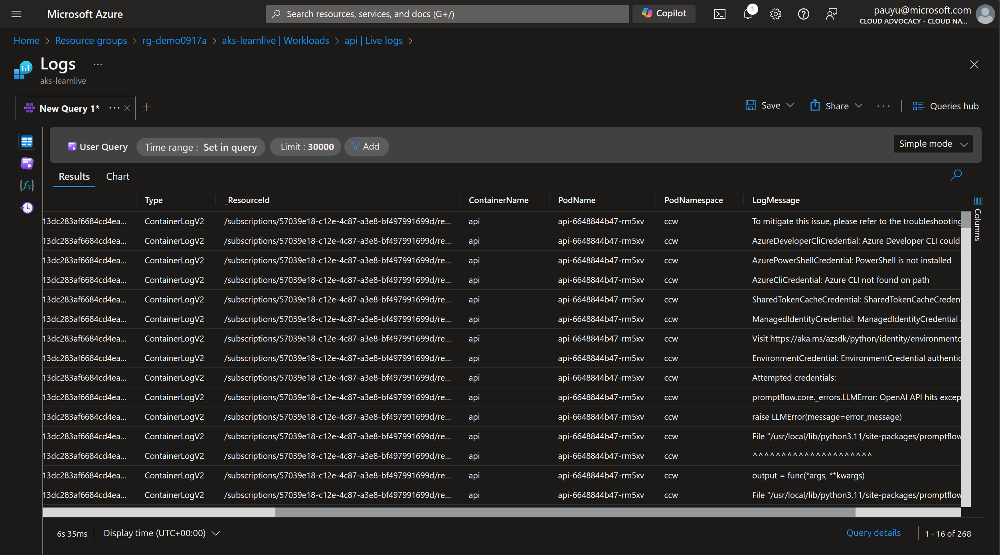

---

# Integrating apps with Azure services

We need to configure the api service to use AKS Workload Identity. But configuring Workload Identity can be a bit tricky. We need to create an Azure Identity, give it permissions to access the Azure OpenAI service, create a Federated Credential for the AKS cluster, create a Kubernetes Service Account, and finally configure the api service to use the Kubernetes Service Account. That's a lot of steps!

## Workload Identity with AKS Service Connector

[AKS Service Connector](https://learn.microsoft.com/azure/service-connector/how-to-use-service-connector-in-aks) is a new feature that simplifies the configuration of Workload Identity. 


<div class="info" data-title="Note">

> At the time of this writing it is currently available as a preview feature, but is quickly becoming the preferred way to configure Workload Identity.

</div>

It automatically gives an [Azure Managed Identity](https://learn.microsoft.com/entra/identity/managed-identities-azure-resources/overview) the necessary permissions, and creates the [Federated Credential](https://learn.microsoft.com/graph/api/resources/federatedidentitycredentials-overview?view=graph-rest-1.0) for the AKS cluster. All you need to do is create a Kubernetes [ServiceAccount](https://kubernetes.io/docs/concepts/security/service-accounts/) and configure the api [Pod](https://kubernetes.io/docs/concepts/security/service-accounts/#assign-to-pod) to use the Kubernetes ServiceAccount.

Let's use the Azure portal to create a Service Connector.

In the AKS portal, click on **Service Connector (Preview)** under **Settings**.

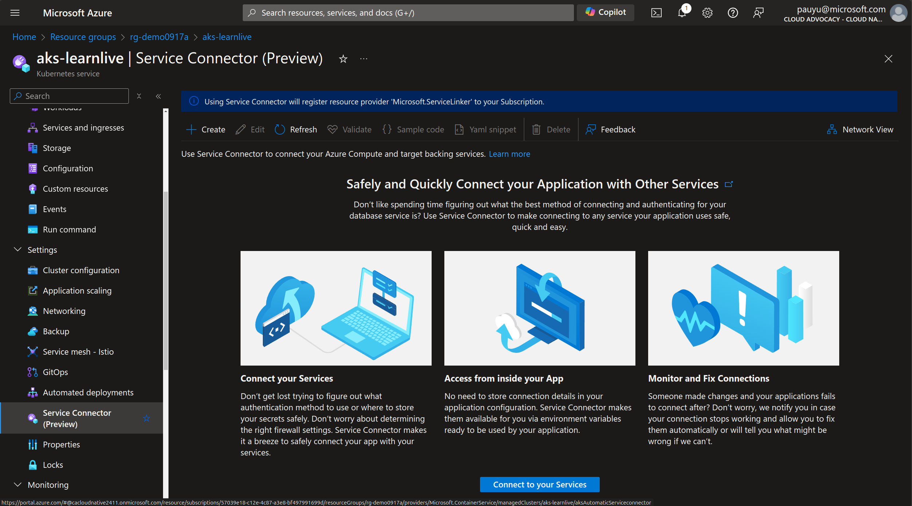

Click the **Connect to your Services** button.

In the **Create connection** pane, enter the following details:

In the **Basics** tab:

- **Kubernetes namesapce:** ccw
- **Service type:** Select **OpenAI Service**
- **Connection name:** Leave as default
- **Subscription:** Select your Azure subscription where the target service is located
- **OpenAI:** Select the OpenAI service
- **Client type:** Leave as default (None)

Click **Next: Authentication**

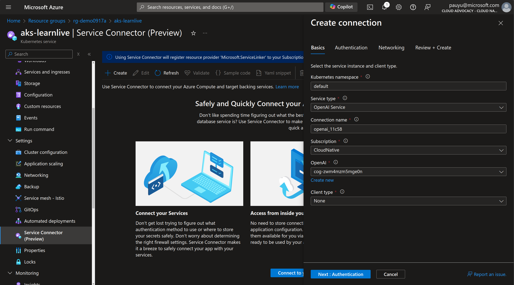

In the **Authentication** tab:

- **Select authentication type:** Select **Workload Identity**
- **Subscription:** Select your Azure subscription where the target managed identity is located
- **User assigned managed identity:** Select the managed identity that was created for you (it'll start with `identity-*`)

Click **Next: Networking**

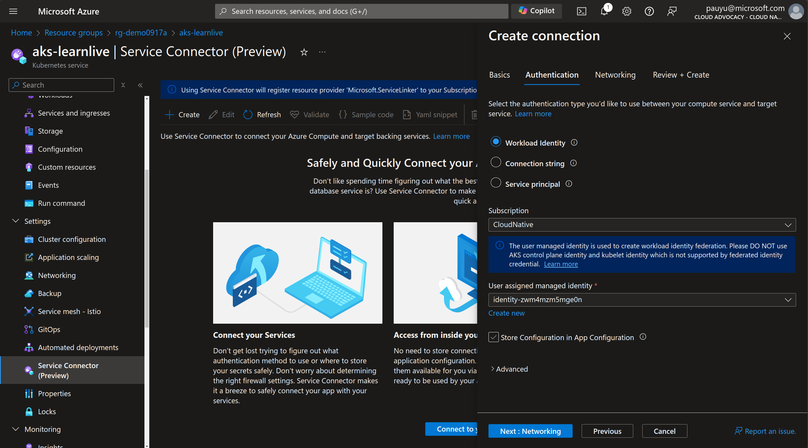

In the **Networking** tab, leave as default, then click **Next: Review + Create**

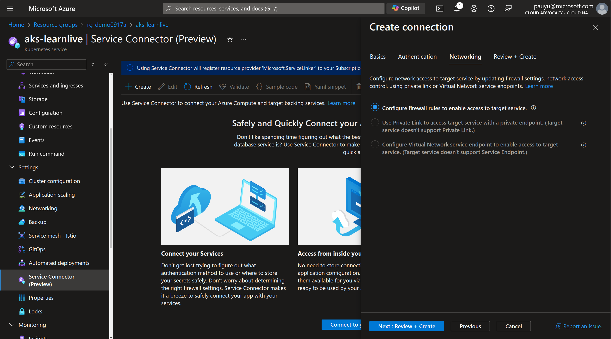

In the **Review + Create** tab:

- Wait for the final validation
- Review the details
- Click **Create**

This will take a few minutes to create the Service Connector.

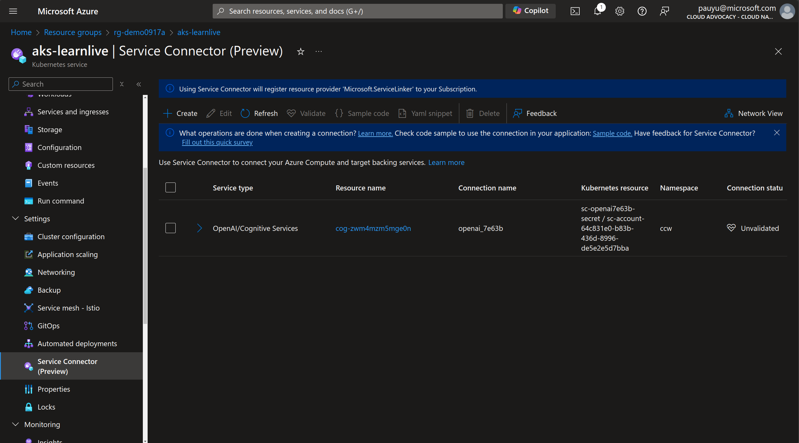

## Update deployment manifest

Deploying the Service Connector took care of the underlying infrastructure bits for you. All you have do now is update your api deployment manifest to enable workload identity and use the newly created Kubernetes ServiceAccount.

Not sure of where to add the configuration? No problem! The Service Connector can help you with that too.

When it is complete, check the checkbox next to the Service Connector, then click the **Yaml snippet** button to view a generic snippet. This gives you an idea of what you need to add to your deployment manifest. But we can actually do better than that. We can have the Service Connector make the changes for us.

Select **Kubernetes Workload** as the **Resource Type**.

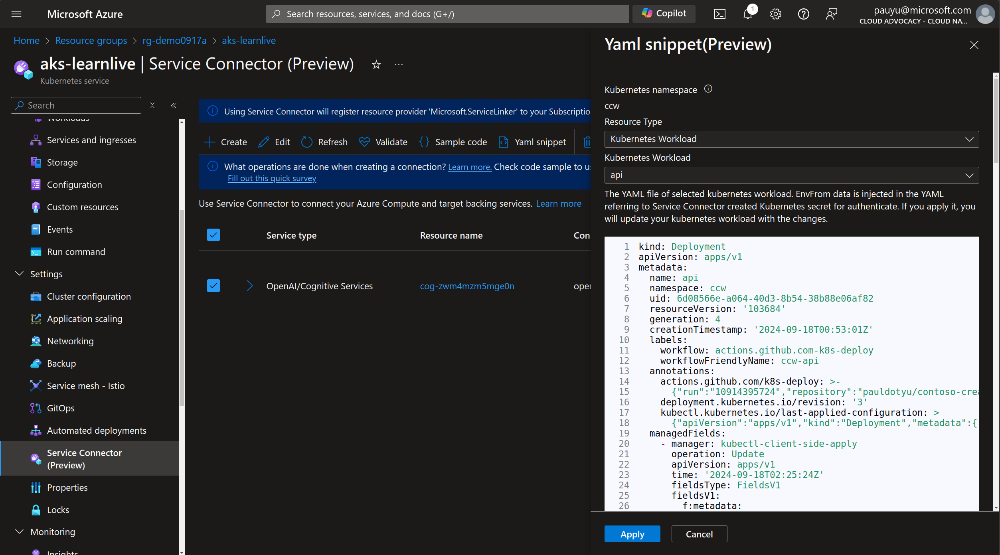

You will see a new dropdown appear. Select the **api** deployment from the **Kubernetes Workload** dropdown.

As you can see, the Service Connector is suggesting changes to the deployment manifest and highlighting the changes so you don't miss them.

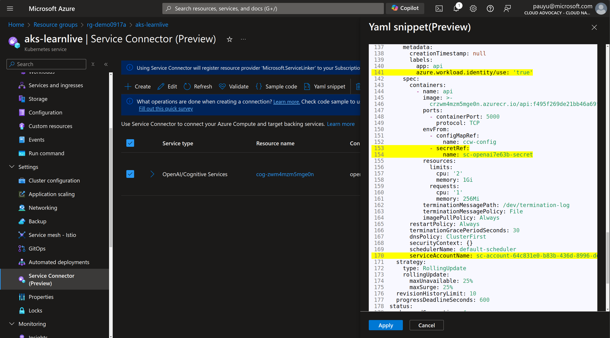

Click the **Apply** button to apply the changes.

This will restart the api deployment with the new configuration.

Click on the **Workloads** tab, then click on the **Pods** tab to view the pods.

Filter by namespace **ccw** and you should see the api pod restarting.

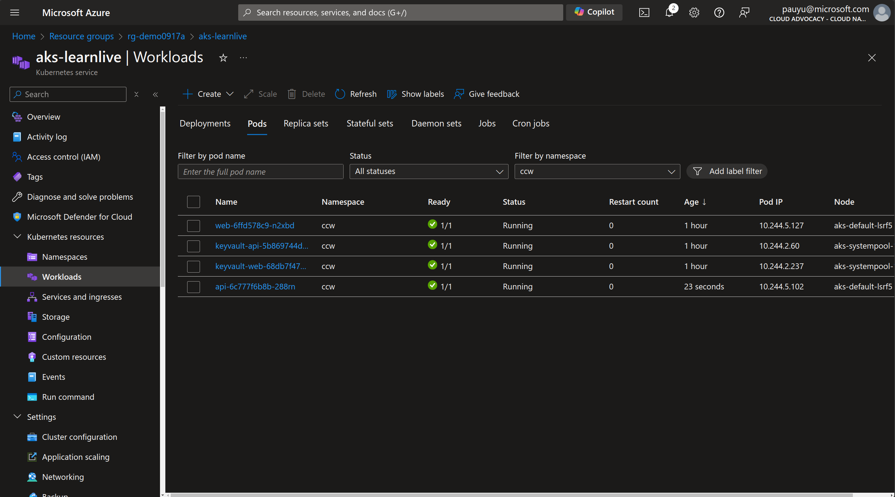

After a few minutes, the pod should be running.

Now we can retest the application.

## Re-test the application

Navigate back to the web app and test the app again. You should see the app working as expected.

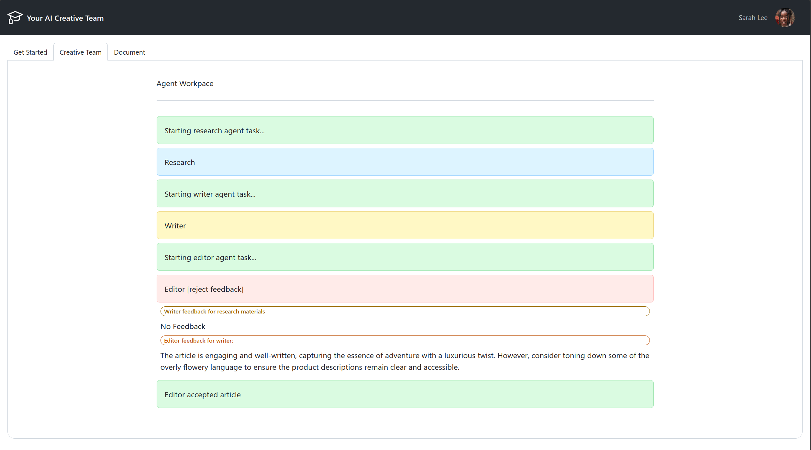

---

# Summary

Congratulations! You have successfully containerized and deployed an AI workload to an AKS Automatic cluster. You have learned how to deploy an AKS Automatic cluster, create ConfigMaps, configure Automated Deployments to publish container images to ACR and deploy Kubernetes manifests, configure ingress, and troubleshoot an application using AKS Container Insights.

With AKS Automatic, we can see how many enterprise ready features are built-in and enabled by default. This allows you to focus on building and deploying your applications without having to worry about the underlying infrastructure. With the addition of AKS Service Connector, configuring Workload Identity is now easier than ever, and Automated Deployments make it easy to consistently deploy new versions of your application as soon as you push changes to your GitHub repository.

## Next steps

Be sure to clean up your resources to avoid incurring any charges. You can do this by deleting the resource group in the Azure portal or running `azd down --force --purge` in your terminal.

## Learn More

- [Azure OpenAI](https://learn.microsoft.com/azure/ai-services/openai/overview)
- [AKS Automatic](https://aka.ms/aks/automatic)
- [AKS Automated Deployments](https://learn.microsoft.com/azure/aks/automated-deployments)
- [AKS App Routing Add-On](https://learn.microsoft.com/azure/aks/app-routing)
- [AKS Service Connector](https://learn.microsoft.com/azure/service-connector/how-to-use-service-connector-in-aks)
- [Writing a Dockerfile](https://docs.docker.com/get-started/docker-concepts/building-images/writing-a-dockerfile/)
- [Docker Compose overview](https://docs.docker.com/compose/)
