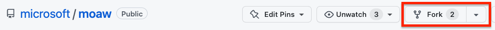
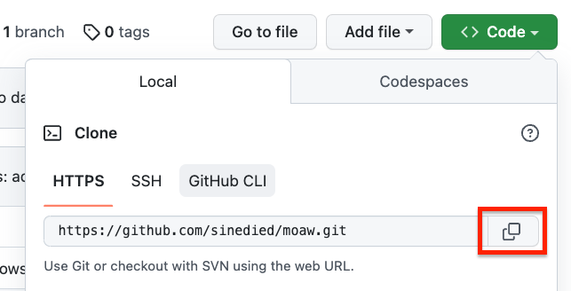
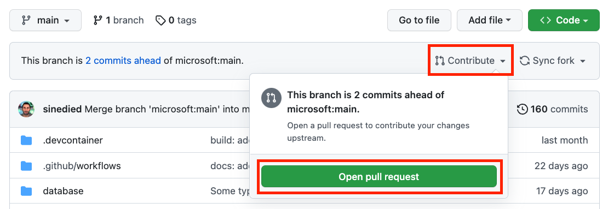
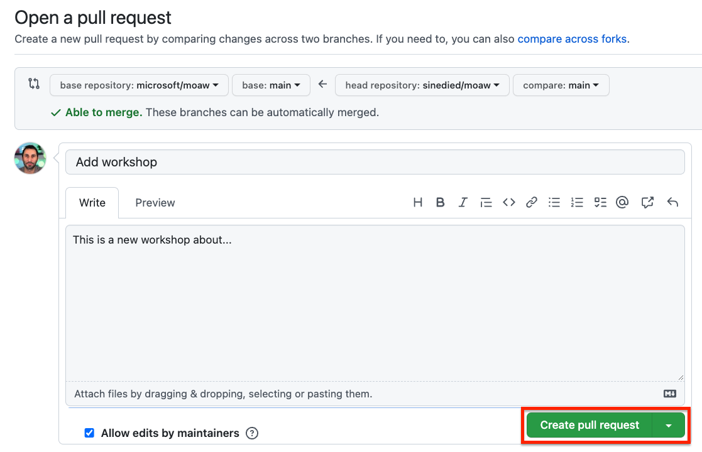

# How to create a new workshop

In this short tutorial, you'll learn how to create 🌟 a new workshop 🌟 and publish it on the [MOAW website](https://microsoft.github.io/moaw/).

## Prerequisites

| | |
|----------------|-----------------|
| Git            | [Download Git](https://git-scm.com) |
| Node.js v16+   | [Download Node.js](https://nodejs.org) |
| GitHub account | [Create free GitHub account](https://github.com/join) |
| A code editor  | [Download VS Code](https://code.visualstudio.com/Download) |
| A browser      | [Download Microsoft Edge](https://www.microsoft.com/edge) |

You can test your setup by opening a terminal and typing:

```sh
git --version
node --version
```

You should see the installed tools version in the terminal.

---

## Initial setup

1. Open https://github.com/microsoft/moaw in your browser, and select the **Fork** button in the top-right corner of the page.
   

2. Select the owner of the fork, and click **Fork**.

3. Select the **Code** button, and copy the URL of the forked repository.
   

4. Open a terminal and clone the forked repository:

   ```sh
    git clone <forked-repo-url>
    ```

5. Navigate to the cloned repository and install the dependencies:

   ```sh
   cd moaw
   npm install
   ```

You're now ready to create a new workshop!

<div class="tip" data-title="tip">

> You only need to do the initial setup once. You can skip it next time you want to create a new workshop.

</div>

---

## Create a new workshop

Open a terminal, and copy the workshop folder `template/workshop` to the `workshops/` folder, and give it a name (you can also do it from your file explorer if you don't have a bash terminal):

```sh
cp -r template/workshop workshops/<your-workshop-name>/
```

<div class="tip" data-title="tip">

> Pick a short but meaninful name for the folder, using the **kebab-case** convention (e.g. `create-workshop`).

</div>

<div class="warning" data-title="warning">

> Make sure sure to add a trailing `/` in the URL, otherwise you might end up with a 404 error.

</div>

### Edit the workshop metadata

Open the file `workshops/<your-workshop-name>/workshop.md` in your code editor, and edit the front matter at the top of the file:

```yaml
---
published: false                        # Optional. Set to true to publish the workshop (default: false)
type: workshop                          # Required.
title: Full workshop title              # Required. Full title of the workshop
short_title: Short title for header     # Optional. Short title displayed in the header
description: This is a workshop for...  # Required.
level: beginner                         # Required. Can be 'beginner', 'intermediate' or 'advanced'
authors:                                # Required. You can add as many authors as needed      
  - Name
contacts:                               # Required. Must match the number of authors
  - Author's email, Twitter...
duration_minutes: 20                    # Required. Estimated duration in minutes
tags: javascript, api, node.js          # Required. Tags for filtering and searching
#banner_url: assets/banner.jpg           # Optional. Should be a 1280x640px image
#video_url: https://youtube.com/link     # Optional. Link to a video of the workshop
#audience: students                      # Optional. Audience of the workshop (students, pro devs, etc.)
#wt_id: <cxa_tracking_id>                # Optional. Set advocacy tracking code for supported links
#oc_id: <marketing_tracking_id>          # Optional. Set marketing tracking code for supported links
#sections_title:                         # Optional. Override titles for each section to be displayed in the side bar
#  - Section 1 title
#  - Section 2 title
---
```

Make sure to fill in all the required fields, and remove or comment the optional fields you don't need. These fields will be used to display the workshop in the website, and feed the search index.

<div class="tip" data-title="tip">

> If your file is not loading, it may be because of a syntax error in the front matter. If you open the console in your browser developer tools with `F12`, you should see an error message indicating the error.

</div>

### Write your workshop

After the front matter, you can start writing your workshop. You can use the [Markdown syntax](http://commonmark.org/help/) to format your text, and add images, code snippets, etc.

<div class="tip" data-title="tip">

> The navigation of the workshop is automatically generated from the headings in the workshop file. You can use any heading level, but we recommend using `h2` for the main sections, and `h3` for the sub-sections. `h1` should only be used for the workshop title.

</div>

### Add sections

You can add sections to your workshop by inserting a line with `---`, preceded and followed by an empty line:

  ```md
  # Section 1
  This is the first section of my workshop.

  ---

  ## Section 2
  This is the second section of my workshop.
  ```

Sections will be split in different pages, and displayed in the side bar of the workshop page.

### Add admonitions

Sometimes, you want to draw attention to specific statements. You can do so by using admonitions, which are special blocks of text that can be used to highlight important information.

There are 5 types of admonitions:
- `info`: highlights specific information
- `tip`: suggests something useful to the reader
- `warning`: advise reader to be careful about something
- `important`: highlights something important
- `task`: asks the reader to complete a task

To add an admonition, use the following syntax:

```md
<div class="info" data-title="Note">

> This is an info admonition.

</div>
```

This will render as:

<div class="info" data-title="Note">

> This is an info admonition.

</div>

The `data-title` attribute is optional, and can be used to add a title to the admonition.

### Add images and resources

Any images or resources you want to use in your workshop should be placed under the `workshops/<your-workshop-name>/\assets/` subfolder. If this folder doesn't exist, you can create it.

You can then reference the images in your workshop using the following syntax:

```md

```

You can also add links to any external resources you may need in your workshop:

```md
[Link text](\assets/code-solution.zip)
```

<div class="info" data-title="Note">

> Locally referenced resources must be placed under the `\assets/` subfolder as because all links starting with `\assets/` or `\./assets/` will be rewritten to point to the `\assets/` folder of the published workshop. If you don't want your link to be rewritten (for example in a code block), you can simply escape it with a backslash, for example: `\\assets/code-solution.zip`.

</div>

### Embed videos

You can embed videos from YouTube in your workshop by copying the embed code from YouTube, and pasting it in your workshop file inside a `div` with the `video-embed` class:

```html
<div class="video-embed">
  <iframe width="560" height="315" src="https://www.youtube.com/embed/zchTNKmay6M" title="YouTube video player" frameborder="0" allow="accelerometer; autoplay; clipboard-write; encrypted-media; gyroscope; picture-in-picture; web-share" allowfullscreen></iframe>
</div>
```

This will render as:

<div class="video-embed">
  <iframe width="560" height="315" src="https://www.youtube.com/embed/zchTNKmay6M" title="YouTube video player" frameborder="0" allow="accelerometer; autoplay; clipboard-write; encrypted-media; gyroscope; picture-in-picture; web-share" allowfullscreen></iframe>
</div>

<div class="info" data-title="Note">

> You can omit the enclosing `<div>` element if you don't want your video to take the full width of the page. It will still be responsive though.

</div>

### Embed audio

You can embed audio files in your workshop by simply using the `<audio>` HTML tag:

```html
<audio controls src="\assets/audio.mp3"></audio>
```

This will render as:

<audio controls src="assets/audio.mp3"></audio>

### Add foldable sections

You can add foldable sections to your workshop by using the following syntax:

```md
<details>
<summary>Click to expand</summary>

This is the content of the foldable section.
You can user *any* **Markdown** syntax as  usual here.

</details>
```

This will render as:

<details>
<summary>Click to expand</summary>

This is the content of the foldable section.
You can user *any* **Markdown** syntax as  usual here.

</details>

---

## Preview your workshop

Once your workshop is ready, you can preview it in your browser to make sure everything looks as intended.

### Test your workshop locally

To preview your workshop locally, you can to start the local development server:

```sh
npm start
```

This will start a local development server on port 4200.

You can then open [`http://localhost:4200/workshop/<your-workshop-name>/`](http://localhost:4200/workshop/<your-workshop-name>/) in your browser to preview your workshop.


#### Use MOAW CLI

You can also use the MOAW cli to preview your workshop locally, even if you are **writing your workshop in another repository**. First, you need to install the MOAW CLI with npm.

```sh
npm install -g @moaw/cli
```

You can then launch the CLI with the `s` command (as in _serve_) and passing the path to your workshop file.

```sh
moaw s docs/workshop.md
```


### Host workshop from your fork

You can also host your workshop directly from your GitHub fork, so that you can share it with your colleagues or friends.

First, commit and push your changes to your fork:

```sh
git add .
git commit -m "Add <my-workshop>"
git push
```

You should now be able to access your workshop using this url:

`https://aka.ms/ws?src=gh:<your-github-username>/moaw/main/workshops/<your-workshop-name>/`.

This is also a convenient way to quickly host your workshop without having to wait for it to be published on the main website.

<div class="info" data-title="Note">

> If you make changes to your workshop, it may take a few minutes after the changes have been pushed to your fork before they are visible on the hosted version, as GitHub caches the content.

</div>

---

## Publish your workshop

When you are ready to publish your workshop, you can submit a pull request to the main repository.

First, update your workshop metadata to set the `published` field to `true`:

```yaml
published: true
```

Then, make sure you have committed and pushed all your changes to your fork:

```sh
git add .
git commit -m "Publish <my-workshop>"
git push
```

<div class="info" data-title="note">

> The `published` field controls whether the workshop is visible on the website workshops list and appears in the search index. Even when set to `false`, your workshop will still be accessible using its direct link, so you can share it privately for review before publishing it.

</div>

### Creating a pull request

Finally, submit a pull request to the main repository:

1. Open your fork on GitHub, select the **Contribute** button then click on the **Open pull request** button:

   

2. Enter a title and description for your pull request, and select the **Create pull request** button:

   

That's it! Your workshop will be published on the main website once the pull request has been reviewed and merged. 🚀
