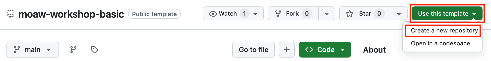
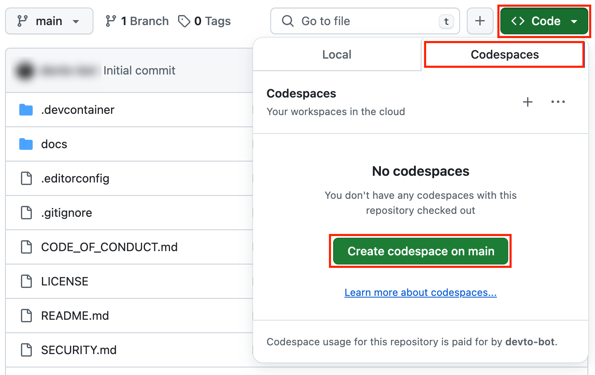

# How to create a new workshop

In this short tutorial, you'll learn how to create 🌟 a new workshop 🌟 and publish it on the [MOAW website](https://microsoft.github.io/moaw/).

## Prerequisites

| | |
|----------------|-------------------------------------|
| Git            | [Download Git](https://git-scm.com) |
| Node.js v20+   | [Download Node.js](https://nodejs.org) |
| GitHub account | [Create free GitHub account](https://github.com/join) |
| A code editor  | [Download VS Code](https://code.visualstudio.com/Download) |
| A browser      | [Download Microsoft Edge](https://www.microsoft.com/edge) |

You can test your setup by opening a terminal and typing:

```sh
git --version
node --version
```

You should see the installed tools version in the terminal.

---

# Create a new workshop

1. Open https://github.com/sinedied/moaw-workshop-basic/ in your browser, select **Use this template** button in the top-right corner of the page, then select **Create a new repository**.
    

2. Enter a name for your repository, make sure it's set to **Public** visibility and select **Create repository**.

3. When the repository is created, you can either clone it locally, or select the **Code** button, then the **Codespaces** tab, and **Create codespace on main** to open the repository in a browser-based development environment.
    

You're now ready to work on your workshop!

<div class="tip" data-title="tip">

> There's also a more [advanced starter template](https://github.com/sinedied/moaw-workshop-advanced) that you can use instead of the basic one, that includes scripts to create one or more packages and setup the initial project structure.

</div>

## Edit the workshop metadata

Open the file `docs/workshop.md` in your code editor, and edit the front matter at the top of the file:

```yaml
---
published: false                        # Optional. Set to true to publish the workshop (default: false)
type: workshop                          # Required.
title: Full workshop title              # Required. Full title of the workshop
short_title: Short title for header     # Optional. Short title displayed in the header
description: This is a workshop for...  # Required.
level: beginner                         # Required. Can be 'beginner', 'intermediate' or 'advanced'
authors:                                # Required. You can add as many authors as needed      
  - Name
contacts:                               # Required. Must match the number of authors
  - Author's email, Twitter...
duration_minutes: 20                    # Required. Estimated duration in minutes
tags: javascript, api, node.js          # Required. Tags for filtering and searching
#banner_url: assets/banner.jpg           # Optional. Should be a 1280x640px image
#video_url: https://youtube.com/link     # Optional. Link to a video of the workshop
#audience: students                      # Optional. Audience of the workshop (students, pro devs, etc.)
#wt_id: <cxa_tracking_id>                # Optional. Set advocacy tracking code for supported links
#oc_id: <marketing_tracking_id>          # Optional. Set marketing tracking code for supported links
#navigation_levels: 2                    # Optional. Number of levels displayed in the side menu (default: 2)
#navigation_numbering: true              # Optional. Enable numbering in the side menu (default: true)
#sections_title:                         # Optional. Override titles for each section to be displayed in the side bar
#  - Section 1 title
#  - Section 2 title
---
```

Make sure to fill in all the required fields, and remove or comment the optional fields you don't need. These fields will be used to display the workshop in the website, and feed the search index.

<div class="tip" data-title="tip">

> If your file is not loading, it may be because of a syntax error in the front matter. If you open the console in your browser developer tools with `F12`, you should see an error message indicating the error.

</div>

## Write your workshop

After the front matter, you can start writing your workshop. You can use the [Markdown syntax](http://commonmark.org/help/) to format your text, and add images, code snippets, etc.

<div class="tip" data-title="tip">

> The navigation of the workshop is automatically generated from the headings in the workshop file. You can use any heading level, but we recommend using `h2` for the main sections, and `h3` for the sub-sections. `h1` should only be used for the workshop title.

</div>

## Add sections

You can add sections to your workshop by inserting a line with `---`, preceded and followed by an empty line:

  ```md
  # Section 1
  This is the first section of my workshop.

  ---

  # Section 2
  This is the second section of my workshop.
  ```

Sections will be split in different pages, and displayed in the side bar of the workshop page.

## Add admonitions

Sometimes, you want to draw attention to specific statements. You can do so by using admonitions, which are special blocks of text that can be used to highlight important information.

There are 5 types of admonitions:
- `info`: highlights specific information
- `tip`: suggests something useful to the reader
- `warning`: advise reader to be careful about something
- `important`: highlights something important
- `task`: asks the reader to complete a task

To add an admonition, use the following syntax:

```md
<div class="info" data-title="Note">

> This is an info admonition.

</div>
```

This will render as:

<div class="info" data-title="Note">

> This is an info admonition.

</div>

The `data-title` attribute is optional, and can be used to add a title to the admonition.

## Add images and resources

Any images or resources you want to use in your workshop should be placed under the `workshops/<your-workshop-name>/\assets/` subfolder. If this folder doesn't exist, you can create it.

You can then reference the images in your workshop using the following syntax:

```md

```

You can also add links to any external resources you may need in your workshop:

```md
[Link text](\assets/code-solution.zip)
```

<div class="info" data-title="Note">

> Locally referenced resources must be placed under the `\assets/` subfolder as because all links starting with `\assets/` or `\./assets/` will be rewritten to point to the `\assets/` folder of the published workshop. If you don't want your link to be rewritten (for example in a code block), you can simply escape it with a backslash, for example: `\\assets/code-solution.zip`.

</div>

## Embed videos

You can embed videos from YouTube in your workshop by copying the embed code from YouTube, and pasting it in your workshop file inside a `div` with the `video-embed` class:

```html
<div class="video-embed">
  <iframe width="560" height="315" src="https://www.youtube.com/embed/zchTNKmay6M" title="YouTube video player" frameborder="0" allow="accelerometer; autoplay; clipboard-write; encrypted-media; gyroscope; picture-in-picture; web-share" allowfullscreen></iframe>
</div>
```

This will render as:

<div class="video-embed">
  <iframe width="560" height="315" src="https://www.youtube.com/embed/zchTNKmay6M" title="YouTube video player" frameborder="0" allow="accelerometer; autoplay; clipboard-write; encrypted-media; gyroscope; picture-in-picture; web-share" allowfullscreen></iframe>
</div>

<div class="info" data-title="Note">

> You can omit the enclosing `<div>` element if you don't want your video to take the full width of the page. It will still be responsive though.

</div>

## Embed audio

You can embed audio files in your workshop by simply using the `<audio>` HTML tag:

```html
<audio controls src="\assets/audio.mp3"></audio>
```

This will render as:

<audio controls src="assets/audio.mp3"></audio>

## Add foldable sections

You can add foldable sections to your workshop by using the following syntax:

```md
<details>
<summary>Click to expand</summary>

This is the content of the foldable section.
You can user *any* **Markdown** syntax as  usual here.

</details>
```

This will render as:

<details>
<summary>Click to expand</summary>

This is the content of the foldable section.
You can user *any* **Markdown** syntax as  usual here.

</details>

## Variables

You can use variables to make some parts of your workshop dynamic. This can be useful to display content that may change depending of the event, for example the name of the event or a link to get specific credits.

To define a variable, add a query parameter to the URL of your workshop with this syntax:

```
?vars=<name>:<value>
```

### Multiple variables

Multiple variables can be defined by separating them with a comma:

```
?vars=<name1>:<value1>,<name2>:<value2>
```

### Variable substitution

To substitute a variable in your workshop, use the following syntax:

```md
Hello \$$name$$!
```

This will render as: Hello $$name$$!

Try clicking on the button below to set the query param `vars=name:John%20Doe` in the URL. You should now see the variable substitution in action.

<button onclick="const url = new window.URL(window.location.href); url.searchParams.set('vars', 'name:John%20Doe'); window.location.href = url">Set variable name</button>

<div class="info" data-title="info">

> If your URL already contains a query string, you must add the variables after the other query values using `&` instead of `?`.

</div>

<div class="tip" data-title="tip">

> If you need to avoid variables replacement, you can escape the variable syntax with a backslash:
>
> ```md
> Hello \\$$name$$!
> ```

</div>

### Default values

You can define a default value for a variable by adding a `:` after the variable name:

```
Hello \$$name:world$$!
```

If the variable is not defined in the URL, the default value will be used, otherwise the value from the URL will be used.

This will render as: Hello $$name:world$$!

## Conditional content

You can add sections in your workshop that will only be visible when a specific variable is set in the URL. This can be useful to add content that is only relevant to a specific audience or event.

```md
<div data-visible="\$$myconf$$">

> This content is *visible* if the variable `myconf` is defined in the URL.

</div>

<div data-hidden="\$$myconf$$">

> This content is **hidden** if the variable `myconf` is defined in the URL.

</div>
```

This will render as:

<div data-visible="$$myconf$$">

> This content is *visible* if the variable `myconf` is defined in the URL.

</div>

<div data-hidden="$$myconf$$">

> This content is **hidden** if the variable `myconf` is defined in the URL.

</div>

Try clicking on the button below to set the query param `vars=myconf:1` in the URL. The first section should now be visible.

<button onclick="const url = new window.URL(window.location.href); url.searchParams.set('vars', 'myconf:1'); window.location.href = url">Set variable myconf</button>


<div class="info" data-title="info">

> If your URL already contains a query string, you must add the variables after the other query values using `&` instead of `?`.

</div>

---

# Preview your workshop

Once your workshop is ready, you can preview it in your browser to make sure everything looks as intended.

## Test your workshop locally

To preview your workshop locally, you can use the MOAW CLI. First, you need to install it with NPM:

```sh
npm install -g @moaw/cli
```

You can then launch the CLI with the `serve` command and passing the path to your workshop file.

```sh
moaw serve docs/workshop.md
```

## Host workshop from your repository

You can also host your workshop directly from your GitHub repository, so that you can share it with other folks.

First, commit and push your changes to your repository:

```sh
git add .
git commit -m "Update <my-workshop>"
git push
```

You should now be able to access your workshop using this url:

`https://aka.ms/ws?src=gh:<your-github-username>/moaw/main/docs/`.

You can also use the MOAW CLI to generate the URL for you:

```sh
moaw link docs/workshop.md
```

<div class="info" data-title="Note">

> If you make changes to your workshop, it may take some time after the changes have been pushed to your repository before they are visible on the hosted version, as GitHub caches the content.

</div>

---

# Publish your workshop

When you are ready to publish your workshop, you can submit a pull request to the main MOAW repository to get your workshop listed on the MOAW website.

## Update workshop metadata

First, you have to update your workshop metadata to set the `published` field to `true`:

```yaml
published: true
```

Then, make sure you have committed and pushed all your changes to your repository:

```sh
git add .
git commit -m "Publish <my-workshop>"
git push
```

<div class="info" data-title="note">

> The `published` field controls whether the workshop is visible on the website workshops list and appears in the search index. Even when set to `false`, your workshop will still be accessible using its direct link, so you can share it privately for review before publishing it.

</div>

## Creating a pull request on the MOAW repository

Next, we'll create an entry for your workshop to get it listed on the MOAW website.

1. Edit the `external.yml` file by opening [this link](https://github.com/microsoft/moaw/edit/main/packages/database/external.yml) in your browser.

2. Select the **Fork this repository** button to create a fork of the MOAW repository, which will allow you to make changes to the file.

3. Add an entry for your workshop at the end of the file, following the existing format (most of these fields are identical to your workshop metadata):
    ```yaml
    - title: Full workshop title              # Required. Title of the workshop
      description: This is a workshop for...  # Required. Short description of the workshop
      url: https://workshop.url               # Required. URL of the workshop
      language: en                            # Required. Language of the workshop, using 2-letter ISO code
      last_updated: 2019-10-21                # Required. Date of the last update of the workshop
      type: workshop                          # Required. Only 'workshop' is supported for now
      level: beginner                         # Required. Can be 'beginner', 'intermediate' or 'advanced'
      github_url: https://github.url          # Optional. URL of the workshop's GitHub repository
      authors:                                # Required. You can add as many authors as needed
        - Name                          
      contacts:                               # Required. Must match the number of authors
        - Author's email, Twitter...
      banner_url: https://banner.url          # Optional. URL of a banner image for the workshop (1280x640px)
      video_url: https://youtube.com/link     # Optional. Link to a video of the workshop
      duration_minutes: 120                   # Required. Estimated duration in minutes
      audience: students, pro devs            # Optional. Audience of the workshop (students, pro devs, etc.)
      tags: javascript, api, node.js          # Required. Tags for filtering and searching
    ```

    <div class="important" data-title="important">

    > Make sure to keep the indentation consistent with the rest of the file, otherwise the YAML file will be invalid.

    </div>

4. Once you've completed the entry for your workshop, scroll up and select the **Commit changes...** button to save your changes to the file.

5. Enter a commit message, and select the **Propose changes** button to move to the next step.

6. Select the **Create pull request** button to create a pull request with your changes.

That's it! Your workshop will be published on the main website once the pull request has been reviewed and merged. 🚀
