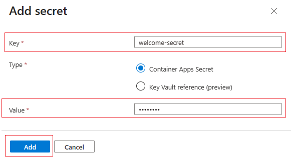
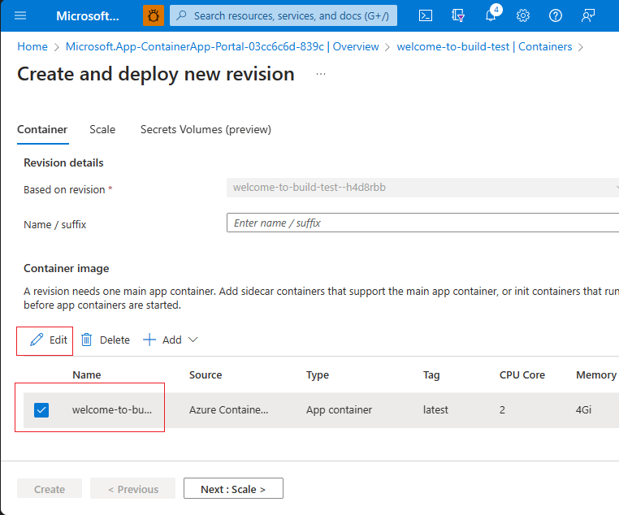
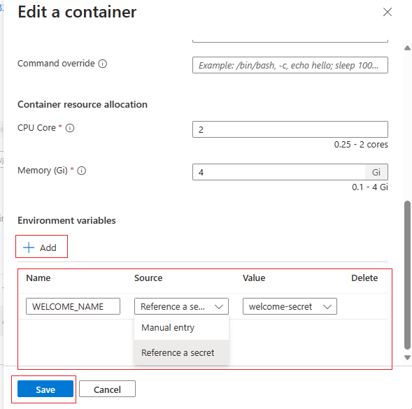
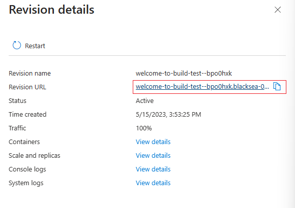

# Deploying to Azure Container Apps

In this workshop, you'll learn how deploy a containerized application to Azure Container Apps. Azure Container Apps allows you to deploy containerized applications without having to manage the underlying infrastructure, leaving you to focus on your application.

## Objectives

You'll learn how to:
- Create an Azure Container Apps environment
- Deploy a web application to Azure Container Apps
- Allow access to the web application with an external ingress
- Deploy revisions of the web application

## Prerequisites

| | |
|----------------------|------------------------------------------------------|
| Azure account        | [Get a free Azure account](https://azure.microsoft.com/free) |
| Azure CLI            | [Install Azure CLI](https://docs.microsoft.com/en-us/cli/azure/install-azure-cli) |
| Docker               | [Install Docker](https://docs.docker.com/get-docker/) |
| Git                 | [Install Git](https://git-scm.com/downloads) |

---

## Build and Push the Container Image

In this section, you'll build and push a container image to Azure Container Registry (ACR). That image will be used in the next section to deploy a container app to Azure Container Apps.

### Log in to the Azure CLI

Run the following command to log in to the Azure CLI:

```powershell
az login
```

### Create a resource group 

<details>
<summary>PowerShell</summary>

```powershell
$resource_group='myResourceGroup'
$location='northcentralus'

New-AzResourceGroup `
  -Name $resource_group `
  -Location $location
```

</details>

<details>
<summary>Bash</summary>

```bash
resource_group='myResourceGroup'
location='northcentralus'

az group create \
  --name $resource_group \
  --location $location
```

</details>


### Deploy an Azure Container Registry instance

Next, run the following command to deploy an Azure Container Registry instance:

<details>
<summary>PowerShell</summary>

```powershell
$random = Get-Random -Minimum 1000 -Maximum 9999
$acr_name="myRegistry$random"

az acr create `
  --name $acr_name `
  --resource-group $resource_group `
  --sku Basic `
  --admin-enabled true `
  --location $location
```

</details>

<details>
<summary>Bash</summary>

```bash
random=$RANDOM
acr_name="myRegistry$random"

az acr create \
  --name $acr_name \
  --resource-group $resource_group \
  --sku Basic \
  --admin-enabled true \
  --location $location
```

</details>


### Log in to Azure Container Registry

Run the following commands to log in to your ACR instance:


```powershell
az acr login --name $acr_name
```

### Create a container image and push it to ACR

Clone the [Deploying to Azure Container Apps](https://github.com/duffney/deploying-to-aca) repository to your local machine using the following command:

```powershell
git clone 'https://github.com/duffney/deploying-to-aca.git'
```

Change into the root of the repository and create a container image using the following command:

```powershell
cd deploying-to-azure-container-apps;
```

Next, build the container image using the following command:

<details>
<summary>PowerShell</summary>

```powershell
$image_name='webapp'
$tag='v1.0'

az acr build --registry $acr_name --image "$acr_name.azurecr.io/${image_name}:${tag}" .
```

</details>

<details>
<summary>Bash</summary>

```bash
image_name='webapp'
tag='v1.0'

az acr build --registry $acr_name --image "$acr_name.azurecr.io/$image_name:$tag" .
```

</details>

---

## Deploy a Container image to Azure Container Apps

In this section, you'll deploy a containerized Go web application to Azure Container Apps. The application will be accessible via an external ingress and will use environment variables and Azure Container Registry secrets to modify the application's behavior.

### Add the containerapp extension to the Azure CLI

Run the following command to add the containerapp extension to the Azure CLI:

```powershell
az extension add --name containerapp
```

### Create an Azure Container Apps environment

An Azure Container Apps environment is a logical grouping of resources that are used to deploy containerized applications. Within an environment, you can deploy one or more container apps and share resources such as a container registry and secrets.

Run the following command to create an Azure Container Apps environment:

<details>

<summary>PowerShell</summary>

```powershell
$container_app_environment_name='myContainerAppEnvironment'

az containerapp env create `
  --name $container_app_environment_name `
  --resource-group $resource_group `
  --location $location
```

</details>

<details>

<summary>Bash</summary>

```bash
container_app_environment_name='myContainerAppEnvironment'

az containerapp env create \
  --name $container_app_environment_name \
  --resource-group $resource_group \
  --location $location
```

</details>

### Create the container app

Container apps define the container image to deploy, the environment variables to set, and the secrets and or volumes to mount. You can pull imags from Azure Container Registry or Docker Hub and set environment variables and secrets from Azure Key Vault. Container apps can also be deployed with an external ingress, which allows you to access the application from outside the environment. Internal ingress is also available, which allows you to access the application from within the environment.

Run the following commands to create a container app:

<details>

<summary>PowerShell</summary>

```powershell
$container_app_name='myContainerApp'
$token=az acr login --name $acr_name --expose-token --output tsv --query accessToken;
$login_server=az acr show --name $acr_name --query loginServer --output tsv;

az containerapp create `
    --name $container_app_name `
    --resource-group $resource_group `
    --environment $container_app_environment_name  `
    --image "$login_server/${image_name}:${tag}" `
    --target-port 8080 `
    --ingress 'external' `
    --registry-server $login_server `
    --registry-username 00000000-0000-0000-0000-000000000000 `
    --registry-password $token `
    --query properties.configuration.ingress.fqdn --output tsv
```

</details>

<details>

<summary>Bash</summary>

```bash
container_app_name='myContainerApp'
token=$(az acr login --name $acr_name --expose-token --output tsv --query accessToken);
login_server=$(az acr show --name $acr_name --query loginServer --output tsv);

az containerapp create \
    --name $container_app_name \
    --resource-group $resource_group \
    --environment $container_app_environment_name  \
    --image "$login_server/$image_name:$tag" \
    --target-port 8080 \
    --ingress 'external' \
    --registry-server $login_server \
    --registry-username 00000000-0000-0000-0000-000000000000 \
    --registry-password $token \
    --query properties.configuration.ingress.fqdn --output tsv
```

</details>

<div class="task" data-title="Task">

> Browse to the URL returned by the command to view the application. 

</div>

---

## Deploy a Revision

In this section, you'll deploy a revision of the container app. 

Revisions allow you to deploy new versions of the container app without having to create a new container app. Revisions can be deployed with a new container image, environment variables, secrets, and volumes. 

You'll trigger a new deployment by updating updating the container app's environment variables using a contanier app secret.

### Create a secret

In the [Azure Portal](https://portal.azure.com/), navigate to your Azure Container App that was deployed to the `rg-user<userNumber>` resource group. 

Next, follow the steps below to create a secret:

1. Select **Secrets** from the left-hand menu under **Settings**.
2. Select **+ Add**.
3. Enter `welcome-secret` as the secret's **Key**.
4. Leave **Container Apps Secret** selected.
5. Enter your name for the **Value**.
6. Click **Add**.



### Edit the container app

Next, you need to update the container app to use the new secret as an environment variable to change the configuration of the web app. Once the seed is updated, a new revision will be deployed.

Follow the steps below to update the container app:

1. Select **Containers** from the left-hand menu under **Application**.
2. Click **Edit and Deploy**.
3. Check the box next to your container app, and then click **Edit**.



### Add the secret to the container app as an environment variable

Once the container app is open for editing, follow the steps below to add the secret as an environment variable:

1. Under **Environment Variables**, click **+ Add**.
2. Enter `WELCOME_NAME` for the **Name**.
3. Select `Reference a secret` as the source.
4. Then, select `welcome-secret` as the **Value**.
5. Click **Save**.
6. Click **Create** to deploy the new revision.



### View the new revision

Once the container app is updated, a new revision will be deployed. Follow the steps below to view the new revision:

1. Select **Revision Management** from the left-hand menu under **Application**.
2. Click the revision with the latest **Created** date.
3. Click the link next to the **Revision URL** to view the application.




</details>

<div class="task" data-title="Task">

> Return to the Web App and refresh the page to see the new message.

</div>
