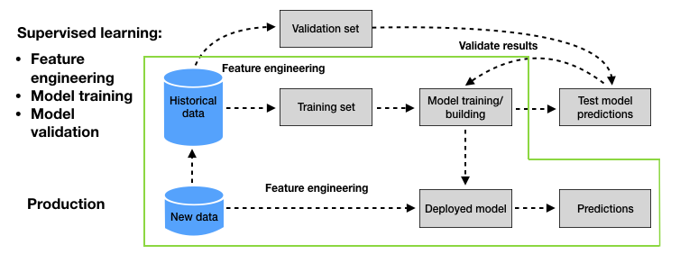

# Introduction
Imagine you are a financial analyst or data scientist interested in detecting and preventing credit card fraud. This workshop is designed to walk through the process of building a baseline credit card fraud detection model using Microsoft Fabric.

The workshop will cover how to leverage the data engineering and data science workloads for feature transformation and building a credit card fraud detection model.

In this workshop, you will learn how to:
- Load data into a lakehouse
- Analyzing data using the SQL Endpoint
- Perform feature transformation using Spark
- Data processing and preparation using Data Wrangling in Microsoft Fabric
- Model Selection, Construction and Evaluation using the Data Science Workload in Microsoft Fabric
- Using Experiments in Microsoft Fabric to manage and track your models




<div class="info" data-title="Citation">

> *The work in this workshop is based on the dataset and general workflow from the online book* **Le Borgne, Y.-A., Siblini, W., Lebichot, B., & Bontempi, G. (2022). Reproducible Machine Learning for Credit Card Fraud Detection - Practical Handbook. Université Libre de Bruxelles. Retrieved from [https://fraud-detection-handbook.github.io/fraud-detection-handbook](https://fraud-detection-handbook.github.io/fraud-detection-handbook)**
</div> 
 


---

# Pre-requisites

To complete this workshop you will need the following:

1. Familiarity with basic data concepts and terminology. 
2. A [Microsoft 365 account for Power BI Service](https://learn.microsoft.com/power-bi/enterprise/service-admin-signing-up-for-power-bi-with-a-new-office-365-trial?WT.mc_id=data-91115-davidabu)
3. A [Microsoft Fabric License](https://learn.microsoft.com/en-us/fabric/enterprise/licenses?WT.mc_id=data-91115-jndemenge) or [Start the Fabric (Preview) trial](https://learn.microsoft.com/en-us/fabric/get-started/fabric-trial?WT.mc_id=data-91115-jndemenge#start-the-fabric-preview-trial)
4. A [Workspace in Microsoft Fabric](https://learn.microsoft.com/fabric/data-warehouse/tutorial-create-workspace?WT.mc_id=data-91115-davidabu)
5. Make sure your Workspace has the Data Model settings activated 
    - Click **Workspace settings**
    - Click **Power BI**
    - Open **Power BI** and **Click General**
    - **Check** the small box with "Users can edit data models in Power BI service

---

# Loading Data into Lakehouse

We will clone the repository tha contains the raw simulated credit card transaction data and load it into the lakehouse. Clone the repository to your local machine using the following command:

```bash
git clone https://github.com/Fraud-Detection-Handbook/simulated-data-raw.git
```

The raw data is in the `.pkl` format, we'll  load it to the Lakehouse, perform transformations and save it in the `.parquet` format.

Back to the Lakehouse, right click on the `Files` directory, select `Upload` and click `Upload folder`. On the pop-up window, select the data folder contained in the cloned repository and click `Upload`.


Once the upload is complete, you should see the data folder in the `Files` directory.

Next, we'll create a new notebook to transform the data from `.pkl` files into a single Delta Parquet table.

Click on the `Open Notebook` button on the top and select `New Notebook`. Once the notebook is open, click on the notebook name and rename it to `load_data`.


Copy the following code into the notebook and run it.

```python
import os
import pandas as pd
from pyspark.sql import SparkSession

# Create or get the Spark session
spark = SparkSession.builder.appName("PickleFileProcessor").getOrCreate()

# Directory containing pickle files
pkl_data_path = '/lakehouse/default/Files/data/'

# Initialize an empty list to store Pandas DataFrames
pandas_dfs = []

# Read each pickle file using Pandas
for pickle_file_name in os.listdir(pkl_data_path):
    # Read pickle file using Pandas
    pandas_df = pd.read_pickle(os.path.join(pkl_data_path, pickle_file_name))
    pandas_dfs.append(pandas_df)

# Concatenate all Pandas DataFrames into one DataFrame
concatenated_df = pd.concat(pandas_dfs)

# Convert the concatenated Pandas DataFrame to a Spark DataFrame
transactions_df = spark.createDataFrame(concatenated_df)

# Save to a delta table with overwrite mode
delta_table_path = 'Tables/customer_cc_transactions'
transactions_df.write.format("delta").mode("overwrite").save(delta_table_path)
```
This loads `1754155` transactions into the lakehouse, you can find the newly created `customer_cc_transactions` table in the `Tables` directory.

You can check this by running the following code in a new notebook.

```python
transactions_df.count()
```

Now that we have the data in the lakehouse, we can start exploring it and performing transformations.

---

# Feature Transformation using Spark

Back to the Lakehouse create a new notebook and name it `feature_transformation`.

Copy the following code into the notebook and run it.

```python
transactions_df = spark.table("FraudDetection_LH.customer_cc_transactions")

# convert to pandas dataframe
transactions_df = transactions_df.toPandas()

# print the number of transactions and the number of fraudulent transactions
print(f"{transactions_df.shape[0]} transactions loaded, containing {transactions_df['TX_FRAUD'].sum()} fraudulent transactions")
```

This loads the transactions table into a Pandas DataFrame and prints the number of transactions and the number of fraudulent transactions. you should see that there are `1754155` transactions, containing `14681` fraudulent transactions.

Next, we'll create two new binary features from the transaction dates and times:

- `TX_DURING_WEEKEND`: 0 for weekday transactions, 1 for weekend transactions.
- `TX_DURING_NIGHT`: 0 for transactions during the day, 1 for transactions during the night (between 0pm and 6am).

We will compute binary value for the `TX_DURING_WEEKEND` by defining a function `is_weekend` that takes the transaction date as input and returns the corresponding binary value.

```python
def is_weekend(tx_datetime):
    
    # Transform date into weekday (0 is Monday, 6 is Sunday)
    weekday = tx_datetime.weekday()
    # Binary value: 0 if weekday, 1 if weekend
    is_weekend = weekday>=5
    
    return int(is_weekend)
```
Next, we'll apply the function to the `TX_DATETIME` column.

```python
transactions_df['TX_DURING_WEEKEND']=transactions_df.TX_DATETIME.apply(is_weekend)
```

Similarly, we compute the  binary value for the `TX_DURING_NIGHT` feature and apply it to the `TX_DATETIME` column.

```python
def is_night(tx_datetime):
    
    # Get the hour of the transaction
    tx_hour = tx_datetime.hour
    # Binary value: 1 if hour less than 6, and 0 otherwise
    is_night = tx_hour<=6
    
    return int(is_night)

transactions_df['TX_DURING_NIGHT']=transactions_df.TX_DATETIME.apply(is_night)
```

Next, we'll perform transformations on the Customer ID, where we create two computed features:

- `CUSTOMER_ID_NB_TX`: Number of transactions for each customer within a time window (one, seven, or thirty days).
- `CUSTOMER_ID_AVG_AMOUNT`: Average transaction amount for each customer again within the same time window as above.

we'll define a function `get_customer_spending_behavior_features` that takes the the set of transactions for a customer and a set of window sizes as input and returns the six computed features.

This relies on the rolling function, which allows us to compute aggregates over a sliding time window.

```python
def get_count_risk_rolling_window(terminal_transactions, delay_period=7, windows_size_in_days=[1,7,30], feature="TERMINAL_ID"):
    
    terminal_transactions=terminal_transactions.sort_values('TX_DATETIME')
    
    terminal_transactions.index=terminal_transactions.TX_DATETIME
    
    NB_FRAUD_DELAY=terminal_transactions['TX_FRAUD'].rolling(str(delay_period)+'d').sum()
    NB_TX_DELAY=terminal_transactions['TX_FRAUD'].rolling(str(delay_period)+'d').count()
    
    for window_size in windows_size_in_days:
    
        NB_FRAUD_DELAY_WINDOW=terminal_transactions['TX_FRAUD'].rolling(str(delay_period+window_size)+'d').sum()
        NB_TX_DELAY_WINDOW=terminal_transactions['TX_FRAUD'].rolling(str(delay_period+window_size)+'d').count()
    
        NB_FRAUD_WINDOW=NB_FRAUD_DELAY_WINDOW-NB_FRAUD_DELAY
        NB_TX_WINDOW=NB_TX_DELAY_WINDOW-NB_TX_DELAY
    
        RISK_WINDOW=NB_FRAUD_WINDOW/NB_TX_WINDOW
        
        terminal_transactions[feature+'_NB_TX_'+str(window_size)+'DAY_WINDOW']=list(NB_TX_WINDOW)
        terminal_transactions[feature+'_RISK_'+str(window_size)+'DAY_WINDOW']=list(RISK_WINDOW)
        
    terminal_transactions.index=terminal_transactions.TRANSACTION_ID
    
    # Replace NA values with 0 (all undefined risk scores where NB_TX_WINDOW is 0) 
    terminal_transactions.fillna(0,inplace=True)
    
    return terminal_transactions
```

Next, we'll apply the function to the transactions DataFrame to create the computed features.

```python
transactions_df=transactions_df.groupby('CUSTOMER_ID').apply(lambda x: get_customer_spending_behaviour_features(x, windows_size_in_days=[1,7,30]))
transactions_df=transactions_df.sort_values('TX_DATETIME').reset_index(drop=True)
```
Next we'll perform transformations on the Terminal ID. These transformations will help to extract the risk score for each terminal ID to assess the exposure of a given terminal ID to fraudulent transactions.

We'll compute the risk score using the function `get_count_risk_rolling_window`. The function takes the DataFrame of transactions for a given terminal ID, the delay period, and a list of window sizes as input and returns the risk score for each transaction, along with the number of transactions for each window size.

```python
def get_count_risk_rolling_window(terminal_transactions, delay_period=7, windows_size_in_days=[1,7,30], feature="TERMINAL_ID"):
    
    # Ensure the DataFrame is sorted by TX_DATETIME
    terminal_transactions = terminal_transactions.orderBy('TX_DATETIME')

    # Window specification for the delay period
    window_spec_delay = Window.orderBy(F.col('TX_DATETIME').cast('long')).rangeBetween(-delay_period * 86400, 0)

    # Calculate rolling sums for the delay period
    NB_FRAUD_DELAY = F.sum('TX_FRAUD').over(window_spec_delay)
    NB_TX_DELAY = F.count('TX_FRAUD').over(window_spec_delay)

    # Create new columns for delay period calculations
    terminal_transactions = terminal_transactions.withColumn('NB_FRAUD_DELAY', NB_FRAUD_DELAY)
    terminal_transactions = terminal_transactions.withColumn('NB_TX_DELAY', NB_TX_DELAY)

    for window_size in windows_size_in_days:
        # Window specification for the delay + window period
        window_spec = Window.orderBy(F.col('TX_DATETIME').cast('long')).rangeBetween(-(delay_period + window_size) * 86400, 0)

        # Calculate rolling sums for the delay + window period
        NB_FRAUD_DELAY_WINDOW = F.sum('TX_FRAUD').over(window_spec)
        NB_TX_DELAY_WINDOW = F.count('TX_FRAUD').over(window_spec)

        # Calculate the difference
        NB_FRAUD_WINDOW = NB_FRAUD_DELAY_WINDOW - F.col('NB_FRAUD_DELAY')
        NB_TX_WINDOW = NB_TX_DELAY_WINDOW - F.col('NB_TX_DELAY')

        # Calculate risk
        RISK_WINDOW = (NB_FRAUD_WINDOW / NB_TX_WINDOW).alias(feature + '_RISK_' + str(window_size) + 'DAY_WINDOW')

        # Add columns for each window size
        terminal_transactions = terminal_transactions.withColumn(feature + '_NB_TX_' + str(window_size) + 'DAY_WINDOW', NB_TX_WINDOW)
        terminal_transactions = terminal_transactions.withColumn(feature + '_RISK_' + str(window_size) + 'DAY_WINDOW', RISK_WINDOW)

    # Replace NA values with 0
    terminal_transactions = terminal_transactions.na.fill(0)

    return terminal_transactions
```

Next, we'll apply the function to the transactions DataFrame to create the computed features.

```python
transactions_df=transactions_df.groupby('TERMINAL_ID').apply(lambda x: get_count_risk_rolling_window(x, delay_period=7, windows_size_in_days=[1,7,30], feature="TERMINAL_ID"))
transactions_df=transactions_df.sort_values('TX_DATETIME').reset_index(drop=True)
```

Now that we have the computed features, we can save the DataFrame as a Delta table. 
```python
cc_tx_transformed = spark.createDataFrame(transactions_df)

table_name = 'cc_tx_transformed'

cc_tx_transformed.write.mode("overwrite").format("delta").save("Tables/" + table_name)
```

Now that we have the transformed data, in the next section we'll cover Model Selection, Construction and Evaluation using the Data Science Workload in Microsoft Fabric.

---

# Model Selection, Construction and Evaluation

In this section, we'll use the Data Science Workload in Microsoft Fabric to build a credit card fraud detection model.

On the bottom left of your workspace select the `Data Science` workload. An on the next page click on `Experiment` to create a new experiment.


Provide an experiment name, `FraudDetection_Exp` and click create.

On the experiment canvas click on `Start with a new Notebook` to create a new notebook in the experiment. Rename the notebook to `Baseline_FDS`.

On the left explorer pane click `Add Lakehouse` selcet `Existing lakehouse` in the dialog box that pops up and click add. Next select the lakehouse you created earlier and click `Add`. You should see the lakehouse in the explorer pane.

Load the transformed data into a spark DataFrame, to get started.

```python
# Define date range for the query
BEGIN_DATE = "2018-07-25"
END_DATE = "2018-08-14"

# Execute SQL query and load data into DataFrame
transactions_df = spark.sql(f"SELECT * FROM cc_tx_transformed WHERE TX_DATETIME >= '{BEGIN_DATE}' AND TX_DATETIME <= '{END_DATE}'")
transactions_df = transactions_df.toPandas()

print("{0} transactions loaded, containing {1} fraudulent transactions".format(len(transactions_df),transactions_df.TX_FRAUD.sum()))
```
Now that we have loaded the dataset, the next steps will be to define our training set which is used to train the prediction model and the testing set used for evaluating the model. 

We will use the transactions from the 2018-07-25 to the 2018-07-31 for the training set, and from the 2018-08-08 to the 2018-08-14 for the test set.

To begin, load and plot data from July 25 to August 14, 2018, focusing on the daily count of total transactions, fraudulent transactions, and fraudulent cards. This step will help in understanding the data's pattern and distribution. 

```python
import pandas as pd
import datetime

# Compute the number of transactions per day, fraudulent transactions per day and fraudulent cards per day

def get_tx_stats(transactions_df, start_date_df="2018-04-01"):
    
    #Number of transactions per day
    nb_tx_per_day=transactions_df.groupby(['TX_TIME_DAYS'])['CUSTOMER_ID'].count()
    #Number of fraudulent transactions per day
    nb_fraudulent_transactions_per_day=transactions_df.groupby(['TX_TIME_DAYS'])['TX_FRAUD'].sum()
    #Number of compromised cards per day
    nb_compromised_cards_per_day=transactions_df[transactions_df['TX_FRAUD']==1].groupby(['TX_TIME_DAYS']).CUSTOMER_ID.nunique()
    
    tx_stats=pd.DataFrame({"nb_tx_per_day":nb_tx_per_day,
                           "nb_fraudulent_transactions_per_day":nb_fraudulent_transactions_per_day,
                           "nb_compromised_cards_per_day":nb_compromised_cards_per_day})

    tx_stats=tx_stats.reset_index()
    
    start_date = datetime.datetime.strptime(start_date_df, "%Y-%m-%d")
    tx_date=start_date+tx_stats['TX_TIME_DAYS'].apply(datetime.timedelta)
    
    tx_stats['tx_date']=tx_date
    
    return tx_stats

tx_stats=get_tx_stats(transactions_df, start_date_df="2018-04-01")
```

Next make the plots:

```python
import matplotlib.pyplot as plt
import matplotlib.dates as mdates

# Plot the number of transactions per day, fraudulent transactions per day and fraudulent cards per day

def get_template_tx_stats(ax ,fs,
                          start_date_training,
                          title='',
                          delta_train=7,
                          delta_delay=7,
                          delta_test=7,
                          ylim=300):
    
    ax.set_title(title, fontsize=fs*1.5)
    ax.set_ylim([0, ylim])
    
    ax.set_xlabel('Date', fontsize=fs)
    ax.set_ylabel('Number', fontsize=fs)
    
    plt.yticks(fontsize=fs*0.7) 
    plt.xticks(fontsize=fs*0.7)    

    ax.axvline(start_date_training+datetime.timedelta(days=delta_train), 0,ylim, color="black")
    ax.axvline(start_date_test, 0, ylim, color="black")
    
    ax.text(start_date_training+datetime.timedelta(days=2), ylim-20,'Training period', fontsize=fs)
    ax.text(start_date_training+datetime.timedelta(days=delta_train+2), ylim-20,'Delay period', fontsize=fs)
    ax.text(start_date_training+datetime.timedelta(days=delta_train+delta_delay+2), ylim-20,'Test period', fontsize=fs)
    

cmap = plt.get_cmap('jet')
colors={'nb_tx_per_day':cmap(0), 
        'nb_fraudulent_transactions_per_day':cmap(200), 
        'nb_compromised_cards_per_day':cmap(250)}

fraud_and_transactions_stats_fig, ax = plt.subplots(1, 1, figsize=(15,8))

# Training period
start_date_training = datetime.datetime.strptime("2018-07-25", "%Y-%m-%d")
delta_train = delta_delay = delta_test = 7

end_date_training = start_date_training+datetime.timedelta(days=delta_train-1)

# Test period
start_date_test = start_date_training+datetime.timedelta(days=delta_train+delta_delay)
end_date_test = start_date_training+datetime.timedelta(days=delta_train+delta_delay+delta_test-1)

get_template_tx_stats(ax, fs=20,
                      start_date_training=start_date_training,
                      title='Total transactions, and number of fraudulent transactions \n and number of compromised cards per day',
                      delta_train=delta_train,
                      delta_delay=delta_delay,
                      delta_test=delta_test
                     )

ax.plot(tx_stats['tx_date'], tx_stats['nb_tx_per_day']/50, color=colors['nb_tx_per_day'], label = '# transactions per day (/50)')
ax.plot(tx_stats['tx_date'], tx_stats['nb_fraudulent_transactions_per_day'], color=colors['nb_fraudulent_transactions_per_day'], label = '# fraudulent txs per day')
ax.plot(tx_stats['tx_date'], tx_stats['nb_compromised_cards_per_day'], color=colors['nb_compromised_cards_per_day'], label = '# compromised cards per day')

ax.legend(loc = 'upper left',bbox_to_anchor=(1.05, 1),fontsize=20)

# Set the date format for the x-axis
ax.xaxis.set_major_formatter(mdates.DateFormatter('%Y-%m-%d'))

# Set the locator to display a date every N days (e.g., every 7 days)
days_interval = 3
ax.xaxis.set_major_locator(mdates.DayLocator(interval=days_interval))

# Add gridlines for both x and y axes
ax.grid(True, which='both', axis='both', linestyle='--', linewidth=0.5)
```

The plot illustrates that the number of transactions and frauds is similar in the training and test periods. The average number of frauds is around 85 per day. Let us extract from the dataset the transactions for the training set and the test set.

```python
def scaleData(train, test, features):
  """
  Scale the features of the train and test datasets using StandardScaler.

  Parameters:
  train (DataFrame): The training dataset.
  test (DataFrame): The test dataset.
  features (list): List of features to be scaled.

  Returns:
  tuple: A tuple containing the scaled train and test datasets.
  """

  # Create a StandardScaler object
  scaler = sklearn.preprocessing.StandardScaler()

  # Fit the scaler on the training features
  scaler.fit(train[features])

  # Scale the features of the train dataset
  train[features] = scaler.transform(train[features])

  # Scale the features of the test dataset
  test[features] = scaler.transform(test[features])

  return (train, test)


def get_train_test_set(transactions_df,
             start_date_training,
             delta_train=7, delta_delay=7, delta_test=7):
  """
  Get the training set and test set from the transactions dataset.

  Parameters:
  transactions_df (DataFrame): The transactions dataset.
  start_date_training (datetime): The start date of the training period.
  delta_train (int): The duration of the training period in days.
  delta_delay (int): The delay period in days.
  delta_test (int): The duration of the test period in days.

  Returns:
  tuple: A tuple containing the training set and test set DataFrames.
  """

  # Get the training set data
  train_df = transactions_df[(transactions_df.TX_DATETIME >= start_date_training) &
                 (transactions_df.TX_DATETIME < start_date_training + datetime.timedelta(days=delta_train))]

  # Get the test set data
  test_df = []

  # Note: Cards known to be compromised after the delay period are removed from the test set
  # That is, for each test day, all frauds known at (test_day-delay_period) are removed

  # First, get known defrauded customers from the training set
  known_defrauded_customers = set(train_df[train_df.TX_FRAUD == 1].CUSTOMER_ID)

  # Get the relative starting day of training set (easier than TX_DATETIME to collect test data)
  start_tx_time_days_training = train_df.TX_TIME_DAYS.min()

  # Then, for each day of the test set
  for day in range(delta_test):

    # Get test data for that day
    test_df_day = transactions_df[transactions_df.TX_TIME_DAYS == start_tx_time_days_training +
                                  delta_train + delta_delay +
                                  day]

    # Compromised cards from that test day, minus the delay period, are added to the pool of known defrauded customers
    test_df_day_delay_period = transactions_df[transactions_df.TX_TIME_DAYS == start_tx_time_days_training +
                                        delta_train +
                                        day - 1]

    new_defrauded_customers = set(test_df_day_delay_period[test_df_day_delay_period.TX_FRAUD == 1].CUSTOMER_ID)
    known_defrauded_customers = known_defrauded_customers.union(new_defrauded_customers)

    test_df_day = test_df_day[~test_df_day.CUSTOMER_ID.isin(known_defrauded_customers)]

    test_df.append(test_df_day)

  test_df = pd.concat(test_df)

  # Sort data sets by ascending order of transaction ID
  train_df = train_df.sort_values('TRANSACTION_ID')
  test_df = test_df.sort_values('TRANSACTION_ID')

  return (train_df, test_df)
  
  # split the data to train and test sets
  (train_df, test_df)=get_train_test_set(transactions_df,start_date_training, delta_train=7,delta_delay=7,delta_test=7)
  
```

## Model Training & Assessment
In the context of fraud detection, our objective is to determine whether a transaction is fraudulent or genuine. To do this, we define the input and output features as follows:

```python
# Output Feature: This is what we want to predict. In our case, it's the label of the transaction, known as TX_FRAUD, which indicates if the transaction is fraudulent.
output_feature="TX_FRAUD"

# Input Features: These are the data points we use to make the prediction. The primary input feature is the transaction amount, labeled as TX_AMOUNT. Additionally, we will use various other features that were identified in the previous section, which help to provide a comprehensive picture of each transaction's circumstances.
input_features=['TX_AMOUNT','TX_DURING_WEEKEND', 'TX_DURING_NIGHT', 'CUSTOMER_ID_NB_TX_1DAY_WINDOW',
  'CUSTOMER_ID_AVG_AMOUNT_1DAY_WINDOW', 'CUSTOMER_ID_NB_TX_7DAY_WINDOW',
  'CUSTOMER_ID_AVG_AMOUNT_7DAY_WINDOW', 'CUSTOMER_ID_NB_TX_30DAY_WINDOW',
  'CUSTOMER_ID_AVG_AMOUNT_30DAY_WINDOW', 'TERMINAL_ID_NB_TX_1DAY_WINDOW',
  'TERMINAL_ID_RISK_1DAY_WINDOW', 'TERMINAL_ID_NB_TX_7DAY_WINDOW',
  'TERMINAL_ID_RISK_7DAY_WINDOW', 'TERMINAL_ID_NB_TX_30DAY_WINDOW',
  'TERMINAL_ID_RISK_30DAY_WINDOW']
```
Next we will be using **Sklearn for Model Training**: WInitially, we will focus on a standard classifier, specifically a decision tree model.

We'll develop a function called `fit_model_and_get_predictions`. This function will:
  - Accept a sklearn classifier (prediction model), a training set, a test set, and the input and output features as inputs.
  - Train the classifier using the `fit` method with the training set.
  - Generate predictions for both the training and test sets using the `predict_proba` method of the classifier.
  - Return a dictionary that includes the trained classifier, predictions for the training and test sets, and the execution times for training and making predictions.

```python
import time

def fit_model_and_get_predictions(classifier, train_df, test_df, 
                                  input_features, output_feature="TX_FRAUD",scale=True):

    # By default, scales input data
    if scale:
        (train_df, test_df)=scaleData(train_df,test_df,input_features)
    
    # We first train the classifier using the `fit` method, and pass as arguments the input and output features
    start_time=time.time()
    classifier.fit(train_df[input_features], train_df[output_feature])
    training_execution_time=time.time()-start_time

    # We then get the predictions on the training and test data using the `predict_proba` method
    # The predictions are returned as a numpy array, that provides the probability of fraud for each transaction 
    start_time=time.time()
    predictions_test=classifier.predict_proba(test_df[input_features])[:,1]
    prediction_execution_time=time.time()-start_time
    
    predictions_train=classifier.predict_proba(train_df[input_features])[:,1]

    # The result is returned as a dictionary containing the fitted models, 
    # and the predictions on the training and test sets
    model_and_predictions_dictionary = {'classifier': classifier,
                                        'predictions_test': predictions_test,
                                        'predictions_train': predictions_train,
                                        'training_execution_time': training_execution_time,
                                        'prediction_execution_time': prediction_execution_time
                                       }
    
  return model_and_predictions_dictionary
```

To begin with let us train a small decision tree with a maximum depth of 2.

```python
import sklearn

# We first create a decision tree object. We will limit its depth to 2 for interpretability, 
# and set the random state to zero for reproducibility
classifier = sklearn.tree.DecisionTreeClassifier(max_depth = 2, random_state=0)

model_and_predictions_dictionary = fit_model_and_get_predictions(classifier, train_df, test_df, input_features, output_feature,scale=False)
```

Finally, we'll assess our decision tree model's effectiveness using three key metrics: AUC ROC, Average Precision (AP), and Card Precision Top-k (CP@k).

The Card Precision Top-k (CP@k) is a practical and interpretable metric. It's based on the reality that only a limited number of cards, say 100, can be checked daily for fraud. This metric ranks the most suspicious transactions each day and then calculates the precision, which is the ratio of actual to predicted fraudulent cards. The CP@k is the average of these daily precision values.

Average Precision (AP) is a broader measure. It considers the precision for all possible cut-off points, not just a fixed number like in CP@k. It's a comprehensive metric, integrating the precision across various thresholds.

The AUC ROC, or Area Under the Receiver Operating Characteristic curve, is another critical measure. While it's widely used, it's less practical for our needs as it focuses more on performance at higher thresholds. In fraud detection, performance at lower thresholds is usually more relevant.

All these metrics range from 0 to 1, with higher values indicating better performance.

```python
from sklearn import metrics
import numpy as np

def card_precision_top_k_day(df_day,top_k):
    
    # This takes the max of the predictions AND the max of label TX_FRAUD for each CUSTOMER_ID, 
    # and sorts by decreasing order of fraudulent prediction
    df_day = df_day.groupby('CUSTOMER_ID').max().sort_values(by="predictions", ascending=False).reset_index(drop=False)
            
    # Get the top k most suspicious cards
    df_day_top_k=df_day.head(top_k)
    list_detected_compromised_cards=list(df_day_top_k[df_day_top_k.TX_FRAUD==1].CUSTOMER_ID)
    
    # Compute precision top k
    card_precision_top_k = len(list_detected_compromised_cards) / top_k
    
    return list_detected_compromised_cards, card_precision_top_k

def card_precision_top_k(predictions_df, top_k, remove_detected_compromised_cards=True):

    # Sort days by increasing order
    list_days=list(predictions_df['TX_TIME_DAYS'].unique())
    list_days.sort()
    
    # At first, the list of detected compromised cards is empty
    list_detected_compromised_cards = []
    
    card_precision_top_k_per_day_list = []
    nb_compromised_cards_per_day = []
    
    # For each day, compute precision top k
    for day in list_days:
        
        df_day = predictions_df[predictions_df['TX_TIME_DAYS']==day]
        df_day = df_day[['predictions', 'CUSTOMER_ID', 'TX_FRAUD']]
        
        # Let us remove detected compromised cards from the set of daily transactions
        df_day = df_day[df_day.CUSTOMER_ID.isin(list_detected_compromised_cards)==False]
        
        nb_compromised_cards_per_day.append(len(df_day[df_day.TX_FRAUD==1].CUSTOMER_ID.unique()))
        
        detected_compromised_cards, card_precision_top_k = card_precision_top_k_day(df_day,top_k)
        
        card_precision_top_k_per_day_list.append(card_precision_top_k)
        
        # Let us update the list of detected compromised cards
        if remove_detected_compromised_cards:
            list_detected_compromised_cards.extend(detected_compromised_cards)
        
    # Compute the mean
    mean_card_precision_top_k = np.array(card_precision_top_k_per_day_list).mean()
    
    # Returns precision top k per day as a list, and resulting mean
    return nb_compromised_cards_per_day,card_precision_top_k_per_day_list,mean_card_precision_top_k

def performance_assessment(predictions_df, output_feature='TX_FRAUD', 
                           prediction_feature='predictions', top_k_list=[100],
                           rounded=True):
    
    AUC_ROC = metrics.roc_auc_score(predictions_df[output_feature], predictions_df[prediction_feature])
    AP = metrics.average_precision_score(predictions_df[output_feature], predictions_df[prediction_feature])
    
    performances = pd.DataFrame([[AUC_ROC, AP]], 
                           columns=['AUC ROC','Average precision'])
    
    for top_k in top_k_list:
    
        _, _, mean_card_precision_top_k = card_precision_top_k(predictions_df, top_k)
        performances['Card Precision@'+str(top_k)]=mean_card_precision_top_k
        
    if rounded:
        performances = performances.round(3)
    
    return performances
```

Next compute the performance in terms of AUC ROC, Average Precision (AP), and Card Precision top 100 (CP@100) for the decision tree.
```python
predictions_df=test_df
predictions_df['predictions']=model_and_predictions_dictionary['predictions_test']
    
performance_assessment(predictions_df, top_k_list=[100])
```
---

# Resources
- [Data science in Microsoft Fabric - Microsoft Fabric](https://learn.microsoft.com/en-us/fabric/data-science/data-science-overview?WT.mc_id=data-114675-jndemenge)

- [Data science tutorial - get started - Microsoft Fabric](https://learn.microsoft.com/en-us/fabric/data-science/tutorial-data-science-introduction?WT.mc_id=data-114675-jndemenge)

- [Machine learning model - Microsoft Fabric | Microsoft Learn](https://learn.microsoft.com/en-us/fabric/data-science/machine-learning-model?WT.mc_id=data-114675-jndemenge)

- [Tutorial: Train and register machine learning models - Microsoft Fabric](https://learn.microsoft.com/en-us/fabric/data-science/tutorial-data-science-train-models?WT.mc_id=data-114675-jndemenge)

- [Accelerate data prep with Data Wrangler - Microsoft Fabric](https://learn.microsoft.com/en-us/fabric/data-science/data-wrangler?WT.mc_id=data-114675-jndemenge)

- [Preprocess data with Data Wrangler in Microsoft Fabric](https://learn.microsoft.com/en-us/training/modules/preprocess-data-with-data-wrangler-microsoft-fabric?WT.mc_id=data-114675-jndemenge)

- [Explore and transform Spark data with Data Wrangler](https://learn.microsoft.com/en-us/fabric/data-science/data-wrangler-spark?WT.mc_id=data-114675-jndemenge)

- [Machine learning experiment - Microsoft Fabric | Microsoft Learn](https://learn.microsoft.com/en-us/fabric/data-science/machine-learning-experiment?WT.mc_id=data-114675-jndemenge)

---

# Appendix
