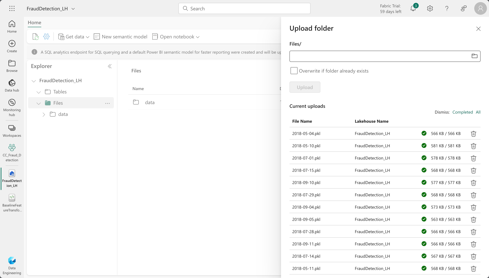
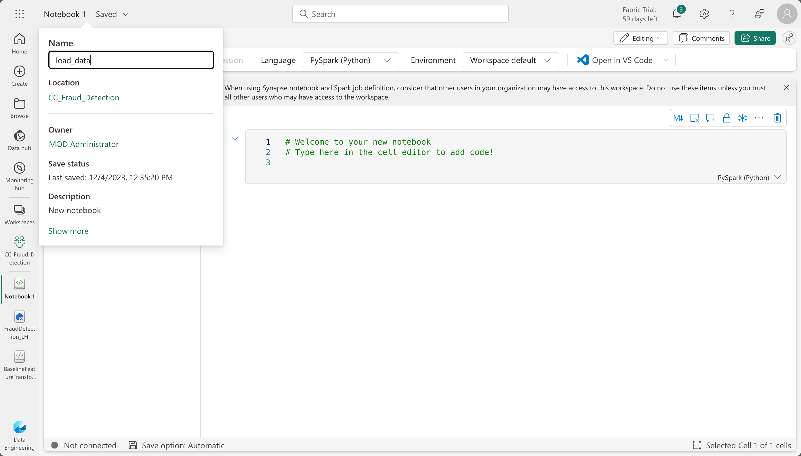

# Introduction

# Loading Data into Lakehouse
We will clone the repository tha contains the raw simulated credit card transaction data and load it into the lakehouse. Clone the repository to your local machine using the following command:

```bash
git clone https://github.com/Fraud-Detection-Handbook/simulated-data-raw.git
```

The raw data is in the `.pkl` format, we'll  load it to the Lakehouse, perform transformations and save it in the `.parquet` format.

Back to the Lakehouse, right click on the `Files` directory, select `Upload` and click `Upload folder`. On the pop-up window, select the data folder contained in the cloned repository and click `Upload`.



Once the upload is complete, you should see the data folder in the `Files` directory.

Next, we'll create a new notebook to transform the data from `.pkl` files into a single Delta Parquet table.

Click on the `Open Notebook` button on the top and select `New Notebook`. Once the notebook is open, click on the notebook name and rename it to `load_data`.



Copy the following code into the notebook and run it.

```python
import os
import pandas as pd
from pyspark.sql import SparkSession

# Create or get the Spark session
spark = SparkSession.builder.appName("PickleFileProcessor").getOrCreate()

# Directory containing pickle files
pkl_data_path = '/lakehouse/default/Files/data/'

# Initialize an empty list to store Pandas DataFrames
pandas_dfs = []

# Read each pickle file using Pandas
for pickle_file_name in os.listdir(pkl_data_path):
    # Read pickle file using Pandas
    pandas_df = pd.read_pickle(os.path.join(pkl_data_path, pickle_file_name))
    pandas_dfs.append(pandas_df)

# Concatenate all Pandas DataFrames into one DataFrame
concatenated_df = pd.concat(pandas_dfs)

# Convert the concatenated Pandas DataFrame to a Spark DataFrame
transactions_df = spark.createDataFrame(concatenated_df)

# Save to a delta table with overwrite mode
delta_table_path = 'Tables/customer_cc_transactions'
transactions_df.write.format("delta").mode("overwrite").save(delta_table_path)
```
This loads `1754155` transactions into the lakehouse, you can find the newly created `customer_cc_transactions` table in the `Tables` directory.

You can check this by running the following code in a new notebook.

```python
transactions_df.count()
```

Now that we have the data in the lakehouse, we can start exploring it and performing transformations.

# Feature Transformation using Spark
Back to the Lakehouse create a new notebook and name it `feature_transformation`.

Copy the following code into the notebook and run it.

```python
transactions_df = spark.table("FraudDetection_LH.customer_cc_transactions")

# convert to pandas dataframe
transactions_df = transactions_df.toPandas()

# print the number of transactions and the number of fraudulent transactions
print(f"{transactions_df.shape[0]} transactions loaded, containing {transactions_df['TX_FRAUD'].sum()} fraudulent transactions")
```

This loads the transactions table into a Pandas DataFrame and prints the number of transactions and the number of fraudulent transactions. you should see that there are `1754155` transactions, containing `14681` fraudulent transactions.

Next, we'll create two new binary features from the transaction dates and times:

- `TX_DURING_WEEKEND`: 0 for weekday transactions, 1 for weekend transactions.
- `TX_DURING_NIGHT`: 0 for transactions during the day, 1 for transactions during the night (between 0pm and 6am).

We will compute binary value for the `TX_DURING_WEEKEND` by defining a function `is_weekend` that takes the transaction date as input and returns the corresponding binary value.

```python
def is_weekend(tx_datetime):
    
    # Transform date into weekday (0 is Monday, 6 is Sunday)
    weekday = tx_datetime.weekday()
    # Binary value: 0 if weekday, 1 if weekend
    is_weekend = weekday>=5
    
    return int(is_weekend)
```
Next, we'll apply the function to the `TX_DATETIME` column.

```python
transactions_df['TX_DURING_WEEKEND']=transactions_df.TX_DATETIME.apply(is_weekend)
```

Similarly, we compute the  binary value for the `TX_DURING_NIGHT` feature and apply it to the `TX_DATETIME` column.

```python
def is_night(tx_datetime):
    
    # Get the hour of the transaction
    tx_hour = tx_datetime.hour
    # Binary value: 1 if hour less than 6, and 0 otherwise
    is_night = tx_hour<=6
    
    return int(is_night)

transactions_df['TX_DURING_NIGHT']=transactions_df.TX_DATETIME.apply(is_night)
```

Next, we'll perform transformations on the Customer ID, where we create two computed features:

- `CUSTOMER_ID_NB_TX`: Number of transactions for each customer within a time window (one, seven, or thirty days).
- `CUSTOMER_ID_AVG_AMOUNT`: Average transaction amount for each customer again within the same time window as above.

we'll define a function `get_customer_spending_behavior_features` that takes the the set of transactions for a customer and a set of window sizes as input and returns the six computed features.

This relies on the rolling function, which allows us to compute aggregates over a sliding time window.

```python
def get_count_risk_rolling_window(terminal_transactions, delay_period=7, windows_size_in_days=[1,7,30], feature="TERMINAL_ID"):
    
    terminal_transactions=terminal_transactions.sort_values('TX_DATETIME')
    
    terminal_transactions.index=terminal_transactions.TX_DATETIME
    
    NB_FRAUD_DELAY=terminal_transactions['TX_FRAUD'].rolling(str(delay_period)+'d').sum()
    NB_TX_DELAY=terminal_transactions['TX_FRAUD'].rolling(str(delay_period)+'d').count()
    
    for window_size in windows_size_in_days:
    
        NB_FRAUD_DELAY_WINDOW=terminal_transactions['TX_FRAUD'].rolling(str(delay_period+window_size)+'d').sum()
        NB_TX_DELAY_WINDOW=terminal_transactions['TX_FRAUD'].rolling(str(delay_period+window_size)+'d').count()
    
        NB_FRAUD_WINDOW=NB_FRAUD_DELAY_WINDOW-NB_FRAUD_DELAY
        NB_TX_WINDOW=NB_TX_DELAY_WINDOW-NB_TX_DELAY
    
        RISK_WINDOW=NB_FRAUD_WINDOW/NB_TX_WINDOW
        
        terminal_transactions[feature+'_NB_TX_'+str(window_size)+'DAY_WINDOW']=list(NB_TX_WINDOW)
        terminal_transactions[feature+'_RISK_'+str(window_size)+'DAY_WINDOW']=list(RISK_WINDOW)
        
    terminal_transactions.index=terminal_transactions.TRANSACTION_ID
    
    # Replace NA values with 0 (all undefined risk scores where NB_TX_WINDOW is 0) 
    terminal_transactions.fillna(0,inplace=True)
    
    return terminal_transactions
```

Next, we'll apply the function to the transactions DataFrame to create the computed features.

```python
transactions_df=transactions_df.groupby('CUSTOMER_ID').apply(lambda x: get_customer_spending_behaviour_features(x, windows_size_in_days=[1,7,30]))
transactions_df=transactions_df.sort_values('TX_DATETIME').reset_index(drop=True)
```
Next we'll perform transformations on the Terminal ID. These transformations will help to extract the risk score for each terminal ID to assess the exposure of a given terminal ID to fraudulent transactions.

We'll compute the risk score using the function `get_count_risk_rolling_window`. The function takes the DataFrame of transactions for a given terminal ID, the delay period, and a list of window sizes as input and returns the risk score for each transaction, along with the number of transactions for each window size.

```python
def get_count_risk_rolling_window(terminal_transactions, delay_period=7, windows_size_in_days=[1,7,30], feature="TERMINAL_ID"):
    
    # Ensure the DataFrame is sorted by TX_DATETIME
    terminal_transactions = terminal_transactions.orderBy('TX_DATETIME')

    # Window specification for the delay period
    window_spec_delay = Window.orderBy(F.col('TX_DATETIME').cast('long')).rangeBetween(-delay_period * 86400, 0)

    # Calculate rolling sums for the delay period
    NB_FRAUD_DELAY = F.sum('TX_FRAUD').over(window_spec_delay)
    NB_TX_DELAY = F.count('TX_FRAUD').over(window_spec_delay)

    # Create new columns for delay period calculations
    terminal_transactions = terminal_transactions.withColumn('NB_FRAUD_DELAY', NB_FRAUD_DELAY)
    terminal_transactions = terminal_transactions.withColumn('NB_TX_DELAY', NB_TX_DELAY)

    for window_size in windows_size_in_days:
        # Window specification for the delay + window period
        window_spec = Window.orderBy(F.col('TX_DATETIME').cast('long')).rangeBetween(-(delay_period + window_size) * 86400, 0)

        # Calculate rolling sums for the delay + window period
        NB_FRAUD_DELAY_WINDOW = F.sum('TX_FRAUD').over(window_spec)
        NB_TX_DELAY_WINDOW = F.count('TX_FRAUD').over(window_spec)

        # Calculate the difference
        NB_FRAUD_WINDOW = NB_FRAUD_DELAY_WINDOW - F.col('NB_FRAUD_DELAY')
        NB_TX_WINDOW = NB_TX_DELAY_WINDOW - F.col('NB_TX_DELAY')

        # Calculate risk
        RISK_WINDOW = (NB_FRAUD_WINDOW / NB_TX_WINDOW).alias(feature + '_RISK_' + str(window_size) + 'DAY_WINDOW')

        # Add columns for each window size
        terminal_transactions = terminal_transactions.withColumn(feature + '_NB_TX_' + str(window_size) + 'DAY_WINDOW', NB_TX_WINDOW)
        terminal_transactions = terminal_transactions.withColumn(feature + '_RISK_' + str(window_size) + 'DAY_WINDOW', RISK_WINDOW)

    # Replace NA values with 0
    terminal_transactions = terminal_transactions.na.fill(0)

    return terminal_transactions
```

Next, we'll apply the function to the transactions DataFrame to create the computed features.

```python
transactions_df=transactions_df.groupby('TERMINAL_ID').apply(lambda x: get_count_risk_rolling_window(x, delay_period=7, windows_size_in_days=[1,7,30], feature="TERMINAL_ID"))
transactions_df=transactions_df.sort_values('TX_DATETIME').reset_index(drop=True)
```

Now that we have the computed features, we can save the DataFrame as a Delta table. 
```python
cc_tx_transformed = spark.createDataFrame(transactions_df)

table_name = 'cc_tx_transformed'

cc_tx_transformed.write.mode("overwrite").format("delta").save("Tables/" + table_name)
```

Now that we have the transformed data, in the next section we'll cover Model Selection, Construction and Evaluation using the Data Science Workload in Microsoft Fabric.

# Model Selection, Construction and Evaluation
In this section, we'll use the Data Science Workload in Microsoft Fabric to build a credit card fraud detection model.

On the bottom left of your workspace select the `Data Science` workload. An on the next page click on `Experiment` to create a new experiment.


Provide an experiment name, `FraudDetection_Exp` and click create.

On the experiment canvas click on `Start with a new Notebook` to create a new notebook in the experiment. Rename the notebook to `Baseline_FDS`.

On the left explorer pane click `Add Lakehouse` selcet `Existing lakehouse` in the dialog box that pops up and click add. Next select the lakehouse you created earlier and click `Add`. You should see the lakehouse in the explorer pane.

Load the transformed data into a spark DataFrame, to get started.

```python
transactions_df = spark.sql('SELECT * FROM cc_tx_transformed WHERE TX_DATETIME>="2018-07-25" AND TX_DATETIME <= "2018-08-14"')

transactions_df = transactions_df.toPandas()

print("{0} transactions loaded, containing {1} fraudulent transactions".format(len(transactions_df),transactions_df.TX_FRAUD.sum()))
```


