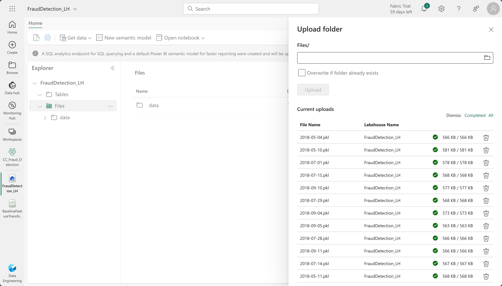
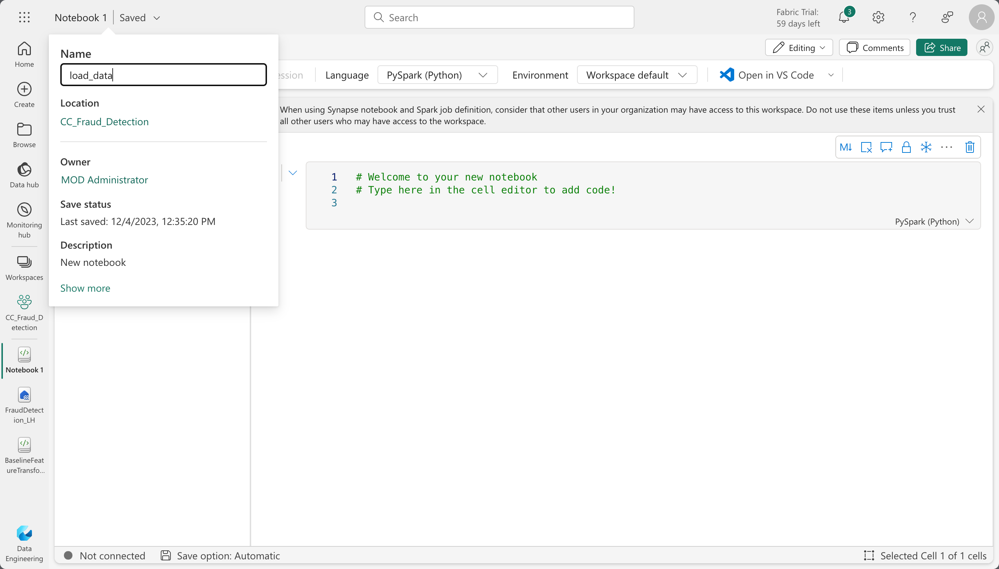

# Introduction

# Loading Data into Lakehouse
We will clone the repository tha contains the raw simulated credit card transaction data and load it into the lakehouse. Clone the repository to your local machine using the following command:

```bash
git clone https://github.com/Fraud-Detection-Handbook/simulated-data-raw.git
```

The raw data is in the `.pkl` format, we'll  load it to the Lakehouse, perform transformations and save it in the `.parquet` format.

Back to the Lakehouse, right click on the `Files` directory, select `Upload` and click `Upload folder`. On the pop-up window, select the data folder contained in the cloned repository and click `Upload`.



Once the upload is complete, you should see the data folder in the `Files` directory.

Next, we'll create a new notebook to transform the data from `.pkl` files into a single Delta Parquet table.

Click on the `Open Notebook` button on the top and select `New Notebook`. Once the notebook is open, click on the notebook name and rename it to `load_data`.



Copy the following code into the notebook and run it.

```python
import os
import pandas as pd

# Directory containing pickle files
pkl_data_path = '/lakehouse/default/Files/data/'

# Read each pickle file using Pandas and convert to Spark DataFrame since spark does not support reading pkl files natively
spark_dfs = []
for pickle_file_name in os.listdir(pkl_data_path):
  # Read pickle file using Pandas
  pandas_df = pd.read_pickle(os.path.join(pkl_data_path, pickle_file_name))
  # Convert Pandas DataFrame to Spark DataFrame
  spark_df = spark.createDataFrame(pandas_df)
  spark_dfs.append(spark_df)

# Concatenate all Spark DataFrames
transactions = spark_dfs[0]
for df in spark_dfs[1:]:
  transactions = transactions.union(df)

# Save to a delta table
delta_table_path = 'Tables/' + 'customer_cc_transactions'
transactions.write.format("delta").save(delta_table_path)
```
This loads `1754155` transactions into the lakehouse, you can find the newly created `customer_cc_transactions` table in the `Tables` directory.

Now that we have the data in the lakehouse, we can start exploring it and performing transformations.

# Feature Transformation using Spark
Back to the Lakehouse create a new notebook and name it `feature_transformation`.

Copy the following code into the notebook and run it.

```python
transactions_df = spark.table("FraudDetection_LH.customer_cc_transactions")
print("{0} transactions loaded, containing {1} fraudulent transactions".format(transactions_df.count(), transactions_df.groupBy().sum('TX_FRAUD').collect()[0][0]))
```

This loads the transactions table into a Spark DataFrame and prints the number of transactions and the number of fraudulent transactions. you should see that there are `1754155` transactions, containing `14681` fraudulent transactions.

Next, we'll create two new binary features from the transaction dates and times:

- `TX_DURING_WEEKEND`: 0 for weekday transactions, 1 for weekend transactions.
- `TX_DURING_NIGHT`: 0 for transactions during the day, 1 for transactions during the night (between 0pm and 6am).

We will compute binary value for the `TX_DURING_WEEKEND` feature using the native spark function `dayofweek` to extract the day and then apply the condition.

```python
from pyspark.sql.functions import dayofweek, when

# Use the dayofweek function to extract the day and then apply the condition
transactions_df = transactions_df.withColumn(
    "TX_DURING_WEEKEND",
    when(dayofweek("TX_DATETIME").isin(1, 7), 1).otherwise(0)
)
```

Similarly, we compute the  binary value for the `TX_DURING_NIGHT` feature and apply it to the `TX_DATETIME` column.

```python
from pyspark.sql.functions import hour, when

# Use the hour function to extract the hour and then apply the condition
transactions_df = transactions_df.withColumn(
    "TX_DURING_NIGHT",
    when(hour("TX_DATETIME") <= 6, 1).otherwise(0)
)
```

Next, we'll perform transformations on the Customer ID, where we create two computed features:

- `CUSTOMER_ID_NB_TX`: Number of transactions for each customer within a time window (one, seven, or thirty days).
- `CUSTOMER_ID_AVG_AMOUNT`: Average transaction amount for each customer again within the same time window as above.

we'll define a function `get_customer_spending_behaviour_features` that takes the the set of transactions for a customer and a set of window sizes as input and returns the six computed features.

This relies on the spark rolling window function, which allows us to compute aggregates over a sliding time window.

```python
from pyspark.sql import functions as F
from pyspark.sql.window import Window

def get_customer_spending_behavior_features(customer_transactions_df, windows_size_in_days=[1,7,30]):
    # Ensure the DataFrame is ordered chronologically
    customer_transactions_df = customer_transactions_df.orderBy('TX_DATETIME')

    # For each window size
    for window_size in windows_size_in_days:
        # Define the window specification
        days_window = Window.orderBy(F.col('TX_DATETIME').cast('timestamp').cast('long')).rangeBetween(-window_size * 86400, 0)
        
        # Compute the sum of the transaction amounts and the number of transactions for the given window size
        SUM_AMOUNT_TX_WINDOW = F.sum('TX_AMOUNT').over(days_window)
        NB_TX_WINDOW = F.count('TX_AMOUNT').over(days_window)

        # Compute the average transaction amount for the given window size
        AVG_AMOUNT_TX_WINDOW = (SUM_AMOUNT_TX_WINDOW / NB_TX_WINDOW)

        # Add features to the DataFrame
        customer_transactions_df = customer_transactions_df.withColumn(f'CUSTOMER_ID_NB_TX_{window_size}DAY_WINDOW', NB_TX_WINDOW)
        customer_transactions_df = customer_transactions_df.withColumn(f'CUSTOMER_ID_AVG_AMOUNT_{window_size}DAY_WINDOW', AVG_AMOUNT_TX_WINDOW)

    return customer_transactions_df
```

Next, we'll apply the function to the transactions DataFrame to create the computed features.

```python
transactions_df = get_customer_spending_behavior_features_spark(transactions_df)
```
Next we'll perform transformations on the Terminal ID. These transformations will help to extract the risk score for each terminal ID to assess the exposure of a given terminal ID to fraudulent transactions.

We'll compute the risk score using the function `get_count_risk_rolling_window`. The function takes the DataFrame of transactions for a given terminal ID, the delay period, and a list of window sizes as input and returns the risk score for each transaction, along with the number of transactions for each window size.

```python
def get_count_risk_rolling_window(terminal_transactions, delay_period=7, windows_size_in_days=[1,7,30], feature="TERMINAL_ID"):
    
    # Ensure the DataFrame is sorted by TX_DATETIME
    terminal_transactions = terminal_transactions.orderBy('TX_DATETIME')

    # Window specification for the delay period
    window_spec_delay = Window.orderBy(F.col('TX_DATETIME').cast('long')).rangeBetween(-delay_period * 86400, 0)

    # Calculate rolling sums for the delay period
    NB_FRAUD_DELAY = F.sum('TX_FRAUD').over(window_spec_delay)
    NB_TX_DELAY = F.count('TX_FRAUD').over(window_spec_delay)

    # Create new columns for delay period calculations
    terminal_transactions = terminal_transactions.withColumn('NB_FRAUD_DELAY', NB_FRAUD_DELAY)
    terminal_transactions = terminal_transactions.withColumn('NB_TX_DELAY', NB_TX_DELAY)

    for window_size in windows_size_in_days:
        # Window specification for the delay + window period
        window_spec = Window.orderBy(F.col('TX_DATETIME').cast('long')).rangeBetween(-(delay_period + window_size) * 86400, 0)

        # Calculate rolling sums for the delay + window period
        NB_FRAUD_DELAY_WINDOW = F.sum('TX_FRAUD').over(window_spec)
        NB_TX_DELAY_WINDOW = F.count('TX_FRAUD').over(window_spec)

        # Calculate the difference
        NB_FRAUD_WINDOW = NB_FRAUD_DELAY_WINDOW - F.col('NB_FRAUD_DELAY')
        NB_TX_WINDOW = NB_TX_DELAY_WINDOW - F.col('NB_TX_DELAY')

        # Calculate risk
        RISK_WINDOW = (NB_FRAUD_WINDOW / NB_TX_WINDOW).alias(feature + '_RISK_' + str(window_size) + 'DAY_WINDOW')

        # Add columns for each window size
        terminal_transactions = terminal_transactions.withColumn(feature + '_NB_TX_' + str(window_size) + 'DAY_WINDOW', NB_TX_WINDOW)
        terminal_transactions = terminal_transactions.withColumn(feature + '_RISK_' + str(window_size) + 'DAY_WINDOW', RISK_WINDOW)

    # Replace NA values with 0
    terminal_transactions = terminal_transactions.na.fill(0)

    return terminal_transactions
```

Next, we'll apply the function to the transactions DataFrame to create the computed features.

```python
transactions_df = get_count_risk_rolling_window(transactions_df)
```

Now that we have the computed features, we can save the DataFrame as a Delta table.

```python
transactions_df.write.format("delta").mode("overwrite").save("Tables/cc_tx_transformed")
```
