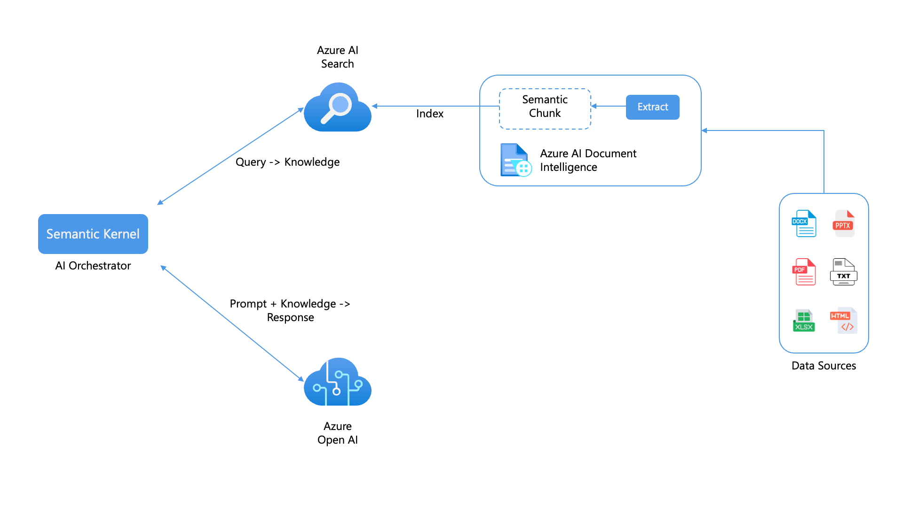
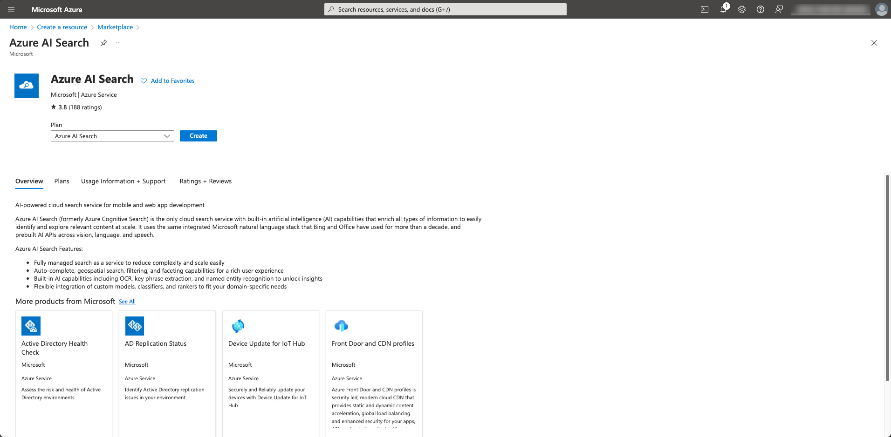
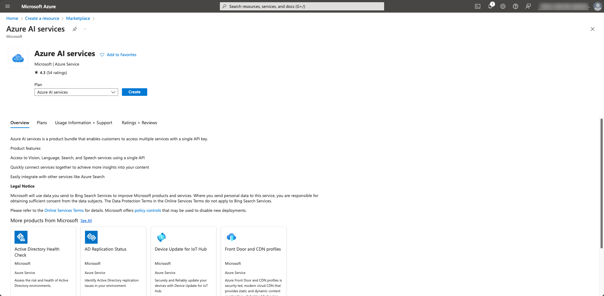
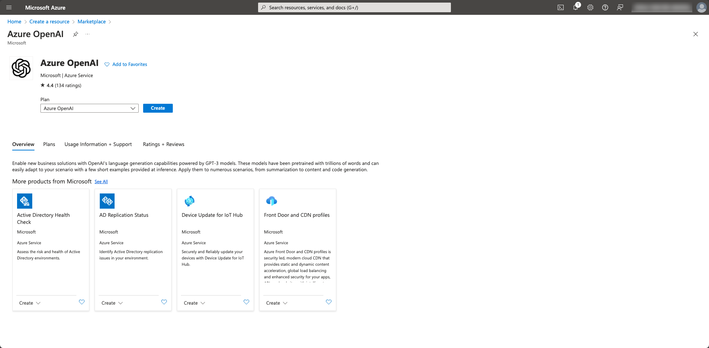
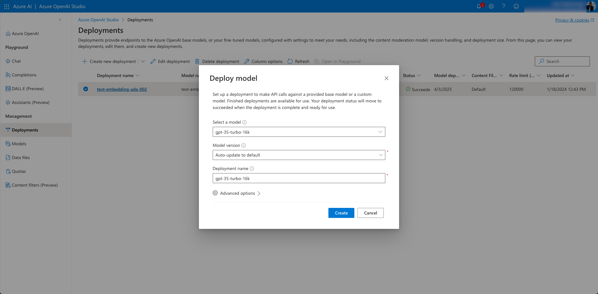
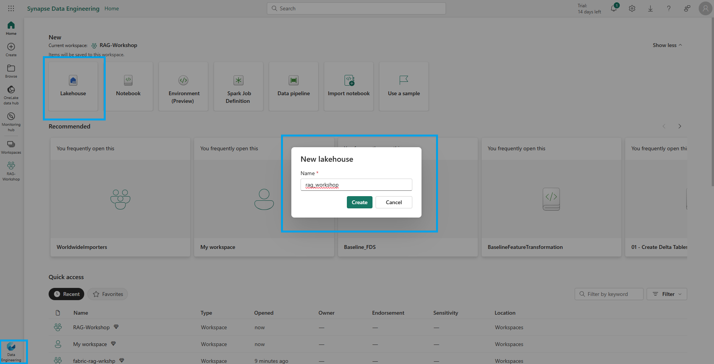
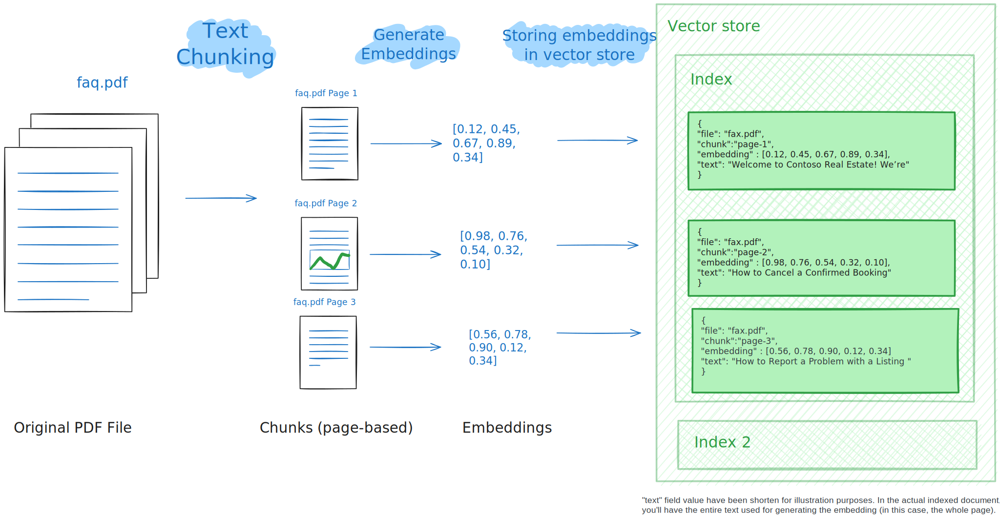

# Welcome

In this workshop, we'll demonstrate how to develop a context-aware question answering framework for any form of a document using [OpenAI models](https://azure.microsoft.com/products/ai-services/openai-service), [SynapseML](https://microsoft.github.io/SynapseML/) and [Azure AI Services](https://azure.microsoft.com/products/cognitive-services/). The source of data for this workshop is a PDF document, however, the same framework can be easily extended to other document formats too.

## Goals

You'll learn how to:

- Pre-process PDF Documents using [Azure AI Document Intelligence](https://azure.microsoft.com/products/ai-services/ai-document-intelligence) in Azure AI Services.
- Perform text chunking using SynapseML.
- Generate embeddings for the chunks using SynapseML and  [Azure OpenAI Services](https://azure.microsoft.com/products/cognitive-services/openai-service).
- Store the embeddings in [Azure AI Search](https://azure.microsoft.com/products/search).
- Build a question answering pipeline.

## Pre-requisites

| | |
|----------------------|------------------------------------------------------|
| Azure account        | [Get a free Azure account](https://azure.microsoft.com/free) |
| Microsoft Fabric License | [Microsoft Fabric Licenses](https://learn.microsoft.com/fabric/enterprise/licenses?WT.mc_id=data-114676-jndemenge) |
| A workspace in Microsoft Fabric | [Create a Microsoft Fabric workspace](https://learn.microsoft.com/fabric/data-warehouse/tutorial-create-workspace?WT.mc_id=data-114676-jndemenge) |
| Access to Azure OpenAI API *(optional)* | [Request access to Azure OpenAI](https://aka.ms/oaiapply) |
| A Web browser        | [Get Microsoft Edge](https://www.microsoft.com/edge) |
| Python knowledge | [Python for beginners](https://learn.microsoft.com/training/paths/beginner-python/) |

<div class="warning" data-title="Note">

> Since we are using the Pre-Built Open AI Models in Microsoft Fabric you do not need to request or have access to the Azure OpenAI API. However, if you are using the trial version of Microsoft Fabric or do not have an F64+ capacity, you will need to request access to the Azure OpenAI API.

</div>

---

# Introduction

Analyzing structured data has been an easy process for some time but the same cannot be said for unstructured data. Unstructured data, such as text, images, and videos, is more difficult to analyze and interpret. However, with the advent of advanced AI models, such as OpenAI's GPT-3 and GPT-4, it is now becoming easier to analyze and gain insights from unstructured data.

An example of such analysis is the ability to query a document for specific information using natural language which is achievable though a combination of information retrieval and language generation.

By leveraging the RAG (Retrieval-Augmented Generation) framework, you can create a powerful question-and-answering pipeline that uses a large language model (LLM) and you own data to generate responses.

The architecture of such an application is as shown below:



To get an in-depth understanding of the RAG framework, refer to [this workshop](https://moaw.dev/workshop/gh:azure-samples/azure-openai-rag-workshop/base/docs/)

---

# Environment Setup

To continue with this workshop, you'll need to create a Lakehouse in your Microsoft Fabric workspace and deploy the necessary resources in your Azure account. We'll detail the steps to do this below.


## Azure Setup

To complete this workshop you'll need an Azure account. If you don't have one, you can create a [free account](https://azure.microsoft.com/free/?WT.mc_id=data-0000-cxa) before you begin.

<div class="important" data-title="Important">

> Ensure that the subscription you are using has the permissions to create and manage resources.

</div>

Navigate to the [Azure Portal](https://portal.azure.com) and click on `Create a resource` and search for `Azure AI Search`. Click on the `Azure AI Search` resource and then click on `Create`.



In the creation wizard, create a new resource group or select an existing one. To minimize costs, change the pricing tier from Standard to Free. Click `Review + Create` and once the validation is successful, click `Create`.

Similarly, create another resource for the `Azure AI Services` by clicking on `Create a resource` and searching for `Azure AI Services`. Click on the `Azure AI Services` resource and then click on `Create`.



In the creation wizard, select the same resource group that you used for the Azure AI Search resource. The only available pricing tier is Standard, but you can apply free credits if you have any. Accept the Responsible AI Notice. With all fields filled out, click `Review + Create`. Once the validation is successful, click `Create`.

## Azure OpenAI Set Up

If your Microsoft Fabric has a SKU of F64 or higher, you can skip this step.

However, if you're using the trial version of Microsoft Fabric or it does not have an F64+ SKU, you will need to request access to the Azure OpenAI API  [using this form](https://aka.ms/oaiapply). Once you have access to the Azure OpenAI API, you'll need to create the Azure OpenAI resource in the Azure Portal.

To do this navigate to the [Azure Portal] and click on `Create a resource` and search for `Azure OpenAI`. Click on the `Azure OpenAI` resource and then click on `Create`.



Fill out all the required fields and click `Review + Create` and once the validation is successful, click `Create`. Also ensure that you select the same ***Resource Group*** as the ***Azure AI Search resource*** and the ***Azure AI Services resource***.

Next you'll need to create new model deployments. To do this navigate to the [Azure OpenAI Studio](https://oai.azure.com/portal). Under management click on `Deployments` and then click on `Create Deployment`. You'll need to create two deployments, one for the `text-embedding-ada-002` model and another for the `gpt-35-turbo-16k` model.



<div class="warning" data-title="Note">

> You will have to provide the keys and deployment names for the Azure OpenAI resource in sections that are using the Azure OpenAI models.

</div>

## Create a Lakehouse

To create a new Lakehouse in your Microsoft Fabric workspace, open the Synapse Data Engineering experience and select the `Lakehouse` button. Provide a name of `rag_workshop` and select `Create`.



To learn more about Lakehouses in Microsoft Fabric, refer to [this Lakehouse tutorial](https://learn.microsoft.com/fabric/data-engineering/tutorial-build-lakehouse#create-a-lakehouse?WT.mc_id=data-114676-jndemenge).


---

# Loading and Pre-processing PDF Documents

Now that we have all the necessary resources deployed, we can begin building the RAG application. This section covers the process of loading and preprocessing PDF documents using Document Intelligence in Azure AI Services.

To do this, we'll perform the following steps:

- Load the PDF document into a Spark DataFrame.
- Read the documents using the Azure AI Document Intelligence in Azure AI Services.
- Extract the text from the PDF documents.
- Use SynapseML to split the documents into chunks for more granular representation and processing of the document content.

## Configure Azure API keys

To begin, navigate back to the `rag_workshop` Lakehouse in your workspace and create a new notebook by selecting `Open Notebook` and selecting `New Notebook` from the options.

This will open a new notebook. Select the `Save as` icon and rename the notebook to `analyze_and_create_embeddings`.

Next you'll need to provide the keys for Azure AI Services to access the services. Copy the values from the Azure Portal and paste them into the following code cell.

```python
# Azure AI Search
AI_SEARCH_NAME = ""
AI_SEARCH_INDEX_NAME = "rag-demo-index"
AI_SEARCH_API_KEY = ""

# Azure AI Services
AI_SERVICES_KEY = ""
AI_SERVICES_LOCATION = ""
```

<div class="tip" data-title="Tip">

> In a production scenario, it is recommended to store the credentials securely in Azure Key Vault. To access secrets stored in Azure Key Vault, [use the `mssparkutils` library](https://learn.microsoft.com/fabric/data-engineering/microsoft-spark-utilities#credentials-utilities) as shown below:
>
>    ```python
>    from notebookutils.mssparkutils.credentials import getSecret
>
>    KEYVAULT_ENDPOINT = "https://YOUR-KEY-VAULT-NAME.vault.azure.net/"
>    # Azure AI Search
>    AI_SEARCH_NAME = ""
>    AI_SEARCH_INDEX_NAME = "rag-demo-index"
>    AI_SEARCH_API_KEY = getSecret(KEYVAULT_ENDPOINT, "SEARCH-SECRET-NAME")
>    # Azure AI Services
>    AI_SERVICES_KEY = getSecret(KEYVAULT_ENDPOINT, "AI-SERVICES-SECRET-NAME")
>    AI_SERVICES_LOCATION = ""
>    ```

</div>


## Loading & Analyzing the Document

In this workshop, we will be using a specific document named [support.pdf](https://github.com/Azure-Samples/azure-openai-rag-workshop/blob/main/data/support.pdf) which will be the source of our data.

To download the document, paste the following code in a new cell and run it.

```python
import requests
import os

url = "https://github.com/Azure-Samples/azure-openai-rag-workshop/raw/main/data/support.pdf"
response = requests.get(url)

# Specify your path here
path = "/lakehouse/default/Files/"

# Ensure the directory exists
os.makedirs(path, exist_ok=True)

# Write the content to a file in the specified path
filename = url.rsplit("/")[-1]
with open(os.path.join(path, filename), "wb") as f:
    f.write(response.content)
```

This downloads and stores the document in the `Files` directory in the Lakehouse.

Next, load the PDF document into a Spark DataFrame using the `spark.read.format("binaryFile")` method provided by Apache Spark:

```python
from pyspark.sql.functions import udf
from pyspark.sql.types import StringType

document_path = f"Files/{filename}"

df = spark.read.format("binaryFile").load(document_path).select("_metadata.file_name", "content").limit(10).cache()

display(df)
```

This code will read the PDF document and create a Spark DataFrame named `df` with the contents of the PDF. The DataFrame will have a schema that represents the structure of the PDF document, including its textual content.

Next, we'll use the Azure AI Document Intelligence to read the PDF documents and extract the text from them.

We utilize [SynapseML](https://microsoft.github.io/SynapseML/), an ecosystem of tools designed to enhance the distributed computing framework [Apache Spark](https://github.com/apache/spark). SynapseML introduces advanced networking capabilities to the Spark ecosystem and offers user-friendly SparkML transformers for various [Azure AI Services](https://azure.microsoft.com/products/ai-services).

Additionally, we employ `AnalyzeDocument` from Azure AI Services to extract the complete document content and present it in the designated columns called `output_content` and `paragraph`.

```python
from synapse.ml.services import AnalyzeDocument
from pyspark.sql.functions import col

analyze_document = (
    AnalyzeDocument()
    .setPrebuiltModelId("prebuilt-layout")
    .setSubscriptionKey(AI_SERVICES_KEY)
    .setLocation(AI_SERVICES_LOCATION)
    .setImageBytesCol("content")
    .setOutputCol("result")
)

analyzed_df = (
    analyze_document.transform(df)
    .withColumn("output_content", col("result.analyzeResult.content"))
    .withColumn("paragraphs", col("result.analyzeResult.paragraphs"))
).cache()
```

We can observe the analyzed Spark DataFrame named ```analyzed_df``` using the following code. Note that we drop the `content` column as it is not needed anymore.

```python
analyzed_df = analyzed_df.drop("content")
display(analyzed_df)
```

---

# Generating and Storing Embeddings

Now that we have the text content of the PDF documents, we can generate embeddings for the text using Azure OpenAI. Embeddings are vector representations of the text that can be used to compare the similarity between different pieces of text.



This process begins by splitting the text into chunks, then for each of the chunks we generate embeddings using Azure OpenAI. These embeddings are then stored in Azure AI Search.

## Text Chunking

Before we can generate the embeddings, we need to split the text into chunks. To do this we leverage SynapseML’s PageSplitter to divide the documents into smaller sections, which are subsequently stored in the `chunks` column. This allows for more granular representation and processing of the document content.

```python
from synapse.ml.featurize.text import PageSplitter

ps = (
    PageSplitter()
    .setInputCol("output_content")
    .setMaximumPageLength(4000)
    .setMinimumPageLength(3000)
    .setOutputCol("chunks")
)

splitted_df = ps.transform(analyzed_df)
display(splitted_df)
```

Note that the chunks for each document are presented in a single row inside an array. In order to embed all the chunks in the following cells, we need to have each chunk in a separate row.

```python
from pyspark.sql.functions import posexplode, col, concat

# Each "chunks" column contains the chunks for a single document in an array
# The posexplode function will separate each chunk into its own row
exploded_df = splitted_df.select("file_name", posexplode(col("chunks")).alias("chunk_index", "chunk"))

# Add a unique identifier for each chunk
exploded_df = exploded_df.withColumn("unique_id", concat(exploded_df.file_name, exploded_df.chunk_index))

display(exploded_df)
```

From this code snippet we first explode these arrays so there is only one chunk in each row, then filter the Spark DataFrame in order to only keep the path to the document and the chunk in a single row.

## Generating Embeddings

Next we'll generate the embeddings for each chunk. To do this we utilize both SynapseML and Azure OpenAI Service. By integrating the built in Azure OpenAI service with SynapseML, we can leverage the power of the Apache Spark distributed computing framework to process numerous prompts using the OpenAI service.

```python
from synapse.ml.services import OpenAIEmbedding

embedding = (
    OpenAIEmbedding()
    .setDeploymentName("text-embedding-ada-002")
    .setTextCol("chunk")
    .setErrorCol("error")
    .setOutputCol("embeddings")
)

df_embeddings = embedding.transform(exploded_df)

display(df_embeddings)
```

This integration enables the SynapseML embedding client to generate embeddings in a distributed manner, enabling efficient processing of large volumes of data. If you're interested in applying large language models at a distributed scale using Azure OpenAI and Azure Synapse Analytics, you can refer to [this approach](https://microsoft.github.io/SynapseML/docs/Explore%20Algorithms/OpenAI/).

For more detailed information on generating embeddings with Azure OpenAI, see: [Learn how to generate embeddings with Azure OpenAI](https://learn.microsoft.com/azure/cognitive-services/openai/how-to/embeddings?tabs=console&WT.mc_id=data-114676-jndemenge).

<div class="warning" data-title="Note">

> If you're using the Azure OpenAI resource deployed on Microsoft Azure, you will need to provide the key as well as the deployment name for the Azure OpenAI resource, using `setDeploymentName` and `setSubscriptionKey`:
>
> ```python
>     .setDeploymentName('YOUR-DEPLOYMENT_NAME')
>     .setSubscriptionKey('YOUR-AZURE-OPENAI-KEY')
> ```

</div>

## Storing Embeddings

[Azure AI Search](https://learn.microsoft.com/azure/search/search-what-is-azure-search?WT.mc_id=data-114676-jndemenge) is a powerful search engine that includes the ability to perform full text search, vector search, and hybrid search. For more examples of its vector search capabilities, see the [azure-search-vector-samples repository](https://github.com/Azure/azure-search-vector-samples/).

Storing data in Azure AI Search involves two main steps:

1. **Creating the index:** The first step is to define the schema of the search index, which includes the properties of each field as well as any vector search strategies that will be used.

2. **Adding chunked documents and embeddings:** The second step is to upload the chunked documents, along with their corresponding embeddings, to the index. This allows for efficient storage and retrieval of the data using hybrid and vector search.

The following code snippet demonstrates how to create an index in Azure AI Search using the [Azure AI Search REST API](https://learn.microsoft.com/rest/api/searchservice/indexes/create-or-update). This code creates an index with fields for the unique identifier of each document, the text content of the document, and the vector embedding of the text content. 

```python
import requests
import json

# Length of the embedding vector (OpenAI ada-002 generates embeddings of length 1536)
EMBEDDING_LENGTH = 1536

# Create index for AI Search with fields id, content, and contentVector
# Note the datatypes for each field below
url = f"https://{AI_SEARCH_NAME}.search.windows.net/indexes/{AI_SEARCH_INDEX_NAME}?api-version=2023-11-01"
payload = json.dumps(
    {
        "name": AI_SEARCH_INDEX_NAME,
        "fields": [
            # Unique identifier for each document
            {
                "name": "id",
                "type": "Edm.String",
                "key": True,
                "filterable": True,
            },
            # Text content of the document
            {
                "name": "content",
                "type": "Edm.String",
                "searchable": True,
                "retrievable": True,
            },
            # Vector embedding of the text content
            {
                "name": "contentVector",
                "type": "Collection(Edm.Single)",
                "searchable": True,
                "retrievable": True,
                "dimensions": EMBEDDING_LENGTH,
                "vectorSearchProfile": "vectorConfig",
            },
        ],
        "vectorSearch": {
            "algorithms": [{"name": "hnswConfig", "kind": "hnsw", "hnswParameters": {"metric": "cosine"}}],
            "profiles": [{"name": "vectorConfig", "algorithm": "hnswConfig"}],
        },
    }
)
headers = {"Content-Type": "application/json", "api-key": AI_SEARCH_API_KEY}

response = requests.request("PUT", url, headers=headers, data=payload)
if response.status_code == 201:
    print("Index created!")
elif response.status_code == 204:
    print("Index updated!")
else:
    print(f"HTTP request failed with status code {response.status_code}")
    print(f"HTTP response body: {response.text}")
```

The next step is to upload the chunks to the newly created Azure AI Search index. The [Azure AI Search REST API](https://learn.microsoft.com/rest/api/searchservice/addupdate-or-delete-documents) supports up to 1000 "documents" per request. Note that in this case, each of our "documents" is in fact a chunk of the original file.

In order to efficiently upload the chunks to the Azure AI Search index, we'll use the `mapPartitions` function to process each partition of the dataframe. For each partition, the `upload_rows` function will collect 1000 rows at a time and upload them to the index. The function will then return the start and end index of the rows that were uploaded, as well as the status of the insertion, so that we know if the upload was successful or not.

```python
import re

from pyspark.sql.functions import monotonically_increasing_id


def insert_into_index(documents):
    """Uploads a list of 'documents' to Azure AI Search index."""

    url = f"https://{AI_SEARCH_NAME}.search.windows.net/indexes/{AI_SEARCH_INDEX_NAME}/docs/index?api-version=2023-11-01"

    payload = json.dumps({"value": documents})
    headers = {
        "Content-Type": "application/json",
        "api-key": AI_SEARCH_API_KEY,
    }

    response = requests.request("POST", url, headers=headers, data=payload)

    if response.status_code == 200 or response.status_code == 201:
        return "Success"
    else:
        return f"Failure: {response.text}"

def make_safe_id(row_id: str):
    """Strips disallowed characters from row id for use as Azure AI search document ID."""
    return re.sub("[^0-9a-zA-Z_-]", "_", row_id)


def upload_rows(rows):
    """Uploads the rows in a Spark dataframe to Azure AI Search.
    Limits uploads to 1000 rows at a time due to Azure AI Search API limits.
    """
    BATCH_SIZE = 1000
    rows = list(rows)
    for i in range(0, len(rows), BATCH_SIZE):
        row_batch = rows[i : i + BATCH_SIZE]
        documents = []
        for row in rows:
            documents.append(
                {
                    "id": make_safe_id(row["unique_id"]),
                    "content": row["chunk"],
                    "contentVector": row["embeddings"].tolist(),
                    "@search.action": "upload",
                },
            )
        status = insert_into_index(documents)
        yield [row_batch[0]["row_index"], row_batch[-1]["row_index"], status]

# Add ID to help track what rows were successfully uploaded
df_embeddings = df_embeddings.withColumn("row_index", monotonically_increasing_id())

# Run upload_batch on partitions of the dataframe
res = df_embeddings.rdd.mapPartitions(upload_rows)
display(res.toDF(["start_index", "end_index", "insertion_status"]))
```

<div class="tip" data-title="Tip">

> You can also use the [azure-search-documents Python package](https://pypi.org/project/azure-search-documents/) for Azure AI Search operations.
> You would first need to install that package into the Spark environment. See [Library management in Fabric environments](https://learn.microsoft.com/fabric/data-engineering/environment-manage-library)

</div>

---

# Retrieving Relevant Documents and Answering Questions

After processing the document, we can proceed to pose a question. We will use [SynapseML](https://microsoft.github.io/SynapseML/docs/Explore%20Algorithms/OpenAI/Quickstart%20-%20OpenAI%20Embedding/) to convert the user's question into an embedding and then utilize cosine similarity to retrieve the top K document chunks that closely match the user's question.

## Configure Environment & Azure API Keys

Create a new notebook in the Lakehouse and save it as `rag_application`. We'll use this notebook to build the RAG application.

Next we'll need to provide the credentials for access to Azure AI Search. You can copy the values from the previous notebook or from Azure Portal.

```python
# Azure AI Search
AI_SEARCH_NAME = ''
AI_SEARCH_INDEX_NAME = 'rag-demo-index'
AI_SEARCH_API_KEY = ''
```


<div class="tip" data-title="Tip">

> In a production scenario, it is recommended to store the credentials securely in Azure Key Vault. To access secrets stored in Azure Key Vault, [use the `mssparkutils` library](https://learn.microsoft.com/fabric/data-engineering/microsoft-spark-utilities#credentials-utilities) as shown below:
>
>    ```python
>    from notebookutils.mssparkutils.credentials import getSecret
>
>    KEYVAULT_ENDPOINT = "https://YOUR-KEY-VAULT-NAME.vault.azure.net/"
>    # Azure AI Search
>    AI_SEARCH_NAME = ""
>    AI_SEARCH_INDEX_NAME = "rag-demo-index"
>    AI_SEARCH_API_KEY = getSecret(KEYVAULT_ENDPOINT, "SEARCH-SECRET-NAME")
>    ```

</div>

## Generate Embeddings for the User Question

The first step of the retrieval process is to generate embeddings for the user's question.

The following function takes a user's question as input and converts it into an embedding using the `text-embedding-ada-002` model. This code assumes you're using the [Pre-built AI Services in Microsoft Fabric](https://learn.microsoft.com/fabric/data-science/ai-services/ai-services-overview?WT.mc_id=data-114676-jndemenge).

```python
def gen_question_embedding(user_question):
    """Generates embedding for user_question using SynapseML."""
    from synapse.ml.services import OpenAIEmbedding

    df_ques = spark.createDataFrame([(user_question, 1)], ["questions", "dummy"])
    embedding = (
        OpenAIEmbedding()
        .setDeploymentName('text-embedding-ada-002')
        .setTextCol("questions")
        .setErrorCol("errorQ")
        .setOutputCol("embeddings")
    )
    df_ques_embeddings = embedding.transform(df_ques)
    row = df_ques_embeddings.collect()[0]
    question_embedding = row.embeddings.tolist()
    return question_embedding
```

<div class="info" data-title="Note">

> If you're using the Azure OpenAI resource deployed on Microsoft Azure, you will need to provide the key as well as the deployment name for the Azure OpenAI resource, using `setDeploymentName` and `setSubscriptionKey`:
>
> ```python
>     .setDeploymentName('YOUR-DEPLOYMENT_NAME')
>     .setSubscriptionKey('YOUR-AZURE-OPENAI-KEY')
> ```

</div>

## Retrieve Relevant Documents

The next step is to use the user question and its embedding to retrieve the top K most relevant document chunks from the search index.
The following function retrieves the top K entries using hybrid search:

```python
import json 
import requests

def retrieve_top_chunks(k, question, question_embedding):
    """Retrieve the top K entries from Azure AI Search using hybrid search."""
    url = f"https://{AI_SEARCH_NAME}.search.windows.net/indexes/{AI_SEARCH_INDEX_NAME}/docs/search?api-version=2023-11-01"

    payload = json.dumps({
        "search": question,
        "top": k,
        "vectorQueries": [
            {
                "vector": question_embedding,
                "k": k,
                "fields": "contentVector",
                "kind": "vector"
            }
        ]
    })

    headers = {
        "Content-Type": "application/json",
        "api-key": AI_SEARCH_API_KEY,
    }

    response = requests.request("POST", url, headers=headers, data=payload)
    output = json.loads(response.text)
    return output
```

With those functions defined, we can define a function that takes a user's question, generates an embedding for the question, retrieves the top K document chunks, and concatenates the content of the retrieved documents to form the context for the user's question.

```python
def get_context(user_question, retrieved_k = 5):
    # Generate embeddings for the question
    question_embedding = gen_question_embedding(user_question)

    # Retrieve the top K entries
    output = retrieve_top_chunks(retrieved_k, user_question, question_embedding)

    # concatenate the content of the retrieved documents
    context = [chunk["content"] for chunk in output["value"]]

    return context
```

## Answering the User's Question

Finally, we can define a function that takes a user's question, retrieves the context for the question, and sends both the context and the question to a large language model to generate a response. For this demo, we'll use the `gpt-35-turbo-16k`, a model that is optimized for conversation. The code below assumes you're using the [Pre-built AI Services in Microsoft Fabric](https://learn.microsoft.com/fabric/data-science/ai-services/ai-services-overview?WT.mc_id=data-114676-jndemenge).

```python
from pyspark.sql import Row
from synapse.ml.services.openai import OpenAIChatCompletion


def make_message(role, content):
    return Row(role=role, content=content, name=role)

def get_response(user_question):
    context = get_context(user_question)

    # Write a prompt with context and user_question as variables 
    prompt = f"""
    context: {context}
    Answer the question based on the context above.
    If the information to answer the question is not present in the given context then reply "I don't know".
    """

    chat_df = spark.createDataFrame(
        [
            (
                [
                    make_message(
                        "system", prompt
                    ),
                    make_message("user", user_question),
                ],
            ),
        ]
    ).toDF("messages")

    chat_completion = (
        OpenAIChatCompletion()
        .setDeploymentName("gpt-35-turbo-16k") # deploymentName could be one of {gpt-35-turbo, gpt-35-turbo-16k}
        .setMessagesCol("messages")
        .setErrorCol("error")
        .setOutputCol("chat_completions")
    )

    result_df = chat_completion.transform(chat_df).select("chat_completions.choices.message.content")

    result = []
    for row in result_df.collect():
        content_string = ' '.join(row['content'])
        result.append(content_string)

    # Join the list into a single string
    result = ' '.join(result)
    
    return result
```

<div class="info" data-title="Note">

> If you're using the Azure OpenAI resource deployed on Microsoft Azure, you will need to provide the key as well as the deployment name for the Azure OpenAI resource, using `setDeploymentName` and `setSubscriptionKey`:
>
> ```python
>     .setDeploymentName('YOUR-DEPLOYMENT_NAME')
>     .setSubscriptionKey('YOUR-AZURE-OPENAI-KEY')
> ```

</div>

Finally, we can call that function with an example question to see the response:

```python
user_question = "how do i make a booking?"
response = get_response(user_question)
print(response)
```

This gives a result similar to the following:


---

# Conclusion

This concludes this workshop, we hope you enjoyed it and learned something new.

If you had any issues while following this workshop, please let us know by [creating a new issue](https://github.com/microsoft/moaw/issues) on the github repository.

## Clean up resources

<div class="important" data-title="Important">

> After completing the workshop, remember to delete the Azure Resources you created to avoid incurring unnecessary costs!

</div>

To delete the resources, navigate to the resource group you created earlier and click on the `Delete` button.

## Resources

To learn more about Retrieval Augmented Generation (RAG) using Azure Search an Azure OpenAI, refer to the following resources:

- [Retrieval Augmented Generation (RAG) in Azure AI Search](https://learn.microsoft.com/azure/search/retrieval-augmented-generation-overview?WT.mc_id=data-114676-jndemenge)
- [Use Azure OpenAI in Fabric with Python SDK and Synapse ML (preview)](https://learn.microsoft.com/fabric/data-science/ai-services/how-to-use-openai-sdk-synapse?WT.mc_id=data-114676-jndemenge)
- [Azure OpenAI for big data](https://microsoft.github.io/SynapseML/docs/Explore%20Algorithms/OpenAI/)

***Bonus:*** For more information on creating RAG applications with Microsoft Fabric, refer to this blog post: [Using Microsoft Fabric’s Lakehouse Data and prompt flow in Azure Machine Learning Service to create RAG applications](https://blog.fabric.microsoft.com/en-us/blog/using-microsoft-fabrics-lakehouse-data-and-prompt-flow-in-azure-machine-learning-service-to-create-rag-applications).

## References

- This workshop URL: [aka.ms/ws/fabric-rag](https://aka.ms/ws/fabric-rag)
- If something does not work: [Report an issue](https://github.com/microsoft/moaw/issues)
- Live Workshop on [YouTube](https://www.youtube.com/watch?v=BfNiaaBOcM8)
