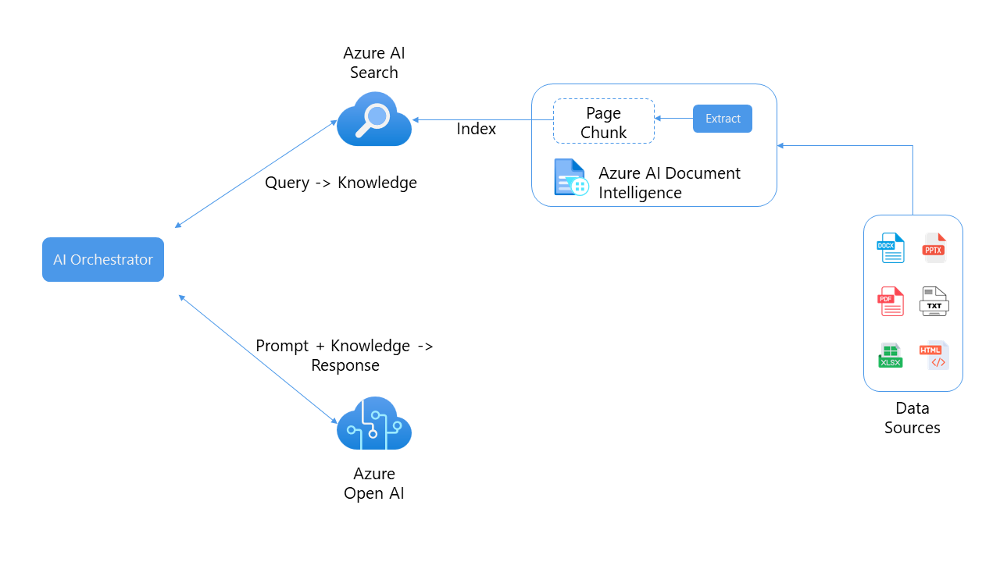
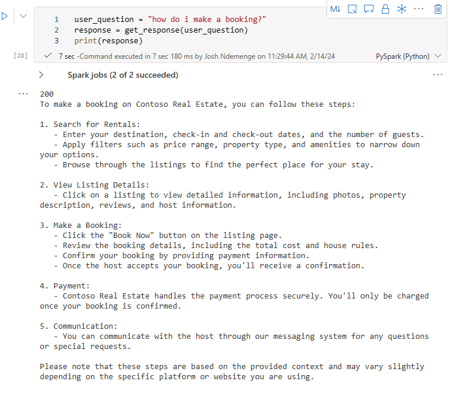

# Welcome

In this workshop, we'll demonstrate how to develop a context-aware question answering framework for any form of a document using [OpenAI models](https://azure.microsoft.com/products/ai-services/openai-service), [SynapseML](https://microsoft.github.io/SynapseML/) and [Azure AI Services](https://azure.microsoft.com/products/cognitive-services/). The source of data for this workshop is a PDF document, however, the same framework can be easily extended to other document formats too.

## You'll learn how to: 

- Pre-Process PDF Documents using [Azure AI Document Intelligence](https://azure.microsoft.com/products/ai-services/ai-document-intelligence) in Azure AI Services.
- Perform text chunking using SynapseML.
- Generate embeddings for the chunks using SynapseML and  [Azure OpenAI Services](https://azure.microsoft.com/products/cognitive-services/openai-service).
- Store the embeddings in a vector store using [Azure AI Search](https://azure.microsoft.com/products/search).
- Build a question answering pipeline.


## Pre-requisites


| | |
|----------------------|------------------------------------------------------|
| Azure account        | [Get a free Azure account](https://azure.microsoft.com/free) |
| Microsoft Fabric License | [Microsoft Fabric Licenses](https://learn.microsoft.com/fabric/enterprise/licenses?WT.mc_id=data-114676-jndemenge) |
| A workspace in Microsoft Fabric | [Create a Microsoft Fabric workspace](https://learn.microsoft.com/fabric/data-warehouse/tutorial-create-workspace?WT.mc_id=data-114676-jndemenge) |
| Access to Azure OpenAI API *(optional)* | [Request access to Azure OpenAI](https://aka.ms/oaiapply) |
| A Web browser        | [Get Microsoft Edge](https://www.microsoft.com/edge) |
| Python knowledge | [Python for beginners](https://learn.microsoft.com/training/paths/beginner-python/) |


<div class="warning" data-title="Note">

> Since we are using the Pre-Built Open AI Models in Microsoft Fabric you do not need to request or have access to the Azure OpenAI API. However, if you are using the trial version of Microsoft Fabric or do not have an F64+ capacity, you will need to request access to the Azure OpenAI API.
</div>

---


# Introduction

Analyzing structured data has been an easy process for some time but the same cannot be said for unstructured data. Unstructured data, such as text, images, and videos, is more difficult to analyze and interpret. However, with the advent of advanced AI models, such as OpenAI's GPT-3 and GPT-4, it is now becoming easier to analyze and gain insights from unstructured data.

An example of such analysis is the ability to query a document for specific information using natural language which is achievable though a combination of information retrieval and language generation.

By leveraging the RAG (Retrieval-Augmented Generation) framework, you can create a powerful question-and-answering pipeline that uses a large language model (LLM) and you own data to generate responses. 

The architecture of such an application is as shown below:



To get an in-depth understanding of the RAG framework, refer to [this workshop](https://moaw.dev/workshop/gh:azure-samples/azure-openai-rag-workshop/base/docs/)


---

# Environment Setup
To continue with this workshop, you'll need to create a Lakehouse in your Microsoft Fabric workspace and deploy the necessary resources in your Azure account. We'll detail the steps to do this below.

## Create a Lakehouse
To create a new Lakehouse in your Microsoft Fabric workspace, open the `Data Engineering workload` on the bottom left of the workspace and click on `Lakehouse`. Provide the name `rag_workshop` and click `Create`


To learn more about Lakehouses in Microsoft Fabric, refer to [this resource](https://learn.microsoft.com/en-us/fabric/data-engineering/tutorial-build-lakehouse#create-a-lakehouse?WT.mc_id=data-114676-jndemenge)


## Azure Setup

To complete this workshop you'll need an Azure account. If you don't have one, you can create a [free account](https://azure.microsoft.com/free/?WT.mc_id=data-0000-cxa) before you begin. 

<div class="important" data-title="Important">

> Ensure that the subscription you are using has the permissions to create and manage resources.
</div>


Navigate to the [Azure Portal](https://portal.azure.com) and click on `Create a resource` and search for `Azure AI Search`. Click on the `Azure AI Search` resource and then click on `Create`.


Fill out all the required fields and click `Review + Create` and once the validation is successful, click `Create`.

Similarly, create another resource for the `Azure AI Services` by clicking on `Create a resource` and searching for `Azure AI Services`. Click on the `Azure AI Services` resource and then click on `Create`.


Fill out all the required fields, accept the Responsible AI Notice and then click `Review + Create` and once the validation is successful, click `Create`. Ensure that you select the same ***Resource Group*** as the ***Azure AI Search resource***.

## Azure Open AI Set Up

If you are have an F64+ Capacity you can skip this step. 

However if you are using are using the trial version of Microsoft Fabric or do not have an F64+ capacity, you will need to request access to the Azure OpenAI API from [here](https://aka.ms/oaiapply). Once you have access to the Azure OpenAI API, we'll need to create the Azure OpenAI resource in the Azure Portal.

To do this navigate to the [Azure Portal] and click on `Create a resource` and search for `Azure OpenAI`. Click on the `Azure OpenAI` resource and then click on `Create`. 


Fill out all the required fields and click `Review + Create` and once the validation is successful, click `Create`. Also ensure that you select the same ***Resource Group*** as the ***Azure AI Search resource*** and the ***Azure AI Services resource***.

Next we'll need to create new model deployments. To do this navigate to the [Azure OpenAI Studio](https://oai.azure.com/portal). Under management click on `Deployments` and then click on `Create Deployment`. We'll need to create two deployments, one for the `text-embedding-ada-002` and another for the `gpt-35-turbo-16k`.


<div class="warning" data-title="Note">

> You will have to provide the keys and deployment names for the Azure OpenAI resource in sections that are using the Azure OpenAI models.
</div>

---

# Loading and Preprocessing PDF Documents 

Now that we have all the necessary resources deployed we can now begin building the RAG application. This section covers the process of loading and preprocessing PDF documents using Document Intelligence in Azure AI Services. 

To do this, we'll perform the following steps:

- Load the PDF document into a Spark DataFrame.
- Read the documents using the Azure AI Document Intelligence in Azure AI Services.
- Extract the text from the PDF documents.
- Use SynapseML to split the documents into chunks for more granular representation and processing of the document content.

## Configure Azure API keys
To begin with create a new notebook in your Lakehouse. To create a new Notebook, click on the ```Open Notebook``` from the Lakehouse and from the drop down menu select ```New Notebook```. 

This will open a new Notebook. On the top right corner of the workspace click on the Notebook name and rename it to ```analyze_and_create_embeddings```. Click on any empty area to close and rename the Notebook.


Next we'll need to provide the keys for Azure AI Services to access the services. Copy the values from the Azure Portal and paste them into the following code cell.


```python
# Azure AI Search
aisearch_name = ''
aisearch_index_name = 'rag-demo-index'
aisearch_api_key = ''

# Azure AI Service
ai_services_key = ''
ai_services_location = ''
```

<div class="tip" data-title="Tip">

> In a production scenario, it is recommended to store the credentials securely in Azure Key Vault. To access the credentials stored in Azure Key Vault, use the `mssparkutils` library. 

</div>


## Loading & Analyzing the Document

In this workshop, we will be using a specific document named [support.pdf](https://github.com/Azure-Samples/azure-openai-rag-workshop/blob/main/data/support.pdf) which will be the source of our data.

To download the document paste the following code in a new cell and run it.

```python
import requests
import os

url = 'https://github.com/Azure-Samples/azure-openai-rag-workshop/raw/main/data/support.pdf'
response = requests.get(url)

# Specify your path here
path = '/lakehouse/default/Files/'

# Ensure the directory exists
os.makedirs(path, exist_ok=True)

# Write the content to a file in the specified path
with open(os.path.join(path, 'support.pdf'), 'wb') as f:
    f.write(response.content)
```

Thus downloads and stores the documents in the `Files` directory in the Lakehouse.

Next we'll load the PDF document into a Spark DataFrame using the `spark.read.format("binaryFile")`method provided by Apache Spark.

```python
# Import required pyspark libraries

from pyspark.sql.functions import udf
from pyspark.sql.types import StringType

document_path = 'Files/support.pdf' # Path to the PDF document 

df = (
    spark.read.format('binaryFile')
    .load(document_path)
    .limit(10)
    .cache()
)
```

This code will read the PDF document and create a Spark DataFrame named `df` with the contents of the PDFs. The DataFrame will have a schema that represents the structure of the PDF documents, including their textual content.

Next, we'll use the Azure AI Document Intelligence to read the PDF documents and extract the text from them. 

We utilize [SynapseML](https://microsoft.github.io/SynapseML/), an ecosystem of tools designed to enhance the distributed computing framework [Apache Spark](https://github.com/apache/spark). SynapseML introduces advanced networking capabilities to the Spark ecosystem and offers user-friendly SparkML transformers for various [Azure AI Services](https://azure.microsoft.com/products/ai-services).

Additionally, we employ `AnalyzeDocument` from Azure AI Services to extract the complete document content and present it in the designated columns called `output_content` and `paragraph`.

```python
from synapse.ml.services import AnalyzeDocument
from pyspark.sql.functions import col

analyze_document = (
    AnalyzeDocument()
    .setPrebuiltModelId("prebuilt-layout")
    .setSubscriptionKey(ai_services_key)
    .setLocation(ai_services_location)
    .setImageBytesCol("content")
    .setOutputCol("result")
)

analyzed_df = (
    analyze_document.transform(df)
    .withColumn("output_content", col("result.analyzeResult.content"))
    .withColumn("paragraphs", col("result.analyzeResult.paragraphs"))
).cache()
```

We can observe the analyzed Spark DataFrame named ```analyzed_df``` using the following code. Note that we drop the `content` column as it is not needed anymore.

```python
analyzed_df = analyzed_df.drop("content")
display(analyzed_df)
```

---

# Generating Embeddings and Storing them in a Vector Store

Now that we have the text content of the PDF documents, we can generate embeddings for the text using Azure OpenAI. Embeddings are vector representations of the text that can be used to compare the similarity between different pieces of text.


This process begins by splitting the text into chunks, then for each of the chunks we generate Embeddings using Azure OpenAI. These embeddings are then stored in a vector store. 

## Text Chunking

Before we can generate the embeddings, we need to split the text into chunks. To do this we leverage SynapseML’s PageSplitter to divide the documents into smaller sections, which are subsequently stored in the `chunks` column. This allows for more granular representation and processing of the document content.

```python
from synapse.ml.featurize.text import PageSplitter

ps = (
    PageSplitter()
    .setInputCol("output_content")
    .setMaximumPageLength(4000)
    .setMinimumPageLength(3000)
    .setOutputCol("chunks")
)

splitted_df = ps.transform(analyzed_df)
display(splitted_df)
```

Note that the chunks for each document are presented in a single row inside an array. In order to embed all the chunks in the following cells, we need to have each chunk in a separate row. 

```python
# Each column contains many chunks for the same document as a vector.
# Explode will distribute and replicate the content of a vector across multiple rows
from pyspark.sql.functions import explode, col

exploded_df = splitted_df.select("path", explode(col("chunks")).alias("chunk")).select(
    "path", "chunk"
)
display(exploded_df)
```
From this code snippet we first explode these arrays so there is only one chunk in each row, then filter the Spark DataFrame in order to only keep the path to the document and the chunk in a single row.

## Generating Embeddings
Next we'll generate the embeddings for each chunk. To do this we utilize both SynapseML and Azure OpenAI Service. By integrating the built in Azure OpenAI service with SynapseML, we can leverage the power of the Apache Spark distributed computing framework to process numerous prompts using the OpenAI service. 

```python
from synapse.ml.services import OpenAIEmbedding

embedding = (
    OpenAIEmbedding()
    .setDeploymentName('text-embedding-ada-002')
    .setTextCol("chunk")
    .setErrorCol("error")
    .setOutputCol("embeddings")
)

df_embeddings = embedding.transform(exploded_df)

display(df_embeddings)
```

This integration enables the SynapseML embedding client to generate embeddings in a distributed manner, enabling efficient processing of large volumes of data. If you're interested in applying large language models at a distributed scale using Azure OpenAI and Azure Synapse Analytics, you can refer to [this approach](https://microsoft.github.io/SynapseML/docs/Explore%20Algorithms/OpenAI/). 

For more detailed information on generating embeddings with Azure OpenAI, you can look [here]( https://learn.microsoft.com/azure/cognitive-services/openai/how-to/embeddings?tabs=console&WT.mc_id=data-114676-jndemenge).

<div class="warning" data-title="Note">

> If you are using the Azure OpenAI resource deployed on Microsoft Azure you will need to provide the Key as well as the Deployment Name for the Azure OpenAI resource. To do this replace the `deploymentName` with the name of the deployment you created in the Azure OpenAI Studio and add the key as follows:

```python
    .setDeploymentName('text-embedding-ada-002')
    .setSubscriptionKey(azure_openai_key)
```
</div>

## Storing Embeddings in a Vector Store

[Azure Cognitive Search](https://learn.microsoft.com/azure/search/search-what-is-azure-search?WT.mc_id=data-114676-jndemenge) offers a user-friendly interface for creating a vector database, as well as storing and retrieving data using vector search. If you're interested in learning more about vector search, you can look [here](https://github.com/Azure/cognitive-search-vector-pr/tree/main).


Storing data in the AzureCogSearch vector database involves two main steps:

1. **Creating the Index:** The first step is to establish the index or schema of the vector database. This entails defining the structure and properties of the data that will be stored and indexed in the vector database.

2. **Adding Chunked Documents and Embeddings:** The second step involves adding the chunked documents, along with their corresponding embeddings, to the vector datastore. This allows for efficient storage and retrieval of the data using vector search capabilities.

By following these steps, we will effectively store the chunked documents and their associated embeddings in the AzureCogSearch vector database, enabling seamless retrieval of relevant information through vector search functionality.

```python
# Import necessary packages
import requests
import json

EMBEDDING_LENGTH = (
    1536  # length of the embedding vector (OpenAI generates embeddings of length 1536)
)

# Create Index for Cog Search with fields as id, content, and contentVector
# Note the datatypes for each field below

# Create Index for Cog Search with fields as id, content, and contentVector
# Note the datatypes for each field below

url = f"https://{aisearch_name}.search.windows.net/indexes/{aisearch_index_name}?api-version=2023-07-01-Preview"
payload = json.dumps(
  {
    "name": aisearch_index_name,
    "fields": [
      {"name": "id", "type": "Edm.String", "key": True, "filterable": True},  # Unique identifier for each document
      {
        "name": "content",
        "type": "Edm.String",
        "searchable": True,
        "retrievable": True,
      },  # Text content of the document
      {
        "name": "contentVector",
        "type": "Collection(Edm.Single)",
        "searchable": True,
        "retrievable": True,
        "dimensions": EMBEDDING_LENGTH,  # Length of the embedding vector
        "vectorSearchConfiguration": "vectorConfig",  # Configuration for vector search
      },  # Embedding vector representation of the document content
    ],
    "vectorSearch": {
      "algorithmConfigurations": [
        {
          "name": "vectorConfig",
          "kind": "hnsw",  # Algorithm used for vector search
        }
      ]
    },
  }
)
headers = {"Content-Type": "application/json", "api-key": aisearch_api_key}

response = requests.request("PUT", url, headers=headers, data=payload)
print(response.status_code)
```

Next we need to use User Defined Function (UDF) through the udf() method in order to apply functions directly to the DataFrame.

```python
# Use Spark's UDF to insert entries to Cognitive Search
# This allows to run the code in a distributed fashion

# Define a UDF using the @udf decorator
@udf(returnType=StringType())
def insert_to_cog_search(idx, content, contentVector):
    url = f"https://{aisearch_name}.search.windows.net/indexes/{aisearch_index_name}/docs/index?api-version=2023-07-01-Preview"

    payload = json.dumps(
        {
            "value": [
                {
                    "id": str(idx),
                    "content": content,
                    "contentVector": contentVector.tolist(),
                    "@search.action": "upload",
                },
            ]
        }
    )
    headers = {
        "Content-Type": "application/json",
        "api-key": aisearch_api_key,
    }

    response = requests.request("POST", url, headers=headers, data=payload)
    # response.text

    if response.status_code == 200 or response.status_code == 201:
        return "Success"
    else:
        return "Failure"
```

Now we can use the UDF to insert the chunked documents and their embeddings into the vector database by applying the UDF to the Spark DataFrame. Note that UDF also helps to add new columns to the DataFrame.

```python
# Apply the UDF on the different columns
from pyspark.sql.functions import monotonically_increasing_id

df_embeddings = df_embeddings.withColumn(
    "idx", monotonically_increasing_id()
)  ## adding a column with id
df_embeddings = df_embeddings.withColumn(
    "errorCogSearch",
    insert_to_cog_search(
        df_embeddings["idx"], df_embeddings["chunk"], df_embeddings["embeddings"]
    ),
)

# Show the transformed DataFrame
df_embeddings.show()
```

---

# Retrieving Relevant Documents and Answering Questions

After processing the document, we can proceed to pose a question. We will use [SynapseML](https://microsoft.github.io/SynapseML/docs/Explore%20Algorithms/OpenAI/Quickstart%20-%20OpenAI%20Embedding/) to convert the user's question into an embedding and then utilize cosine similarity to retrieve the top K document chunks that closely match the user's question. 

## Configure Environment & Azure API Keys
To do this, let's create a new notebook in the Lakehouse and rename it to `rag_application`. We'll use this notebook to build the RAG application.

Next we'll need to provide the keys for Azure AI Services to access the services. Copy the values from the Azure Portal and paste them into the following code cell.
```python
# Azure AI Search
aisearch_name = ''
aisearch_index_name = 'rag-demo-index'
aisearch_api_key = ''
```
## Generate Embeddings for the user Question
We'll begin the retrieval process by generating embeddings for the user's question. 

To do this, define a function that takes the user's question as input and converts it into an embedding. For this we'll be leveraging the  **Pre-built AI Models** in Microsoft Fabric. For this section we'll use the `text-embedding-ada-002` model to generate the embeddings.


```python
# Ask a question and convert to embeddings
def gen_question_embedding(user_question):
    # Convert question to embedding using synapseML
    from synapse.ml.services import OpenAIEmbedding

    df_ques = spark.createDataFrame([(user_question, 1)], ["questions", "dummy"])
    embedding = (
        OpenAIEmbedding()
        .setDeploymentName('text-embedding-ada-002')
        .setTextCol("questions")
        .setErrorCol("errorQ")
        .setOutputCol("embeddings")
    )
    df_ques_embeddings = embedding.transform(df_ques)
    row = df_ques_embeddings.collect()[0]
    question_embedding = row.embeddings.tolist()
    return question_embedding
```

Learn more about Pre-built AI Services in Microsoft Fabric [here](https://learn.microsoft.com/en-us/fabric/data-science/ai-services/ai-services-overview?WT.mc_id=data-114676-jndemenge)

<div class="warning" data-title="Note">

> If you are using the Azure OpenAI resource deployed on Microsoft Azure you will need to provide the Key as well as the Deployment Name for the Azure OpenAI resource. To do this replace the `deploymentName` with the name of the deployment you created in the Azure OpenAI Studio and add the key as follows:

```python
    .setDeploymentName('text-embedding-ada-002')
    .setSubscriptionKey(azure_openai_key)
```
</div>

## Retrieve Relevant Documents	
To provide a response to the user's question, we'll need to retrieve the top K document chunks that closely match the user's question from the vector database. To retrieve the top K document chunks, we'll use the following function.

```python
import json 
import requests

def retrieve_k_chunk(k, question_embedding):
    # Retrieve the top K entries
    url = f"https://{aisearch_name}.search.windows.net/indexes/{aisearch_index_name}/docs/search?api-version=2023-07-01-Preview"

    payload = json.dumps(
        {"vector": {"value": question_embedding, "fields": "contentVector", "k": 2}}
    )
    headers = {
        "Content-Type": "application/json",
        "api-key": aisearch_api_key,
    }

    response = requests.request("POST", url, headers=headers, data=payload)
    output = json.loads(response.text)
    print(response.status_code)
    return output
```
Now that we have the top K document chunks, we can concatenate the content of the retrieved documents to form the context for the user's question. 

```python
def get_context(user_question, retrieved_k = 5):
    # Generate embeddings for the question
    question_embedding = gen_question_embedding(user_question)

    # Retrieve the top K entries
    output = retrieve_k_chunk(retrieved_k, question_embedding)

    # concatenate the content of the retrieved documents
    context = [i["content"] for i in output["value"]]

    return context
```
## Answering the User's Question
Finally we'll use the context generated from the retrieved documents to answer the user's question. To do this we'll use the pre-built AI Model in Microsoft Fabric. For this demo, we'll use the `gpt-35-turbo-16k`. This model is optimized for conversation.

Begin by bring in the necessary libraries and then define a function to create a message.
```python
from pyspark.sql import Row
from pyspark.sql.types import *
import synapse.ml.core
from synapse.ml.services.openai import *

def make_message(role, content):
    return Row(role=role, content=content, name=role)
```

The function above creates a message with the role and content. The role can be either `user` or `system`.

Next, we will define another function that gets the response from the model, based on  the context and the user's question.

```python
def get_response(user_question):
    context = get_context(user_question)

    # Write a prompt with context and user_question as variables 
    prompt = f"""
    context :{context}
    Answer the question based on the context above. If the
    information to answer the question is not present in the given context then reply "I don't know".
    """

    chat_df = spark.createDataFrame(
        [
            (
                [
                    make_message(
                        "system", prompt
                    ),
                    make_message("user", user_question),
                ],
            ),
        ]
    ).toDF("messages")

    chat_completion = (
        OpenAIChatCompletion()
        .setDeploymentName("gpt-35-turbo-16k") # deploymentName could be one of {gpt-35-turbo, gpt-35-turbo-16k}
        .setMessagesCol("messages")
        .setErrorCol("error")
        .setOutputCol("chat_completions")
    )

    result_df = chat_completion.transform(chat_df).select("chat_completions.choices.message.content")

    result = []
    for row in result_df.collect():
        content_string = ' '.join(row['content'])
        result.append(content_string)

    # Join the list into a single string
    result = ' '.join(result)
    
    return result
```

This function, first gets a context for the user's question, which is basically a list of documents that are relevant to the user's question. It then uses the context to create a prompt and then uses the prompt to get a response from the model.

<div class="warning" data-title="Note">

> If you are using the Azure OpenAI resource deployed on Microsoft Azure you will need to provide the Key as well as the Deployment Name for the Azure OpenAI resource. To do this replace the `deploymentName` with the name of the deployment you created in the Azure OpenAI Studio and add the key as follows:

```python
    .setDeploymentName('gpt-35-turbo-16k')
    .setSubscriptionKey(azure_openai_key)
```
</div>

We can then use the function to get a response to the user's question.

```python
user_question = "how do i make a booking?"
response = get_response(user_question)
print(response)
```

This gives a result similar to the following:




---

# Conclusion

This concludes this workshop, we hope you enjoyed it and learned something new. 

<div class="warning" data-title="Had Issues?">

> If you had any issues while following this workshop, please let us know by [creating a new issue](https://github.com/microsoft/moaw/issues) on the github repository.
</div>

## Clean up resources


<div class="important" data-title="Important">

> After completing the workshop, remember to delete the Azure Resources you created to avoid incurring unnecessary costs!
</div>

To delete the resources, navigate to the resource group you created earlier and click on the `Delete` button.


## Resources
To learn more about Retrieval Augmented Generation (RAG) using Azure Search an Azure OpenAI, refer to the following resources:

- [Retrieval Augmented Generation (RAG) in Azure AI Search](https://learn.microsoft.com/en-us/azure/search/retrieval-augmented-generation-overview?WT.mc_id=data-114676-jndemenge)
- [Use Azure OpenAI in Fabric with Python SDK and Synapse ML (preview)](https://learn.microsoft.com/en-gb/fabric/data-science/ai-services/how-to-use-openai-sdk-synapse?WT.mc_id=data-114676-jndemenge)
- [Azure OpenAI for big data](https://microsoft.github.io/SynapseML/docs/Explore%20Algorithms/OpenAI/)

***Bonus:*** For more information on creating RAG applications with Microsoft Fabric’s Lakehouse Data and prompt flow in Azure Machine Learning Service, refer to this [resource](https://blog.fabric.microsoft.com/en-us/blog/using-microsoft-fabrics-lakehouse-data-and-prompt-flow-in-azure-machine-learning-service-to-create-rag-applications).

## References
- This workshop URL: [aka.ms/ws/fabric-rag](https://aka.ms/ws/fabric-rag)
- If something does not work: [Report an issue](https://github.com/Azure-Samples/azure-openai-rag-workshop/issues)
- Live Workshop on [YouTube](https://www.youtube.com/watch?v=BfNiaaBOcM8)
