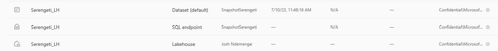
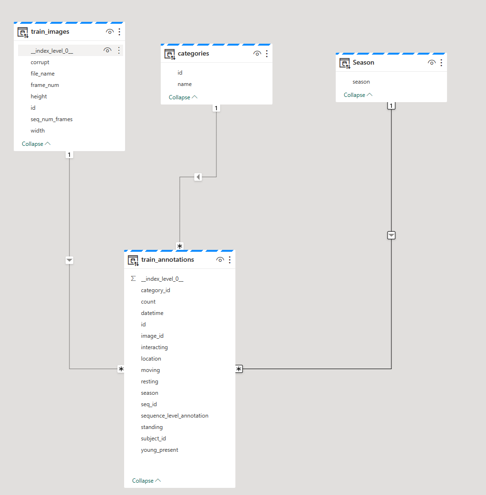
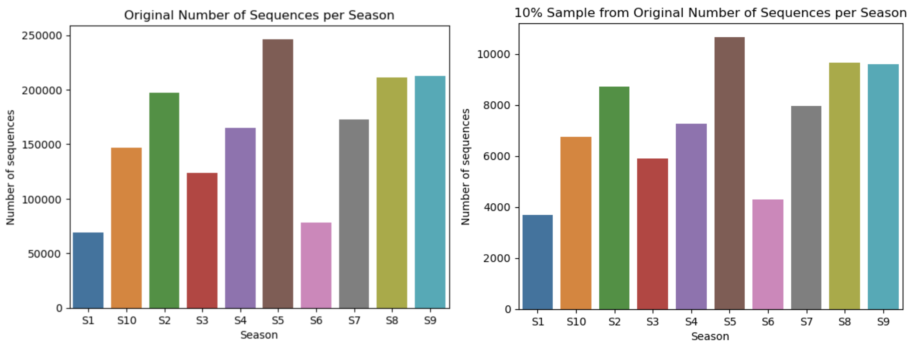

## Introduction

The data we'll be using in this workshop is the [Snapshot Serengeti dataset]((https://lila.science/datasets/snapshot-serengeti)). 

> **Citation:** *The data used in this project was obtained from the Snapshot Serengeti project.*

>Swanson AB, Kosmala M, Lintott CJ, Simpson RJ, Smith A, Packer C (2015) Snapshot Serengeti, high-frequency annotated camera trap images of 40 mammalian species in an African savanna. Scientific Data 2: 150026. DOI: https://doi.org/10.1038/sdata.2015.26

---

## Pre-requisites
1. You should be familiar with basic data concepts and terminology. 
1. Have [M365 account for Power BI Service](https://learn.microsoft.com/power-bi/enterprise/service-admin-signing-up-for-power-bi-with-a-new-office-365-trial?WT.mc_id=data-91115-davidabu)
2. Activate [Microsoft Fabric in Power BI Service](https://learn.microsoft.com/en-us/fabric/admin/fabric-switch) or watch a Video
3. Create a [Workspace in Fabric](https://learn.microsoft.com/fabric/data-warehouse/tutorial-create-workspace?WT.mc_id=data-91115-davidabu)

---

## Loading Data into Lakehouse
In this section we'll load the data into the Lakehouse. The data is available in a public Blob Storage container. 

To begin, we will create and configure a new Lakehouse. To do this, in your workspace open the Data Engineering workload and create a new Lakehouse.


To load the data to the Lakehouse we will use the Data Factory pipelines, that will allow us to copy the data files into the Lakehouse. To do this: click on Get data and select New Data Pipeline. Provide a name then Create.

From the wizard that opens; choose Azure Blob Storage as your data source then click next.


Create a new connection by providing the following URL:
```url
https://ssfabric.blob.core.windows.net/parquet-files
```
Provide an appropriate connection name, and for the Authentication kind select Anonymous and click next. 


If you get an error Unable to list files, provide the parent directory as follows ```parquet-files/``` then click on retry and this should fix the error. 

Click on the root folder and on the right panel under file format select ```Parquet``` then click Next.


For the destination select ```Lakehouse``` and click next. In the drop down that appears select your Lakehouse then click next.

Select the Root folder to be Files, and under folder path, set this to a subdirectory called data. Leave the other files blank and click next.


For the last configuration step of your data destination, select the File format to be ```Parquet``` and leave the other fields as they are and click next. 

Finally review your configuration to copy data from the Blob Storage to your Lakehouse. Click Save + Run, to save and run your pipeline.


This will take around 2 and a half minutes to execute after which you navigate back to the Lakehouse to explore and process the data. 


From the Lakehouse explorer click on the ellipsis button on the Files Directory and click Refresh. Upon refreshing you’ll find the newly created subdirectory called data.

Clicking this subdirectory will reveal the 5 parquet files we copied from blob storage.


Now that we already have the data files, we will need to load the data from these files into Delta tables. To do this right click on the individual parquet files and click ```Load to Tables``` and then ```Load```.  This will load the respective parquet file into a Delta table.

Note that you can only load the next file after the previous one has been loaded to Delta Tables.

After successful loading you can see the five tables in the Explorer.


Now that we have successfully loaded the data you click on the individual table to view the data. 

A description of the data contained in each table is as follows:

1. ```categories``` - This table contains the different categories of animal species in the dataset, with the ```id``` and ```name``` columns.

2. ```annotations``` - This table contains the annotations for each image in the dataset. The ```id``` column is the unique identifier for each annotation, the ```image_id``` column is the unique identifier for each image, the ```category_id``` column is the unique identifier for each category, the ```seq_id``` 

---
## Exploring the SQL endpoint
### What we will cover
This session covers the SQL-based experience with Microsoft Fabric. The Serengeti dataset is a collection of wildlife images captured by camera traps in the Serengeti National Park in Tanzania.The goal of this session is to run SQL scripts, model the data and run measures.


### Milestone 1: Load your dataset
The images are load in your Lakehouse. Automatically, the [SQL Endpoint](https://learn.microsoft.com/en-us/fabric/data-warehouse/get-started-lakehouse-sql-endpoint) is created immediately you load data into your Lakehouse. In a Microsoft Fabric workspace, a SQL Endpoint is labeled "SQL Endpoint" under the Type column. Each Lakehouse has an autogenerated SQL Endpoint that can be leveraged through familiar SQL tools such as [SQL Server Management Studio](https://learn.microsoft.com/en-us/sql/ssms/download-sql-server-management-studio-ssms), [Azure Data Studio](https://learn.microsoft.com/en-us/sql/azure-data-studio/what-is-azure-data-studio), the [Microsoft Fabric SQL Query Editor](https://learn.microsoft.com/en-us/fabric/data-warehouse/sql-query-editor).


In your workspace, Click the `Serengeti_LH `which has the **Type** SQL endpoint





You will see all your data loaded and we will be working with the followig tables
- `train_annotations`
- `train_images`
- `categories`


There are 3 views within the Warehouse
- **Data** - This is where all data are stored
- **Query** - This is where you build your SQL solutions
- **Model** - This is where you connect your tables together


### Milestone 2: Create Views with SQL Query


Based on our `train_annotations` data, we want to create a dimension for **season** column and we will use the SQL to get that


1. Click **New SQL Query** at the top of your screen
2. Write this code
```
SELECT DISTINCT season
FROM train_annotations
```
3. Highlight the code and click **Run**
You will see the **Results**
4. To save as View, Highlight the code again and Click **Save as View**
5. Give it a name and Click Ok
It automatically create a View in the Views Folder on your left hand side


### Milestone 3: Build Model and Define Relationship


We want to build relationships with the 4 tables we now have
- `train_annotations`
- `train_images`
- `categories`
- `Season`


To create relationship
1. Click **Categories[id]** and drag to connect to **train_annotations[category_id]**
2. Click **Season[season]** and drag to connect to **train_annotation[category_id]**
3. Click **train_images[id]** and drag to connect to **train_annotation[images_id]**


At the end, you should have a visual like this 



### Milestone 3: New Measures 
This section is about building measures for our analysis. Depending on your report, you will have some core measures you need for your report. 


To write our first measure
1. Click New measure above
2. Change measure to Annotation
3. Type 
```
Annotations = COUNTROWS(train_annotations)
```
4. Click **Mark sign**
5. On your right side, check the **properties**, you can change the **Home table** and format the measure


Apply same steps above for a new maesure called **Images**
```
Images = COUNTROWS(train_images)
```


Next is creating report, if there is a table you do not want to use at the reprting phase, do the following steps
1. Click the **table**
2. Click the **...**
3. Click **Hide in report view**

---
## Data Visualization using Power BI
### What we will cover
This section covers the understanding of data analysis within Fabric . The Serengeti dataset is a collection of wildlife images captured by camera traps in the Serengeti National Park in Tanzania. The goal of this project is to analyze the trained data.


From our previous lesson in SQL endpoint, we have been able to create measures and build relationship, creating a report will be easier.


Clik on New Report and you will see the Power BI interface.


This report below is what we will build for this worskhop 


To build this report


In the filter pane, 
- drag **Categoris[id]** to the **Filters on all pages**
- in Filter type, change **Advanced filtering** to **Basic filtering**
- Click **Select all**
- unselect **0** (based on our report, we dont need it)


To bring in Visuals
1. For the first card visual
- Click a **card** visual, click the measure called **annonation** in the **train_annontation** table
- you can Format your visual in the **format icon** in the Visualization pane


2. For the second card visual
- Click a **card** visual, click the measure called **images** in the **train_images** table
- you can Format your visual in the **format icon** in the Visualization pane


3. For Slicers
- Click a **slicer** visual, Click **season[season]**
- Click another **slicer** visual, Click **Category[name]**
- you can Format your visual in the **format icon** in the Visualization pane


4. Annotation by Season
- Click **Clustered bar chart**
- Click **season[season]** and **train_annontation[annotations]**
- you can Format your visual in the **format icon** in the Visualization pane


5. Top Number of Annontations by Animals
- Click **Clustered bar chart**
- Click **Category[name]** and **train_annontation[annotations]**
- In the Format Pane, Check the **name**, change **Advanced filtering** to **TopN**
- Show items , **Top N** and write **5** beside
- By Value, drag **train_annontation[annotations]** into the blank space
- you can Format your visual in the **format icon** in the Visualization pane


6. Botom Number of Annontations by Animals
- Click **Clustered bar chart**
- Click **Category[name]** and **train_annontation[annotations]**
- In the Format Pane, Check the **name**, change **Advanced filtering** to **TopN**
- Show items , Change **Top** to **Bottom** and **5** beside
- By Value, drag **train_annontation[annotations]** into the blank space
- you can Format your visual in the **format icon** in the Visualization pane


You can explore the data more.

---
## Data Analysis & Transformation with Apache Spark in Fabric
Now that we have successfully, loaded the data into the Lakehouse and explored how to leverage the SQL endpoint to create views and build relationships, we will now explore how to use Fabric Notebooks to perform data analysis and transformation.

In this section we will learn how to use Apache Spark for data processing and analytics in a Lakehouse. To learn more about Apache Spark in Fabric see [this learn module](https://learn.microsoft.com/en-gb/training/modules/use-apache-spark-work-files-lakehouse/?WT.mc_id=data-91115-jndemenge).

To edit and run Spark code in Microsoft Fabric we will use the Notebooks which very similar to Jupyter Notebooks. To create a new Notebook, click on the ```Open Notebook``` from the Lakehouse and from the drop down menu select ```New Notebook```. This will open a new Notebook. On the top right corner of the workspace click on the Notebook name and rename it to ```analyze-and-transform-data```. Click on any empty area to close and rename the Notebook.


To begin we will load the annotations data from the Lakehouse `train_annotations` table. From this we get information about each season's sequences and labels. 

We'll then filter out the relevant columns that are we need , *i.e season, seq_id, category_id, image_id and date_time* and also need to filter out all records whose category_id is greater than 1 to exclue all empty and human images which are not relevant for this training. 

Finally remove any null values in the `image_id`` column and drop any duplicate rows, finally convert the spark dataframe to a pandas dataframe for easier manipulation.

Paste the code below into the first cell of the Notebook and run it. Update the select query with the name of the your Lakehouse name.

```python
# Read all the annotations in the train table from the lakehouse
df = spark.sql("SELECT * FROM workshop_lh.train_annotations WHERE train_annotations.category_id > 1")

# filter out the season, sequence ID, category_id snf image_id
df_train = df.select("season", "seq_id", "category_id", "location", "image_id", "datetime")

# remove image_id wiTH null and duplicates
df_train = df_train.filter(df_train.image_id.isNotNull()).dropDuplicates()

# convert df_train to pandas dataframe
df_train = df_train.toPandas()
```
Next we will define a function to plot the number of image sequences in each season. We'll achieve this by using the matplotlib and seaborn libraries.

```python
import pandas as pd
import matplotlib.pyplot as plt
import seaborn as sns

def plot_season_counts(df, title="Number of Sequences per Season"):
    # Extract the season from the seq_id column using a lambda function
    df['season'] = df.seq_id.map(lambda x: x.split('#')[0])

    # Count the number of sequences in each season, and sort the counts by season
    season_counts = df.season.value_counts().sort_index()

    # Replace 'SER_' prefix in season labels with an empty string for easy visibility
    season_labels = [s.replace('SER_', '') for s in season_counts.index]

    # Create a bar plot where the x-axis represents the season and the y-axis represents the number of sequences in that season
    sns.barplot(x=season_labels, y=season_counts.values)
    plt.xlabel('Season')
    plt.ylabel('Number of sequences')
    plt.title(title)
    plt.show()
```
This function takes a single argument `df`, which is the pandas DataFrame containing the `seq_id` column. The function first extracts the season from the `seq_id` column using a lambda function, and then counts the number of sequences in each season using the `value_counts` method of the pandas Series object. The counts are sorted by season using the `sort_index` method.

We then can call the function and pass the `df_train` dataframe as an argument.

```python
plot_season_counts(df_train, "Original Number of Sequences per Season")
```
This will plot the number of sequences in each season.


Since we are working with camear trap data, it is common to have mutlple images in a sequence. 

> A sequence is a group of images captured by a single camera trap in a single location over a short period of time. The images in a sequence are captured in rapid succession, and are often very similar to each other.

We can visualize the number of images we have for each sequence and after executing the code snippet below you will notice that by far most sequences have between 1 and 3 images in them.
```python
import seaborn as sns

# Create the count plot
ax = sns.countplot(x=df_train.groupby('seq_id').size(), log=True)

# Set the title and axis labels
ax.set_title('Number of images in each sequence')
ax.set_xlabel('Number of images')
ax.set_ylabel('Count of sequences')

# Show the plot
plt.tight_layout()
plt.show()
```

Next we will load the category names from the Categories table in the lakehouse. We'll then convert the spark dataframe to a pandas dataframe. 

Next the add a new column called *label* in the df_train dataframe which is the category name for each category_id and finally remove the category_id column from df_train and rename the image_id column to filename and append the .JPG extension to the the values

```python
import pandas as pd
import numpy as np

# Load the Categories DataFrame into a pandas DataFrame
category_df = spark.sql("SELECT * FROM workshop_lh.categories").toPandas()

# Map category IDs to category names using a vectorized approach
category_map = pd.Series(category_df.name.values, index=category_df.id)
df_train['label'] = category_map[df_train.category_id].values

# Drop the category_id column
df_train = df_train.drop('category_id', axis=1)

# Rename the image_id column to filename
df_train = df_train.rename(columns={'image_id': 'filename'})

# Append the .JPG extension to the filename column
df_train['filename'] = df_train.filename + '.JPG'
```

Since we are working with a sequence of images we will pick the first image from each sequence, with the assumption that the time period after a camera trap is triggered is the most likely time for an animal to be in the frame. 

```python
# reduce to first frame only for all sequences
df_train = df_train.sort_values('filename').groupby('seq_id').first().reset_index()

df_train.count()
```

The `df_train.count()` method returns the number of rows in the dataframe. Which now reduces to approximately 589758 rows.

Now that we have handled the image sequences, we will now anayze the lables and as well plot the distribution of labels in the dataset. To do this we define a function to make the plot. 

```python
def plot_label_distribution(df):
    # Create a horizontal bar plot where the y-axis represents the label and the x-axis represents the number of images with that label
    plt.figure(figsize=(8, 12))
    sns.countplot(y='label', data=df, order=df['label'].value_counts().index)
    plt.xlabel('Number of images')
    plt.ylabel('Label')

    # Set the x-axis scale to logarithmic
    plt.xscale('log')

    plt.show()
```

The scale of the x-axis is set to logarithmic to make it easier to read the labels and normalize the distribution. Each bar respresents the number of images with that label. 

Call this function with the `df_train` dataframe as an argument.
```python
plot_label_distribution(df_train)
```

Now that we have successfully analyzed the  labels and sequences we'll perform some transformations on the dataframe to prepare it for downloading the images. 

To do this we will define a fuction that takes a filename as the input and returns the image url. 

```python
def get_ImageUrl(filename):
    return f"https://lilablobssc.blob.core.windows.net/snapshotserengeti-unzipped/{filename}"
```

This function is then applied to the `filename` column of the `df_train` dataframe to create a new column called `image_url` which contains the url of the image. 

```python
df_train['image_url'] = df_train['filename'].apply(get_ImageUrl)
```

We can test this by selecting a random image and displaying it. To do this define the following two functions:

```python
import urllib.request

def display_random_image(label, random_state, width=500):
    # Filter the DataFrame to only include rows with the specified label
    df_filtered = df_train[df_train['label'] == label]
    
    # Select a random row from the filtered DataFrame
    row = df_filtered.sample(random_state=random_state).iloc[0]
    
    # Load the image from the URL and display it
    url = row['image_url']
    download_and_display_image(url, label)

# use matplotlib to display the image
def download_and_display_image(url, label):
    image = plt.imread(urllib.request.urlopen(url), format='jpg')
    plt.imshow(image)
    plt.title(f"Label: {label}")
    plt.show()
```

Now call the `display_random_image` function with the label `leopard` and a random state of 12.

```python
display_random_image(label='leopard', random_state=12)
```


---

## Download the image files into the Lakehouse
Now that we have succssfully analyzed the data and performed some tranformations to prepare the data for downloading the images, we will now download the images into the lakehouse.

> For demo puprpses we will not use the entire training dataset. Instead we will use a small percentage of the dataset.

To do this we will select a subsst of the data from the main dataset in a way that maintains the same proportions of the `label`, `season` and `location`.

To do this define a function that takes in the dataset as an input and a percentage and it calculates how many data points to be included based on that percentage. 

```python
def proportional_allocation_percentage(data, percentage):
    # Calculate the count of the original sample
    original_count = len(data)

    # Calculate the count of the sample based on the percentage
    sample_count = int((percentage / 100) * original_count)

    # Perform proportional allocation on the calculated sample count
    return proportional_allocation(data, sample_count)
```
Notice that this function uses another function to perform the actual proportional allocation. 

```python
def proportional_allocation(data, sample_size):
    # Group the data by "label", "season", and "location" columns
    grouped_data = data.groupby(["label", "season", "location"])

    # Calculate the proportion of each group in the original sample
    proportions = grouped_data.size() / len(data)

    # Calculate the count of each group in the sample based on proportions
    sample_sizes = np.round(proportions * sample_size).astype(int)

    # Calculate the difference between the desired sample size and the sum of rounded sample sizes
    size_difference = sample_size - sample_sizes.sum()

    # Adjust the sample sizes to account for the difference
    if size_difference > 0:
        # If there is a shortage of items, allocate the additional items to the groups with the largest proportions
        largest_proportions = proportions.nlargest(size_difference)
        for group in largest_proportions.index:
            sample_sizes[group] += 1
    elif size_difference < 0:
        # If there is an excess of items, reduce the sample sizes from the groups with the smallest proportions
        smallest_proportions = proportions.nsmallest(-size_difference)
        for group in smallest_proportions.index:
            sample_sizes[group] -= 1

    # Initialize an empty list to store the sample
    sample_data = []

    # Iterate over each group and randomly sample the required count
    for group, count in zip(grouped_data.groups, sample_sizes):
        indices = grouped_data.groups[group]
        sample_indices = np.random.choice(indices, size=count, replace=False)
        sample_data.append(data.loc[sample_indices])

    # Concatenate the sampled dataframes into a single dataframe
    sample_data = pd.concat(sample_data)

    # Reset the index of the sample DataFrame
    sample_data.reset_index(drop=True, inplace=True)

    return sample_data
```

This second function, groups the data based on the `label`, `season` and `location` columns and calculates the proportion of each group in the original sample. It then calculates the count of each group in the sample based on proportions.

It also  adjusts the sample sizes if necessary to make sure the total sample size matches the desired count. Finally, it randomly selects the appropriate number of data points from each group and returns the resulting sample, which is a smaller dataset that represents the original dataset's proportions accurately.

For pursoses of this demo we we will use 0.05% of the original dataset. 

```python
percent = 0.05
sampled_train = proportional_allocation_percentage(df_train, percent)
plot_season_counts(sampled_train, f"{percent}% Sample from Original Number of Sequences per Season")
```
A sid by side comparison is for the original dataset and the sampled dataset is shown below:



Now that we have a sampled dataset, we will download the images into the lakehouse.

To do, we will be using the opencv library to download the images. We will need to install the opencv library using pip. Execute the following code block in a new cell to install the opencv library and imutils library which is a set of convenience tools to make working with OpenCV easier.

```python
%pip install opencv-python imutils
```
Next define a funtion that takes in the url of the image and the path to download the image to. 

```python
import urllib.request
import cv2
import imutils

def download_and_resize_image(url, path, kind):
    filename = os.path.basename(path)
    directory = os.path.dirname(path)

    directory_path = f'/lakehouse/default/Files/images/{kind}/{directory}/'

    # Create the directory if it does not exist
    os.makedirs(directory_path, exist_ok=True)

    # check if file already exists
    if os.path.isfile(os.path.join(directory_path, filename)):
        return

    # Download the image
    urllib.request.urlretrieve(url, filename)

    # Read the image using OpenCV
    img = cv2.imread(filename)

    # Resize the image to a reasonable ML training size using imutils
    resized_img = imutils.resize(img, width=224, height=224, inter=cv2.INTER_AREA)

    # Save the resized image to a defined filepath
    cv2.imwrite(os.path.join(directory_path, filename), resized_img)
```

The kind parameter is uded to define whether the image is a training image or a validation/testing image.

We are going to use this `download_and_resize_image` function in another function that will excute the download in parallel using the `concurrent.futures` library. 

```python
import concurrent.futures

def execute_parallel_download(df, kind):
    # Use a process pool instead of a thread pool to avoid thread safety issues
    with concurrent.futures.ProcessPoolExecutor() as executor:
        # Batch process images instead of processing them one at a time
        urls = df['image_url'].tolist()
        paths = df['filename'].tolist()
        futures = [executor.submit(download_and_resize_image, url, path, kind) for url, path in zip(urls, paths)]
        # Wait for all tasks to complete
        concurrent.futures.wait(futures)
```
Next we will prepare the test data in the same way we have the train data then download both the train and test images.

```python
df = spark.sql("SELECT * FROM workshop_lh.test_annotations WHERE test_annotations.category_id > 1")

df_test = df.select("season", "seq_id", "category_id", "location", "image_id", "datetime")

df_test= df_test.filter(df_test.image_id.isNotNull()).dropDuplicates()

df_test = df_test.toPandas()

df_test['label'] = category_map[df_test.category_id].values

df_test = df_test.drop('category_id', axis=1)

df_test = df_test.rename(columns={'image_id':'filename'})

df_test['filename'] = df_test.filename+ '.JPG'

df_test = df_test.sort_values('filename').groupby('seq_id').first().reset_index()

df_test['image_url'] = df_test['filename'].apply(get_ImageUrl)

sampled_test = proportional_allocation_percentage(df_test, 0.27)
```

From this code snippet we create a test set using 0.27% from the original test set.

Neect we execute the download of the images: this will take approximately 10 minutes to complete.

```python
execute_parallel_download(sampled_train, 'train')
execute_parallel_download(sampled_test, 'test')
```

Once the download is complete we will then save the sampled train and test dataframes to parquet files in the lakehouse, for use in the next section. We drop all the columns except the filename and label columns, since these are the only required columns for training the model.

```python
train_data_file = os.path.join(data_dir, 'sampled_train.parquet')
test_data_file = os.path.join(data_dir, 'sampled_test.parquet')

sampled_train.loc[:, ['filename', 'label']].to_parquet(train_data_file, engine='pyarrow', compression='snappy')
sampled_test.loc[:, ['filename', 'label']].to_parquet(test_data_file, engine='pyarrow', compression='snappy')
```
You can view the saved parquet files from the Lakehouse explorer.


This concludes the data preparation section. The next section covers how to train your ML model using the sampled data.

---

## Training a Machine Learning Model

### What we will cover
This section covers training a deep learning model on the Serengeti dataset. The Serengeti dataset is a collection of wildlife images captured by camera traps in the Serengeti National Park in Tanzania. The goal of this project is to train a model that can accurately classify the different species of animals in the images.

> [Notebook for training our model](assets/Serengeti%20train.ipynb)

### Prerequisites:
In this section you will need the following libraries:
- Torch and torchvision for deep learning using [pytorch](https://pytorch.org/)
- Pandas, numpy and matplotlib
- Pillow to load and read an image file.
- Scikit-learn: we use label encoder to convert labels into numerical value

You can install all the necessary libraries using pip, for example: `pip install torch`

### Milestone 1: Load your dataset
The images are already loaded in the lakehouse and a `parquet` file contains image details including season and labels. First we convert the parquet files to Delta tables. In machine learning, Delta tables can be used to store training data for machine learning models, allowing you to easily update the data and retrain the model.


To convert our data from parquet to delta files we:
* Go to Lakehouse
* Right click on our dataset, you will do this for both `sample_test.parquet` and `sample_train.parquet`
* Select **load to Tables** and **create a new table.**

Once our data is in delta files, we load our data and convert it to a Pandas dataframe:
```python
# load our data 
train_df = spark.sql("SELECT * FROM Serengeti_LH.sampled_train LIMIT 1000")

# convert train_df to pandas dataframe
train_df = train_df.toPandas()
```

Lastly, we convert our file name to read the image URL as follows:
```python
# Define a function to apply to the filename column
def get_ImageUrl(filename):
    return f"/lakehouse/default/Files/images/train/{filename}"

# Create a new column in the dataframe using the apply method
train_df['image_url'] = train_df['filename'].apply(get_ImageUrl)
```

Our output will be as follows:


### Milestone 2: Transform your data
#### **Label encoding**
First, we transform categorical data to numerical data using LabelEncoder. It assigns a unique integer to each category in the data, allowing machine learning algorithms to work with categorical data.

You can do this by:
```python
from sklearn.preprocessing import LabelEncoder

# Create a LabelEncoder object
le = LabelEncoder()

# Fit the LabelEncoder to the label column in the train_df DataFrame
le.fit(train_df['label'])

# Transform the label column to numerical labels using the LabelEncoder
train_df['labels'] = le.transform(train_df['label'])
```
> 📘 Our test dataset:
>
> Ensure you repeat the process for test dataset, drop the filename column and merge the two dataframes using `pd.concat()`

#### **Transforming our dataset**
To train our model, we customize our dataset, transforming our files to tensors with the size 224x224 pixels. This is done to both the train and test dataset as follows:
```python
from torch.utils.data import Dataset
import os
from PIL import Image

class CustomDataset(Dataset):
    def __init__(self, root_dir, transform=None):
        self.root_dir = root_dir
        self.data = data
        self.transform = transform

    def __len__(self):
        return len(self.data)

    def __getitem__(self, idx):
        while True:
            img_name = os.path.join(self.root_dir, self.data.iloc[idx, 0])
            if not os.path.exists(img_name):
                idx = (idx + 1) % len(self.data)
                continue
            image = Image.open(img_name)
            if self.transform:
                image = self.transform(image)
            labels = self.data.iloc[idx, 1]
            return image, labels

transform = transforms.Compose([
    transforms.Resize((224, 224)),
    transforms.ToTensor()
])

train_set = CustomDataset("/lakehouse/default/Files/images/train/", transform=transform)
test_set = CustomDataset("/lakehouse/default/Files/images/test/", transform=transform)
```
Lastly, we load the training and testing datasets in batches using Dataloader as follows:
```python
# Load the training and test data
train_loader = DataLoader(train_set, batch_size=100, shuffle=True, num_workers=2)
test_loader = DataLoader(test_set, batch_size=100, shuffle=False, num_workers=2)
```
The `batch_size` parameter specifies the number of samples in each batch, the `shuffle` parameter specifies whether to shuffle the data before each epoch, and the `num_workers` parameter specifies the number of subprocesses to use for data loading.

The purpose of using data loaders is to efficiently load and preprocess large datasets in batches, which can improve the training speed and performance of machine learning models.

### Milestone 3: Train your model
#### **Setting up mlflow to track our experiments**
`mlflow` is an open source platform for managing the end-to-end machine learning lifecycle. It provides tools for tracking experiments, packaging code into reproducible runs, and sharing and deploying models. 

```python
# Using mlflow library to activate our ml experiment

import mlflow

mlflow.set_experiment("serengeti-experimane")
```

In the code above, we use the `set_experiment` function from the `mlflow` library to set the active experiment to "serengeti-exp". This will allow us to track the results of our machine learning experiments and compare them across different runs. 

By using `mlflow`, we can easily log and track the parameters, metrics, and artifacts of our machine learning experiments, and visualize and compare the results using the Microsoft Fabric UI.


#### **Loading DenseNet 201 model**
We use a convolutional neural network (CNN) to classify the images in the Serengeti dataset. The CNN consists of several convolutional layers followed by max pooling layers and fully connected layers.

In our case, we are load a pre-trained DenseNet 201 model from the `torchvision` library and modifying its classifier layer to output 50 classes instead of the default 1000 classes. The DenseNet 201 model is a convolutional neural network (CNN) that has been pre-trained on the ImageNet dataset, which contains millions of images across 1000 classes. The model consists of several convolutional layers followed by dense layers and a softmax output layer.

Next, we modify the classifier layer of the pre-trained model by replacing it with a new `nn.Linear` layer that has 50 output features. This is done to adapt the pre-trained model to the specific classification task at hand, which is to classify images of wildlife in the Serengeti dataset into 50 different species.

Additionally we check if a GPU is available and moves the model to the GPU if it is available. This is done to accelerate the training process if a GPU is available.

After this code is executed, the `model` object will be a pre-trained DenseNet 201 model with a modified classifier layer that can be used to classify images of wildlife in the Serengeti dataset into 50 different species. The code is as follows:

```python
import torchvision

# load the pre-trained DenseNet 201 model
model = torchvision.models.densenet201(pretrained=True)
num_ftrs = model.classifier.in_features
model.classifier = nn.Linear(num_ftrs, 53)
device = torch.device("cuda:0" if torch.cuda.is_available() else "cpu")
model = model.to(device)
```
### Loss Function
We use the cross-entropy loss function and the Adam optimizer to train the model. The code is as follows:
```python
# define the loss function
criterion = nn.CrossEntropyLoss()
optimizer = optim.Adam(model.parameters(), lr=0.01)
```

The `nn.CrossEntropyLoss()` function is used to define the loss function. This loss function is commonly used for multi-class classification problems, such as the Serengeti dataset, where there are multiple classes to predict. The `nn.CrossEntropyLoss()` function combines the `nn.LogSoftmax()` and `nn.NLLLoss()` functions into a single function.

The `optim.Adam()` function is used to define the optimizer. The Adam optimizer is a popular optimization algorithm for training deep learning models. It is an adaptive learning rate optimization algorithm that is well-suited for large datasets and high-dimensional parameter spaces.

The `model.parameters()` function is used to specify the parameters that need to be optimized. In this case, it specifies all the parameters of the `model` object, which includes the weights and biases of the convolutional layers and the classifier layer.

The learning rate for the optimizer is set to 0.01 using the `lr` parameter. This is the step size at which the optimizer updates the model parameters during training.

#### Training our model
Using the DenseNet Model we just loaded, we go ahead and train our model as follows:
```python
# train the model
num_epochs = 5
for epoch in range(num_epochs):
    print('Epoch {}/{}'.format(epoch, num_epochs - 1))
    print('-' * 10)

    # Each epoch has a training and validation phase
    for phase in ["train", "val"]:
        if phase == "train":
            model.train()  # Set model to training mode
        else:
            model.eval()  # Set model to evaluate mode

        running_loss = 0.0
        running_corrects = 0
        for i, data in enumerate(train_loader, ):
            # get the inputs
            inputs, labels = data[0].to(device), data[1].to(device)
            inputs = inputs.to(device)
            labels = labels.to(device)

            # zero the parameter gradients
            optimizer.zero_grad()

            # forward
            # track history if only in train
            with torch.set_grad_enabled(phase == "train"):
                outputs = model(inputs)
                _, preds = torch.max(outputs, 1)
                loss = criterion(outputs, labels)

                # backward + optimize only if in training phase
                if phase == "train":
                    loss.backward()
                    optimizer.step()

            # print statistics
            running_loss += loss.item()
            if i % 100 == 99:    # print every 100 mini-batches
                print('[%d, %5d] loss: %.3f' %
                    (epoch + 1, i + 1, running_loss / 100))
                running_loss = 0.0
        
    print('Finished Training')
```
Model training output:

### Milestone 3: Saving our model:
We can also use the `mlflow` library to log the trained PyTorch model to the MLflow tracking server and register it as a model version with the name "serengeti-pytorch". Once the model is saved, it can be loaded and used later for inference or further training.

The code for this is:
```python
# use an MLflow run and track the results within our machine learning experiment.

with mlflow.start_run() as run:
    print("log pytorch model:")
    mlflow.pytorch.log_model(
        model, "pytorch-model"
        registered_model_name="serengeti-pytorch"
    )
    
    model_uri = "runs:/{}/pytorch-model".format(run.info.run_id)
    print("Model saved in run %s" % run.info.run_id)
    print(f"Model URI: {model_uri}")
```

The results are as follows:


### Milestone 4: Evaluating our Machine Learning model
Once we have trained our model, the next step is to evaluate its performance. We load our PyTorch model from the MLflow tracking server using the `mlflow.pytorch.load_model()` function and evaluating it on the test dataset.

Once the evaluation is complete, the code prints the final test loss and accuracy.

```python
# load and evaluate the model
loaded_model = mlflow.pytorch.load_model(model_uri)
print(type(loaded_model))
correct_cnt, total_cnt, ave_loss = 0, 0, 0
for batch_idx, (x, target) in enumerate(test_loader):
    x, target = x, target
    out = loaded_model(x)
    loss = criterion(out, target)
    _, pred_label = torch.max(out.data, 1)
    total_cnt += x.data.size()[0]
    correct_cnt += (pred_label == target.data).sum()
    ave_loss = (ave_loss * batch_idx + loss.item()) / (batch_idx + 1)
    
    if (batch_idx + 1) % 100 == 0 or (batch_idx + 1) == len(test_loader):
        print(
            "==>>> epoch: {}, batch index: {}, test loss: {:.6f}, acc: {:.3f}".format(
                epoch, batch_idx + 1, ave_loss, correct_cnt * 1.0 / total_cnt
            )
        )

```
Model evaluation results:

Next, we test our model with a single image. We use the `PIL` library to load an image from a file, resizing it to a fixed size, converting it to a PyTorch tensor, passing it through our trained PyTorch model, and getting the output as follows:

```python
# Resize the image to a fixed size
resize_transform = transforms.Resize((224, 224))
image = resize_transform(image)

# Convert the image to a PyTorch tensor
tensor_transform = transforms.ToTensor()
tensor = tensor_transform(image)

# Add a batch dimension to the tensor
tensor = tensor.unsqueeze(0)

# Load the model from MLflow
model = mlflow.pytorch.load_model(model_uri)

# Set the model to evaluation mode
model.eval()

# Pass the tensor through the model to get the output
with torch.no_grad():
    output = model(tensor)

# Get the predicted class
_, predicted = torch.max(output.data, 1)

print(predicted.item())
```

---

## Resources
- [Get Started with Microsoft Fabric](https://learn.microsoft.com/en-us/fabric/get-started/microsoft-fabric-overview?WT.mc_id=academic-91115-bethanycheum)
- [Explore lakehouses in Microsoft Fabric](https://learn.microsoft.com/en-us/training/modules/get-started-lakehouses/?WT.mc_id=academic-91115-bethanycheum)
- [Ingest Data with Dataflows Gen2 in Microsoft Fabric](https://learn.microsoft.com/en-us/training/modules/use-dataflow-gen-2-fabric/?WT.mc_id=academic-91115-bethanycheum)
- [Get Started with data science in Microsoft Fabric](https://learn.microsoft.com/en-us/training/modules/get-started-data-science-fabric/?WT.mc_id=academic-91115-bethanycheum)
- [Grow and Learn with the Microsoft Fabric Community](https://community.fabric.microsoft.com/?WT.mc_id=academic-91115-bethanycheum)

