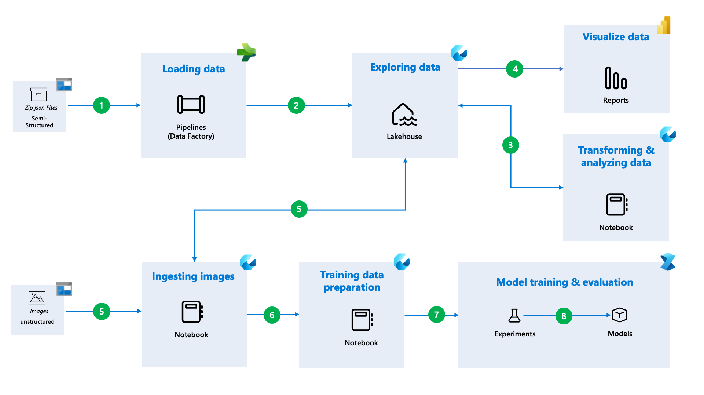
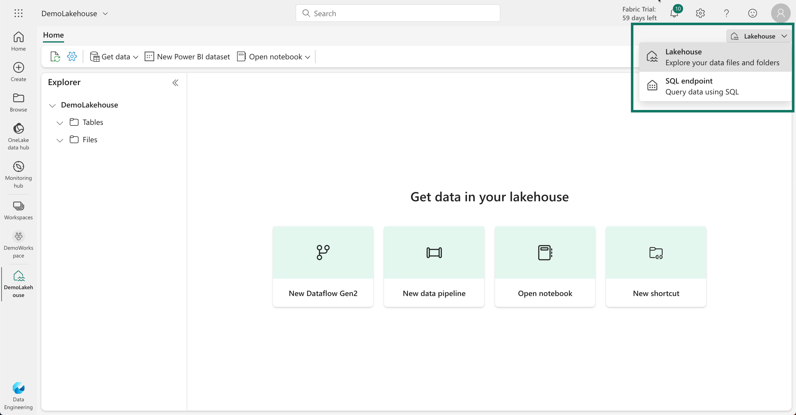
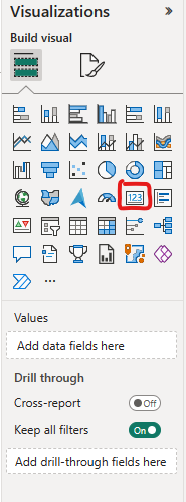

## Introduction

Suppose you are a wildlife researcher who is studying the diversity of wildlife in the African Savannah. You have millions of images captured by camera traps and all the image data store in json metadata files. How do you make sense of all this data? How do you build a data analytics solution that can handle large-scale and complex data sets?

This workshop will walk you through the process of building an end-to-end data analytics solution thats can help you answer these questions using Microsoft fabric. Microsoft Fabric is a unified data platform that offers a comprehensive suit of services such as data science, data engineering, real-time analytics, and business intelligence.

You will learn how to:
- Load data into Microsoft Fabric using Data Factory pipelines.
- Leverage SQL queries to explore and analyze the data.
- Create reports & Visualize the data using Power BI.
- Use Apache Spark for data processing and analytics.
- Train & Evaluate a machine learning model using the data science workload in Microsoft Fabric.



By the end of this workshop, you will have a better understanding of how to use Microsoft Fabric to create an end-to-end data analytics solution that can handle large-scale and complex data sets. 

This workshop uses the Snapshot Serengeti Dataset. To learn more about the dataset use the links provided in the citation below. 


<div class="info" data-title="Citation">

> *The data used in this project was obtained from the [Snapshot Serengeti project.](https://lila.science/datasets/snapshot-serengeti)*

> Swanson AB, Kosmala M, Lintott CJ, Simpson RJ, Smith A, Packer C (2015) Snapshot Serengeti, high-frequency annotated camera trap images of 40 mammalian species in an African savanna. Scientific Data 2: 150026. DOI: https://doi.org/10.1038/sdata.2015.26
</div>


---

## Pre-requisites

To complete this workshop you will need the following:

1. Familiarity with basic data concepts and terminology. 
2. A [Microsoft 365 account for Power BI Service](https://learn.microsoft.com/power-bi/enterprise/service-admin-signing-up-for-power-bi-with-a-new-office-365-trial?WT.mc_id=data-91115-davidabu)
3. A [Microsoft Fabric License](https://learn.microsoft.com/en-us/fabric/enterprise/licenses?WT.mc_id=data-91115-jndemenge) or [Start the Fabric (Preview) trial](https://learn.microsoft.com/en-us/fabric/get-started/fabric-trial?WT.mc_id=data-91115-jndemenge#start-the-fabric-preview-trial)
4. A [Workspace in Microsoft Fabric](https://learn.microsoft.com/fabric/data-warehouse/tutorial-create-workspace?WT.mc_id=data-91115-davidabu)
5. Make sure your Workspace has the Data Model settings activated 
    - Click **Workspace settings**
    - Click **Power BI**
    - Open **Power BI** and **Click General**
    - **Check** the small box with "Users can edit data models in Power BI service

---

## Loading Data into Lakehouse

In this section we'll load the data into the Lakehouse. The data is available in a public Blob Storage container.

To begin with, we will create a new Lakehouse and configure a Data Factory pipeline to copy the data from the Blob Storage container to the Lakehouse. To do this, in your workspace select the `+ New Item` button and in the pane that opens on the right search for `Lakehouse`, select the `Lakehouse` item, provide the name `SnapshotSerengeti_LH` and click `Create`.


This will create a new Lakehouse for you. Both the `Files` and `Tables` directory are empty. In the next steps we'll load data into the Lakehouse. There are several ways to achieve this:
1. Using [OneLake shortcuts](https://learn.microsoft.com/en-us/fabric/onelake/onelake-shortcuts/?WT.mc_id=data-91115-jndemenge).
2. Uploading data from your device.
3. Using [Data Factory pipelines](https://learn.microsoft.com/en-gb/training/modules/use-data-factory-pipelines-fabric/?ns-enrollment-type=learningpath&ns-enrollment-id=learn.wwl.get-started-fabric/?WT.mc_id=data-91115-jndemenge).

For this workshop we will use the Data Factory pipelines to load the data into the Lakehouse. 

### Configure a Data Factory Pipeline to copy data
In the Lakehouse page, select the `Get Data` drop down from the top menu bar, and in the drop down select `New data pipeline`. Provide a name for your pipeline and click `Create`.


On the Data Factory pipeline page that opens up click on `Add pipeline activity` and on the dialog that appears scroll down to loops and add the `ForEach` activity.

This will open the pipeline canvas and you can configure the settings of the activity in the pane underneath.


in the `General` tab provide a name for the activity. Next click on the `Settings` tab and here we'll provide the items to iterate over. Click in the `Items` text box and click on `Add dynamic content` underneath the text box.

A new pane appears on the right side of the screen, and inside the text box type the following expression:

```js
@createArray('SnapshotSerengetiS01.json.zip',
'SnapshotSerengetiS02.json.zip',
'SnapshotSerengetiS03.json.zip',
'SnapshotSerengetiS04.json.zip',
'SnapshotSerengetiS05.json.zip',
'SnapshotSerengetiS06.json.zip',
'SnapshotSerengetiS07.json.zip',
'SnapshotSerengetiS08.json.zip',
'SnapshotSerengetiS09.json.zip',
'SnapshotSerengetiS10.json.zip',
'SnapshotSerengetiS11.json.zip')
```

<div class="tip" data-title="tip">

> Learn more about functions and expressions in Data factory [here](https://learn.microsoft.com/en-us/azure/data-factory/control-flow-expression-language-functions?WT.mc_id=data-91115-jndemenge)
</div>

We are creating an array of the file names we want to copy from the Blob Storage container. Click ` Ok` to close this pane.

Next, inside the `ForEach` click on the `+` button to add a new activity. From the dialog that appears select `Copy data`. Click the`Copy data` activity and in the pane underneath we'll configure the settings of this activity.

In the `General` tab provide a name for the activity. 

Next, click on the `Source` tab. The Connection dropdown select `more`, and in the dialog that appears, search for `Azure Blobs` and select it.

For the `Account name` provide the following URL:

```url
https://lilawildlife.blob.core.windows.net/lila-wildlife
```

Provide an appropriate connection name, and for the Authentication kind select `Anonymous` and select `Connect`.


Back on the `Source` tab, in the `File path`, the container name as `lila-wildlife` the directory as `snapshotserengeti-v-2-0` and for the File name, click on the `Add dynamic content` button and from the pane that appears click on `ForEach CurrentItem`. Then click `Ok` to close the pane.


For File format dropdown select `Binary` and click on the `Settings` button next to this dropdown. on the dialog that appears for the `Compression type` select `ZipDeflate` for the `Compression level` select `Fastest` and click `Ok` to close the dialog.

Next, click on the `Destination` tab to configure the destination settings. For the `Connection` dropdown, select the `SnapshotSerengeti_LH` Lakehouse you created earlier.

For the Root folder select `Files`. For the File path, the directory, text box type in `raw-data`. Click on the File name text box and click on the `Add dynamic content` button and from the pane that appears put in the following expression:

```js
@replace(item(), '.zip', '')
```
<div class="info">

> This expression will remove the .zip extension from the file name in the current iteration. Remember the file name was in the format `SnapshotSerengetiS01.json.zip` and we want to remove the .zip extension to remain with the file name `SnapshotSerengetiS01.json` after the file has been unzipped and copied to the Lakehouse.
</div>

Click `Ok` to close the pane. Back to the destination configuration, for the File format select `Binary`.

Now that we have finished configuring both activities select the `Run` button on the top menu bar, then select `Run`. On the dialog that opens, select `Save and run`. The pipeline takes a few seconds to copy and unzip all the specified files from the Blob Storage container to the Lakehouse.


Navigate back to the lakehouse to explore the data.

### Explore the data in the Lakehouse

From the Lakehouse right click on the Files Directory and click Refresh. Upon refreshing you’ll find the newly created subdirectory called `raw-data`.

Clicking this subdirectory will reveal the 11 files that we unzipped and copied from the Blob Storage container.


### Convert the json files into Parquet files

We will need to convert the json files into Parquet files. To do this we will leverage the Fabric Notebooks to perform this task. More about Fabric Notebooks will be covered in [section 6](/?step=5).

To create a new Notebook, from the top menu bar select `Open Notebook` then select `New Notebook`. This will create and open a new notebook. 

At the top right corner of the workspace click on the Notebook name and rename it to `convert-json-to-parquet`. Click on any empty area to close and rename the Notebook.

In the first cell of the Notebook paste the following code:

```python
import json
import os
import pandas as pd

# Set the path to the directory containing the raw JSON data
raw_data_path = '/lakehouse/default/Files/raw-data'

# Get the list of JSON files in the raw data path, and select the first 10 for the training set
train_set = os.listdir(raw_data_path)[:10]

# Select the 11th file for the test set
test_set = os.listdir(raw_data_path)[10]

# Initialize empty DataFrames to store images, annotations, and categories data
images = pd.DataFrame()
annotations = pd.DataFrame()
categories = pd.DataFrame()

# Process each JSON file in the training set
for file in train_set:
    # Read the JSON file and load its data
    path = os.path.join(raw_data_path, file)
    with open(path) as f:
        data = json.load(f)

    # Extract and concatenate the 'images' and 'annotations' data into their respective DataFrames
    images = pd.concat([images, pd.DataFrame(data['images'])])
    annotations = pd.concat([annotations, pd.DataFrame(data['annotations'])])

    # The 'categories' data is the same for all files, so we only need to do it once
    if len(categories) == 0:
        categories = pd.DataFrame(data['categories'])

# Set the path to the directory where the processed data will be saved
data_path = '/lakehouse/default/Files/data'

# Create the directory if it doesn't exist
if not os.path.exists(data_path):
    os.makedirs(data_path)

# Define the file paths for saving the training data as Parquet files
train_images_file = os.path.join(data_path, 'train_images.parquet')
train_annotations_file = os.path.join(data_path, 'train_annotations.parquet')
categories_file = os.path.join(data_path, 'categories.parquet')

# Convert the DataFrames to Parquet format using the pyarrow engine with snappy compression
images.to_parquet(train_images_file, engine='pyarrow', compression='snappy')
annotations.to_parquet(train_annotations_file, engine='pyarrow', compression='snappy')
categories.to_parquet(categories_file, engine='pyarrow', compression='snappy')

# Process the test set, similar to the training set
path = os.path.join(raw_data_path, test_set)
with open(path) as f:
    data = json.load(f)

# Define the file paths for saving the test data as Parquet files
test_images_file = os.path.join(data_path, 'test_images.parquet')
test_annotations_file = os.path.join(data_path, 'test_annotations.parquet')

# Extract and convert the 'images' and 'annotations' data of the test set into DataFrames,
# then save them as Parquet files with pyarrow engine and snappy compression
test_images = pd.DataFrame(data['images'])
test_annotations = pd.DataFrame(data['annotations'])

test_images.to_parquet(test_images_file, engine='pyarrow', compression='snappy')
test_annotations.to_parquet(test_annotations_file, engine='pyarrow', compression='snappy')

```

This code will convert the json files into Parquet files and save them in the Lakehouse. Review the code and make sure you understand what each line of code does before running it.

To run the code click on the `Run all` button above the Notebook. This will take a few minutes to run.

Right click on the `Files` directory and click `Refresh`. You will notice that the `data` directory has been created and it contains the Parquet files. We used the json files from season 1 to season 10 to create a training set and season 11 to create a testing set.


### Load the Parquet files into Delta Tables

Now that we already have the data files, we will need to load the data from these files into Delta tables. To do this, navigate back to the Lakehouse and right click on the individual parquet files and click ```Load to Tables``` and then ```Load```.  This will load the respective parquet file into a Delta table.

<div class="tip" data-title="Tip">

> Refer to this [learn module](https://learn.microsoft.com/training/modules/work-delta-lake-tables-fabric/?WT.mc_id=data-91115-jndemenge) to learn more about Delta Lake tables and how to work with them in spark.
</div>

<div class="warning" data-title="Note">

> You can only load the next file after the previous one has been loaded to Delta Tables.
</div>

After successful loading you can see the five tables in the Explorer.


Now that we have successfully loaded the data you click on the individual table to view the data. 

---

## Exploring the SQL endpoint

This section covers the SQL-based experience with Microsoft Fabric. The goal of this section is to run SQL scripts, model the data and run measures.

### Load your dataset

The [SQL Endpoint](https://learn.microsoft.com/en-us/fabric/data-warehouse/get-started-lakehouse-sql-endpoint?WT.mc_id=data-91115-jndemenge) is created immediately after creating the Lakehouse.

This autogenerated SQL Endpoint that can be leveraged through familiar SQL tools such as [SQL Server Management Studio](https://learn.microsoft.com/en-us/sql/ssms/download-sql-server-management-studio-ssms?WT.mc_id=data-91115-jndemenge), [Azure Data Studio](https://learn.microsoft.com/en-us/sql/azure-data-studio/what-is-azure-data-studio?WT.mc_id=data-91115-jndemenge), the [Microsoft Fabric SQL Query Editor](https://learn.microsoft.com/en-us/fabric/data-warehouse/sql-query-editor?WT.mc_id=data-91115-jndemenge).

You can access the SQL endpoint by opening your workspace and you will find it beneath the **Lakehouse** you created. 


Alternatively you can access the SQL endpoint from the Lakehouse by switching the view to **SQL endpoint** from the top right corner and in the drop down menu selecting `SQL endpoint`.



You will see all your data loaded and we will be working with the following tables

- `train_annotations`
- `train_images`
- `categories`


There are 3 views within the Warehouse

- **Data** - This is where all data are stored
- **Query** - This is where you build your SQL solutions
- **Model** - This is where you connect your tables together

To learn more on [Model in Power BI](https://learn.microsoft.com/en-us/training/paths/model-data-power-bi/)

### Create Views with SQL Query

Based on our `train_annotations` data, we want to create a dimension for **season** column and we will use an SQL Query to do that:

1. Click **New SQL Query** at the top of your screen
2. Add the following query

```SQL
SELECT DISTINCT season
FROM train_annotations
```

1. Highlight the code and click **Run**
You will see the **Results**
1. To save as View, Highlight the code again and Click **Save as View**
1. Give it a name and Click Ok
It automatically create a View in the Views Folder on your left hand side


### Build Model and Define Relationship

We want to build relationships with the 4 tables we now have

- `train_annotations`
- `train_images`
- `categories`
- `Season`

To define relationships : Select **Model layouts** on the Explorer pane. You will see all the tables listed above.

1. Click **Categories[id]** and drag to connect to **train_annotations[category_id]**.
A screen will pop up with Create Relationship. 
    a. Cardinality : One to Many
    b. Cross filter direction : Single
    c. Make this relationship active: Ticked
    d. Click **Confirm**
    
2. Click **Season[season]** and drag to connect to **train_annotation[season]**
A screen will pop up with Create Relationship. 
    a. Cardinality : One to Many
    b. Cross filter direction : Single
    c. Make this relationship active: Ticked
    d. Click **Confirm**

3. Click **train_images[id]** and drag to connect to **train_annotation[images_id]**
A screen will pop up with Create Relationship. 
    a. Cardinality : One to Many
    b. Cross filter direction : Single
    c. Make this relationship active: Ticked
    d. Click **Confirm**

At the end, you should have a visual like this


### New Measures

This section is about building measures for our analysis. Depending on your report, you will have some core measures you need for your report.

To write our first measure

1. Select **Reporting** on the top explorer pane then select **Automatically update semantic model**. This will refresh the model and make sure all the tables are up to date.
2. Once the model is refreshed, select **Model layout** on the explorer pane then select the **train_annotations** table and select the **...** on the right hand side of the table name and select **New measure**.
3. In the formula bar, type the following measure:

```SQL
Annotations = COUNTROWS(train_annotations)
```

1. Select the **Check mark sign**
1. On your right side, check the **properties**, you can change the **Home table** and format the measure

Apply same steps above for a new measure called **Images**

```SQL
Images = COUNTROWS(train_images)
```

Apply same steps above for a new measure called **Average_Annotation**


Next is creating report, if there is a table you do not want to use at the reporting phase, do the following steps.

For this workshop, we will not be using these tables at the reporting phase

1. test_annotations
2. test_images

To hide them, do the following below

1. Click the **table**
2. Click the **...**
3. Click **Hide in report view**

---

## Data Visualization using Power BI

### What we will cover

This section covers the understanding of data analysis within Fabric . The Serengeti dataset is a collection of wildlife images captured by camera traps in the Serengeti National Park in Tanzania. The goal of this project is to analyze the trained data.

To understand the Power BI interface, Click this [resource](https://learn.microsoft.com/en-us/power-bi/fundamentals/power-bi-service-overview)

From our previous lesson in SQL endpoint, we have been able to create measures and build relationship, creating a report will be easier.

Click on New Report and you will see the Power BI interface.


This report below is what we will build for this workshop


### Building the Report

In the **filter pane**,


- drag **Categories[id]** to the **Filters on all pages**
- in Filter type, change **Advanced filtering** to **Basic filtering**
- Click **Select all**
- unselect **0** (based on our report, we don't need it)

To build the report, we will use the following visuals

1. For the first visual, we will use a **card** visual



   - On the visualization pane, select a **card** visual. 
   - Select the measure called **annotation** in the **train_annotation** table
   - Select the **format your visual icon** in the Visualization pane


    
 - Select the **Visual** tab then expand the Callout Value and increase the font size to 55.
 - Select and expand the Category label to increase the font size to 18.
 - Select the **General** tab then expand **Effects** and make sure the **Background** is on and set to white.
 - Select and expand **Visual border** and increase the **Rounded corners** to 15.
 - Select and expand **Shadow** and make sure the **Shadow** is toggled on.


2. For the second visual, we will use another **card** visual

- In the visualizations pane select a **card** visual, then select the measure called **images** in the **train_images** table from the **Data** pane.
- Apply the same formatting as the first card visual above to this card visual.

3. For the third visual, we will use a **slicer** visual


- On the visualizations pane select a **slicer** visual, then select **season[season]** from the **Data** pane.
- Select another **slicer** visual on the visualizations pane, then select **Category[name]** from the **Data** pane.
- On visualizations pane, navigate to the **Field** property of the second slicer visual and select the drop down arrow and select **Rename for this visual**.
- Then change **name** to **Animals**.
- On the visualizations pane, select the **format your visual icon** then select the **Visual** tab and expand the **Slicer settings** option then expand **Options** and select **Dropdown** for style. Do this for both slicer visuals.


- You can apply the same formatting as the **Card** visuals using the **format your visual icon** in the Visualization pane

4. Adding a **Clustered bar chart** visual for number of annotations by season


- On the visualizations pane select a **Clustered bar chart** visual, then select **Category[name]** and **train_annotation[annotations]** from the **Data** pane.
- You can apply the same formatting as the **Card** visuals using the **format your visual icon** in the Visualization pane

5. Adding a **Clustered bar chart** visual for the top 5 number of annotations by animals

- On the visualizations pane select a **Clustered bar chart** visual, then select **Category[name]** and **train_annotation[annotations]** from the **Data** pane.
- In the Filters pane, select the **name** and change the filter type from **Advanced filtering** to **TopN**
- For **Show items**, select **Top** and enter the number **5**.
- Set the **By value** to **train_annotation[annotations]** by dragging the field into the blank space.
- You can apply the same formatting as the **Card** visuals using the **format your visual icon** in the Visualization pane


6. Adding a **Clustered bar chart** visual for the bottom 5 number of annotations by animals
    - On the visualizations pane select a **Clustered bar chart** visual, then select **Category[name]** and **train_annotation[annotations]** from the **Data** pane.
    - On the Filters pane, select the **name** and change the filter type from **Advanced filtering** to **TopN**
    - For **Show items**, change **Top** to **Bottom** and enter the number **5**.
    - Set the **By value** to **train_annotation[annotations]** by dragging the field into the blank space.
    - You can apply the same formatting as the **Card** visuals using the **format your visual icon** in the Visualization pane.


Great work in getting to this point. 

I hope you enjoyed this session, You can explore and build more visualizations with the data based on what you have learnt in this session..

---

## Data Analysis & Transformation with Apache Spark in Fabric

<div class="info" data-title ="Skip Notice">

> You can skip this section (section 6) and Section 7 by downloading the [prep_and_transform notebook](assets/notebooks/prep_and_transform.ipynb) and follow the instructions in the `Appendix Section` to import the notebook into your workspace. Then run all the cells in the notebook.
</div>

Now that we have successfully, loaded the data into the Lakehouse and explored how to leverage the SQL endpoint to create views and build relationships, we will now explore how to use Fabric Notebooks to perform data analysis and transformation.

In this section we will learn how to use Apache Spark for data processing and analytics in a Lakehouse. To learn more about Apache Spark in Fabric see [this learn module](https://learn.microsoft.com/en-gb/training/modules/use-apache-spark-work-files-lakehouse/?WT.mc_id=data-91115-jndemenge).

### Creating a Fabric Notebook

To edit and run Spark code in Microsoft Fabric we will use the Notebooks which very similar to Jupyter Notebooks. To create a new Notebook, click on the ```Open Notebook``` from the Lakehouse and from the drop down menu select ```New Notebook```.

This will open a new Notebook. On the top right corner of the workspace click on the Notebook name and rename it to ```analyze-and-transform-data```. Click on any empty area to close and rename the Notebook.


<!-- Before we begin the loading of the data let's install some of the libraries that we'll need.

We will need to install the opencv library using pip. Execute the following code block in the cell to install the opencv library and imutils library which is a set of convenience tools to make working with OpenCV easier.

```python
%pip install opencv-python imutils
``` -->

### Loading data into a Spark Dataframe

To begin we will load the annotations data from the Lakehouse `train_annotations` table. From this we get information about each season's sequences and labels.


We'll then filter out the relevant columns that are we need, *i.e season, seq_id, category_id, image_id and date_time* and also need to filter out all records whose *category_id is greater than 1* to exclude all empty and human images which are not relevant for this training.

Finally remove any null values in the `image_id` column and drop any duplicate rows, finally convert the spark dataframe to a pandas dataframe for easier manipulation.

Paste the code below into a cell of the Notebook and review to understand before you run it. Update the select query with the name of the your Lakehouse name.

```python
# Read all the annotations in the train table from the lakehouse
df = spark.sql("SELECT * FROM SnapshotSerengeti_LH.train_annotations WHERE train_annotations.category_id > 1")

# filter out the season, sequence ID, category_id snf image_id
df_train = df.select("season", "seq_id", "category_id", "location", "image_id", "datetime")

# remove image_id wiTH null and duplicates
df_train = df_train.filter(df_train.image_id.isNotNull()).dropDuplicates()
```

### Analyzing data across seasons

Next we'll analyze the number of image sequences across seasons. We'll achieve this by first creating a new spark dataframe that counts the sequences per season.

Add the following code in a new cell in the Notebook, review to understand and run it.

```python
# Import the required libraries
from pyspark.sql.functions import split, regexp_replace, col

# This splits the seq_id string at '#' and takes the first part.
df_train = df_train.withColumn("season_extracted", split(col("seq_id"), "#").getItem(0))

# Remove the 'SER_' prefix from the extracted season for better readability.
df_train = df_train.withColumn("season_label", regexp_replace(col("season_extracted"), "SER_", ""))

# Group by the season_label and count the number of sequences for each season, then order the results.
df_counts = df_train.groupBy("season_label").count().orderBy("season_label")

# visualize the spark data frame directly in the notebook
display(df_counts)
```

Running this cell will output a table with the columns `season_label` and `count`. The `season_label` column contains the season names and the `count` column contains the number of sequences in each season.

You can further visualize this using the new rich dataframe chart view. To do this select the `+ New Chart` tab from the display() output widget.


This opens the rich dataframe chart view from where you can add up to 5 charts in one display() output widget. Learn more about the rich dataframe chart view [here](https://learn.microsoft.com/en-us/fabric/data-engineering/notebook-visualization?WT.mc_id=data-91115-jndemenge).

In the suggested charts, select `Build my own`, in the **Chart settings ==> Basic** add the following details:
- **Chart type**: Bar chart
- **Title**: Original Number of Sequences per Season
- **Subtitle**: Season 1 to Season 10
- **X-axis**: season_label
- **Y-axis**: count
- **Show Legend**: Toggle off
- **Series group**: None
- **Aggregation**: Sum
- **Stacked**: Toggle off
- **Aggregate all**: Toggle On

Select the **Chart settings ==> Advanced**, here toggle the **Show labels** to on. The rest of the settings can be left as they are but you can play around with the settings to see what they do.

Rename the chart to `Sequences per Season` by selecting the ellipses next to the chart name and selecting `Rename`. Close the chart settings to view the full chart. 


### Analyzing & transforming data across image sequences

Since we are working with camera trap data, it is common to have multiple images in a sequence.

<div class="info">

> A sequence is a group of images captured by a single camera trap in a single location over a short period of time. The images in a sequence are captured in rapid succession, and are often very similar to each other.
</div>

We can visualize the number of images we have for each sequence and after running the code snippet below you will notice that by far most sequences have between 1 and 3 images in them.

```python
from pyspark.sql import functions as F

# Compute the number of images per sequence.
seq_counts = df_train.groupBy("seq_id").count()

# Aggregate the data: group by the image count and count how many sequences have that count.
sequence_length_counts = (seq_counts
    .groupBy("count")
    .agg(F.count("seq_id").alias("Count of sequences"))
    .withColumnRenamed("count", "Number of images")
    .orderBy(F.col("Number of images"))
)

# visualize the spark data frame directly in the notebook
display(sequence_length_counts)
```

Next we will load the category names from the Categories table in the Lakehouse. We'll then add a new column called *label* in the df_train dataframe which is the category name for each category_id and finally remove the category_id column from df_train and rename the image_id column to filename and append the .JPG extension to the filename. We achieve this by defining a function called `transform_image_data` which takes the dataframe and the categories dataframe as input and returns the transformed dataframe. This function will be reused later to perform the same transformation on the test data.

```python
from pyspark.sql.functions import concat, lit

def transform_image_data(df, categories_df):
    """
    Joins the input DataFrame with the categories DataFrame, renames columns,
    and appends a '.JPG' extension to the filename column.
    """
    # Join on category_id to map category names. The join brings the category name as "name", which we then rename to "label".
    df = df.join(
        categories_df.select(col("id").alias("category_id"), col("name")),
        on="category_id",
        how="left"
    ).withColumnRenamed("name", "label")

    # Drop the 'category_id' column
    df = df.drop("category_id")

    # Rename 'image_id' to 'filename'
    df = df.withColumnRenamed("image_id", "filename")

    # Append '.JPG' to the filename
    df = df.withColumn("filename", concat(col("filename"), lit(".JPG")))

    return df

# Load the categories table as a Spark DataFrame
categories_df = spark.sql("SELECT * FROM SnapshotSerengeti_LH.categories")

# Apply trsnaformation for image data
df_train = transform_image_data(df_train, categories_df)
```

Since we are working with a sequence of images we will pick the first image from each sequence, with the assumption that the time period after a camera trap is triggered is the most likely time for an animal to be in the frame.

```python
from pyspark.sql.window import Window
from pyspark.sql.functions import row_number

# Define a window partitioned by seq_id and ordered by filename
windowSpec = Window.partitionBy("seq_id").orderBy("filename")

# Assign a row number to each row within its sequence, filter for the first frame, then drop the helper column.
df_train = df_train.withColumn("row_num", row_number().over(windowSpec)) \
                   .filter(col("row_num") == 1) \
                   .drop("row_num")

# Count the rows in the resulting DataFrame
df_train.count()
```

The `df_train.count()` method returns the number of rows in the dataframe. Which now reduces to approximately 589758 rows.

### Analyzing the image labels

Now that we have handled the image sequences, we will now analyze the labels and as well plot the distribution of labels in the dataset. To do this run the code snippet below in a new cell. 

```python
# Create a new DataFrame that counts the number of images per label
label_counts = df_train.groupBy("label").count().orderBy(col("count").desc())

# Rename the columns for better readability and visualization
label_counts = label_counts.withColumnRenamed("label", "Label") \
                           .withColumnRenamed("count", "Number of images")

# Visualize the label counts
display(label_counts)
```

Create a new bar chart using the rich dataframe chart view, set the X-axis to `Label` and the Y-axis to `Number of images`. Set the chart type to `Bar chart` and set the title to `Distribution of Labels`. In the advanced settings, under **Scale**, set it to `Logarithmic`.

The scale of the x-axis is set to logarithmic to make it easier to read the labels and normalize the distribution. Each bar represents the number of images with that label.

You can configure the other chart settings as desired. Close the chart settings to view the full chart.


### Transforming the dataframe

Now that we have successfully analyzed the  labels and sequences we'll perform some transformations on the dataframe to prepare it for downloading the images.

To do this we will define a function that takes a filename as the input and returns the image url.

```python
def get_ImageUrl(filename):
    return f"https://lilawildlife.blob.core.windows.net/lila-wildlife/snapshotserengeti-unzipped/{filename}"
```

We then create a Spark UDF from the `get_ImageUrl` function and apply it to the filename column of the df_train Spark DataFrame to generate a new column called image_url that contains the complete URL for each image.

This function is then applied to the `filename` column of the `df_train` dataframe to create a new column called `image_url` which contains the url of the image.

```python
from pyspark.sql.functions import udf
from pyspark.sql.types import StringType

# Create a UDF from the function
get_ImageUrl_udf = udf(get_ImageUrl, StringType())

# Apply the UDF to create the image_url column
df_train = df_train.withColumn("image_url", get_ImageUrl_udf(col("filename")))
```

We can test this by selecting a random image and displaying it. To do this define the following two functions:

```python
import urllib.request
import matplotlib.pyplot as plt

def display_random_image(label, random_state, width=500):
    # Filter the Spark DataFrame to only include rows with the specified label,
    # then order randomly (using the provided seed) and select one row.
    row = df_train.filter(col("label") == label) \
                  .orderBy(F.rand(random_state)) \
                  .limit(1) \
                  .collect()[0]
    
    # Get the image URL from the selected row and display the image
    url = row["image_url"]
    download_and_display_image(url, label)

def download_and_display_image(url, label):
    image = plt.imread(urllib.request.urlopen(url), format='jpg')
    plt.imshow(image)
    plt.title(f"Label: {label}")
    plt.axis('off')
    plt.show()
```

Now call the `display_random_image` function with the label `leopard` and a random state of 12.

```python
display_random_image(label='leopard', random_state=12)
```


---

## Download the image files into the Lakehouse

Now that we have successfully analyzed the data and performed some transformations to prepare the data for downloading the images, we will now download the images into the lakehouse.

<div class="important" data-title="Note">

> For demo purposes we will not use the entire training dataset. Instead we will use a small percentage of the dataset.
</div>

### Proportional allocation of the dataset

We will select a subset of the data from the main dataset in a way that maintains the same distribution of the `label`, `season` and `location`.

To do this we define a function called `proportional_allocation_percentage` that takes the dataset and a percentage as input and the performs proportional allocation of the dataset. 

```python
def proportional_allocation_percentage(df, percentage):
    """
    Proportionally allocate a sample of 'percentage'% of df across label, season, location
    """
    # Determine the total number of rows and desired sample size
    total_count = df.count()
    sample_size = int(round(total_count * (percentage / 100.0)))

    # Compute group counts
    group_counts = (
        df.groupBy("label", "season", "location")
          .count()  # number of rows in each group
          .withColumnRenamed("count", "group_count")
    )

    # Compute the proportion of each group, then approximate "sample_needed" via rounding
    group_counts = (
        group_counts
        .withColumn("proportion", F.col("group_count") / F.lit(total_count))
        .withColumn("sample_needed", F.round(F.col("proportion") * sample_size).cast("int"))
    )

    #  Collect just the group-level info to the driver for fine-grained adjustment
    group_counts_pd = group_counts.select(
        "label", "season", "location", "group_count", "sample_needed", "proportion"
    ).toPandas()

    # Sum of "sample_needed" might not equal the total desired sample_size due to rounding
    current_sum = group_counts_pd["sample_needed"].sum()
    difference = sample_size - current_sum

    if difference > 0:
        # If we're short, we add +1 to the groups with the largest proportions until we fix the difference
        # Sort descending by proportion
        group_counts_pd = group_counts_pd.sort_values("proportion", ascending=False)
        for i in range(difference):
            group_counts_pd.iat[i, group_counts_pd.columns.get_loc("sample_needed")] += 1
        # Re-sort back if desired
        group_counts_pd = group_counts_pd.sort_values(["label", "season", "location"])
    elif difference < 0:
        # If we have too many, subtract 1 from the groups with the smallest proportions
        # Sort ascending by proportion
        group_counts_pd = group_counts_pd.sort_values("proportion", ascending=True)
        for i in range(abs(difference)):
            group_counts_pd.iat[i, group_counts_pd.columns.get_loc("sample_needed")] -= 1
        # Re-sort back if desired
        group_counts_pd = group_counts_pd.sort_values(["label", "season", "location"])

    # Create a Spark DataFrame of the final sample allocations
    allocations_sdf = spark.createDataFrame(group_counts_pd)

    #  Join the allocations back to the main DataFrame so each row knows how many rows 
    #    from its group we want to keep
    df_joined = (
        df.join(
            F.broadcast(allocations_sdf),
            on=["label", "season", "location"],
            how="left"
        )
    )

    # Use a row_number partitioned by (label, season, location) to limit how many rows per group
    window_spec = Window.partitionBy("label", "season", "location").orderBy(F.monotonically_increasing_id())
    df_with_rn = df_joined.withColumn("rn", F.row_number().over(window_spec))

    # Filter out rows where 'rn' exceeds 'sample_needed'
    df_sample = df_with_rn.filter(F.col("rn") <= F.col("sample_needed"))

    # Drop helper columns if you don't need them in the final result
    df_sample = df_sample.drop("proportion", "group_count", "sample_needed", "rn")

    return df_sample
```

This function works by first determining the total number of rows in the dataframe and the desired sample size based on the percentage provided. It then computes the group counts for each combination of `label`, `season`, and `location` and calculates the proportion of each group. The function then adjusts the sample size to ensure that it matches the desired sample size.

Finally, it filters the original dataframe to include only the rows that are needed for the sample.


For purposes of this demo we we will use `0.05%` of the original dataset, but you can adjust the percentage to any value you want.

```python
percent = 0.05
sampled_train = proportional_allocation_percentage(df_train, percent)

# Group by the season_label and count the number of sequences for each season, then order the results.
df_sampled_train_counts = sampled_train.groupBy("season_label").count().orderBy("season_label")

# visualize the spark data frame directly in the notebook
display(df_sampled_train_counts)
```
The image below shows a side by side comparison of the rich dataframe chart view of the original dataset and the sampled dataset. You can see that the distribution of the labels is similar in both datasets. 


Create your own chart using the rich dataframe chart view to visualize the sampled dataset and compare it with the original dataset.

### Define functions to download images

Now that we have a sampled dataset, we will download the images into the lakehouse.

To do this, define a function that takes in the url of the image and the path to download the image to.

```python
import urllib.request
from PIL import Image
import os

def download_and_resize_image(url, path, kind):
    filename = os.path.basename(path)
    directory = os.path.dirname(path)

    # Define a new directory path where permission is granted
    directory_path = f'/lakehouse/default/Files/images/{kind}/{directory}/'

    # Create the directory if it does not exist
    os.makedirs(directory_path, exist_ok=True)

    # Define the full target file path
    target_file_path = os.path.join(directory_path, filename)

    # Check if file already exists
    if os.path.isfile(target_file_path):
        return

    # Download the image
    urllib.request.urlretrieve(url, target_file_path)

    # Open the image using PIL
    img = Image.open(target_file_path)

    # Resize the image to a reasonable ML training size
    resized_img = img.resize((224, 224), Image.ANTIALIAS)

    # Save the resized image to a defined filepath
    resized_img.save(target_file_path)
```

The kind parameter is used to define whether the image is a training image or a validation/testing image.

We are going to use this `download_and_resize_image` function in another function that will execute the download in parallel using the `concurrent.futures` library. For simplicity, we'll convert the spark dataframe to a Pandas dataframe because it is small enough to fit into memory.

```python
import concurrent.futures

def execute_parallel_download(spark_df, kind):
    df = spark_df.toPandas()
    # Use a process pool instead of a thread pool to avoid thread safety issues
    with concurrent.futures.ProcessPoolExecutor() as executor:
        # Batch process images instead of processing them one at a time
        urls = df['image_url'].tolist()
        paths = df['filename'].tolist()
        futures = [executor.submit(download_and_resize_image, url, path, kind) for url, path in zip(urls, paths)]
        # Wait for all tasks to complete
        concurrent.futures.wait(futures)
```

### Prepare the test dataset

Next we will prepare the test data in the same way we have the train data then download both the train and test images.

```python
df_test = spark.sql("SELECT * FROM SnapshotSerengeti_LH.test_annotations WHERE test_annotations.category_id > 1")


df_test = (
    df_test
    .filter(df_test.image_id.isNotNull())
    .dropDuplicates()
    .withColumn("season_extracted", split(col("seq_id"), "#").getItem(0))
    .withColumn("season_label", regexp_replace(col("season_extracted"), "SER_", "")))

df_test = transform_image_data(df_test, categories_df)
df_test = df_test.withColumn("image_url", get_ImageUrl_udf(col("filename")))

sampled_test = proportional_allocation_percentage(df_test, 0.27)
```

From this code snippet we create a test set using `0.27%` from the original test set.

### Download the images

Next we execute the download of the images: this will take approximately 3-5 minutes to complete for the 0.05% of the training dataset and 0.27% of the test dataset.

```python
import os

execute_parallel_download(sampled_train, 'train')
execute_parallel_download(sampled_test, 'test')
```

Run the code below to confirm that all the images have been downloaded successfully.

```python
import os

def list_all_files(directory):
    file_list = []
    for root, dirs, files in os.walk(directory):
        for file in files:
            file_list.append(os.path.join(root, file))
    return file_list

train_images_path = f"/lakehouse/default/Files/images/train/"
test_images_path =  f"/lakehouse/default/Files/images/test/"

print(f"{len(list_all_files(train_images_path))} files downloaded out of {sampled_train.count()}")
print(f"{len(list_all_files(test_images_path))} files downloaded out of {sampled_test.count()}")
```

Ensure that you have all images downloaded successfully before proceeding. 

### Save the sampled dataframes to parquet files

Once the download is complete we will then save the sampled train and test dataframes to delta tables in the lakehouse, for use in the next section. We drop all the columns except the filename and label columns, since these are the only required columns for training the model.

```python
# Drop all columns except filename and label and save to a delta table for train data
sampled_train.select("filename", "label")\
    .write.saveAsTable("sampled_train", mode="overwrite", overwriteSchema="true")

# Drop all columns except filename and label and save to a delta table for test data
sampled_test.select("filename", "label")\
    .write.saveAsTable("sampled_test", mode="overwrite", overwriteSchema="true")
```

You can view the saved parquet files from the Lakehouse explorer.


This concludes the data preparation section. The next section covers how to train your ML model using the sampled data.

---

## Preparing your data for Training

This section covers preparing out data and training a deep learning model on the Serengeti dataset.

### Load the sample dataset

From the previous section, we have successfully downloaded the images into the Lakehouse and saved the sampled train and test dataframes to delta tables in the lakehouse. We will now load the sampled train and test dataframes from the lakehouse into a new notebook.

To do this, create a new notebook and rename it to `train-model`.

Before we continue loading our data, we will first install the two libraries we need to train our data using `pip install`. We will be training our model using [Pytorch](https://pytorch.org) which requires two libraries: torch and torchvision. `torch` is the main PyTorch package that provides the core functionality for working with tensors, building neural networks, and training models. `torchvision` is a package that provides tools and utilities for working with computer vision tasks, such as image classification and object detection. PyTorch is already built into the Fabric environment, so we only need to install torchvision.

To install torchvision we run the command below:

```python
%pip install torchvision
```

As our datasets are now as delta files, we load our data and convert it to a Pandas dataframe to easily manipulate and visualize our data with inbuilt Pandas tools starting with the train files:

```python
import pandas as pd

# load our data 
train_df = spark.sql("SELECT * FROM SnapshotSerengeti_LH.sampled_train")

# convert train_df to pandas dataframe
train_df = train_df.toPandas()
```

Lastly, we will create a new column in the dataframe that has the full path to the image on the Lakehouse. 

```python
# Create a new column in the dataframe 
train_df['image_url'] = train_df['filename'].apply(lambda filename: f"/lakehouse/default/Files/images/train/{filename}")

train_df.head()
```

Our output will be as follows, showing the different image urls and their consecutive category labels:


#### Label encoding

First, we transform categorical data to numerical data using LabelEncoder which we import from the Scikit-Learn library. It assigns a unique integer to each category in the data, allowing machine learning algorithms to work with categorical data.

You can do this by:

```python
from sklearn.preprocessing import LabelEncoder

# Create a LabelEncoder object
le = LabelEncoder()

# Fit the LabelEncoder to the label column in the train_df DataFrame
le.fit(train_df['label'])

# Transform the label column to numerical labels using the LabelEncoder
train_df['labels'] = le.transform(train_df['label'])
```

<div class="important" data-title="Test Dataset">

> Ensure you repeat the process for test dataset, by dropping the filename column and merge the two dataframes using `pd.concat()` as follows:
</div>

```python
# Repeat the process for the test dataset
test_df = spark.sql("SELECT * FROM SnapshotSerengeti_LH.sampled_test")

# convert test_df to pandas dataframe
test_df = test_df.toPandas()

# Create a new column in the dataframe using the apply method
test_df['image_url'] = test_df['filename'].apply(lambda filename: f"/lakehouse/default/Files/images/train/{filename}")

# Fit the LabelEncoder to the label column in the test_df DataFrame
le.fit(test_df['label'])

# Transform the label column to numerical labels using the LabelEncoder
test_df['labels'] = le.transform(test_df['label'])

# combine both the train and test dataset
data = pd.concat([test_df, train_df])

# drop filename column 
data = data[['image_url', 'labels']]
```

From this our result will be a combined dataset containing the two features we need: image url and labels.

### Transforming our dataset

To train our model, we will be working with Pytorch. To do this, we will need to import our`torch` and `torchvision` libraries. Next, we customize our dataset, transforming our files to tensors with the size 224x224 pixels. This is done to both the train and test dataset as follows:

```python
from torch.utils.data import Dataset
from torch.utils.data import DataLoader
from torchvision import transforms

import os
from PIL import Image

class CustomDataset(Dataset):
    def __init__(self, root_dir, transform=None):
        self.root_dir = root_dir
        self.data = data
        self.transform = transform

    def __len__(self):
        return len(self.data)

    def __getitem__(self, idx):
        while True:
            img_name = os.path.join(self.root_dir, self.data.iloc[idx, 0])
            if not os.path.exists(img_name):
                idx = (idx + 1) % len(self.data)
                continue
            image = Image.open(img_name)
            if self.transform:
                image = self.transform(image)
            labels = self.data.iloc[idx, 1]
            return image, labels

transform = transforms.Compose([
    transforms.Resize((224, 224)),
    transforms.ToTensor()
])

train_set = CustomDataset("/lakehouse/default/Files/images/train/", transform=transform)
test_set = CustomDataset("/lakehouse/default/Files/images/test/", transform=transform)
```

`PIL` (Python Imaging Library), is a library that allows us to work with images in Python. For example, using `Image`, we can be able to load and open an image.

Lastly, we load the training and testing datasets in batches using Dataloader as follows:

```python
# Load the training and test data
train_loader = DataLoader(train_set, batch_size=100, shuffle=True, num_workers=2)
test_loader = DataLoader(test_set, batch_size=100, shuffle=False, num_workers=2)
```

The `batch_size` parameter specifies the number of samples in each batch, the `shuffle` parameter specifies whether to shuffle the data before each epoch, and the `num_workers` parameter specifies the number of subprocesses to use for data loading.

The purpose of using data loaders is to efficiently load and pre-process large datasets in batches, which can improve the training speed and performance of machine learning models.

### Setting up mlflow to track our experiments

`mlflow` is an open source platform for managing the end-to-end machine learning lifecycle. It provides tools for tracking experiments, packaging code into reproducible runs, and sharing and deploying models.

```python
# Using mlflow library to activate our ml experiment

import mlflow

mlflow.set_experiment("serengeti-experiment")
```

In the code above, we use the `set_experiment` function from the `mlflow` library to set the active experiment to "serengeti-exp". This will allow us to track the results of our machine learning experiments and compare them across different runs.

By using `mlflow`, we can easily log and track the parameters, metrics, and artifacts of our machine learning experiments, and visualize and compare the results using the Microsoft Fabric UI.


From the output above, this means, any machine learning runs will be associated with this experiment enabling us to track and compare our runs.

---

## Training and Evaluating the Machine Learning model

We use a convolutional neural network (CNN) to classify the images in the Serengeti dataset. The CNN consists of several convolutional layers followed by max pooling layers and fully connected layers.

In our case, we are load a pre-trained DenseNet 201 model from the `torchvision` library and modifying its classifier layer to output 50 classes instead of the default 1000 classes. The DenseNet 201 model is a convolutional neural network (CNN) that has been pre-trained on the ImageNet dataset, which contains millions of images across 1000 classes. The model consists of several convolutional layers followed by dense layers and a softmax output layer.

Next, we modify the classifier layer of the pre-trained model by replacing it with a new `nn.Linear` layer that has 50 output features. This is done to adapt the pre-trained model to the specific classification task at hand, which is to classify images of wildlife in the Serengeti dataset into 50 different species.

Additionally we check if a GPU is available and moves the model to the GPU if it is available. This is done to accelerate the training process if a GPU is available.

After this code is executed, the `model` object will be a pre-trained DenseNet 201 model with a modified classifier layer that can be used to classify images of wildlife in the Serengeti dataset into 50 different species. The code is as follows:

```python
import torchvision
import torch
import torch.nn as nn
from torchvision.models import DenseNet201_Weights

# load the pre-trained DenseNet 201 model
model = torchvision.models.densenet201(weights=DenseNet201_Weights.IMAGENET1K_V1)
num_ftrs = model.classifier.in_features
model.classifier = nn.Linear(num_ftrs, 53)

device = torch.device("cuda:0" if torch.cuda.is_available() else "cpu")
model = model.to(device)
```

### Loss Function

We use the cross-entropy loss function and the Adam optimizer to train the model. The code is as follows:

```python
import torch.optim as optim

# define the loss function
criterion = nn.CrossEntropyLoss()
optimizer = optim.Adam(model.parameters(), lr=0.01)
```

The `nn.CrossEntropyLoss()` function is used to define the loss function. This loss function is commonly used for multi-class classification problems, such as the Serengeti dataset, where there are multiple classes to predict. The `nn.CrossEntropyLoss()` function combines the `nn.LogSoftmax()` and `nn.NLLLoss()` functions into a single function.

The `optim.Adam()` function is used to define the optimizer. The Adam optimizer is a popular optimization algorithm for training deep learning models. It is an adaptive learning rate optimization algorithm that is well-suited for large datasets and high-dimensional parameter spaces.

The `model.parameters()` function is used to specify the parameters that need to be optimized. In this case, it specifies all the parameters of the `model` object, which includes the weights and biases of the convolutional layers and the classifier layer.

The learning rate for the optimizer is set to 0.01 using the `lr` parameter. This is the step size at which the optimizer updates the model parameters during training.

### Training our model

Using the DenseNet Model we just loaded, we go ahead and train our model as shown below. The training will take upto 10 minutes to complete. You can play around with the number of epochs to increase the accuracy of your model, however, the more the epochs the longer it will take for the training to be completed.

```python
# train the model
num_epochs = 5
for epoch in range(num_epochs):
    print('Epoch {}/{}'.format(epoch, num_epochs - 1))
    print('-' * 10)

    # Each epoch has a training and validation phase
    for phase in ["train", "val"]:
        if phase == "train":
            model.train()  # Set model to training mode
        else:
            model.eval()  # Set model to evaluate mode

        running_loss = 0.0
        running_corrects = 0
        for i, data in enumerate(train_loader, ):
            # get the inputs
            inputs, labels = data[0].to(device), data[1].to(device)
            inputs = inputs.to(device)
            labels = labels.to(device)

            # zero the parameter gradients
            optimizer.zero_grad()

            # forward
            # track history if only in train
            with torch.set_grad_enabled(phase == "train"):
                outputs = model(inputs)
                _, preds = torch.max(outputs, 1)
                loss = criterion(outputs, labels)

                # backward + optimize only if in training phase
                if phase == "train":
                    loss.backward()
                    optimizer.step()

            # print statistics
            running_loss += loss.item()
            if i % 100 == 99:    # print every 100 mini-batches
                print('[%d, %5d] loss: %.3f' %
                    (epoch + 1, i + 1, running_loss / 100))
                running_loss = 0.0
        
    print('Finished Training')
```

The code above shows training of our DenseNet model over 5 epochs using our data for training and validation. At the end of each phase, the code computes the loss and accuracy of our model and once each set is done, it returns, `Finished Training` as the output as shown below:


### Saving the model

We can also use the `mlflow` library to log the trained PyTorch model to the MLflow tracking server and register it as a model version with the name "serengeti-pytorch". Once the model is saved, it can be loaded and used later for inference or further training.

The code for this is:

```python
# use an MLflow run and track the results within our machine learning experiment.

with mlflow.start_run() as run:
    print("log pytorch model:")
    mlflow.pytorch.log_model(
        model, "pytorch-model",
        registered_model_name="serengeti-pytorch"
    )
    
    model_uri = "runs:/{}/pytorch-model".format(run.info.run_id)
    print("Model saved in run %s" % run.info.run_id)
    print(f"Model URI: {model_uri}")
```

The results outputs our `Model URI` and the model version as shown below:


### Evaluating the Machine Learning model

Once we have trained our model, the next step is to evaluate its performance. We load our PyTorch model from the MLflow tracking server using the `mlflow.pytorch.load_model()` function and evaluating it on the test dataset.

Once the evaluation is complete, the code prints the final test loss and accuracy.

```python
# load and evaluate the model
loaded_model = mlflow.pytorch.load_model(model_uri)
print(type(loaded_model))
correct_cnt, total_cnt, ave_loss = 0, 0, 0
for batch_idx, (x, target) in enumerate(test_loader):
    x, target = x, target
    out = loaded_model(x)
    loss = criterion(out, target)
    _, pred_label = torch.max(out.data, 1)
    total_cnt += x.data.size()[0]
    correct_cnt += (pred_label == target.data).sum()
    ave_loss = (ave_loss * batch_idx + loss.item()) / (batch_idx + 1)
    
    if (batch_idx + 1) % 100 == 0 or (batch_idx + 1) == len(test_loader):
        print(
            "==>>> epoch: {}, batch index: {}, test loss: {:.6f}, acc: {:.3f}".format(
                epoch, batch_idx + 1, ave_loss, correct_cnt * 1.0 / total_cnt
            )
        )

```

Model evaluation results gives out the epochs, batch index, test loss and model accuracy. To increase our model accuracy, we may need to include more images to our train and test set:


Next, we test our model with a single image. We use the `PIL` library to load an image from a file as shown below. We'll select a random image from the test dataset and load it using the `PIL` library. `

```python
import random

def get_random_jpg_path(root_dir):
    # Define the image file extension for JPG files (case-insensitive)
    jpg_extension = '.jpg'
    jpg_paths = []
    
    # Walk through the directory tree
    for dirpath, dirnames, filenames in os.walk(root_dir):
        for filename in filenames:
            if filename.lower().endswith(jpg_extension):
                full_path = os.path.join(dirpath, filename)
                jpg_paths.append(full_path)
    
    # Return a random JPG image if any are found, else return None
    if jpg_paths:
        return random.choice(jpg_paths)
    else:
        return None

# Load a new image from the test data using Pillow
random_image_path = "/lakehouse/default/Files/images/test"
image = Image.open(get_random_jpg_path(random_image_path))
image
```

After loading the image we then resize it to a fixed size, convert it to a PyTorch tensor, pass it through our trained PyTorch model, and getting the class label it belongs to as follows:

```python
# Resize the image to a fixed size
resize_transform = transforms.Resize((224, 224))
image = resize_transform(image)

# Convert the image to a PyTorch tensor
tensor_transform = transforms.ToTensor()
tensor = tensor_transform(image)

# Add a batch dimension to the tensor
tensor = tensor.unsqueeze(0)

# Load the model from MLflow
model = mlflow.pytorch.load_model(model_uri)

# Set the model to evaluation mode
model.eval()

# Pass the tensor through the model to get the output
with torch.no_grad():
    output = model(tensor)

# Get the predicted class
_, predicted = torch.max(output.data, 1)

print(predicted.item())
```

Finally the output will be a number representing the class label of our image. By doing this, we have been able to train our model and have our model classify an image. 

As we already have our model logged in Microsoft Fabric using mlflow, we can download the `pkl` files and use it in our applications. Additionally, we can go ahead and visualize our model performance using Power BI.

This concludes our workshop. The next section covers all the resources you will need to continue your Microsoft Fabric journey.

---

## Resources

- [Notebook for training our model](assets/notebooks/train_model.ipynb)
- [Notebook for preparing and transforming our data](assets/notebooks/prep_and_transform.ipynb)
- [Get Started with Microsoft Fabric](https://learn.microsoft.com/en-us/fabric/get-started/microsoft-fabric-overview?WT.mc_id=academic-91115-bethanycheum)
- [Explore Lakehouses in Microsoft Fabric](https://learn.microsoft.com/en-us/training/modules/get-started-lakehouses/?WT.mc_id=academic-91115-bethanycheum)
- [Ingest Data with Dataflows Gen2 in Microsoft Fabric](https://learn.microsoft.com/en-us/training/modules/use-dataflow-gen-2-fabric/?WT.mc_id=academic-91115-bethanycheum)
- [Get Started with data science in Microsoft Fabric](https://learn.microsoft.com/en-us/training/modules/get-started-data-science-fabric/?WT.mc_id=academic-91115-bethanycheum)
- [Grow and Learn with the Microsoft Fabric Community](https://community.fabric.microsoft.com/?WT.mc_id=academic-91115-bethanycheum)

---

## Appendix

### Importing Notebook into the Workspace

To import an existing notebook into the workspace, on the top menu bar in your workspace, select the `->| Import` drop down, then select `Notebook` ==> `From this computer`. A pane opens on the right side of the screen, select the `Upload` button, browse to the location of the notebook you want to import and select it.


After successful import, navigate back to your workspace and you will find the recently imported notebook. 

Open the notebook and if the Lakehouse explorer indicates that `Missing Lakehouse`, click on the arrows to the left of the error and on the dialog that appears click on `Add Lakehouse`.


On the dialog that appears SELECT `Existing lakehouse` and click `Add`. Select your preferred lakehouse and click `Add`.

