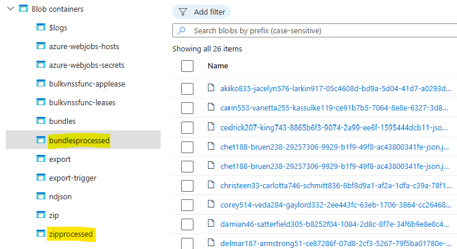
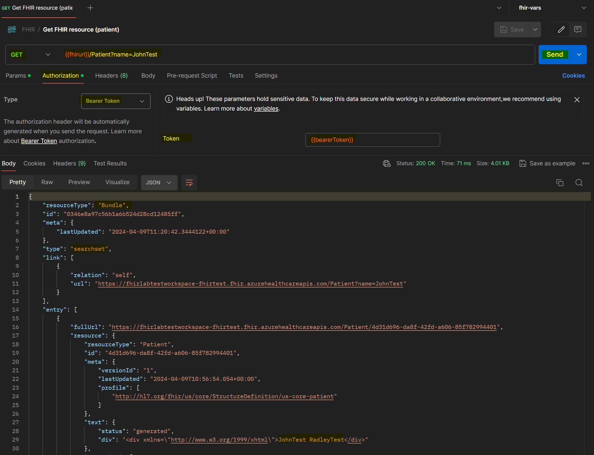

# FHIR on Azure Health Data Services

## Introduction

In this workshop, you will learn how to:

- deploy Azure Health Data Services workspace using Azure portal,
- generate FHIR resources with Synthea,
- use the FHIR bulk loader to upload your resources to FHIR server,
- query the FHIR server using Postman,
- update the FHIR resources using Postman.

**Duration:** 2 hours

### What is FHIR?

Fast Healthcare Interoperability Resources (FHIR, pronounced "fire" 🔥) is a standard describing data formats and elements (known as "resources") and an application programming interface (API) for exchanging electronic health records (EHR). The standard was created by the Health Level Seven International (HL7) healthcare standards organization. More information can be found [on the HL7 website](https://www.hl7.org/fhir/summary.html).

## Prerequisites

1. **Azure Subscription**: You will need an Azure subscription - you can create one for free [here](https://azure.microsoft.com/en-gb/free/). Ensure that you have the necessary permissions to create resources, app registrations and assign roles within this subscription.
2. **Postman**: You will need to have Postman installed on your machine. You can download it [here](https://www.postman.com/downloads/).

---

## Deploy Azure Health Data Services workspace using Azure portal

**Duration:** 15 minutes

1. Go to [Azure portal](https://portal.azure.com) and search for "Health Data Services".

    

2. Click on "Create" to create a new workspace as shown below. Choose your subscription, create new resource group and choose a unique name for the workspace. Choose the region closest to you. The rest of the fields can be left as default.

    

    > Alternative instructions can be found [here](https://learn.microsoft.com/en-us/azure/healthcare-apis/healthcare-apis-quickstart).

3. Once the resource is created, navigate to the workspace and go to the "FHIR Service" tab. Click on "Add FHIR Service" to create a new FHIR server.

    

4. Choose a unique name for the FHIR service and click on "Create". The rest of the fields can be left as default.

    

    > Alternative instructions can be found [here](https://learn.microsoft.com/en-us/azure/healthcare-apis/fhir/fhir-portal-quickstart).

---

## Generate FHIR resources with Synthea and load them up to the server

**Duration:** 45 minutes

1. Navigate to [FHIR-Bulk Loader](https://github.com/microsoft/fhir-loader) tool and follow the [instructions](https://github.com/microsoft/fhir-loader?tab=readme-ov-file#deployment) to install the tool. The tool is used to load FHIR resources to the FHIR server in bulk.

    - Click on "Deploy to Azure" to deploy the tool to Azure.

        

    - Fill in the required fields:
        - resource group (create a new one or use an existing one),
        - region (closest to you),
        - and the name of your previously created FHIR service.

        Click on "Review + create" and then "Create".

        
        

2. Navigate to the [Synthea](https://github.com/synthetichealth/synthea) GitHub repo and familiarise yourself with the tool. Synthea is a Synthetic Patient Population Simulator. It is used to generate realistic (but not real) patient data and associated health records in FHIR format or CSV.

    <div class="tip" data-title="Tip">

    > You can either download sample data from the [Synthea website](https://synthea.mitre.org/downloads) or generate your own data following the instructions [here](https://github.com/synthetichealth/synthea/wiki/Basic-Setup-and-Running).

    </div>

3. To download sample data, navigate to the [downloads page](https://synthea.mitre.org/downloads) and download the data in FHIR format.

    

4. Back in the Azure portal, navigate to the resource group where the FHIR-Bulk Loader tool was deployed. Click on the Storage account, navigate to Storage browser, then "Blob containers" and upload the downloaded FHIR data (zip folder) to the zip container.

    

    

    <div class="info" data-title="Note">

    > If you generated the data using Synthea in a different format, follow the guidance [here](https://github.com/microsoft/fhir-loader?tab=readme-ov-file#importing-fhir-data) on the correct container to upload the data to.

    </div>

    You should see the zip folder moved to 'zipprocessed' container after a few minutes and as the bundles are processed, they will appear in 'bundles' before being moved to the 'bundlesprocessed' container.

    

---

## Query & update a FHIR resource using Postman

**Duration:** 60 minutes

### Set up the service principal

1. Go to the Azure portal and search for 'App registrations'. Then select 'New registration' and choose a name unique in your Azure tenant. Click on 'Register'.

    

    

    

2. Go to the newly created app registration and make note of the 'Application (client) ID' and 'Directory (tenant) ID'

    

3. Navigate to 'Certificates & secrets' and create a new client secret, make note of the value.

    

    <div class="important" data-title="Important">

    > This value will only be shown once, so make sure to copy it and store it securely.

    </div>

4. Navigate to the FHIR service you created earlier and make note of the 'Subscription ID' and 'FHIR endpoint'.

    

5. Navigate to the 'Access Control (IAM)' section of the FHIR service and click on 'Add role assignment'

    

6. In the 'Role' section choose 'FHIR Data Contributor'. Next, in the 'Members' section, click on 'Select members' and add the app registration you created earlier, then 'Review + assign'.

    

    

### Set up Postman

1. Open Postman and create a new environment with the following variables:

    

    Fill out the values with the information you gathered earlier (besides the bearerToken, which will be filled out later). Remember to save!

2. Create a new empty collection and make sure that the environment you just created is selected.

    

3. Create your first request by clicking on the 'New Request' button and filling out the request details. This request should give you the capability statement of the FHIR service.

    

4. Next, create a new request to get the bearer token. This request will use the client ID, tenant ID, and client secret you created earlier. Your request should look like this:

    

5. In the 'Tests' tab of the request, enter the following to save the bearer token to the environment:

    ```javascript
    pm.environment.set("bearerToken", pm.response.json().access_token);
    ```

    

6. Click on 'Send'. You should get a response with a bearer token as visible on the previous screenshot. You can verify that the token is saved in the environment by clicking on the 'eye' icon next to the 'bearerToken' variable. This token will be used in the Authorization header of all subsequent requests.

### Query the FHIR server

1. Create a new request where we will create a new patient. The request should look like this:

    

    Choose 'POST' as the request type and fill in the 'Request URL' with the FHIR endpoint and the resource type you want to create (in this case 'Patient'). In the 'Headers' tab, add the 'Authorization' header with the value 'Bearer {{bearerToken}}'.

2. Navigate to the 'Body' tab, select 'raw' and 'JSON' and fill in the request body with the patient data you want to create. You can find the structure of the request body [here](https://www.hl7.org/fhir/patient.html).

    

    Here is an example patient you can use:

    <details>
    <summary>JSON Data (click to expand)</summary>

    ```json
    {
    "resourceType": "Patient",
    "meta": {
        "profile": [
        "http://hl7.org/fhir/us/core/StructureDefinition/us-core-patient"
        ]
    },
    "text": {
        "status": "generated",
        "div": "<div xmlns=\"http://www.w3.org/1999/xhtml\">JohnTest RadleyTest</div>"
    },
    "extension": [
        {
        "url": "http://hl7.org/fhir/us/core/StructureDefinition/us-core-race",
        "valueCodeableConcept": {
            "coding": [
            {
                "system": "http://hl7.org/fhir/v3/Race",
                "code": "2106-3",
                "display": "White"
            }
            ],
            "text": "race"
        }
        },
        {
        "url": "http://hl7.org/fhir/us/core/StructureDefinition/us-core-ethnicity",
        "valueCodeableConcept": {
            "coding": [
            {
                "system": "http://hl7.org/fhir/v3/Ethnicity",
                "code": "2186-5",
                "display": "Nonhispanic"
            }
            ],
            "text": "ethnicity"
        }
        },
        {
        "url": "http://hl7.org/fhir/us/core/StructureDefinition/us-core-birthsex",
        "valueCode": "M"
        }
    ],
    "identifier": [
        {
        "use": "official",
        "type": {
            "coding": [
            {
                "system": "http://terminology.hl7.org/CodeSystem/v2-0203",
                "code": "PI",
                "display": "Patient internal identifier"
            }
            ]
        },
        "system": "https://www.kirsandinc.com/faye",
        "value": "TEST111222",
        "period": {
            "start": "2002-06-07"
        },
        "assigner": {
            "display": "EMPI - Enterprise ID system"
        }
        }
    ],
    "name": [
        {
        "use": "official",
        "text": "JohnTest RadleyTest",
        "family": "RadleyTest",
        "given": [
            "JohnTest"
        ]
        }
    ],
    "telecom": [
        {
        "system": "phone",
        "value": "666-666-6666",
        "use": "mobile"
        },
        {
        "system": "email",
        "value": "JohnTestRadleyTest@JohnTestRadleyTest.com"
        }
    ],
    "gender": "male",
    "birthDate": "1984-10-07",
    "address": [
        {
        "use": "home",
        "line": [
            "1111 Eveready Drive"
        ],
        "city": "San Jose",
        "state": "CA",
        "postalCode": "94134",
        "country": "USA"
        }
    ]
    }
    ```

    </details>

3. Click on 'Send' and you should get a response with the patient you just created.

    

4. Create a new request to get the patient you just created. The request should look like this:

    

Congratulations! 🎉 You have successfully created a patient and retrieved it from the FHIR server.

> Alternative instructions on how to interact with the FHIR server through Postman can be found [here](https://learn.microsoft.com/en-us/azure/healthcare-apis/fhir/use-postman).

### Optional: search capability exploration

You can now also browse the resources that have been created in the Azure portal. Create some more requests to interact with the FHIR server and explore the different resources you have uploaded.

For example, search for a practitioner, an observation, or a patient by address or birth date. Here's how to search for a practitioner based in Fitchburg:


<div class="tip" data-title="Tip">

> Use the [FHIR Search](https://www.hl7.org/fhir/search.html) documentation to help you construct your queries. You can also use the [FHIR Postman collection](https://github.com/Azure-Samples/azure-health-data-and-ai-samples/tree/main/samples/sample-postman-queries) to help you get started.

</div>
