# Overview

This workshop will guide you up to speed with working with Azure Kubernetes Service (AKS) Automatic. AKS Automatic is a new way to deploy and manage Kubernetes clusters on Azure. It is a fully managed Kubernetes service that simplifies the deployment, management, and operations of Kubernetes clusters. With AKS Automatic, you can deploy a Kubernetes cluster with just a few clicks in the Azure Portal. AKS Automatic is designed to be simple and easy to use, so you can focus on building and running your applications.

## Objectives

After completing this workshop, you will be able to:

- Deploy an AKS Automatic cluster
- Connect to the AKS cluster and deploy applications
- Implement resiliency in your application using Kubernetes Deployments
- Scale your cluster and application
- Monitor your cluster and application

## Prerequisites

Before you begin, you will need an [Azure subscription](https://azure.microsoft.com/) with permissions to create resources and a [GitHub account](https://github.com/signup).

In addition, you will need the following tools installed on your local machine:

- [Azure CLI](https://learn.microsoft.com/cli/azure/what-is-azure-cli?WT.mc_id=containers-105184-pauyu)
- [Visual Studio Code](https://code.visualstudio.com/)
- [Git](https://git-scm.com/)
- Bash shell (e.g. [Windows Terminal](https://www.microsoft.com/p/windows-terminal/9n0dx20hk701) with [WSL](https://docs.microsoft.com/windows/wsl/install-win10) or [Azure Cloud Shell](https://shell.azure.com))

<div class="info" data-title="Note">

> The Azure Cloud Shell is a free interactive shell that you can use to run the Azure CLI, kubectl, and other tools. It is already configured to use your Azure subscription and is a great way to run commands without having to install anything on your local machine. However, there are some limitations to the Azure Cloud Shell, such as not being able to port-forward to a pod or run a local development environment so it is recommended to use a local shell for this workshop.

</div>

## Workshop instructions

When you see these blocks of text, you should follow the instructions below.

<!-- <div class="task" data-title="Task">

> This means you need to perform a task.

</div> -->

<div class="info" data-title="Info">

> This means there's some additional context.

</div>

<div class="tip" data-title="Tip">

> This means you should pay attention to some helpful tips.

</div>

<div class="warning" data-title="Warning">

> This means you should pay attention to some information.

</div>

<div class="important" data-title="Important">

> This means you should **_really_** pay attention to some information.

</div>

---

# Deploy your AKS Cluster

There are several ways to deploy an AKS cluster, including the [Azure Portal](https://portal.azure.com) , [Azure CLI](https://learn.microsoft.com/cli/azure/), [ARM templates](https://learn.microsoft.com/azure/azure-resource-manager/templates/overview), [Azure Bicep](https://learn.microsoft.com/azure/azure-resource-manager/bicep/overview?tabs=bicep), [Terraform](https://learn.microsoft.com/azure/developer/terraform/overview), and [Pulumi](https://www.pulumi.com/azure/), just to name a few. While there are no shortages of ways to deploy an AKS cluster, we will focus on the Azure Portal and Azure CLI in this workshop.

## Familiarize yourself with AKS Presets in portal

Open a browser and navigate to the Azure portal then login with your Azure credentials.

In the search bar at the top of the portal, start typing **kubernetes** and you will start to see a list of services, marketplace items, and resources that match your search. In the list, click on **Kubernetes services** which is found under **Services**.

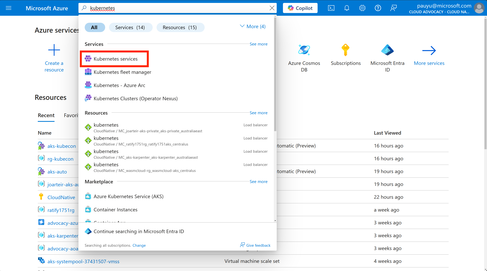

In the **Kubernetes services** screen, click on the **Create** drop down, skip over the automatic option and click on **Kubernetes cluster**

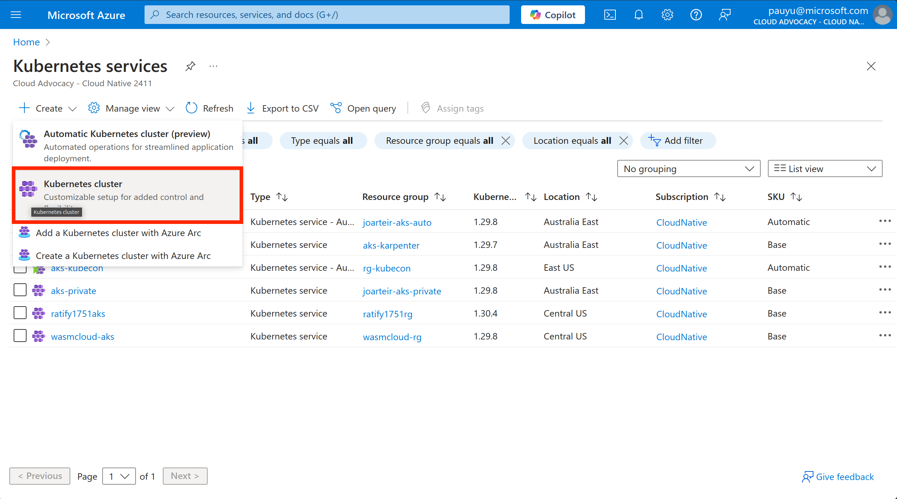

You should now see the **Create Kubernetes cluster** screen. This is where you can create a new AKS cluster.

Across the top of the screen, you'll notice a series of tabs. Under **Cluster details** in the **Basics** tab, you'll see the **Cluster preset configuration**. This is where you can choose from a series of presets that will automatically configure your AKS cluster based on your workload requirements.

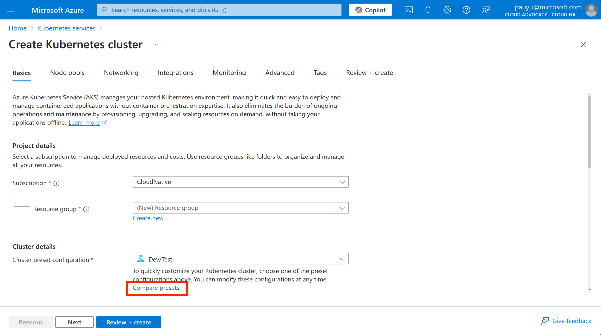

Click the **Compare presets** link to see the differences between the presets.


You should see a table that lists all the presets and the differences between them. By default, the **Production Standard** preset is selected.

Click **Cancel** to back out of the cluster preset comparison window.

You will also notice that the cluster preset can be selected from the drop down menu. Toggle between **Dev/Test** and **Production Enterprise** and notice how the configuration options change.


Going back to the tabs at the top of the screen, click through the **Node pools**, **Networking**, **Integrations**, **Monitoring**, and **Advanced** tabs to see additional configuration options available to you.

That's a lot of options! But what if you just want to create an AKS cluster without all the fuss? That's where **Automatic AKS Cluster** comes in.

Click the **X** icon in the upper right corner to back out of the create cluster window.

## Deploy AKS Automatic Cluster

Click on the **Create** drop down again but this time, click **Automatic Kubernetes cluster (preview)**.


You can see that the configuration options are much simpler. There's only a **Basics** and **Monitoring** tab.


In the **Basics** tab, fill out the following fields:

- **Subscription:** Select your Azure subscription.
- **Resource group:** Create a new resource group or use an existing one.
- **Kubernetes cluster name:** Enter a name for your cluster.
- **Region:** Select the desired region where you want to deploy your cluster.

  <div class="info" data-title="Note">

  > Make sure your subscription has quota for 16 vCPUs of any of the following SKUs in the region you're deploying the cluster to:
  >
  > - Standard_D4pds_v5
  > - Standard_D4lds_v5
  > - Standard_D4ads_v5
  > - Standard_D4ds_v5
  > - Standard_D4d_v5
  > - Standard_D4d_v4
  > - Standard_DS3_v2
  > - Standard_DS12_v2
  >
  > You can view quotas for specific VM-families and submit quota increase requests through the Azure portal. See this [guide](https://learn.microsoft.com/azure/quotas/quickstart-increase-quota-portal) for more info.

  </div>

- **Automatic upgrade scheduler:** Leave the default setting.
- **Access control:**: AKS Automatic uses [Microsoft Entra ID authentication with Azure RBAC](https://learn.microsoft.com/azure/aks/manage-azure-rbac?tabs=azure-cli) for cluster access. You can add additional users or groups to the cluster after it's created, but that is outside the scope of this workshop.

In the **Monitoring** tab, you have the option to either link existing monitoring resources or create new ones. We'll go ahead and create new monitoring resources.

- **Enable Container Logs:** Make sure the checkbox is checked to enable Container Insights.
- **Log Analytics Workspace:** Leave the default setting to create a new Log Analytics workspace.
- **Cost Preset:** Leave the default setting of **Standard**.
- **Enable Prometheus metrics:** Make sure the checkbox is checked to enable Prometheus metrics.
- **Azure Monitor workspace:** Leave the default setting to create a new Azure Monitor workspace.
- **Enable Grafana:** Make sure the checkbox is checked to enable Grafana.
- **Grafana workspace:** Leave the default setting to create a new Grafana workspace.
- **Enable recommended alerts:** Make sure the checkbox is checked to enable recommended alerts.

Click the **Review + create** button then after validation passes, click the **Create** button.

<div class="info" data-title="Note">

> The cluster creation process will take about 10-15 minutes to complete.

</div>

## Connect to AKS cluster

The [kubectl](https://kubernetes.io/docs/reference/kubectl/) command line tool is your direct line of communication with the Kubernetes API server and is most common way to interact with a Kubernetes cluster. Authentication and authorization to the Kubernetes API server is controlled by the [kubeconfig file](https://kubernetes.io/docs/concepts/configuration/organize-cluster-access-kubeconfig/). This file contains the necessary certificate information to authenticate against the Kubernetes API server, and the Azure CLI for AKS has a handy command to get the kubeconfig file for your AKS cluster.

Before we do anything with Azure CLI for AKS, open a new terminal and run the following command to install the AKS preview extension for the Azure CLI. This extension will allow you to work with preview features of AKS.

```bash
az extension add --name aks-preview
```

Next run the following command to add a variable local .env file.

```bash
cat <<EOF > .env
RG_NAME="<resource-group-name>"
EOF
```

<div class="important" data-title="Important">

> Be sure to replace `<resource-group-name>` with the resource group name where the AKS cluster was deployed.

</div>

Source the file to load the environment variables.

```bash
source .env
```

Run the following command to get the name of your AKS cluster, add it to the .env file, and source the file.

```bash
cat <<EOF >> .env
AKS_NAME="$(az aks list -g $RG_NAME --query "[0].name" -o tsv)"
MC_RG_NAME="$(az aks show --name $AKS_NAME --resource-group $RG_NAME --query nodeResourceGroup -o tsv)"
EOF
source .env
```

Run the following command to download the kubeconfig file for your AKS cluster.

```bash
az aks get-credentials --resource-group ${RG_NAME} --name ${AKS_NAME}
```

Now you should be able to run kubectl commands against your AKS cluster. But if you do not already have kubectl installed, run the following command to install it.

```bash
az aks install-cli
```

Run the following command to verify that you can connect to the AKS cluster.

```bash
kubectl cluster-info
```

When running a kubectl command for the first time, you will be presented with a login prompt. Follow the instructions on the screen and proceed with the authorization process and the kubectl command will be executed.

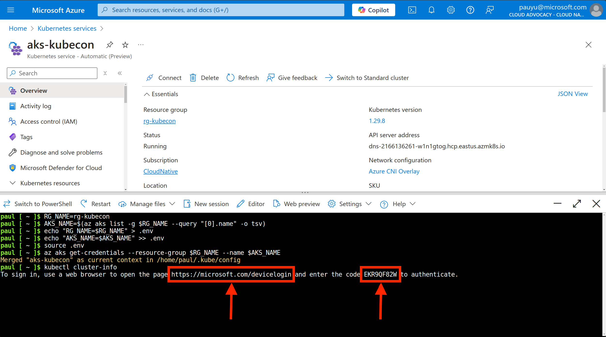

<div class="info" data-title="Knowledge">

> AKS Automatic clusters are secured by default. It uses [Microsoft Entra ID](https://www.microsoft.com/security/business/identity-access/microsoft-entra-id) authentication with Azure RBAC for cluster access, so simply downloading the kubeconfig file is not enough to access the cluster. You also need to authenticate with Microsoft Entra ID and have the necessary permissions to access the cluster. When you created the AKS Automatic cluster, you were automatically granted the **Azure Kubernetes Service RBAC Cluster Admin** role assignment to access the cluster.

</div>

If you can see the cluster information printed in your terminal, your cluster is up and ready to host applications. But there is a little bit more prep work we need to do. We need to prepare the cluster for our application containers.

## Container Registries

Kubernetes is a container orchestrator. It will run whatever container image you tell it to run. Containers can be pulled from public container registries like [Docker Hub](https://hub.docker.com/) or [GitHub Container Registry (GHCR)](https://docs.github.com/en/packages/working-with-a-github-packages-registry/working-with-the-container-registry), or they can be pulled from private container registries like [Azure Container Registry (ACR)](https://azure.microsoft.com/products/container-registry). Pulling images from a public registry is fine for development and testing but for production workloads, you'll want to use a private registry and only deploy images that have been scanned for vulnerabilities and approved.

### Deploy Azure Container Registry (ACR)

ACR is a managed, private Docker registry service based on the open-source Docker Registry 2.0. It is highly available and scalable across Azure regions across the globe. It also integrates with Microsoft Entra ID for authentication and authorization so it makes it easy to secure your container images.

In the terminal, run the following command to create an environment variable for your new Azure Container Registry name, add it to the .env file, and source the file.

```bash
cat <<EOF >> .env
ACR_NAME="acr$(date +%s)"
EOF
source .env
```

Run the following command to create a new Azure Container Registry.

```bash
az acr create \
--resource-group ${RG_NAME} \
--name ${ACR_NAME} \
--sku Standard
```

### Attach ACR to AKS cluster

With the Azure Container Registry created, you need to "attach" it to your AKS cluster. This will allow your AKS cluster to pull images from the Azure Container Registry by granting the AKS resource's managed identity the **AcrPull** role on the Azure Container Registry.

```bash
az aks update \
--name ${AKS_NAME} \
--resource-group ${RG_NAME} \
--attach-acr ${ACR_NAME}
```

This will take a few minutes to complete so you can move on to the next section.

## Import container images

We will be using a sample application called [aks-store-demo](https://github.com/Azure-Samples/aks-store-demo). This application is a simple e-commerce store that consists of three services: **store-front**, **order-service**, and **product-service**.

- [store-front](https://github.com/Azure-Samples/aks-store-demo/tree/main/src/store-front) is a web UI that allows users to browse products, add products to a cart, and checkout
- [product-service](https://github.com/Azure-Samples/aks-store-demo/tree/main/src/product-service) is a RESTful API that provides product information to the store-front service
- [order-service](https://github.com/Azure-Samples/aks-store-demo/tree/main/src/order-service) is a RESTful API that handles order processing and saves order to a [RabbitMQ](https://www.rabbitmq.com/) message queue

Here is a high-level application architecture diagram:


The application containers are hosted on GHCR. Rather than building the containers from source, we will import the containers from GHCR to ACR using the [az acr import](https://learn.microsoft.com/cli/azure/acr?view=azure-cli-latest#az-acr-import) command. This will allow us to use the containers in the AKS cluster without having to build them ourselves.

Run the following commands to import the application container images from GHCR into ACR. We'll be importing two versions of each application: 1.2.0 and 1.5.0.

```bash
# store-front version 1.2.0
az acr import \
--name ${ACR_NAME} \
--source ghcr.io/azure-samples/aks-store-demo/store-front:1.2.0 \
--image aks-store-demo/store-front:1.2.0 \
--no-wait

# store-front version 1.5.0
az acr import \
--name ${ACR_NAME} \
--source ghcr.io/azure-samples/aks-store-demo/store-front:1.5.0 \
--image aks-store-demo/store-front:1.5.0 \
--no-wait

# order-service version 1.2.0
az acr import \
--name ${ACR_NAME} \
--source ghcr.io/azure-samples/aks-store-demo/order-service:1.2.0 \
--image aks-store-demo/order-service:1.2.0 \
--no-wait

# order-service version 1.5.0
az acr import \
--name ${ACR_NAME} \
--source ghcr.io/azure-samples/aks-store-demo/order-service:1.5.0 \
--image aks-store-demo/order-service:1.5.0 \
--no-wait

# product-service version 1.2.0
az acr import \
--name ${ACR_NAME} \
--source ghcr.io/azure-samples/aks-store-demo/product-service:1.2.0 \
--image aks-store-demo/product-service:1.2.0 \
--no-wait

# product-service version 1.5.0
az acr import \
--name ${ACR_NAME} \
--source ghcr.io/azure-samples/aks-store-demo/product-service:1.5.0 \
--image aks-store-demo/product-service:1.5.0 \
--no-wait
```

Run the following command to ensure the import operations have completed.

```bash
for repo in $(az acr repository list -n $ACR_NAME -o tsv); do
  echo "${repo} tags:"
  az acr repository show-tags -n $ACR_NAME --repository $repo
done
```

If you see tags for each repository, the import operations have completed.

---

# Deploy Store App to AKS

There is a [YAML manifest](https://github.com/Azure-Samples/aks-store-demo/blob/main/aks-store-quickstart.yaml) in the repo that contains the deployment and service resources for the store-front, order-service, and product-service, and RabbitMQ. We will deploy this manifest to the AKS cluster.

## Updating Deployment manifests

Before we deploy the manifest, we need to make a few changes. The manifest in the repo references the images on GHCR. We need to replace the image references with the images we imported to ACR.

Run the following command to download the YAML file.

```bash
curl -o aks-store-quickstart.yaml https://raw.githubusercontent.com/Azure-Samples/aks-store-demo/main/aks-store-quickstart.yaml
```

Run the following command to replace all instances of `ghcr.io/azure-samples` with `${ACR_NAME}.azurecr.io` and the tag `latest` with `1.2.0` in the aks-store-quickstart.yaml file.

```bash
sed -i -e "s|ghcr.io/azure-samples/\(.*\):latest|${ACR_NAME}.azurecr.io/\1:1.2.0|g" aks-store-quickstart.yaml
```

Run the following command to apply the manifest.

```bash
kubectl apply -f aks-store-quickstart.yaml
```

Run the following command to check the status of the pods.

```bash
kubectl get pods -w
```

<div class="info" data-title="Note">

> The deployment can take up a few minutes to schedule pods onto a new node. This is because the [AKS Node Autoprovisioning feature (aka Karpenter)](https://learn.microsoft.com/azure/aks/node-autoprovision?tabs=azure-cli) is enabled in the AKS Automatic cluster and it will automatically provision new nodes when needed.

</div>

Press **Ctrl+C** to exit the watch and proceed to the next step.

## Getting familiar with the Kubernetes resources

While we wait for the pods to roll out, let's take a closer look at the resources that were created when we applied the manifest to the Kubernetes cluster.

Back in the terminal, run the following command to view the contents of the YAML file.

```bash
less aks-store-quickstart.yaml
```

<div class="tip" data-title="Tip">

> Press **up** or **down** arrow keys to scroll through the file. Press **q** to exit the file.

</div>

If you look at the YAML file, you'll see that it contains a [Deployment](https://kubernetes.io/docs/concepts/workloads/controllers/deployment/) and [Service](https://kubernetes.io/docs/concepts/services-networking/service/) resource for each of the three services: **store-front**, **product-service**, and **order-service**. It also contains a [StatefulSet](https://kubernetes.io/docs/concepts/workloads/controllers/statefulset/), Service, and [ConfigMap](https://kubernetes.io/docs/concepts/configuration/configmap/) resource for RabbitMQ.

The manifest is the desired state of the resources in the cluster. When you apply the manifest, the Kubernetes API server will create the resources in the cluster to match the desired state.

### Deployments

Each deployment resource specifies the container image to use, the ports to expose, environment variables, and resource requests and limits. The deployment manages [ReplicaSets](https://kubernetes.io/docs/concepts/workloads/controllers/replicaset/) and a ReplicaSet is a resource that ensures a specified number of pod replicas are running at any given time.

Run the following command to view the Deployments.

```bash
kubectl get deployments
```

You can see there are three Deployments: **order-service**, **product-service**, and **store-front**. As mentioned above, the deployment created a ReplicaSet which in turn created a set of identical [pods](https://kubernetes.io/docs/concepts/workloads/pods/). In the sample app, each deployment has a single replica.

If you want to see individual pods, you can run the following command.

```bash
kubectl get pods
```

A pod is where your application code runs and is the smallest deployable unit in Kubernetes. It represents a single instance of a running process in your cluster. If you need to troubleshoot an application, you can view the logs of the pod by running the **logs** command like this:

```bash
kubectl logs rabbitmq-0
```

### Services

A Service is a resource that exposes an application running in a set of pods as a network service. It provides a stable endpoint for the application that can be accessed by other applications in the cluster or outside the cluster.

Run the following command to view the Services.

```bash
kubectl get service
```

### StatefulSets

The StatefulSet is a resource that manages a set of identical pods with persistent storage and commonly used for stateful applications like databases and data stores.

Run the following command to view the StatefulSets.

```bash
kubectl get statefulsets
```

You can see that there is a StatefulSet for RabbitMQ. The StatefulSet resource is used to manage the RabbitMQ pods and ensure that the pods are created in a specific order.

### ConfigMaps

The ConfigMap resource is used to store configuration data in key-value pairs. The ConfigMap resource is used to store the configuration data for RabbitMQ.

Run the following command to view the ConfigMaps.

```bash
kubectl get configmaps
```

## Test the demo app

At this point, the pods should be up and running. Run the following command to confirm that the pods are running.

```bash
kubectl get pods
```

If the pods are all in **Running** status, run the following command to get the public IP address of the **store-front** service so that you can access the application.

```bash
echo "http://$(kubectl get svc/store-front -o jsonpath='{.status.loadBalancer.ingress[0].ip}')"
```

Click the link in the terminal, and you should be taken to the product page of the AKS pet store. Here a user can browse products, add items to a shopping cart, and checkout. Add an item to the cart and checkout by clicking on the cart link in the upper right corner. You should see a confirmation message that the order was successfully placed.

<div class="info" data-title="Note">

> The checkout process is intentionally simple and does not require any payment information. The order-service will save the order to a [RabbitMQ](https://www.rabbitmq.com/) container running in the cluster.

</div>


## Ingress and App Routing add-on

When you looked at the YAML file, you may have noticed the service type for the **store-front** service is of type [LoadBalancer](https://kubernetes.io/docs/concepts/services-networking/service/#loadbalancer). This is one way to expose an application to the internet. A better way is to use an [Ingress](https://kubernetes.io/docs/concepts/services-networking/ingress/). An [Ingress Controller](https://kubernetes.io/docs/concepts/services-networking/ingress-controllers/) is a Kubernetes resource that manages inbound access to services in a cluster. It provides HTTP and HTTPS routing to services based on hostnames and paths. The Ingress Controller is responsible for reading the Ingress resource and processing the rules to configure the load balancer.

With AKS Automatic, the [App Routing add-on](https://learn.microsoft.com/en-us/azure/aks/app-routing), a managed NGINX Ingress Controller, is enabled by default. All you need to do is create an Ingress resource and the App Routing add-on will take care of the rest.

Run the following command to patch the store-front service to change the service type to _ClusterIP_. This will remove the public IP address from the service.

```bash
kubectl patch service store-front -p '{"spec": {"type": "ClusterIP"}}'
```

<div class="info" data-title="Knowledge">

> kubectl is a powerful tool that can be used to create, update, and delete resources in a Kubernetes cluster. The `patch` command is used to update a resource in the cluster. However, it is not best practice to use `patch` to update resources. It is better to update the resource manifest and apply the changes with `kubectl apply`.

</div>

Run the following command to deploy the ingress manifest for the store-front app.

```bash
kubectl apply -f - <<EOF
apiVersion: networking.k8s.io/v1
kind: Ingress
metadata:
  name: store-front
spec:
  ingressClassName: webapprouting.kubernetes.azure.com
  rules:
  - http:
      paths:
      - path: /
        pathType: Prefix
        backend:
          service:
            name: store-front
            port:
              number: 80
EOF
```

This Ingress resource is very similar to the open-source [NGINX Ingress](https://kubernetes.io/docs/concepts/services-networking/ingress/#the-ingress-resource) resource with the major difference being the `ingressClassName` field being set to `webapprouting.kubernetes.azure.com`; this enables the AKS App Routing add-on to manage this resource.

Wait a minute or two for the ingress to be created, then run the following command to get the public IP address of the ingress.

```bash
echo "http://$(kubectl get ingress store-front -o jsonpath='{.status.loadBalancer.ingress[0].ip}')"
```

Click the URL in the terminal and you should be taken to the product page of the AKS pet store, this time using the Ingress to access the store-front service!

<div class="important" data-title="Important">

> It is also worth mentioning that the App Routing add-on does a little more than just manage the NGINX Ingress Controller. It also provides integration with Azure DNS for automatic DNS registration and management and Azure Key Vault for automatic TLS certificate management. Check out the [App Routing add-on documentation](https://learn.microsoft.com/azure/aks/app-routing?tabs=default%2Cdeploy-app-default) for more information.

</div>

---

# Application Resiliency

As mentioned in the previous section, a Kubernetes Deployment is a resource that manages ReplicaSets. In addition to controlling the number of pod replicas, ReplicaSets play an important role in enabling you to manage application updates and rollbacks.

## Deployments and ReplicaSets

The deployment resource is responsible for creating and updating the ReplicaSet. The ReplicaSet resource is responsible for creating and updating the pods. In order to keep track of the relationship between the deployment and ReplicaSet, the deployment resource sets the `ownerReferences` field in the ReplicaSet resource.

Run the following command to get the owner reference of the store-front ReplicaSet.

```bash
# get the name of the store-front ReplicaSet
STORE_FRONT_RS_NAME=$(kubectl get rs --sort-by=.metadata.creationTimestamp | grep store-front | tail -n 1 | awk '{print $1}')

# get the details of the store-front ReplicaSet
kubectl get rs $STORE_FRONT_RS_NAME -o json | jq .metadata.ownerReferences
```

In the output, you can see the ReplicaSet resource is owned by the store-front deployment resource. Also, note the `uid` field in the output. This is the unique identifier (`uid`) of the deployment resource.

```json
[
  {
    "apiVersion": "apps/v1",
    "blockOwnerDeletion": true,
    "controller": true,
    "kind": "Deployment",
    "name": "store-front",
    "uid": "65aeeba4-5202-4fb7-9d70-ad5db0ffe1df"
  }
]
```

If we inspect at the deployment resource, we can see the same `uid` field in the output.

```bash
kubectl get deployment store-front -o json | jq .metadata.uid
```

Same goes for pods, ReplicaSets are responsible for creating and updating the pods. The pods are owned by the ReplicaSet.

Run the following command to get the owner reference of the store-front pod.

```bash
# get the name of the store-front pod
STORE_FRONT_POD_NAME=$(kubectl get pod -l app=store-front -o jsonpath='{.items[0].metadata.name}')

# get the details of the store-front pod
kubectl get pod $STORE_FRONT_POD_NAME -o json | jq .metadata.ownerReferences
```

As each deployment is updated, it creates a new ReplicaSet and scales it up while scaling down the old ReplicaSet. This is how Kubernetes manages application updates and rollbacks and rollout history is stored for each deployment.

Run the following command to view the rollout history of the store-front deployment.

```bash
kubectl rollout history deployment store-front
```

Here you can see the revision number and you should only have a single revision since we only deployed the application once.

## Deployment Update Strategy

The default deployment strategy of a deployment resource is _RollingUpdate_. You can see that by running the following command.

```bash
kubectl get deployments store-front -o jsonpath='{.spec.strategy.type}'
```

The [RollingUpdate](https://kubernetes.io/docs/tutorials/kubernetes-basics/update/update-intro/) strategy means that Kubernetes will create a new ReplicaSet and scale it up while scaling down the old ReplicaSet. If the new ReplicaSet fails to start, Kubernetes will automatically roll back to the previous ReplicaSet.

Run the following command to update the store-front container image to use the 1.5.0 version.

```bash
kubectl set image deployment/store-front store-front=$ACR_NAME.azurecr.io/aks-store-demo/store-front:1.5.0
```

<div class="info" data-title="Note">

> Just a reminder that updating an image using imperative commands is not best practice. It is better to update the resource manifest and apply the changes with `kubectl apply`. This is just a quick way to update the image for demonstration purposes.

</div>

Run the following command to check the rollout status.

```bash
kubectl rollout status deployment/store-front
```

Wait until you see the message **deployment "store-front" successfully rolled out**.

Now if you run the following command, you should see two different versions of the ReplicaSet.

```bash
kubectl get rs --selector app=store-front
```

You should see the older ReplicaSet with 0 for the DESIRED, CURRENT, and READY columns and the newer ReplicaSet with 1 for the DESIRED, CURRENT, and READY columns.

Run the following command to view the rollout history of the store-front deployment.

```bash
kubectl rollout history deployment store-front
```

You should see two revisions in the rollout history. The first revision is the original deployment and the second revision is the updated deployment.

If you browse to the store-front application, you should see the new version of the application.

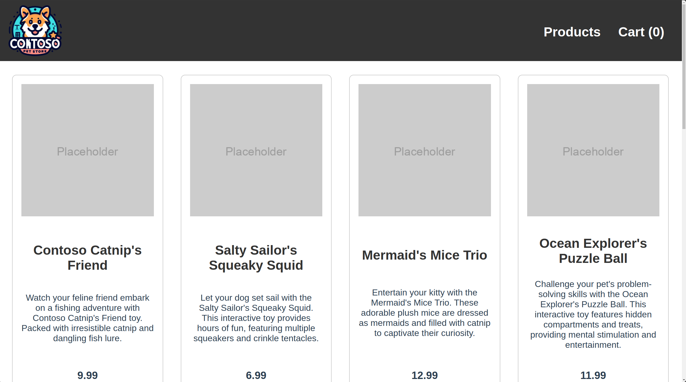

### Rollback a Deployment

With deployment rollouts, you can easily roll back to a previous version of the application. As mentioned earlier, the rollout history is stored and you can run the following command to roll back to the previous version.

```bash
kubectl rollout undo deployment/store-front
```

<div class="info" data-title="Note">

> You can also roll back to a specific revision by specifying the revision number. For example, to roll back to the first revision, you can run the following command:

> ```bash
> kubectl rollout undo deployment/store-front --to-revision=1
> ```

</div>

If you browse to the store-front application, you should see the previous version of the application.

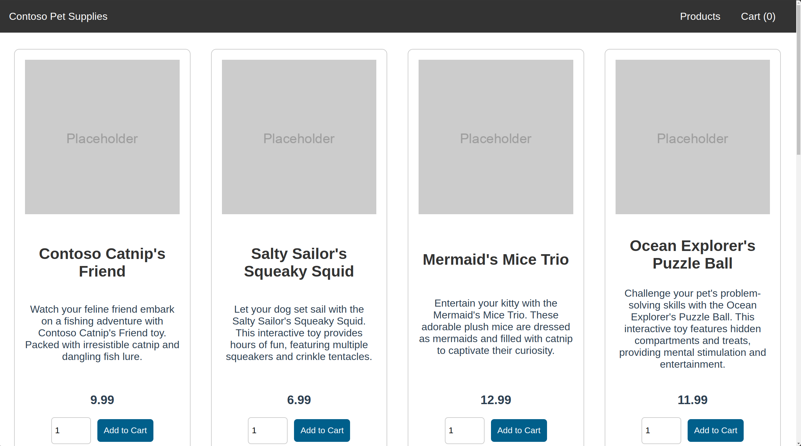

## Dealing with Disruptions

As you may be aware, application updates can cause disruptions. However, with Kubernetes Deployments, you can manage application updates and rollbacks. But application updates are not the only disruptions that can occur. Nodes can fail or be marked for maintenance. You need to be prepared for both [voluntary and involuntary disruptions](https://kubernetes.io/docs/concepts/workloads/pods/disruptions/).

### Voluntary Disruptions

A voluntary disruption is a disruption that is initiated by the user. For example, you may want to scale down the number of replicas in a deployment, or you may want to take a Node down for maintenance. Kubernetes has built-in mechanisms to handle these disruptions. During a voluntary disruption, Kubernetes will gracefully remove pods from a Node.

In maintenance scenarios, a Node will be [drained and cordoned](https://kubernetes.io/docs/tasks/administer-cluster/safely-drain-node/) so that no new pods will be scheduled on the node. Any existing pod will be evicted using the [Eviction API](https://kubernetes.io/docs/concepts/scheduling-eviction/api-eviction/). It doesn't matter how many replicas you have running on a Node or how many replicas will be remaining after the eviction; the pod will be evicted and rescheduled on another Node. This means you can incur downtime if you are not prepared for it.

Good news is that Kubernetes has a built-in mechanism to handle these disruptions. The [PodDisruptionBudget](https://kubernetes.io/docs/concepts/workloads/pods/disruptions/) resource allows you to specify the minimum number of Pods that must be available during a voluntary disruption.

When a PodDisruptionBudget is created, Kubernetes will not evict Pods if evicting it will result in a violation of the budget. Essentially the PodDisruptionBudget ensures that a minimum number of Pods remains available during a voluntary disruption.

To see this in action we should scale our store-front deployment to have more than one replica. Run the following command to scale the store-front deployment to 3 replicas.

```bash
kubectl scale deployment store-front --replicas=3
```

With the deployment scaled to 3 replicas, we can see which nodes the Pods are running on.

```bash
kubectl get pod --selector app=store-front -o wide
```

You can see that the Pods are all running on a single Node.

Let's grab the name of the Node and cordon it.

```bash
# get the name of the Node
NODE_NAME=$(kubectl get pod -l app=store-front -o jsonpath='{.items[0].spec.nodeName}')

# cordon the node
kubectl drain $NODE_NAME --ignore-daemonsets
```

You should see a list of all the Pods that have been evicted. It doesn't matter that all 3 replicas of the store-front application were running on the node. Kubernetes doesn't care and will evict all the Pods with no regard. This is where the PodDisruptionBudget comes in.

Run the following command to create a PodDisruptionBudget for the store-front application.

```bash
kubectl apply -f - <<EOF
apiVersion: policy/v1
kind: PodDisruptionBudget
metadata:
  name: store-front-pdb
spec:
  minAvailable: 1
  selector:
    matchLabels:
      app: store-front
EOF
```

Run the following command and wait for the Pods to be scheduled on a new node.

```bash
kubectl get pod --selector app=store-front -o wide -w
```

When you see the Pods are in the **Running** state, you can press **Ctrl+C** to exit the watch.

Run the following command to drain the node again and see what happens this time with the PodDisruptionBudget in place.

```bash
# get the name of the new node
NODE_NAME=$(kubectl get pod -l app=store-front -o jsonpath='{.items[0].spec.nodeName}')

# cordon the new node
kubectl drain $NODE_NAME --ignore-daemonsets

# watch the status of the pods and the nodes they are running on
kubectl get pod --selector app=store-front -o wide -w
```

Notice this time a warning message is displayed that the PodDisruptionBudget is preventing the eviction of the a store-front pod on the node due to the PodDisruptionBudget violation.

Once the new node is up and running, the PodDisruptionBudget will be satisfied and the remaining Pods on the node will be evicted.

### Involuntary Disruptions

An involuntary disruption is a disruption that is not initiated by the user. For example, a node may fail and if we had all the replicas of the store-front application running on that node, we would have downtime. When running more than one replica of an application, it is important to spread the replicas across multiple nodes to ensure high availability. This is where [PodAntiAffinity](https://kubernetes.io/docs/concepts/scheduling-eviction/assign-pod-node/#affinity-and-anti-affinity) or [PodTopologySpreadConstraints](https://kubernetes.io/docs/concepts/scheduling-eviction/topology-spread-constraints/) comes in.

- **PodAntiAffinity** is a feature that allows you to specify that a pod should not be scheduled on the same node as another pod; these can be "hard" or "soft" rules
- **PodTopologySpreadConstraints** is a feature that allows you to specify that a pod should be spread across different zones, regions, or nodes; this is useful for ensuring high availability of your application across different failure domains.

Either of these pod scheduling features can be used to ensure that your application remains available during an involuntary disruption with the difference being that PodAntiAffinity is used to spread Pods across nodes and PodTopologySpreadConstraints can provide more granular control by spreading Pods across zones and/or regions.

Run the following command to get the YAML manifest for the store-front deployment.

```bash
kubectl get deployment store-front -o yaml > store-front-deployment.yaml
```

Open the `store-front-deployment.yaml` file using the nano text editor.

```bash
nano store-front-deployment.yaml
```

Update the **store-front-deployment.yaml** file by adding the following PodAntiAffinity rule to the `spec` section of the **store-front** deployment. This rule tells the Kubernetes scheduler to spread the store-front Pods using `topologyKey: kubernetes.io/hostname` which essentially means to spread the Pods across different nodes.

<div class="warning" data-title="Warning">

> There are many `spec` items in the manifest, you want to add the code snippet below in the `spec` section that includes the `containers` field. Once you locate the correct `spec` section, add a new line after the `spec` field and just before the `containers` field and paste the code snippet.

</div>

```yaml
      affinity:
        podAntiAffinity:
          requiredDuringSchedulingIgnoredDuringExecution:
            - labelSelector:
                matchExpressions:
                  - key: app
                    operator: In
                    values:
                      - store-front
              topologyKey: "kubernetes.io/hostname"
```

<div class="tip" data-title="Tip">

> When done editing, press the **Ctrl + O** keys to save the file then press the Enter key. Press the **Ctrl + X** keys to exit the nano text editor.

</div>

<details>
<summary>Click to expand a full example updated store-front-deployment.yaml file</summary>

This is what the full store-front-deployment.yaml file should look like after adding the PodAntiAffinity rule. Notice line 32 is where the PodAntiAffinity rule was added.

```text
  1	apiVersion: apps/v1
  2	kind: Deployment
  3	metadata:
  4	  annotations:
  5	    deployment.kubernetes.io/revision: "3"
  6	    kubectl.kubernetes.io/last-applied-configuration: |
  7	      {"apiVersion":"apps/v1","kind":"Deployment","metadata":{"annotations":{},"name":"store-front","namespace":"default"},"spec":{"replicas":1,"selector":{"matchLabels":{"app":"store-front"}},"template":{"metadata":{"labels":{"app":"store-front"}},"spec":{"containers":[{"env":[{"name":"VUE_APP_ORDER_SERVICE_URL","value":"http://order-service:3000/"},{"name":"VUE_APP_PRODUCT_SERVICE_URL","value":"http://product-service:3002/"}],"image":"acr1730914915.azurecr.io/aks-store-demo/store-front:1.2.0","livenessProbe":{"failureThreshold":5,"httpGet":{"path":"/health","port":8080},"initialDelaySeconds":3,"periodSeconds":3},"name":"store-front","ports":[{"containerPort":8080,"name":"store-front"}],"readinessProbe":{"failureThreshold":3,"httpGet":{"path":"/health","port":8080},"initialDelaySeconds":3,"periodSeconds":3},"resources":{"limits":{"cpu":"1000m","memory":"512Mi"},"requests":{"cpu":"1m","memory":"200Mi"}},"startupProbe":{"failureThreshold":3,"httpGet":{"path":"/health","port":8080},"initialDelaySeconds":5,"periodSeconds":5}}],"nodeSelector":{"kubernetes.io/os":"linux"}}}}}
  8	  creationTimestamp: "2024-11-06T17:50:50Z"
  9	  generation: 4
 10	  name: store-front
 11	  namespace: default
 12	  resourceVersion: "122662"
 13	  uid: 3a986ba7-059b-4e5c-8f0b-0ca35a59ba38
 14	spec:
 15	  progressDeadlineSeconds: 600
 16	  replicas: 3
 17	  revisionHistoryLimit: 10
 18	  selector:
 19	    matchLabels:
 20	      app: store-front
 21	  strategy:
 22	    rollingUpdate:
 23	      maxSurge: 25%
 24	      maxUnavailable: 25%
 25	    type: RollingUpdate
 26	  template:
 27	    metadata:
 28	      creationTimestamp: null
 29	      labels:
 30	        app: store-front
 31	    spec:
 32	      affinity:
 33	        podAntiAffinity:
 34	          requiredDuringSchedulingIgnoredDuringExecution:
 35	            - labelSelector:
 36	                matchExpressions:
 37	                  - key: app
 38	                    operator: In
 39	                    values:
 40	                      - store-front
 41	              topologyKey: "kubernetes.io/hostname"
 42	      containers:
 43	      - env:
 44	        - name: VUE_APP_ORDER_SERVICE_URL
 45	          value: http://order-service:3000/
 46	        - name: VUE_APP_PRODUCT_SERVICE_URL
 47	          value: http://product-service:3002/
 48	        image: acr1730914915.azurecr.io/aks-store-demo/store-front:1.2.0
 49	        imagePullPolicy: IfNotPresent
 50	        livenessProbe:
 51	          failureThreshold: 5
 52	          httpGet:
 53	            path: /health
 54	            port: 8080
 55	            scheme: HTTP
 56	          initialDelaySeconds: 3
 57	          periodSeconds: 3
 58	          successThreshold: 1
 59	          timeoutSeconds: 1
 60	        name: store-front
 61	        ports:
 62	        - containerPort: 8080
 63	          name: store-front
 64	          protocol: TCP
 65	        readinessProbe:
 66	          failureThreshold: 3
 67	          httpGet:
 68	            path: /health
 69	            port: 8080
 70	            scheme: HTTP
 71	          initialDelaySeconds: 3
 72	          periodSeconds: 3
 73	          successThreshold: 1
 74	          timeoutSeconds: 1
 75	        resources:
 76	          limits:
 77	            cpu: "1"
 78	            memory: 512Mi
 79	          requests:
 80	            cpu: 1m
 81	            memory: 200Mi
 82	        startupProbe:
 83	          failureThreshold: 3
 84	          httpGet:
 85	            path: /health
 86	            port: 8080
 87	            scheme: HTTP
 88	          initialDelaySeconds: 5
 89	          periodSeconds: 5
 90	          successThreshold: 1
 91	          timeoutSeconds: 1
 92	        terminationMessagePath: /dev/termination-log
 93	        terminationMessagePolicy: File
 94	      dnsPolicy: ClusterFirst
 95	      nodeSelector:
 96	        kubernetes.io/os: linux
 97	      restartPolicy: Always
 98	      schedulerName: default-scheduler
 99	      securityContext: {}
100	      terminationGracePeriodSeconds: 30
101	status:
102	  availableReplicas: 1
103	  conditions:
104	  - lastTransitionTime: "2024-11-06T17:50:50Z"
105	    lastUpdateTime: "2024-11-06T18:26:30Z"
106	    message: ReplicaSet "store-front-6d694c78d4" has successfully progressed.
107	    reason: NewReplicaSetAvailable
108	    status: "True"
109	    type: Progressing
110	  - lastTransitionTime: "2024-11-06T18:35:28Z"
111	    lastUpdateTime: "2024-11-06T18:35:28Z"
112	    message: Deployment does not have minimum availability.
113	    reason: MinimumReplicasUnavailable
114	    status: "False"
115	    type: Available
116	  observedGeneration: 4
117	  readyReplicas: 1
118	  replicas: 3
119	  unavailableReplicas: 2
120	  updatedReplicas: 3
```

</details>

Run the following command to replace the store-front deployment with the updated manifest.

```bash
kubectl replace -f store-front-deployment.yaml
```

Run the following command to get the nodes that the store-front Pods are running on.

```bash
kubectl get pod --selector app=store-front -o wide -w
```

<div class="info" data-title="Note">

> It can take a few minutes for the Pods to be rescheduled onto new nodes because AKS Node Autoprovisioning (Karpenter) will need to create new nodes to satisfy the PodAntiAffinity rule.

</div>

The replacement of the Pods are considered to be an update to the deployment resource. So the RollingUpdate strategy will be used to rollout new Pods before terminating the old Pods. So we're safe from downtime during this process!

Once the Pods are rescheduled onto new nodes, you should see that the Pods are spread across multiple nodes.

```bash
kubectl get pod --selector app=store-front -o wide
```

This can take a few minutes to complete. Once the Pods are rescheduled onto new nodes, you can press **Ctrl+C** to exit the watch. Feel free to move on to the next section while you wait.

---

# Handling Stateful Workloads

Container storage is ephemeral. If a pod is deleted, the data is lost because by default, data is saved within the container. In order to persist the data, you need to use [Persistent Volume (PV)](https://kubernetes.io/docs/concepts/storage/persistent-volumes/) and [Persistent Volume Claim (PVC)](https://kubernetes.io/docs/concepts/storage/persistent-volumes/#persistentvolumeclaims).

## AKS Storage classes and PVC's

Typically for persistent storage in a Kubernetes cluster, you would create a PV to allocate storage and use a PVC to request a slice storage against the PV.

With AKS, [Azure CSI drivers and storage classes](https://learn.microsoft.com/azure/aks/csi-storage-drivers) are pre-deployed into your cluster. The storage classes allow you to simply create a PVC that references a particular storage class based on your application requirements. This storage class will take care of the task of creating the PV for you, in this case, using Azure Storage.

Run the following command to get the list of storage classes in your AKS cluster.

```bash
kubectl get storageclasses
```

Run the following command to get the YAML manifest for the RabbitMQ StatefulSet.

```bash
kubectl get statefulset rabbitmq -o yaml > rabbitmq-statefulset.yaml
```

Open the `rabbitmq-statefulset.yaml` file using the nano text editor.

```bash
nano rabbitmq-statefulset.yaml
```

Update the RabbitMQ StatefulSet by adding the following PVC spec to the **rabbitmq-statefulset.yaml** file. This will create a PVC that requests 1Gi of storage using the `managed-csi` storage class.

<div class="warning" data-title="Warning">

> There are many `spec` items in the manifest, you want to add the code snippet at the top of the first `spec` section. So find the first `spec` section and add a new line after the `spec` field and paste the code snippet.

</div>

```yaml
  volumeClaimTemplates:
    - metadata:
        name: rabbitmq-data
      spec:
        storageClassName: managed-csi
        accessModes:
          - ReadWriteOnce
        resources:
          requests:
            storage: 1Gi
```

Keep the file open, navigate to `volumes` spec and add a new volume to the list. You should see a `configMap` volume already defined. At the end of the list, add a new line and paste the following code snippet. 

```yaml
      - name: rabbitmq-data
        persistentVolumeClaim:
          claimName: rabbitmq-data
```

Finally in the `container` spec, add a volume mount that references the volume. You should see a `volumeMounts` section already defined. At the end of the list, add a new line and paste the following code snippet.

```yaml
        - mountPath: /var/lib/rabbitmq/mnesia
          name: rabbitmq-data
```

Save the file and exit the nano text editor.

<details>
<summary>Click to expand a full example updated rabbitmq-statefulset.yaml file</summary>

This is what the full rabbitmq-statefulset.yaml file should look like after adding the storage configurations. Note the **volumeClaimTemplates** spec was added on line 14, the **volumes** spec was added on line 86, and the **volumeMounts** spec was added on line 69.

```text
  1	apiVersion: apps/v1
  2	kind: StatefulSet
  3	metadata:
  4	  annotations:
  5	    kubectl.kubernetes.io/last-applied-configuration: |
  6	      {"apiVersion":"apps/v1","kind":"StatefulSet","metadata":{"annotations":{},"name":"rabbitmq","namespace":"default"},"spec":{"replicas":1,"selector":{"matchLabels":{"app":"rabbitmq"}},"serviceName":"rabbitmq","template":{"metadata":{"labels":{"app":"rabbitmq"}},"spec":{"containers":[{"env":[{"name":"RABBITMQ_DEFAULT_USER","value":"username"},{"name":"RABBITMQ_DEFAULT_PASS","value":"password"}],"image":"mcr.microsoft.com/mirror/docker/library/rabbitmq:3.10-management-alpine","name":"rabbitmq","ports":[{"containerPort":5672,"name":"rabbitmq-amqp"},{"containerPort":15672,"name":"rabbitmq-http"}],"resources":{"limits":{"cpu":"250m","memory":"256Mi"},"requests":{"cpu":"10m","memory":"128Mi"}},"volumeMounts":[{"mountPath":"/etc/rabbitmq/enabled_plugins","name":"rabbitmq-enabled-plugins","subPath":"enabled_plugins"}]}],"nodeSelector":{"kubernetes.io/os":"linux"},"volumes":[{"configMap":{"items":[{"key":"rabbitmq_enabled_plugins","path":"enabled_plugins"}],"name":"rabbitmq-enabled-plugins"},"name":"rabbitmq-enabled-plugins"}]}}}}
  7	  creationTimestamp: "2024-11-06T17:50:48Z"
  8	  generation: 1
  9	  name: rabbitmq
 10	  namespace: default
 11	  resourceVersion: "133758"
 12	  uid: 8c0b3dc2-1d1b-4427-8292-a578f7a134d5
 13	spec:
 14	  volumeClaimTemplates:
 15	    - metadata:
 16	        name: rabbitmq-data
 17	      spec:
 18	        storageClassName: managed-csi
 19	        accessModes:
 20	          - ReadWriteOnce
 21	        resources:
 22	          requests:
 23	            storage: 1Gi
 24	  persistentVolumeClaimRetentionPolicy:
 25	    whenDeleted: Retain
 26	    whenScaled: Retain
 27	  podManagementPolicy: OrderedReady
 28	  replicas: 1
 29	  revisionHistoryLimit: 10
 30	  selector:
 31	    matchLabels:
 32	      app: rabbitmq
 33	  serviceName: rabbitmq
 34	  template:
 35	    metadata:
 36	      creationTimestamp: null
 37	      labels:
 38	        app: rabbitmq
 39	    spec:
 40	      containers:
 41	      - env:
 42	        - name: RABBITMQ_DEFAULT_USER
 43	          value: username
 44	        - name: RABBITMQ_DEFAULT_PASS
 45	          value: password
 46	        image: mcr.microsoft.com/mirror/docker/library/rabbitmq:3.10-management-alpine
 47	        imagePullPolicy: IfNotPresent
 48	        name: rabbitmq
 49	        ports:
 50	        - containerPort: 5672
 51	          name: rabbitmq-amqp
 52	          protocol: TCP
 53	        - containerPort: 15672
 54	          name: rabbitmq-http
 55	          protocol: TCP
 56	        resources:
 57	          limits:
 58	            cpu: 250m
 59	            memory: 256Mi
 60	          requests:
 61	            cpu: 10m
 62	            memory: 128Mi
 63	        terminationMessagePath: /dev/termination-log
 64	        terminationMessagePolicy: File
 65	        volumeMounts:
 66	        - mountPath: /etc/rabbitmq/enabled_plugins
 67	          name: rabbitmq-enabled-plugins
 68	          subPath: enabled_plugins
 69	        - mountPath: /var/lib/rabbitmq/mnesia
 70	          name: rabbitmq-data
 71	      dnsPolicy: ClusterFirst
 72	      nodeSelector:
 73	        kubernetes.io/os: linux
 74	      restartPolicy: Always
 75	      schedulerName: default-scheduler
 76	      securityContext: {}
 77	      terminationGracePeriodSeconds: 30
 78	      volumes:
 79	      - configMap:
 80	          defaultMode: 420
 81	          items:
 82	          - key: rabbitmq_enabled_plugins
 83	            path: enabled_plugins
 84	          name: rabbitmq-enabled-plugins
 85	        name: rabbitmq-enabled-plugins
 86	      - name: rabbitmq-data
 87	        persistentVolumeClaim:
 88	          claimName: rabbitmq-data
 89	  updateStrategy:
 90	    rollingUpdate:
 91	      partition: 0
 92	    type: RollingUpdate
 93	status:
 94	  availableReplicas: 1
 95	  collisionCount: 0
 96	  currentReplicas: 1
 97	  currentRevision: rabbitmq-76886c5866
 98	  observedGeneration: 1
 99	  readyReplicas: 1
100	  replicas: 1
101	  updateRevision: rabbitmq-76886c5866
102	  updatedReplicas: 1
```

</details>

<div class="info" data-title="Info">

> For more information on RabbitMQ and persistent storage, see the [RabbitMQ documentation](https://www.rabbitmq.com/docs/relocate) and this [blog post](https://www.rabbitmq.com/blog/2020/08/10/deploying-rabbitmq-to-kubernetes-whats-involved).

</div>

Run the following command to replace the RabbitMQ StatefulSet with the updated manifest.

```bash
kubectl delete statefulset rabbitmq
kubectl apply -f rabbitmq-statefulset.yaml
```

A `volumeClaimTemplates` spec was added to the RabbitMQ StatefulSet manifest. This spec defines a PVC that requests 1Gi of storage using the `managed-csi` storage class. The PVC is automatically created by the storage class and is bound to an Azure Disk.

Check the status of the PVC by running the following command.

```bash
kubectl get pvc
```

If you see STATUS as `Bound`, the PVC has been successfully created and is ready to be used by the RabbitMQ pod.

Test the durability of the RabbitMQ data by creating a queue and then deleting the RabbitMQ pod. Run the following command to port-forward to the RabbitMQ management UI.

<div class="important" data-title="Important">

> If you are using Azure Cloud Shell you will not be able to complete the steps below because you cannot open a browser from Cloud Shell. You can skip this step and continue on to the next section.

</div>

```bash
kubectl port-forward svc/rabbitmq 15672:15672
```

Open a browser and navigate to http://localhost:15672. 

Log in with the username `username` and password `password`. 

Click on the **Queues** tab then click on **Add a new queue** and create a new queue called `test`.

<div class="info" data-title="Note">

> Make sure the **Durability** option is set to **Durable**. This will ensure that the queue is persisted to disk.

</div>

Back in the terminal, press **Ctrl+C** to stop the port-forward then run the following command to delete the RabbitMQ pod.

```bash
kubectl delete pod rabbitmq-0
```

After a few seconds, Kubernetes will recreate the RabbitMQ pod. When the new pod is up, run the port-forward command again and reload the RabbitMQ management UI in the browser. 

Navigate back to the **Queues** tab and you should see the `test` queue you created earlier. This is because the we mounted the Azure Disk to the `/var/lib/rabbitmq/mnesia` path and all RabbitMQ data now persists across pod restarts.

## Replace RabbitMQ with Azure Service Bus

As you can see, Kubernetes is great for stateless applications especially with Azure storage backing it. But running stateful applications like RabbitMQ in a highly available and durable way can be challenging and might not be something you would want to manage yourself. This is where integrating with a managed service like [Azure Service Bus](https://learn.microsoft.com/azure/service-bus-messaging/service-bus-messaging-overview) can help. Azure Service Bus is a fully managed enterprise message broker with message queues and publish-subscribe topics very similar to RabbitMQ. The sample application has been written to use the AMQP protocol which is supported by both RabbitMQ and Azure Service Bus, so we can easily switch between the two.

Before we switch to Azure Service Bus, let's make sure to update all the container images to use the latest version.

In the terminal, run the following commands.

```bash
kubectl set image deployment/product-service product-service=$ACR_NAME.azurecr.io/aks-store-demo/product-service:1.5.0
kubectl set image deployment/order-service order-service=$ACR_NAME.azurecr.io/aks-store-demo/order-service:1.5.0
kubectl set image deployment/store-front store-front=$ACR_NAME.azurecr.io/aks-store-demo/store-front:1.5.0
```

### Create Azure Service Bus namespace and queue

In the Azure portal, search for **Service Bus**, click on **Service Bus** under **Services** then click on the **Create service bus namespace** button.

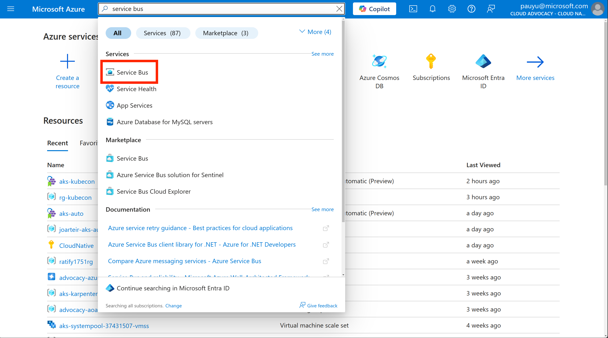

Fill in the required fields and click **Create**.

- **Resource group**: Select the resource group where your AKS cluster is deployed.
- **Namespace name**: Enter a unique name for the namespace (should be globally unique and lower case).
- **Location**: Select the same location as your AKS cluster.
- **Pricing tier**: Select **Basic**.

Click on the **Review + create** button then click **Create**.

Once the namespace is created, click on the **Go to resource** button.

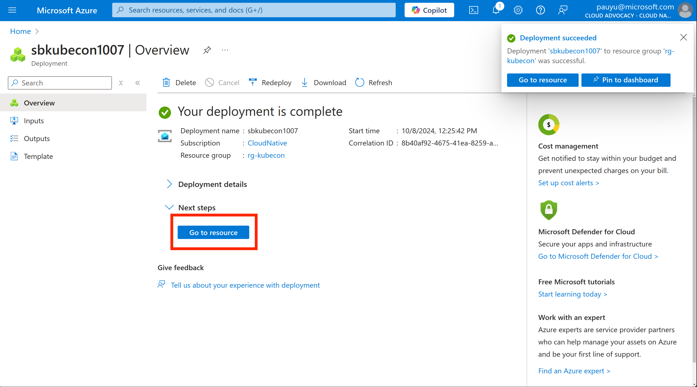

In the **Overview** section, click on the **+ Queue** button at the top to create a new queue.

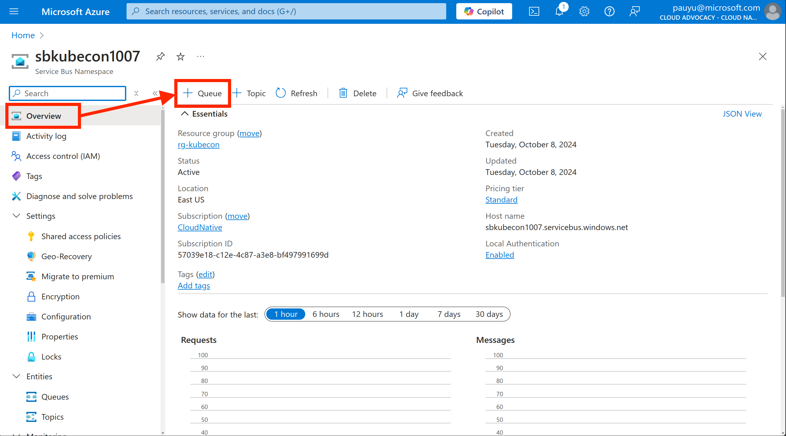

In the **Create queue** window, set the name of the queue to `orders` and click **Create**.

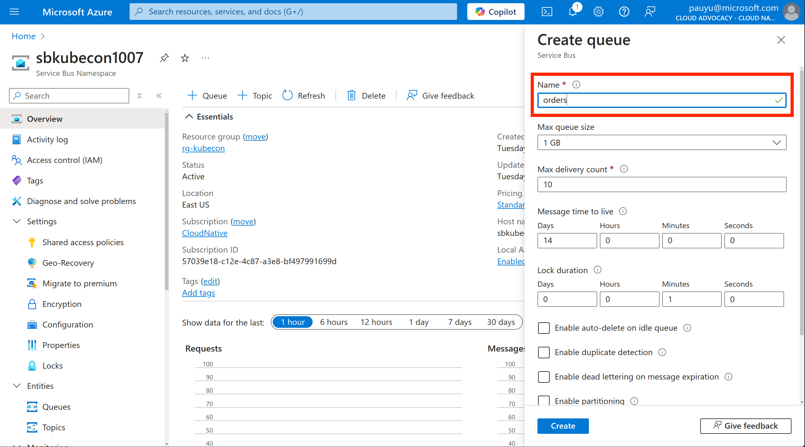

### Create a user-assigned managed identity

In order for the order-service application to authenticate with Azure Service Bus, we need to create a user-assigned managed identity. In the Azure portal, search for **Managed Identities**, click on **Managed Identities** under **Services** then click on the **+ Create** button.


Fill in the required fields

- **Resource group**: Select the resource group where your AKS cluster is deployed.
- **Name**: You can use the same name as the Service Bus namespace.

Click **Review + create** then click **Create**.

### Integrate Azure Services with AKS using Service Connector

Here is where the workload authentication magic happens. We will use the [AKS Service Connector](https://learn.microsoft.com/azure/service-connector/overview) to connect the order-service application to Azure Service Bus. The AKS Service Connector is a new feature that greatly simplifies the process of configuring [Workload Identity](https://learn.microsoft.com/azure/aks/workload-identity-overview?tabs=dotnet) for your applications running on AKS. [Workload Identity](https://learn.microsoft.com/entra/workload-id/workload-identities-overview) is a feature that allows you to assign an identity to a pod and use that identity to authenticate with Microsoft Entra ID to access Azure services.

<div class="info" data-title="Note">

> Workload Identity is the recommended way to authenticate with Azure services from your applications running on AKS. It is more secure than using service principals and does not require you to manage credentials in your application. To read more about the implementation of Workload Identity for Kubernetes, see [this doc](https://azure.github.io/azure-workload-identity/docs/).

</div>

In the Azure portal, navigate to the AKS cluster you created earlier. In the left-hand menu, click on **Service Connector (Preview)** under **Settings** then click on the **+ Create** button.

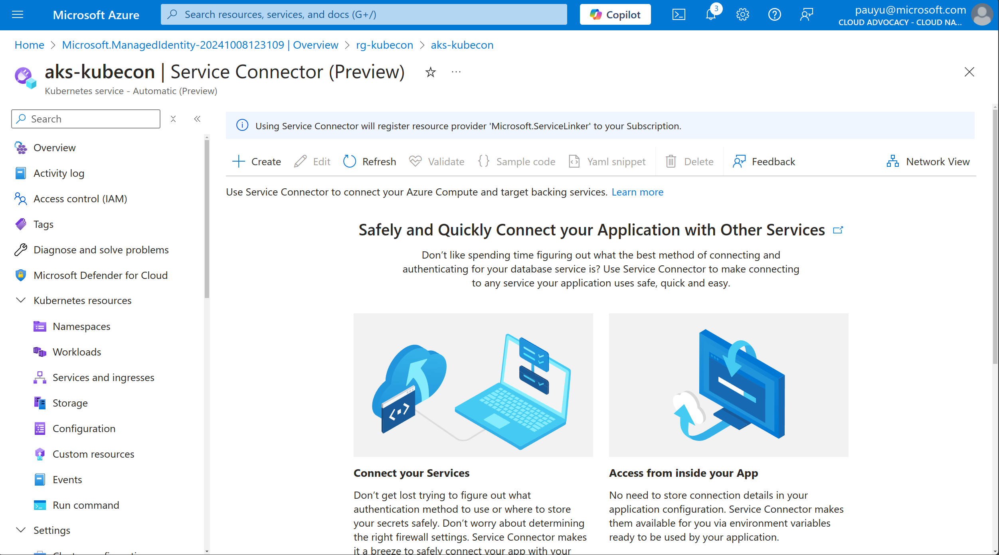

In the **Basics** tab, enter the following details:

- **Kubernetes namespace**: Enter **default**
- **Service type**: Select **Service Bus**

Leave the rest of the fields as their default values and click **Next: Authentication**.

In the **Authentication** tab, select the **Workload Identity** option and select the user-assigned managed identity you created earlier.

Click **Next: Networking** then click **Next: Review + create** and finally click **Create**.

<div class="info" data-title="Info">

> This process will take a few minutes as the Service Connector does some work behind the scenes to configure Workload Identity for the order-service application. Some of the tasks include assigning the proper Azure role permissions to the [managed identity](https://learn.microsoft.com/entra/identity/managed-identities-azure-resources/overview) to access the Service Bus, creating a [Federated Credential](https://learn.microsoft.com/entra/workload-id/workload-identity-federation) to establish trust between the Kubernetes cluster and the managed identity, creating a Kubernetes [ServiceAccount](https://kubernetes.io/docs/concepts/security/service-accounts/) with a link back to the managed identity, and finally creating a Kubernetes [Secret](https://kubernetes.io/docs/concepts/configuration/secret/) with the Service Bus endpoint information.

</div>

Once the Service Connector for Azure Service Bus has been created, you can configure the order-service application to use the Service Bus connection details.

In the Service Connector page, select the checkbox next to the Service Bus connection and click the **Yaml snippet** button.

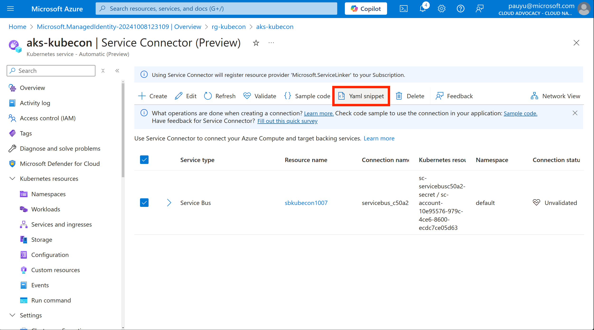

In the **YAML snippet** window, select **Kubernetes Workload** for **Resource type**, then select **order-service** for **Kubernetes Workload**.


You will see the YAML manifest for the order-service application with the highlighted edits required to connect to Azure Service Bus via Workload Identity.

Click **Apply** to apply the changes to the order-service application. This will redeploy the order-service application with the new connection details. But since the original order-service deployment was created specifically to connect to RabbitMQ, we need to update the deployment to remove some of the RabbitMQ specific information.

The order-service is designed to use multiple authentication methods. We need to add one environment variable to the order-service deployment to tell it to connect to the Azure Service Bus using workload identity.

Run the following command to patch the order-service deployment.

```bash
# add the USE_WORKLOAD_IDENTITY_AUTH environment variable
kubectl patch deployment order-service --type='json' -p='[
  {
    "op": "add",
    "path": "/spec/template/spec/containers/0/env/-",
    "value": {
      "name": "USE_WORKLOAD_IDENTITY_AUTH",
      "value": "true"
    }
  }
]'

# remove the RabbitMQ specific environment variables
kubectl patch deployment order-service --type='json' -p='[
  { "op": "remove", "path": "/spec/template/spec/containers/0/env/3" },
  { "op": "remove", "path": "/spec/template/spec/containers/0/env/2" },
  { "op": "remove", "path": "/spec/template/spec/containers/0/env/1" },
  { "op": "remove", "path": "/spec/template/spec/containers/0/env/0" }
]'

# remove the RabbitMQ init container
kubectl patch deployment order-service --type='json' -p='[
  { "op": "remove", "path": "/spec/template/spec/initContainers" }
]'
```

<div class="info" data-title="Info">

> The `USE_WORKLOAD_IDENTITY_AUTH` environment variable is used to tell the order-service application to use Workload Identity to authenticate with Azure Service Bus. The other environment variables are removed because they are specific to RabbitMQ.

</div>

With Azure Service Bus in place, RabbitMQ isn't needed anymore, so run the following commands to delete it.

```bash
kubectl delete statefulset rabbitmq
kubectl delete service rabbitmq
```

Browse to the store-front application again, add an item to the cart, and checkout, you should see the order appear in the Azure Service Bus queue. To view the message in the queue, you can use the Azure portal or the Azure CLI.

```bash
# get the service bus namespace name
SERVICEBUS_NAME=$(az servicebus namespace list -g $RG_NAME --query "[0].name" -o tsv)

# get the active message count in the orders queue
az servicebus queue show --resource-group $RG_NAME --namespace-name $SERVICEBUS_NAME --name orders --query "countDetails"
```

You should see 1 active message count in the queue.

---

# Application and Cluster Scaling

In a enterprise production environment, the demands and resource usage of your workloads running on Azure Kubernetes Service (AKS) can be dynamic and change frequently. If your application requires more resources, it could be impacted due to the lack of clusters resources. One of the easiest ways to ensure your applications have enough resources from the cluster, is to scale your cluster to include more working nodes.

There are several scenarios that would require your application and/or cluster the need to scale. If your application needs to respond to increased demand, we can scale your application across the cluster to meet demand. If your application has used all of the available resources from the cluster, we can scale the number of nodes in the cluster to meet demand as well.

We will walk through the most popular options that allow you to scale your application and cluster to meet your workload demands.

## Manually scaling your cluster

Manually scaling your cluster gives you the ability to add or remove additional nodes to the cluster at any point in time, adding additional hardware resources to your cluster. Using manual scaling is good for dev/test and/or small production environments where reacting to changing workload utilization is not that important.

With AKS Automatic, system pods and other critical components of the cluster are deployed to a system node pool. This node pool is managed by AKS and is not recommended to be scaled manually. Workloads like the AKS store demo app you deployed earlier are deployed to a separate node pool managed by a different feature of AKS which we'll get into later.

Run the following command to view the current count of the system node pool.

```bash
az aks show \
--resource-group ${RG_NAME} \
--name ${AKS_NAME} \
--query "agentPoolProfiles[].{count: count, name: name}"
```

<div class="important" data-title="Important">

> You could scale the system node pool by running the following command, but this may not be available in the future for AKS Automatic clusters.
>
> ```bash
> az aks scale  \
> --resource-group <resource-group-name> \
> --name <aks-cluster-name> \
> --node-count 4 \
> --nodepool-name systempool
> ```

</div>

## Manually scaling your application

In addition to you being able to manually nodes to add additional compute resources, you can also manually scale your application workloads deployed in the cluster. In the scenario where your application is experiencing a lot of transactions, such as client interactions or internal API processing, you can manually scale the deployment to increase the number of replicas (instances) running to handle additional load.

You actually performed a manual scale operation earlier in the workshop when you updated the store-front deployment to use PodAntiAffinity.

Run the following command to view the current number of replicas for the **store-front** deployment.

```bash
kubectl get deployment store-front
```

Notice that there is 3 replicas of the **store-front** pods running. Run the following command to scale the number of replicas for the store-front deployment back to 1.

```bash
kubectl scale deployment store-front --replicas=1
```

We'll explore better ways to automatically scale your application in the next section.

## Automatically scaling your application

To automatically scale your deployments, you can use the [Horizontal Pod Autoscaler (HPA)](https://kubernetes.io/docs/tasks/run-application/horizontal-pod-autoscale/) resource. This is a better approach to scale you application, as it allows you to automatically scale a workload based on the resource utilization of the pods in the deployment. The resource utilization is based on the CPU and memory requests and limits set in the pod configuration, so it is important to set these values correctly to ensure the HPA can scale your application correctly.

Let's first take a look and view the current CPU and memory requests and limits for the **store-front** deployment.

```bash
kubectl describe deployment store-front | grep -A 2 -E "Limits|Requests"
```

You should see the following limits and requests:

```yaml
Limits:
  cpu: 1
  memory: 512Mi
Requests:
  cpu: 1m
  memory: 200Mi
```

This configuration tells the Kubernetes scheduler to allocate up to 1 CPU and up to 512Mi of memory to the pod. The pod will be allocated at least 1m of CPU and 200Mi of memory. The HPA will use these values to determine when to scale the number of replicas of the **store-front** deployment.

### Automatically scaling your application with HPA

The simplest way to create an HPA is to use the imperative `kubectl autoscale` command. Run the following command to create an HPA for the **store-front** deployment that will allow the HPA controller to increase or decrease the number of Pods from 1 to 10, based on the Pods keeping an average of 50% CPU utilization.

```bash
kubectl autoscale deployment store-front --cpu-percent=50 --min=1 --max=10
```

We can then verify that an HPA resource exists for the **store-front** deployment.

```bash
kubectl get hpa store-front
```

You may notice that the HPA autoscaler has already started to add additional replicas of the **store-front** deployment to meet the HPA demands.

We will now deploy an application to simulate additional client load to the **store-front** deployment. Run the following command to deploy a pod that will generate additional load to the **store-front** deployment.

```bash
kubectl run load-generator --image=busybox:1.28 --restart=Never -- /bin/sh -c "while sleep 0.01; do wget -q -O- http://store-front; done"
```

Take a look at the HPA resource for the **store-front** deployment to see if we have increased the need for replicas to meet the resource configuration.

```bash
kubectl get hpa store-front
```

You should see that the load generating application forced the automatic scaling of the **store-front** deployment to reach the maximum replica limit of 10.

```text
NAME          REFERENCE                TARGETS    MINPODS   MAXPODS   REPLICAS   AGE
store-front   Deployment/store-front   225%/50%   1         10        10         6m15s
```

Terminate the load generator pod by running the following command.

```bash
kubectl delete pod load-generator --wait=false
```

Remove the HPA configuration for the **store-front** deployment by running the following command.

```bash
kubectl delete hpa store-front
```

We'll explore a better way to automatically configure the HPA in the next section.

### Using KEDA to manage HPA

We just saw how to use the Horizontal Pod Autoscaler (HPA) to automatically scale your application based on resource utilization. The HPA is a great way to scale your application based on CPU and memory utilization, but what if you want to scale your application based on other metrics like the number of messages in a queue, the length of a stream, or the number of messages in a topic?

The [Kubernetes Event-driven Autoscaling (KEDA)](https://keda.sh/) project is a Kubernetes-based Event-Driven Autoscaler. KEDA allows you to scale your application workloads based on the number of events in a queue, the length of a stream, or the number of messages in a topic. KEDA can be installed manually in your AKS cluster but it is also available as an add-on to AKS and is automatically enabled in AKS Automatic clusters. When you use the AKS add-on for KEDA, it will be fully supported by Microsoft.

In order to use KEDA, you can deploy a [ScaledObject](https://keda.sh/docs/2.15/reference/scaledobject-spec/) resource to scale long-running applications or deploy a [ScaledJob](https://keda.sh/docs/2.15/reference/scaledjob-spec/) resource to scale batch jobs. A ScaledObject is a custom resource that defines how to scale a deployment based on an external metric. The ScaledObject will watch the external metric and scale the deployment based on the metric value.

Having to learn and write the ScaledObject resource manifest can be a bit challenging, so AKS provides a simpler way to create a ScaledObject resource using the Azure portal. 

In the Azure portal, navigate to the AKS cluster you created earlier. In the left-hand menu, click on **Application scaling** under **Settings** then click on the **+ Create** button.


In the **Basics** tab, enter the following details:

- **Name**: Enter **store-front**
- **Namespace**: Select **default**
- **Target workload**: Select **store-front**
- **Minimum replicas**: Enter **1**
- **Maximum replicas**: Enter **10**
- **Trigger type**: Select **CPU**

Leave the rest of the fields as their default values and click \*_Next_.

In the **Review + create** tab, click **Customize with YAML** to view the YAML manifest for the ScaledObject resource.


You can see the YAML manifest the AKS portal generated for the ScaledObject resource. Here you can add additional configuration to the ScaledObject resource if needed.


Click **Save and create** to create the ScaledObject resource.

Header over to the **Workloads** section in the left-hand menu and click on **Deployments**. In the **Filter by deployment name** field, enter **store-front** to view the **store-front** deployment. You should see the **store-front** deployment is now running 2 replicas.

Also, if you run the following command, you should see a HPA resource named **keda-hpa-store-front** which KEDA created and is managing for the **store-front** deployment.

```bash
kubectl get hpa
```

This was a simple example of using using KEDA. But using KEDA over the HPA for CPU and memory utilization doesn't give you lot to differentiate the experience. The real power of KEDA comes from its ability to scale your application based on external metrics like the number of messages in a queue, the length of a stream, the number of messages in a topic, or based on a custom schedule using CRON expressions. There are many [scalers](https://keda.sh/docs/2.15/scalers/) available for KEDA that you can use to scale your application based on a variety of external metrics.

## Automatically scaling your cluster

So far as it relates to scaling, we have seen how to manually scale the cluster nodes, to allow more access to hardware recourses for running workloads, manually scaling your workload deployments to increase the number of instances of your application, and we have also seen how you can create an HPA autoscaler for your application workload deployment that will automatically scale your application depending on the amount of resources it utilizes.

One thing to note, even though an HPA resource will automate the scaling of your application deployment, based on resource utilization, your application can still be affected if your cluster resources are exhausted. At that point, you will need to manually scale the number of nodes in the cluster to meet application demand.

There is a more preferred approach and method for scaling your cluster that takes into account both the resource needs of your application and the cluster nodes utilization known as the Node Autoprovisioning (NAP) component. NAP is based on the Open Source [Karpenter](https://karpenter.sh/) project, and the [AKS provider](https://github.com/Azure/karpenter-provider-azure), which is also Open Source. NAP will automatically scale your cluster node pool to meet the demands of your application workloads, not only with additional nodes, but will find the most efficient VM configuration to host the demands of your workloads.

To show how Node Autoprovisioning work, we will first scale down the node pool to have a single node.

First we will check to see if NAP is configured for the cluster. Run the following command in the terminal.

```bash
az aks show \
--resource-group ${RG_NAME} \
--name ${AKS_NAME} \
--query "nodeProvisioningProfile"
```

You should see mode is set to **Auto**.

<div class="important" data-title="Important">

> The `nodeProvisioningProfile` property is currently available in preview versions of the Azure resource provider APIs, so you will need to install the `aks-preview` extension within Azure CLI to view the property.
>
> ```bash
> az extension add --name aks-preview
> ```

</div>

To activate NAP, run the following command to manually scale the **product-service** deployment.

```bash
kubectl scale deployment product-service --replicas=100
```

This should start to exhaust the currently single node and trigger NAP to auto provision additional nodes in the node pool to support the resource demand.

If you run the following command, you should see some of the Pods for the **product-service** deployment are in a **Running** state and some are in a **Pending** state.

```bash
kubectl get pod --selector app=product-service -o wide
```

Note the **NODE** column to see which node the Pods are running on. Notice that the Pods that are in a **Pending** state are waiting for additional nodes to be provisioned by NAP.

Run the following command to check the status of the nodes in the cluster.

```bash
kubectl get nodes -w
```

After a few minutes, you should see additional nodes being created to support the resource demand of the **product-service** deployment.

---

# Monitoring your Cluster

Monitoring and observability are key components of running applications in production. With AKS Automatic, you get a lot of monitoring and observability features enabled out-of-the-box. If you recall from the beginning of the workshop, we created an [Azure Log Analytics Workspace](https://learn.microsoft.com/azure/azure-monitor/logs/log-analytics-overview) with [Container Insights](https://learn.microsoft.com/azure/azure-monitor/containers/container-insights-overview) to collect application logs, [Azure Monitor Managed Workspace](https://learn.microsoft.com/azure/azure-monitor/containers/kubernetes-monitoring-enable?tabs=cli) to with [Prometheus recording rules](https://learn.microsoft.com/azure/azure-monitor/containers/prometheus-metrics-scrape-default) enabled to capture metrics from workloads within the cluster, and [Azure Managed Grafana](https://azure.microsoft.com/products/managed-grafana) to visualize the metrics.

## Cluster and container insights

In the Azure portal, navigate to the AKS cluster you created earlier. In the left-hand menu, scroll down to the **Monitoring** section and click on **Insights**. Here you can see a high-level overview of how the cluster is performing.

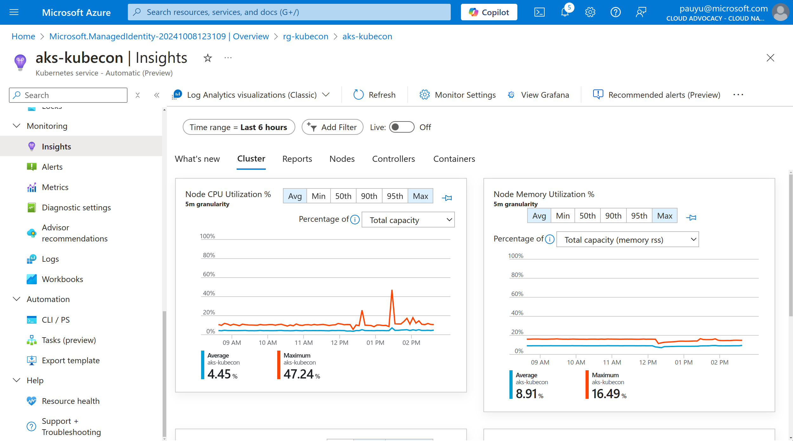

The AKS Automatic cluster was also pre-configured with basic CPU utilization and memory utilization alerts. You can also create additional alerts based on the metrics collected by the Prometheus workspace.

Click on the **Recommended alerts (Preview)** button to view the recommended alerts for the cluster. Expand the **Prometheus community alert rules (Preview)** section to see the list of Prometheus alert rules that are available. You can enable any of these alerts by clicking on the toggle switch.

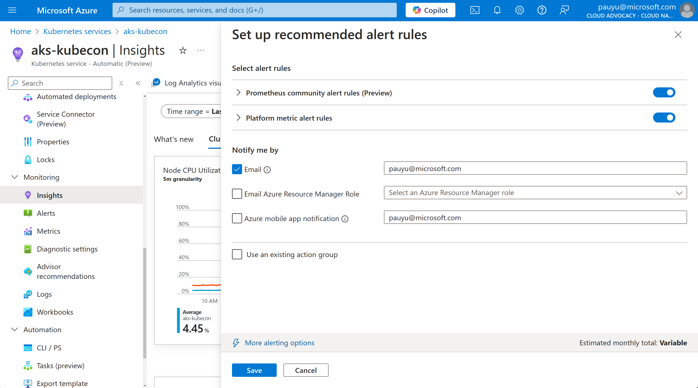

Click save to enable the alerts.

## Workbooks and logs

With Container Insights enabled, you can query the logs using Kusto Query Language (KQL) and create custom workbooks to visualize the data. One nice feature of Container Insights is having pre-configured workbooks that you can use to monitor your cluster and applications without having to write any queries.

In the **Monitoring** section of the AKS cluster left-hand menu, click on **Workbooks**. Here you will see a list of pre-configured workbooks that you can use to monitor your cluster.

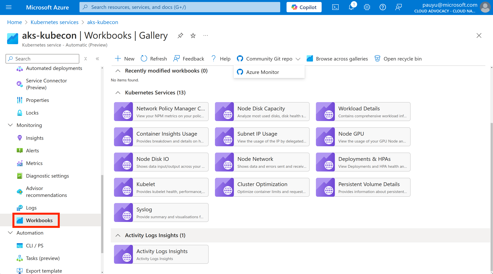

One workbook that is particularly useful is the **Cluster Optimization** workbook. This workbook can help you identify anomalies and detect application probe failures in addition to providing guidance on optimizing container resource requests and limits. Click on the **Cluster Optimization** workbook to view the details.


Take some time to explore the other workbooks available in the list.

<div class="tip" data-title="Tip">

> The workbook visuals will include a query button that you can click to view the KQL query that powers the visual. This is a great way to learn how to write your own queries.

</div>

If you click on the **Logs** section in the left-hand menu, you can view the logs collected by Container Insights. Here, you can write your own KQL queries or run pre-configured queries to logs from your cluster and applications. If you expand the **Logs** menu, click on **Queries**, and scroll down to the **Container Logs** section, you will see a list of pre-configured queries that you can run. Click on a query and click **Run** to view the results.


You can also view live streaming logs for a specific container by clicking on the **Workloads** section in the left-hand menu. In the **Deployments** tab, scroll down and locate the **order-service** deployment. Click on the **order-service** deployment to view the details. In the left-hand menu, click on **Live logs**, then select the pod you want to view logs for.

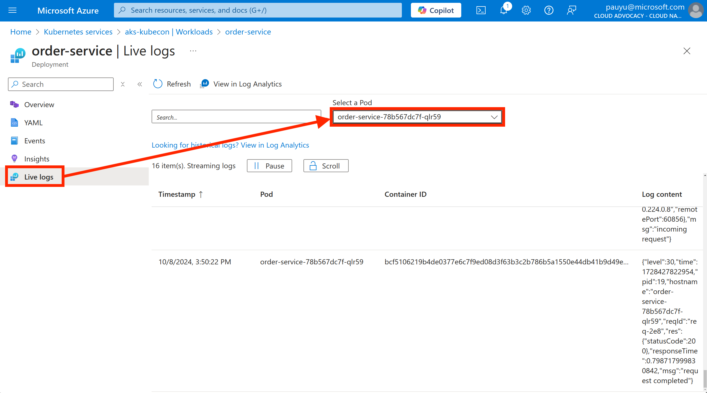

This is the equivalent of running `kubectl logs -f <pod-name>` in the terminal.

## Visualizing metrics with Grafana

The Azure Portal provides a great way to view metrics and logs, but if you prefer to visualize the data using Grafana, or execute complex queries using PromQL, you can use the Azure Managed Grafana instance that was created with the AKS Automatic cluster.

In the AKS cluster's left-hand menu, click on **Insights** under the **Monitoring** section and click on the **View Grafana** button at the top of the page. This will open a window with the linked Azure Managed Grafana instance. Click on the **Browse dashboards** link. This will take you to the Azure Managed Grafana instance.


In the Grafana home page, click on the **Dashboards** link in the left-hand menu. Here you will see a list of pre-configured dashboards that you can use to visualize the metrics collected by the Prometheus workspace.


In the **Dashboards** list, expand the **Azure Managed Prometheus** folder and explore the dashboards available.

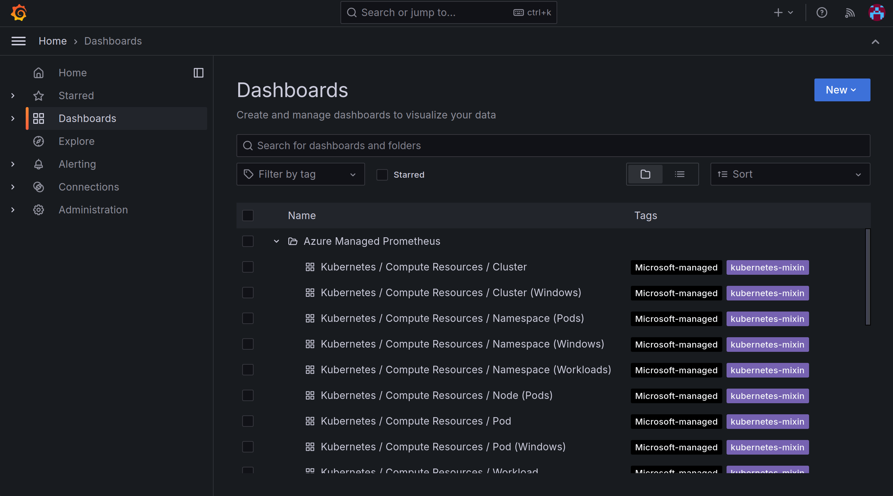

Each dashboard provides a different view of the metrics collected by the Prometheus workspace with controls to allow you to filter the data.

Click on a **Kubernetes / Compute Resources / Workload** dashboard. Filter the **namespace** to `default` the **type** to `deployment`, and the **workload** to `order-service`. This will show you the metrics for the order-service deployment.


## Querying metrics with PromQL

If you prefer to write your own queries to visualize the data, you can use the **Explore** feature in Grafana. In the Grafana home page, click on the **Explore** link in the left-hand menu, and select the **Managed_Prometheus_defaultazuremonitorworkspace** data source.

The query editor supports a graphical query builder and a text-based query editor. The graphical query builder is a great way to get started with PromQL. You can select the metric you want to query, the aggregation function, and any filters you want to apply.

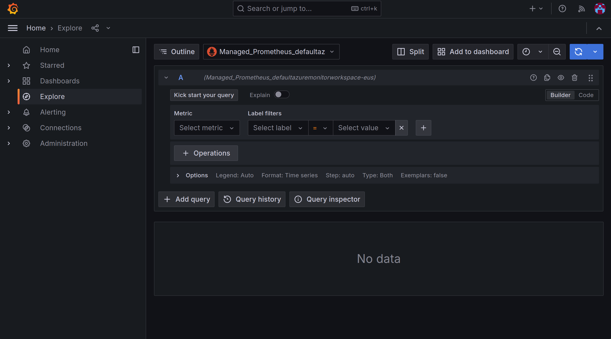

---

# CI/CD with Automated Deployments

Up until this point, you've been using either kubectl or the Azure portal to deploy applications to your AKS cluster and/or edit configurations. This is fine for manual deployments, but in a production environment, you would want to automate the deployment process. This is where Continuous Integration and Continuous Deployment (CI/CD) pipelines come in. With CI/CD pipelines, you can automate the process of building, testing, and deploying your applications to your AKS cluster.

With AKS, the [Automated Deployments](https://learn.microsoft.com/azure/aks/automated-deployments) feature allows you to create [GitHub Actions workflows](https://docs.github.com/actions) that allows you to start deploying your applications to your AKS cluster with minimal effort. All you need is a GitHub repository with your application code. If you have Dockerfiles or Kubernetes manifests in your repository, that's great, you can simply point to them in the Automated Deployments setup. But the best part is that you don't even need to have Dockerfiles or Kubernetes manifests in your repository. Automated Deployments can create them for you.

## Fork a sample repository

In this section, you will fork a sample repository that contains a simple Node.js application.

In your browser, navigate to the [contoso-air](https://github.com/pauldotyu/contoso-air) repo and click the **Fork** button in the top right corner of the page.


<div class="info" data-title="Note">

> Make sure you are logged into your GitHub account before forking the repository.

</div>

## Automated Deployments setup

In the Azure portal, navigate to the AKS cluster you created earlier. In the left-hand menu, click on **Automated Deployments** under the **Settings** section. Click on the **+ Create** button, then click **Automatically containerize and deploy** button.

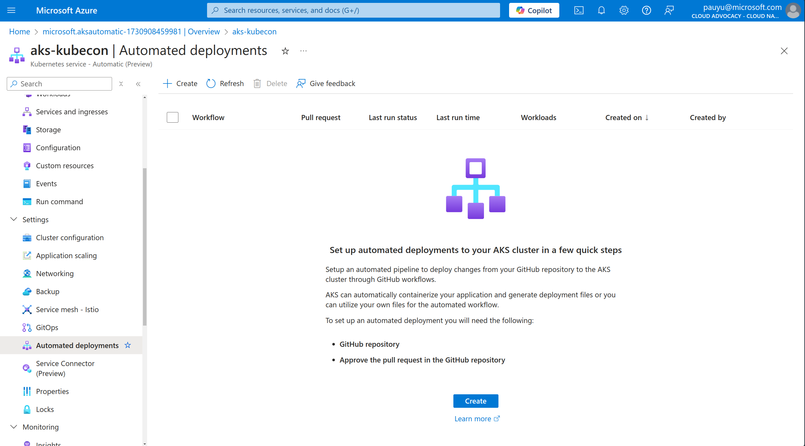

In the **Repository** tab, fill in the following details:

- **Workflow name**: Enter `contoso-air`
- **Repository location**: Authenticate to your GitHub account
- **Repository source**: Select the **My repositories** radio button
- **Repository**: Select the **contoso-air** repository you forked earlier
- **Branch**: Select the **main** branch

Click **Next**.

In the **Application** tab, fill in the following in the **Image** section:

- **Container configuration**: Select **Auto-containerize (generate Dockerfile)**
- **Save files in repository**: Click the **Select** link to open the directory explorer, then navigate to the `Root/src` directory, select the checkbox next to the `web` folder, then click **Select**.

Scroll down to the **Dockerfile configuration** section, fill in the following details:

- **Application environment**: Select **JavaScript - Node.js 20**
- **Application port**: Enter **3000**
- **Dockerfile build context**: Enter `./src/web`
- **Azure Container Registry**: Select the Azure Container Registry you created earlier
- **Azure Container Registry image**: Click the **Create new** link then enter `contoso-air`
- Optionally click on the **Preview file** tab under **Review generated files**  to view the generated Dockerfile

Scroll down to the **Deployment configuration** section and fill in the following details:

- **Deployment options**: Select **Generate application deployment files**
- **Namespace**: Select `default`
- **Save files in repository**: Click the **Select** link to open the directory explorer, then navigate to the `Root/src` directory, select the checkbox next to the `web` folder, then click **Select**.
- Optionally click on the **Preview file** tab under **Review generated files** section to view the generated Kubernetes manifests.

Click **Next**, review the configuration, then click **Next** to submit the deployment.

After a minute or so, the deployment will complete and you will see a success message. Click on the **Approve pull request** button to view the pull request to be taken to the pull request page in your GitHub repository. 

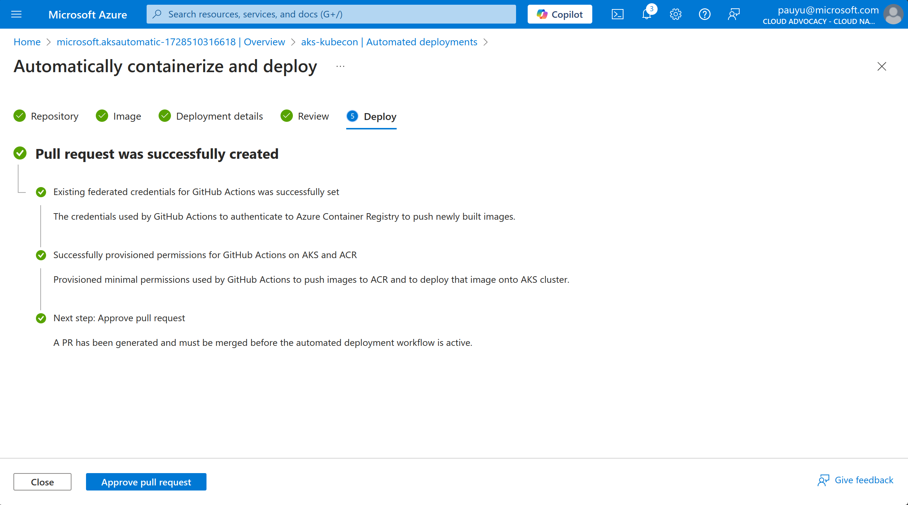

## Review the pull request

<div class="important" data-title="Important">

> The application's container image needs to be built with Node 22 as its base image, so you will need to update the Dockerfile. You can do this by editing the Dockerfile in the pull request review.

</div>

In the pull request review, click on the **Files changed** tab to view the changes that were made by the Automated Deployments workflow. 

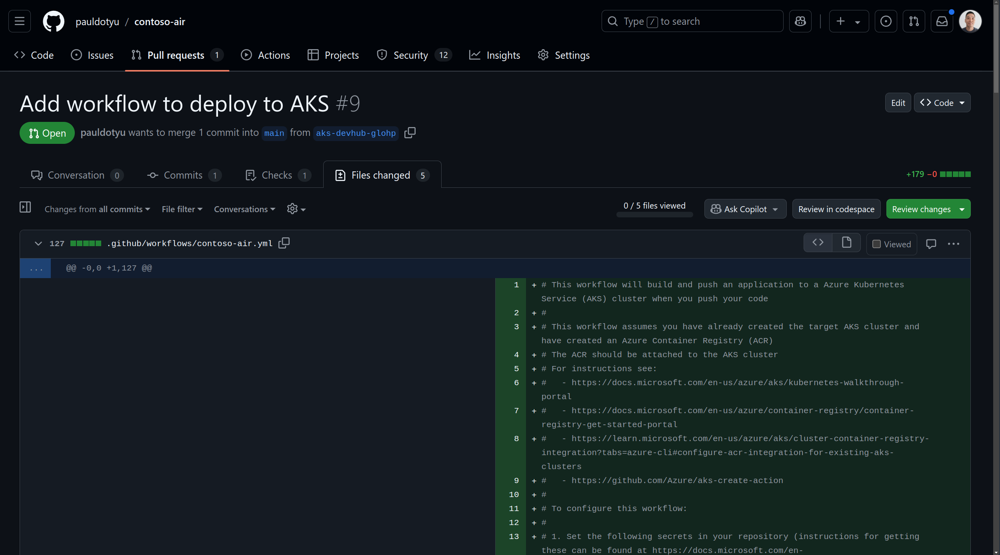

Scroll down to the **src/web/Dockerfile** that Automated Deployment generated for you, then click on the **Edit** button to edit the file.

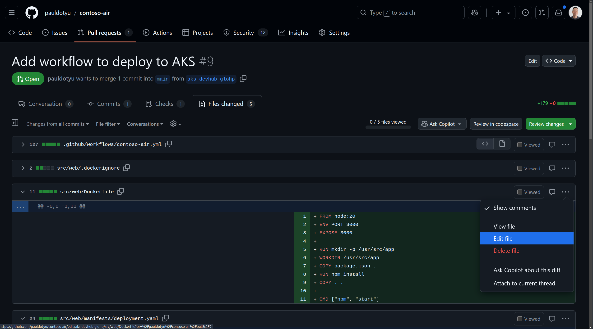

Update the `FROM` line in the Dockerfile to use the `node:22` base image.

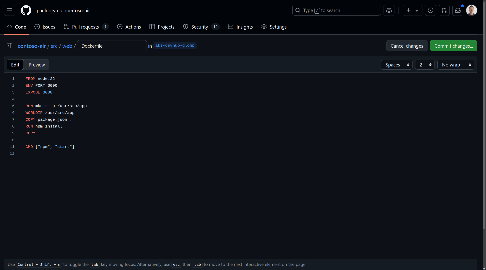

Click on the **Commit changes** button to commit the changes to the pull request. The file should now look like this.

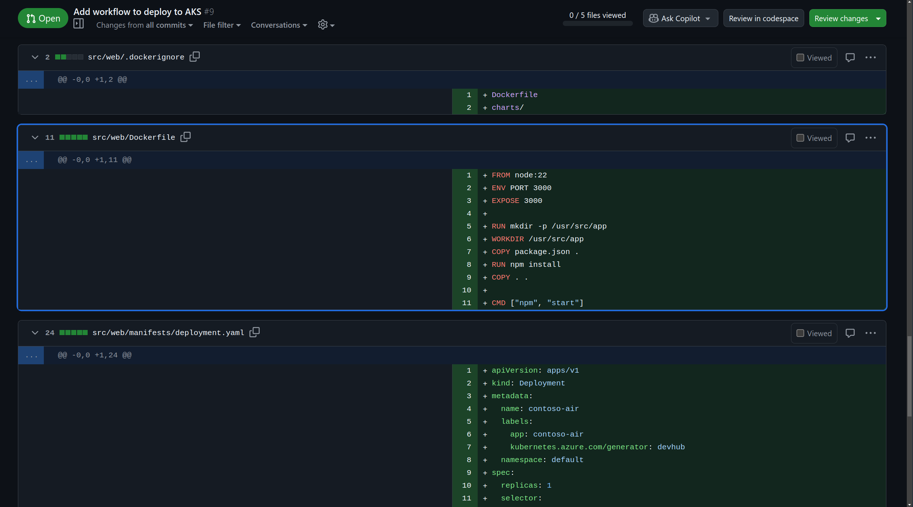

Navigate back to the **Conversation** tab and click on the **Merge pull request** button to merge the pull request, then click **Confirm merge**.

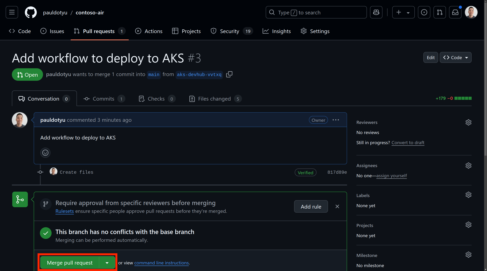

With the pull request merged, the changes will be automatically deployed to your AKS cluster. You can view the deployment logs by clicking on the **Actions** tab in your GitHub repository.


In the **Actions** tab, you will see the Automated Deployments workflow running. Click on the workflow run to view the logs.

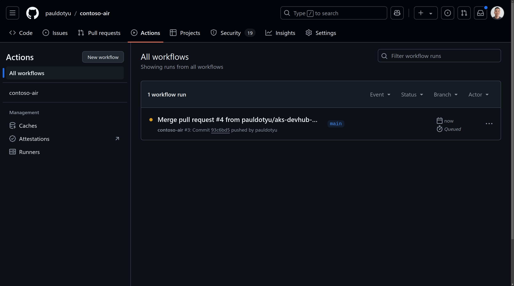

In the workflow run details page, you can view the logs of each step in the workflow by simply clicking on the step.


After a few minutes, the workflow will complete and you will see two green check marks next to the **buildImage** and **deploy** steps. This means that the application has been successfully deployed to your AKS cluster.

## View the deployed application

In the Azure portal, navigate to the AKS cluster you created earlier. In the left-hand menu, click on **Services and ingresses** under the **Kubernetes resources** section. You should see a new service called `contoso-air` with a public IP address assigned to it. Click on the IP address to view the deployed application.

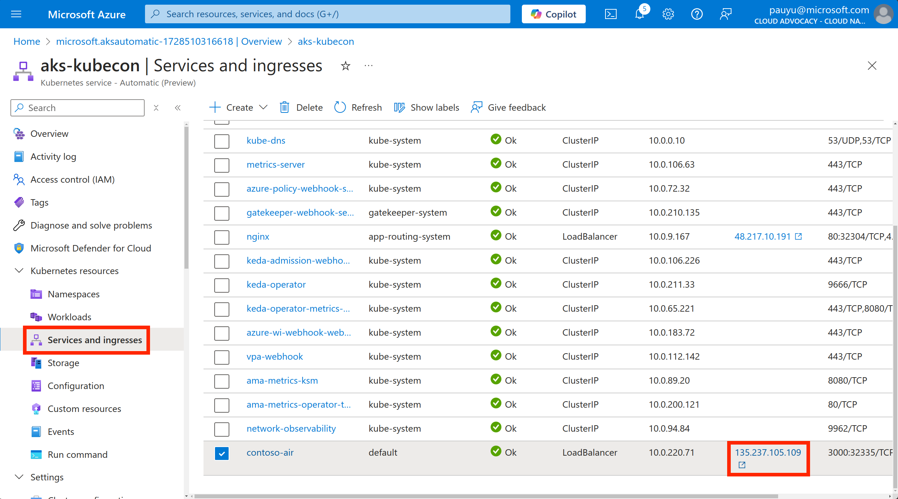

With AKS Automated Deployments, every time you push application code changes to your GitHub repository, the GitHub Action workflow will automatically build and deploy your application to your AKS cluster. This is a great way to automate the deployment process and ensure that your applications are always up-to-date!

---

# Summary

Congratulations on completing the AKS Automatic workshop!

In this workshop, you learned how to create an AKS cluster with the new AKS Automatic feature. You deployed a sample application to the cluster and explored some of the features that AKS Automatic provides. You learned how to scale your cluster manually and automatically using the Horizontal Pod Autoscaler and KEDA. You also learned how to handle stateful workloads using Persistent Volumes and Azure Service Bus. Finally, you explored the monitoring and observability features of AKS Automatic.

To learn more about AKS Automatic, visit the [AKS documentation](https://learn.microsoft.com/azure/aks/intro-aks-automatic).

In addition to this workshop, you can also explore the following resources:

- [Azure Kubernetes Service (AKS) documentation](https://learn.microsoft.com/azure/aks)
- [Kubernetes: Getting started](https://azure.microsoft.com/solutions/kubernetes-on-azure/get-started/)
- [Learning Path: Introduction to Kubernetes on Azure](https://learn.microsoft.com/training/paths/intro-to-kubernetes-on-azure/)
- [Learning Path: Deploy containers by using Azure Kubernetes Service (AKS)](https://learn.microsoft.com/training/paths/deploy-manage-containers-azure-kubernetes-service/)

If you have any feedback or suggestions for this workshop, please feel free to open an issue or pull request in the [GitHub repository](https://github.com/Azure-Samples/aks-labs)
