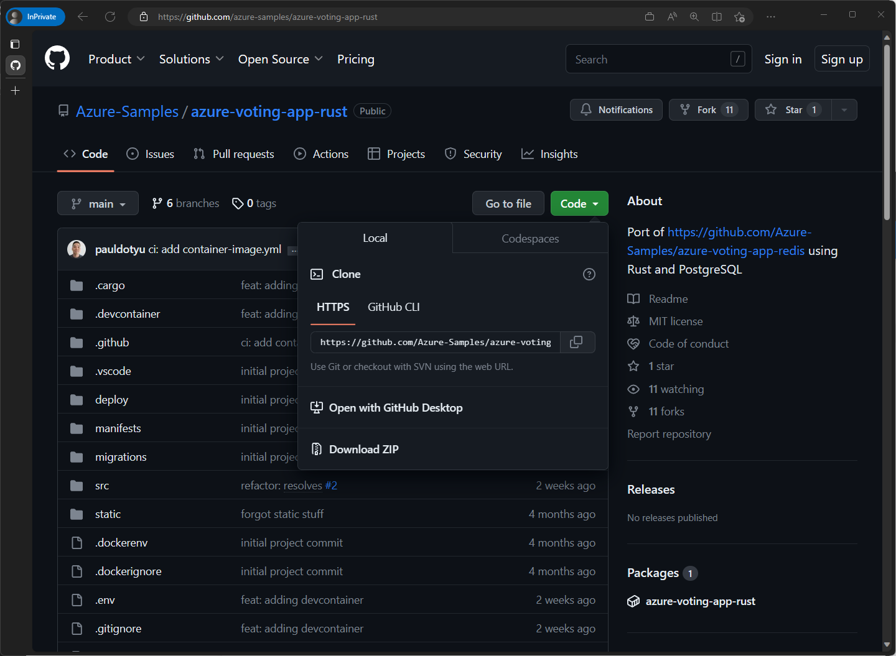
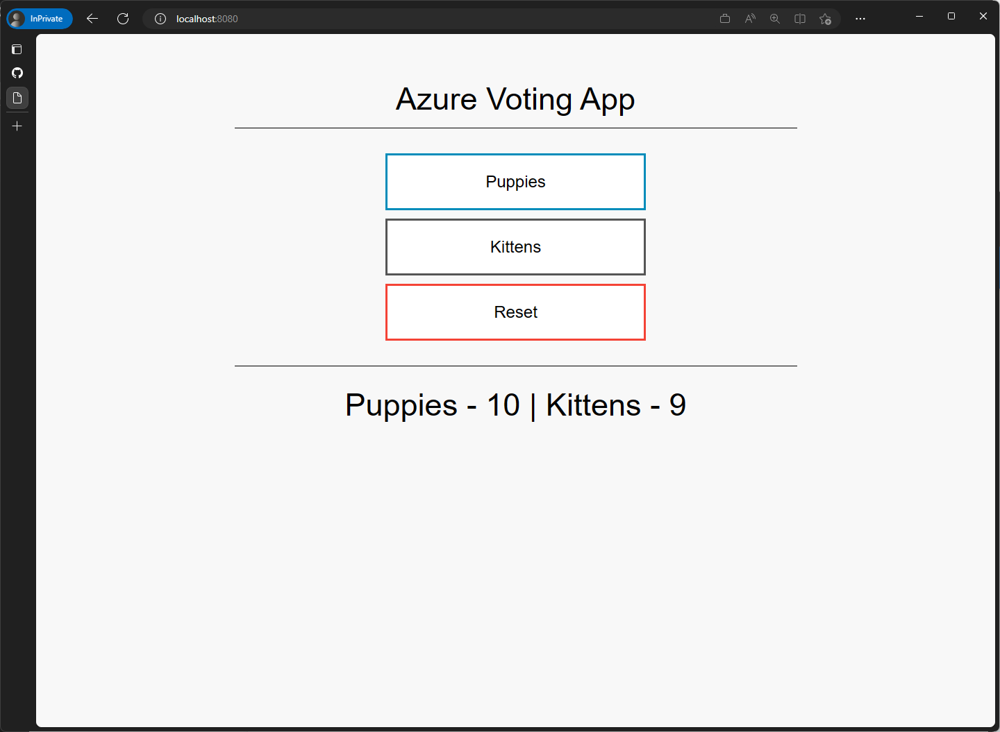
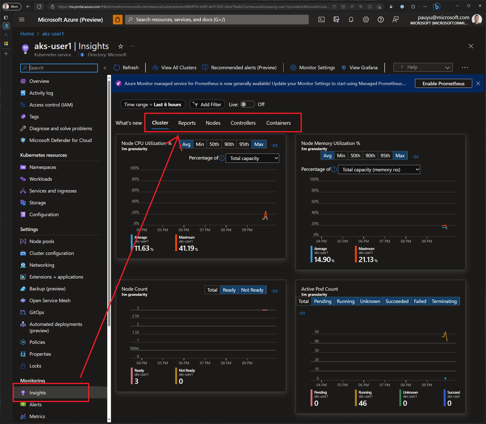
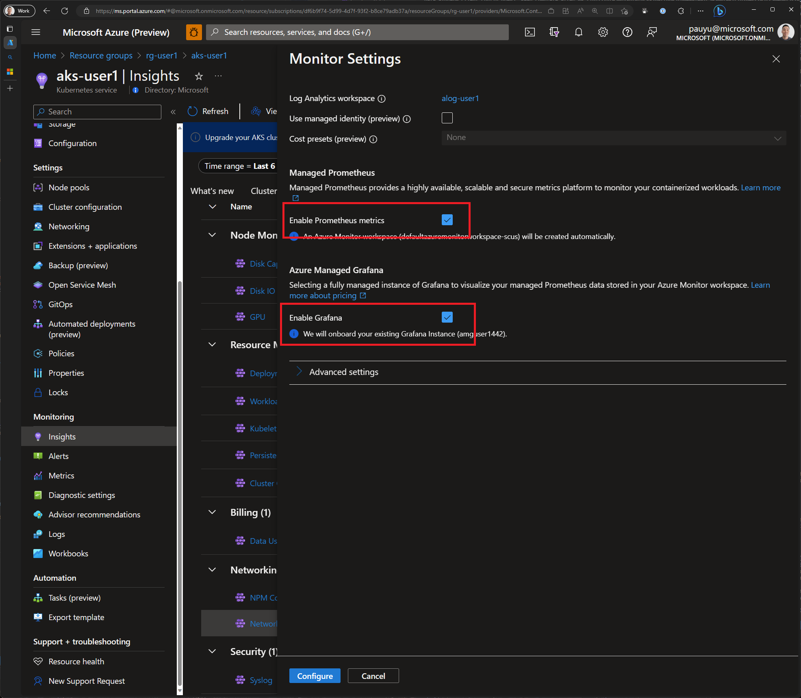
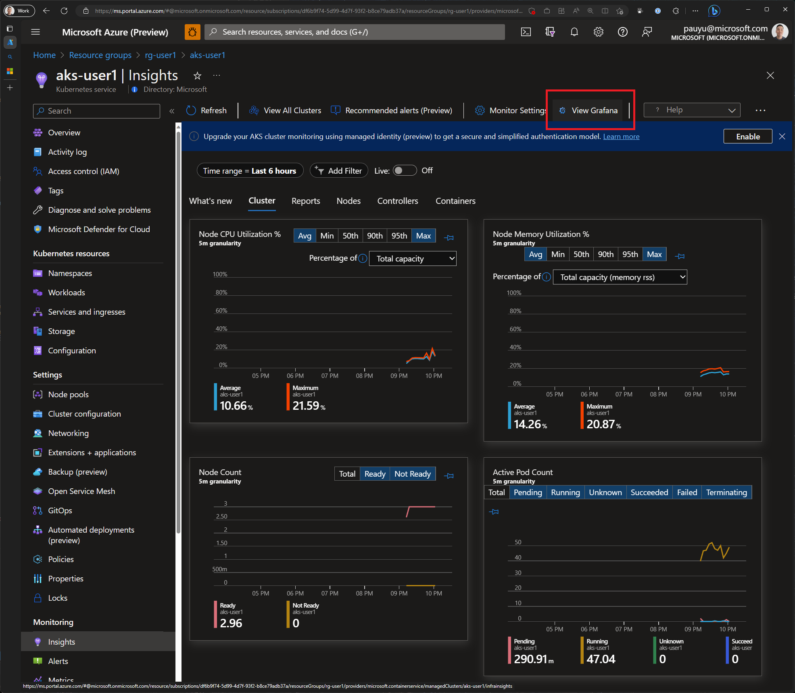
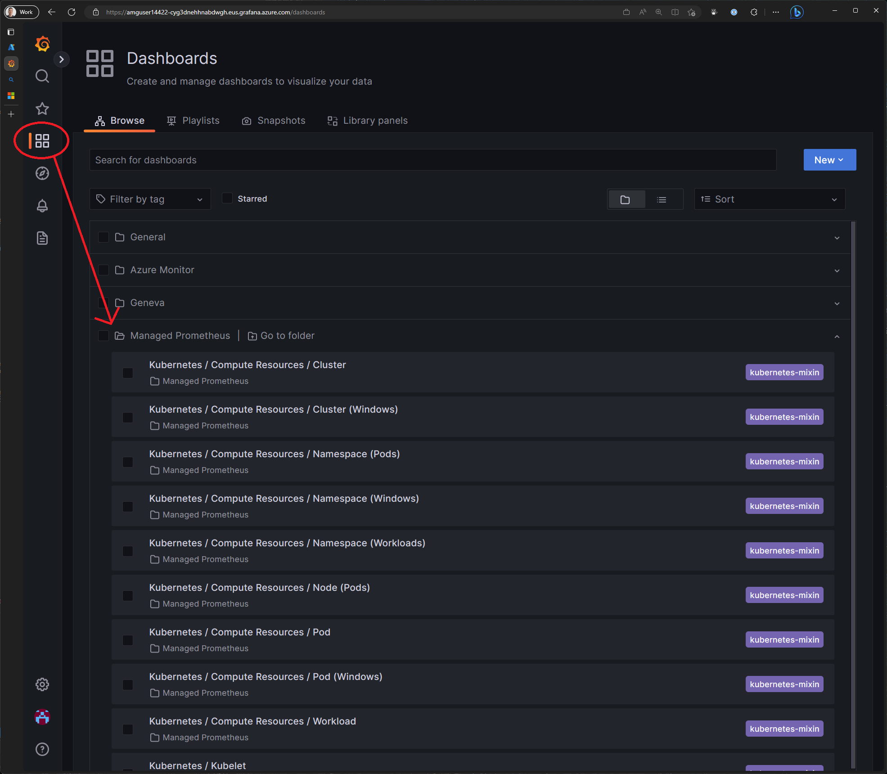

# Getting started

In this workshop, you will learn the basics of Kubernetes and how to package applications for delivery to Azure Kubernetes Service (AKS). The goal of this workshop is to cover as many application implementation details as possible to get you comfortable with hosting your apps on AKS. We will start with a simple application deployment and then progress to more complex scenarios by introducing integrations with other Azure services and open source tooling commonly used within cloud native apps.

## Objectives

The objectives of this workshop are to:

- Introduce you to the basics of Kubernetes and `kubectl`
- Deploy an application to Azure Kubernetes Service
- Securing application secrets using Azure Key Vault
- Persisting application data using Azure Disk Storage
- Exposing applications using the Istio Ingress Gateway
- Monitoring applications using Azure Monitor and the Prometheus/Grafana stack
- Scaling applications using KEDA

## Prerequisites

<div class="info" data-title="Info">

> This workshop was originally delivered in-person at Microsoft Build 2023 and a pre-configured lab environment was available for all attendees.

</div> 

The lab environment was pre-configured with the following:

- [Azure Subscription](https://azure.microsoft.com/free)
- [Azure CLI](https://learn.microsoft.com/cli/azure/what-is-azure-cli?WT.mc_id=containers-105184-pauyu)
- [Visual Studio Code](https://code.visualstudio.com/)
- [Docker Desktop](https://www.docker.com/products/docker-desktop/)
- [Git](https://git-scm.com/)
- Bash shell (e.g. [Windows Terminal](https://www.microsoft.com/p/windows-terminal/9n0dx20hk701) with [WSL](https://docs.microsoft.com/windows/wsl/install-win10) or [Azure Cloud Shell](https://shell.azure.com))

## Workshop instructions

When you see these blocks of text, you should follow the instructions below.

<div class="task" data-title="Task">

> This means you need to perform a task.

</div>

<div class="info" data-title="Info">

> This means there's some additional context.

</div>

<div class="tip" data-title="Tip">

> This means you should pay attention to some helpful tips.

</div>

<div class="warning" data-title="Warning">

> This means you should pay attention to some information.

</div>

<div class="important" data-title="Important">

> This means you should **_really_** pay attention to some information.

</div>

## Setting up your environment

To setup your own lab environment, you will need to run a Terraform script to provision the necessary resources in your Azure subscription. The steps below will walk you through the process.

<div class="important" data-title="Important">

> Before you proceed, please ensure you have access to an Azure subscription with the ability to create resources and users in Azure Active Directory. If you do not have access to an Azure subscription, you can sign up for a [free account](https://azure.microsoft.com/free).

</div>

1. Using a web browser, navigate to the [Azure Cloud Shell](https://shell.azure.com)
2. Ensure your Cloud Shell is set to Bash. If it is on PowerShell, click the drop down in the top left corner and select Bash.
3. Run the following commands to ensure you have all the necessary providers registered in your subscription.
  ```bash
  az provider register --namespace Microsoft.Quota
  az provider register --namespace Microsoft.Compute
  az provider register --namespace Microsoft.ContainerRegistry
  az provider register --namespace Microsoft.ContainerService
  az provider register --namespace Microsoft.Network
  az provider register --namespace Microsoft.ApiManagement
  az provider register --namespace Microsoft.Monitor
  az provider register --namespace Microsoft.AlertsManagement
  az provider register --namespace Microsoft.Dashboard
  az provider register --namespace Microsoft.App
  ```
4. Run the following commands to ensure you have all the necessary features registered in your subscription.
  ```bash
  az feature register --namespace "Microsoft.ContainerService" --name "EnableWorkloadIdentityPreview"
  az feature register --namespace "Microsoft.ContainerService" --name "AKS-GitOps"
  az feature register --namespace "Microsoft.ContainerService" --name "AzureServiceMeshPreview"
  az feature register --namespace "Microsoft.ContainerService" --name "AKS-KedaPreview"
  az feature register --namespace "Microsoft.ContainerService" --name "AKS-PrometheusAddonPreview"
  ```
5. Clone this repo: https://github.com/pauldotyu/awesome-aks
6. Using your terminal, open the repo and navigate to the **2023-05-23-msbuild-preday-aks-workshop** directory
7. Run the following command to create a **terraform.tfvars** file and populate it with the following content.
```terraform
cat <<EOF > terraform.tfvars
deployment_locations = [
  {
    offset   = 0 # adjust this to the number of deployments that have already been created in the previous set
    count    = 1 # adjust this to the number of deployments you want to create
    location = "eastus"
    vm_sku   = "Standard_D4s_v4"
  }
]
EOF
```
8. Run the `terraform init` command
9. Run the `terraform apply` command and confirm the deployment when prompted

In 10-15 minutes, your lab environment should be ready to go.

If you run the `terraform output` command, you should see your username, password, AKS cluster name and resource group name.

---

# Kubernetes fundamentals

This section of the workshop will introduce you to the basics of Kubernetes. We'll be using [Azure Kubernetes Service (AKS)](https://azure.microsoft.com/products/kubernetes-service) to deploy and manage an [Azure Voting App](https://github.com/Azure-Samples/azure-voting-app-rust).

## Working with `kubectl`

Kubernetes administrators will commonly interact with the Kubernetes API server using the [`kubectl` command line tool](https://kubernetes.io/docs/reference/kubectl/). As you progress through your cloud native journey, you will find that there are other tools available for deploying, managing, and monitoring Kubernetes clusters. However, basic knowledge of `kubectl` is essential.

### Connecting to your AKS cluster

An AKS cluster has been provisioned for you. Let's use the Azure CLI to download the credentials for the cluster.

<div class="task" data-title="Task">

> Run the following command to set variables for your resource group and AKS cluster name. Don't forget to replace `<user-number>` in the command below with the username you've been assigned.

</div>

```bash
RG_NAME=rg-user<user-number>
AKS_NAME=aks-user<user-number>
```

<div class="task" data-title="Task">

> Run the following command to download the credentials for your AKS cluster.

</div>

```bash
az aks get-credentials --resource-group $RG_NAME --name $AKS_NAME
```

The command above will download the credentials for the cluster and store them in `~/.kube/config`. This file includes cluster certificate information and is used by `kubectl` to connect to the cluster. Since it does contain certificate information, it should be treated as a secret.

### `kubectl` basics

<div class="task" data-title="Task">

> To get some basic information about your cluster, run the following command:

</div>

```bash
kubectl cluster-info
```

The `kubectl` tool allows to you to interact with a variety of Kubernetes clusters.

<div class="tip" data-title="Tip">

> You can see the list of clusters you have access to by running the following command:

</div>

```bash
kubectl config get-contexts
```

<div class="tip" data-title="Tip">

> If you have more than one context listed, you can switch between clusters by running the following command:

</div>

```bash
kubectl config use-context <context-name>
```

<div class="tip" data-title="Tip">

> Be sure to checkout the [`kubectl` Cheat Sheet](https://kubernetes.io/docs/reference/kubectl/cheatsheet/) for a list of common commands and instructions on configuring your `kubectl` with and alias and enabling autocomplete.

</div>

## Deploying your first app

The `kubectl` tool allows you to interact with the Kubernetes API server imperatively or declaratively. When you use the imperative approach, you are telling Kubernetes what to do. When you use the declarative approach, you are telling Kubernetes what you want.

<div class="task" data-title="Task">

> Let's deploy our first app to Kubernetes using the imperative approach.

</div>

```bash
kubectl run nginx --image nginx
```

Here, we are telling Kubernetes to run a new Pod named `nginx` using the `nginx` image.

A Pod is the smallest unit of deployment in Kubernetes. It is a group of one or more containers that share the same network and storage. In this case, we are running a single container using the `nginx` image.

<div class="info" data-title="Info">

> When you run multiple containers in a Pod, this is known as a [sidecar pattern](https://docs.microsoft.com/azure/architecture/patterns/sidecar).

</div>

<div class="task" data-title="Task">

> Let's see if our Pod is running.

</div>

```bash
kubectl get pods
```

<details>
<summary>Click to expand output</summary>

You should see something like this:

```text
NAME    READY   STATUS    RESTARTS   AGE
nginx   1/1     Running   0          7s
```

</details>

<div class="task" data-title="Task">

> We can also get more information about our Pod by running the following command:

</div>

```bash
kubectl describe pod nginx
```

This command will give us a lot of information about our Pod including the events that have occurred.

<div class="task" data-title="Task">

> To view container logs, run the following command:

</div>

```bash
kubectl logs nginx
```

Now, let's take a look at how we can deploy our app using a declarative approach.

<div class="task" data-title="Task">

> Let's create a YAML manifest that describes our Pod.

</div>

```bash
cat <<EOF > nginx2.yaml
apiVersion: v1
kind: Pod
metadata:
  name: nginx2
spec:
  containers:
  - name: nginx2
    image: nginx
    resources: {}
EOF
```

[YAML](https://yaml.org/) is a human-readable data serialization language. It is commonly used for configuration files and in applications where data is being stored or transmitted. YAML is short for "YAML Ain't Markup Language".

<div class="task" data-title="Task">

> Next, let's deploy our Pod using the YAML manifest we just created. Don't worry if you don't understand the YAML file. We'll be covering that in more detail later.

</div>

```bash
kubectl apply -f nginx2.yaml
```

<div class="task" data-title="Task">

> Let's see if our Pod is running.

</div>

```bash
kubectl get pods
```

<details>
<summary>Click to expand output</summary>

You should see something like this:

```text
NAME     READY   STATUS    RESTARTS   AGE
nginx    1/1     Running   0          7m49s
nginx2   1/1     Running   0          3s
```

</details>

Here, we are telling Kubernetes that we want a Pod named `nginx2` using the `nginx` image.

This is different from the imperative approach where we told Kubernetes to run a Pod named `nginx` using the `nginx` image. The declarative approach is preferred because it allows us to check our code into source control and track changes over time.

The `kubectl apply` command is idempotent. This means that if you run the command multiple times, the result will be the same. If the resource already exists, it will be updated. If the resource does not exist, it will be created.

<div class="important" data-title="Important">

> Before we move on, be sure to delete all pods so that we don't waste cluster resources.

</div>

```bash
kubectl delete pods --all
```

---

# Deploying to AKS

We'll be deploying the Azure Voting App to Azure Kubernetes Service (AKS). This is a simple web app that lets you vote for things and displays the vote totals. You may recognize this app from Microsoft Docs which allows you to vote for "Dogs" or "Cats". The example we'll be using is a slightly different in that it's been modified to allow you to vote for any two things you want based on the environment variables you set. 

The repo can be found here: [Azure-Samples/azure-voting-app-rust](https://github.com/Azure-Samples/azure-voting-app-rust).

Also, you may have guessed by the repo name, this version of the app has been re-written in Rust 🦀

## Getting familiar with Azure Voting App

This app uses PostgreSQL as the backend database. We'll be using Docker to package the app into a container image so that it can be deployed to AKS.

<div class="info" data-title="Info">

> If you have access to GitHub Codespaces, it is recommended that you open the repo in a Codespace and skip the next step of forking/cloning the repo and opening in a VS Code Dev Container.. 

</div>

<div class="task" data-title="Task">

> Start off by forking, then cloning the repo to your local machine. When the repo has been cloned, open it up in VS Code, install the [Dev Container extension](https://marketplace.visualstudio.com/items?itemName=ms-vscode-remote.remote-containers), and click the "Reopen in Container" button. This will take a few minutes to complete.

</div>



<div class="task" data-title="Task">

> Before we deploy the app to AKS, let's build and run it locally to make sure everything is working as expected.

</div>

```bash
cargo run
```

<div class="warning" data-title="Warning">

> This command will take a few minutes to complete and subsequent runs will be much faster.

</div>

Once the app is running, you should be able to access it at http://localhost:8080.



If you look at the **docker-compose.yml** file that is in the root of the repo, you'll see that the app is made up of two services: `app` and `db`. 

As the names suggest, the `app` service is the web front-end and the `db` service is the database. 

In the `app` service, you'll see that there are two environment variables defined: `FIRST_VALUE` and `SECOND_VALUE`. These are the options that will be displayed on the voting page.

Before we move on, let's stop the app by pressing `Ctrl+C` in the terminal then run the following commands to re-authenticate to Azure from inside this Dev Container's terminal and connect to our AKS cluster.

<div class="important" data-title="Important">

> If you are in a new DevContainer or Codespace, run the following command to login to Azure.

</div>

```bash
az login
```

<div class="task" data-title="Task">

> Run the following command to set variables for your resource group and AKS cluster name and don't forget to replace `<user-number>` in the command below with the username you've been assigned.

</div>

```bash
RG_NAME=rg-user<user-number>
AKS_NAME=aks-user<user-number>
```

<div class="task" data-title="Task">

> Run the following command to download the credentials for your AKS cluster.

</div>

```bash
az aks get-credentials --resource-group $RG_NAME --name $AKS_NAME
```

## Publishing the app to Azure Container Registry

Before you can deploy our app to Kubernetes, you need to package the container image and push it to a container registry. You'll be using [Azure Container Registry (ACR)](https://azure.microsoft.com/products/container-registry) for this.

There are a few different ways to push an image to ACR. We'll be using the `az acr build` command which will use [ACR Tasks](https://learn.microsoft.com/azure/container-registry/container-registry-tasks-overview?WT.mc_id=containers-105184-pauyu) to build the image and push it to ACR.

<div class="task" data-title="Task">

> Let's start by getting the name of your ACR instance.

</div>

```bash
ACR_NAME=$(az resource list \
  --resource-group $RG_NAME \
  --resource-type Microsoft.ContainerRegistry/registries \
  --query "[0].name" \
  --output tsv)
```

<div class="task" data-title="Task">

> Make sure you are at the root of your repository then run the following command to build and push the image to ACR.

</div>

```bash
az acr build \
  --registry $ACR_NAME \
  --image azure-voting-app:latest \
  --file Dockerfile .
```

<div class="important" data-title="Important">

> This command will take a few minutes to complete. Let's move on to the next step while it's running.

</div>

## Generating YAML manifests

Earlier, we learned that Kubernetes uses YAML manifests to describe the state of your cluster.

In the previous section, we used `kubectl` to run a pod using both the imperative and declarative approaches.

But, did you know that `kubectl` can also be used to generate YAML manifests for you? Let's take a look at how we can do that to generate a YAML file for our app.

<div class="important" data-title="Important">

> Open a new terminal and make sure you are at the root of the repo then run the following command set variables for your resource group and AKS cluster names. Be sure to replace `<user-number>` with your assigned user number.

</div>

```bash
RG_NAME=rg-user<user-number>
AKS_NAME=aks-user<user-number>
```

<div class="task" data-title="Task">

> Run the following command to generate to get the name of your ACR.

</div>

```bash
ACR_NAME=$(az resource list \
  --resource-group $RG_NAME \
  --resource-type Microsoft.ContainerRegistry/registries \
  --query "[0].name" \
  --output tsv)
```

<div class="task" data-title="Task">

> Run the following command to create a new directory and navigate into it.

</div>

```bash
mkdir pre03
cd pre03
```

<div class="task" data-title="Task">

> Run the following command to generate a YAML manifest using `kubectl`.

</div>

```bash
kubectl create deploy azure-voting-app \
  --image $ACR_NAME.azurecr.io/azure-voting-app:latest \
  --port=8080 \
  --dry-run=client \
  --output yaml > azure-voting-app-deployment.yaml
```

The `--dry-run=client` flag combined with the `--output yaml` flag tells `kubectl` to generate the YAML file but not actually run the command. 

This is useful because it allows us to see what the YAML file will look like before we actually run it. By redirecting the output to a file, we can save the YAML file to disk. 

If you open up the YAML file, you'll see that most of the details have been filled in for you 🥳

<div class="info" data-title="Info">

> Did you notice that we are creating a **Deployment** resource instead of a **Pod** resource? This is because we want to scale our app up and down. If we were to use a **Pod** resource, we can only run a single instance of our app. With a **Deployment** resource, we can run multiple instances of our app and Kubernetes will automatically restart them if they fail.

</div>

## Configuring apps using environment variables

The base YAML file that was generated for us is a good starting point, but we need to make a few changes to it before we can deploy it to AKS. The first thing we need to do is add the environment variables to configure the app.

But wait, we don't know where exactly to put the environment variables in the YAML file. Never fear, `kubectl` is here!

<div class="task" data-title="Task">

> Run the following `kubectl explain` command to get more information about Deployments.

</div>

```bash
kubectl explain deploy.spec.template.spec.containers
```

Here, we are using `kubectl explain` to get information about the Deployment resource. We are then drilling down into the `spec.template.spec.containers` section to get information about the `containers` property.

<div class="info" data-title="Info">

> You can traverse the through all the Deployment properties in this way to get more information about them. Additionally, you can also use `kubectl explain` to get more information about other Kubernetes resources.
>
> To see a list of all resources that can be explained, run the following command:

</div>

```bash
kubectl api-resources
```

<div class="task" data-title="Task">

> We can see that the `containers` object has a `env` property which is an array of environment variables. If we dig a little deeper, we can see how to define environment variables.

</div>

```bash
kubectl explain deploy.spec.template.spec.containers.env
```

<div class="task" data-title="Task">

> Now that we know where to put the environment variables, let's add them to the YAML file. Open the `azure-voting-app-deployment.yaml` file, place your cursor after the `resource: {}` line, and add the following block of code.

</div>

```yaml
env:
  - name: FIRST_VALUE
    value: "Dogs"
  - name: SECOND_VALUE
    value: "Cats"
```

<div class="important" data-title="Important">

> YAML is very sensitive to indentation. Make sure you indent the environment variables exactly as its shown above. The resulting YAML file should look like this:

</div>

<details>
<summary>Click to expand output</summary>

```yaml
apiVersion: apps/v1
kind: Deployment
metadata:
  creationTimestamp: null
  labels:
    app: azure-voting-app
  name: azure-voting-app
spec:
  replicas: 1
  selector:
    matchLabels:
      app: azure-voting-app
  strategy: {}
  template:
    metadata:
      creationTimestamp: null
      labels:
        app: azure-voting-app
    spec:
      containers:
        - image: <REPLACE_THIS_WITH_YOUR_ACR_NAME>.azurecr.io/azure-voting-app:latest
          name: azure-voting-app
          resources: {}
          env:
            - name: FIRST_VALUE
              value: "Dogs"
            - name: SECOND_VALUE
              value: "Cats"
            - name: DATABASE_SERVER
              value: azure-voting-db
            - name: DATABASE_PASSWORD
              valueFrom:
                secretKeyRef:
                  name: azure-voting-db-secrets
                  key: password
status: {}
```

</details>

## Securing credentials using "Secrets"

We also need database credentials to be able to connect to the database. We could add them to the YAML file, but that would mean that they would be stored in plain text. This is not a good idea because anyone who has access to the YAML file would be able to see the credentials. Instead, we are going to use a [Kubernetes secret](https://kubernetes.io/docs/concepts/configuration/secret/) to store the credentials in the cluster.

<div class="task" data-title="Task">

> Run the following command to create a secret with two keys to store the database username and password.

</div>

```bash
kubectl create secret generic azure-voting-db-secrets \
  --from-literal=username=postgres \
  --from-literal=password=mypassword
```

Now that we have created the secret, we need to tell Kubernetes to use it. We can do this by adding a few more environment variables to the `containers` object.

But, instead of directly keying in the value as we did with "Dogs" and "Cats" above, we can use the `valueFrom` property to point to our Kubernetes secret..

<div class="task" data-title="Task">

> In the `azure-voting-app-deployment.yaml` file, add the following YAML to the YAML file directly below the `SECOND_VALUE` environment variable.

</div>

```yaml
- name: DATABASE_SERVER
  value: azure-voting-db
- name: DATABASE_USER
  valueFrom:
    secretKeyRef:
      name: azure-voting-db-secrets
      key: username
- name: DATABASE_PASSWORD
  valueFrom:
    secretKeyRef:
      name: azure-voting-db-secrets
      key: password
```

Your `azure-voting-app-deployment.yaml` file should now look like this:

<details>
<summary>Click to expand output</summary>

```yaml
apiVersion: apps/v1
kind: Deployment
metadata:
  creationTimestamp: null
  labels:
    app: azure-voting-app
  name: azure-voting-app
spec:
  replicas: 1
  selector:
    matchLabels:
      app: azure-voting-app
  strategy: {}
  template:
    metadata:
      creationTimestamp: null
      labels:
        app: azure-voting-app
    spec:
      containers:
        - image: <REPLACE_THIS_WITH_YOUR_ACR_NAME>.azurecr.io/azure-voting-app:latest
          name: azure-voting-app
          ports:
            - containerPort: 8080
          resources: {}
          env:
            - name: FIRST_VALUE
              value: "Dogs"
            - name: SECOND_VALUE
              value: "Cats"
            - name: DATABASE_SERVER
              value: "azure-voting-db"
            - name: DATABASE_USER
              valueFrom:
                secretKeyRef:
                  name: azure-voting-db-secrets
                  key: username
            - name: DATABASE_PASSWORD
              valueFrom:
                secretKeyRef:
                  name: azure-voting-db-secrets
                  key: password
status: {}
```

</details>

Let's move on to configure the PostgreSQL database deployment. The process of creating the YAML will be very similar to what we did for the Azure Voting App deployment.

<div class="task" data-title="Task">

> Using `kubectl`, create a file called `azure-voting-db-deployment.yaml`.

</div>

```base
kubectl create deployment azure-voting-db \
  --image=postgres \
  --dry-run=client \
  -o yaml > azure-voting-db-deployment.yaml
```

<div class="task" data-title="Task">

> Open the `azure-voting-db-deployment.yaml` file and add the following YAML to it (just below the `resources` property).

</div>

```yaml
env:
  - name: POSTGRES_USER
    valueFrom:
      secretKeyRef:
        name: azure-voting-db-secrets
        key: username
  - name: POSTGRES_PASSWORD
    valueFrom:
      secretKeyRef:
        name: azure-voting-db-secrets
        key: password
```

Your `azure-voting-db-deployment.yaml` file should now look like this:

<details>
<summary>Click to expand output</summary>

```yaml
apiVersion: apps/v1
kind: Deployment
metadata:
  creationTimestamp: null
  labels:
    app: azure-voting-db
  name: azure-voting-db
spec:
  replicas: 1
  selector:
    matchLabels:
      app: azure-voting-db
  strategy: {}
  template:
    metadata:
      creationTimestamp: null
      labels:
        app: azure-voting-db
    spec:
      containers:
        - image: postgres
          name: postgres
          resources: {}
          env:
            - name: POSTGRES_USER
              valueFrom:
                secretKeyRef:
                  name: azure-voting-db-secrets
                  key: username
            - name: POSTGRES_PASSWORD
              valueFrom:
                secretKeyRef:
                  name: azure-voting-db-secrets
                  key: password
status: {}
```

</details>

<div class="task" data-title="Task">

> Run the following command to create the PostgreSQL database deployment.

</div>

```bash
kubectl apply -f azure-voting-db-deployment.yaml
```

## Exposing Deployments with Services

The front end pod will need to be able to connect to the database pod. We could use the database pod's IP address to connect, but that will not be resilient since there is no gurantee the database pod will have the same IP address when it is recreated due to maintenance or failure. Remember, pods are ephemeral and are given random IP addresses as they are created. 

So we'll need to create a [Service](https://kubernetes.io/docs/concepts/services-networking/service/) for the database pod. Think of a service like an internal load balancer. This will give the front end app a single point of entry to connect to the database.

We can use the same technique of creating a YAML manifest for the service using `kubectl`. 

`kubectl` allows you to imperatively create a service using the `kubectl expose` command.

<div class="task" data-title="Task">

> Run the following command to create a service YAML manifest for the PostgreSQL database deployment.

</div>

```bash
kubectl expose deployment azure-voting-db \
  --port=5432 \
  --target-port=5432 \
  --name=azure-voting-db \
  --dry-run=client \
  -o yaml > azure-voting-db-service.yaml
```

<div class="task" data-title="Task">

> Run the following command to apply the service YAML manifest for the PostgreSQL database deployment.

</div>

```bash
kubectl apply -f azure-voting-db-service.yaml
```

<div class="important" data-title="Important">

> Before running the next step below, make sure your container image has completed building and pushing to ACR; otherwise, you will run into a "container image not found" error.

</div>

<div class="task" data-title="Task">

> Run the following command to create a deployment for the Azure Voting App.

</div>

```bash
kubectl apply -f azure-voting-app-deployment.yaml
```

<div class="task" data-title="Task">

> Run the following command to create a service YAML manifest for the Azure Voting App deployment.

</div>

```bash
kubectl expose deployment azure-voting-app \
  --port=8080 \
  --target-port=8080 \
  --name=azure-voting-app \
  --dry-run=client \
  -o yaml > azure-voting-app-service.yaml
```

<div class="task" data-title="Task">

> Run the following command to apply the service YAML manifest for the Azure Voting App deployment.

</div>

```bash
kubectl apply -f azure-voting-app-service.yaml
```

Now that we have deployed the Azure Voting App and the PostgreSQL database, we can check to see if they are running. 

<div class="task" data-title="Task">

> Run the following command to get a list of deployments, pods, and services.

</div>

```bash
kubectl get deployments,pods,services
```

<details>
<summary>Click to expand output</summary>

```text
NAME                               READY   UP-TO-DATE   AVAILABLE   AGE
deployment.apps/azure-voting-app   1/1     1            1           27m
deployment.apps/azure-voting-db    1/1     1            1           27m

NAME                                    READY   STATUS    RESTARTS   AGE
pod/azure-voting-app-6bc9446ddb-xvdgc   1/1     Running   0          10m
pod/azure-voting-db-5666f7fc58-nph78    1/1     Running   0          27m

NAME                       TYPE        CLUSTER-IP   EXTERNAL-IP   PORT(S)    AGE
service/azure-voting-app   ClusterIP   10.0.185.0   <none>        8080/TCP   22s
service/azure-voting-db    ClusterIP   10.0.13.23   <none>        5432/TCP   3m
service/kubernetes         ClusterIP   10.0.0.1     <none>        443/TCP    171m
```

</details>

The application and services are now running, but we can't access it yet. If you noticed, there is no way to access the application from outside the cluster. We can temporarily connect to the service by using the `kubectl port-forward` command for now.

<div class="task" data-title="Task">

> Run the following command to expose the application.

</div>

```bash
kubectl port-forward service/azure-voting-app 8080:8080
```

<div class="info" data-title="Info">

> Kubernetes will now forward all traffic from port 8080 on your local machine to port 8080 on the `azure-voting-app` service.

</div>

Now that we have exposed the application, we can access it from our local machine. Open a browser and navigate to [http://localhost:8080](http://localhost:8080). 

You should see the Azure Voting App.


<div class="task" data-title="Task">

> Press `Ctrl+C` to stop the port forwarding. We'll expose the application in a more permanent way later.

</div>

---

## Dealing with secrets

The dirty secret about Kubernetes secrets is that they are not really secrets. They are just base64 encoded strings. Anyone with access to the cluster can decode them and see the actual value. This is not a problem if you are limiting access to your cluster. 

But remember, anyone with access to your cluster can see your secrets!

<div class="task" data-title="Task">

> Run the following command to get the `password` secret we saved in the cluster.

</div>

```bash
kubectl get secrets azure-voting-db-secrets -o jsonpath='{.data.password}'
```

We can decode the output by using the `base64 --decode` command.

<div class="task" data-title="Task">

> Run the following command to decode the `password` secret.

</div>

```bash
kubectl get secrets azure-voting-db-secrets -o jsonpath='{.data.password}' | base64 --decode
```

There it is.. the secret is out. Anyone with access to the cluster can see the secret 😨

<div class="task" data-title="Task">

> Run the following command to delete the `azure-voting-db-secrets` secret. We'll create a new one next.

</div>

```bash
kubectl delete secret azure-voting-db-secrets
```

### Securely storing secrets

There are a few ways to store secrets in a more secure manner. One way is to use [Azure Key Vault](https://azure.microsoft.com/services/key-vault/).

Your lab environment already has an Azure Key Vault created for you.

<div class="task" data-title="Task">

> Run the following command to get the name of your Azure Key Vault.

</div>

```bash
AKV_NAME=$(az resource list \
  --resource-group $RG_NAME \
  --resource-type Microsoft.KeyVault/vaults \
  --query "[0].name" -o tsv)
```

With the name of your Azure Key Vault, you can now store your secrets in the Azure Key Vault.

<div class="task" data-title="Task">

> Run the following command to add the database username as a secret in the Azure Key Vault.

</div>

```bash
az keyvault secret set \
  --vault-name $AKV_NAME \
  --name database-user \
  --value postgres
```

<div class="task" data-title="Task">

> Run the following command to add the database password as a secret in the Azure Key Vault.

</div>

```bash
az keyvault secret set \
  --vault-name $AKV_NAME \
  --name database-password \
  --value postgres
```

### Using the Azure Key Vault secrets in Kubernetes

You AKS cluster has also been provisioned with the [Secret Store CSI driver](https://secrets-store-csi-driver.sigs.k8s.io/) addon. This allows you to mount secrets from the Azure Key Vault as [volumes](https://kubernetes.io/docs/concepts/storage/volumes/) in your pods.

<div class="info" data-title="Info">

> To verify that the Secret Store CSI driver addon is installed in your cluster, run the following command:

</div>

```bash
kubectl get pods \
  --namespace kube-system \
  --selector 'app in (secrets-store-csi-driver, secrets-store-provider-azure)'
```

<details>
<summary>Click to expand output</summary>

You should see something like this:

```text
NAME                                     READY   STATUS    RESTARTS   AGE
aks-secrets-store-csi-driver-dnxf5       3/3     Running   0          3m35s
aks-secrets-store-csi-driver-nf5h8       3/3     Running   0          3m35s
aks-secrets-store-csi-driver-v4bql       3/3     Running   0          3m35s
aks-secrets-store-provider-azure-82nps   1/1     Running   0          3m35s
aks-secrets-store-provider-azure-s6lbd   1/1     Running   0          3m35s
aks-secrets-store-provider-azure-tcc7f   1/1     Running   0          3m35s
```

</details>

### Creating a ServiceAccount

In order to use the Secret Store CSI driver, we need to create a SecretProviderClass. This is a Kubernetes object that tells the Secret Store CSI driver which secrets to mount and where to mount them. 

The authentication to the Azure Key Vault will be implemented using [workload identity](https://learn.microsoft.com/azure/aks/csi-secrets-store-identity-access#access-with-an-azure-ad-workload-identity-preview?WT.mc_id=containers-105184-pauyu). This will allow the pod to use an Azure user-assigned managed identity to authenticate to the Azure Key Vault.

To do this, we need to create a [ServiceAccount](https://kubernetes.io/docs/concepts/security/service-accounts/), link it to the Azure managed identity, and attach it to the pod.

<div class="task" data-title="Task">

> Run the following command to get the the client ID for the user-assigned managed identity.

</div>

```bash
USER_ASSIGNED_CLIENT_ID=$(az identity show \
  --resource-group $RG_NAME \
  --name $AKS_NAME-identity \
  --query clientId -o tsv)
```

Next, we need to create a ServiceAccount and annotate it with the Azure managed identity client ID.

<div class="task" data-title="Task">

> Set some variables we will use to create our ServiceAccount manifest. We need the namespace name that your app is deployed into and a service account name. We'll use the default namespace and `azure-voting-app-serviceaccount` for the service account name.

</div>

```bash
SERVICE_ACCOUNT_NAMESPACE=default
SERVICE_ACCOUNT_NAME=azure-voting-app-serviceaccount
```

<div class="task" data-title="Task">

> Now run the following command to create the ServiceAccount manifest using the values we've set above.

</div>

```bash
cat <<EOF > azure-voting-app-serviceaccount.yaml
apiVersion: v1
kind: ServiceAccount
metadata:
  annotations:
    azure.workload.identity/client-id: ${USER_ASSIGNED_CLIENT_ID}
  labels:
    azure.workload.identity/use: "true"
  name: ${SERVICE_ACCOUNT_NAME}
  namespace: ${SERVICE_ACCOUNT_NAMESPACE}
EOF
```

<div class="task" data-title="Task">

> Run the following command to apply the ServiceAccount manifest.

</div>

```bash
kubectl apply -f azure-voting-app-serviceaccount.yaml
```

### Creating a SecretProviderClass

Now, we need to create a SecretProviderClass which will tell the Secret Store CSI driver which secrets to mount and where to retrieve them from. Here we need the `clientID` of the Azure managed identity, the name of the Azure Key Vault, and the tenant ID of the Azure Key Vault. 

We should have the `clientID` and the Azure Key Vault name from steps above. To get the tenant ID, we can use the `az identity show` command again.

<div class="task" data-title="Task">

> Run the following commands to retrieve information the `tenantId`.

</div>

```bash
TENANT_ID=$(az identity show \
  --resource-group $RG_NAME \
  --name $AKS_NAME-identity \
  --query tenantId -o tsv)
```

<div class="task" data-title="Task">

> Run the following command to needed to create a YAML manifest for the SecretProviderClass.

</div>

```bash
cat <<EOF > azure-voting-app-secretproviderclass.yaml
apiVersion: secrets-store.csi.x-k8s.io/v1
kind: SecretProviderClass
metadata:
  name: azure-keyvault-secrets                 # This needs to be unique per namespace
spec:
  provider: azure
  parameters:
    usePodIdentity: "false"
    useVMManagedIdentity: "false"
    clientID: "${USER_ASSIGNED_CLIENT_ID}"     # Setting this to use workload identity
    keyvaultName: ${AKV_NAME}                  # Set to the name of your key vault
    objects:  |
      array:
        - |
          objectName: database-user            # The name of the secret in the key vault
          objectType: secret                   # The type of the secret in the key vault
        - |
          objectName: database-password
          objectType: secret
    tenantId: "${TENANT_ID}"                   # The tenant ID of the key vault
EOF
```

<div class="info" data-title="Info">

> The `objects` property in the manifest is an array of objects that tells the Secret Store CSI driver which secrets to pull out of the Azure Key Vault. 
> 
> The `clientID` property tells the Secret Store CSI driver which managed identity to use to authenticate to the Azure Key Vault.

</div>

<div class="task" data-title="Task">

> Run the following command to apply the SecretProviderClass manifest.

</div>

```bash
kubectl apply -f azure-voting-app-secretproviderclass.yaml
```

### Updating the database deployment

Finally, we need to update our database and app deployments to use the ServiceAccount and mount the secrets into each pod as files. 

Our application code is written to read secrets from files, so all we need to do is make these files available to the pod on a path that the application is expecting. 

In this case, secret files are expected to be in the `/mnt/secrets-store` directory.

<div class="task" data-title="Task">

> Open the `azure-voting-db-deployment.yaml` file and replace your entire `env:` block with this.

</div>

```yaml
env:
  - name: POSTGRES_USER_FILE
    value: "/mnt/secrets-store/database-user"
  - name: POSTGRES_PASSWORD_FILE
    value: "/mnt/secrets-store/database-password"
```

<div class="task" data-title="Task">

> Directly underneath the `env:` block add this to mount the secrets into the container.

</div>

```yaml
volumeMounts:
  - name: azure-voting-db-secrets
    mountPath: "/mnt/secrets-store"
    readOnly: true
```

<div class="task" data-title="Task">

> Next add a new line after the `volumeMounts:` block and add the code below to enable the pod to use the ServiceAccount and add a volume to mount the secrets into. Make sure both `serviceAccountName:` and `volumes:` are indented to the same level as `containers:`.

</div>

```yaml
serviceAccountName: azure-voting-app-serviceaccount
volumes:
  - name: azure-voting-db-secrets
    csi:
      driver: secrets-store.csi.k8s.io
      readOnly: true
      volumeAttributes:
        secretProviderClass: azure-keyvault-secrets
```

Here, we are telling Kubernetes to use the `azure-voting-app-serviceaccount` ServiceAccount and attach a volume to the pod using the `azure-keyvault-secrets` SecretProviderClass.

The `azure-keyvault-secrets` SecretProviderClass will tell the Secret Store CSI driver to mount the secrets from the Azure Key Vault into the pod.

Your final `azure-voting-db-deployment.yaml` file should look like this.

<details>
<summary>Click to expand code</summary>

```yaml
apiVersion: apps/v1
kind: Deployment
metadata:
  creationTimestamp: null
  labels:
    app: azure-voting-db
  name: azure-voting-db
spec:
  replicas: 1
  selector:
    matchLabels:
      app: azure-voting-db
  strategy: {}
  template:
    metadata:
      creationTimestamp: null
      labels:
        app: azure-voting-db
    spec:
      containers:
        - image: postgres
          name: postgres
          resources: {}
          env:
            - name: POSTGRES_USER_FILE
              value: "/mnt/secrets-store/database-user"
            - name: POSTGRES_PASSWORD_FILE
              value: "/mnt/secrets-store/database-password"
          volumeMounts:
            - name: azure-voting-db-secrets
              mountPath: "/mnt/secrets-store"
              readOnly: true
      serviceAccountName: azure-voting-app-serviceaccount
      volumes:
        - name: azure-voting-db-secrets
          csi:
            driver: secrets-store.csi.k8s.io
            readOnly: true
            volumeAttributes:
              secretProviderClass: azure-keyvault-secrets
status: {}
```

</details>

### Updating the app deployment

Let's do the same for the app deployment.

<div class="task" data-title="Task">

> Open the `azure-voting-app-deployment.yaml` file and do the same thing for the app deployment. Replace your entire `env:` block with this.

</div>

```yaml
env:
  - name: FIRST_VALUE
    value: "Dogs"
  - name: SECOND_VALUE
    value: "Cats"
  - name: DATABASE_SERVER
    value: "azure-voting-db"
```

<div class="task" data-title="Task">

> Add this to mount the secrets into the container.

</div>

```yaml
volumeMounts:
  - name: azure-voting-db-secrets
    mountPath: "/mnt/secrets-store"
    readOnly: true
```

<div class="task" data-title="Task">

> Finally add this to enable the pod to use the service account and add a volume to mount the secrets into.

</div>

```yaml
serviceAccountName: azure-voting-app-serviceaccount
volumes:
  - name: azure-voting-db-secrets
    csi:
      driver: secrets-store.csi.k8s.io
      readOnly: true
      volumeAttributes:
        secretProviderClass: azure-keyvault-secrets
```

<details>
<summary>Click to expand code</summary>

The updated YAML to look like the following:

```yaml
apiVersion: apps/v1
kind: Deployment
metadata:
  creationTimestamp: null
  labels:
    app: azure-voting-app
  name: azure-voting-app
spec:
  replicas: 1
  selector:
    matchLabels:
      app: azure-voting-app
  strategy: {}
  template:
    metadata:
      creationTimestamp: null
      labels:
        app: azure-voting-app
    spec:
      containers:
        - image: <REPLACE_THIS_WITH_YOUR_ACR_NAME>.azurecr.io/azure-voting-app:latest
          name: azure-voting-app
          ports:
            - containerPort: 8080
          resources: {}
          env:
            - name: FIRST_VALUE
              value: "Dogs"
            - name: SECOND_VALUE
              value: "Cats"
            - name: DATABASE_SERVER
              value: "azure-voting-db"
          volumeMounts:
            - name: azure-voting-db-secrets
              mountPath: "/mnt/secrets-store"
              readOnly: true
      serviceAccountName: azure-voting-app-serviceaccount
      volumes:
        - name: azure-voting-db-secrets
          csi:
            driver: secrets-store.csi.k8s.io
            readOnly: true
            volumeAttributes:
              secretProviderClass: azure-keyvault-secrets
status: {}
```

</details>

### Deploying the updated YAML files

<div class="task" data-title="Task">

> Deploy the updated YAML files to your cluster.

</div>

```bash
kubectl apply -f azure-voting-db-deployment.yaml
kubectl apply -f azure-voting-app-deployment.yaml
```

<div class="task" data-title="Task">

> Check the status of the Deployments, Pods, and Services. You should see the following:

</div>

```bash
kubectl get deployments,pods,services
```

<details>
<summary>Click to expand output</summary>

```text
NAME                               READY   UP-TO-DATE   AVAILABLE   AGE
deployment.apps/azure-voting-app   1/1     1            1           23m
deployment.apps/azure-voting-db    1/1     1            1           23m

NAME                                    READY   STATUS    RESTARTS   AGE
pod/azure-voting-app-756dc858f8-b4rkx   2/2     Running   0          22m
pod/azure-voting-db-59f4d48797-djt4z    2/2     Running   0          23m

NAME                       TYPE        CLUSTER-IP     EXTERNAL-IP   PORT(S)    AGE
service/azure-voting-app   ClusterIP   10.0.110.128   <none>        8080/TCP   10h
service/azure-voting-db    ClusterIP   10.0.58.27     <none>        5432/TCP   10h
service/kubernetes         ClusterIP   10.0.0.1       <none>        443/TCP    12h
```

</details>

<div class="info" data-title="Info">

> Now that secrets are pulled from Azure KeyVault using the Secrets Store CSI driver and mounted directly into the pods, the secrets end up as files in the pod which no one else can read. The base container image that we used to host the app does not have shell access; therefore, no one can interactively log into the container and read these secret files 😎🔒

</div>

<div class="task" data-title="Task">

> Run the following command to enable port forwarding to the app service again to see if the app is working.

</div>

```bash
kubectl port-forward service/azure-voting-app 8080:8080
```

Open a browser and navigate to http://localhost:8080. You should see the voting app is working again.

After testing stop the app by pressing `Ctrl+C` in the terminal.

---

## Persisting data

Databases need to store data, but pods are ephemeral. If the database pod is deleted or restarted, the data will be lost.

To illustrate the problem, let's see what happens when we restart the database and app pods.

<div class="task" data-title="Task">

> Run the following command to delete the database and app pods. Kubernetes will automatically restart them.

</div>

```bash
kubectl delete pod --all
```

Wait for the pods to restart and then run the `kubectl port-forward` command again, and refresh the browser. You should see that the votes have been reset to 0 😭

### Creating a PVC for PGDATA

When a PostgreSQL container is created, its data (`PGDATA`) points to a local directory (e.g., `/var/lib/postgresql/data`). When the pod crashes or restarts, the container starts with a clean slate and the data is gone.

This can be solved by leveraging persistent storage; more specifically, by taking advantage of the [Azure CSI drivers and storage classes](https://learn.microsoft.com/azure/aks/csi-storage-drivers?WT.mc_id=containers-105184-pauyu) that have been pre-deployed into your AKS cluster.

<div class="task" data-title="Task">

> Run the following command to see the storage classes that are available in your cluster.

</div>

```bash
kubectl get storageclasses
```

<details>
<summary>Click to expand output</summary>

```text
NAME                    PROVISIONER          RECLAIMPOLICY   VOLUMEBINDINGMODE      ALLOWVOLUMEEXPANSION   AGE
azurefile               file.csi.azure.com   Delete          Immediate              true                   5h22m
azurefile-csi           file.csi.azure.com   Delete          Immediate              true                   5h22m
azurefile-csi-premium   file.csi.azure.com   Delete          Immediate              true                   5h22m
azurefile-premium       file.csi.azure.com   Delete          Immediate              true                   5h22m
default (default)       disk.csi.azure.com   Delete          WaitForFirstConsumer   true                   5h22m
managed                 disk.csi.azure.com   Delete          WaitForFirstConsumer   true                   5h22m
managed-csi             disk.csi.azure.com   Delete          WaitForFirstConsumer   true                   5h22m
managed-csi-premium     disk.csi.azure.com   Delete          WaitForFirstConsumer   true                   5h22m
managed-premium         disk.csi.azure.com   Delete          WaitForFirstConsumer   true                   5h22m
```

</details>

Typically for persistent storage, you would create a [Persistent Volume (PV)](https://kubernetes.io/docs/concepts/storage/persistent-volumes/) and [Persistent Volume Claim (PVC)](https://kubernetes.io/docs/concepts/storage/persistent-volumes/#persistentvolumeclaims) to request storage. However, the Azure CSI drivers allow you to create a PVC and have the storage classes create the PV for you using Azure Storage.

We'll create a PVC using the `managed-csi` storage class. This will create a managed disk in Azure.

<div class="task" data-title="Task">

> Create a new `azure-voting-app-pvc.yaml` manifest.

</div>

```bash
cat <<EOF > azure-voting-app-pvc.yaml
apiVersion: v1
kind: PersistentVolumeClaim
metadata:
  name: pvc-azuredisk
spec:
  accessModes:
    - ReadWriteOnce
  resources:
    requests:
      storage: 10Gi
  storageClassName: managed-csi
EOF
```

<div class="task" data-title="Task">

> Apply the manifest to create the PVC.

</div>

```bash
kubectl apply -f azure-voting-app-pvc.yaml
```

### Updating the database manifest to be a StatefulSet and use the PVC

With the PVC created, we can now update the `azure-voting-db-deployment.yaml` manifest to use it.

<div class="info" data-title="Info">

> Now that we are using a PVC, we should update our database manifest to use a [StatefulSet](https://kubernetes.io/docs/concepts/workloads/controllers/statefulset/) instead of a Deployment. This will ensure that the PVC is not deleted when the pod is deleted.

</div>

<div class="task" data-title="Task">

> Open the `azure-voting-db-deployment.yaml` manifest and change `kind: Deployment` to `kind: StatefulSet`.
> 
> Also, since we are using a StatefulSet, we need to remove the ` strategy: {}` section from the manifest.
>
> Next, add an additional volume to the pod. You should already have a `volumes` section in the YAML, add the following YAML to the end of the `volumes` section.

</div>

```yaml
- name: azure-voting-db-data
  persistentVolumeClaim:
    claimName: pvc-azuredisk
```

<div class="task" data-title="Task">

> Also in the `azure-voting-db-deployment.yaml` manifest, add a volume mount to the container definition. You should already have a `volumeMounts` section in the YAML. Add the following YAML to the end of the `volumeMounts` section.

```yaml
- name: azure-voting-db-data
  mountPath: "/var/lib/postgresql/data"
  subPath: "data"
```

<div class="info" data-title="Info">

> The `subPath` property allows us to mount a subdirectory of the volume into the container.

</div>

Your `azure-voting-db-deployment.yaml` file should now look like this:

<details>
<summary>Click to expand code</summary>

```yaml
apiVersion: apps/v1
kind: StatefulSet
metadata:
  creationTimestamp: null
  labels:
    app: azure-voting-db
  name: azure-voting-db
spec:
  replicas: 1
  selector:
    matchLabels:
      app: azure-voting-db
  template:
    metadata:
      creationTimestamp: null
      labels:
        app: azure-voting-db
    spec:
      containers:
        - image: postgres
          name: postgres
          resources: {}
          env:
            - name: POSTGRES_USER_FILE
              value: "/mnt/secrets-store/database-user"
            - name: POSTGRES_PASSWORD_FILE
              value: "/mnt/secrets-store/database-password"
          volumeMounts:
            - name: azure-voting-db-secrets
              mountPath: "/mnt/secrets-store"
              readOnly: true
            - name: azure-voting-db-data
              mountPath: "/var/lib/postgresql/data"
              subPath: "data"
      serviceAccountName: azure-voting-app-serviceaccount
      volumes:
        - name: azure-voting-db-secrets
          csi:
            driver: secrets-store.csi.k8s.io
            readOnly: true
            volumeAttributes:
              secretProviderClass: azure-keyvault-secrets
        - name: azure-voting-db-data
          persistentVolumeClaim:
            claimName: pvc-azuredisk

status: {}
```

</details>

<div class="task" data-title="Task">

> Run the following command to delete the original db deployment and deploy a new statefulset.

</div>

```bash
kubectl delete deploy azure-voting-db
```

<div class="task" data-title="Task">

> Now run the following command to apply the updated manifest.

</div>

```bash
kubectl apply -f azure-voting-db-deployment.yaml
```

<div class="task" data-title="Task">

> Run the following command to see the status of the PVC.

</div>

```bash
kubectl get pvc
```

<details>
<summary>Click to expand output</summary>

You should see the following output with a `STATUS` of `Bound`. This means the PVC has been successfully created and is ready to be used by the pod.

```bash
NAME            STATUS   VOLUME                                     CAPACITY   ACCESS MODES   STORAGECLASS          AGE
pvc-azuredisk   Bound    pvc-e25b6853-21c9-493c-8d19-f4bae2e29be8   10Gi       RWO            managed-csi           2m9s
```

</details>

<div class="task" data-title="Task">

> Run the following command to check the status of the database pod.

</div>

```bash
kubectl get pod -l app=azure-voting-db
```

<div class="task" data-title="Task">

> When the database pod is running, use the `kubectl port-forward` command to access the app again.
> 
> Refresh the browser, add some votes, then delete the pods as we did at the beginning of this section.

</div>

When you refresh the browser, you should see that the vote data has persisted even though the pods were deleted 😎

---

## Sharing your app

Up until now, we've been accessing our app using port forwarding. This is great for testing, but not very useful if you want users to use your app.

To expose your app to users, we can leverage the newly announced [Istio service mesh add-on for AKS](https://learn.microsoft.com/azure/aks/istio-deploy-addon?WT.mc_id=containers-105184-pauyu). Istio is a service mesh that provides a lot of useful features, including [security, observability, traffic management, and more](https://istio.io/latest/docs/concepts/). We won't be using all the features of Istio, We will however, leverage the [Ingress Gateway](https://istio.io/latest/docs/tasks/traffic-management/ingress/ingress-control/) to expose our app outside of the cluster.

### Setting up Istio

The Istio add-on has already been installed in your AKS cluster with an external ingress gateway enabled.

<div class="task" data-title="Task">

> If you run the following command, you should see the Ingress Gateway service has been provisioned using a Load Balancer and it has an external IP address.

</div>

```bash
kubectl get service -n aks-istio-ingress
```

<details>
<summary>Click to expand output</summary>

Note the `NAME` and `EXTERNAL-IP` of the service. The `NAME` will be used when we create our Istio resources to expose our app and the `EXTERNAL-IP` address will be used to access our app.

```text
NAME                                TYPE           CLUSTER-IP     EXTERNAL-IP     PORT(S)                                      AGE
aks-istio-ingressgateway-external   LoadBalancer   10.0.182.197   20.252.61.166   15021:30831/TCP,80:30738/TCP,443:31546/TCP   40m
```

</details>

Istio works by injecting a sidecar container into each pod. This sidecar container is responsible for handling all the traffic to and from containers in the pod. This sidecar can be manually injected in your deployments or you can tell Istio to automatically inject Istio sidecars.

<div class="task" data-title="Task">

> Label the `default` namespace so that Istio will automatically inject the sidecar into our pods.

</div>

```bash
kubectl label namespace default istio.io/rev=asm-1-17
```

Our deployments do not have a sidecar container. Let's redeploy our manifests to trigger Istio to inject sidecar containers into our pods.

<div class="task" data-title="Task">

> Run the following commands to delete the app.

</div>

```bash
kubectl delete -f azure-voting-db-deployment.yaml
kubectl delete -f azure-voting-app-deployment.yaml
```

<div class="task" data-title="Task">

> Now we can run the following commands to re-deploy the app.

</div>

```bash
kubectl apply -f azure-voting-db-deployment.yaml
kubectl apply -f azure-voting-app-deployment.yaml
```
<div class="info" data-title="Info">

> With our namespace labeled, Istio will automatically inject the sidecar container into our pods.

</div>

<div class="task" data-title="Task">

> Run the following command to see the status of the pods. You should now see each pod is running two containers, the app container and the Istio sidecar container.

</div>

```bash
kubectl get pods
```

<details>
<summary>Click to expand output</summary>

```text
NAME                                READY   STATUS    RESTARTS   AGE
azure-voting-app-777cbb5494-8tnc7   2/2     Running   0          44s
azure-voting-db-0                   2/2     Running   0          46s
azure-voting-db-765c8d56c4-snq96    1/1     Running   0          4m10s
```

</details>

### Exposing the app using the Istio Ingress Gateway

Now that we have Istio installed and our app is running with the Istio sidecar, we can expose our app to the world using the Ingress Gateway. To do this, we need to implement two custom resources that got installed in the AKS cluster when Istio was installed. We will use the [Gateway](https://istio.io/latest/docs/reference/config/networking/gateway/) and [Virtual Service](https://istio.io/latest/docs/reference/config/networking/virtual-service/) resources to route traffic to our app.

<div class="task" data-title="Task">

> Run the following commands to create the Istio Ingress Gateway resource.

</div>

```yaml
cat <<EOF > azure-voting-app-servicemesh.yaml
apiVersion: networking.istio.io/v1alpha3
kind: Gateway
metadata:
  name: azure-voting-app-gateway
spec:
  selector:
    istio: aks-istio-ingressgateway-external
  servers:
    - port:
        number: 80
        name: http
        protocol: HTTP
      hosts:
        - "*"
---
apiVersion: networking.istio.io/v1alpha3
kind: VirtualService
metadata:
  name: azure-voting-app-virtualservice
spec:
  hosts:
    - "*"
  gateways:
    - azure-voting-app-gateway
  http:
    - route:
        - destination:
            host: azure-voting-app
            port:
              number: 8080
EOF
```

Here, we are creating a `Gateway` resource that will route traffic to our app using the `aks-istio-ingressgateway-external` service. This service was automatically created for you when the Istio Ingress Gateway was deployed. The gateway will listen on port 80 and route traffic to any host. 

The manifest above also creates a `VirtualService` resource that will route traffic to our backend `Service` resource via the Gateway.

<div class="task" data-title="Task">

> Run the following command to apply the Istio Ingress Gateway resource.

</div>

```bash
kubectl apply -f azure-voting-app-servicemesh.yaml
```

<div class="task" data-title="Task">

> Run the following command to get the IP address of the Istio Ingress Gateway.

</div>

```bash
INGRESS_IP=$(kubectl get svc -n aks-istio-ingress aks-istio-ingressgateway-external -o jsonpath='{.status.loadBalancer.ingress[0].ip}')
```

<div class="task" data-title="Task">

> You can run the following command to get the URL of your app.

</div>

```bash
echo "http://$INGRESS_IP/"
```

Our app is now accessible to the world! 🌐

---

## Observing your app

Now that the app is fully deployed, we need a way to observe what's happening within the cluster. In AKS, we can use [Azure Container Insights](https://learn.microsoft.com/azure/azure-monitor/containers/container-insights-overview?WT.mc_id=containers-105184-pauyu) to get insights into our cluster. Additionally, we can leverage [Azure Monitor managed service for Prometheus](https://learn.microsoft.com/azure/azure-monitor/essentials/prometheus-metrics-overview?WT.mc_id=containers-105184-pauyu) and [Azure Managed Grafana](https://learn.microsoft.com/azure/managed-grafana/overview?WT.mc_id=containers-105184-pauyu) to get insights into our cluster using tooling that is very popular in the Cloud Native ecosystem.

We'll explore both options.

### Azure Container Insights

Your AKS cluster has been provisioned with Azure Container Insights enabled. This means that you can view metrics and logs for your cluster and the applications running in it.

<div class="task" data-title="Task">

> Open the Azure portal and navigate to your AKS cluster. Click on the **Insights** tab and explore the metrics and logs available.

</div>



As you click through the different metrics and logs, you'll notice that you can view metrics and logs for the cluster as a whole, as well as for individual pods. This is very useful for troubleshooting issues.

### Prometheus and Grafana

Azure Container Insights provides a lot of useful information, but it doesn't provide everything. For example, it doesn't provide information about the traffic flowing through Istio sidecar proxies. To get this information, we'll need to use Prometheus and Grafana. In the Insights tab, you'll notice that there is a link to enable Prometheus. Let's enable it.

<div class="task" data-title="Task">

> In the Azure portal, navigate to your AKS cluster. Click on the **Insights** tab and click the **Enable** button next to **Prometheus**. Check the checkboxes next to **Enable Prometheus metrics** and **Enable Grafana** and click **Configure**.

</div>




It will take a few minutes for your cluster to be onboarded. Once it's onboarded, you'll see a link to Grafana.

<div class="task" data-title="Task">

> Click on the **View Grafana** button then click the **Browse dashboards** link to open Grafana.

</div>



The Azure Managed Grafana instance is pre-configured with Azure Managed Prometheus as a data source and also includes a some dashboards. Let's take a look at some of the Kubernetes dashboards and import the Istio workload dashboard.

<div class="task" data-title="Task">

> In Grafana, click on the Dashboards button, then click Browse. In the list of dashboards, click on the Managed Prometheus folder to expand a list of dashboards. Click on the **Kubernetes / Compute Resources / Cluster** dashboard to open it.

</div>




You can also browse other dashboards that are available in the [Grafana marketplace](https://grafana.com/grafana/dashboards/).

<div class="tip" data-title="Tip">

> Here is a list of all the Grafana dashboards that have been published by the Azure Monitor team: https://grafana.com/orgs/azuremonitorteam/dashboards

</div>

These should be enough to get you started. Feel free to explore the other dashboards and create your own.

---

## Scaling your app

As your app becomes more popular, you'll need to scale it to handle the increased load. In AKS, you can scale your app by increasing the number of replicas in your deployment. The Kubernetes Horizontal Pod Autoscaler (HPA) will automatically scale your app based on CPU and/or memory utilization. But not all workloads rely on these metrics for scaling. If say, you need to scale your workload based on the number of items in a queue, HPA will not be sufficient.

This is where we take a different approach and deploy KEDA to scale our app. [KEDA is a Kubernetes-based Event Driven Autoscaler](https://keda.sh/). It allows you to scale your app on basically any metric. If there is a metric that KEDA can can access to, it can scale based on it. Under the covers KEDA, looks at the metrics and your scaling rules and eventually creates a HPA to do the actual scaling.

The AKS add-on for KEDA has already been installed in your cluster.

### Setting request and limits

When scaling on a performance metric, we need to let Kubernetes know how much compute and memory resources to allocate for each pod. We do this by setting the `requests` and `limits` in our deployment. The `requests` are the minimum amount of resources that Kubernetes will allocate for each pod. The `limits` are the maximum amount of resources that Kubernetes will allocate for each pod. Kubernetes will use these values to determine how many pods to run based on the amount of resources available on the nodes in the cluster.

<div class="task" data-title="Task">

> Open the `azure-voting-app-deployment.yaml` file, find the empty `resources: {}` block and replace it with the following.

</div>

```yaml
resources:
  requests:
    cpu: 4m
    memory: 55Mi
  limits:
    cpu: 6m
    memory: 75Mi
```

<div class="info" data-title="Info">

> Setting resource requests and limits is a best practice and should be done for all your deployments.

</div>

Your `azure-voting-app-deployment.yaml` file should now look like this:

<details>
<summary>Click to expand code</summary>

```yaml
apiVersion: apps/v1
kind: StatefulSet
metadata:
  creationTimestamp: null
  labels:
    app: azure-voting-db
  name: azure-voting-db
spec:
  replicas: 1
  selector:
    matchLabels:
      app: azure-voting-db
  template:
    metadata:
      creationTimestamp: null
      labels:
        app: azure-voting-db
    spec:
      containers:
        - image: postgres
          name: postgres
          resources:
            requests:
              cpu: 4m
              memory: 55Mi
            limits:
              cpu: 6m
              memory: 75Mi
          env:
            - name: POSTGRES_USER_FILE
              value: "/mnt/secrets-store/database-user"
            - name: POSTGRES_PASSWORD_FILE
              value: "/mnt/secrets-store/database-password"
          volumeMounts:
            - name: azure-voting-db-secrets
              mountPath: "/mnt/secrets-store"
              readOnly: true
            - name: azure-voting-db-data
              mountPath: "/var/lib/postgresql/data"
              subPath: "data"
      serviceAccountName: azure-voting-app-serviceaccount
      volumes:
        - name: azure-voting-db-secrets
          csi:
            driver: secrets-store.csi.k8s.io
            readOnly: true
            volumeAttributes:
              secretProviderClass: azure-keyvault-secrets
        - name: azure-voting-db-data
          persistentVolumeClaim:
            claimName: pvc-azuredisk

status: {}
```

</details>

<div class="task" data-title="Task">

> Run the following command to deploy the updated manifest.

</div>

```bash
kubectl apply -f azure-voting-app-deployment.yaml
```

### Scaling with KEDA based on CPU utilization

<div class="task" data-title="Task">

> Create a new `azure-voting-app-scaledobject.yaml` manifest for KEDA. Here we will scale the application up when the CPU utilization is greater than 50%.

</div>

```yaml
cat <<EOF > azure-voting-app-scaledobject.yaml
apiVersion: keda.sh/v1alpha1
kind: ScaledObject
metadata:
  name: azure-voting-app-scaledobject
spec:
  scaleTargetRef:
    name: azure-voting-app
  triggers:
    - type: cpu
      metricType: Utilization
      metadata:
        value: "50"
EOF
```

<div class="info" data-title="Info">

> The default values for minimum and maximum replica counts weren't included in our manifest above, but it will default to 0 and 100 respectively. In some cases, the minimum defaults to 1 so consult the documentation for the specific scaler you are using.

</div>

<div class="task" data-title="Task">

> Apply the manifest to create the ScaledObject.

</div>

```bash
kubectl apply -f azure-voting-app-scaledobject.yaml
```

<div class="task" data-title="Task">

> Run the following command to ensure the ScaledObject was created.

</div>

```bash
kubectl get scaledobject
```

<details>
<summary>Sample output</summary>

Wait until the `READY` column shows `True`

```text
NAME                            SCALETARGETKIND      SCALETARGETNAME    MIN   MAX   TRIGGERS   AUTHENTICATION   READY   ACTIVE   FALLBACK   AGE
azure-voting-app-scaledobject   apps/v1.Deployment   azure-voting-app               cpu                         True    True     Unknown    16s
```

</details>

### Load testing your app

Now that our app is enabled for autoscaling, let's generate some load on our app and watch KEDA scale our app.

We'll use the [Azure Load Testing](https://learn.microsoft.com/azure/load-testing/overview-what-is-azure-load-testing?WT.mc_id=containers-105184-pauyu) service to generate load on our app and watch KEDA scale our app.

<div class="task" data-title="Task">

> In the Azure Portal, navigate to your shared resource group and click on your Azure Load Testing resource.
> 
> Click the **Quick test** button to create a new test. In the **Quick test** blade, enter your ingress IP as the URL. 
> 
> Set the number of virtual users to **250**, test duration to **240** seconds, and the ramp up time of **60**.
> 
> Click the **Run test** button to start the test.

</div>

<div class="info" data-title="Information">

> If you are familiar with creating JMeter tests, you can also create a JMeter test file and upload it to Azure Load Testing.

</div>


<div class="task" data-title="Task">

> As the test is running, run the following command to watch the deployment scale.

</div>

```bash
kubectl get deployment azure-voting-app -w
```

<div class="task" data-title="Task">

> In a different terminal tab, you can also run the following command to watch the Horizontal Pod Autoscaler reporting metrics as well.

</div>

```bash
kubectl get hpa -w
```

After a few minutes, you should start to see the number of replicas increase as the load test runs.

In addition to viewing your application metrics from the Azure Load Testing service, you can also view detailed metrics from your managed Grafana instance and/or Container Insights from the Azure Portal, so be sure to check that out as well.

---

## Summary

Congratulations, on making it this far 🎉

Hope you had a lot of fun but unfortunately, all good things must come to an end 🥲 

Before you go, let's do a quick recap.

In this workshop, you learned how to:

- Deploy an application to Kubernetes using imperative and declarative methods
- Leverage the power of `kubectl` to generate YAML manifests for our app and deployed them to our AKS cluster
- Add an additional layer of security for our application secrets by storing them in Azure Key Vault and using the Secrets Store CSI driver to mount them into our pods
- Effectively run stateful workloads on AKS using StorageClasses to create persistent storage for the database
- Expose the frontend application to the internet using Istio's Ingress gateway
- Scale the app using KEDA and load test the application to ensure it scales as expected

To learn more about Kubernetes, check out the [Kubernetes Learning Path](https://azure.microsoft.com/resources/kubernetes-learning-path/) and be sure to check out the [AKS docs](https://docs.microsoft.com/azure/aks/). For additional workshop content, be sure to check out https://azure-samples.github.io/aks-labs/catalog/ and https://aka.ms/oss-labs/

If you have any questions or feedback, please let me know in the comments below or reach out to me on Twitter [@pauldotyu](https://twitter.com/pauldotyu) or LinkedIn [/in/yupaul](https://www.linkedin.com/in/yupaul/)
