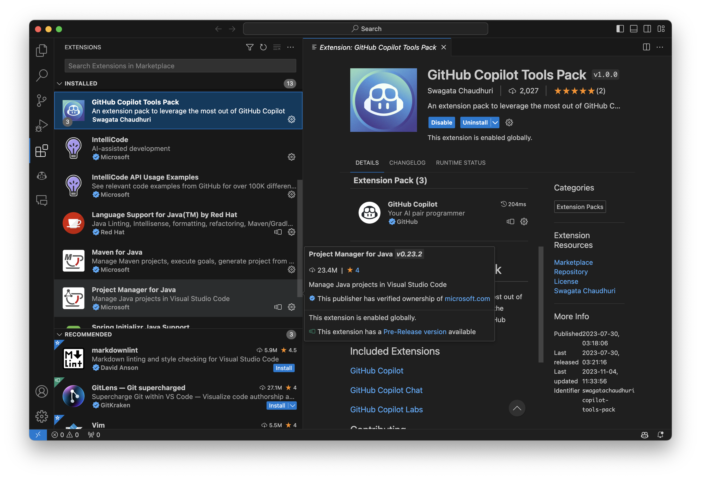

# Enhance Your Efficiency with GitHub Copilot: A Workshop

This workshop is designed to guide you on how to leverage GitHub Copilot with Java through a hands-on exercise - the creation of a new Spring Boot Application. 

GitHub Copilot is an AI-powered code assistant, aimed at helping developers write better code more efficiently. It uses machine learning models, trained on billions of lines of code, to suggest entire lines or even functions, based on the context of your current work. By utilizing GitHub Copilot, you can improve your coding skills and increase your productivity.

## Who Can Use GitHub Copilot?

GitHub Copilot can be accessed through an individual account for personal use, or an Organization account for business use.

GitHub Copilot is free for verified students, teachers, and maintainers of open-source projects. If you are not a student, teacher, or maintainer of an open-source project, you can try GitHub Copilot for free with a one-time 30-day trial. After the trial period, a paid subscription is required to continue using it.

## Capabilities of GitHub Copilot:

With GitHub Copilot, you can:

- `Generate Code Automatically`: GitHub Copilot can auto-generate the remaining code for you based on a part of your code.
- `Correct Code`: If there are errors in your code, GitHub Copilot can detect them and provide suggested corrections.
- `Predict Code`: GitHub Copilot can anticipate and predict the code you might enter next, even before you input any code.
- `Complete Code`: GitHub Copilot can offer code completion while you are entering your code.
- `Generate Comments Automatically`: GitHub Copilot can auto-generate subsequent comments when you input a comment.
- `Create Comment from Code`: GitHub Copilot can generate an explanation of the comments when you input a comment.

## Capabilities of GitHub Copilot Chat

With GitHub Copilot Chat, you can:

- `Create Unit Tests`: GitHub Copilot Chat can craft unit tests for your code.
- `Explain Code`: GitHub Copilot Chat can provide descriptions and explanations of your code.
- `Propose Code Correction`: If there are areas in your code that need improvement, GitHub Copilot Chat can suggest appropriate corrections.
- `Answer Coding-related Questions`: GitHub Copilot Chat can answer any questions you may have about coding.

<div class="warning" data-title="warning">

> Please note that GitHub Copilot is a rapidly evolving product, and this workshop may not be 100% up to date with the various features of the different extensions you are going to use. Please use your discretion."

</div>

---

# Environment Setup

To develop Java applications using GitHub Copilot, you need to have certain environments set up. If you haven't installed these environments yet, please do so as necessary.  

## Required Software and Tools

| Component                  | Download Location                                                                                                                                                                                                                                                                                 |
| -------------------------- | ------------------------------------------------------------------------------------------------------------------------------------------------------------------------------------------------------------------------------------------------------------------------------------------------- |
| Editor                     | [Visual Studio Code](https://code.visualstudio.com/download) <br> [IntelliJ IDEA](https://www.jetbrains.com/idea/promo/)                                                                                                                                                                          |
| VS Code for Java Extension | [Coding Pack for Java - Windows](https://aka.ms/vscode-java-installer-win) <br> [Coding Pack for Java - macOS](https://aka.ms/vscode-java-installer-mac)                                                                                                                                          |
| OpenJDK                    | [Microsoft Build OpenJDK 21](https://learn.microsoft.com/java/openjdk/download#openjdk-21)　<br> [Microsoft Build OpenJDK 17](https://learn.microsoft.com/java/openjdk/download#openjdk-17) <br> [Microsoft Build OpenJDK 11](https://learn.microsoft.com/ja-jp/java/openjdk/download#openjdk-11) |
| GitHub account             | [Create free GitHub account](https://github.com/join)                                                                                                                                                                                                                                             |
| GitHub Copilot Access      | A 60 day trial can be [requested here](https://github.com/github-copilot/signup)                                                                                                                                                                                                                  |
| A browser                  | [Download Microsoft Edge](https://www.microsoft.com/edge)                                                                                                                                                                                                                                         |


## Visual Studio Code Setup

### Install the Extension Pack for GitHub Copilot Tools Pack

If you have installed the `GitHub Copilot Tools Pack`, the following extensions will be installed:  

- GitHub Copilot
- GitHub Copilot Labs
- GitHub Copilot Chat



To install the GitHub Copilot Tools Pack Extension, follow these steps:  

1. Select `Extensions` from the VS Code menu.
2. Search for `GitHub Copilot Tools Pack` in the Marketplace
3. Choose `GitHub Copilot Tools Pack` and press the `Install` button. 
4. Once completed, a screen that says `Sign in to use GitHub Copilot` will appear. Press the `Sign in to GitHub` button.
5. Next, verify whether you are signed into your GitHub account. If you are not, log in.
6. Once logged in, a screen titled `Authenticate to authorized access` will appear. Choose the necessary organization and click the `Continue` button.
7. Go back to Visual Studio Code and press the `Sign in to GitHub` button to utilize the `GitHub Copilot Lab`.
8. Since you are already logged into GitHub, select the necessary organization and press the `Continue` button.

<video controls playsinline width="100%" autoplay loop muted="true" src="assets/vscode-github-copilot-setup.mp4" type="video/mp4" >
 Sorry, your browser doesn't support embedded videos.
</video>

## IntelliJ IDEA Setup

To install GitHub Copilot in the IntelliJ IDEA environment, follow the steps below.


1. From IntelliJ IDEA's `Settings`, select `Plugins`, search for `GitHub Copilot`, and press the `Install' button.
2. Once the plugin is installed, you will be prompted to restart. Press the `Restart IDE` button.  
3. Next, to use GitHub Copilot, sign in to GitHub with your GitHub account. Click the link, or select `Login to GitHub` from the GitHub Copilot Status Menu.  
4. Upon requesting to sign in, a window will appear displaying an 8-digit `Device code`. Please remember this code. Then, access https://github.com/login/device from your web browser.
5. Enter the 8-digit Device code generated in the previous step and press the `Continue` button.
6. Next, verify if you are logged in to GitHub with your own GitHub account, and if there are no issues, press the `Authorize GitHub Copilot Plugin` button.  
7. Return to the IntelliJ IDEA screen and confirm that you have successfully logged into GitHub and that GitHub Copilot is now available.  
8. Check the GitHub Copilot Status displayed at the bottom right of the IntelliJ IDEA screen. If it says `Status: Ready`, it is now available for use.  

<video controls playsinline width="100%" autoplay loop muted="true" src="assets/Jetbrains-Intellij-IDEA-setup.mp4" type="video/mp4" >
 Sorry, your browser doesn't support embedded videos.
</video>

## Avoid Using Publicly Published Code

If you set up a Copilot Business subscription for your organization, you can configure GitHub Copilot settings for your organization.  

For instance, if you're coding in a corporate environment, you might not want to use publicly available code due to enterprise rules or code licensing. In such cases, you can configure GitHub Copilot Chat to avoid using publicly published code.  

To do this, you need to set up a [Settings Copilot](https://github.com/settings/copilot) for your organization.  


Once these settings are in place, GitHub Copilot Chat will not use public code. If GitHub Copilot Chat attempts to use public code after entering a prompt, it will display a message and stop processing.  


---

# Creating a New Sample Spring Boot Application

In this section, we will create a sample Java project for testing GitHub Copilot in subsequent chapters. If you already have an existing Java project, feel free to skip this chapter and use your own project instead.  
  
## Creating a Spring Boot Application

```bash
> mkdir sample; cd sample
> curl https://start.spring.io/starter.zip \
           -d dependencies=web,devtools \
           -d bootVersion=3.3.0 \
           -d type=maven-project \
           -d applicationName=CopilotSample \
           -d packageName=com.microsoft.sample \
           -d groupId=com.microsoft.sample \
           -d artifactId=CopilotSample \
           -d javaVersion=21 (or 17) \ 
           -o my-project.zip
> unzip my-project.zip
```

After unzipping the file, you will see the following directory structure:  

```bash
.
├── HELP.md
├── mvnw
├── mvnw.cmd
├── my-project.zip
├── pom.xml
├── src
│   ├── main
│   │   ├── java
│   │   │   └── com
│   │   │       └── microsoft
│   │   │           └── sample
│   │   │               └── CopilotSample.java
│   │   └── resources
│   │       ├── application.properties
│   │       ├── static
│   │       └── templates
│   └── test
│       └── java
│           └── com
│               └── microsoft
│                   └── sample
│                       └── CopilotSampleTests.java
└── target
    ├── classes
    │   ├── application.properties
    │   └── com
    │       └── microsoft
    │           └── sample
    │               └── CopilotSample.class
    └── test-classes
        └── com
            └── microsoft
                └── sample
                    └── CopilotSampleTests.class
```

## Opening the Project in VS Code

Now that the project has been created, it's time to open it in VS Code.  
Enter the command 'code .'

```bash
code .
```

Upon opening the project in VS Code, the screen below will appear. Here, click on `Yes, I trust the authors`.  


Opening Spring Boot App on VS Code  

## Creating a Hello World REST Controller

Next, we will create a REST Controller. Right-click on the `src/main/java/com/microsoft/sample` folder and select `New File`. 
Then, type `HelloRestController.java` and press the Enter key. The following screen will appear.  


---

# Github Copilot for Java Development

## 4.1 Checking if GitHub Copilot is Activated

The `GitHub Copilot Status Menu` icon is located at the bottom right of VS Code.  


By clicking on this icon, you can check the status of GitHub Copilot. 
If it displays `Status: Ready` as shown below, GitHub Copilot is ready for use.  


If it does not display `Ready`, please return to the [Install Environment](/workshop/github-copilot-java/?step=1#install-extension-pack-for-github-copilot-tools-pack) section and set up your environment.  

## 4.2 Basic Operations of GitHub Copilot

Here is a basic guide on how to use GitHub Copilot. It's not just about enabling the features of GitHub Copilot. By executing shortcut commands during program implementation, or changing the content of your comments, you can modify the suggested code. So, please try out these basic operations of GitHub Copilot yourself.  

### 4.2.1 Code Suggestions and Explicit Triggers

Please open the `HelloRestController.java` file that you created in the previous chapter in your editor. There, by pressing the `Tab` key or entering a newline character, GitHub Copilot will start to suggest code for you.  


Alternatively, you can explicitly trigger it. If code suggestions are not being made, please enter the following shortcut key. This will execute the `editor.action.inlineSuggest.trigger` command and display the code that GitHub Copilot recommends.  

| OS      | Trigger Inline Suggestion |
| ------- | ------------------------- |
| macOS   | `Option (⌥) or Alt + \`   |
| Windows | `Alt + \`                 |

<div class="warning" data-title="warning">

> GitHub Copilot generates code predictions based on the environment it is being used in, so the content displayed may vary depending on the environment.

</div>

### 4.2.2 Accepting Code Suggestions

When a code suggestion is displayed, you can confirm it by pressing the `Tab` key.

If you do not want to accept all the suggestions that Copilot displays and only wish to adopt parts of it, you can do so by pressing the `Command(Ctrl) + Right Arrow` key instead of the `Tab` key. This allows you to adopt suggestions word by word.

| OS      | Determin the proposal   |
| ------- | ----------------------- |
| macOS   | `Command + right arrow` |
| Windows | `Ctrl + right arrow`    |

### 4.2.3 Displaying Alternate Suggestions (Functionality may slightly vary depending on the environment)

There may be instances where the source code suggestions given by GitHub Copilot do not match the code you want to implement. In such cases, you can also display alternative suggestions for the initial code displayed. To show alternate suggestions, please press the following shortcut key.  

| OS      | See next suggestion     | See previous suggestion |
| ------- | ----------------------- | ----------------------- |
| macOS   | `Option (⌥) or Alt + ]` | `Option (⌥) or Alt + [` |
| Windows | `Alt + \`               | `Alt + [`               |

When you press the shortcut key, it will be displayed as follows.


If you press the shortcut key again, a different code will be output from the one above.


### 4.2.4 Displaying List of Alternate Suggestions (Functionality may slightly vary depending on the environment)

Furthermore, if you are using Visual Studio Code, pressing the following shortcut key will display up to 10 alternative suggestions.  

| OS             | Next 10 suggestion |
| -------------- | ------------------ |
| macOS, Windows | `Ctrl + Enter`     |


As shown above, not only by simply enabling the GitHub Copilot feature, but also by executing shortcut commands during program implementation, you can display and apply a list of alternative candidates. By all means, please learn the basic operations of GitHub Copilot and give it a try.  

## 4.3 Using GitHub Copilot in Java Application Development

### 4.3.1 Points where GitHub Copilot can be used during Java application development

You can use GitHub Copilot in various scenarios during the development of Java applications.

- Creating source code
- Creating Markdown/HTML documents
- Editing Java property files

#### Creating Source Code  

As demonstrated in the basic operations above, GitHub Copilot provides various hints during the implementation of source code. If you use Visual Studio Code, you can further enhance your development productivity by utilizing GitHub Copilot Chat.  

#### Creating Markdown/HTML Documents

When creating documents for your project, you'll likely write them in Markdown. GitHub Copilot can also assist in creating Markdown documents. Open a Markdown file, click on the GitHub Copilot Status Menu icon, and select `Enable Completion for markdown`.


Once enabled, it will provide various hints while you're writing your Markdown document. 
For example, if you input `#`, it will prompt you to enter a string following the `#`, and it can even predict what to write next based on the context of your document.  


You can also use GitHub Copilot when writing HTML documents.  

#### Editing Java Property Files  

Additionally, GitHub Copilot can be used when editing Java property files. Properties are set according to the libraries you use, but it can be challenging to remember all the properties. In such cases, when you enter the property keyword, GitHub Copilot will display possible property candidates for you.  


## Using GitHub Copilot in Java Source Code Implementation

Let's look at a few specific ways to utilize GitHub Copilot when editing Java source code.  

### 4.4.1 Creating Sample Dummy Data  

When implementing a program, you may need to create sample data and test it locally. 
In such cases, GitHub Copilot can help you create sample data easily. For example, if you want to create sample data for stock ticker symbols, GitHub Copilot can generate a list of sample stock symbols for you.  

```text
// Create 20 sample data of Stock Tickers in List<String>  
```

The list of stock symbols created by GitHub Copilot looks like the following.


Similarly, if you want to create sample data for male names, GitHub Copilot can generate a list of sample male names for you.  

```text
// Create 20 sample data of American men's names in List<String>  
```

The list of name of male by GitHub Copilot looks like the following.


### 4.4.2 Implementing Check Methods and Utility Methods  

Furthermore, GitHub Copilot can be used in various places during the implementation of a Java program. For example, you might implement check methods or utility methods in Java. In such cases, by writing comments, GitHub Copilot will propose the code for you.  

#### Checking the Format of Email Addresses 

For instance, when implementing a method to determine whether the format of an email address is correct, you would write a comment as shown below.  

```text
/**
 * Determine whether the string specified as an argument is  
 * in the format of a valid email address
 *
 * @param email
 * @return true if the string is a valid email address, false otherwise
*/
```

The actual outputted code looks like the following.  


The above regular expression `^[\\w-\\.]+@([\\w-]+\\.)+[\\w-]{2,4}$` is used to validate the format of a typical email address. However, it does not cover some specific cases:  

1. The last part of the domain name (TLD, Top Level Domain) is limited to a range of 2 to 4 characters. However, nowadays there are TLDs with more than 4 characters, such as .info, .museum.  
2. The username part does not allow special characters (for example + or =). However, these characters are allowed in some email systems.  

Validating a complete email address is very complex, and regular expressions according to RFC 5322 can be very long and complex. However, for common cases, you can use the simplified regular expression below. If you modify the following code, it allows any alphabetic character of 2 or more characters (e.g. .museum). Also, dot (.) notation is allowed in the username part.  

```java
String emailRegex = "^[\\w-]+(\\.[\\w-]+)*@[\\w-]+(\\.[\\w-]+)*(\\.[a-zA-Z]{2,})$";
Pattern pat = Pattern.compile(emailRegex);
return email != null && pat.matcher(email).matches();
```

<div class="warning" data-title="warning">

> The code proposed by GitHub Copilot is not always correct. The output code may need to be modified. Please understand the output code and make corrections as necessary.  

</div>

#### Leap Year Determination Check  

Next, we will implement a method for checking leap year determination. Please write a comment as shown below:  

```text
/**
 * Determine whether the specified year in the argument is a leap year
 *
 * @param year
 * @return true if the year is a leap year, false otherwise  
*/
```

When you write a comment, the code will be output as shown below.


Of course, with the above code, you can determine a `leap year`, but by using the switch expression added in Java 14, you can implement it more concisely. To write using the switch expression added in Java 14, modify the comment as shown below.  

```text
/**
* Determine whether the year specified by the argument is a leap year  
* The implementation will use the switch expression introduced in Java 14  
*
* @param year
* @return true if the string is leap year, false otherwise
*/
```


<div class="info" data-title="info">

> The code output will change depending on the comments you write. In some cases, code using older Java language specifications or old libraries may be used. In such cases, by specifically instructing the code you want to write, it will be output as instructed.  

</div>

#### Display Files and Directories Under the Specified Directory  

Next, we will implement a method to display the files and directories that exist under the directory specified in the argument. Write a comment as shown below:  

```text
//Show all files and directories recursively under the directory specified by the argument  
 ```

Then, a code like the one below will be suggested.


The above code will work without any problems, but using Java NIO.2 or Stream API allows for a more concise description. To write according to the new language specification, let's modify the comments. Write a comment as shown below.  

```text
/**
 * In accordance with the Java 17 language specifications, 
 * using features like NIO.2, Stream API, Files.walk,
 * to recursively show the files and directories 
 * that exist under the specified directory.  
 *
 * @param directoryName
 */
````

As a result, a modern code like the one below has been output.  


<div class="info" data-title="info">

> Just like the Leap Year calculation mentioned above, rewriting the comments will prompt it to suggest code using new language specifications or new libraries.

</div>

---

# Github Copilot Chat for Java Development

<div class="info" data-title="info">

> Currently, GitHub Copilot Chat does not offer a plugin for IntelliJ IDEA. In this guide, we will demonstrate how to use GitHub Copilot Chat with Visual Studio Code.  
</div>

## 5.1 About GitHub Copilot Chat  

Similar to GitHub Copilot, GitHub Copilot Chat provides AI-powered code completion. However, it goes beyond code completion by answering questions about code, offering explanations, and suggesting code modifications, thereby enhancing code quality.  

Here are some scenarios where GitHub Copilot Chat can be applied in Java application development:  

- Code generation
- Code explanation
- Code correction
- Answering coding-related questions
- Creating unit tests
- Explaining the error
- Fixing the error

##　5.2 How to Use GitHub Copilot Chat

GitHub Copilot can be used in two ways:  

* Through the dedicated GitHub Copilot chat window  
* Inline on the editor  

### 5.2.1 Using the dedicated GitHub Copilot chat window  

Click on the GitHub Copilot icon in the lower left of VS Code to display the GitHub Copilot chat window.  

#### Slash Commands

To help Copilot provide more relevant answers, you can specify a topic for your questions using `slash commands`. Prepend your chat inputs with a specific topic name to guide Copilot towards a more relevant response. When you start typing `/`, a list of possible topics will appear:  

- **/api**: Ask about VS Code extension development.  
- **/explain**: Request a step-by-step explanation of the selected code.  
- **/fix**: Propose a fix for bugs in the selected code.  
- **/new**: Scaffold code for a new workspace. (e.g., /new spring boot)  
- **/newNotebook**: Create a new Jupyter Notebook. (Not available for Java)  
- **/terminal**: Ask how to perform tasks in the terminal.  
- **/tests**: Generate unit tests for the selected code.  
- **/vscode**: Ask about VS Code commands and settings.  
- **/help**: Get general help about GitHub Copilot.  
- **/clear**: Clear the session.

#### Chat View

The chat view offers a full chat experience, integrating seamlessly with your IDE. Once the view is open, you can start chatting with Copilot as your personal code coach. It keeps a history of the conversation and provides suggestions for questions along the way. You can:  

- Ask general questions about coding in any language or best practices  
- Request code generation or fixes related to the current file and inject the code directly into the file  


### 5.2.2 Using GitHub Copilot Chat Inline on the Editor

By pressing `Command + i` (or `Ctrl + Shift + i`) on the editor, an inline command window for Copilot Chat will appear within the editor.  
   
In inline mode, you can:  
   
- Request code explanations: This helps you understand what the code does and how it works.  
- Generate test code: This confirms that the code is working as expected.  
- Request code modifications: If there's a problem with the selected code, you can request a modification.  
- Generate new code: You can generate code for new features, classes, functions, etc.  

These requests are based on the selected code or the cursor's position. Also, these requests can be made by starting an inline chat session.  


Additionally, typing `/` will display the commands that can be executed in GitHub Copilot Chat.  


## 5.3 Code generation

GitHub Copilot Chat can generate code for you.

### 5.3.1 Create CRUD Operation for Spring Boot Application  

When creating a web application, you might need to create an application that performs CRUD operations. This requires implementing the web frontend, backend processing, and configuring property files. In such cases, if you enter a comment like the one below into GitHub Copilot Chat, it will suggest an implementation for a CRUD application.  

```text
> Create a sample application that performs CRUD operations to manage  
  people (name, id, e-mail, address) in Spring Boot.  
  The data should be persisted to the DB, and the database operations  
  should be implemented in Spring Data JPA.  
  The front should be implemented in Thymeleaf.  
  Please show all implementation of classes and methods and  
  application property configuration file.  
```

Then, the code suggested by GitHub Copilot will be displayed.  

<video controls playsinline width="100%" autoplay loop muted="true" src="assets/github-copilot-code-generation.mp4" type="video/mp4" >
 Sorry, your browser doesn't support embedded videos.
</video>

### 5.3.2 Create a new Server-Sent Events endpoint with Spring Boot

While implementing, you may sometimes forget how to implement a method in Java. In such cases, you can ask to generate code by specifying the implementation method using a particular technology. For example, if you forget how to implement using Server-Sent Events in Spring Boot, enter a comment like the one below in GitHub Copilot Chat.  

```text
> Create sample code that periodically sends back data in a Server-Sent Events  
  to a user who connects to the Spring Boot REST endpoint. 
```

If you write a comment like this, explanations and code will be generated.  


And it also shows the sample Java code.  


## 5.4 Code Explanation

Next, to understand the contents of the Java source code currently open in VS Code, you can get an explanation of the source code. GitHub Copilot Chat has prearranged commands for elucidating source code. Therefore, you can display the explanations by using these commands. First, input `/` in the console of GitHub Copilot Chat. Then, the commands that are available in GitHub Copilot Chat will appear.  


At this point, select `/explain`. It will appear as shown. Press the enter key to proceed.  


For example, select the following Java source code and execute the command.


Then, an explanation of the Java source code will be provided.  


### 5.5 Code Correction

GitHub Copilot can be used for code modification. For example, in a Java application that was implemented in the past, if there is code that was implemented with an old language specification version, you can modify that code to match the latest language specifications.  


For example, enter content like the following into the GitHub Copilot Chat prompt.  

```test
> Follow the latest Java 17 language specification and modify your code  
  to use NIO.2 or the Stream API. Use var to define variables  
```

Then, it will suggest Java code that conforms to the latest language specifications.


When you move the mouse cursor to the top of the window with the suggested code, a menu will appear.  


You can perform the following actions:  

- `Copy` : Copy the code to the clipboard  
- `Insert at Cursor [^Enter]` : Insert the code at the cursor position  
- `Insert into New File` : Insert the code into a new file  
- `Run in Terminal` :  Execute the code (This function cannot be used in Java as you cannot directly execute the code)  

By performing the above `Copy` and Paste or `Insert at Cursor [^Enter]`, you can modify the old Java code to be compliant with the latest language specifications.  

## 5.6 Answering Coding-Related Questions

Using GitHub Copilot Chat, you can get answers to questions about Java implementation.  

- Questions about the language specifications of the programming language  
- Questions about the Java runtime environment  
- Questions about library migration  
- Questions about how to use a specific library  

### 5.6.1 Questions about the language specifications of the programming language

When you are programming in Java, there may be times when you want to know more about the language specifications of Java. In such cases, you can ask various questions to GitHub Copilot Chat.  

For example, if you want to know about the language specifications of Java 17, you can ask as follows:  

If you want to know about the language specifications added from Java 11 to Java 17, you can ask as follows.  

```text
> What language specifications have been added from  
  Java 11 to Java 17? In particular,  
  please provide detailed information about the new writing style  
  with sample code.  
```

### 5.6.2 Questions about the Java runtime environment

There may be times when you want to understand points of caution in development environments, runtime environments, and production environments.   
In such cases, you can also ask questions about points that should be noted.  

```text
> Please explain the differences in Java VM startup options 
  and VM behavior between Java 11 and 17.
```

### 5.6.3 Questions about library migration

Application development is not only about new development, but also about modernizing source code and migrating from other old frameworks. In such cases, you can inquire about points to note in modernization and specific procedures for migration.  

```text
> What should I keep in mind when migrating from a 2.7.x  
  project to 3.1.5 with Spring Boot?
```

###　5.6.4 Questions about how to use a specific library

Also, when using a specific library for the first time, you may want to know how to use that library. In such cases, you can ask about how to use the library.  

```text
> Please explain the implementation code for asynchronous  
  processing using Mono and Flux of Project Reactor  
  in an easy-to-understand manner with sample code.
```

### 5.6.5 Points to Note about GitHub Copilot Chat Questions and Answers

One thing to note when using GitHub Copilot Chat is that not all inquiries will return the correct answer. For example, in the author's environment, the following inquiry did not return the correct answer.  

```text
> Please explain the details of JEP 450
```

As a result of the inquiry, the following result was returned.  


However, the actual JEP 450 is [JEP 450: Compact Object Headers (Experimental)](https://openjdk.org/jeps/450), and it is not a JEP related to Unicode 14 as mentioned above.  


The proposed contents by GitHub Copilot Chat are not always correct. Please understand the proposed contents and make corrections as necessary.

### 5.6.6 Other Inquiry Examples

In Java development, you can make various inquiries to GitHub Copilot Chat. Here are some examples of inquiries, so please give them a try.  

```text
> Please tell me more about   
  JEP 394: Pattern Matching for instanceof,   
  including detailed sample code.  
   
> What does Erasure mean in Java Generics? Please explain in detail.  
   
> Please tell me the most recommended way to concatenate strings   
  in Java 17. Also, please explain the differences between   
  StringBuffer, StringBuilder, and + in an easy-to-understand manner.  
   
> Please tell me 10 recommended Extensions that are useful   
  when developing Java applications in VS Code.  
   
> Please tell me about the differences in Java VM startup options   
  and VM behavior between Java 11 and 17.  
   
> Please tell me how to enable remote debugging for Java   
  in a container environment.  
   
> Please explain in detail how to create a custom JRE   
  using the jdeps and jlink commands.  
   
> Please tell me 10 items to check before running a Java application   
  in a production environment.  
   
> What should I keep in mind when migrating from a 2.7.x project to   
  3.1.5 with Spring Boot?  
   
> I have a Java Web Application implemented with the Facade pattern   
  in Struts 1.x. Please tell me the specific procedures and   
  configuration methods to migrate this to Spring Boot 3.1.x,   
  including sample code.  
   
> Please tell me the points to be aware of when migrating a   
  Spring Boot application to a Quarkus application,   
  and the specific migration method.  
   
> Please explain the implementation code for asynchronous  
  processing using Mono and Flux of Project Reactor  
  in an easy-to-understand manner with sample code.  
```

## 5.7 Creating Unit Tests

GitHub Copilot Chat can also generate unit tests for you.  

### 5.7.1 Create a Unit Test for Spring Boot Application

When implementing a Spring Boot application, you may want to create a unit test for the application.  
In such cases, you can select the class or method you want to test and ask GitHub Copilot Chat to create a unit test for you.  
For example, if you want to create a unit test for the `ProductController` class, you can select the code and ask GitHub Copilot Chat to create a unit test for you.  


After selecting the code, type `/tests` and press `Enter` in GitHub Copilot Chat.  


Then, an explanation and the Unit Test code will be generated.  


## 5.8 Explaining Errors and Fixing Them  

In Java application development, there may be times when errors occur at compile time or runtime. In such cases, you can ask GitHub Copilot Chat about the content of the error, and it will explain the error to you.  

For example, when running a Java application, an exception may occur, and at first glance, the content of the error may be hard to understand. However, by asking GitHub Copilot Chat about the error, it will explain the content of the error to you.  

```text
> When running the application, the following exception was output.   
  What does the following mean?  

### Exception
Copy & Paste the Java Stack Trace
###
```

Furthermore, you can even inquire about how to deal with the problem that occurred.  

```text
> How can I solve the above issues?  
 
> Can you propose a fix?  

> To solve the issue, please let me know   
  how to implement *** with sample code.  
```

When you inquire about an actual exception that occurred and ask for how to deal with it, you will receive an answer as shown below.  

<video controls playsinline width="100%" autoplay loop muted="true" src="assets/GitHub-Copilot-Chat-fix-error.mp4" type="video/mp4" >
 Sorry, your browser doesn't support embedded videos.
</video>

In addition to using it to solve actual problems as shown above, you can also use it to find potential bugs or improve the quality of your code by asking about the following contents.  

```text
> Can you check this code for potential bugs or security issues?  

> Do you see any quality improvement to do on this code?  
```

## 5.9 Conclusion

GitHub Copilot Chat is a versatile tool in Java application development. By using GitHub Copilot Chat, you can improve your productivity and code quality. Give it a try.  

