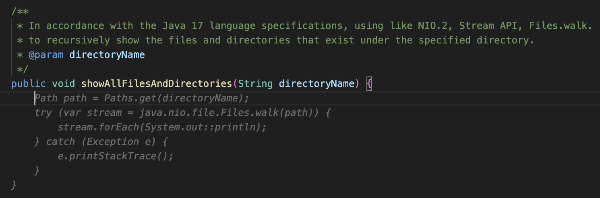

# Activate GitHub Copilot to become more efficient

This workshop aims to teach you how to utilize GitHub Copilot with Java through a practical exercise - creating a new Spring Boot Application. In the second segment, you'll discover how to use it not only for infrastructure coding but also for correcting sub-optimal security practices.

GitHub Copilot is a code assistant, powered by artificial intelligence, designed to assist developers in writing superior code more efficiently. It employs machine learning models that have been trained with billions of lines of code, to suggest whole lines or even entire functions, based on the context of your current work. By using GitHub Copilot, you can enhance your coding skills and boost your productivity.

## Who can use the GitHub Copilot 

GitHub Copilot can be managed through an individual account for personal use, or an Organization account for GitHub Copilot for Business.

GitHub Copilot is free for verified students, teachers, and maintainers of general open-source projects. If you are not a student, teacher, or maintainer of a popular open-source project, you can try GitHub Copilot for free with a one-time 30-day trial. After the free trial, a paid subscription is necessary to continue using it. 

## Things you can do with GitHub Copilot:

With GitHub Copilot, you can perform the following tasks:

* `Automatic Code Generation`: Upon entering a part of your code, GitHub Copilot diligently auto-generates the remaining code for you.
* `Code Correction`: If there are any errors in your code, GitHub Copilot detects them and kindly provides suggested corrections.
* `Code Prediction`: Even before you input any code, GitHub Copilot anticipates and predicts the code you might enter next.
* `Code Completion`: While you are entering your code, GitHub Copilot graciously offers code completion.
* `Automatic Comment Generation`: When you input a comment, GitHub Copilot courteously auto-generates subsequent comments for you.
* `Create Comment from Code`: Upon entering a comment, GitHub Copilot dutifully generates an explanation of the comments for you.

## Things you can do with GitHub Copilot Chat:

With GitHub Copilot Chat, you can perform the following tasks:

* `Creation of Unit Tests`: GitHub Copilot Chat is capable of diligently crafting unit tests for your code.
* `Explanation of Code`: GitHub Copilot Chat graciously provides descriptions and explanations of your code.
* `Proposal for Code Correction`: If there are any areas in your code that need improvement, GitHub Copilot Chat kindly suggests appropriate corrections.
* `Answering Coding-related Questions`: GitHub Copilot Chat is always ready to courteously answer any questions you may have about coding.

<div class="warning" data-title="warning">

> GitHub Copilot is a quickly evolving product and thus this workshop may not be 100% up to date with the differentes features of the different extensions you are going to use. Please be clever.

</div>

---

# Install Environment

In order to develop Java applications using GitHub Copilot, the following environments are required. If these environments are not installed, please install them as needed.

## Pre-Requisites Software and Tools

| Component | Download Location |
|----------------|-----------------|
| Editor | [Visual Studio Code](https://code.visualstudio.com/download) <br> [IntelliJ IDEA](https://www.jetbrains.com/idea/promo/)|
| VS Code for Java Extension | [Coding Pack for Java - Windows](https://aka.ms/vscode-java-installer-win) <br> [Coding Pack for Java - macOS](https://aka.ms/vscode-java-installer-mac) |
| OpenJDK | [Microsoft Build OpenJDK 21](https://learn.microsoft.com/java/openjdk/download#openjdk-21)　<br>  [Microsoft Build OpenJDK 17](https://learn.microsoft.com/java/openjdk/download#openjdk-17) <br> [Microsoft Build OpenJDK 11](https://learn.microsoft.com/ja-jp/java/openjdk/download#openjdk-11)|
| GitHub account | [Create free GitHub account](https://github.com/join) |
| GitHub Copilot Access | A 60 day trial can be [requested here](https://github.com/github-copilot/signup) |
| A browser      | [Download Microsoft Edge](https://www.microsoft.com/edge) |

<div class="warning" data-title="Important">

> You also have to download some assets. These can be [downloaded here](assets/src/exercisefiles.zip).

</div>

## Visual Studio Code Setup

### Install Extension Pack for GitHub Copilot Tools Pack

If you installed the Extension Pack for `GitHub Copilot Tools Pack`, you will install the following extensions:

* GitHub Copilot
* GitHub Copilot Labs
* GitHub Copilot Chat


1. Select `Extensions` from the VS Code menu.
2. Search for `GitHub Copilot Tools Pack` in the `Search Extension in Marketplace`.
3. Choose `GitHub Copilot Tools Pack` and press the `Install` button.
4. Once completed, a screen that says `Sign in to use GitHub Copilot` will appear. Press the `Sign in to GitHub` button.
5. Next, verify whether you are signed into your GitHub account. If you are not, log in.
6. Once logged in, a screen titled `Authenticate to authorized access` will appear. Choose the necessary organization and click the `Continue` button.
7. Go back to Visual Studio Code and press the `Sign in to GitHub` button to utilize the `GitHub Copilot Lab`.
8. Since you are already logged into GitHub, select the necessary organization and press the `Continue` button.


<video controls playsinline width="100%" autoplay loop muted="true" src="assets/vscode-github-copilot-setup.mp4" type="video/mp4" >
 Sorry, your browser doesn't support embedded videos.
</video>


## IntelliJ IDEA Setup

To install GitHub Copilot in the IntelliJ IDEA environment, follow the steps below.


1. From IntelliJ IDEA's `Settings`, select `Plugins`, search for `GitHub Copilot`, and press the `Install' button.
2. Once the plugin is installed, you will be asked to restart. Press the `Restart IDE` button to do so.
3. Next, to use GitHub Copilot, sign in to GitHub with your GitHub account. Please click the `Sign in to GitHub` link, or select `Login to GitHub` from the GitHub Copilot Status Menu.
4. Upon requesting to sign in, a window will appear displaying an 8-digit `Device code`. Please remember this code. Then, access https://github.com/login/device from your web browser.
5. Enter the 8-digit Device code generated in the previous step and press the `Continue` button.
6. Next, check if you are logged in to GitHub with your own GitHub account, and if there are no problems, press the `Authorize GitHub Copilot Plugin` button.
7. Return to the IntelliJ IDEA screen and confirm that you have successfully logged into GitHub and that GitHub Copilot is now available.
8. Check the GitHub Copilot Status displayed at the bottom right of the IntelliJ IDEA screen. If it says `Status: Ready`, it is now available for use.

<video controls playsinline width="100%" autoplay loop muted="true" src="assets/Jetbrains-Intellij-IDEA-setup.mp4" type="video/mp4" >
 Sorry, your browser doesn't support embedded videos.
</video>

---

# Create a new Sample Spring Boot Application

In this section, you will create a sample Java project to be used for testing GitHub Copilot in the following chapters. 
If you are using an existing Java project, feel free to skip this chapter and use your own Java project.

## Create a Spring Boot Application

```bash
> mkdir sample; cd sample
> curl https://start.spring.io/starter.zip \
           -d dependencies=web,devtools \
           -d bootVersion=3.1.5 \
           -d type=maven-project \
           -d applicationName=CopilotSample \
           -d packageName=com.microsoft.sample \
           -d groupId=com.microsoft.sample \
           -d artifactId=CopilotSample \
           -o my-project.zip
> unzip my-project.zip 
```

Unzip the file and you will see the following structure:

```bash
.
├── HELP.md
├── mvnw
├── mvnw.cmd
├── my-project.zip
├── pom.xml
├── src
│   ├── main
│   │   ├── java
│   │   │   └── com
│   │   │       └── microsoft
│   │   │           └── sample
│   │   │               └── CopilotSample.java
│   │   └── resources
│   │       ├── application.properties
│   │       ├── static
│   │       └── templates
│   └── test
│       └── java
│           └── com
│               └── microsoft
│                   └── sample
│                       └── CopilotSampleTests.java
└── target
    ├── classes
    │   ├── application.properties
    │   └── com
    │       └── microsoft
    │           └── sample
    │               └── CopilotSample.class
    └── test-classes
        └── com
            └── microsoft
                └── sample
                    └── CopilotSampleTests.class
```

## Open the project in VS Code

Now that the project has been created, You will open it in VS Code.

```bash
code .
```

When you open the project in VS Code, the screen below will appear. Here, click on `Yes, I trust the authors`.


## Create Hello World REST Controller

Next, You will create a REST Controller. Right-click on the `src/main/java/com/microsoft/sample` folder and select `New File`. 
Then, type `HelloRestController.java` and press the Enter key. The following screen will appear.


---


## 4.1 Check if GitHub Copilot is Activated

The icon for the `GitHub Copilot Status Menu` is displayed at the bottom right of VS Code.


By clicking on this icon, you can check the status of GitHub Copilot. 
If it displays `Status: Ready` as shown below, GitHub Copilot is available for use.


If it does not display `Ready`, please go back to [Install Environment](/workshop/github-copilot-java/?step=1#install-extension-pack-for-github-copilot-tools-pack) and set up your environment."

## 4.2 Basic Operations of GitHub Copilot

Here is a basic guide on how to use GitHub Copilot. It is not just about turning on the features of GitHub Copilot. 
By executing the shortcut commands during program implementation, or changing the content of your comments, 
you can alter the code that is suggested. So, please try out these basic operations of GitHub Copilot yourself.

### 4.2.1 Code Suggestions and Explicit Triggers

Please open the `HelloRestController.java` file that You created in the previous chapter in your editor. 
There, by pressing the Tab key or entering a newline character, GitHub Copilot will start to suggest code for you.


Alternatively, you can explicitly trigger it. If code suggestions are not being made, please enter the following shortcut key. 
This will execute the `editor.action.inlineSuggest.trigger` command and display the code that GitHub Copilot recommends.

|OS| Trigger Inline Suggestion|
|--|--|
|macOS|`Option (⌥) or Alt + \`|
|Windows| `Alt + \`|

<div class="warning" data-title="warning">

> GitHub Copilot generates code predictions based on the environment it is being used in, so the content displayed may vary depending on the environment.

</div>

### 4.2.2 Decision of Code Suggestions

When a code suggestion is displayed, you can confirm it by pressing the `Tab` key.

If you do not want to accept all the suggestions that Copilot displays and only wish to adopt parts of it, 
you can do so by pressing the `Command(Ctrl) + Right Arrow` key instead of the `Tab` key. This allows you to adopt suggestions word by word.

|OS| Determin the proposal|
|--|--|
|macOS|`Command + right arrow`|
|Windows| `Ctrl + right arrow`|

### 4.2.3 Displaying Alternate Suggestions (Functionality may slightly vary depending on the environment)

There may be instances where the source code suggestions given by GitHub Copilot do not match the code you want to implement. 
In such cases, you can also display alternative suggestions for the initial code displayed. 
To show alternate suggestions, please press the following shortcut key.

|OS| See next suggestion| See previous suggestion|
|--|--|--|
|macOS|`Option (⌥) or Alt + ]`|`Option (⌥) or Alt + [`|
|Windows| `Alt + \`|`Alt + [`|

When you press the shortcut key, it will be displayed as follows.


If you press the shortcut key again, a different code will be output from the one above.


### 4.2.4 Displaying List of Alternate Suggestions (Functionality may slightly vary depending on the environment)

Furthermore, if you are using Visual Studio Code, pressing the following shortcut key will display up to 10 alternative suggestions.

|OS| Next 10 suggestion|
|--|--|
|macOS, Windows|`Ctrl + Enter`|


As shown above, not only by simply turning on the GitHub Copilot feature, but also by executing shortcut commands during program implementation, you can display and apply a list of alternative candidates. By all means, please learn the basic operations of GitHub Copilot and give it a try.

## 4.3 Using GitHub Copilot in Java Application Development

### 4.3.1 Points where You can be used during Java application development

You can use GitHub Copilot in various scenarios during the development of Java applications.

* Creating source code
* Creating Markdown/HTML documents
* Editing Java property files

#### Creating source code

As shown in the basic operations above, it provides various hints during the implementation of the source code. 
If you use Visual Studio Code, utilizing GitHub Copilot Chat, as mentioned later, will further enhance your development productivity.


#### Creating Markdown/HTML documents

When creating documents to use in your project, you will likely write these documents in Markdown. 
GitHub Copilot can also be used when creating Markdown documents. 
Open a Markdown file, click on the GitHub Copilot Status Menu icon, and select `Enable Completion for markdown`.


Once enabled, it will provide various hints while you are writing your Markdown document. 

For example, if you input '#', it will prompt you to enter a string following the '#', 
and it can even predict what to write next based on the context of the content in your document.


And you will also be able to use it when writing HTML documents.

#### Editing Java property files

Additionally, it can also be used when editing Java property files. 
Properties are set according to the libraries you use. However, it might be difficult to remember all the properties. 
In such cases, when you enter the property keyword, it will display a possible property candidates for you.


## 4.4 Using GitHub Copilot in Java Source Code Implementation

Let introduce a few specific ways to utilize GitHub Copilot when editing Java source code.

### 4.4.1 Creating Sample Dummy Data

When implementing a program, sometimes you may create sample data and test it locally. 
In such cases, you can easily create sample data. 
For example, if you want to create sample data for stock tickers symbols, by entering as shown below, 
it will create a list of sample stock symbols for you.

```text
// Create 20 sample data of Stock Tickers in List<String>
```

In fact, the list of stock symbols created by GitHub Copilot looks like the following.


Also, if you want to create sample data for male names, by entering as shown below, it will create a list of sample male names for you.

```text
// Create 20 sample data of American men's names in List<String>
```

In fact, the list of name of men by GitHub Copilot looks like the following.


### 4.4.2 Implementing Check Methods and Utility Methods

Furthermore, it can be used in various places during the implementation of a Java program. 
For example, you might implement check methods or utility methods in Java. 
In such cases, by writing comments, GitHub Copilot will propose the code for you.

#### Checking the Format of Email Addresses

For instance, when implementing a method to determine whether the format of an email address is correct, you would write a comment as shown below."

```text
/**
 * Determine whether the string specified as an argument is 
 * in the format of valid email address
 * 
 * @param email
 * @return true if the string is a valid email address, false otherwise
*/
```

The actual outputted code looks like the following


The above regular expression `^[\\w-\\.]+@([\\w-]+\\.)+[\\w-]{2,4}$` is used to validate the format of a typical email address. However, it does not cover some specific cases:

For example, 
1. The last part of the domain name (TLD, Top Level Domain) is limited to a range of 2 to 4 characters. However, nowadays there are TLDs with more than 4 characters, such as .info, .museum.
2. The username part does not allow special characters (for example + or =). However, these characters are allowed in some email systems.

Validating a complete email address is very complex, and regular expressions according to RFC 5322 can be very long and complex. However, for common cases you can use the simplified regular expression below.
If you modified to following code, it allows any alphabetic character of 2 or more characters (e.g. .museum). Also, dot (.) notation is allowed in the username part.

```java
String emailRegex = "^[\\w-]+(\\.[\\w-]+)*@[\\w-]+(\\.[\\w-]+)*(\\.[a-zA-Z]{2,})$";
Pattern pat = Pattern.compile(emailRegex);
return email != null && pat.matcher(email).matches();
```

<div class="warning" data-title="warning">

> The code proposed by GitHub Copilot is not always correct. The output code may need to be modified. Please understand the output code and make corrections as necessary.

</div>

#### Leap Year Determination Check

Next, to implement a method for checking leap year determination, write a comment as shown below."

```text
/**
 * Determine whether the year specified by the argument is a leap year
 * 
 * @param year
 * @return true if the string is leap year, false otherwise
*/
```

When you write a comment, the code will be output as shown below.


Of course, with the above code, you can determine a 'leap year', but by using the switch expression added in Java 14, 
you can implement it more concisely. To write using the switch expression added in Java 14, modify the comment as shown below.

```text
/**
* Determine whether the year specified by the argument is a leap year
* The implementation will use the switch expression introduced in Java 14
* 
* @param year
* @return true if the string is leap year, false otherwise
*/
```


<div class="info" data-title="info">

> The code output will be changed depending on the comments you write. In some cases, code using older Java language specifications or old libraries may be used. 
In such cases, by specifically instructing the code you want to write, it will be output as instructed.

</div>


#### Display files and directories that exist under the directory specified in the argument.

You will implement a method to display the files and directories that exist under the directory specified in the argument.
Write a comment as shown below

```text
//Show all files and directories recursively under the directory specified by the argument
```

Then, a code like the one below will be suggested.


The above code will work without any problems, but using Java NIO or Steam API allows for a more concise description. 
To write according to the new language specification, let's try to modify the comments. 
Write a comment as shown below.

```text

```text
/** 
 * In accordance with the Java 17 language specifications, 
 * using like NIO.2, Stream API, Files.walk.
 * to recursively show the files and directories 
 * that exist under the specified directory.
 *
 * @param directoryName
 */
```

As a result, a modern code like the one below has been output.




<div class="info" data-title="info">

> Just like the LeapYear calculation mentioned above, rewriting the comments will prompt it to suggest code using new language specifications or new libraries.

</div>


---

<div class="info" data-title="info">

> GitHub Copilot Chat は現時点で、まだベータ版です。そのため、GitHub Copilot Chat は、IntelliJ IDEA 用のプラグインは提供されていません。ここでは Vusual Studio Code を利用して、GitHub Copilot Chat を利用する方法を説明します。

</div>

## 5.1 GitHub Copilot Chat について

GitHub Copilot Chat は、GitHub Copilot と同じく、AI を利用したコード補完機能を提供します。GitHub Copilot Chat は、コード補完機能だけでなく、コードの説明や、コードの修正提案など、コードに関する質問にも答えてくれ、コードの品質向上のために利用できます。

##　　5.2 GitHub Copilot Chat の利用方法

 


## Start playing with GitHub Copilot

Once you start typing a prompt and copilot generate proposals, you can use the following shortcuts to interact with Copilot:


## Natural Language Translations

**Automate text translation**

- Open file `album-viewer/lang/translations.json`
```json
[
    {
        "language": "en",
        "values": {
            "main-title": "Welcome to the world of the future",
            "main-subtitle": "The future is now with copilot",
            "main-button": "Get started"
        }
    }
]
```

<br>

## Code Generation

**Generate code from prompt**

- Create a new `album-viewer/utils/validators.ts` file and start with the prompt:
```ts
// validate date from text input in french format and convert it to a date object
```

- Copilot can help you also to write `RegExp patterns`. Try these:
```ts
// function that validates the format of a GUID string

// function that validates the format of a IPV6 address string
```

<br>

**Discover new tool and library on the job with Copilot**

- Still on the same `album-viewer/utils/validators.ts` file add the following prompt:
```ts
// validate phone number from text input and extract the country code
```
<div class="info" data-title="info">

>For this one it will probably give you proposal that call some methods not defined here and needed to be defined. It's a good opportunity to explore the alternatives using the `ctrl+enter` shortcut to display the copilot pane. 
<br>You can choose one that uses something that looks like coming for an external library and use copilot to import it showing that the tool helps you discover new things.

</div>

**Complex algoritms generation**

- In the `albums-api/Controllers/AlbumController.cs` file try to complete the `GetByID` method by replace the current return:

```cs
// GET api/<AlbumController>/5
[HttpGet("{id}")]
public IActionResult Get(int id)
{
    //here
}
```

- In the same file you can show other prompts like:
```cs
// function that search album by name, artist or genre

// function that sort albums by name, artist or genre
```

## Big Prompts and Short Prompts

Copilot will probably will always more effective with prompt to generate small but precisely described pieces of code rather than a whole class with a unique multiple lines prompt.

<div class="tip" data-title="tip">

> The best strategy to generate big piece of code, is starting by the basic shell of your code with a simple prompt and then adding small pieces one by one.

</div>

**Big prompts that works**

- Back in the `albums-viewer/utils` add a new file `viz.ts` to create a function that generates a graphe. Here is a sample of prompt to do that:

```ts
// generate a plot with d3js of the selling price of the album by year
// x-axis are the month series and y-axis show the numbers of album selled
```
>You can try to add details when typing by adding it or following copilot's suggestions and see what happens

- Once you achieved to generate the code for the chart you probably see that your IDE warn you about the d3 object that is unknow. For that also Copilot helps.
Return on top of the file and start typing `import d3` to let copilot autocomplete

```ts
import d3 from "d3";
```

## Code Documentation 

Copilot can understand a natural language prompt and generate code and because it's just language to it, it can also `understand code and explain it in natural language` to help you document your code.

### Simple documentation comment

To see that just put you pointer on top of a Class, a method or any line of code and start typing the comment handler for the selected language to trigger copilot. In language like Java, C# or TS for example, just type `// `and let the magic happen.

Here is an example in the `albums-viewer/routes/index.js` file. Insert a line and start typing on line 13 inside the `try block`

```js
router.get("/", async function (req, res, next) {
  try {
    // Invoke the album-api via Dapr
    const url = `http://127.0.0.1:${DaprHttpPort}/v1.0/invoke/${AlbumService}/method/albums`;

```

Continue to play with it and see what happens on other pieces of code.

### Standardized documentation comment (JavaDoc, JsDoc, etc...)

For this one, to trigger the documentation comment generation, you need to respect the specific comment format:
-  `/**` (for JS/TS) in the `index.js` file for example
- `///` for C# in the `AlbumController.cs` of the AlbumApi file for example

```cs
/// <summary>
/// function that returns a single album by id
/// </summary>
/// <param name="id"></param>
/// <returns></returns>
[HttpGet("{id}")]
public IActionResult Get(int id)
```


## Tests

Copilot can help generate all kind of tests that are written with code. It Includes `unit tests, integration tests, end to end tests, and load testing` tests with jmeters scripts for example.

- Add a new file `validators.test.ts` in the `albums-viewer/tests` folder

- To have good test suggestion, you hould provide some basic informations to Copilot such as the test framework you want to use:

```ts
import { describe }
```

When you start typing the `describe` function, copilot will see you're in test file in TS and suggest you to import the `describe` and `it` functions from Mochai which is a famous test framework for JS/TS.
Accept the suggestion and it will automatically suggest also the `expect` function from Chai: accept it also.

```ts
import {describe, it} from 'mocha';
import {expect} from 'chai';
```

You have your test framework in place! Now just import the functions you want to test by starting a new line by `import` keyword copilot will see you are in a test file, to test some `validators` because of the name and it will suggest something like that:

```ts
import {validateAlbumId} from '../src/validators';
```

It looks ok but because Copilot doesn't have access to all your code, only the open tab and limited informations, you can see that both the path and the function name are wrong.
<br>
... At least he tried ... 
<br>
but it's a good way to show that Copilot is not magic and you have to use it with your other IDE feature and your brain :)

- Accept the suggestion and change the path. You will be able to have VS Code to give you the available function with the `ctrl+space` shortcut.

- Add a comment with the first function you want to test and let the magic happen:


```ts
import {describe, it} from 'mocha';
import {expect} from 'chai';

import {validateDate, validateIPV6} from '../utils/validators';

// test the validataDate function
```
Boom!
```ts	
describe('validateDate', () => {
    it('should return a date object when given a valid date string', () => {
        const date = '01/01/2019';
        const expectedDate = new Date(2019, 0, 1);
        expect(validateDate(date)).to.deep.equal(expectedDate);
    });

    it('should throw an error when given an invalid date string', () => {
        const date = '01/01/2019';
        expect(() => validateDate(date)).to.throw();
    });
});
```

*You can add other `it` block to add more test cases and also add the tests for the other functions. For example try add a new `it` block for the validateDate function to test that it throws and error when given en empty string.*


## Writing CI pipelines

*Copilot will help you in writing your pipeline definition files to generate the code for the different steps and tasks. Here are some examples of what it can do:*
- *generate a pipeline definition file `from scratch`*
- *accelerate the writing of a pipeline definition file by `generating the code` for the different `steps, tasks and pieces of script`*
- *help `discover marketplace tasks and extensions` that match your need*

### Step 1: generate from scratch

- Create a new file `pipeline.yml` in the `.github/workflow` folder of the project and start typing the following prompt:

```yml
# Github Action pipeline that runs on push to main branch
# Docker build and push the album-api image to ACR
```

*Copilot will generate the pipeline block by block. Generation pipelines Yaml, you will sometimes need to jump to a new line to trigger the generation of the next block more often than with other type of code.*

*It will often generate a task with a few errores coming from bad indentation or missing quote around a task name. You can easily fix these with your IDE and your developer skills :)*


### Step 2: add tasks from prompts

- You probably have a github action workflow with at least a "login" task to your container registry and a "docker build and deploy" task. Add a new comment after those tasks to tag the docker image with the github run id and push it to the registry:

```yml
# tag the image with the github run id and push to docker hub
```

- you can play with other prompts like:
```yml
# run tests on the album-api image

# deploy the album-api image to the dev AKS cluster
```

### Step 3: add scripts from prompts

- Copilot is also very usefull when you need to write custom script like the following example:

```yml
# find and replace the %%VERSION%% by the github action run id in every appmanifest.yml file
```

## Infra As Code

Copilot can also help you write Infrastructure as code. It can generate code for `Terraform, ARM, Bicep, Pulumi, etc...` and also `Kubernetes manifest files`.

### Bicep
- open the `main.bicep`file in `iac/bicep` folder and start typing prompts at the end of the file to add new resources:

```js
// Container Registry

// Azure Cognitive Services Custom Vision resource
```

### Terraform
- open the `app.tf`file in `iac/terraform` folder and start typing prompts at the end of the file to add new resources:

```yml
# Container Registry

# Azure Cognitive Services Custom Vision resource
```


## Writing documentation

Copilot can help you in all your documentation tasks. It can generate simple documentation comment or standardized documentation comment like JavaDoc, JsDoc, etc... it can also help you translate your documentation in different languages. Let's see how it works.

### simple documentation comment

To see that just put you pointer on top of a Class, a method or any line of code and start typing the comment handler for the selected language to trigger copilot. In language like Java, C# or TS for example, just type `// `and let the magic happen.

Here is an example in the `albums-viewer/routes/index.js` file. Insert a line and start typing on line 13 inside the `try block`

```js
router.get("/", async function (req, res, next) {
  try {
    // Invoke the album-api via Dapr
    const url = `http://127.0.0.1:${DaprHttpPort}/v1.0/invoke/${AlbumService}/method/albums`;

```

Continue to play with it and see what happens on other pieces of code.

### standardized documentation comment (JavaDoc, JsDoc, etc...)

For this one, to trigger the documentation comment generation, you need to respect the specific comment format:
-  `/**` (for JS/TS) in the `index.js` file for example
- `///` for C# in the `AlbumController.cs` of the AlbumApi file for example

```cs
/// <summary>
/// function that returns a single album by id
/// </summary>
/// <param name="id"></param>
/// <returns></returns>
[HttpGet("{id}")]
public IActionResult Get(int id)
```

### Writing markdown and html documentation

Copilot is also very powerfull to help you write documentation. It can generate `markdown` and `html` code and accelerate the writing of your readme.md files like for this one for example.

You can show that by creating a new file `demo.md` in the root of the project and start typing the following prompt:

```md
# Github Copilot documentation
This documentation is generated with Github Copilot to show what the tool can do.

##
```

From there by starting a new line with a secondary level title it will start generating the content of the documentation and it will showcase how it will accelerate the documentation writing process.


---

# Use Copilot Chat to improve code quality

GitHub Copilot is a generative AI and thus, perfect to generate code, but it has powerfull analysis capabilities on your code that can be used in several case to improve code quality like: find security issues, bad practices in your code and générate a fix, refactor and add comment to legacy code, generate tests, etc... 

If you already feel confortable with it you can jump to the next section.

## Get ready

To start using Github Copilot Chat, you first need to
- be enrolled in the public preview:  [Github Copilot Chat Preview](https://github.com/github-copilot/chat_waitlist_signup/join)
- install the extension in your IDE. For VS Code, you can find it directly by searching for `Github Copilot Chat` in the extensions tab.

### Clone the repository

We will use the same repository as the previous section to show how to use Copilot Chat to improve code quality. If you already have it, you can skip this step.

You need to clone the following GitHub Repository: [Github Copilot Demo](https://github.com/Philess/gh-copilot-demo)

This repository is a code starter that will help you experiment all capabilities with GitHub Copilot. Take the time to look at the architecture design displayed on the page and when you're ready, clone the repository from the command line and open it in VS Code.

``` bash
git clone https://github.com/Philess/gh-copilot-demo
cd gh-copilot-demo
code .
```

## Start playing with the Chat

Once Copilot Chat is setup, you can start using it:
- by accessing the **chat view** from the left toolbar of your IDE (chat icon)
- by pressing `Ctrl` + `Shift` + `i` shortcut for a quick **inline question** to the chat

The first one is a sticky version, very usefull to keep the chat open and ask questions to copilot. 
The second one is a quick way to ask a question and get an answer and launch commands.

### Chat View

The chat view gives you a full chat experience, integrate as any other tool view in your IDE. Once the view is open you can start chatting with Copilot as your personnal code coach. It keeps the history of the conversation and you can ask question related to the previoius answers. It also provides suggestions for questions along the way. You can:
- ask general question about coding on any language or best practice
- ask to generate or fix code related to the current file and inject the code directly in the file

It's a more high level copilot than the vanilla copilot which is specialized on providing code completion.

Try it with a few questions like:

```
> How to generate a random number in C#?
> What is the best way to secure a route is ASP.NET Core?
> What is the easiest way to generate a static website with NodeJS?
```

Try it then with some of your code files in the repository. Open a file a try asking:

```
> Can you explain me what this code does?
> (with only part of the code selected) Can you explain me what the selected code does?
> Can you generate a function that returns a random number between 1 and 10?
> Can you add documentation commentes to this function?
```

Try also using the questions suggestions that appears along the way.

### Inline question

The inline question is a quick way to ask a question to Copilot and get an answer. It's a good way to ask a question about a specific piece of code. It's also a good way to launch commands to Copilot. You can ask it to generate code, fix code, generate tests, etc...

try it by pressing `Ctrl` + `Shift` + `i` and type the same type of commands you tried in the chat view.

### Slash Commands

To further help Copilot give you more relevant answers, you can choose a topic for your questions through "slash commands."

You can prepend your chat inputs with a specific topic name to help Copilot give you a more relevant response. When you start typing /, you’ll see the list of possible topics:
- **/explain**: Explain step-by-step how the selected code works.
- **/fix**: Propose a fix for the bugs in the selected code.
- **/help**: Prints general help about GitHub Copilot.
- **/tests**: Generate unit tests for the selected code.
- **/vscode**: Questions about VS Code commands and settings.
- **/clear**: Clear the session.


## Secure your code

Copilot can help you find security issues in your code and fix them. It can also help you find bad practices in your code and fix them. Let's see how it works.

Open the `album-api/Controllers/UnsecuredController.cs` file and type questions like these to the chat:

```
> Can you check this code for security issues?
> Do you see any quality improvement to do on this code?
```

Once you have the answer, you can ask to fix the issues by typing:

```
> Can you propose a fix?
```

When you have the fix in the code you choose to **copy it or inject it directy in the file** by hovering the code block in the chat and selecting the right option on the top left.


## Code Explanation and documentation

You can use Copilot Chat to explain code to you. It can `explain you the code in natural language or generate documentation comments for you`. Let's try that with the following commands:

```
> /explain
> Generate documentation comments for this code
```


## Code Refactoring

More impressive, Copilot chat can help you refactor your code. It can help you `rename variables, extract methods, extract classes, etc...`. 

You can try some of these commands on the `album-api/Controllers/UnsecuredController.cs` file:

```
> extract methods
> create Async version of each methods when it makes sense
```

## Code Translation

*Copilot can understand and generate natural languages and code language in both way so by combining everything you can use it to `translate code pieces from a language to another one`*

To translate a piece of code in a specific language, open it and ask to the chat to translate it to another language. For example open the `validators.ts` file created in the first section dedicated to Copilot autocompletion and ask to translate it to C for example.

In case of dealing with Legacy code like COBOL for example it can be very useful. Open the `legacy/albums.cbl` file and try translating the code to Python.

## Tests generation

Copilot can also help you generate tests for your code. It can generate `unit tests, integration tests, end to end tests, and load testing` tests with jmeters scripts for example. 

Open the `album-api/Controllers/UnsecuredController.cs` file and type questions like these to the chat:

```
> Generate a unit tests class for this code
```

You can also use copilot to help you generate Stubs and Mocks for your tests.
```
> Generate a mock for FileStream class
> Use that mock in the unit tests
```

<div class="info" data-title="note">

> Remember that Copilot chat is keeping track of the previous Q & A in the conversation, that's why you can reference the previously generated mock and test easily. 

</div>

---

# Develop a NodeJS server

In this first exercise, you are going to develop a real project following functional requirements. You can do it by yourself or...with the help of GitHub Copilot.

## Instructions

- Download to local the [exercicefile](assets/src/exercisefiles.zip) folder
- Open `NodeServer.js` and begin by writing a Nodejs server, check the first suggestions based on the initial text
- Open `test.js` file and analyze the current test
- Open a command prompt and run the test (`mocha test.js`)
- See the result, it should display something like:

``` bash
mocha test.js
server is listening on port 3000

  Node Server
    
    √ should return "key not passed" if key is not passed

  1 passing (34ms)

```

- In the `NodeServer.js` develop the rest of the methods described in the Exercise described in the section below
  
> Do not forget to open `color.json` file in Visual Studio Code, so GitHub Copilot get all the context to make better recommendations

- In the Test.js file add the methods to test the functionality
- Run the tests to verify that all is working
- Open the `dockerfile` file, and fill it, to create a docker container with a node image that can run the web server
- Create a command to run docker in port 4000
- Test that the application is working in port 4000
- In the **nodeserver.js** file, you can type a new line like `//run a curl command to test the server` so we can see how GitHub Copilot based on the current file produces a curl command, to be executed in the command line.
- Note: you can be more specific like `//run a curl command to test the daysBetweenDates` method. It should generate a test for a specific method

## Exercise

You must now develop and add new features to your server. The requests that the server must attend are the following:

<div class="tip" data-title="tip">

> As you type GitHub Copilot will make suggestions, you can accept them by pressing Tab. If nothing shows up after GitHub Copilot write some lines, press enter and wait a couple of seconds. On Windows or Linux, press Ctrl + Enter, then click Open GitHub Copilot.

</div>

<div class="info" data-title="note">

> There are a lot of code to write but you may be surprised by the time it will take to you to complete it. You can also only write 7 or 8 of them if you want, the exercise is not meant to be boring.

</div>

| Method | Requirements|
|---|---|
|**/Get**|Return a hello world message|
|**/DaysBetweenDates**|Calculate days between two dates. <br/>Receive by query string 2 parameters date1 and date 2 , and calcualte the days that are between those two dates.|
|**/Validatephonenumber**|Receive by querystring a parameter called `phoneNumber`. <br/>Validate `phoneNumber` with Spanish format, for example +34666777888<br/>if `phoneNumber` is valid return "valid"<br/>if `phoneNumber` is not valid return "invalid"|
|**/ValidateSpanishDNI**|Receive by querystring a parameter called `dni`. calculate DNI letter<br/>if DNI is valid return "valid"<br/>if DNI is not valid return "invalid"<br/>We will create automated tests to check that the functionality is correctly implemented.<br/>When the development is completed, we will build a container using Docker|
|**/ReturnColorCode**|Receive by querystring a parameter called `color`<br/>read `colors.json` file and return the `rgba` field<br/>get color var from querystring<br/>iterate for each color in colors.json to find the color<br/>return the code.hex field|
|**/TellMeAJoke**|Make a call to the joke api and return a random joke using axios|
|**/MoviesByDirector**|(this will require to browse to [https://www.omdbapi.com/apikey.aspx](https://www.omdbapi.com/apikey.aspx) and request a FREE API Key)<br/>Receive by querystring a parameter called director<br/>Make a call to the movie api and return a list of movies of that director using axios<br/>Return the full list of movies|
|**/ParseUrl**|Retrieves a parameter from querystring called someurl<br/>Parse the url and return the protocol, host, port, path, querystring and hash<br/>Return the parsed host|
|**/ListFiles**|Get the current directory<br/>Get the list of files in the current directory<br/>Return the list of files|
|**/GetFullTextFile**|Read `sample.txt` and return lines that contains the word "Fusce". (becareful with this implementation, since this normally reads the full content of the file before analizing it, so memory usage is high and may fail when files are too big)|
|**/GetLineByLinefromtTextFile**|Read `sample.txt` line by line<br/>Create a promise to read the file line by line, and return a list of lines that contains the word "Fusce"<br/>Return the list of lines|
|**/CalculateMemoryConsumption**|Return the memory consumption of the process in GB, rounded to 2 decimals|
|**/MakeZipFile**|Using zlib create a zip file called `sample.gz` that contains `sample.txt`|
|**/RandomEuropeanCountry**|Make an array of european countries and its ISO codes<br/>Return a random country from the array<br/>Return the country and its ISO code|

## GitHub Copilot Labs exercises

These tasks can be performed with the [GitHub Copilot Labs](https://marketplace.visualstudio.com/items?itemName=GitHub.copilot-labs) add-in, currently PREVIEW functionality, expect some bugs or weird behavior (you've been warned <:o)).

Open the GitHub Copilot Labs extension to see all the available functionality.


- **Explain**

Select the line that has the regex in the validatePhoneNumber method, in EXPLAIN section click "Ask Copilot". You will see an explanation detailing what each different notation does in the regular expression.

- **Language translation**

Select some source code, like this line:

``` js
var randomCountry = countries[Math.floor(Math.random() * countries.length)];
```

In "**LANGUAGE TRANSLATION**" section select **python** and click "Ask Copilot" button, you should see new code generated in **python**

- **Readable**

Select the content of MakeZipFile

In the BRUSHES section, click the "Readable" button. See how comments are added and also variables that have short names are renamed to more understandable names.

-- **Fix Bug**

In the exercise, there should be no bugs, since most of the code will be done by GitHub Copilot. We can force some errors and then test the debug functionality.

Force some errors like:

In a for loop change the beginning to (change the 0 for a 1):

``` js
    for (var i = 1
```

select the text and in the "BRUSHES" section press the "Fix Bug" button.

-- **Debug**

Select some lines of text that contain variables, like:

``` js
    var queryData = url.parse(req.url, true).query;
    var color = queryData.color;
    var colorFound = "not found";
```

select the text and in the "BRUSHES" section press the "Debug" button.

-- **Clean**

TBD

-- **List steps**

Select some lines of code that do not have comments and in the  "BRUSHES" section press the "List steps" button.

-- **Make robust**

Select some text that comes from input, for example, variables that come from query string:

``` js
        var queryData = url.parse(req.url, true).query;
        var date1 = queryData.date1;
        var date2 = queryData.date2;
```

In the "BRUSHES" section press the "Make robust" button and you will see that additional validation is added.

-- **Document**

Select some line (e.g. a method or the beginning of the if clause)

``` js
    else if (req.url.startsWith('/GetFullTextFile')) 
```

In the  "BRUSHES" section press the "Document" button, you will see that comments explaining what the code does are added before the line.

---

# Infrastructure as Code

Generating code from a programming language is one thing, but can GitHub Copilot help to generate configurations such as Terraform, Bicep, etc?

For this exercise, you want to deploy your previously developed Web application and want to host it on Azure. Here are the requirements:

- The application will be hosted on an Azure Web App name `my-webapp`
- The App Service Plan (CPU & Memory) is named `my-plan` and is using the SKU (size) `B1`
- The Web app is hosted in West Europe in a resource group name `oh-yeah`

<div class="tip" data-title="tip">

> There are several ways of using GitHub Copilot for that. For instance, you can write several consecutive lines of comments before letting GitHub Copilot giving recommandations. Furthermore, is the result is not conclusive, you can open a side panel to generate 10 alternatives suggestions. To do so, click `ctrl` + `Enter`

</div>


---

# Solutions

Here you can find the solution to the different exercises.

## Coding

The solution of the coding exercise can be [downloaded here](assets/src/completesolution.zip)

## Infra As Code

This part is the easiest one but GitHub Copilot can randomly generate bad or commented code.

``` bicep
param webAppName string = 'my-webapp'
param webAppPlanName string = 'my-plan'
param webAppPlanSku string = 'B1'
param webAppPlanLocation string = 'westeurope'
param resourceGroupName string = 'oh-yeah'

resource appServicePlan 'Microsoft.Web/serverfarms@2021-02-01' = {
  name: webAppPlanName
  location: webAppPlanLocation
  kind: 'app'
  sku: {
    name: webAppPlanSku
    tier: 'Basic'
    size: 'B1'
  }
}

resource webApp 'Microsoft.Web/sites@2021-02-01' = {
  name: webAppName
  location: webAppPlanLocation
  kind: 'app'
  properties: {
    serverFarmId: appServicePlan.id
  }
}

resource resourceGroup 'Microsoft.Resources/resourceGroups@2021-04-01' = {
  name: resourceGroupName
  location: webAppPlanLocation
}
```

## DevSecOps

GitHub Copilot may not be able to fix and refactor all the code by himself (for instance using the `fix bug` prompt) but it is pretty good to recognize code smells and bad practices if you ask him through the chat.

Several security flaws are present in this short piece of code. You should have at least found 4 major bad practices:

This code seems innocent but it could allow [Path injection](https://learn.microsoft.com/en-us/dotnet/fundamentals/code-analysis/quality-rules/ca3003). It means someone can try to access another file on the disk.

``` csharp
using (FileStream fs = File.Open(userInput, FileMode.Open))
    {
        //         If possible, limit file paths based on user input to an explicitly known safe list. For example, if your application only needs to access "red.txt", "green.txt", or "blue.txt", only allow those values.
        // Check for untrusted filenames and validate that the name is well formed.
        // Use full path names when specifying paths.
        // Avoid potentially dangerous constructs such as path environment variables.
        // Only accept long filenames and validate long name if user submits short names.
        // Restrict end user input to valid characters.
        // Reject names where MAX_PATH length is exceeded.
        // Handle filenames literally, without interpretation.
        // Determine if the filename represents a file or a device.

        byte[] b = new byte[1024];
        UTF8Encoding temp = new UTF8Encoding(true);

        while (fs.Read(b, 0, b.Length) > 0)
        {
            return temp.GetString(b);
        }
    }

    return null;
}
```

This one is a famous example of [SQL Injection](https://learn.microsoft.com/en-us/dotnet/fundamentals/code-analysis/quality-rules/ca3001). The best thing to do is to use a parameter that will handle any attempt of escape code or wrong parameter boxing (type).

``` csharp
public int GetProduct(string productName)
{
    using (SqlConnection connection = new SqlConnection(connectionString))
    {
        SqlCommand sqlCommand = new SqlCommand()
        {
            CommandText = "SELECT ProductId FROM Products WHERE ProductName = '" + productName + "'",
            CommandType = CommandType.Text,
        };

        // The secure way
        // SqlCommand sqlCommand = new SqlCommand()
        // {
        //     CommandText = "SELECT ProductId FROM Products WHERE ProductName = @productName",
        //     CommandType = CommandType.Text,
        // };
        // sqlCommand.Parameters.AddWithValue("@productName", productName);

        SqlDataReader reader = sqlCommand.ExecuteReader();
        return reader.GetInt32(0); 
    }

}
```

A general good practice is to never display ([Disclosing information](https://learn.microsoft.com/en-us/dotnet/fundamentals/code-analysis/quality-rules/ca3004)) any technical error to the end-user. It can show the used technology, the version of a plugin or even the stack trace which are additional information an attacker could use against your application.

``` csharp
public void GetObject()
{
    try
    {
        object o = null;
        o.ToString();
    }
    catch (Exception e)
    {
        this.Response.Write(e.ToString());
        // better to do
        // myLogger.Log(e.ToString()); // or any way to log the exception information
        // this.Response.Write("An exception has occured"); // return a generic message
    }

}
```

This one is tricky and simple at the same time. The connectionString may contain credentials and must NEVER be hard coded. You can't change it easily but more important, anyone accessing the source code can get access to the secret.

``` csharp
private string connectionString = "";
```

---

# Credits

This workshop's challenges are a fork from the original Hackaton [accessible here](https://github.com/microsoft/CopilotHackathon). I just wanted to integrate it into the [MOAW](https://github.com/microsoft/moaw) format and add some exercises. A big thanks to them <3
