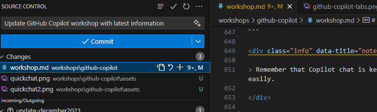

# GitHub Copilot を活用して効率を上げる
このワークショップの目的は、Nodejs を使って様々な機能を持つウェブサーバーを構築し、さらに .NET Web API を作成するという課題を通じて GitHub Copilot の使い方を学ぶことです。第二部では、Infrastructure as Code での活用方法や、セキュリティ上好ましくないコードの修正方法を学びます。

GitHub Copilot は、開発者がより良いコードをより早く書くのを助ける AI コードアシスタントです。何十億行ものコードに対して訓練された機械学習モデルを使用して、対象のコンテキストに基づいて行全体または関数レベルの提案を行います。GitHub Copilot を使用することで、より良いコードを書く方法を学び、生産性を向上させることができます。

<div class="warning" data-title="warning">

> GitHub Copilot は急速に進化している製品であるため、このワークショップは、使用する拡張機能のさまざまな機能に関して 100% 最新ではない可能性があります。コンテンツと異なる場合は状況に応じて推察して進めてください。参考までに、このページは 2023 年 12 月に更新されました。

</div>

## 前提条件

| | |
|----------------|-----------------|
| Node.js v16+   | [Node.js のダウンロード](https://nodejs.org) |
| .Net Core   | [.Net Core のダウンロード](https://dotnet.microsoft.com/download) |
| GitHub アカウント | [GitHub 無料アカウントの作成](https://github.com/join) |
| GitHub Copilot のアクセス | 60 日間の試用版は[こちらから申請](https://github.com/github-copilot/signup) |
| コードエディター  | [VS Code のダウンロード](https://code.visualstudio.com/Download) |
| VSCode 拡張機能 |  [GitHub Copilot](https://marketplace.visualstudio.com/items?itemName=GitHub.copilot), [GitHub Copilot Chat](https://marketplace.visualstudio.com/items?itemName=GitHub.copilot-chat)|
| ブラウザー      | [Microsoft Edge のダウンロード](https://www.microsoft.com/edge)もしくはその他|

<div class="warning" data-title="Important">

> また、いくつかのアセットをダウンロードする必要があります。[ここからダウンロード](../assets/src/exercisefiles.zip)できます。

</div>

## GitHub Codespaces で作業

ハンズオン環境は既に [GitHub Codespaces](https://github.com/features/codespaces) で動作するように構成されており、構成ファイルは *.devcontainer* フォルダーにあります。

新しい codespace を作成するだけでプログラミングを開始する準備が整うため、何もインストールする必要はありません。

## ローカルで作業

また、ローカルのコンピュータ上で作業することもできます。

1. [Visual Studio Code](https://code.visualstudio.com/) のインストール
2. [GitHub Copilot](https://marketplace.visualstudio.com/items?itemName=GitHub.copilot) 拡張機能のインストール
3. [GitHub Copilot Chat](https://marketplace.visualstudio.com/items?itemName=GitHub.copilot-chat) 拡張機能のインストール
4. [Node および npm](https://docs.npmjs.com/downloading-and-installing-node-js-and-npm) のインストール
5. mocha のインストール
    ``` bash
    npm install --global mocha
    npm install axios
    ```

7. [Docker](https://docs.docker.com/engine/install/) のインストール
8. [.NET Core](https://dotnet.microsoft.com/download) のインストール

---

# Github Copilot の最初のステップ

このセクションでは、GitHub Copilot を使い始めるための最初の手順について説明します。GitHub Copilot でできること、そして GitHub Copilot の可能性を最大限に活用する方法を学びます。既に GitHub Copilot の操作に慣れている場合は、NodeJS での最初の課題にスキップできます。

## 準備

この最初のチャレンジでは、次の GitHub リポジトリをクローンする必要があります: [Github Copilot Demo](https://github.com/Philess/gh-copilot-demo)

このリポジトリは、GitHub Copilot の全ての機能を試すのに役立つコードスターターです。ページに表示されているアーキテクチャ設計をよく確認し、準備ができたら、コマンドラインからリポジトリをクローンして VS Code で開きます。

``` bash
git clone https://github.com/Philess/gh-copilot-demo
cd gh-copilot-demo
code .
```

## はじめての GitHub Copilot

プロンプトの入力を開始し、Copilot が提案を生成したら、次のショートカットを使用して Copilot を操作できます。
    <ul>
        <li>`tab` : 現在の提案を完全に受け入れる (`最も一般的`)</li>
        <li>`ctrl + →` : 単語単位で提案を受け入れる (`部分的に利用`)</li>
        <li>`alt + ^` : 次の候補を表示</li>
        <li>`shift + tab` : 前の候補を表示</li>
        <li>`ctrl + enter` : Copilot ペインの表示</li>
    </ul>

<div class="tip" data-title="tip">

> これらのショートカットを思い出せない場合でも、候補の上にポインターを置くだけで表示されます。

</div>

## 自然言語翻訳

**文字列の自動補完**

`album-viewer/lang/translations.json` ファイルを開きます。

```json
[
    {
        "language": "en",
        "values": {
            "main-title": "Welcome to the world of the future",
            "main-subtitle": "The future is now with copilot",
            "main-button": "Get started"
        }
    }
]
```

- 最後の "}" の後に "," を追加して新しいブロックを追加し、Enter キーを押します

<br>

## コード生成

**プロンプトとは?**
Copilot のコンテキストでは、プロンプトはコード候補を生成するために使用される自然言語の説明の一部です。これは、Copilot がコードを生成するために使用する入力です。1 行または複数行のプロンプトを利用することができます。

**プロンプトからコードを生成**

新しい `album-viewer/utils/validators.ts` ファイルを作成し、プロンプトから始めます:

```ts
// フランス語形式のテキスト入力から日付の検証をおこない、date オブジェクトに変換
```

Copilot は正規表現を書くのにも役立ちます。これらを試してください:

```ts
// GUID 文字列の形式を検証する関数

// IPV6 アドレス文字列の形式を検証する関数
```

<br>

**Copilot で新しいツールやライブラリを発見する**

同じ `album-viewer/utils/validators.ts` ファイルに、次のプロンプトを追加します:

```ts
// テキスト入力から電話番号の検証をおこない、国コードを抽出
```

<div class="info" data-title="info">

> この例では、おそらく未定義のメソッドを呼び出すという提案がされるでしょう。これは、`ctrl+enter` ショートカットを使用して Copilot ペインを表示し、代替案を検討する良い機会です。
<br>外部ライブラリを参照しているものを選択し、Copilot を使用してインポートしてみてください。新しいものを発見するのにこのツールが役に立つことがわかるでしょう。

</div>

**複雑なアルゴリズムの生成**

`albums-api/Controllers/AlbumController.cs` ファイルで、`GetByID` メソッドの現在の実装を置き換えて完成させてみてください:

```cs
// GET api/<AlbumController>/5
[HttpGet("{id}")]
public IActionResult Get(int id)
{
    //here
}
```

同じファイルで、次のような他のプロンプトを試してみてください:

```cs
// アルバムを name, artist ないし genre で検索する関数

// アルバムを name, artist ないし genre でソートする関数
```

## 大きなタスクと小さなタスク

### 大きなプロンプトと短いプロンプト

Copilotは多くの場合で、クラス全体を生成するための複数行のプロンプトではなく、小さいながらも正確に記述されたコードを生成するプロンプトの方がより効果的です。

<div class="tip" data-title="tip">

> 大きなコードを生成するための最良の戦略は、簡単なプロンプトでコードの基本的な構造の生成から始めて、単純なプロンプトで小さな部分を 1 つずつ追加していくことです。

</div>

**動作する*可能性のある*大きなプロンプト**

- `albums-viewer/utils` に戻り、新しいファイル `viz.ts` を追加して、グラフを生成する関数を作成します。これをおこなうプロンプトの例を次に示します:

```ts
// D3.js でアルバムの販売価格を年ごとにプロットする
// X 軸は月、Y 軸はアルバム販売数を示す
// アルバムの売上のデータは、外部ソースから読み込まれ、JSON 形式
```

<div class="info" data-title="info">

>Copilot はおそらく、詳細を追加してプロンプトを完成させようとするでしょう。自分で詳細を追加するか、Copilot の提案に従ってください。提案を停止してコード生成を開始したい場合は、別の行にジャンプして、Copilot に任せてください。

</div>

- チャートのコードを生成すると、IDE が d3 オブジェクトについて警告します。これにも Copilot が役立ちます。
ファイルの先頭に戻り、`import d3` と入力して Copilot に自動補完させます。

```ts
import d3 from "d3";
```

Copilot が生成したものを確認してください。コードが正常に動作し、要求した全てを実装している場合もありますが、トークンの制限に達し、Copilot がコード全体を生成できなかった可能性もあります。

これは、自動補完用の Copilot が、大きなコードを一度に作成するために作られているのではなく、小さな断片を段階的に生成することに特化しているためです。

**ステップバイステップで再チャレンジ**

以下の手順に従って、プロンプトを細かく分割してコードを生成してみてください:

```ts
import * as d3 from 'd3';

// json ファイルからデータを読み込み、then 関数のコールバック内で d3 svg を作成
```

then 関数のコールバック内で、プロットの基本条件を設定することから始めます

```ts
// svg の作成
```

```ts
// X 軸と Y 軸のスケールを作成
// X 軸は月、Y 軸はアルバムの販売数を示す
```

```ts
// X 軸と Y 軸の作成
```

あとは、Copilot にチャートを完成させるように依頼するだけです

```ts
// アルバムの売上データに基づいて折れ線グラフを生成
```

<div class="tip" data-title="tip">

>Copilot の自動補完で大きなタスクを小さなチャンクに分割することで、**常に**より良い結果を得ることができます。また、Copilot は魔法ではなく、他の IDE 機能や開発者のロジックと共に使用する必要があることも示されています。

</div>

## テスト

Copilot は、コードで記述されたあらゆる種類のテストを生成するのに役立ちます。これには、たとえば JMeter スクリプトを使用した `単体テスト、統合テスト、エンドツーエンドテスト、ロードテスト` などのテストが含まれます。

- `albums-viewer/tests` フォルダーに新しいファイル `validators.test.ts` を追加します

- 適切なテストの提案を得るには、使用するテストフレームワークなどの基本情報を Copilot に提供する必要があります:

```ts
import { describe }
```

`describe` 関数を入力し始めると、Copilot は開発者が TS のテストファイル内で作業していることを確認し、JS / TS の有名なテストフレームワークである Mocha から `describe` 関数と `it` 関数をインポートすることを提案します。
提案を受け入れると、Chai からの `expect` 関数も自動的に提案されますので、それも受け入れてください:

```ts
import {describe, it} from 'mocha';
import {expect} from 'chai';
```

これでテストフレームワークの準備が整いました。ここで、`import` キーワードで新しい行を開始し、テスト対象の関数をインポートするだけで、Copilot はテストファイル内で作業していると判断し、いくつかの `validators` をテストするために、次のようなものを提案します:

```ts
import {validateAlbumId} from '../src/validators';
```

一見問題ないように見えますが、Copilot は全てのコードにアクセスできるわけではなく、開いているタブと限られた情報しかアクセスできないため、パスと関数名の両方が間違っていることがわかります。
<br>
... 少なくとも Copilot は試してみました ...
<br>
しかし、Copilotは魔法ではなく、他の IDE 機能やあなたの脳と一緒に使用する必要があることを示す良い例です。

- 提案を受け入れ、パスを変更します。`ctrl + space` ショートカットを使うことで、実際に使用可能な関数を VS Code が提案してくれます。

- テストしたい最初の関数にコメントを追加して、魔法を起こさせます。:

```ts
import {describe, it} from 'mocha';
import {expect} from 'chai';

import {validateDate, validateIPV6} from '../utils/validators';

// validataDate 関数のテスト
```

Boom!

```ts
describe('validateDate', () => {
    it('should return a date object when given a valid date string', () => {
        const date = '01/01/2019';
        const expectedDate = new Date(2019, 0, 1);
        expect(validateDate(date)).to.deep.equal(expectedDate);
    });

    it('should throw an error when given an invalid date string', () => {
        const date = '01/01/2019';
        expect(() => validateDate(date)).to.throw();
    });
});
```

*他の `it` ブロックを追加して、テストケースを追加したり、他の関数のテストを追加したりできます。たとえば、新しい `it` ブロックを追加して、空の文字列が与えられたときにエラーがスローされることをテストしてみてください。*

## CI パイプラインの記述

*Copilot は、さまざまなステップやタスクのコードを生成することで、パイプライン定義ファイルの作成に役立ちます。ここでは、その機能の例をいくつか紹介します:*

- *パイプライン定義ファイルを `ゼロから` 生成します*
- *さまざまな `ステップ、タスク、スクリプトの一部` の `コードを生成する` ことで、パイプライン定義ファイルの記述を高速化します*
- *あなたのニーズに合った `Marketplace のタスクと拡張機能を見つける` のを手伝ってくれます*

### ステップ 1: ゼロから生成

- プロジェクトの `.github/workflows` フォルダーに新しいファイル `pipeline.yml` を作成し、次のプロンプトの入力を開始します:

```yml
# main ブランチへの push 時に起動する GitHub Actions のパイプライン
# album-api イメージを Docker build し、ACR に push
```

*Copilot はブロックごとにパイプラインを生成します。パイプラインの Yaml ファイル生成では、他のタイプのコードよりも頻繁に次のブロックの生成をトリガーするために、新しい行にジャンプする必要がある場合があります。*

*多くの場合、インデントが正しくなかったり、タスク名の周りの引用符が欠落していたりして、いくつかのエラーが発生するタスクが生成されます。これらは、IDE と開発者のスキルで簡単に修正できます。*

### ステップ 2: プロンプトからタスクを追加

- 少なくともコンテナーレジストリへの "ログイン" タスクと "docker ビルドとデプロイ" タスクを含む GitHub Actions ワークフローが生成されているでしょう。これらのタスクの後に新しいコメントを追加して、Docker イメージに GitHub Actions run-id のタグを付け、レジストリにプッシュします:

```yml
# GitHub Actions の run-id のタグをイメージに付与し、Docker Hub に push
```

次のような他のプロンプトを試すことができます:

```yml
# album-api イメージでテストを実行

# album-api を dev 環境の AKS クラスターにデプロイ
```

### ステップ 3: プロンプトからスクリプトを追加

- Copilot は、次の例のようなカスタムスクリプトを記述する必要がある場合にも非常に便利です:

```yml
# 全ての appmanifest.yml ファイルで %%VERSION%% を見つけて GitHub Actions の run-id に置換
```

## Infra As Code

Copilot は、インフラをコードとして記述するのにも役立ちます。`Terraform、ARM、Bicep、Pulumi` や、`Kubernetes マニフェスト ファイル` などのコードを生成することも可能です。

### Bicep

`iac/bicep` フォルダー内の `main.bicep` ファイルを開き、ファイルの最後にプロンプトを入力して新しいリソースを追加します:

```js
// Container Registry

// Azure Cognitive Services Custom Vision resource
```

### Terraform

`iac/terraform` フォルダー内の `app.tf` ファイルを開き、ファイルの最後にプロンプトを入力して新しいリソースを追加します:

```yml
# Container Registry

# Azure Cognitive Services Custom Vision resource
```

## Git Commit コメントの生成

コメントを書くことは必須であるべきですが、開発者は怠りがちです。GitHub Copilot がお手伝いします。

1. 適当なファイルに何かしらのコンテンツを追加します。

2. Git コミットパネルで、右側にある小さな魔法のボタンをクリックします

    

3. あなたに代わってコメントを生成しくれた Copilot を褒めてあげましょう

    

## ドキュメントの記述

Copilot は自然言語のプロンプトを理解してコードを生成することができます。また、`コードを理解し、自然言語で説明する`こともでき、コードのドキュメントを作成するのに役立ちます。
そのため、全てのドキュメント作成タスクに役立ちます。単純なドキュメントコメントや、JavaDoc、JsDoc などの標準化されたドキュメントコメントを生成できます。また、ドキュメントをさまざまな言語に翻訳するのにも役立ちます。それがどのように機能するか見てみましょう。

### 単純なドキュメントコメント

これを確認するには、クラス、メソッド、または任意のコード行の上にポインターを置き、選択した言語のコメントハンドラーの入力を開始して Copilot をトリガーします。たとえば、Java、C#、TS などの言語では、 `//` と入力するだけで魔法が起こります。

以下は `albums-viewer/routes/index.js` ファイルの例です。行を挿入し、`try ブロック` 内の 13 行目の入力を開始します

```js
router.get("/", async function (req, res, next) {
  try {
    // Invoke the album-api via Dapr
    const url = `http://127.0.0.1:${DaprHttpPort}/v1.0/invoke/${AlbumService}/method/albums`;

```

他のコードでも何が起こるかを試してみてください。

### 標準化されたドキュメントコメント (JavaDoc、JsDoc など)

この場合、ドキュメントコメントの生成をトリガーするには、特定のコメント形式を意識する必要があります:

-  `/**` JS/TS: たとえば `index.js` ファイル内
- `///` C#: たとえば AlbumApi の `AlbumController.cs` ファイル内

```cs
/// <summary>
/// アルバムを取得する関数
/// </summary>
/// <param name="id">アルバムのID</param>
/// <returns>アルバムの情報</returns>    
[HttpGet("{id}")]
public IActionResult Get(int id)
```

### マークダウンと HTML ドキュメントの記述

Copilot は、ドキュメントの記述にも非常に強力です。`マークダウン` と `html` コードを生成し、例えばこのような readme.md ファイルの記述を加速するのに役立ちます。

これを試すために、プロジェクトのルートに新しいファイル `demo.md` を作成し、次のプロンプトを入力してください:

```md
# Github Copilot ドキュメント
このドキュメントは、ツールが何をできるかを示すために GitHub Copilot で作成されました。

##
```

次に、2 番目のレベルのタイトルで新しい行を開始することで、ドキュメントのコンテンツを生成し、ドキュメントの記述プロセスを加速する方法を示します。

---

# コード品質を向上させるために Copilot Chat を使用する

GitHub Copilot は生成 AI であり、そのため、コードを生成するのに最適ですが、コードの分析機能も強力で、コードの品質を向上させるために使用できます。たとえば、セキュリティの問題を見つけ、コードの品質を向上させるための提案を生成し、レガシーコードにコメントを追加し、リファクタリングをおこない、テストを生成するなど、さまざまなケースでコード品質を向上させるために使用できます。

既に慣れている場合は、次のセクションに進むことができます。

## はじめに

GitHub Copilot Chat を使用するには、まず次のことが必要です:

- 有効な GitHub Copilot ライセンス (Individual、Business、Enterprise) を持っていること。
- IDE に拡張機能をインストールすること。VS Code の場合、拡張機能タブで `Github Copilot Chat` を検索して直接見つけることができます。

### リポジトリのクローン

前のセクションと同じリポジトリを使用し、Copilot Chat を使用してコード品質を向上させる方法を示します。既にお持ちの場合は、この手順をスキップできます。

次の GitHub リポジトリをクローンする必要があります: [Github Copilot Demo](https://github.com/Philess/gh-copilot-demo)

このリポジトリは、GitHub Copilot で全ての機能を試すのに役立つコードスターターです。リポジトリのページに表示されているアーキテクチャー設計をよく確認し、準備ができたら、コマンドラインからリポジトリをクローンして VS Code で開きます。

``` bash
git clone https://github.com/Philess/gh-copilot-demo
cd gh-copilot-demo
code .
```

## はじめての Copilot Chat

Copilot Chat をインストールしたら、次の手順で使い始めることができます。

- IDE の左側のツールバー (チャットアイコン) から**チャットビュー**にアクセスします。
- `Ctrl` + `Shift` + `i` ショートカットを押すと、チャットに簡単な**インライン質問**が表示されます。

最初のものは固定のバージョンで、チャットを開いたままにして Copilot に質問するのに非常に便利です。
2 つ目は、質問をし、回答を得てコマンドを起動するための簡単な方法です。

### チャットビュー

チャットビューは、IDE の他のツールビューと同様に統合され、完全なチャットエクスペリエンスを提供します。ビューが開いたら、Copilot をコードコーチとしてチャットを開始できます。会話の履歴を保持し、前の回答に関連する質問をすることができます。また、途中で質問に対する提案も提供します。次のことが可能です:

- 任意の言語でのコーディングやベストプラクティスに関する一般的な質問をする
- 現在のファイルに関連するコードを生成または修正し、そのコードをファイルに直接挿入するように依頼する

これは、コード補完の提供に特化した普通の Copilot よりも高レベルの Copilot です。

次のようないくつかの質問で試してみてください:

```text
> C#で乱数を生成するには?
> ASP.NET Core でルートをセキュアにする最良の方法は何ですか?
> NodeJS で静的 Web サイトを生成する最も簡単な方法は何ですか?
```

次に、リポジトリ内のコード ファイルのいくつかで試してみてください。ファイルを開いて、次の質問をしてみてください:

```text
> このコードが何をするのか説明していただけますか?
> (コードの一部のみを選択した状態) 選択したコードが何をするのか説明していただけますか?
> 1 から 10 までの乱数を返す関数を生成できますか?
> この関数にドキュメントコメントを追加できますか?
```

途中で表示される質問の提案も使用してみてください。

### インラインの質問

インライン質問は、Copilot に質問して回答を得るための簡単な方法です。これは、特定のコードについて質問するのに適した方法です。また、Copilot のコマンドを起動するのにも適しています。コードの生成、コードの修正、テストの生成などを依頼できます。

`Ctrl` + `Shift` + `i` を押して、チャットビューで試したのと同じコマンドを入力して試してみてください。

### スラッシュコマンド

Copilot がより関連性の高い回答を得られるように、`スラッシュコマンド` を使用して質問のトピックを選択できます。

チャット入力の先頭に特定のトピック名を付加すると、Copilot がより関連性の高い応答を返すことができます。 `/` と入力し始めると、考えられるトピックのリストが表示されます。

- **/explain**: 選択したコードがどのように機能するかを段階的に説明します。
- **/fix**: 選択したコードのバグの修正を提案します。
- **/help**: GitHub Copilot に関する一般的なヘルプを出力します。
- **/tests**: 選択したコードの単体テストを生成します。
- **/vscode**: VS Code のコマンドと設定に関する質問に答えます。
- **/clear**: セッションをクリアします。

## コードをセキュリティで保護する

Copilotは、コード内のセキュリティ問題を見つけて修正するのに役立ちます。また、コード内の悪いプラクティスを見つけて修正するのにも役立ちます。それがどのように機能するか見てみましょう。

`album-api/Controllers/UnsecuredController.cs` ファイルを開き、次のような質問をチャットに入力します:

```text
> このコードにセキュリティ上の問題がないか確認できますか?
> このコードの品質を改善する方法はありますか?
```

答えが得られたら、次のように入力して問題の修正を依頼できます。

```text
> 修正を提案してもらえますか?
```

コードの修正が提案された場合は、チャットのコードブロックにカーソルを合わせ、左上の適切なオプションを選択して、**コピーするか、ファイルに直接挿入する**かを選択します。

## コードの説明とドキュメント

Copilot Chat を使用してコードを説明してもらうことができます。`自然言語でコードを説明したり、ドキュメントコメントを生成したり`することができます。次のコマンドで試してみましょう。:

```test
> /explain
> このコードのドキュメントコメントを生成して
```

## コードのリファクタリング

さらに印象的なのは、Copilot チャットがコードのリファクタリングに役立つことです。`変数の名前変更、メソッドの抽出、クラスの抽出など`に役立ちます。

これらのコマンドのいくつかは、`album-api/Controllers/UnsecuredController.cs` ファイルで試すことができます:

```test
> メソッドを抽出して
> 非同期処理が適切な場合、各メソッドの非同期バージョンを作成して
```

## コード翻訳

*Copilot は自然言語とプログラミング言語の両方を理解して生成できるため、それらを組み合わせることで、`コードの断片をある言語から別の言語に翻訳する`のに使用できます*

特定の言語のコードを翻訳するには、そのコードを開き、チャットで別の言語への翻訳を依頼します。たとえば、Copilot 自動補完専用の最初のセクションで作成した `validators.ts` ファイルを開き、C への翻訳を依頼します。

COBOL のようなレガシーコードを扱う場合も非常に便利です。`legacy/albums.cbl` ファイルを開き、コードを Python に変換してみてください。

## テスト生成

Copilot は、コードのテストを生成するのにも役立ちます。たとえば、JMeter スクリプトを使用して `単体テスト、統合テスト、エンドツーエンドテスト、およびロードテスト`を生成できます。

`album-api/Controllers/UnsecuredController.cs` ファイルを開き、次のような質問をチャットに入力します:

```test
> このコードの単体テストクラスを生成して
```

また、Copilot を使用して、テスト用のスタブとモックを生成することもできます。

```text
> FileStream クラスのモックを生成して
> そのモックを単体テストで使用して
```

<div class="info" data-title="note">

> Copilot chat は会話の前の Q & A を追跡しているため、以前に生成されたモックを参照して簡単にテストできることを覚えておいてください。

</div>

## Chat participants の利用

Chat participants は、特定のタスクを支援できる専門の専門家のようなものです。チャットで @ 記号を使用してメンションできます。現在、次の 3 つの Chat participants を使用できます:

- **@workspace**: この chat participant は、ワークスペース内のコードに関する知識を持っており、関連するファイルまたはクラスを見つけることで、ワークスペースの遷移を支援できます。@workspace chat participant は、メタプロンプトを使用して、質問への回答に役立てるためにワークスペースから収集する情報を決定します。
- **@vscode**: この chat participant は、VS Code エディター自体のコマンドと機能に関する知識があり、それらの使用を支援できます。
- **@terminal**: この chat participant は Visual Studio Code のターミナルとそのコンテンツに関するコンテキストを持っています。

今のところはそれほどリッチではないかもしれませんが、これらの機能は時間の経過とともに成長し続けます。次に例をいくつか示します

サイドチャットパネルを開き、 `@workspace /new` と入力して、新しいプロジェクトを作成することを指定します。たとえば、ASP.NET プロジェクトを作成してみてください

```text
> @workspace /new Index、Users、および Product の 3 つのビューをもった ASP.NET Core 6.0 のプロジェクト
```

構造化されたプロジェクトと、ファイルを作成するための新しいボタンが表示されるはずです。`Create workspace` をクリックして、作成中のファイルを確認します。


## Tips

GitHub Copilot Chat は非常に便利ですが、開発者にとっては、キーボードを離れ、マウスを動かしてチャットタブを開くのは面倒な作業です。そのためコードエディター内でチャットを直接呼び出すことができます。

1- コードを含むファイルを開きます

2- ショートカット **Ctrl + i** を使用します。クイックチャットのポップアップ、即ちカーソルを移動させることができる小さなチャットウィンドウが開きます。


3- コードを生成するコマンドを入力します (たとえば、`Toto という名前の C# クラスを作成して`)。生成されたコードは、現在のファイル内に挿入されます。これはあなたが望むものかもしれません。

---

# Copilot Chat におけるプロンプトエンジニアリング

前のセクションでは、基本的なプロンプトを使用して Copilot Chat にコードを生成してもらう方法について説明しました。このセクションでは、プロンプトエンジニアリング手法を使用して、より正確な結果を得るための手法を学習します。

**プロンプトエンジニアリングとは？**
プロンプトエンジニアリングは、高品質のコード提案を生成するために、高品質のプロンプトを設計するプロセスです。より良いプロンプトを書くための良いプラクティスとヒントがあります。それらのいくつかを見てみましょう。

## 例を挙げる: one-shot と few-shots プログラミング

プロンプトエンジニアリングを利用し、チャットを使って Copilot に例を提供することもできます。これは、Copilot が何をしたいのかを理解し、より良いコードを生成するのに役立つ良い方法です。チャットで例を提供するには、validator.ts ファイルを開いて次のように入力します:

```bash
# one-shot プログラミング

現在のファイルで mocha と chai を使用して、電話番号検証メソッドの単体テストを書いてください。
ポジティブテスト (true を返すテスト) には、次の例を使用します:
it('電話番号が有効な国際番号である場合、trueを返す', () => { expect(validatePhoneNumber('+33606060606')).to.be.true; });
ロジックのセットでテストを整理し、メソッドごとに少なくとも 4 つのポジティブテストと 2 つのネガティブテストを生成してください。
```

```bash
# few-shot プログラミング

現在のファイルで mocha と chai を使用して、全ての検証メソッドの単体テストを書いてください。
ポジティブテスト (true を返すテスト) には、次の例を使用します。 
it('電話番号が有効な国際番号の場合は true を返す', () => { expect(validatePhoneNumber('+33606060606')).to.be.true; });
it('電話番号が有効なアメリカのローカル番号の場合は true を返す', () => { expect(validatePhoneNumber('202-939-9889')).to.be.true; });
it('指定された電話番号が空の場合、エラーをスローする', () => { expect(validatePhoneNumber('')).to.throw(); });
ロジックのセットでテストを整理し、メソッドごとに少なくとも 4 つのポジティブテストと 2 つのネガティブテストを生成してください。
```

この手法を使用して、**別のファイルのスタイルに従うコードを生成**できます。たとえば、albums-api>Models>Album.cs と同じように音楽スタイルのサンプルのレコードを作成する場合は、ファイルを開いて次のように入力します:

```bash
Album.cs ファイルのように、6 つのサンプル値を List<MusicStyle> の形で持つ MusicStyle レコードを作成してください。
```

## 外部参照の提供

Copilot Chat は、外部参照を使用して、より正確な提案を作成できます。たとえば、API にリクエストを送信するコードを生成する場合は、チャットで API レスポンスの例を提供するか、API リファレンスの URL を提供できます。Copilot はそれを使用して、より良いコードを生成します。

```bash
次の API から全ての犬種を取得し、Breed オブジェクトの配列を返す TS 関数を書いてください: HTTP GET https://dog.ceo/api/breeds/list/all
```

Copilot は、指定された外部参照を使用してコードを生成します。subBreeds プロパティをもつ Breef インターフェイス (またはクラス) が生成されます。これは、外部参照によって指定された API から取得されます。

```ts
interface Breed {
  name: string;
  subBreeds: string[];
}
```

<div class="tips" data-title="tip">

> SDK やライブラリなどの外部ドキュメントへのリンクを提供することもできます。または RFC などのイベント規範文書など...

</div>

## ロールプロンプト

foundational prompt とも呼ばれ、Copilot Chat の行動をパーソナライズし、Copilot のフレーバーを設定するために与える一般的なプロンプトです。

Copilot Chat で新しいタスクを開始するときに最初におこなうべきことは、**何を構築したいのか、Copilot にどのように支援してもらいたいのかを明確に説明すること**です。

<div class="warning" data-title="Important">

> **これは適切に処理された場合に非常に強力です**。そのため、全てのコーディングセッションをロールプロンプトで開始し、将来的な使用のために最適なプロンプトを保存してください。

</div>

***ロールプロンプトの構造***

ロールプロンプトに何を含めることができるか:

- 構築したいものに関する確かなコンテキストと背景情報を提供します。
- GitHub Copilot の役割を定義し、どのようなフィードバックを求めているかについて期待値を設定します。
- 回答の質を具体的にし、より多くのことを学び、受け取った回答が正しいことを確認するために、参考資料や追加のリソースを求めてください。
- タスクを再開し、指示が明確かどうかを尋ねます。

***ロールプロンプトの例***

新しい会話を開始し、次のプロンプトを入力します:

```bash
私は React Native で構築された新しいモバイルアプリケーションに取り組んでいます。 
ユーザーが犬の写真をアップロードして犬の品種を取得できる新しい機能を構築する必要があります。 
品種を操作するには、https://dog.ceo/api/breeds の API セットを使用する必要があります。コードが少なくとも OWASP Top 10 (https://owasp.org/Top10/) に対応していることを確認する必要があります。 
コードの単体テストが必要であり、また、https://www.w3.org/TR/WCAG21/ で定義されている WCAG 2.1 レベル A および AA の達成基準に準拠したアクセシビリティにしたいと考えています。
私のコードがこれら全ての要件を満たしていることを確認するために、私自身のコードコーチとして行動してもらう必要があります。 
可能であれば、追加の学習のためのリンクと参照を提供してください。 
これらの指示を理解していますか? 
```

そこから質問を開始し、時々、Copilot が指示に従っていることを確認するには、次の質問をします:

```bash
私の指示をまだ使用していますか?
```

***ロールプロンプトをテストする***

React Native Apps と OWASP Top 10 に関するアクセシビリティのベストプラクティスについて質問をすることで、ロールプロンプトをテストできます。また、アップロード機能のコードを生成するように依頼し、生成されたコードがセキュリティで保護され、アクセシビリティの基準を満たしているかどうかを確認することもできます。

たとえば、次の質問を試してみてください:

```bash
React Native で実装されたアプリのアクセシビリティを向上させるにはどうすればいいですか?

アプリから写真をアップロードする最も安全な方法は何ですか?
```

---

# NodeJS サーバーの開発

この最初の演習では、機能要件に従って実際のプロジェクトを開発します。自分自身で進めることもできますし、GitHub Copilot の助けを借りることも可能です。

## 手順

- [exercicefile](../assets/src/exercisefiles.zip) フォルダーをローカルにダウンロードします
- `nodeserver.js` を開き、Nodejs サーバーを作成することから始め、テキストに初めから書いてある指示を基にした Copilot の提案を確認します
- `test.js` ファイルを開き、現在のテストを分析します
- コマンドプロンプトを開き、テストを実行します (`mocha test.js`)
- 結果を見ると、次のように表示されるはずです:

``` bash
mocha test.js
server is listening on port 3000

  Node Server
    
    √ should return "key not passed" if key is not passed

  1 passing (34ms)

```

- `nodeserver.js` では、演習セクションで残りのメソッドを開発します

> 全てのコンテキストを与えてよりよい提案が生成されるように、Visual Studio Codeで `color.json` ファイルを開くことを忘れないでください。

- test.js ファイルに、機能をテストするメソッドを追加します。
- テストを実行して、全てが機能していることを確認します。
- `dockerfile` ファイルを開いてプロンプトを入力し、Web サーバーを実行できる Node イメージを含む Docker コンテナーを作成します。
- ポート 4000 で docker を実行するコマンドを作成します。
- アプリケーションがポート 4000 で動作していることをテストします。
- **nodeserver.js** ファイルに `//サーバーをテストするために curl コマンドを実行` のような新しい行を入力すると、現在のファイルに基づいて GitHub Copilot がコマンドラインで実行するための curl コマンドをどのように生成するかを確認できます。
- 注: `//daysBetweenDatesをテストするための curl コマンドを実行` といったコメントのように、より具体的に指定できます。この場合は特定のメソッドのテストが生成されるはずです。

## 演習

次に、新しい機能を開発し、サーバーに追加してください。サーバーが実装すべき要件は次のとおりです。

<div class="tip" data-title="tip">

> 入力途中で GitHub Copilot が提案を表示します。提案を受け入れるには Tab キーを押します。数行書いた後 GitHub Copilot が何も表示しない場合は、Enter キーを押して数秒待ちます。Windows または Linux では、Ctrl + Enter キーを押します。

</div>

<div class="info" data-title="note">

> 書くべきコードはたくさんありますが、完成までにかかる時間に驚かれるかもしれません。また、必要に応じて 7 つか 8 つだけ書いても構いませんが、この演習は退屈なものではありません。

</div>

| メソッド | 要件 |
|---|---|
|**/Get**|hello world メッセージを返します|
|**/DaysBetweenDates**|2 つの日付の間の日数を計算します<br/>2 つのクエリ文字列パラメーター date1 と date 2 で受け取り、これら 2 つの日付の間の日数を計算します|
|**/Validatephonenumber**|クエリ文字列で `phoneNumber` というパラメーターを受け取ります<br/>`phoneNumber` をスペイン語のフォーマットで検証します (例: +34666777888)<br/>`phoneNumber` が有効であれば "valid" を返します<br/>`phoneNumber` が有効でなければ "invalid" を返します|
|**/ValidateSpanishDNI**|クエリ文字列で `dni` というパラメーターを受け取り、DNI の文字列を検証します<br/>DNI が有効であれば "valid" を返します<br/>DNI が有効でなければ "invalid" を返します<br/>機能が正しく実装されていることを確認するための自動テストを作成します|
|**/ReturnColorCode**|クエリ文字列で `color`というパラメーターを受け取ります<br/>`colors.json` ファイルを読み取り、該当する色の `rgba` フィールドを返します|
|**/TellMeAJoke**|axios を使って joke API を呼び出し、ランダムにジョークを返します|
|**/MoviesByDirector**|(この実装には [https://www.omdbapi.com/apikey.aspx](https://www.omdbapi.com/apikey.aspx) を参照し、無料の API キーを取得する必要があります)<br/>クエリ文字列で `director` というパラメーターを受け取ります<br/>axios を使って映画の API を呼び出し、その `director` の映画一覧を返します|
|**/ParseUrl**|クエリ文字列で `someurl` というパラメーターを受け取ります<br/>URL を Parse し、プロトコル、ホスト、ポート、パス、クエリ文字列、およびハッシュを返します|
|**/ListFiles**|カレントディレクトリを取得します<br/>カレントディレクトリの全てのファイルを取得します<br/>ファイルの一覧を返します|
|**/GetFullTextFile**|`sample.txt` を読み込み、"Fusce" という単語を含む行を返します (この実装には注意してください。なぜならば普通は解析前にファイルのコンテンツを全て読み込むことになるため、メモリー使用率が上昇し、ファイルがあまりにも大きいとエラーになる可能性があるためです。)|
|**/GetLineByLinefromtTextFile**|`sample.txt` を行ごとに読み込みます<br/>ファイルを行ごとに読み込む promise を作成し、"Fusce" という単語を含む行の一覧を返します|
|**/CalculateMemoryConsumption**|プロセスのメモリー消費量を GB 単位で返します (小数点以下 2 桁に丸めて)|
|**/MakeZipFile**|zlib を利用して、`sample.txt` を含む `sample.gz` ファイルを作成します|
|**/RandomEuropeanCountry**|ヨーロッパの国とその ISO コードの配列を作成します<br/>配列からランダムな国を返します<br/>国とその ISO コードを返します|

## GitHub Copilot Chat 演習

以下のタスクは、[GitHub Copilot Chat](https://marketplace.visualstudio.com/items?itemName=GitHub.copilot-chat) 拡張機能で実行できます。

- **説明**

validatePhoneNumber メソッドで正規表現の書かれている行を選択し、`/explain` コマンドを使用します。正規表現中のそれぞれの異なる表記法が何を意味するかについて詳しく説明してくれます。

- **プログラミング言語変換**

たとえば、次のソースコードを選択します:

``` js
var randomCountry = countries[Math.floor(Math.random() * countries.length)];
```

Copilot Chat に別の言語 (Python など) への変換を依頼します。**python** で新しいコードが表示されます。

- **読みやすさ**

MakeZipFile メソッドを選択します

コードを読みやすくするよう Copilot Chat に依頼します。どのようにコメントが追加されるか、また、短い名前の変数の名前がどのようなわかりやすい名前に変更されるかを確認してください。

- **バグの修正**

この演習では、ほとんどのコードが GitHub Copilot によって書かれるため、バグはほとんどありません。いくつかのバグをわざと作りこむことによって、デバッグ機能をテストできます。

次のようなバグを作りこみます:

for ループで、先頭を次のように変更します (0 を 1 に変更します)。

``` js
    for (var i = 1
```

当該コードを選択し、Copilot Chat にバグの修正を依頼します。

- **堅牢にする**

ユーザー入力由来のテキスト (クエリ文字列から取得される変数など) を選択します。

``` js
        var queryData = url.parse(req.url, true).query;
        var date1 = queryData.date1;
        var date2 = queryData.date2;
```

Copilot Chat にコードを堅牢にするよう依頼すると、検証ロジックが追加されることがわかります。

- **ドキュメント**

以下のような行を選択します (例: メソッドや if 句の先頭)

``` js
    else if (req.url.startsWith('/GetFullTextFile'))
```

Copilot Chat にドキュメントの作成を依頼します。Copilot Chat がコードの動作を説明し、コメントが追加されます。

---

# .Net Core

目標は、GitHub Copilot の助けを借りて、.NET 6.0 と Docker を使用した単純な WebAPI を作成することです。
以下の手順に従って、可能な限り GitHub Copilot を使用してみてください。
さまざまなことを試してみて、Dockerfile やクラスの生成、コメントの追加など、GitHub Copilot で何ができるかを確認してください。

注意:

VS Code の右下隅にあるステータス バーを確認し、GitHub Copilot が現在の言語用に構成され、有効になっていることを確認します。

## dotnet WebAPI プロジェクトの作成

- 新規 .NET プロジェクトの作成

``` powershell
dotnet new webapi
```

- フォルダーに新しいファイル `User.cs` を作成し、Copilot にクラスを生成するように指示します。

- 新しいファイル `UserController.cs` を Controllers フォルダーに追加し、Copilot にコントローラーを ControllerBase から継承して生成するように指示します。

- クラスに `ApiController` 属性と `Route` 属性を追加します。

- `IUserService` という新しいファイルを Abstractions フォルダーに追加し、Copilot にインターフェースを生成するように指示します。

- 次のコマンドを利用してアプリケーションを実行します (GitHub Codespaces を使用している場合は、`Program.cs` から HTTPS リダイレクトを削除する必要がある場合があります)

```  powershell
dotnet run
```

- Services フォルダーの `UserService.cs` にインターフェイス IUserService を実装し、GitHub Copilot が実装を生成できるようにコメントを追加します。

- Copilot に、ユーザーのリストと、そのリストを使用した追加メソッドと取得メソッドを生成するように指示します。

- アプリをビルドする前に、`Program.cs` で `IUserService` を DI コンテナーに登録します。

``` csharp
builder.Services.AddSingleton<IUserService, UserService>();
```

- 次のコマンドを利用してアプリケーションを実行します。

``` powershell
dotnet run
```

> "No server certificate was specified..." エラーが発生した場合、次のコマンドを実行してください。

``` powershell
dotnet dev-certs https
```

- 必要に応じてポートフォワーディングの設定をおこなってください

- /swagger エンドポイントにアクセスします。e.g. [https://leomicheloni-supreme-space-invention-q74pg569452ggq-5164.preview.app.github.dev/swagger/index.html](https://leomicheloni-supreme-space-invention-q74pg569452ggq-5164.preview.app.github.dev/swagger/index.html)

## アプリケーションを Docker コンテナーで実行

- アプリケーションを publish し、_publish_ フォルダーに出力します

``` dotnet
dotnet publish -c Release -o publish
```

- 既存の `Dockerfile` ファイルを利用し、アプリケーションをコンテナーに配置して実行します (指示を追加するか、もしくはコードを書き、GitHub Copilot に保管させます)

- イメージをビルドし、ポート 8080 で実行します

``` powershell
docker build -t dotnetapp .
docker run -d -p 8080:80 --name dotnetapp dotnetapp
```

---

# Infrastructure as Code

プログラミング言語からコードを生成するのは 1 つの使用例ですが、GitHub Copilot は Terraform、Bicep などの構成ファイルを生成するのに役立つでしょうか？

この演習では、前のセクションで開発した Web アプリケーションをデプロイし、Azure でホストします。要件は次のとおりです。

- アプリケーションは、Azure Web アプリ名 `my-webapp` でホスト
- App Service プラン (CPU とメモリ) の名前は `my-plan` で、SKU (サイズ) `B1` を使用
- Web アプリは、リソース グループ名 `oh-yes` で West Europe でホスト

<div class="tip" data-title="tip">

> 上記のケースで GitHub Copilot を使用する方法はいくつかあります。たとえば、GitHub Copilot に提案を生成してもらう前に、数行の連続したコメントを書くことができます。さらに、結果が意図したものでない場合、サイドパネルを開いて 10 個の代替案を生成できます。これをおこなうには、`ctrl` + `Enter` をクリックします

</div>

---

# 解答

ここでは、いくつかの演習の解決策を確認することができます。

## コーディング

コーディング演習の解答は [ここからダウンロード](../assets/src/completesolution.zip) できます。

## Infrastructure As Code

この部分が最も簡単ですが、GitHub Copilot は不適切なコードやコメント付きのコードをランダムに生成する可能性があります。

``` bicep
param webAppName string = 'my-webapp'
param webAppPlanName string = 'my-plan'
param webAppPlanSku string = 'B1'
param webAppPlanLocation string = 'westeurope'
param resourceGroupName string = 'oh-yeah'

resource appServicePlan 'Microsoft.Web/serverfarms@2021-02-01' = {
  name: webAppPlanName
  location: webAppPlanLocation
  kind: 'app'
  sku: {
    name: webAppPlanSku
    tier: 'Basic'
    size: 'B1'
  }
}

resource webApp 'Microsoft.Web/sites@2021-02-01' = {
  name: webAppName
  location: webAppPlanLocation
  kind: 'app'
  properties: {
    serverFarmId: appServicePlan.id
  }
}

resource resourceGroup 'Microsoft.Resources/resourceGroups@2021-04-01' = {
  name: resourceGroupName
  location: webAppPlanLocation
}
```

## DevSecOps

GitHub Copilotは、全てのコードを修正およびリファクタリングできない場合がありますが (たとえば、`バグの修正` プロンプトを使用)、チャットで質問すると、Code smells や悪いプラクティスを認識してくれるのは非常に良いことです。

以下の短いコードには、いくつかのセキュリティ上の欠陥があります。少なくとも 4 つの重大な悪いプラクティスが見つかるはずです。

このコードは無害に見えますが、[パスインジェクション](https://learn.microsoft.com/en-us/dotnet/fundamentals/code-analysis/quality-rules/ca3003)を許可する可能性があります。これは、誰かがディスク上の別のファイルにアクセスしようとする可能性があることを意味します。

``` csharp
using (FileStream fs = File.Open(userInput, FileMode.Open))
    {
        // 可能であれば、ユーザー入力に基づいてファイルパスを明示的に既知のセーフリストに制限します。たとえば、アプリケーションが "red.txt"、"green.txt"、または "blue.txt" にのみアクセスする必要がある場合は、これらの値のみを許可します。
        // 信頼できないファイル名をチェックし、名前が問題ないことを確認します。
        // パスを指定するときは、絶対パス名を使用します。
        // PATH 環境変数などの潜在的に危険な構造は避けてください。
        // 長いファイル名のみを受け入れ、ユーザーが短い名前を送信する場合にのみ長い名前を検証します。
        // エンドユーザー入力を有効な文字に制限します。
        // MAX_PATH の長さを超えた名前をリジェクトします。
        // ファイル名を解釈せずにリテラルとして扱います。
        // ファイル名がファイルとデバイスのどちらを表しているかを確認します。

        byte[] b = new byte[1024];
        UTF8Encoding temp = new UTF8Encoding(true);

        while (fs.Read(b, 0, b.Length) > 0)
        {
            return temp.GetString(b);
        }
    }

    return null;
}
```

これは [SQL インジェクション](https://learn.microsoft.com/en-us/dotnet/fundamentals/code-analysis/quality-rules/ca3001)の有名な例です。一番良いのは、エスケープコードや間違ったパラメーターボックス（型）の試みに対処できるパラメータを使うことです。

``` csharp
public int GetProduct(string productName)
{
    using (SqlConnection connection = new SqlConnection(connectionString))
    {
        SqlCommand sqlCommand = new SqlCommand()
        {
            CommandText = "SELECT ProductId FROM Products WHERE ProductName = '" + productName + "'",
            CommandType = CommandType.Text,
        };

        // セキュアな方式
        // SqlCommand sqlCommand = new SqlCommand()
        // {
        //     CommandText = "SELECT ProductId FROM Products WHERE ProductName = @productName",
        //     CommandType = CommandType.Text,
        // };
        // sqlCommand.Parameters.AddWithValue("@productName", productName);

        SqlDataReader reader = sqlCommand.ExecuteReader();
        return reader.GetInt32(0); 
    }

}
```

一般的な良いプラクティスは、エンドユーザーに技術的なエラーを表示しないことです ([情報の開示](https://learn.microsoft.com/en-us/dotnet/fundamentals/code-analysis/quality-rules/ca3004))。使用されているテクノロジー、プラグインのバージョン、さらには攻撃者がアプリケーションに対して使用できる追加情報であるスタックトレースが表示される可能性があります。

``` csharp
public void GetObject()
{
    try
    {
        object o = null;
        o.ToString();
    }
    catch (Exception e)
    {
        this.Response.Write(e.ToString());
        // よりよい方式
        // myLogger.Log(e.ToString()); // 例外のログ出力
        // this.Response.Write("例外が発生しました"); // 一般的なメッセージを返す
    }

}
```

以下の例はトリッキーであると同時にシンプルです。connectionString には資格情報を含めることができ、ハードコーディングしてはなりません。簡単に変更することができないというのもありますが、さらに重要なことは、ソースコードにアクセスする人なら誰でもシークレットにアクセスできることです。

``` csharp
private string connectionString = "";
```

---

# Credits

This workshop's challenges are a fork from the original Hackaton [accessible here](https://github.com/microsoft/CopilotHackathon). We just wanted to integrate it into the [MOAW](https://github.com/microsoft/moaw) format and add some exercises.

Role Prompts described in the Prompt engineering section are inspired by this [great blog post](https://github.blog/2023-10-09-prompting-github-copilot-chat-to-become-your-personal-ai-assistant-for-accessibility/) from Github's engineers [Ed Summers](https://github.com/edsummersnc) and [Jesse Dugas](https://github.com/jadugas).

A big thanks to them <3
