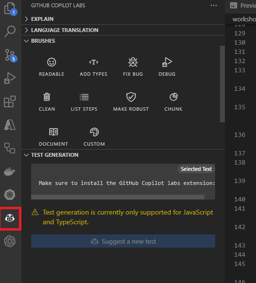

## Activate GitHub Copilot to become more efficient

The goal of this workshop is to learn how to use GitHub Copilot, using an exercise that consists of building a web server using Nodejs with different functionalities and a .NET Web API. In the second part, you'll learn how to use it for infrastructure as code but also to fix bad practices in terms of security.

GitHub Copilot is an AI-powered code assistant that helps developers write better code faster. It uses machine learning models trained on billions of lines of code to suggest whole lines or entire functions based on the context of what you’re working on. By using GitHub Copilot, you can learn how to write better code and improve your productivity.

<div class="info" data-title="warning">

> GitHub Copilot is a quickly evolving product and thus this workshop may not be 100% up to date with the differentes features of the different extensions you are going to use. Please be clever.

</div>

### Pre-requisites

| | |
|----------------|-----------------|
| Node.js v16+   | [Download Node.js](https://nodejs.org) |
| .Net Core   | [Download .Net Core](https://dotnet.microsoft.com/download) |
| GitHub account | [Create free GitHub account](https://github.com/join) |
| GitHub Copilot Access | A 60 day trial can be [requested here](https://github.com/github-copilot/signup) |
| A code editor  | [Download VS Code](https://code.visualstudio.com/Download) |
| some VSCode extensions |  The first one [GitHub Copilot](https://marketplace.visualstudio.com/items?itemName=GitHub.copilot) and the second one ([GitHub Copilot Labs](https://marketplace.visualstudio.com/items?itemName=GitHub.copilot-labs)) will allow you to send custom commands (a.k.a. `brushes` which are in fact `prompts`).|
| A browser      | [Download Microsoft Edge](https://www.microsoft.com/edge) |

<div class="warning" data-title="Important">

> You also have to download some assets. These can be [downloaded here](assets/src/exercisefiles.zip).

</div>

### Work with GitHub Codespaces

The environment is already configured to work with [GitHub Codespaces](https://github.com/features/codespaces), you can find the configuration files in the *.devcontainer* folder.

To start programming just start a new codespace and you are ready to go, don't need to install anything.

### Work locally

You can also choose to work locally on your computer.

1. Install [Visual Studio Code](https://code.visualstudio.com/)
2. Install the [GitHub Copilot](https://marketplace.visualstudio.com/items?itemName=GitHub.copilot) extension
3. Install the [GitHub Copilot Labs](https://marketplace.visualstudio.com/items?itemName=GitHub.copilot-labs) extension. it contains beta features
4. Install [Node and npm](https://docs.npmjs.com/downloading-and-installing-node-js-and-npm)
5. Install mocha

``` bash
 npm install --global mocha
 npm install axios
```

4. Install [Docker](https://docs.docker.com/engine/install/)
5. Install [.NET Core](https://dotnet.microsoft.com/download)

---

## Develop a NodeJS server

In this first exercise, you are going to develop a real project following functional requirements. You can do it by yourself or...with the help of GitHub Copilot.

### Instructions

- Download to local the [exercicefile](assets/src/exercisefiles.zip) folder
- Open `NodeServer.js` and begin by writing a Nodejs server, check the first suggestions based on the initial text
- Open `test.js` file and analyze the current test
- Open a command prompt and run the test (`mocha test.js`)
- See the result, it should display something like:

``` bash
mocha test.js
server is listening on port 3000

  Node Server
    
    √ should return "key not passed" if key is not passed

  1 passing (34ms)

```

- In the `NodeServer.js` develop the rest of the methods described in the Exercise described in the section below
  
> Do not forget to open `color.json` file in Visual Studio Code, so GitHub Copilot get all the context to make better recommendations

- In the Test.js file add the methods to test the functionality
- Run the tests to verify that all is working
- Open the `dockerfile` file, and fill it, to create a docker container with a node image that can run the web server
- Create a command to run docker in port 4000
- Test that the application is working in port 4000
- In the **nodeserver.js** file, you can type a new line like `//run a curl command to test the server` so we can see how GitHub Copilot based on the current file produces a curl command, to be executed in the command line.
- Note: you can be more specific like `//run a curl command to test the daysBetweenDates` method. It should generate a test for a specific method

### Exercise

You must now develop and add new features to your server. The requests that the server must attend are the following:

<div class="tip" data-title="tip">

> As you type GitHub Copilot will make suggestions, you can accept them by pressing Tab. If nothing shows up after GitHub Copilot write some lines, press enter and wait a couple of seconds. On Windows or Linux, press Ctrl + Enter, then click Open GitHub Copilot.

</div>

<div class="info" data-title="note">

> There are a lot of code to write but you may be surprised by the time it will take to you to complete it. You can also only write 7 or 8 of them if you want, the exercise is not meant to be boring.

</div>

| Method | Requirements|
|---|---|
|**/Get**|Return a hello world message|
|**/DaysBetweenDates**|Calculate days between two dates. <br/>Receive by query string 2 parameters date1 and date 2 , and calcualte the days that are between those two dates.|
|**/Validatephonenumber**|Receive by querystring a parameter called `phoneNumber`. <br/>Validate `phoneNumber` with Spanish format, for example +34666777888<br/>if `phoneNumber` is valid return "valid"<br/>if `phoneNumber` is not valid return "invalid"|
|**/ValidateSpanishDNI**|Receive by querystring a parameter called `dni`. calculate DNI letter<br/>if DNI is valid return "valid"<br/>if DNI is not valid return "invalid"<br/>We will create automated tests to check that the functionality is correctly implemented.<br/>When the development is completed, we will build a container using Docker|
|**/ReturnColorCode**|Receive by querystring a parameter called `color`<br/>read `colors.json` file and return the `rgba` field<br/>get color var from querystring<br/>iterate for each color in colors.json to find the color<br/>return the code.hex field|
|**/TellMeAJoke**|Make a call to the joke api and return a random joke using axios|
|**/MoviesByDirector**|(this will require to browse to [https://www.omdbapi.com/apikey.aspx](https://www.omdbapi.com/apikey.aspx) and request a FREE API Key)<br/>Receive by querystring a parameter called director<br/>Make a call to the movie api and return a list of movies of that director using axios<br/>Return the full list of movies|
|**/ParseUrl**|Retrieves a parameter from querystring called someurl<br/>Parse the url and return the protocol, host, port, path, querystring and hash<br/>Return the parsed host|
|**/ListFiles**|Get the current directory<br/>Get the list of files in the current directory<br/>Return the list of files|
|**/GetFullTextFile**|Read `sample.txt` and return lines that contains the word "Fusce". (becareful with this implementation, since this normally reads the full content of the file before analizing it, so memory usage is high and may fail when files are too big)|
|**/GetLineByLinefromtTextFile**|Read `sample.txt` line by line<br/>Create a promise to read the file line by line, and return a list of lines that contains the word "Fusce"<br/>Return the list of lines|
|**/CalculateMemoryConsumption**|Return the memory consumption of the process in GB, rounded to 2 decimals|
|**/MakeZipFile**|Using zlib create a zip file called `sample.gz` that contains `sample.txt`|
|**/RandomEuropeanCountry**|Make an array of european countries and its ISO codes<br/>Return a random country from the array<br/>Return the country and its ISO code|

### GitHub Copilot Labs exercises

These tasks can be performed with the [GitHub Copilot Labs](https://marketplace.visualstudio.com/items?itemName=GitHub.copilot-labs) add-in, currently PREVIEW functionality, expect some bugs or weird behavior (you've been warned <:o)).

Open the GitHub Copilot Labs extension to see all the available functionality.



- **Explain**

Select the line that has the regex in the validatePhoneNumber method, in EXPLAIN section click "Ask Copilot". You will see an explanation detailing what each different notation does in the regular expression.

- **Language translation**

Select some source code, like this line:

``` js
var randomCountry = countries[Math.floor(Math.random() * countries.length)];
```

In "**LANGUAGE TRANSLATION**" section select **python** and click "Ask Copilot" button, you should see new code generated in **python**

- **Readable**

Select the content of MakeZipFile

In the BRUSHES section, click the "Readable" button. See how comments are added and also variables that have short names are renamed to more understandable names.

-- **Fix Bug**

In the exercise, there should be no bugs, since most of the code will be done by GitHub Copilot. We can force some errors and then test the debug functionality.

Force some errors like:

In a for loop change the beginning to (change the 0 for a 1):

``` js
    for (var i = 1
```

select the text and in the "BRUSHES" section press the "Fix Bug" button.

-- **Debug**

Select some lines of text that contain variables, like:

``` js
    var queryData = url.parse(req.url, true).query;
    var color = queryData.color;
    var colorFound = "not found";
```

select the text and in the "BRUSHES" section press the "Debug" button.

-- **Clean**

TBD

-- **List steps**

Select some lines of code that do not have comments and in the  "BRUSHES" section press the "List steps" button.

-- **Make robust**

Select some text that comes from input, for example, variables that come from query string:

``` js
        var queryData = url.parse(req.url, true).query;
        var date1 = queryData.date1;
        var date2 = queryData.date2;
```

In the "BRUSHES" section press the "Make robust" button and you will see that additional validation is added.

-- **Document**

Select some line (e.g. a method or the beginning of the if clause)

``` js
    else if (req.url.startsWith('/GetFullTextFile')) 
```

In the  "BRUSHES" section press the "Document" button, you will see that comments explaining what the code does are added before the line.

---

## .Net Core

The goal is to create a simple WebAPI using .NET 6.0 and Docker with the help of GitHub Copilot.
Follow the instructions below and try to use GitHub Copilot as much as possible.
Try different things and see what GitHub Copilot can do for you, like generating a Dockerfile or a class, adding comments, etc.

Remember:

Make sure GitHub Copilot is configured and enabled for the current language, just check the status bar on the bottom right corner of VS Code.

### Create dotnet WebAPI project

- Create a new NET project using

``` powershell
dotnet new webapi
```

- Create a new file `User.cs` in the Models folder, and instruct Copilot to generate a class for you.

- Add a new file `UserController.cs` in the Controllers folder that inherits from ControllerBase, and instruct Copilot to generate a controller for you.

- Add `ApiController` and Route attributes to the class.

- Add a new file `IUserService` in the Abstractions folder, and instruct Copilot to generate an interface for you.

- Run the app using (if you are working with GitHub Codespaces you may need to remove HTTPS redirection from `Startup.cs` )

```  powershell
dotnet run
```

- Implement the interface IUserService in `UserService.cs` in the Services folder and add some comments so GitHub Copilot be able to generate the implementation for you.

- Instruct Copilot to generate a List for Users and the Add and Get Methods using the list.

- Go to `Program.cs` a inject the `IUserService` before building the app.

``` csharp
builder.Services.AddSingleton<IUserService, UserService>();
```

- Run the app using

``` powershell
dotnet run
```

> If you run into and "No server certificate was specified..." error, run the following command

``` powershell
dotnet dev-certs https
```

- Forward port if needed

- Navigate to your address /swagger. Example: https://leomicheloni-supreme-space-invention-q74pg569452ggq-5164.preview.app.github.dev/swagger/index.html

### Put the application into a Docker container

- Publish the app and put it in a folder called _publish_

``` dotnet
dotnet publish -c Release -o publish
```

- Using the existing `Dockerfile`, put the app in a container and run it (add more instructions or start to write code and let GitHub Copilot complete it for you)
- Build the image and run the app on port 8080

``` powershell
docker build -t dotnetapp .
docker run -d -p 8080:80 --name dotnetapp dotnetapp
```

---

## Infrastructure as Code

Generating code from a programming language is one thing, but can GitHub Copilot help to generate configurations such as Terraform, Bicep, etc?

For this exercise, you want to deploy your previously developed Web application and want to host it on Azure. Here are the requirements:

- The application will be hosted on an Azure Web App name `my-webapp`
- The App Service Plan (CPU & Memory) is named `my-plan` and is using the SKU (size) `B1`
- The Web app is hosted in West Europe in a resource group name `oh-yeah`

<div class="tip" data-title="tip">

> There are several ways of using GitHub Copilot for that. For instance, you can write several consecutive lines of comments before letting GitHub Copilot giving recommandations. Furthermore, is the result is not conclusive, you can open a side panel to generate 10 alternatives suggestions. To do so, click `ctrl` + `Enter`

</div>

---

## Secure code

GitHub Copilot is a generative AI and thus, perfect to generate code, but did you know you can use it to find security issues or bad practices in your code?

### Prerequisites

You'll need additional VSCode extensions because a chatbot could help you when **GitHub Labs** is not sufficient. You can either use:

- [Copilot Chat](https://github.com/github-copilot/chat_waitlist_signup/join) (which is in Preview and with a waitlist)
- [chatgpt-copilot](https://marketplace.visualstudio.com/items?itemName=feiskyer.chatgpt-copilot)

> For the second one, you can either sign-up for a free OpenAI account or if you are doing the workshop with a Microsoft employee, you may use an Azure OpenAI Service endpoint.

### Secure your code

Take the following code and paste it into a new empty file, ideally with a C# extension (*.cs). Try to find as many security issues/bad practices thanks to GitHub Copilot.

```csharp
using Microsoft.Data.SqlClient;
using System.Data;
using System.Runtime.Serialization.Formatters.Binary;
using System.Text;

namespace UnsecureApp.Controllers
{
    public class MyController
    {

        public string ReadFile(string userInput)
        {
            using (FileStream fs = File.Open(userInput, FileMode.Open))
            {
                byte[] b = new byte[1024];
                UTF8Encoding temp = new UTF8Encoding(true);

                while (fs.Read(b, 0, b.Length) > 0)
                {
                    return temp.GetString(b);
                }
            }

            return null;
        }

        public int GetProduct(string productName)
        {
            using (SqlConnection connection = new SqlConnection(connectionString))
            {
                SqlCommand sqlCommand = new SqlCommand()
                {
                    CommandText = "SELECT ProductId FROM Products WHERE ProductName = '" + productName + "'",
                    CommandType = CommandType.Text,
                };

                SqlDataReader reader = sqlCommand.ExecuteReader();
                return reader.GetInt32(0); 
            }
        }

        public void GetObject()
        {
            try
            {
                object o = null;
                o.ToString();
            }
            catch (Exception e)
            {
                this.Response.Write(e.ToString());
            }
        
        }


        private string connectionString = "";
    }
}
```

---

## Solutions

Here you can find the solution to the different exercises.

### Coding

The solution of the coding exercise can be [downloaded here](assets/src/completesolution.zip)

### Infra As Code

This part is the easiest one but GitHub Copilot can randomly generate bad or commented code.

``` bicep
param webAppName string = 'my-webapp'
param webAppPlanName string = 'my-plan'
param webAppPlanSku string = 'B1'
param webAppPlanLocation string = 'westeurope'
param resourceGroupName string = 'oh-yeah'

resource appServicePlan 'Microsoft.Web/serverfarms@2021-02-01' = {
  name: webAppPlanName
  location: webAppPlanLocation
  kind: 'app'
  sku: {
    name: webAppPlanSku
    tier: 'Basic'
    size: 'B1'
  }
}

resource webApp 'Microsoft.Web/sites@2021-02-01' = {
  name: webAppName
  location: webAppPlanLocation
  kind: 'app'
  properties: {
    serverFarmId: appServicePlan.id
  }
}

resource resourceGroup 'Microsoft.Resources/resourceGroups@2021-04-01' = {
  name: resourceGroupName
  location: webAppPlanLocation
}
```

### DevSecOps

GitHub Copilot may not be able to fix and refactor all the code by himself (for instance using the `fix bug` prompt) but it is pretty good to recognize code smells and bad practices if you ask him through the chat.

Several security flaws are present in this short piece of code. You should have at least found 4 major bad practices:

This code seems innocent but it could allow [Path injection](https://learn.microsoft.com/en-us/dotnet/fundamentals/code-analysis/quality-rules/ca3003). It means someone can try to access another file on the disk.

``` csharp
using (FileStream fs = File.Open(userInput, FileMode.Open))
    {
        //         If possible, limit file paths based on user input to an explicitly known safe list. For example, if your application only needs to access "red.txt", "green.txt", or "blue.txt", only allow those values.
        // Check for untrusted filenames and validate that the name is well formed.
        // Use full path names when specifying paths.
        // Avoid potentially dangerous constructs such as path environment variables.
        // Only accept long filenames and validate long name if user submits short names.
        // Restrict end user input to valid characters.
        // Reject names where MAX_PATH length is exceeded.
        // Handle filenames literally, without interpretation.
        // Determine if the filename represents a file or a device.

        byte[] b = new byte[1024];
        UTF8Encoding temp = new UTF8Encoding(true);

        while (fs.Read(b, 0, b.Length) > 0)
        {
            return temp.GetString(b);
        }
    }

    return null;
}
```

This one is a famous example of [SQL Injection](https://learn.microsoft.com/en-us/dotnet/fundamentals/code-analysis/quality-rules/ca3001). The best thing to do is to use a parameter that will handle any attempt of escape code or wrong parameter boxing (type).

``` csharp
public int GetProduct(string productName)
{
    using (SqlConnection connection = new SqlConnection(connectionString))
    {
        SqlCommand sqlCommand = new SqlCommand()
        {
            CommandText = "SELECT ProductId FROM Products WHERE ProductName = '" + productName + "'",
            CommandType = CommandType.Text,
        };

        // The secure way
        // SqlCommand sqlCommand = new SqlCommand()
        // {
        //     CommandText = "SELECT ProductId FROM Products WHERE ProductName = @productName",
        //     CommandType = CommandType.Text,
        // };
        // sqlCommand.Parameters.AddWithValue("@productName", productName);

        SqlDataReader reader = sqlCommand.ExecuteReader();
        return reader.GetInt32(0); 
    }

}
```

A general good practice is to never display ([Disclosing information](https://learn.microsoft.com/en-us/dotnet/fundamentals/code-analysis/quality-rules/ca3004)) any technical error to the end-user. It can show the used technology, the version of a plugin or even the stack trace which are additional information an attacker could use against your application.

``` csharp
public void GetObject()
{
    try
    {
        object o = null;
        o.ToString();
    }
    catch (Exception e)
    {
        this.Response.Write(e.ToString());
        // better to do
        // myLogger.Log(e.ToString()); // or any way to log the exception information
        // this.Response.Write("An exception has occured"); // return a generic message
    }

}
```

This one is tricky and simple at the same time. The connectionString may contain credentials and must NEVER be hard coded. You can't change it easily but more important, anyone accessing the source code can get access to the secret.

``` csharp
private string connectionString = "";
```

---

## Credits

This workshop is a fork from the original Hackaton [accessible here](https://github.com/microsoft/CopilotHackathon). I just wanted to integrate it into the [MOAW](https://github.com/microsoft/moaw) format and add some exercises. A big thanks to them <3
