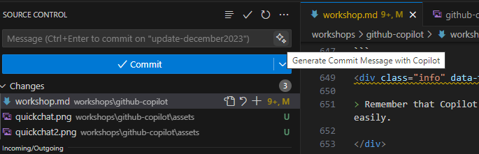
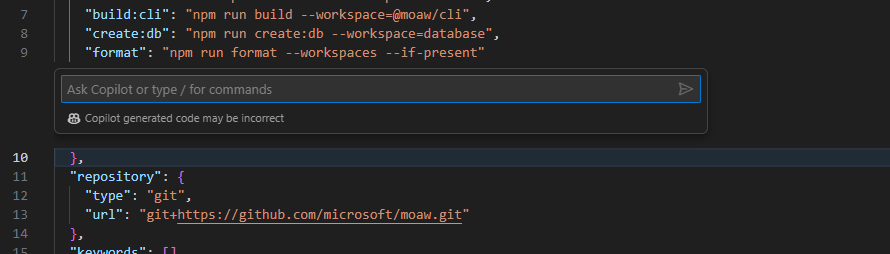

# Activate GitHub Copilot to become more efficient

The goal of this workshop is to learn how to use GitHub Copilot, using an exercise that consists of building a web server using Nodejs with different functionalities and a .NET Web API. In the second part, you'll learn how to use it for infrastructure as code but also to fix bad practices in terms of security.

GitHub Copilot is an AI-powered code assistant that helps developers write better code faster. It uses machine learning models trained on billions of lines of code to suggest whole lines or entire functions based on the context of what you’re working on. By using GitHub Copilot, you can learn how to write better code and improve your productivity.

<div class="warning" data-title="warning">

> GitHub Copilot is a quickly evolving product and thus this workshop may not be 100% up to date with the differentes features of the different extensions you are going to use. Please be clever if it's not exactly the same. For info, this page has been updated in December 2023.

</div>

## Pre-requisites

| | |
|----------------|-----------------|
| Node.js v16+   | [Download Node.js](https://nodejs.org) |
| .Net Core   | [Download .Net Core](https://dotnet.microsoft.com/download) |
| GitHub account | [Create free GitHub account](https://github.com/join) |
| GitHub Copilot Access | A 60 day trial can be [requested here](https://github.com/github-copilot/signup) |
| A code editor  | [Download VS Code](https://code.visualstudio.com/Download) |
| some VSCode extensions |  The first one [GitHub Copilot](https://marketplace.visualstudio.com/items?itemName=GitHub.copilot), and the other one allows you to have [GitHub Copilot Chat](https://marketplace.visualstudio.com/items?itemName=GitHub.copilot-chat).|
| A browser      | [Download Microsoft Edge](https://www.microsoft.com/edge) or any other one ;-)|

<div class="warning" data-title="Important">

> You also have to download some assets. They can be [downloaded here](assets/src/exercisefiles.zip).

</div>

## Work with GitHub Codespaces

The environment is already configured to work with [GitHub Codespaces](https://github.com/features/codespaces), you can find the configuration files in the *.devcontainer* folder.

To start programming just start a new codespace and you are ready to go, don't need to install anything.

## Work locally

You can also choose to work locally on your computer.

1. Install [Visual Studio Code](https://code.visualstudio.com/)
2. Install the [GitHub Copilot](https://marketplace.visualstudio.com/items?itemName=GitHub.copilot) extension
3. Install the [GitHub Copilot Chat](https://marketplace.visualstudio.com/items?itemName=GitHub.copilot-chat) extension
4. Install [Node and npm](https://docs.npmjs.com/downloading-and-installing-node-js-and-npm)
5. Install mocha

    ``` bash
    npm install --global mocha
    npm install axios
    ```

7. Install [Docker](https://docs.docker.com/engine/install/)
8. Install [.NET Core](https://dotnet.microsoft.com/download)

---

# First steps with Github Copilot

This section will guide you through the first steps with GitHub Copilot. You will learn what you can do and how to use it at his full potential. If you already feel confortable with it you can jump to the first challenge with NodeJS.

## Get ready

This first challenges needs you to clone the following GitHub Repository: [Github Copilot Demo](https://github.com/Philess/gh-copilot-demo)

This repository is a code starter that will help you experiment all capabilities with GitHub Copilot. Take the time to look at the architecture design displayed on the page and when you're ready, clone the repository from the command line and open it in VS Code.

``` bash
git clone https://github.com/Philess/gh-copilot-demo
cd gh-copilot-demo
code .
```

## Start playing with GitHub Copilot

Once you start typing a prompt and copilot generate proposals, you can use the following shortcuts to interact with Copilot:
    <ul>
        <li>`tab` to accept the current suggestion entirely (`most common`)</li>
        <li>`ctrl + right arrow` to accept word by word the suggestion (`for partial use`)</li>
        <li>`alt + ^` to move to next suggestion</li>
        <li>`shift + tab` to go back to the previous suggestion</li>
        <li>`ctrl+enter` to display the copilot pane</li>
    </ul>

<div class="tip" data-title="tip">

> If you can't remember it, just hover your pointer on top of a suggestion to make them appear.

</div>

## Natural Language Translations

**Automate text completion**

Open file `album-viewer/lang/translations.json`

```json
[
    {
        "language": "en",
        "values": {
            "main-title": "Welcome to the world of the future",
            "main-subtitle": "The future is now with copilot",
            "main-button": "Get started"
        }
    }
]
```

- Start adding a new block by adding a "," after the last "}" and press enter

<br>

## Code Generation

**What is a prompt?**
In the context of Copilot, a prompt is a piece of natural language description that is used to generate code suggestions. It's the input that Copilot uses to generate code. It can be a single line or a multiple lines description.

**Generate code from prompt**

Create a new `album-viewer/utils/validators.ts` file and start with the prompt:

```ts
// validate date from text input in french format and convert it to a date object
```

Copilot can help you also to write `RegExp patterns`. Try these:

```ts
// function that validates the format of a GUID string

// function that validates the format of a IPV6 address string
```

<br>

**Discover new tool and library on the job with Copilot**

Still on the same `album-viewer/utils/validators.ts` file add the following prompt:

```ts
// validate phone number from text input and extract the country code
```

<div class="info" data-title="info">

> For this one it will probably give you proposal that call some methods not defined here and needed to be defined. It's a good opportunity to explore the alternatives using the `ctrl+enter` shortcut to display the copilot pane.
<br>You can choose one that uses something that looks like coming for an external library and use copilot to import it showing that the tool helps you discover new things.

</div>

**Complex algoritms generation**

In the `albums-api/Controllers/AlbumController.cs` file try to complete the `GetByID` method by replace the current return:

```cs
// GET api/<AlbumController>/5
[HttpGet("{id}")]
public IActionResult Get(int id)
{
    //here
}
```

In the same file you can show other prompts like:

```cs
// function that search album by name, artist or genre

// function that sort albums by name, artist or genre
```

## Big tasks vs small tasks

### Big Prompts and Short Prompts

Copilot will probably will always more effective with prompt to generate small but precisely described pieces of code rather than a whole class with a unique multiple lines prompt.

<div class="tip" data-title="tip">

> The best strategy to generate big piece of code, is starting by the basic shell of your code with a simple prompt and then adding small pieces one by one.

</div>

**Big prompts that *could* works**

- Back in the `albums-viewer/utils` add a new file `viz.ts` to create a function that generates a graphe. Here is a sample of prompt to do that:

```ts
// generate a plot with D3.js of the selling price of the album by year
// x-axis are the month series and y-axis show the numbers of album selled
// data from the sales of album are loaded in from an external source and are in json format
```

<div class="info" data-title="info">

>Copilot will probably try to complete the prompt by adding more details. You can try to add more details yourself or follow copilot's suggestions. When you want it to stop and start generating the code just jump on another line and let the copilot do its work.

</div>

- Once you achieved to generate the code for the chart you probably see that your IDE warn you about the d3 object that is unknown. For that also Copilot helps.
Return on top of the file and start typing `import d3` to let copilot autocomplete

```ts
import d3 from "d3";
```

Look at what Copilot has been able to generate. It's possible that the code is working fine and does everything you asked for but also you probably hit the token limit and Copilot was not able to generate the whole code.

It's because Copilot for autocompletion is not made for creating big pieces of code at once, but is more specialized in generating small pieces step by step.

**Try again by build it step by step**

Try to generate the code for the plot by cutting it into small pieces following the steps below:

```ts
import * as d3 from 'd3';

// load the data from a json file and create the d3 svg in the then function
```

Inside the then function, starts by setting up the basics of the plot

```ts
// create the svg
```

```ts
// create the scales for the x and y axis
// x-axis are the month series and y-axis show the numbers of album selled
```

```ts
// create axes for the x and y axis
```

From there you can just ask to copilot to complete the chart

```ts
// generate a line chart based on the albums sales data
```

<div class="tip" data-title="tip">

>You will **always** get better results by cutting big task into small chunks with copilot autocomplete. It's also a good way to show that copilot is not magic and you have to use it with your other IDE feature and your developer logic.

</div>

## Tests

Copilot can help generate all kind of tests that are written with code. It Includes `unit tests, integration tests, end to end tests, and load testing` tests with JMeter scripts for example.

- Add a new file `validators.test.ts` in the `albums-viewer/tests` folder

- To have good test suggestion, you hould provide some basic informations to Copilot such as the test framework you want to use:

```ts
import { describe }
```

When you start typing the `describe` function, copilot will see you're in test file in TS and suggest you to import the `describe` and `it` functions from Mochai which is a famous test framework for JS/TS.
Accept the suggestion and it will automatically suggest also the `expect` function from Chai: accept it also.

```ts
import {describe, it} from 'mocha';
import {expect} from 'chai';
```

You have your test framework in place! Now just import the functions you want to test by starting a new line by `import` keyword copilot will see you are in a test file, to test some `validators` because of the name and it will suggest something like that:

```ts
import {validateAlbumId} from '../src/validators';
```

It looks ok but because Copilot doesn't have access to all your code, only the open tab and limited informations, you can see that both the path and the function name are wrong.
<br>
... At least he tried ...
<br>
but it's a good way to show that Copilot is not magic and you have to use it with your other IDE feature and your brain :)

- Accept the suggestion and change the path. You will be able to have VS Code to give you the available function with the `ctrl+space` shortcut.

- Add a comment with the first function you want to test and let the magic happen:

```ts
import {describe, it} from 'mocha';
import {expect} from 'chai';

import {validateDate, validateIPV6} from '../utils/validators';

// test the validataDate function
```

Boom!

```ts
describe('validateDate', () => {
    it('should return a date object when given a valid date string', () => {
        const date = '01/01/2019';
        const expectedDate = new Date(2019, 0, 1);
        expect(validateDate(date)).to.deep.equal(expectedDate);
    });

    it('should throw an error when given an invalid date string', () => {
        const date = '01/01/2019';
        expect(() => validateDate(date)).to.throw();
    });
});
```

*You can add other `it` block to add more test cases and also add the tests for the other functions. For example try add a new `it` block for the validateDate function to test that it throws and error when given en empty string.*

## Writing CI pipelines

*Copilot will help you in writing your pipeline definition files to generate the code for the different steps and tasks. Here are some examples of what it can do:*

- *generate a pipeline definition file `from scratch`*
- *accelerate the writing of a pipeline definition file by `generating the code` for the different `steps, tasks and pieces of script`*
- *help `discover marketplace tasks and extensions` that match your need*

### Step 1: generate from scratch

- Create a new file `pipeline.yml` in the `.github/workflows` folder of the project and start typing the following prompt:

```yml
# Github Action pipeline that runs on push to main branch
# Docker build and push the album-api image to ACR
```

*Copilot will generate the pipeline block by block. Generation pipelines Yaml, you will sometimes need to jump to a new line to trigger the generation of the next block more often than with other type of code.*

*It will often generate a task with a few errores coming from bad indentation or missing quote around a task name. You can easily fix these with your IDE and your developer skills :)*

### Step 2: add tasks from prompts

- You probably have a github action workflow with at least a "login" task to your container registry and a "docker build and deploy" task. Add a new comment after those tasks to tag the docker image with the github run id and push it to the registry:

```yml
# tag the image with the github run id and push to docker hub
```

you can play with other prompts like:

```yml
# run tests on the album-api image

# deploy the album-api image to the dev AKS cluster
```

### Step 3: add scripts from prompts

- Copilot is also very usefull when you need to write custom script like the following example:

```yml
# find and replace the %%VERSION%% by the github action run id in every appmanifest.yml file
```

## Infra As Code

Copilot can also help you write Infrastructure as code. It can generate code for `Terraform, ARM, Bicep, Pulumi, etc...` and also `Kubernetes manifest files`.

### Bicep

Open the `main.bicep`file in `iac/bicep` folder and start typing prompts at the end of the file to add new resources:

```js
// Container Registry

// Azure Cognitive Services Custom Vision resource
```

### Terraform

Open the `app.tf`file in `iac/terraform` folder and start typing prompts at the end of the file to add new resources:

```yml
# Container Registry

# Azure Cognitive Services Custom Vision resource
```

## Generate Git Commit comment

Yes, writing a comment should be mandatory and developers tend to be lazy. GitHub Copilot can help with that.

1. Just edit any file by adding some relevant content into it.

2. On the Git commit panel, click the small magical button on the right

    

3. Admire Copilot having generated a comment for you

    ![Generated comment(assets/git-commit2.png)

## Writing documentation

Copilot can understand a natural language prompt and generate code and because it's just language to it, it can also `understand code and explain it in natural language` to help you document your code.
So it can help you in all your documentation tasks. It can generate simple documentation comment or standardized documentation comment like JavaDoc, JsDoc, etc... it can also help you translate your documentation in different languages. Let's see how it works.

### simple documentation comment

To see that just put you pointer on top of a Class, a method or any line of code and start typing the comment handler for the selected language to trigger copilot. In language like Java, C# or TS for example, just type `// `and let the magic happen.

Here is an example in the `albums-viewer/routes/index.js` file. Insert a line and start typing on line 13 inside the `try block`

```js
router.get("/", async function (req, res, next) {
  try {
    // Invoke the album-api via Dapr
    const url = `http://127.0.0.1:${DaprHttpPort}/v1.0/invoke/${AlbumService}/method/albums`;

```

Continue to play with it and see what happens on other pieces of code.

### standardized documentation comment (JavaDoc, JsDoc, etc...)

For this one, to trigger the documentation comment generation, you need to respect the specific comment format:

-  `/**` (for JS/TS) in the `index.js` file for example
- `///` for C# in the `AlbumController.cs` of the AlbumApi file for example

```cs
/// <summary>
/// function that returns a single album by id
/// </summary>
/// <param name="id"></param>
/// <returns></returns>
[HttpGet("{id}")]
public IActionResult Get(int id)
```

### Writing markdown and html documentation

Copilot is also very powerfull to help you write documentation. It can generate `markdown` and `html` code and accelerate the writing of your readme.md files like for this one for example.

You can show that by creating a new file `demo.md` in the root of the project and start typing the following prompt:

```md
# Github Copilot documentation
This documentation is generated with Github Copilot to show what the tool can do.

##
```

From there by starting a new line with a secondary level title it will start generating the content of the documentation and it will showcase how it will accelerate the documentation writing process.

---

# Use Copilot Chat to improve code quality

GitHub Copilot is a generative AI and thus, perfect to generate code, but it has powerfull analysis capabilities on your code that can be used in several case to improve code quality like: find security issues, bad practices in your code and générate a fix, refactor and add comment to legacy code, generate tests, etc...

If you already feel confortable with it you can jump to the next section.

## Let's Start

To start using Github Copilot Chat, you first need to:

- Have a valid GitHub Copilot license (personal, business or enterprise).
- Install the extension in your IDE. For VS Code, you can find it directly by searching for `Github Copilot Chat` in the extensions tab.

### Clone the repository

We will use the same repository as the previous section to show how to use Copilot Chat to improve code quality. If you already have it, you can skip this step.

You need to clone the following GitHub Repository: [Github Copilot Demo](https://github.com/Philess/gh-copilot-demo)

This repository is a code starter that will help you experiment all capabilities with GitHub Copilot. Take the time to look at the architecture design displayed on the page and when you're ready, clone the repository from the command line and open it in VS Code.

``` bash
git clone https://github.com/Philess/gh-copilot-demo
cd gh-copilot-demo
code .
```

## Start playing with the Chat

Once Copilot Chat is setup, you can start using it:

- by accessing the **chat view** from the left toolbar of your IDE (chat icon)
- by pressing `Ctrl` + `Shift` + `i` shortcut for a quick **inline question** to the chat

The first one is a sticky version, very usefull to keep the chat open and ask questions to copilot.
The second one is a quick way to ask a question and get an answer and launch commands.

### Chat View

The chat view gives you a full chat experience, integrate as any other tool view in your IDE. Once the view is open you can start chatting with Copilot as your personnal code coach. It keeps the history of the conversation and you can ask question related to the previoius answers. It also provides suggestions for questions along the way. You can:

- ask general question about coding on any language or best practice
- ask to generate or fix code related to the current file and inject the code directly in the file

It's a more high level copilot than the vanilla copilot which is specialized on providing code completion.

Try it with a few questions like:

```text
> How to generate a random number in C#?
> What is the best way to secure a route is ASP.NET Core?
> What is the easiest way to generate a static website with NodeJS?
```

Try it then with some of your code files in the repository. Open a file a try asking:

```text
> Can you explain me what this code does?
> (with only part of the code selected) Can you explain me what the selected code does?
> Can you generate a function that returns a random number between 1 and 10?
> Can you add documentation commentes to this function?
```

Try also using the questions suggestions that appears along the way.

### Inline question

The inline question is a quick way to ask a question to Copilot and get an answer. It's a good way to ask a question about a specific piece of code. It's also a good way to launch commands to Copilot. You can ask it to generate code, fix code, generate tests, etc...

try it by pressing `Ctrl` + `Shift` + `i` and type the same type of commands you tried in the chat view.

### Slash Commands

To further help Copilot give you more relevant answers, you can choose a topic for your questions through "slash commands."

You can prepend your chat inputs with a specific topic name to help Copilot give you a more relevant response. When you start typing /, you’ll see the list of possible topics:

- **/explain**: Explain step-by-step how the selected code works.
- **/fix**: Propose a fix for the bugs in the selected code.
- **/help**: Prints general help about GitHub Copilot.
- **/tests**: Generate unit tests for the selected code.
- **/vscode**: Questions about VS Code commands and settings.
- **/clear**: Clear the session.

## Secure your code

Copilot can help you find security issues in your code and fix them. It can also help you find bad practices in your code and fix them. Let's see how it works.

Open the `album-api/Controllers/UnsecuredController.cs` file and type questions like these to the chat:

```text
> Can you check this code for security issues?
> Do you see any quality improvement to do on this code?
```

Once you have the answer, you can ask to fix the issues by typing:

```text
> Can you propose a fix?
```

When you have the fix in the code you choose to **copy it or inject it directy in the file** by hovering the code block in the chat and selecting the right option on the top left.

## Code Explanation and documentation

You can use Copilot Chat to explain code to you. It can `explain you the code in natural language or generate documentation comments for you`. Let's try that with the following commands:

```test
> /explain
> Generate documentation comments for this code
```

## Code Refactoring

More impressive, Copilot chat can help you refactor your code. It can help you `rename variables, extract methods, extract classes, etc...`.

You can try some of these commands on the `album-api/Controllers/UnsecuredController.cs` file:

```test
> extract methods
> create Async version of each methods when it makes sense
```

## Code Translation

*Copilot can understand and generate natural languages and code language in both way so by combining everything you can use it to `translate code pieces from a language to another one`*

To translate a piece of code in a specific language, open it and ask to the chat to translate it to another language. For example open the `validators.ts` file created in the first section dedicated to Copilot autocompletion and ask to translate it to C for example.

In case of dealing with Legacy code like COBOL for example it can be very useful. Open the `legacy/albums.cbl` file and try translating the code to Python.

## Tests generation

Copilot can also help you generate tests for your code. It can generate `unit tests, integration tests, end to end tests, and load testing` tests with JMeter scripts for example.

Open the `album-api/Controllers/UnsecuredController.cs` file and type questions like these to the chat:

```test
> Generate a unit tests class for this code
```

You can also use copilot to help you generate Stubs and Mocks for your tests.

```text
> Generate a mock for FileStream class
> Use that mock in the unit tests
```

<div class="info" data-title="note">

> Remember that Copilot chat is keeping track of the previous Q & A in the conversation, that's why you can reference the previously generated mock and test easily.

</div>

## Use Chat participants

Chat participants are like specialized experts who can assist you with specific tasks. You can mention them in the chat using the @ symbol. Currently, there are three Chat participants available for Visual Studio Code:

- **@workspace**: This chat participant has knowledge about the code in your workspace and can help you navigate it by finding relevant files or classes. The @workspace chat participant uses a meta prompt to determine what information to collect from the workspace to help answer your question.
- **@vscode**: This chat participant is knowledgeable about commands and features in the VS Code editor itself, and can assist you in using them.
- **@terminal**: This chat participant has context about the Visual Studio Code terminal shell and its contents.

They may not be super rich for the moment but their features will continue to grow over the time. Here are some example

Open the side Chat panel and type **@workspace /New* to specify that you want to create a new project. For instance, try to create an Asp.Net project

```text
> @workspace /new create a new asp.net core 6.0 project, with three views Index, Users and products.
```

It should create a structured project and even a new button to create the file. Click on "Create workspace" to see files being created.


## Tips

GitHub Copilot Chat is very handful but for a developer, leaving the keyboard and having to take the mouse to open the Chat tab can be boring. You can directly call the Chat inside the code editor.

1- Open any file containing code

2- Use the shortcut **Ctrl + i**. It should open the Quick chat popup, a small chat windows where you put your cursor



3- Type any command to generate some code (i.e. "Create a C# class named Toto). The generated code is injected inside the current file which may be what you want

---

# Prompt engineering in Copilot Chat

In the previous section you discovered how to use basic prompts to get code from Copilot Chat. In this section you will learn techniques to get more accurate results using prompt engineering techniques.

**What is prompt engineering?**
Prompt engineering is the process of designing high quality prompts to generate high quality code suggestions. There are good practices and tips to write better prompts. Let's see some of them.

## Provide examples: one-shot and few-shots programming

Talking about prompt engineering, you can also use the chat to provide examples to Copilot. It's a good way to help Copilot understand what you want to do and generate better code. You can provide examples in the chat by typing with the validator.ts file open:

```bash
# one-shot programming

Write me unit tests for phone number validators methods using mocha and chai in the current file.
Use the following examples for positive test (test that should return true): 
it('should return true if the phone number is a valid international number', () => { expect(validatePhoneNumber('+33606060606')).to.be.true; });
Organize test in logic suites and generate at least 4 positives tests and 2 negatives tests for each method.
```

```bash
# few-shot programming

Write me unit tests for all validators methods using mocha and chai in the current file.
Use the following examples for positive test (test that should return true): 
it('should return true if the phone number is a valid international number', () => { expect(validatePhoneNumber('+33606060606')).to.be.true; });
it('should return true if the phone number is a valid local american number', () => { expect(validatePhoneNumber('202-939-9889')).to.be.true; });
it('should throw an error if the given phone number is empty', () => { expect(validatePhoneNumber('')).to.throw(); });
Organize test in logic suites and generate at least 4 positives tests and 2 negatives tests for each method.
```

You can use this technique to **generate code that keeps the styling code from another file**. For example if you want to create sample records for music style like the Albums in albums-api>Models>Album.cs file, open it and type:

```bash
Write a MusicStyle record that conatins a List<MusicStyle> with 6 sample values like in the Album.cs file.
```

## Provide external references

The chat copilot can use external references to build more accurate suggestions. For exemple if you want to generate a code that make a request to an API you can provide an example of the API response in the chat or the url to the API reference. Copilot will use it to generate better code.

```bash
Write a TS function that retreiev all dog breeds from the following API and return an array of Breed objects Request: HTTP GET https://dog.ceo/api/breeds/list/all
```

Copilot will use the given external reference to generate the code. You will see that he wil generate the Breef interface (or class) with a subBreeds property. It's coming from the API given by the external reference.

```ts
interface Breed {
  name: string;
  subBreeds: string[];
}
```

<div class="tips" data-title="tip">

> You can also provide links to external documentations like SDK, libraries, etc... or event normative documents like RFCs, etc...

</div>

## Role Prompting

Also called foundational prompt, it's a general prompt you're giving to Copilot Chat to personnalise his behavior and setup your flavour of Copilot.

This is probably the first thing to do when you start a new task with Copilot Chat: **provide a clear description of what you want to build and how do you want copilot to help you**.

<div class="warning" data-title="Important">

> **This is very powerfull when handled properly** so be sure to start every coding sessions with a role prompt and save your best prompt for future use.

</div>

***Structure of a role prompt***

What can you include in a role prompt:

- Provide solid context and background information on what you want to build.
- Define GitHub Copilot’s role and setting expectations about what feedback we are looking for.
- Be specific in the quality of answers and ask for reference and additional resources to learn more and ensure the answers you receive are correct
- Resume the task and ask if the instructions are clear

***Example of a role prompt***

Start a new conversation and type the following prompt:

```bash
I'm working on a new mobile application that is built on React Native. 
I need to build a new feature that will allow the user to upload a picture of a dog and get the breed of the dog. 
I will need to use the following set of APIs to work on the breeds: https://dog.ceo/api/breeds. I need to be sure that my code is secured againt at least the OWASP Top 10 treats (https://owasp.org/Top10/). 
I need to have unit tests for the code and i want my application to be fully accessible and conforms with the WCAG 2.1 level A and AA success criteria defined at https://www.w3.org/TR/WCAG21/.
I need you to act as my own code coach to ensure that my code fits all these requirements. 
When possible, please provide links and references for additional learning. 
Do you understand these instructions? 
```

From there you can start asking questions and from time to time, ensure Copilot still follows the instructions by asking:

```bash
Are you still using the instructions I provided?
```

***Test your role prompt***

You can test your role prompt by asking questions about best practices for accessibility on React Native Apps and OWASP Top 10 treats. You can also ask to generate code for the upload feature and check if the generated code is secured and accessible.

Try these questions for example:

```bash
how can i make my app accessible with react native?

what is the most secure way to upload a photo from my app?
```

---

# Develop a NodeJS server

In this first exercise, you are going to develop a real project following functional requirements. You can do it by yourself or...with the help of GitHub Copilot.

## Instructions

- Download to local the [exercicefile](assets/src/exercisefiles.zip) folder
- Open `nodeserver.js` and begin by writing a Nodejs server, check the first suggestions based on the initial text
- Open `test.js` file and analyze the current test
- Open a command prompt and run the test (`mocha test.js`)
- See the result, it should display something like:

``` bash
mocha test.js
server is listening on port 3000

  Node Server
    
    √ should return "key not passed" if key is not passed

  1 passing (34ms)

```

- In the `nodeserver.js` develop the rest of the methods described in the Exercise described in the section below
  
> Do not forget to open `color.json` file in Visual Studio Code, so GitHub Copilot get all the context to make better recommendations

- In the test.js file add the methods to test the functionality
- Run the tests to verify that all is working
- Open the `dockerfile` file, and fill it, to create a docker container with a node image that can run the web server
- Create a command to run docker in port 4000
- Test that the application is working in port 4000
- In the **nodeserver.js** file, you can type a new line like `//run a curl command to test the server` so we can see how GitHub Copilot based on the current file produces a curl command, to be executed in the command line.
- Note: you can be more specific like `//run a curl command to test the daysBetweenDates` method. It should generate a test for a specific method

## Exercise

You must now develop and add new features to your server. The requests that the server must attend are the following:

<div class="tip" data-title="tip">

> As you type GitHub Copilot will make suggestions, you can accept them by pressing Tab. If nothing shows up after GitHub Copilot write some lines, press enter and wait a couple of seconds. On Windows or Linux, press Ctrl + Enter.

</div>

<div class="info" data-title="note">

> There are a lot of code to write but you may be surprised by the time it will take to you to complete it. You can also only write 7 or 8 of them if you want, the exercise is not meant to be boring.

</div>

| Method | Requirements|
|---|---|
|**/Get**|Return a hello world message|
|**/DaysBetweenDates**|Calculate days between two dates. <br/>Receive by query string 2 parameters date1 and date 2 , and calcualte the days that are between those two dates.|
|**/Validatephonenumber**|Receive by querystring a parameter called `phoneNumber`. <br/>Validate `phoneNumber` with Spanish format, for example +34666777888<br/>if `phoneNumber` is valid return "valid"<br/>if `phoneNumber` is not valid return "invalid"|
|**/ValidateSpanishDNI**|Receive by querystring a parameter called `dni`. calculate DNI letter<br/>if DNI is valid return "valid"<br/>if DNI is not valid return "invalid"<br/>We will create automated tests to check that the functionality is correctly implemented.<br/>When the development is completed, we will build a container using Docker|
|**/ReturnColorCode**|Receive by querystring a parameter called `color`<br/>read `colors.json` file and return the `rgba` field<br/>get color var from querystring<br/>iterate for each color in colors.json to find the color<br/>return the code.hex field|
|**/TellMeAJoke**|Make a call to the joke api and return a random joke using axios|
|**/MoviesByDirector**|(this will require to browse to [https://www.omdbapi.com/apikey.aspx](https://www.omdbapi.com/apikey.aspx) and request a FREE API Key)<br/>Receive by querystring a parameter called director<br/>Make a call to the movie api and return a list of movies of that director using axios<br/>Return the full list of movies|
|**/ParseUrl**|Retrieves a parameter from querystring called someurl<br/>Parse the url and return the protocol, host, port, path, querystring and hash<br/>Return the parsed host|
|**/ListFiles**|Get the current directory<br/>Get the list of files in the current directory<br/>Return the list of files|
|**/GetFullTextFile**|Read `sample.txt` and return lines that contains the word "Fusce". (becareful with this implementation, since this normally reads the full content of the file before analizing it, so memory usage is high and may fail when files are too big)|
|**/GetLineByLinefromtTextFile**|Read `sample.txt` line by line<br/>Create a promise to read the file line by line, and return a list of lines that contains the word "Fusce"<br/>Return the list of lines|
|**/CalculateMemoryConsumption**|Return the memory consumption of the process in GB, rounded to 2 decimals|
|**/MakeZipFile**|Using zlib create a zip file called `sample.gz` that contains `sample.txt`|
|**/RandomEuropeanCountry**|Make an array of european countries and its ISO codes<br/>Return a random country from the array<br/>Return the country and its ISO code|

## GitHub Copilot Chat exercises

These tasks can be performed with the [GitHub Copilot Chat](https://marketplace.visualstudio.com/items?itemName=GitHub.copilot-chat) add-in.

- **Explain**

Select the line that has the regex in the validatePhoneNumber method, and use `/explain` comamand. You will see an explanation detailing what each different notation does in the regular expression.

- **Language translation**

Select some source code, like this line:

``` js
var randomCountry = countries[Math.floor(Math.random() * countries.length)];
```

Ask to the chat to translate it to another language, for example Python. You should see new code generated in **python**

- **Readable**

Select the content of MakeZipFile

Ask to the chat to make it more readable. See how comments are added and also variables that have short names are renamed to more understandable names.

- **Fix Bug**

In the exercise, there should be no bugs, since most of the code will be done by GitHub Copilot. We can force some errors and then test the debug functionality.

Force some errors like:

In a for loop change the beginning to (change the 0 for a 1):

``` js
    for (var i = 1
```

select the text and ask to the chat to fix the bug.

- **Make robust**

Select some text that comes from input, for example, variables that come from query string:

``` js
        var queryData = url.parse(req.url, true).query;
        var date1 = queryData.date1;
        var date2 = queryData.date2;
```

Ask to the chat to make it robust, and you will see that additional validation is added.

- **Document**

Select some line (e.g. a method or the beginning of the if clause)

``` js
    else if (req.url.startsWith('/GetFullTextFile')) 
```

Ask to the chat to document it. You will see that Copilot chat will explain what the code does and add comments to the code.

---

# .Net Core

The goal is to create a simple WebAPI using .NET 6.0 and Docker with the help of GitHub Copilot.
Follow the instructions below and try to use GitHub Copilot as much as possible.
Try different things and see what GitHub Copilot can do for you, like generating a Dockerfile or a class, adding comments, etc.

Remember:

Make sure GitHub Copilot is configured and enabled for the current language, just check the status bar on the bottom right corner of VS Code.

## Create dotnet WebAPI project

- Create a new NET project using

``` powershell
dotnet new webapi
```

- Create a new file `User.cs` in the Models folder, and instruct Copilot to generate a class for you.

- Add a new file `UserController.cs` in the Controllers folder that inherits from ControllerBase, and instruct Copilot to generate a controller for you.

- Add `ApiController` and Route attributes to the class.

- Add a new file `IUserService` in the Abstractions folder, and instruct Copilot to generate an interface for you.

- Run the app using (if you are working with GitHub Codespaces you may need to remove HTTPS redirection from `Program.cs` )

```  powershell
dotnet run
```

- Implement the interface IUserService in `UserService.cs` in the Services folder and add some comments so GitHub Copilot be able to generate the implementation for you.

- Instruct Copilot to generate a List for Users and the Add and Get Methods using the list.

- Go to `Program.cs` a inject the `IUserService` before building the app.

``` csharp
builder.Services.AddSingleton<IUserService, UserService>();
```

- Run the app using

``` powershell
dotnet run
```

> If you run into and "No server certificate was specified..." error, run the following command

``` powershell
dotnet dev-certs https
```

- Forward port if needed

- Navigate to your address /swagger. Example: [https://leomicheloni-supreme-space-invention-q74pg569452ggq-5164.preview.app.github.dev/swagger/index.html](https://leomicheloni-supreme-space-invention-q74pg569452ggq-5164.preview.app.github.dev/swagger/index.html)

## Put the application into a Docker container

- Publish the app and put it in a folder called _publish_

``` dotnet
dotnet publish -c Release -o publish
```

- Using the existing `Dockerfile`, put the app in a container and run it (add more instructions or start to write code and let GitHub Copilot complete it for you)
- Build the image and run the app on port 8080

``` powershell
docker build -t dotnetapp .
docker run -d -p 8080:80 --name dotnetapp dotnetapp
```

---

# Infrastructure as Code

Generating code from a programming language is one thing, but can GitHub Copilot help to generate configurations such as Terraform, Bicep, etc?

For this exercise, you want to deploy your previously developed Web application and want to host it on Azure. Here are the requirements:

- The application will be hosted on an Azure Web App name `my-webapp`
- The App Service Plan (CPU & Memory) is named `my-plan` and is using the SKU (size) `B1`
- The Web app is hosted in West Europe in a resource group name `oh-yeah`

<div class="tip" data-title="tip">

> There are several ways of using GitHub Copilot for that. For instance, you can write several consecutive lines of comments before letting GitHub Copilot giving recommandations. Furthermore, if the result is not conclusive, you can open a side panel to generate 10 alternatives suggestions. To do so, click `ctrl` + `Enter`

</div>

---

# Solutions

Here you can find the solution to the different exercises.

## Coding

The solution of the coding exercise can be [downloaded here](assets/src/completesolution.zip)

## Infrastructure As Code

This part is the easiest one but GitHub Copilot can randomly generate bad or commented code.

``` bicep
param webAppName string = 'my-webapp'
param webAppPlanName string = 'my-plan'
param webAppPlanSku string = 'B1'
param webAppPlanLocation string = 'westeurope'
param resourceGroupName string = 'oh-yeah'

resource appServicePlan 'Microsoft.Web/serverfarms@2021-02-01' = {
  name: webAppPlanName
  location: webAppPlanLocation
  kind: 'app'
  sku: {
    name: webAppPlanSku
    tier: 'Basic'
    size: 'B1'
  }
}

resource webApp 'Microsoft.Web/sites@2021-02-01' = {
  name: webAppName
  location: webAppPlanLocation
  kind: 'app'
  properties: {
    serverFarmId: appServicePlan.id
  }
}

resource resourceGroup 'Microsoft.Resources/resourceGroups@2021-04-01' = {
  name: resourceGroupName
  location: webAppPlanLocation
}
```

## DevSecOps

GitHub Copilot may not be able to fix and refactor all the code (for instance using the `fix bug` prompt) but it is pretty good to recognize code smells and bad practices if you ask through the chat.

Several security flaws are present in this short piece of code. You should have at least found 4 major bad practices:

This code seems innocent but it could allow [Path injection](https://learn.microsoft.com/en-us/dotnet/fundamentals/code-analysis/quality-rules/ca3003). It means someone can try to access another file on the disk.

``` csharp
using (FileStream fs = File.Open(userInput, FileMode.Open))
    {
        //         If possible, limit file paths based on user input to an explicitly known safe list. For example, if your application only needs to access "red.txt", "green.txt", or "blue.txt", only allow those values.
        // Check for untrusted filenames and validate that the name is well formed.
        // Use full path names when specifying paths.
        // Avoid potentially dangerous constructs such as path environment variables.
        // Only accept long filenames and validate long name if user submits short names.
        // Restrict end user input to valid characters.
        // Reject names where MAX_PATH length is exceeded.
        // Handle filenames literally, without interpretation.
        // Determine if the filename represents a file or a device.

        byte[] b = new byte[1024];
        UTF8Encoding temp = new UTF8Encoding(true);

        while (fs.Read(b, 0, b.Length) > 0)
        {
            return temp.GetString(b);
        }
    }

    return null;
}
```

This one is a famous example of [SQL Injection](https://learn.microsoft.com/en-us/dotnet/fundamentals/code-analysis/quality-rules/ca3001). The best thing to do is to use a parameter that will handle any attempt of escape code or wrong parameter boxing (type).

``` csharp
public int GetProduct(string productName)
{
    using (SqlConnection connection = new SqlConnection(connectionString))
    {
        SqlCommand sqlCommand = new SqlCommand()
        {
            CommandText = "SELECT ProductId FROM Products WHERE ProductName = '" + productName + "'",
            CommandType = CommandType.Text,
        };

        // The secure way
        // SqlCommand sqlCommand = new SqlCommand()
        // {
        //     CommandText = "SELECT ProductId FROM Products WHERE ProductName = @productName",
        //     CommandType = CommandType.Text,
        // };
        // sqlCommand.Parameters.AddWithValue("@productName", productName);

        SqlDataReader reader = sqlCommand.ExecuteReader();
        return reader.GetInt32(0); 
    }

}
```

A general good practice is to never display ([Disclosing information](https://learn.microsoft.com/en-us/dotnet/fundamentals/code-analysis/quality-rules/ca3004)) any technical error to the end-user. It can show the used technology, the version of a plugin or even the stack trace which are additional information an attacker could use against your application.

``` csharp
public void GetObject()
{
    try
    {
        object o = null;
        o.ToString();
    }
    catch (Exception e)
    {
        this.Response.Write(e.ToString());
        // better to do
        // myLogger.Log(e.ToString()); // or any way to log the exception information
        // this.Response.Write("An exception has occured"); // return a generic message
    }

}
```

This one is tricky and simple at the same time. The connectionString may contain credentials and must NEVER be hard coded. You can't change it easily but more important, anyone accessing the source code can get access to the secret.

``` csharp
private string connectionString = "";
```

---

# Credits

This workshop's challenges are a fork from the original Hackaton [accessible here](https://github.com/microsoft/CopilotHackathon). We just wanted to integrate it into the [MOAW](https://github.com/microsoft/moaw) format and add some exercises.

Role Prompts described in the Prompt engineering section are inspired by this [great blog post](https://github.blog/2023-10-09-prompting-github-copilot-chat-to-become-your-personal-ai-assistant-for-accessibility/) from Github's engineers [Ed Summers](https://github.com/edsummersnc) and [Jesse Dugas](https://github.com/jadugas).

A big thanks to them <3
