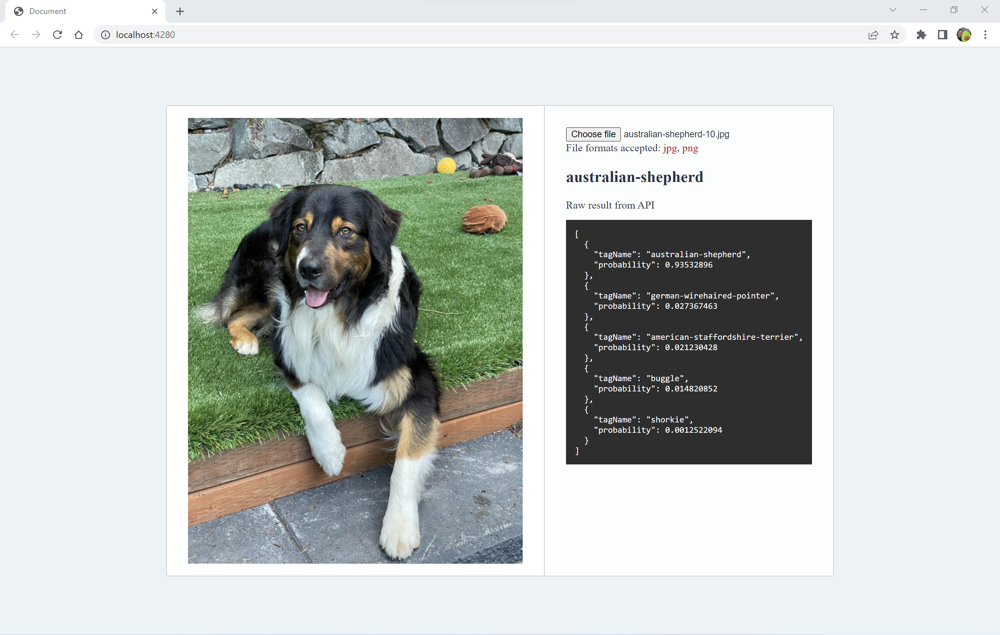
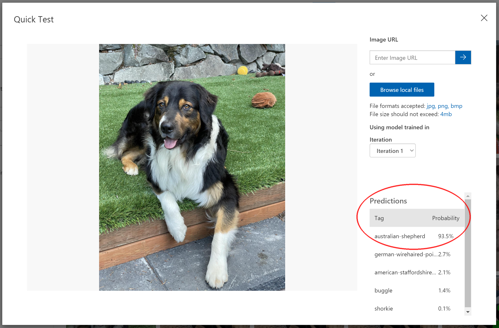
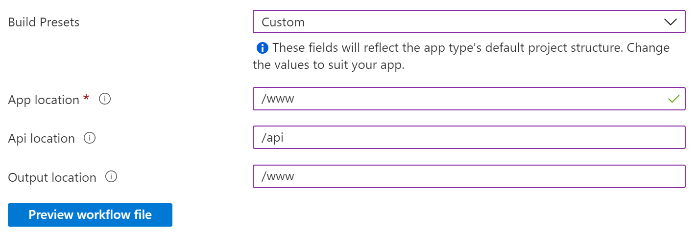
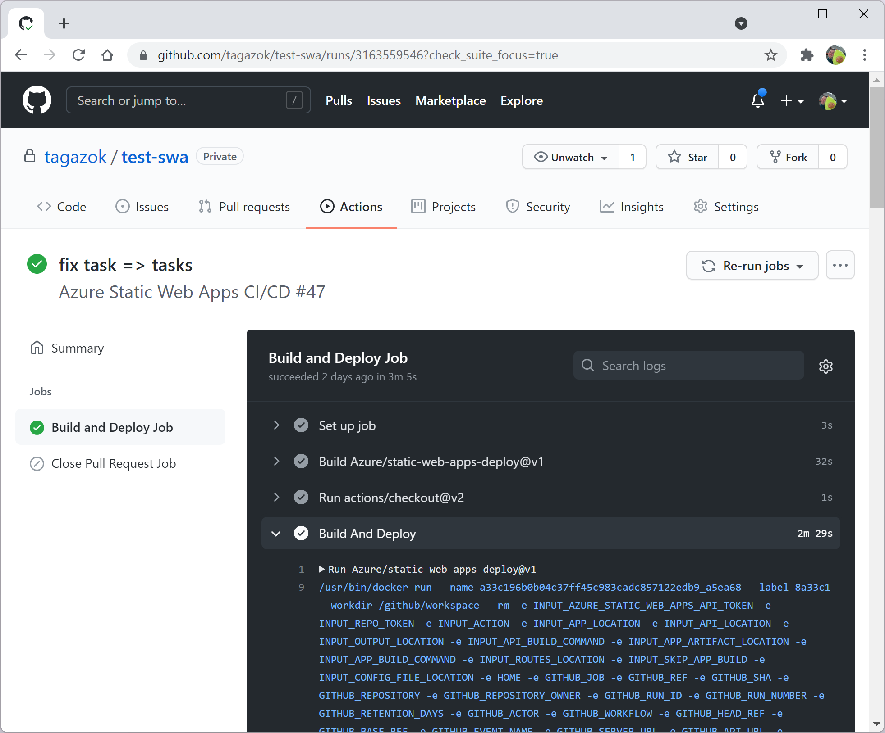
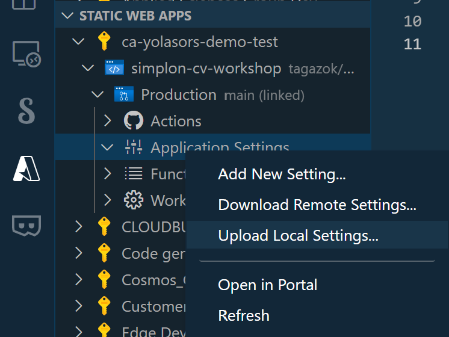
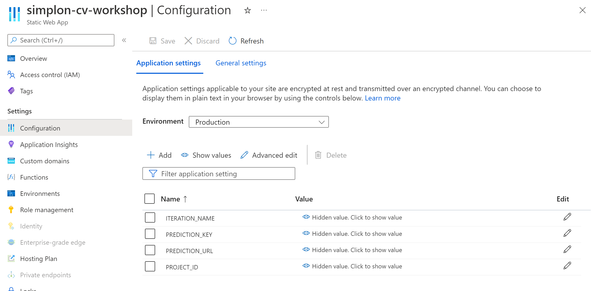

# Machine Learning with Custom Vision

In this workshop, you will learn how to build a model to detect dog breeds. You'll start by installing and configuring the necessary tools, then creating the custom model by uploading and tagging images. And finally, you will use the model using the Custom Vision REST API and the Software Development Kit (SDK).

<center><small>Train your model on the Custom Vision portal</small></center>


<center><small>Deploy an application to detect dog breeds</small></center>



## Prerequisites

To do this workshop, you will need:
* Basic JavaScript or Python knowledge
* [A Microsoft Azure account](https://azure.microsoft.com/free/)
* [A GitHub account](http://github.com/)
* [Visual Studio Code](https://code.visualstudio.com/) (VSCode)
* [Node.js 14 or 16 installed](https://nodejs.org/)
* Python 3.8 or greater with pip installed
* [Azure Functions Core Tools](https://learn.microsoft.com/azure/azure-functions/functions-run-local?tabs=v4%2Clinux%2Ccsharp%2Cportal%2Cbash)

---

## Create the Azure resources

As with any project, a few tools are going to be needed. In particular you'll need a code editor, an Azure subscription, and a couple of keys for Custom Vision.

Start by opening the [Custom Vision dashboard](https://ms.portal.azure.com/#blade/Microsoft_Azure_ProjectOxford/CognitiveServicesHub/CustomVision) in the Azure Portal. Then, click on the `+ Create` button or the `Create custom vision` button if you don't have any custome vision yet. This link will take you to the Custom Vision creation form. You may be prompted to log into your Azure Subscription. If you don't have one you can create a Free trial.  

Let's fill it out!

* Select `Both` for `Create options` as we are going to use our resource to both train our model and make predictions.
* Select your Subscription.
* Create a new Resource Group.

<div class="info">

> In Azure, a Resource Group is a logical structure that holds resources usually related to an application or a project. A Resource Group can contain virtual machines, storage accounts, web applications, databases and more.

</div>

* Select `West Europe` as Region if you are in Europe or choose the region closest to you.
* Give a Name to your project, for instance "simplon-workshop".
* Select the Free `F0 Plan` for the training and prediction pricing tiers.

<div class="tip" data-title="tip">

> It is recommended to host your resource in a region close to your users.

</div>

* Click on `Review + Create` (not on `Next`) and then on `Create`.

After a few minutes, your Custom Vision resource will be created on Azure.

You now have all the necesary tools for creating your custom vision model.

---

## Train your model  

### Create your Custom Vision Project

Custom Vision lives in another platform than the Azure Portal. Now that you have created your resource, let's use the Custom Vision Portal to train your model.

First, navigate to [Custom Vision](https://www.customvision.ai) and sign-in with your account.

* Select `New Project`
* Enter `Dog Classification` for the project name 
* Select the resource you created in the previous step of the workshop
* Select `Classification` as `Project Types`

<div class="info">

> Image classification tags whole images where Object Detection finds the location of content within an image.

</div>

* Select `Multiclass` for `Classification Types` as our dogs will only have one breed
* Select `General [A2]` for `Domain` as our dogs are not related to any other domain
* Click on the `Create project` button

<div class="info">

> You can find more information about the differences between Domains in the [Custom Vision documentation](https://docs.microsoft.com/azure/cognitive-services/custom-vision-service/select-domain).

</div>

### Upload your images

Once the project is created, it's time to upload images. These images will be used to train your model.

<div class="tip" data-title="tip">

> As a general rule, the more images you can use to train a model the better. You want to include as much variety in the images as possible, including different lightning, angles, and settings.

</div>

We will provide you with a few images of dogs to train your model. Download this [Training images set](assets/training-images.zip) and extract the zip file.

Now, go in the Custom Vision portal:
* Click on `Add images`
* Navigate to the `training-images` folder you just downloaded
* Select all the images marked as `american-staffordshire-terrier` in the folder, and click `Open`.
* Enter `american-staffordshire-terrier` for the tag and click `Upload 8 files`
* Click `Done`
* Click on `Add images` and repeat the above steps for the other breeds.
  * `australian-shepherd`
  * `buggle`
  * `german-wirehaired-pointer`
  * `shorkie`

### Train your model

Now that you have uploaded and tagged your images, it's time to train your model.

* Click on the `Train` button to open the training dialog.
* Leave `Quick Training` selected and click `Train` to begin the training process.

It will take between 2 to 5 minutes to train your model.

---

## Test & Publish your model

With the model trained, it's time to turn our attention to using it. We'll start by testing it in the Custom Vision website. Then we'll explore how we can call the model from our code by using the REST API or the SDK.

### Test your model in the Custom Vision portal

Let's see how well our model works. **It's important to use images which weren't used to train the model**. After all, if the model has already seen the image it's going to know the answer. Start by downloading the [Testing images set](assets/testing-images.zip) and extract the zip file.

Then, in the Custom Vision portal
* Click on the `Quick Test` button
* Select `Browse local files`
* Navigate to the `testing-images` folder you just downloaded	and select one of the dog images
* Click `Open`

Notice the `tag` and `probability` scores. The `tag` is the breed of the dog, and the `probability` is the confidence that the model has in its prediction. Try with another images :)



### Publish your model

Playing with your model in the Custom Vision portal is funny. But, the goal of creating a model in Custom Vision is to use it in different applications. To access it from outside of the Custom Vision website it needs to be published.

* Go to the `Performance` tab and click `Publish`
* Enter `dogs` as `Model name`
* Select the resource in your subscription named `myresource-Prediction`
* Click `Publish`

---

## Azure Static Web App

### What is Azure Static Web Apps (SWA)

Azure SWA is a service that enables developers to deploy their web applications on Azure in a seamless way. This means developers can focus on their code and spend less time administrating servers!

So, with Azure SWA, developers can not only deploy frontend static apps and their serverless backends but they can also benefit from features like `Custom domains`, `pre-prod environments`, `authentication providers`, `custom routing` and more.
 
### Who is it for?
Azure SWA is for every developer who wants to spend more time in their code editor than they do managing resources in the cloud.

If you are a so-called "Full stack developer", then you probably want to deploy both your frontend and your backend to the cloud, ideally with limited administration and configuration management.

### Frontend developers
Azure SWA supports many frameworks and static site generators out of the box. If you are using a framework like `Angular`, `React`, `Vue.js`, a site generator like `Gatsby`, `Hugo` or one of the many solutions Azure SWA supports, then you don't have to take care of the deployment. If you have a specific need to customise the build for your app, you can configure it yourself very easily!

### Backend developers
Azure SWA relies on `Azure Functions` for your application backend. So, if you are developing in `JavaScript`, `Java`, `Python` or `.NET`, SWA makes it very easy to deploy your backend as well!

<div class="info">

> You can find the official SWA documentation here: [https://aka.ms/swadocs](https://aka.ms/swadocs)

</div>

Oh, and did I forget to mention there is a Free tier for SWA? You can start using it for free and only pay once your application gets popular!

---

## Get the website template

Once upon a time, there was a website that needed a place to live, be visible to the world and have a backend to be more interactive.

For this workshop, we won't ask you to create a website from scratch. As we want you to focus on the Custom Vision integration, we've built one for you.

Go to [this GitHub repository](https://github.com/themoaw/template-customvision-workshop) and click on `Use this template`. 


You will be redirected to the repository creation page. Just enter `customvision-workshop` as name for your new repository and click on `Create repository from template`.

<div class="task" data-title="Task">

> Create the repository from the GitHub Template and clone it on your computer.

</div>

You now have your baseline project. Open the `customvision-workshop` folder in VSCode.

---

## Create an Azure Static Web App

Start by opening the [Create Static Web App form](https://portal.azure.com/#create/Microsoft.StaticApp) in the Azure Portal. This link will take you directly to the Static Web App creation form. You may be prompted to log into your Azure Subscription. If you don't have one you can create a Free trial.  

Let's fill it out!

* Select your Subscription.
* Select your Resource Group.

<div class="info">

> In Azure, a Resource Group is a logical structure that holds resources usually related to an application or a project. A Resource Group can contain virtual machines, storage accounts, web applications, databases and more.

</div>

* Give a Name to your Static Web App, for example `my-swa`.
* Select the Free Plan (we won't need any feature in the Standard Plan for this workshop).
* Select `West Europe` for your backend.

<div class="tip" data-title="tip">

> It is recommended to host your backend in a Region closest to your users.

</div>

* Select `GitHub` as a deployment source.

We are going to host our website source code on GitHub. Later in the workshop, we will see how Static Web Apps will automaticalLy deploy our website every time we push new code to our repository.

* Sign in with your GitHub account
* Select the organization (your account), the repository(customvision-workshop) and the branch of your project (main).

As we mentioned at the beginning of the workshop, our app will have a backend and a frontend. In order for Static Web App to know what to deploy and where, we need to tell it where our apps are located in our repository.

Azure Static Web Apps can handle several well-known frontend frameworks and can "compile" your Angular, React or Hugo application before deploying them.

In our case, we have a very simple JavaScript application which does not require anything to run. So in the Build Presets option, let's choose `Custom`.
* In the `App location`, enter the `/www` folder as this is where our frontend is.
* In the `Api location`, enter the `/api` or `api` (depending on your preference) folder as this is where our backend is.
* In the `Output`, enter the `/www` folder as your frontend does not need any build system to run.



* Click on `Review + Create` and then on `Create`.

After a few minutes, your Static Web App will be created on Azure and your website deployed.

Once the resource is created, you should `pull` your repository in VSCode as a few files have been added to your GitHub repo by Azure.

## So, what just happened?

### On GitHub

When Azure created your Static Web App, it pushed a new YAML file to the `.github/workflow` folder of your repository.

The files in this folder describe GitHub Actions, which are event-based actions that can be triggered by events like a `push`, a `new pull request`, a `new issue`, a `new collaborator` and more. 

You can see the complete list of triggers [here](https://docs.github.com/en/actions/reference/events-that-trigger-workflows)

<div class="info">

> If you are not familiar with GitHub Actions, you can read about them [here](https://github.com/features/actions).

</div>

Let's have a look at the beginning of the YAML file Azure created for us:

```yaml
on:
  push:
    branches:
      - main
  pull_request:
    types: [opened, synchronize, reopened, closed]
    branches:
      - main
```

Here, you can see that the GitHub Action is going to be triggered every time there is a `push` on the `main` branch or every time a Pull Request is `opened`, `synchronize`, `reopened` or `closed`.  

As we want our website to be redeployed automaticalLy every time we push on our main branch, this is perfect!

Take a few minutes to read the YAML file and understand what exactly happens when the GitHub Action is triggered. You can see that most of the information you entered when you created your Static Web App on Azure is here.

<div class="tip" data-title="tip">

> The YAML file is in your GitHub repository so you can edit it! Your frontend site folder name changed? No problem, just edit the file and push it to GitHub!

</div>

Now, go to your GitHub repository in a web browser and click on the `Actions` tab. Here, you will see the list of all the GitHub Actions that have been triggered so far. Click on the last one to see your application being deployed.



### On Azure

Once your Static Web App is created, go to the Resource page in your Azure portal. You can find the list of all your Static Web Apps [here](https://portal.azure.com/#blade/HubsExtension/BrowseResource/resourceType/Microsoft.Web%2FStaticSites).

In the Overview panel of your Static Web App, look for the `URL` parameter. This is the url of your website. 


Open the link and you can see that your app has been deployed and is accessible to the world!

Congratulations, you just deployed your first Static Web App on Azure! 🥳

---

## Test your project locally

There are two ways to test your project. You can either push your code on GitHub every time you need to test it (not recommended), or use the `Static Web Apps CLI`.

### The Static Web App CLI

The Static Web Apps Command Line Interface, also known as the `SWA CLI`, serves as a local development tool for Azure Static Web Apps. In our case, we will use the CLI to:

* Serve static app assets
* Serve API requests
* Emulate authentication and authorization
* Emulate Static Web Apps configuration, including routing

You can install the CLI via npm.

```bash
npm install -g @azure/static-web-apps-cli
```

We are only going to use a few features of the CLI so if you want to become a SWA CLI expert, you can find all the features the CLI provides [here](https://github.com/Azure/static-web-apps-cli).

### Run your project locally

The CLI offers many options, but in our case we want it to serve both our API and our web application located in our `www` folder.

Right now, we don' have an API yet. In your terminal, type the following command to start your project:

```bash
swa start www
```

This CLI gives you two urls:

* [http://localhost:4280](http://localhost:4280) corresponding to your frontend.

Congratulations, you now have everything you need to test your app on your computer! 🥳

---

## Let's add a backend

Now that our frontend is deployed, we want to make it interactive and need to add a backend!  

Azure Static Web Apps relies on Azure Functions for your application backend. Azure Functions is an Azure service which enables you to deploy simple code-based microservices triggered by events. In our case, events will be HTTP requests.

<div class="info">

> Ever heard of Serverless or FaaS (Function as a Service)? Well, you get it, this is what Azure Functions is ^^.

</div>

### Installation

You can create an Azure Function from the [Azure portal](https://portal.azure.com/) but let's be honest, it's so much easier to stay in VSCode and use the Azure Functions extension.

So, start by installing the Azure Function extension from VSCode.

You can download the extension either directly from the `Extension panel (Ctrl + Shift + X)` in VSCode or by going [here](https://marketplace.visualstudio.com/items?itemName=ms-azuretools.vscode-azurefunctions)and clicking on the `Install` button.

### Create your Function app

Start by creating an `api` folder at the root of your project. This is where we are going to host our backend.

Azure Functions live in an Azure Functions App. When you create your Function App, a single Azure Function will be created by default. You can then add more Functions as required.

So, let's create our Functions App and a Function to retrieve our task list for our TODO frontend.

* In VSCode, open the Command panel using `Ctrl + Shift + p` and search for `Azure Functions: Create new project`. 
* Select the `api` folder. This is where our Function App will be created.
* Choose `JavaScript` or `Python` depending on the language you prefer as this is the langage we are going to use to write our Function.

<div class="info">

> Azure Static Web Apps don't support all the languages you can develop Azure Functions with. Supported backends can be developed using  JavaScript, TypeScript, Python or C#.

</div>

* As we are creating a REST API that will be called by our website, the trigger we are looking for is the `HTTP trigger`. 
* Our first Function will be used to retrieve our task list. Let's call it `dogs`. 
* Select the `Anonymous` authorization level.

<div class="info">

> If you want to learn more about the different authorization levels for Functions and how to secure your API, check out the docs [here](https://docs.microsoft.com/azure/azure-functions/security-concepts).

</div>

### Start your backend

The `Static Web App` CLI allows you to start both your frontend and your backend.

In your terminal, type the following command to start your project:

```bash
swa start www --api-location api
```

You can test your api here: [http://localhost:7071/api/dogs](http://localhost:7071/api/dogs).
A "Hello world" Function has been created for you so you don't start with a blank project. Let's modify it for our needs.


---

## Call your model using the REST API  

There are two ways to call your model. You can either use the `REST API` or use the `Custom Vision SDK`.

Let's start by using the `REST API`.
* In your custom vision portal, go to the `Performance` screen and click select the `Prediction URL`  

We are going to use the web interface we deployed in the previous step of this tutorial. You don't have to change anything in the front end. All we will do is going to be in the `index.js` or `__init__.py` file of the Azure Function.

### Using Node.js (skip this part if you chose Python)

The first thing to do is to retrieve the image in the function. You can use a 3rd party library to do so. We recommand you use [azure-function-multipart](https://www.npmjs.com/package/@anzp/azure-function-multipart) but any library will do.  
The `fetch` API was only recently added to node.js. Therefore, you may also need to use a 3rd party library to make the API call to the Custom Vision REST API. We recommand that you use [node-fetch](https://www.npmjs.com/package/node-fetch).

Once you have installed these libraries using `npm install <LIBRARY_NAME>`, you can start coding.
Add these two lines at the top of your `index.js` file to use the libraries.

```js	
const parseMultipartFormData = require('@anzp/azure-function-multipart').default;
const fetch = require('node-fetch');

```	

You can then easily get the file sent by the frontend by doing:

```js
const file = files[0].bufferFile
```
  
Don't hesitate to read the documentation of these two libraries to understand how they work and how to use them.

<div class="task" data-title="Task">

> Use parseMultipartFormData to get the file and fetch to call the REST API using the prediction URL. 
> Return the response to the frontend.

</div>


### Using Python

Make sure you installed all the requirements in your api folder.

```
pip install -r requirements.txt
```

To call an API in Python, you will need a 3rd party library. We recommand that you use [requests](https://pypi.org/project/requests/). Go check the documentation to see how to make a POST request using requests [here](https://docs.python-requests.org/en/latest/user/quickstart/#more-complicated-post-requests)</a>.

You will need to send the file to the Custom Vision API. Here is how you can do to get the content of the file sent to the Azure function. Add these three lines in the function of your `__init__.py` file.
```python
file = req.files["file"]
filename = file.filename
content = file.stream.read()
```

<div class="box assignment">
  Use request to call the REST API using the prediction URL.
  Return the response to the frontend.
</div>

Use one of the images in the `testing-images` folder to test your code. You should see the prediction like in the screenshot below.


---

## Call your model using the SDK

Using the `REST API` is a bit cumbersome. You can use the `Custom Vision SDK` to call your model.

The SDK for Custom Vision uses a slightly different URL than the one you copied earlier. The value you copied will look something like the following:
```
https://customvisionworkshop-prediction.cognitiveservices.azure.com/customvision/v3.0/Prediction/0dd3299b-6a41-40fe-ab06-dd20e886ccd4/classify/iterations/Iteration1/image
```
To create the endpoint value, remove everything after azure.com. Your endpoint value should look like this:
```
https://customvisionworkshop-prediction.cognitiveservices.azure.com/
```

Now, let's change our Azure Function to use the SDK.  

### Using Node.js

Microsoft provides several SDKs for Custom Vision. In our case, as we are only using our code to make prediction, we will only need the [cognitiveservices-customvision-prediction](https://www.npmjs.com/package/@azure/cognitiveservices-customvision-prediction) package.

### Using Python

Microsoft provides several SDKs for Custom Vision. In our case, as we are only using our code to make prediction, we will only need the [azure-cognitiveservices-vision-customvision](https://pypi.org/project/azure-cognitiveservices-vision-customvision/) package.

<div class="task" data-title="Task">

> Replace the code you wrote in the previous step to use the Custom Vision SDK instead.

</div>

---

## Deploy your project

### Start by securing your sensitive information

To deploy a Static Web App application, you need to push it on GitHub.  
Before pushing any code to a public repository, you need to make sure there is no sensitive information in your code. Publishing things like credentials, API keys, passwords, etc. is a bad idea...

APIs in Azure Static Web Apps are powered by Azure Functions, which allows you to define application settings in the `local.settings.json` file when you're running the application locally. This file defines application settings in the Values property of the configuration.  

The following sample local.settings.json shows how to add a value for the `PROJECT_ID`.
```json
{
  "IsEncrypted": false,
  "Values": {
    "AzureWebJobsStorage": "",
    "FUNCTIONS_WORKER_RUNTIME": "node",
    "PROJECT_ID": "<YOUR_PROJECT_ID>"
  }
}
```

Settings defined in the Values property can be referenced from code as environment variables. In Node.js functions, for example, they're available in the process.env object.

```javascript
const projectId = process.env.PROJECT_ID;
```

In python, they are accessible as environment variables.

```python
projectId = os.environ["PROJECT_ID"]
```

The `local.settings.json` file should be in your `.gitignore` file and therefore not pushed to your GitHub repository. Since the local settings remain on your machine, you need to manually configure your settings in Azure.


<div class="task" data-title="Task">

> Move the project Id, Iteration name and prediction key to the local.settings.json file. If you are still using the API (of if you have just commented your code), also add the Prediction url used for calling the REST API<br />
> Test your project using the swa CLI to make sure everything works.

</div>


### Publish your sensitive information to Azure

There is two ways to create settings for your project. You can go to your project in the `Azure Portal` or you can do it directly from `VSCode` using the [Static Web Apps extension](https://marketplace.visualstudio.com/items?itemName=ms-azuretools.vscode-azurestaticwebapps)</a>.
Install the extension and login with your Azure Account if you haven't done it before.  
* Click on the Azure icon on the sidenav and then on the `Static Web Apps` tab.
* Open your project and right click on `Application Settings` in your branch
* Click on `Upload Local Settings`



Your local settings should now appear in the `Application Settings` section of your project. Check your project using the CLI and it should now work again.

You could have also added the settings in the portal by going to your Static Web App resource in the `Configuration` menu.




### Deploy your project

Now that you have secured your code, you only need to push it to your GitHub repository. This will trigger a GitHub Action and your project will be automaticalLy deployed on Azure.

Go back to your Custom Vision resource in the Azure portal.


In the `Overview` menu, you can find the public url of your website. Click on it.

You've made it. You have published your website on Azure.

---

## Conclusion

Congratulations, you've reach the end of this workshop! 🚀

## Solution

Did you know? You had the solution all along ;)
You can checkout the `solution branch` of the template repository to get the complete code of this workshop.
Or, you can download it from [here](https://github.com/themoaw/template-customvision-workshop/tree/solution)</a>.

## Credits ❤️

This workshop is inspired from [this workshop](https://github.com/jlooper/workshop-library/tree/main/full/ml-model-custom-vision) created by [Christopher Harrison](https://twitter.com/GeekTrainer).
