# More Dev Less Ops Workshop

Not so long ago, developing an entire application was a matter of using a single software stack to code, and then running a single executable on a single machine.
This technique evolved over the years with density-related technologies (containers, paravirtualization...) and architectural tricks (gateways, stranglers...), while enforcing some degree of "separation of concerns" through DevOps and GitOps.

Today, we use the term "cloud native application" to describe an adaptive solution to an ever-changing set of requirements. These requirements can be as simple as a fluctuation in traffic that requires appropriate scaling, or a functional change that requires new code.
In most cases, the flexibility required by a cloud native application will lead to the use of microservices and a variety of public Cloud backing services. This is the foundation of the modern "*Lego*" approach to building applications.

But a major drawback of this approach is the sheer complexity of development. Multiple teams using multiple stacks, a single feature spanning multiple services, and developers needing to know exactly which cloud services will be used in production in order to emulate them. This last point is rather ironic, since the developer has little to no control over the cloud environment by the very design of current DevOps techniques.

Therefore, a new evolution of these techniques is needed, and we'll see a glimpse of it in this workshop.  

During this workshop you will have the instructions to complete each steps, try to find the answer before looking at the solution. Don't worry, this is a step by step lab, you will be guided through it.

## Prerequisites

Just a little curiosity! 
A temporary Azure subscription will be provided for you to follow along. 

## A dev-centric approach

Giving the developer more power over the cloud environment is all well and good, but how do you do it in a way that is enterprise-grade ?
Moreover, the skill set required to code is quite different from the skill set required to build and manage an infrastructure, so can we really just throw the OPS team out of the picture ?

**No, and that's not the point.**

The main purpose of this new method is to be as efficient as possible, and everyone needs to do their part.

Imagine you're building a Web application. This is a fairly common scenario, and on Azure there are several ways to do it.
Azure App Services, Static Web App, Azure Function, Azure Container Apps, a single public blob inside a storage account ? 
Each solution has its pros and cons. Maybe some are compatible with your company's trust and control policies, while others aren't. At the very least, it should be consistent across applications.

But again, these are all architectural concerns, and it *should* not matter to the developer.
But it kind of does.
In fact, architecture choices have a huge impact on the development process, both in terms of deployment, of course, but also during the dev&test phase. 
As applications become more distributed, integration or end-to-end testing becomes more complicated. Runtimes, backing services (object storage, messaging...), all of these have to be emulated or run locally for the application to run at all.
As a result, testing a new feature can be a tedious process.  

The goal of this workshop is to introduce you to a part of what Microsoft calls the *Dev Continuum*. Two main concerns will be addressed :
- Speed of onboarding with Microsoft Dev Box
- Consistency with Azure Deployment Environments

## A bit of context

When you arrive a new company, you need to be onboarded. This is the same for developers. They need to be onboarded to the company and to the project they will work on. This is a long process that can take days or weeks. Moreover, the developer needs to have a computer with all the tools needed to develop the application. 

This scenario is not the best for either the developer or the company. Another recurring problem for developers is deploying their application without waiting for the IT team to build the infrastructure. This is a lengthy process that can take days or weeks.

To address this, Microsoft created two services to help developers be more productive, more autonomous, and more focused on their code. These services are [Microsoft Dev Box](https://azure.microsoft.com/en-us/products/dev-box) and [Azure Deployment Environments](https://learn.microsoft.com/en-us/azure/deployment-environments/overview-what-is-azure-deployment-environments).

## Microsoft Dev Box

### What is Microsoft Dev Box?

This service allows developers to create on-demand, high-performance, secure, code-ready, project-specific workstations in the Cloud. It is a fully managed service that provides pre-configured development environments that can be accessed from anywhere.

The principle is simple, you have a project with specific technologies, so you need to have a computer with all the tools needed to develop the application. This is what Microsoft Dev Box provides. 

Now, cloud-based workstations have been around for a while.

What is new is the task-based workstation approach. A workstation template - a dev box definition - is attached to a project.  When assigned to that project, a developer can then request a workstation on their own through a dedicated website, greatly reducing the time it takes to set up their environment.

The Dev Box can be either a Windows 10 or 11 with a specific configuration. It can be accessed from through any RDP client.

The different tools provided in the Dev Box definition can be declared inside a `devbox.yaml` file (Currently in private preview (06/2023)). This file allows you to install software with the [`WinGet`](https://github.com/microsoft/winget-cli) or [`Chocolatey`](https://chocolatey.org/) package managers, as well as setting common OS settings like enabling Windows Features and configuring applications like installing Visual Studio extensions.

In this workshop, you will use a pre-configured Dev Box environment to create a new application.

### Overview of the Microsoft Dev Box service

To start this workshop, let's have a look at the Microsoft Dev Box service from an IT team perspective. Take the credentials provided to you and open a new tab in your browser and navigate to the [Azure Portal](https://portal.azure.com/).

In the search bar on top, type `Dev Box` and select the `Microsoft Dev Box` service. On the left, you will find all the dev centers and projects of your subscription. 

You should see this kind of screen for the Dev Centers (the name of the resource group will be different on your subscription):


For the associated projects:

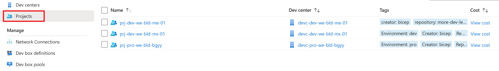

### What is a Dev Center?

The Dev Center is the IT team's control tower, providing an overview of all Dev Boxes, catalogs, environments and projects. It is the place where all the resources needed by the developers are defined.

Click on the `Dev Centers` tab on the left and select the first one of the list. You will be redirected to the resource detail page.

A Dev Center is composed of multiple resources:
- Dev Box definitions
- Catalogs
- Environments types
- Projects

Each of those resources has a specific role in the Dev Center.

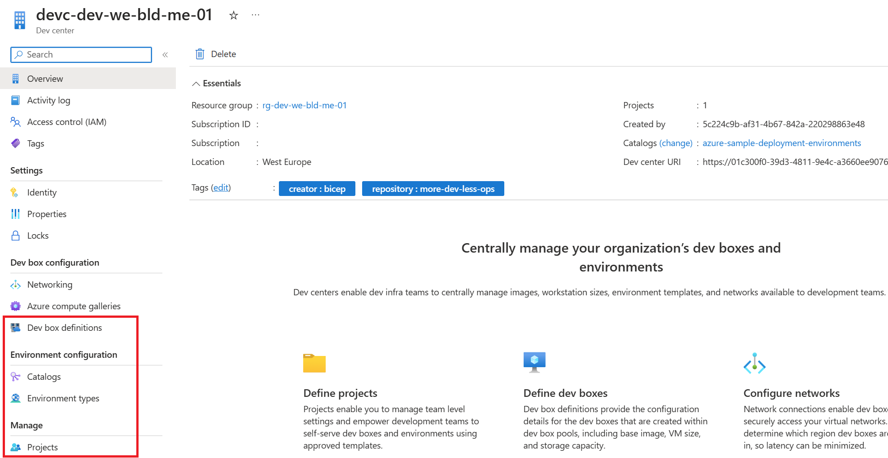

#### Dev Box definitions

A Dev Box definition is a preconfigured Virtual Machine with a specific configuration ready to use by developers. You can assign a specific amount of RAM, CPU, disk size and disk type to each Dev Box definition. In addition to the standard Windows image, you can use any ["sysprepped"](https://learn.microsoft.com/en-us/azure/virtual-machines/windows/prepare-for-upload-vhd-image) image of your choice.

All those definitions will be available for the developers to create a new Dev Box based on it, in a few minutes. A developer portal is provided to the developers to create a new Dev Box based on the Dev Box definition. 

The Dev Box is entirely integrated in your subscription. You can use your Azure AD credentials to connect to the Dev Box. You can also define rules to stop the Dev Box automatically after the working hours.

You will see the dedicated developer experience later in this workshop.

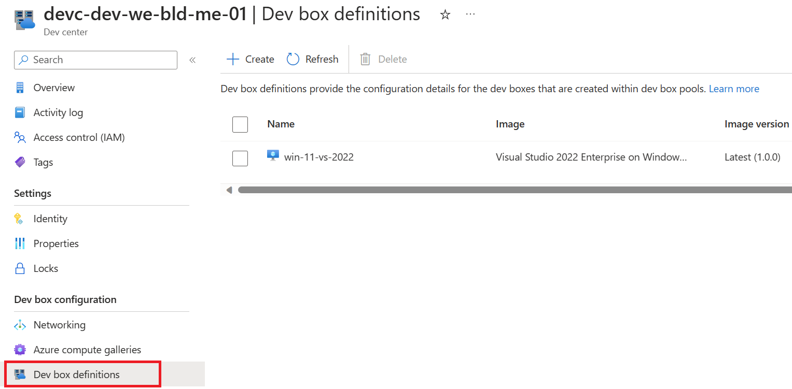

#### Environment types

An environment type is a way to split the Dev Boxes of your projects in different environments that you can defined such as Dev, Staging, Prod, etc. 

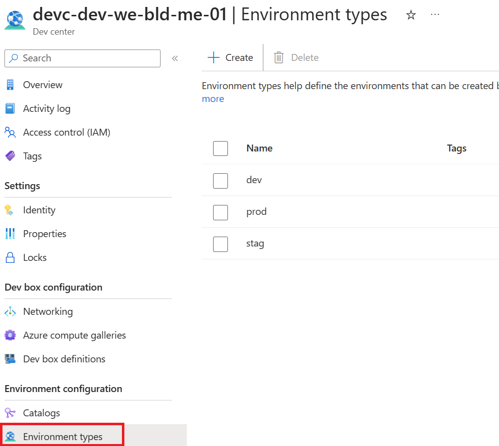

#### Catalogs

A catalog is a list of preconfigured Azure infrastructure environment defined using Infrastructure as Code (IaC). Those infrastructures are defined by providing a GitHub repository URL, like this one: [Azure Deployment Environments](https://github.com/Azure/deployment-environments). 

The Azure infrastructure environment are defined using Bicep, Terraform was also announced to be supported soon. Those catalogs are used to deploy the infrastructure needed by the application on demand. You will learn more on the Azure Deployment Environment section later in this workshop.

By defining a catalog, you can provide a list of environments that will be available for the developers to deploy their application on it but also, the IT team have full control on the infrastructure deployed. That leaves the developers to pick the environment they need and deploy their application on it, without waiting for multiple days or weeks to have an environment ready to use and compliant with the security and rules of the company.

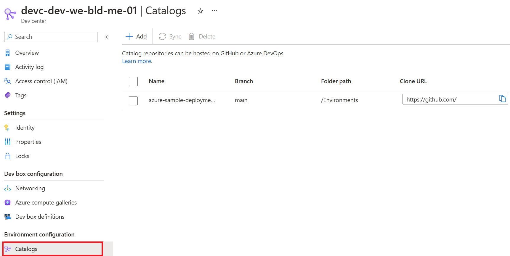

#### Projects

A project is where the developers are assigned and where they can create Dev Boxes. You can limit the type of Dev Box to fit the project needs. For example, you can create a project for a Node.js application and assign only the Dev Box definitions with Node.js tools installed. 

If you click on the `Projects` tab on the left, you will see the list of projects. Select the first one of the list. You will be redirected to the project detail page. This project contains only the Dev Box pool that can be used by the developers for this project. 

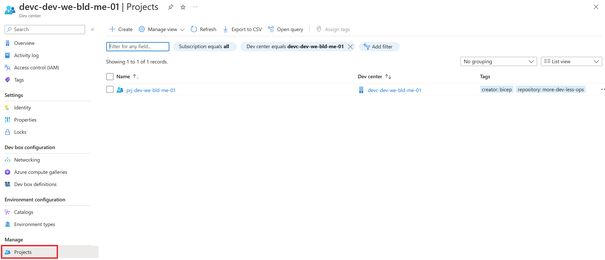

As you can see, the project also has environment types. This is where you can link an environment type defined in the Dev Center to a specific Azure subscription. This will allow the developers to deploy their environment on the correct subscription when needed.

In the `Environment` section of the project, you can see the list of all environments requested on demands by the developers for this project. You can see the provisioning state of each environment. Those environments are created using the Azure Deployment Environments that you will see later in this workshop. 

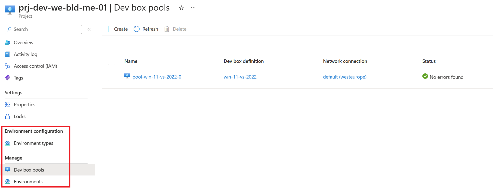

## Use your Dev Box

### Connect to the Dev Box

You have now the basics to understand how Microsoft Dev Box works. Let's use it to update an API. Go to [Dev Portal](https://devportal.microsoft.com/), sign in with the Azure credentials provided to you. 

Once you are logged in, you will see this kind of screen:

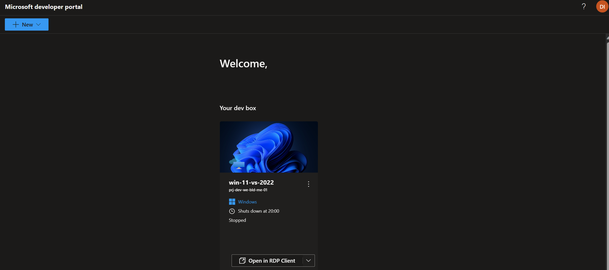

Select the devbox corresponding to your username. You will be invited to connect to it using a Remote Desktop Client. Follow the instructions to connect to your Dev Box. If needed the official documentation is available [here](https://learn.microsoft.com/en-us/azure/dev-box/tutorial-connect-to-dev-box-with-remote-desktop-app?tabs=windows)

If you successfully connect, you should see the windows desktop. 

This is a Windows 11 machine with tools like Visual Studio Code, Visual Studio, Azure CLI which are already installed. You can use this machine to develop your application. 

### Update an API

You will now update an existing application with your Dev Box.

Open Visual Studio Code, click the `Source Control` icon, select `Clone Repository` and copy pass the following Git repository URL: https://github.com/damienaicheh/MoreDevLessOpsApi

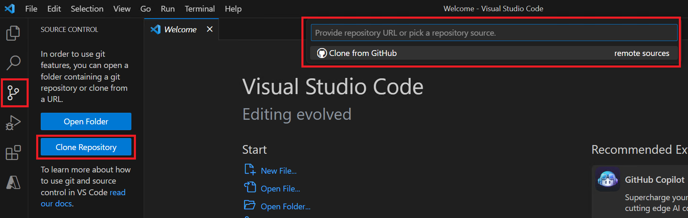

Save it in your `Desktop` folder for instance and open it with Visual Studio Code.

Once the repository is opened, you will see the following screen:

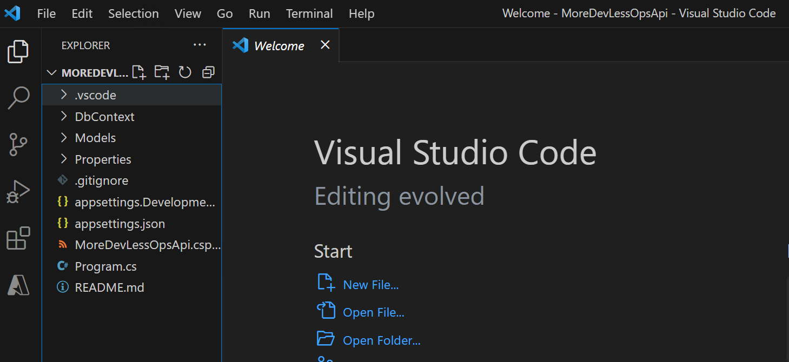

This is a simple dotnet minimal API application. This application is a simple todo list API.

Run it locally by opening the Visual Studio Code Terminal and run the following commands:

```bash
# Restore the nuget packages
dotnet restore

# Run the application
dotnet run
```

If you open a new browser tab and go to http://localhost:5142/swagger, you will see the following screen:

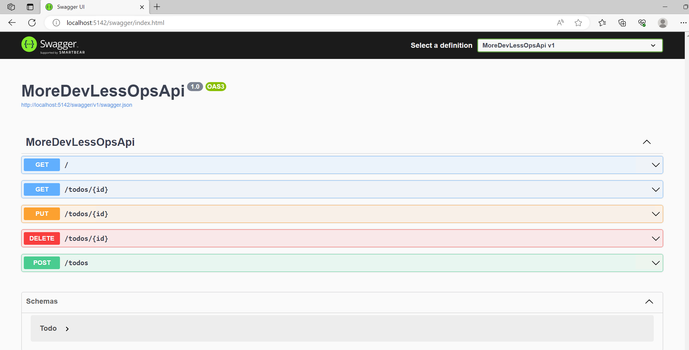

This minimal API use an in-memory database to store the todo items. This means that if you restart the application, **the todo items that you previously added will be lost**.

The goal now, is to add two new endpoints to this API:
- one to get all the todo items by calling `/todos`
- one to get all the completed todo items by calling `/todos/complete`

Open the `Program.cs` file and try to do it.

<details>
<summary>Toggle solution</summary>

To get all the todo items, you can use the following code:

```csharp
app.MapGet("/todos", async (TodoDb db) =>
    await db.Todos.ToListAsync());
```

To get all the completed todo items, you can use the following code:

```csharp
app.MapGet("/todos/complete", async (TodoDb db) =>
    await db.Todos.Where(t => t.IsComplete).ToListAsync());

```

Run the application again with `dotnet run` and go to http://localhost:5142/swagger. You will see the new endpoints:

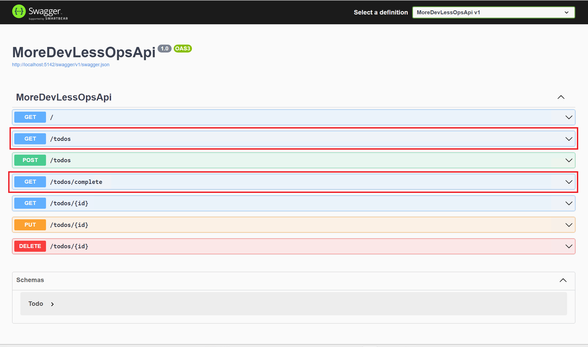

Let's quickly test the new endpoints.

Select the `/Post` endpoint and click on `Try it out` :

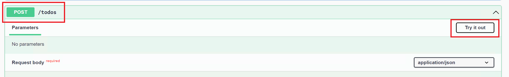

Try to add a new todo item and set `isComplete` to `true`.

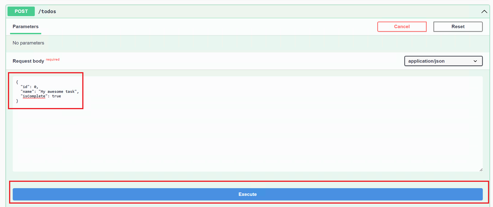

Now call the `/todos/complete` endpoint and you will see it in the list.

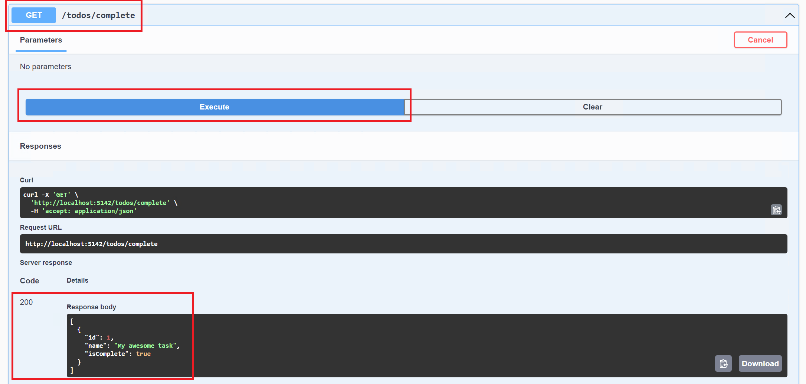

With the same process, create a new one but set `isComplete` to `false`. Call the `/todos` endpoint and you will see the two items in the list.

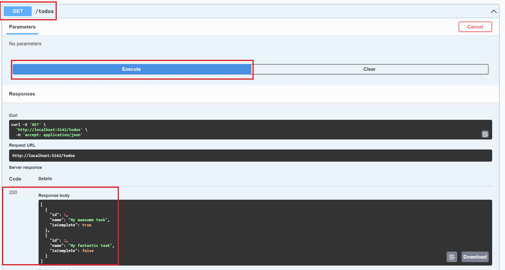

If you call the `/todos/complete` endpoint again, you will see only the completed todo item.

Remember if you restart the application, the todo items will be lost.

</details>

You now have a new version of your API. The next step is to deploy it on Azure on your own.

## Azure Deployment Environment

### What is Azure Deployment Environment?

Azure Deployment Environment is a new service that allows you to deploy a full environment on demand based on the templates inside the catalog defined in the project of the Dev Center. 

As a developer, this provide a way to deploy an environment on demand and test your feature directly on it. The environments is provided by the IT Teams so they are compliant with the security and rules of the company.

This will avoid developers to handle the infrastructure part of the application and focus on the application itself. Also, they will not have to deal with compliance and security rules.

As an IT Team, you can provide a list of environments that can be used by the developers. You can also provide a list of templates that can be used to deploy the infrastructure needed by the application. This will allow you to have full control on the infrastructure deployed and avoid developers to deploy resources that are not compliant with the security and rules of the company.

The developer just need to connect to [Microsoft developer portal](https://devportal.microsoft.com/) and select the template they need.

The infrastructure will be deployed in a few minutes in the correct subscription and the developer will be able to test his application on it.

### Create a new environment

Back to your application, you will now deploy it on a new WebApp environment. To do so, you need to spin up a new environment using Azure Deployment Environment.

Go to the [Dev Portal](https://devportal.microsoft.com/) and click on `+ New` button then on `New environment`:

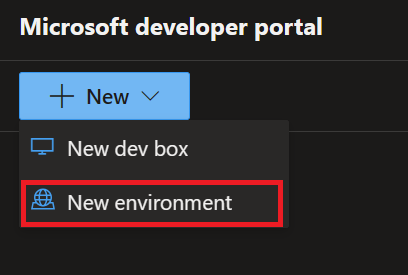

On the right panel, give a name to your environment with this naming convention: `app<your-user-number>`, select `dev` for the environment type and `WebApp` as a definition.


Then click on the `Next` button and give the same name to the WebApp (`app<your-user-number>`)

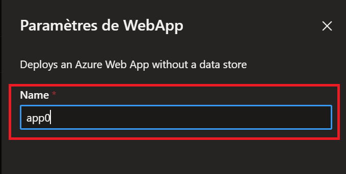

Give it a few minutes to deploy the infrastructure. Once it's done, you will see it in the list of environments:

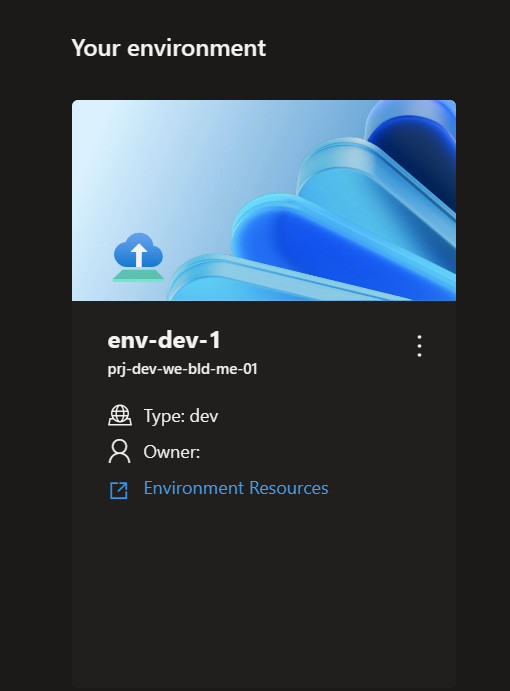

If you go back to Azure Portal, in the `Project` resource you will see in the `Environments` section the new environment created:

<div class="info" data-title="Note">

> It can take some time for the environment to be visible in the Azure Portal. So if you don't see it, wait a few minutes and refresh the page.
> Continue the lab and come back later to check if it's visible.

</div>

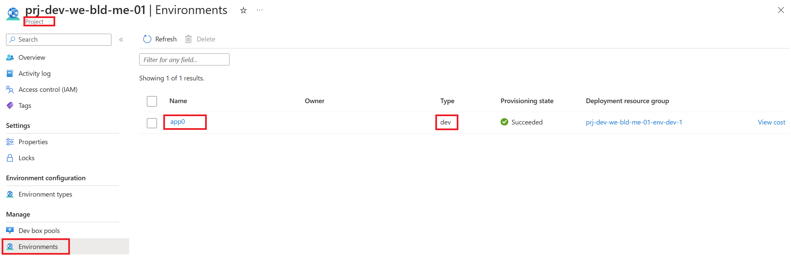

### Deploy your API

Now that you have an environment ready, you can deploy your application on the environment just created. Use the Azure Tools extension for Visual Studio Code to do so.

<details>
<summary>Toggle solution</summary>

Let's first add the Azure extension for Visual Studio Code.

Select the `Extensions` icon on the left panel and search for `Azure`:

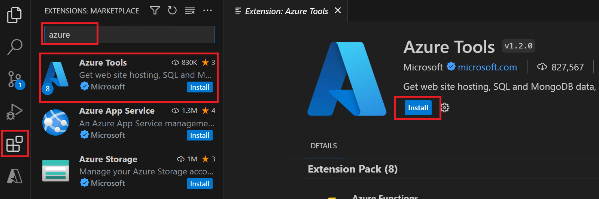

Click on `Install` and wait for the installation to be done.

Once it's done, you will see the Azure icon on the left panel, select it and click on `Sign in to Azure...`

A web page will open and you will be asked to sign in to your Azure account. Once it's done, you will see your subscription in the list.

Search for the App Service that start with `app<your-user-number>`:

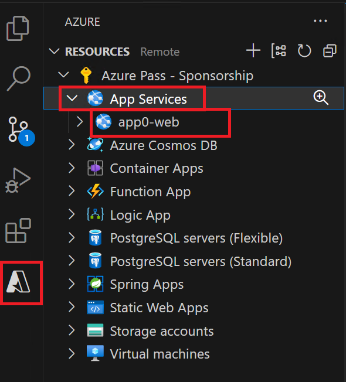

Select it and if necessary install the App Service extension: 

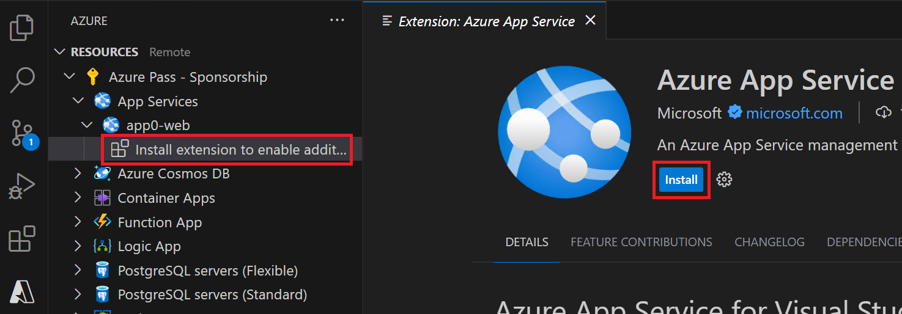

Then right click on the App Service resource and select `Deploy to Web App...`

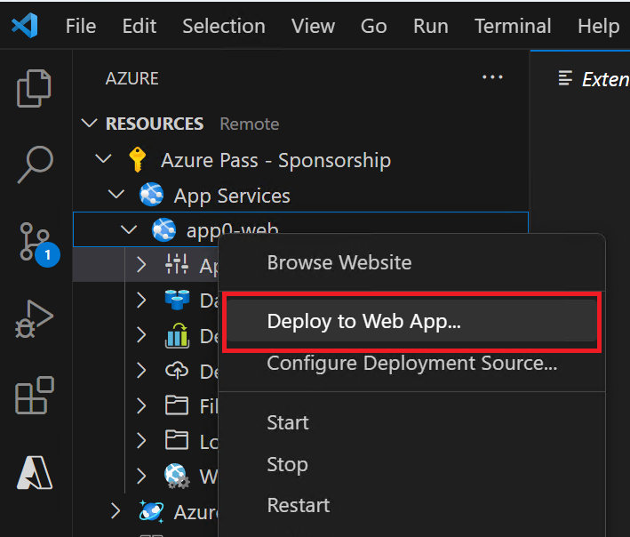

Select the folder of your application:

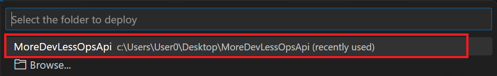

Then click on `Add config`:

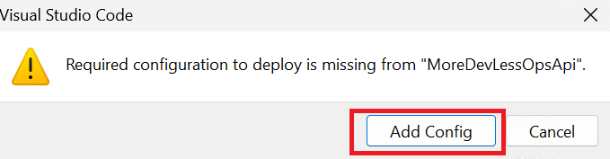

Finally click on `Deploy`:

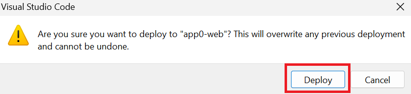

Once the deployment is done, you will see a notification in the Terminal:

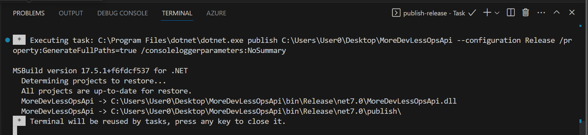

Congratulations! You just deployed your application on Azure using Azure Deployment Environments.

In the App Service resource, right click and select `Browse Website`


</details>

In your browser, go to the `/swagger` endpoint and you will see the same Swagger UI you previously used. You can now test your API on Azure.

As you saw, you didn't have to deal with the infrastructure part of the application. You just had to select the template you want to use and the environment type. The infrastructure was deployed in a few minutes and you were able to deploy your application on it. This is a huge time saver for developers.

## Going further with Azure Developer CLI

### What is Azure Developer CLI?

[Azure Developer CLI](https://learn.microsoft.com/en-us/azure/developer/azure-developer-cli/) also known as `azd` is an open-source tool that accelerates the process of building cloud apps on Azure. This can be used to create a new application from a template, deploy it to Azure, and manage it.

A lot of templates are available publicly on GitHub, you can find them [here](https://github.com/topics/azd-templates). You can also create your own templates and use them with `azd`. These templates include application code, and reusable infrastructure as code assets.

The `azd` tool can be use in combination with Azure CLI to support your Azure workflow.

By the end of this workshop, you can try to integrate `azd` to use it to deploy your application on Azure. You will find the procedure [here](https://learn.microsoft.com/en-us/azure/developer/azure-developer-cli/make-azd-compatible?pivots=azd-create).