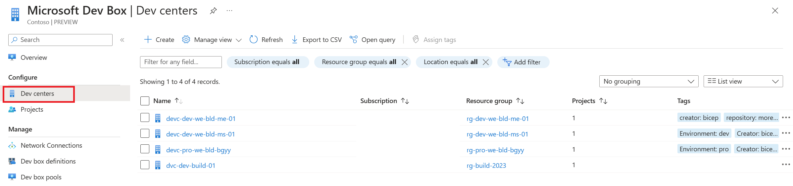

# More Dev Less Ops Workshop

Welcome to this Workshop. In this lab, you will discover how Microsoft move towards to help developers to be more productive and focus on their code. You will discover two services: Microsoft Dev Box and Azure Deployment Environment.

During this workshop you will have the instructions to complete each steps, try to find the answer before looking at the solution. Don't worry, this is a step by step lab, you will be guided through it.

---

# The Workshop

## Prerequisites

To access the resources of this workshop, you will have access to an Azure subscription.

## A bit of context

When you arrive a new company, you need to be onboarded. This is the same for developers. They need to be onboarded to the company and to the project they will work on. This is a long process that can take days or weeks. Moreover, the developer needs to have a computer with all the tools needed to develop the application. 

This scenario is not the best for the developer and the company. An other reccurent problem for developers is for deploying their application without waiting for the IT team to create the infrastructure. This is a long process that can take days or weeks. 

Based on this report, Microsoft has created two services to help developers to be more productive, autonomous and focus on their code. Those services are Microsoft Dev Box and Azure Deployment Environment.

# Microsoft Dev Box

## What is Microsoft Dev Box?

To solve this problem, Microsoft has created a new service called Microsoft Dev Box. This service allows developers to create on-demand, high-performance, secure, ready-to-code, project-specific workstations in the cloud. It is a fully managed service that provides pre-configured development environments accessible from anywhere.

The principle is simple, you have a project with specific technologies, so you need to have a computer with all the tools needed to develop the application. This is what Microsoft Dev Box provides. 

Based on this, the IT team can provide through a Dev Center multiple Dev Box definitions with all the tools needed to develop different projects type. Then, when needed the developer can just create a new Dev Box based on the Dev Box definition. This Dev Box will be created in a few minutes and the developer can start to work on it.

The Dev Box can be a Windows 10 or 11 with a specific configuration. It can be accessed from Windows, Mac, Android, iOS or a web browser.

The different tools provided in the Dev Box definition can be declared inside a `devbox.yaml` file (Actually in private preview). This file allows you to install software with the `WinGet` or `Chocolatey` package managers, as well as setting common OS settings like enabling Windows Features and configuring applications like installing Visual Studio extensions.

In this workshop, you will use a pre-configured Dev Box environment to create a new application.

## Overview of the Microsoft Dev Box service

To start this workshop, let's have a look at the Microsoft Dev Box service from an IT team perspective. Take the credentials provided to you and open a new tab in your browser and navigate to [Azure Portal](https://portal.azure.com/).

In the search bar on top, type `Dev Box` and select the `Microsoft Dev Box` service. On the left, You will find all the dev centers and projects of your subscription. 

You should see this king of screen (the name of the resource group will be different on your subscription):



## What is a Dev Center?

The Dev Center is the contol tower of the IT team to have an overview of all the Dev Boxes, Catalogs, Environments and Projects. It is the place where all the resources needed by the developers are defined.

Click on the `Dev Centers` tab on the left and select the first one of the list. You will be redirected to the resource detail page.

A Dev Center is composed of multiple resources:
- Dev Box definitions
- Catalogs
- Environments types
- Projects
- Azure computes galleries

Each of those resources has a specific role in the Dev Center.

### Dev Box definitions

A Dev Box definition is a preconfigured Virtual Machine with a specific configuration ready to use by developers. It can be a Windows 10 or 11 with a specific configuration. It can be accessed from Windows, Mac, Android, iOS or a web browser.

You can give a specific amount of RAM, CPU, disk size and disk type to the Dev Box. You can also specify a custom image stored in your Azure compute gallery.

All those definitions will be available for the developers to create a new Dev Box based on it, in a few minutes. A developer portal is provided to the developers to create a new Dev Box based on the Dev Box definition. 

You will see the dedicated developer experience later in this workshop.

### Environment types

An environment type is a way to split the Dev Boxes of your projects in different environments that you can defined such as Dev, Test, Prod, etc. 

### Catalogs

A catalog is a list of preconfigured Azure infrastructure environment defined using Infrastructure as Code (IaC). Those infrastructures are defined by providing a GitHub repository URL, like this one: [Azure Deployment Environment](https://github.com/Azure/deployment-environments). 

The Azure infrastructure environment are defined using Bicep and Terraform was announced as soon to be supported. Those catalogs are used to deploy the infrastructure needed by the application on depend. You will learn more on the Azure Deployment Environment section later in this workshop.

By defining a catalog, you can provide a list of environments that will be available for the developers to deploy their application on it but also, the IT team have full control on the infrastructure deployed. That leaves the developers to pick the environment they need and deploy their application on it, without waiting for multiple days or weeks to have an environment ready to used and compliant with the security and rules of the company.

### Projects

A project is where the developers are assigned and where they can create Dev Boxes. You can limit the type of Dev Box to fit the project needs. For example, you can create a project for a Node.js application and assign only the Dev Box definitions with Node.js tools installed. 

If you click on the `Projects` tab on the left, you will see the list of projects. Select the first one of the list. You will be redirected to the project detail page. This project contains only the Dev Box pool that can be used by the developers for this project. 

As you can see, the project also has environment types. This is where you can link an environment type defined in the Dev Center to a specific Azure subscription. This will allow the developers to deploy their environment on the correct subscription when needed.


As you discover the function of the tabs on the left navigate on its to understand what they are:

- `Dev box definitions` which are preconfigured Virtual Machines with a specific configuration ready to use by developers.
- `Catalogs` which are a list of preconfigured Azure infrastructure environment defined using Infrastructure as Code (IaC). Those infrastructures are defined by providing a GitHub repository URL, like this one: [Azure Deployment Environment](https://github.com/Azure/deployment-environments).
- `Environments types` are defined to split the Dev Boxes of your projects in different environments that you can defined such as Dev, Test, Prod, etc.
- `Projects` where you can assign users and deploy Dev Boxes specific to it.


## Deep dive into the project

Select the `Projects` tab on the left and select the project in the list. You will be redirected to the project detail page. This project contains only the Dev Box pool that can be used by the developers for this project. 

With this approach, you can imagine a project dedicated to a Node.js application, with a Dev Box pool containing only Dev Boxes with all the tools needed to develop a Node.js application pre-installed.

If you click on the `Dev Box pools` tab on the left, you will see the list of Dev Boxes available for this project. Each dev box can have local administator or standard user privileges. Moreover, you can specify hours where the Dev Box can be automatically stopped. This is useful to save money when the Dev Box is not used.

Click on a Dev Box definition in the list, you will be redirected to the Dev Center detail page. You will see details about the Dev Box definition such as Windows version and tools installed.


## Use the Dev Box

You have now the basics to understand how Microsoft Dev Box works. Let's use it to create a new application. Go to [Dev Portal](https://devportal.microsoft.com/), sign in with your Azure credentials. 

Once you are logged in, you will see dev boxes, select the one corresponding to your user name. You will be invited to connect to it using a Remote Desktop Client. Follow the instructions to connect to your Dev Box. If needed the official documentation is available [here](https://learn.microsoft.com/en-us/azure/dev-box/tutorial-connect-to-dev-box-with-remote-desktop-app?tabs=windows)

If everything is ok, you should see this kind of screen:


This is a Windows 11 machine with tools like Visual Studio Code, Visual Studio, Azure CLI are already installed. You can use this machine to develop your application.

# Azure Developer Cli

## What is Azure Developer Cli?

[Azure Developer Cli]() also now as `azd` is an open-source tool that accelerates the process of building cloud apps on Azure. This can be used to create a new application from a template, deploy it to Azure, and manage it.

A lot of templates are available publicly on GitHub, you can find them [here](https://github.com/topics/azd-templates). You can also create your own templates and use them with `azd`. These templates include application code, and reusable infrastructure as code assets.

The `azd` tool can be use in combination with Azure Cli to support your Azure workflow.

For this workshop, you will use a custom template to create a new application. This template is available [here](TODO).

## Develop a new application

The goal of this section is to create a new application using `azd` and in the next one you will discover how to deploy it to Azure using `azd` or `Azure Deployment Environment`. The template used for this workshop is a basic API that manage a TODO list. This application is a dotnet API.

Your Dev Box is connected to an Azure Environment like defined ...
// TODO Explain how this is connected to a database for the API

## Use Azure Developer Cli

Let's start by using `azd` to create a new application. Open a new terminal in your Dev Box and type the following command:

```bash
azd init TODO with the template URL
```

Open the generated project with VS Code. You will see a project with the infrastructure as code, pipeline and application code. In the repository, you will find an `azure.yaml` file, this one is used by `azd` as a configuration file.

The application code is voluntarily simple, it is a basic API that manage a TODO list. The goal is to add 2 calls to retreive elements to the associated database.