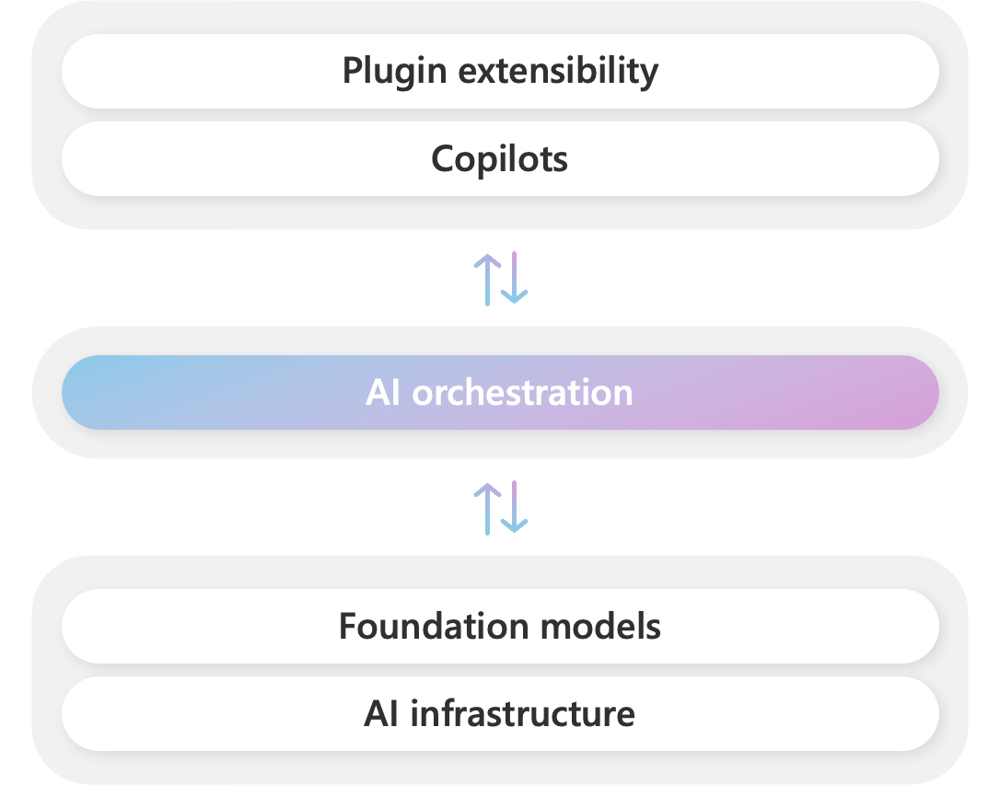
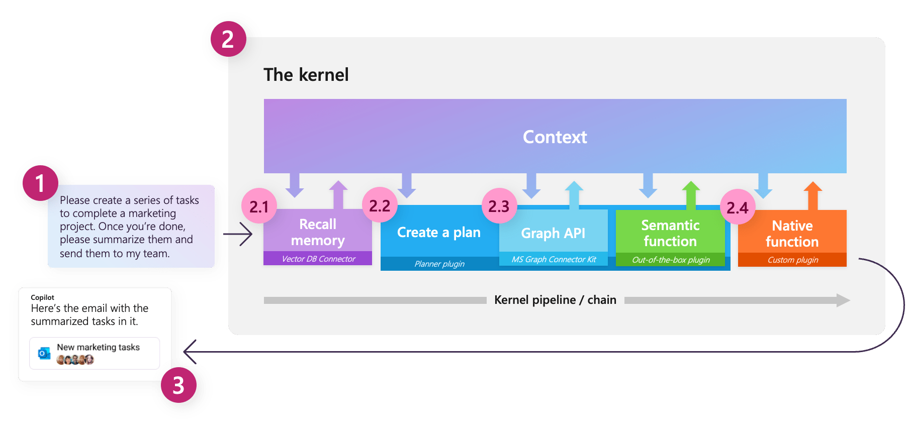
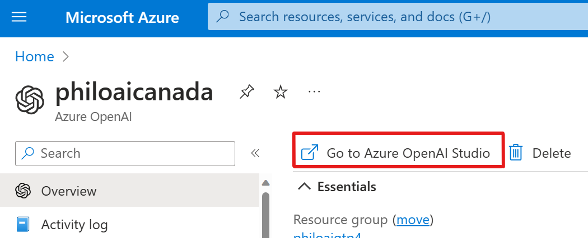
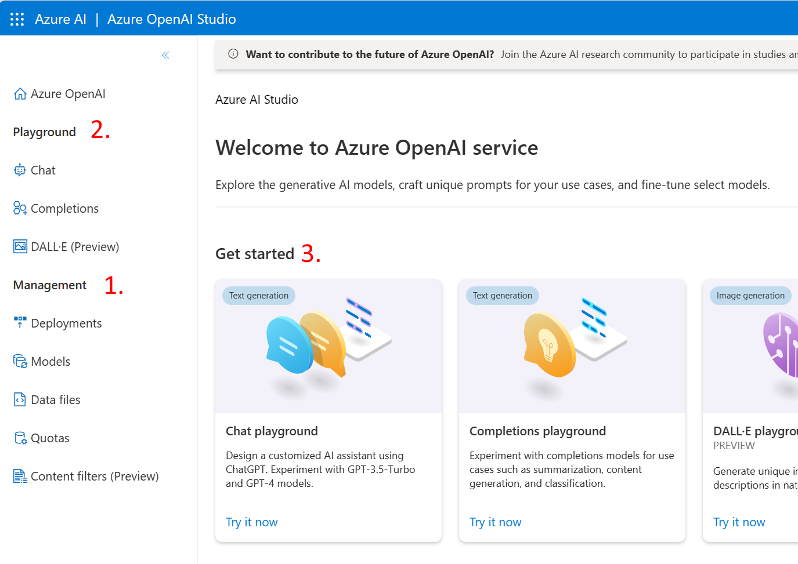
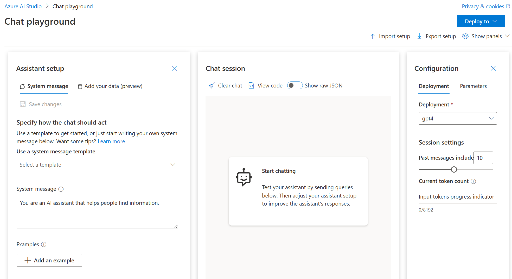

# Semantic Kernel Workshop

## Introduction

This is an envisioning workshop, based on Microsoft's Copilot stack [Microsoft's Copilot stack](https://learn.microsoft.com/en-us/semantic-kernel/overview/#semantic-kernel-is-at-the-center-of-the-copilot-stack), to rethink user experience, architecture, and app development by leveraging the intelligence of foundation models. This workshop will use Semantic Kernel (SK), along with SK's Design thinking material, to guide you through the lifecycle of intelligent app development. 



<div class="warning" data-title="warning">

> Semantic Kernel and the Azure OpenAI Services are quickly evolving products and thus this workshop may not be 100% up to date with the differentes features of the different extensions you are going to use. Please be clever.

</div>

**Semantic Kernel** is an open-source SDK that lets you easily combine AI services like [OpenAI](https://platform.openai.com/docs/), [Azure OpenAI](https://azure.microsoft.com/products/cognitive-services/openai-service/), and [Hugging Face](https://huggingface.co/) with conventional programming languages like C# and Python. By doing so, you will create AI apps that combine the best of both worlds.

The Semantic Kernel has been engineered to allow developers to flexibly integrate AI services into their existing apps. To do so, Semantic Kernel provides a set of connectors that make it easy to add [memories](https://learn.microsoft.com/en-us/semantic-kernel/memories/) and models. In this way, Semantic Kernel is able to add a simulated "brain" to your app.

Why use an AI orchestrator you may ask ?

If you wanted, you could use the APIs for popular AI services directly and feed the results into your existing apps and services. This, however, requires you to learn the APIs for each service and then integrate them into your app. Using the APIs directly also does not allow you to easily draw from the recent advances in AI research that require solutions on top of these services. For example, the existing APIs do not provide planning or AI memories out-of-the-box. To simplify the creation of AI apps, open source projects have emerged. Semantic Kernel is Microsoft's contribution to this space and is designed to support enterprise app developers who want to integrate AI into their existing apps.

By using multiple AI models, plugins, and memory all together within Semantic Kernel, you can create sophisticated pipelines that allow AI to automate complex tasks for users.
For example, with Semantic Kernel, you could create a pipeline that helps a user send an email to their marketing team. With memory, you could retrieve information about the project and then use planner to autogenerate the remaining steps using available plugins (e.g., ground the user's ask with Microsoft Graph data, generate a response with GPT-4, and send the email). Finally, you can display a success message back to your user in your app using a custom plugin.



Additionally, Semantic Kernel makes it easy to add skills to your applications with AI plugins that allow you to interact with the real world. These plugins are composed of prompts and native functions that can respond to triggers and perform actions. In this way, plugins are like the "body" of your AI app.

Because of the extensibility Semantic Kernel provides with connectors and plugins, you can use it to orchestrate AI plugins from both OpenAI and Microsoft on top of nearly any model. For example, you can use Semantic Kernel to orchestrate plugins built for ChatGPT, Bing chat, and Microsoft 365 Copilot on top of models from OpenAI, Azure, or even Hugging Face.

In a nutshell it will allow you to orchestrate AI plugins from any provider.

## Running this workshop as a challenge

Are you running this workshop in the form of a challenge? Either if you're doing it bt teams or individually, here is a proposal for counting points along the way with the challenges.

There is very precise rules for challenges:
- challenges are composed of different **steps** that weight **1 point** each
- when **all the steps** of a challenge are completed, **5 more points** will be awarded
- if you complete the **bonus steps** of the challenges, it will give you **2 extra points** each

But that's not it !

In addition, during the challenges some extra points may be awarded by your beloved coach regarding the **creativity** of you application, its **humor** or **hallucinativity**. Each of those item weighting **2 additional points**. 

<!-- Here is a sample scorecard you can use to track the challenger's progress:
convert this as html table:
| Team name | Challenge 1 | Challenge 2 | Challenge 3 | Challenge 4 | Challenge 5 | Total | 
| --- | --- | --- | --- | --- | --- | --- |
| Team 1 | 1 | 1 | 1 | 1 | 1 | 5 |
| Team 2 | 1 | 1 | 1 | 1 | 1 | 5 |
| Team 3 | 1 | 1 | 1 | 1 | 1 | 5 |
--->
<table>
  <thead>
    <tr>
      <th rowspan="2">Team name</th>
      <th colspan="2">Challenge 1</th>
      <th colspan="2">Challenge 2</th>
      <th colspan="2">Challenge 3</th>
      <th colspan="2">Challenge 4</th>
      <th colspan="2">Challenge 5</th>
      <th rowspan="2">Coach Bonus</th>
      <th rowspan="2">Total Score</th>
    </tr>
    <tr>
      <th>score</th>
      <th>bonus</th>
      <th>score</th>
      <th>bonus</th>
      <th>score</th>
      <th>bonus</th>
      <th>score</th>
      <th>bonus</th>
      <th>score</th>
      <th>bonus</th>
    </tr>  
  </thead>
  <tbody>
    <tr>
      <td>Team1</td>
      <td> </td>
      <td> </td>
      <td> </td>
      <td> </td>
      <td> </td>
      <td> </td>
      <td> </td>
      <td> </td>
      <td> </td>
      <td> </td>
      <td> </td>
      <td> </td>
    </tr>
    <tr>
      <td>Team2</td>
      <td> </td>
      <td> </td>
      <td> </td>
      <td> </td>
      <td> </td>
      <td> </td>
      <td> </td>
      <td> </td>
      <td> </td>
      <td> </td>
      <td> </td>
      <td> </td>
    </tr>
    <tr>
      <td>Team3</td>
      <td> </td>
      <td> </td>
      <td> </td>
      <td> </td>
      <td> </td>
      <td> </td>
      <td> </td>
      <td> </td>
      <td> </td>
      <td> </td>
      <td> </td>
      <td> </td>
    </tr>
  </tbody>
</table>

---

# Prerequisites

In just a few steps, you can start running the getting started guides for Semantic Kernel in either C# or Python. After completing the guides, you'll know how to...
- Configure your local machine to run Semantic Kernel
- Run AI prompts from the kernel
- Make AI prompts dynamic with variables
- Create a simple AI agent
- Automatically combine functions together with planners
- Store and retrieve memory with embeddings

Before running the guides in C#, make sure you have the following installed on your local machine.
- `git` or the GitHub app
- VSCode or Visual Studio
- An OpenAI key 
- NodeJS and yarn to run the sample apps of the Semantic Kernel

If you prefer to do the Workshop in C#:
- .Net 7 SDK - for C# notebook guides
- In VS Code the Polyglot Notebook - for notebook guides

If you are using Python, you just need python. 

---


# Challenge 1: Azure OpenAi Playground

## Prerequisites

- An Azure account with an active subscription. [Create an account for free](https://azure.microsoft.com/free/?WT.mc_id=academic-0000-jabenn).
- An Azure OpenAI Services Instance. [Create an instance](https://learn.microsoft.com/en-us/azure/ai-services/openai/how-to/create-resource?pivots=web-portal).
- Some models deployments. [Deploy a model](https://learn.microsoft.com/en-us/azure/ai-services/openai/how-to/create-resource?pivots=web-portal#deploy-a-model). 


To access the Azure OpenAI portal, go to [Azure OpenAI portal](https://oai.azure.com/) or by clicking on the link on your Azure OpenAI instance on the Azure portal.



Once in the Azure OpenAI portal, you'll find everything to take the most advantage of the service: 
- You'll be able to manage your **models and your deployments (1)**. 
- You will have interractive playgrounds to customize and test your models with the **playgrounds (2)**
- You will find very usefull resources like **samples (3)** to accelerate your development 



<div class="info" data-title="note">

> The models avalailable are not only OpenAI models but a lot of other models from different providers.
You can deploy models like Ada (text embeddings), GPT 3.5 and 4, Davinci, Dall-E, and others models from providers or your own models in the future...
<br/><br/>
For the upcomming Hands-on-lab we recommend that you deploy at least a **GPT model** and a **Ada text embeddings model**.

</div>

## Step 1: Set Up a Conversational Agent

In the Azure OpenAI Studio, open the Chat playground by clicking on the link in the left pane.

<br/><br/>
In this playground you have 3 main panels:
- **Assistant Setup**: you define your assistant goal, and how it should behave. There is a few sample available to help you get started, give it a try to start understanding how it works. This is also in this panel that you will train your assistant with you own data but we'll see that later.
- **Chat**: this is the place where you can test your assistant. You can type your question and see the answer from your assistant.
- **Configuration**: this is where you can define the parameters of you assistant regarding the deployed model you use. You can select the deployment and define the parameters you send to the model depending on what kind of result you want to get.

There's a few parameters that will have big impact on the kind of answer that will be generated. Keep in mind that the two most important parameters are the **temperature** and the **max response** for you to define:
- **Temperature**: The higher the temperature, the more random the response. The lower the temperature, the more predictable the response. The default temperature is 0.7. **Top P** is an alternative to temperature that sets the probability that the model will choose from the most likely tokens. The default is 1.0.
- **Max response**: The maximum number of tokens to generate. The default is 64.

<br/>

Try to play with the parameters and see how it impacts the answer.

## Step 2: Build, Train and Deploy you assistant with your own data

Now that you started building your assistant, you can start training it with your own data. As the OpenAI service is a constantly evolving service, the way you can train your assistant can change over time. 

You will find a step by step guide on how to train your assistant with your own data from the playground [here](https://learn.microsoft.com/en-us/azure/ai-services/openai/use-your-data-quickstart).


## Validate the challenge:

In order to validate the challenge, you should be able to:
- demonstrate a working conversational agent that can answer questions based on your own data.
- ***Bonus***: demonstrate a deployed version of your agent (Webapp or Power Virtual Agent)

---

# Challenge 2: Semantic Kernel Samples


We are about to embark on a remarkable journey. However, instead of a DeLorean, our vehicle will be our collective creativity, innovation and the semantic Kernel. 

As we buckle up and ignite our flux capacitors for this workshop, let's channel the spirit of the future and let's dive into the world of innovation and creativity.

## Prerequisites

It's time to play with Semantic Kernel! Let's start by cloning the repository and open it in VS Code (or your favorite IDE).

```bash
git clone https://github.com/microsoft/semantic-kernel.git
cd semantic-kernel
code .
```

You'll find a few folders containing everything you need to build AI Apps with semantic kernel in this repository:
- **/docs**: you'll find all the documentation you need to get started with Semantic Kernel
- **/samples**: you'll find a few samples to get started with Semantic Kernel
- **/dotnet , /python, ...**: you'll find the source code of Semantic Kernel in the given language and a bunch of samples and skills for each language
- **/*.md files**: you'll find this documentation that will help you get started with Semantic Kernel, explaining concepts and how to run the samples


## Simple Chat Summary sample

Let's start by the most simple sample: the Simple Chat Summary sample. This sample is a simple chatbot that will summarize the conversation.
You'll find it in the **samples/apps** folder.

Take your time to build and run this sample and explore the skills and the code. You'll find a lot of comments in the code to help you understand how it works.

Your goal here is simply to run the sample and try to understand how it works. Once you're pretty confident with it, you can go to the next step: the **Book Generator sample** to start seeing another powerful feature of Semantic Kernel: the planner, that helps you orchestrate skills together to build more complex scenarios.

## Book Generator sample

The power of semantic kernel is the ability to orchestrate skills together to build more complex scenarios. You can create static plans by assembling skills together, but you can also leverage the power of semantic kernel to dynamically create plans based on the context of the conversation.

In this sample, you'll find a simple book generator that will generate a book based on the conversation. You'll find it in the **samples/apps** folder. Try it and see how it works.

## Validate the Challenge 

In order to validate the challenge, you should be able to:
- Demonstrate the Sample "Chat summary" running
- Demonstrate the Sample "Book Generator" running
- ***Bonus***: Now that you have an app that can generate book for childrens, try to add a call to the Azure OpenAI Dall-E endpoint that will generate a book cover based on the story generated. Try adding this to the react app first, using the ***Javascript Azure OpenAI Client***. You'll be able to integrate it as a Skill later on this workshop. 

<div class="info" data-title="note">

> If you don't have a Dall-E deployment and you're running this Hands-On-Lab in a proctored session, ask to your proctor to provide a Dall-E endpoint for you.

</div>

---


# Challenge 3 : build your first plugins

## Step 1 : define a semantic function and a native function

Semantic Kernel makes the difference between **semantic functions** and **native functions**. Semantic functions make use of a prompt to call a Large Language Model (LLM). Native functions don't need LLMs and can be written in C#.

The full power of Semantic Kernel comes from combining semantic and native functions.

<div class="info" data-title="note">

> To learn more about semantic and native functions, and how you can combine them, you can read the Semantic Kernel documentation [here](https://learn.microsoft.com/en-us/semantic-kernel/)

</div>

### Step 1 goals

1 - **Write a semantic function** that generates an excuse email for your boss to avoid work and watch the next ***[your favorite team and sport]*** game. The function takes as input the day and time of the game, which you provide manually.
The function generates:
  - the body of the email
  - its topic
  - its recipient.

2 - **Write a native function** that calls a REST API (e.g. Bing search) to automatically retrieve the day and time of the next ***[your favorite team and sport]*** game in order to be integrated in the email.


<div class="tip">

> If you don't have a REST API to retrieve the date and time of the next ***[your favorite team and sport]*** game, why not trying using Bing Chat or Github Copilot to help you build a solution to retrieve it.

</div>


### Step 1 useful concepts and syntax

Functions (both native and semantic) are grouped into plugins. In other words, a plugin is a collection of functions. Some plugins are already defined by the Semantic Kernel package. See the source code [here](https://github.com/microsoft/semantic-kernel/tree/main/dotnet/src/Plugins). You can use these plugins in your code with the following syntax:
```csharp
var timePlugin = new Timeskill(); // instantiate an out-of-the-box plugin
var daysAgo = time.DaysAgo; // instantiate a native function of this plugin
```

In the above snippet, Timeskill is the name of the plugin and DaysAgo is the name of one of its functions.

Other plugins are defined by developers. In the semantic kernel repository, you will find examples of such plugins [here](https://github.com/microsoft/semantic-kernel/tree/main/samples/plugins). If you want to use these plugins in your solution, you have to copy paste them into your codebase. You can also create your own plugins. The documentation explains how to [organise your plugins folder](https://learn.microsoft.com/en-us/semantic-kernel/ai-orchestration/plugins/native-functions/using-the-skfunction-decorator?tabs=Csharp#finding-a-home-for-your-native-functions). Note that within a plugin, each semantic function has its own folder whereas native functions are all defined in a single C# file. Take a look at the [documentation](https://learn.microsoft.com/en-us/semantic-kernel/ai-orchestration/plugins/semantic-functions/serializing-semantic-functions?tabs=Csharp) to see how to organize your folders to create a semantic function.

To use a developer defined plugin, you can use the following syntax:
```csharp
var emailPlugin = kernel.ImportSemanticSkillFromDirectory("./Plugins", "Email");
var generateExcuse = emailPlugin["GenerateExcuse"];
```
In the above snippet, `Plugins` is the name of the folder containing all the developer defined plugins. `Email` is the name of the folder containing the email plugin. `GenerateExcuse` is the name of the folder that defines the semantic function that generates an excuse email. `GenerateExcuse` contains two files: `config.json` and `skprompt.txt`.

It is possible to parametrize semantic functions by adding a parameter in `config.json`:
```json
{
     "input": {
          "parameters": [
               {
                    "name": "myParameter",
                    "description": "",
                    "defaultValue": ""
               }
          ]
     }
}
```
and giving the parameter in `skprompt.txt`:
```txt
this prompt depends on the following parameter {{$myParameter}}.
```

The value of a parameter can be defined in the main program through context variables:
```csharp
var contextVariables = new ContextVariables
        {
            ["myParameter"] = "myValueForThisExecution",
        };
```

## Step 2 : chain functions 

### Step 2 goal

Integrate your semantic and native functions in order to generate your email excuse. For now we encourage you to do the integration by writing native code. In the next part, we will see how **planners** leverage LLMs to deal with the orchestration of functions. 

### Step 2 concepts and syntax

A semantic function must be called through a kernel:
```csharp
var result = await kernel.RunAsync(contextVariables, mySemanticFunction);
```

A kernel can be instantiated as follows:
```csharp
var builder = new KernelBuilder();
builder.WithAzureChatCompletionService(
        // Azure OpenAI Deployment Name,
        // Azure OpenAI Endpoint,
        // Azure OpenAI Key,
        );      
var kernel = builder.Build();
```

A native function can be called directly from the main program:
```csharp
var timePlugin = new Timeskill(); // instantiate an out-of-the-box plugin
var daysAgo = time.DaysAgo; // instantiate a native function of this plugin
var dateInAWeek = daysAgo(-7); // call a native function
```

## Validate the challenge

In order to validate the challenge, you should:
- demonstrate your plugins by generating an email excuse and retrieving the date of the next ***[your favorite team and sport]*** game.
- demonstrate a manual orchestration that uses function chaining between semantic and native functions to achieve the goal of generating an email excuse. 
- ***Bonus***: find the way to pass multiple variables thru the chain of functions using context.
- ***Bonus***: use a native function that calls a REST API to retrieve the date of the next ***[your favorite team and sport]*** game.

---

# Challenge 4 : plugins orchestration

## Orchestrate functions with a Planner

### Goal

Leverage a planner to orchestrate the previously written semantic and native functions: date retrieval, email generation.

### Concepts and syntax

Planners use LLMs to orchestrate the usage of semantic and native functions. At step 2, we integrated the email generation and API calls with native code. By using a planner, we can rely on an LLM to integrate semantic and native functions in order to achieve a goal. It's a declarative way of programming.

The planner is given the goal that the developper wants to achieve and the functions (semantic and native) that are available to him. The planner leverages the natural language understanding and generation capabilities of LLMs to propose a plan, i.e. a step by step usage of the available functions to achieve the goal. The proposed plan is then executed.

In Semantic Kernel, the 3 following planners are available:
  - Action Planner: chooses a single function in order to achieve the given goal.
  - Sequential Planner: chains several functions (semantic and native) to achieve the given goal.
  - Stepwise Planner: iteratively and adaptively produces a plan: the next step may depend on the result of the execution of the previous steps. 

For a planner to know which plugins it can use to generate a plan, plugins must be registered to a kernel.

Developer-defined plugins are registered with the syntax that we already used previously:
```csharp
var emailPlugin = kernel.ImportSemanticSkillFromDirectory("./Plugins", "Email");
var generateExcuse = emailPlugin["GenerateExcuse"];
```

For an out-of-the-box plugin, you can use the following syntax to register it to a kernel:
```csharp
kernel.ImportSkill(time);
```

To use the sequential planner, you can use the following syntax:
```csharp
var planner = new SequentialPlanner(kernel); // instantiate a planner
var plan = await planner.CreatePlanAsync("ask for the goal to achieve"); // create a plan
var result = await plan.InvokeAsync(); // execute the plan
```
Other planners (e.g. ActionPlanner and StepwisePlanner) follow a similar syntax.


### Validate the challenge

In order to validate the challenge, you should demonstrate:
- a planner orchestration of semantic and native functions to achieve the goal of generating an email excuse.
- ***Bonus***: using a stepwise planner that can adaptively generate a plan depending on the result of retrieving the date of the next ***[your favorite team and sport]*** game.


---

# Extra-challenge : add nice-to-haves

Feel free to add any nice-to-have feature that you think makes sense.

## Examples of goals to achieve

- Add memory : keep track of the previuosly sent excuses to make sure that you don't use the same excuse twice. See [Semantic Memory](https://github.com/microsoft/semantic-kernel/blob/main/dotnet/samples/KernelSyntaxExamples/Example14_SemanticMemory.cs) for a sample.

- Add telemetry : See [ApplicationInsights](https://github.com/microsoft/semantic-kernel/blob/main/dotnet/samples/ApplicationInsightsExample/Program.cs) for a sample.

- Build a nicer user interface.

- ...
