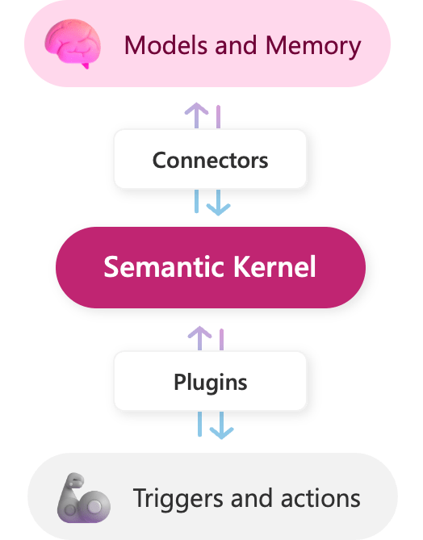

# Semantic Kernel Workshop

This is an envisioning workshop, based on Microsoft's Copilot stack [Microsoft's Copilot stack](https://learn.microsoft.com/en-us/semantic-kernel/overview/#semantic-kernel-is-at-the-center-of-the-copilot-stack), to rethink user experience, architecture, and app development by leveraging the intelligence of foundation models. This workshop will use Semantic Kernel (SK), along with SK's Design thinking material, to guide you through the lifecycle of intelligent app development. 

---

## Introduction 

Semantic Kernel is an open-source SDK that lets you easily combine AI services like [OpenAI](https://platform.openai.com/docs/), [Azure OpenAI](https://azure.microsoft.com/products/cognitive-services/openai-service/), and [Hugging Face](https://huggingface.co/) with conventional programming languages like C# and Python. By doing so, you will create AI apps that combine the best of both worlds.

The Semantic Kernel has been engineered to allow developers to flexibly integrate AI services into their existing apps. To do so, Semantic Kernel provides a set of connectors that make it easy to add [memories](https://learn.microsoft.com/en-us/semantic-kernel/memories/) and models. In this way, Semantic Kernel is able to add a simulated "brain" to your app.

Additionally, Semantic Kernel makes it easy to add skills to your applications with AI plugins that allow you to interact with the real world. These plugins are composed of prompts and native functions that can respond to triggers and perform actions. In this way, plugins are like the "body" of your AI app.

Because of the extensibility Semantic Kernel provides with connectors and plugins, you can use it to orchestrate AI plugins from both OpenAI and Microsoft on top of nearly any model. For example, you can use Semantic Kernel to orchestrate plugins built for ChatGPT, Bing, and Microsoft 365 Copilot on top of models from OpenAI, Azure, or even Hugging Face.

Semantic Kernel can orchestrate AI plugins from any provider 

As a developer, you can use these pieces individually or together. For example, if you just need an abstraction over OpenAI and Azure OpenAI services, you could use the SDK to just run pre-configured prompts within your plugins, but the real power of Semantic Kernel comes from combining these components together.

---

## Prerequisites

In just a few steps, you can start running the getting started guides for Semantic Kernel in either C# or Python. After completing the guides, you'll know how to...
- Configure your local machine to run Semantic Kernel
- Run AI prompts from the kernel
- Make AI prompts dynamic with variables
- Create a simple AI agent
- Automatically combine functions together with planners
- Store and retrieve memory with embeddings

Before running the guides in C#, make sure you have the following installed on your local machine.
- `git` or the GitHub app
- VSCode or Visual Studio
- An OpenAI key 
- .Net 7 SDK - for C# notebook guides
- In VS Code the Polyglot Notebook - for notebook guides

If you are using Python, you just need git and python. 

First go to the [semantic Kernel](https://github.com/microsoft/semantic-kernel)
Semantic Kernetl, git, knowledge 

---

## Challenge 1

content for 1

---

## Challenge 2

Content for 2

---
