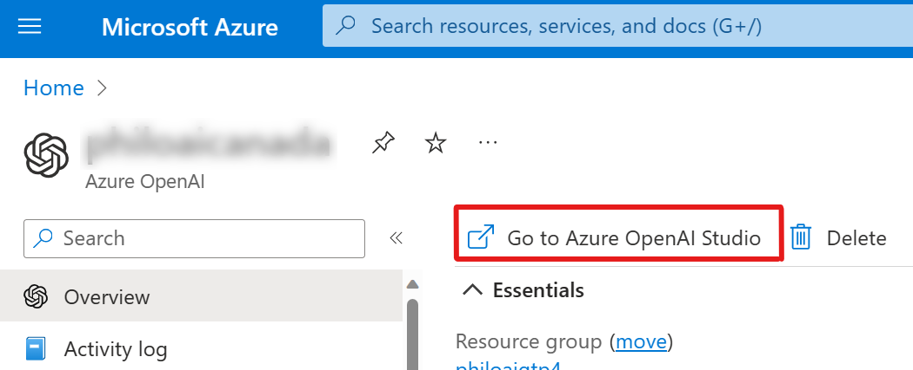

# Semantic Kernel Workshop

This is an envisioning workshop, based on Microsoft's Copilot stack [Microsoft's Copilot stack](https://learn.microsoft.com/en-us/semantic-kernel/overview/#semantic-kernel-is-at-the-center-of-the-copilot-stack), to rethink user experience, architecture, and app development by leveraging the intelligence of foundation models. This workshop will use Semantic Kernel (SK), along with SK's Design thinking material, to guide you through the lifecycle of intelligent app development. 

---

## Introduction 

Semantic Kernel is an open-source SDK that lets you easily combine AI services like [OpenAI](https://platform.openai.com/docs/), [Azure OpenAI](https://azure.microsoft.com/products/cognitive-services/openai-service/), and [Hugging Face](https://huggingface.co/) with conventional programming languages like C# and Python. By doing so, you will create AI apps that combine the best of both worlds.

The Semantic Kernel has been engineered to allow developers to flexibly integrate AI services into their existing apps. To do so, Semantic Kernel provides a set of connectors that make it easy to add [memories](https://learn.microsoft.com/en-us/semantic-kernel/memories/) and models. In this way, Semantic Kernel is able to add a simulated "brain" to your app.

Additionally, Semantic Kernel makes it easy to add skills to your applications with AI plugins that allow you to interact with the real world. These plugins are composed of prompts and native functions that can respond to triggers and perform actions. In this way, plugins are like the "body" of your AI app.

Because of the extensibility Semantic Kernel provides with connectors and plugins, you can use it to orchestrate AI plugins from both OpenAI and Microsoft on top of nearly any model. For example, you can use Semantic Kernel to orchestrate plugins built for ChatGPT, Bing, and Microsoft 365 Copilot on top of models from OpenAI, Azure, or even Hugging Face.

Semantic Kernel can orchestrate AI plugins from any provider 

As a developer, you can use these pieces individually or together. For example, if you just need an abstraction over OpenAI and Azure OpenAI services, you could use the SDK to just run pre-configured prompts within your plugins, but the real power of Semantic Kernel comes from combining these components together.


---

## Prerequisites

In just a few steps, you can start running the getting started guides for Semantic Kernel in either C# or Python. After completing the guides, you'll know how to...
- Configure your local machine to run Semantic Kernel
- Run AI prompts from the kernel
- Make AI prompts dynamic with variables
- Create a simple AI agent
- Automatically combine functions together with planners
- Store and retrieve memory with embeddings

Before running the guides in C#, make sure you have the following installed on your local machine.
- `git` or the GitHub app
- VSCode or Visual Studio
- An OpenAI key 
- .Net 7 SDK - for C# notebook guides
- In VS Code the Polyglot Notebook - for notebook guides

If you are using Python, you just need git and python. 

First go to the [semantic Kernel](https://github.com/microsoft/semantic-kernel)
Semantic Kernetl, git, knowledge 

---

## Challenge 1: Azure OpenAi Playground

### Prerequisites

- An Azure account with an active subscription. [Create an account for free](https://azure.microsoft.com/free/?WT.mc_id=academic-0000-jabenn).
- An Azure OpenAI Services Instance. [Create an instance](https://learn.microsoft.com/en-us/azure/ai-services/openai/how-to/create-resource?pivots=web-portal).
- Some models deployments. [Deploy a model](https://learn.microsoft.com/en-us/azure/ai-services/openai/how-to/create-resource?pivots=web-portal#deploy-a-model). 


To access the Azure OpenAI portal, go to [Azure OpenAI portal](https://oai.azure.com/) or by clicking on the link on your Azure OpenAI instance on the Azure portal.



Once, in the Azure OpenAI portal, you'll find everything to take the most advantage of the service: 
- You'll be able to manage your **models and your deployments (1)**. 
- You will have interractibve playground to customize and test your models with the **playgrounds (2)**
- You will find very usefull resources like **samples (3)** to accelerate your development 


<div class="info" data-title="note">

> The models avalailable are not only OpenAI models but a lot of other models from different providers.
You can deploy models like Ada (text embeddings), GPT 3.5 and 4, Davinci, Dall-E, and others models from providers or your own models in the future...
<br/><br/>
For the upcomming Hands-on-lab we recommend that you deploy at least a **GPT model** and a **Ada text embeddings model**.

</div>

### Step 1: Set Up a Conversational Agent

In the Azure OpenAI Studio, open the Chat playground by clicking on the link in the left pane.

<br/><br/>
In this playground you have 3 main panels:
- **Assistant Setup**: you define your assistant goal, and how it should behave. There is a few sample available to help you get started, give it a try to start understanding how it works. This is also in this panel that you will train your assistant with you own data but we'll see that later.
- **Chat**: this is the place where you can test your assistant. You can type your question and see the answer from your assistant.
- **Configuration**: this is where you can define the parameters of you assistant regarding the deployed model you use. You can select the deployment and define the parameters you send to the model depending on what kind of result you want to get.

There's a few parameters that will have big impact on the kind of answer that will be generated. Keep in mind that the two most important parameters are the **temperature** and the **max response** for you to define:
- **Temperature**: The higher the temperature, the more random the response. The lower the temperature, the more predictable the response. The default temperature is 0.7. **Top P** is an alternative to temperature that sets the probability that the model will choose from the most likely tokens. The default is 1.0.
- **Max response**: The maximum number of tokens to generate. The default is 64.

<br/>

Try to play with the parameters and see how it impacts the answer.

### Step 2: Build, Train and Deploy you assistant with your own data

Now that you started building your assistant, you can start training it with your own data. As the OpenAI service is a constantly evolving service, the way you can train your assistant can change over time. 

You will find a step by step guide on how to train your assistant with your own data from the playground [here](https://learn.microsoft.com/en-us/azure/ai-services/openai/use-your-data-quickstart).


### Validate the challenge:

In order to validate the challenge, you should be able to demonstrate a working conversational agent that can answer questions based on your own data.

---

## Challenge 2: Semantic Kernel Samples

### Prerequisites

It's time to play with Semantic Kernel! Let's start by cloning the repository and open it in VS Code (or your favorite IDE).

```bash
git clone https://github.com/microsoft/semantic-kernel.git
cd semantic-kernel
code .
```

You'll find a few folders containing everything you need to build AI Apps with semantic kernel in this repository:
- **/docs**: you'll find all the documentation you need to get started with Semantic Kernel
- **/samples**: you'll find a few samples to get started with Semantic Kernel
- **/dotnet , /python, ...**: you'll find the source code of Semantic Kernel in the given language and a bunch of samples and skills for each language
- **/*.md files**: you'll find this documentation that will help you get started with Semantic Kernel, explaining concepts and how to run the samples


### Simple Chat Summary sample

Let's start by the most simple sample: the Simple Chat Summary sample. This sample is a simple chatbot that will summarize the conversation.
You'll find it in the **samples/apps** folder.

Take your time to build and run this sample and explore the skills and the code. You'll find a lot of comments in the code to help you understand how it works.

Your goal here is simply to run the sample and try to understand how it works. Once you're pretty confident with it, you can go to the next step: the **Book Generator sample** to start seeing another powerful feature of Semantic Kernel: the planner, that helps you orchestrate skills together to build more complex scenarios.

### Book Generator sample

The power of semantic kernel is the ability to orchestrate skills together to build more complex scenarios. You can create static plans by assembling skills together, but you can also leverage the power of semantic kernel to dynamically create plans based on the context of the conversation.

In this sample, you'll find a simple book generator that will generate a book based on the conversation. You'll find it in the **samples/apps** folder. Try it and see how it works.

### Validate the Challenge 

Now that you have an app that can generate book for childrens, try to add a new skill to the book generator that will generate a book cover based on the conversation with the Dall-E service. You can find a sample of a skill that generates a book cover in the **samples/skills** folder.

<div class="info" data-title="note">

> If you don't have a Dall-E deployment and you're running this Hands-On-Lab in a proctored session, ask to your proctor to provide a Dall-E model for you.

</div>

---

## Challenge 3: Build it from Scratch

Content for 3

---