# The Serverless Workshop

Welcome to this Azure Serverless Workshop. You'll be experimenting with Azure Serverless services in multiple labs to achieve a real world scenario. Don't worry, even if the challenges will increase in difficulty, this is a step by step lab, you will be guided through the whole process.

During this workshop you will have the instructions to complete each steps. It is recommended to search for the answers in provided resources and links before looking at the solutions placed under the 'Toggle solution' panel.

<!--  TODO : Remind what Serverless is : Event based (explain what we have : EVG , EH, SB), Main Compute Services, Storage Account, Cognitive Services, Data Services not taken into account for the workshop.
 "Did you know that basic storage accounts are one of the first serverless"
      Resources :
      - https://learn.microsoft.com/en-us/dotnet/architecture/serverless/azure-serverless-platform
      - https://azure.microsoft.com/en-us/solutions/serverless/
      Pourquoi on présenter Serverless  -->

---

# The Workshop

## Prerequisites (15 minutes)

Before starting this workshop, be sure you have:

- An Azure Subscription with the `Contributor` role to create and manage the labs' resources
- A dedicated resource group for this lab to ease the cleanup at the end.
- The [Azure CLI][az-cli-install] installed on your machine
- The [Azure Functions Core Tools][az-func-core-tools] installed, this will be useful for creating the scaffold of your Azure Functions using command line.
- If you are using VS Code, you can also install the [Azure Function extension][azure-function-vs-code-extension]
- Register the Azure providers on your Azure Subscription if not done yet: `Microsoft.CognitiveServices`, `Microsoft.DocumentDB`, `Microsoft.EventGrid`, `Microsoft.KeyVault`, `Microsoft.Logic`,`Microsoft.Web`
    
<div class="task" data-title="Task">

>  Instructions and solutions will be given for the Azure CLI, but you can also use the Azure Portal if you prefer. The inputs and parameters to select will be defined, all the rest can remain as default as it has no impact on the scenario. 
> 
>  Log into your Azure subscription locally using Azure CLI and on the [Azure Portal][az-portal] using your own credentials.

</div>

<details>
<summary>Toggle solution</summary>

```bash

# Login to Azure
az login
# Display your account details
az account show
# Select your Azure subscription
az account set --subscription <subscription-id>

# Register the following Azure providers if they are not already 

# Azure Cognitive Services 
az provider register --namespace 'Microsoft.CognitiveServices'
# Azure CosmosDb 
az provider register --namespace 'Microsoft.DocumentDB'
# Azure Event Grid
az provider register --namespace 'Microsoft.EventGrid'
# Azure Key Vault
az provider register --namespace 'Microsoft.KeyVault'
# Azure Logic Apps 
az provider register --namespace 'Microsoft.Logic'
# Azure Functions 
az provider register --namespace 'Microsoft.Web'

```

</details>

## Scenario (10 minutes)

The goal of the full lab is to upload an audio file to Azure and retrieve the transcripts back using a Web Application.

Here is a diagram to illustrate the flow:


1. A user uploads an [audio file](assets/whatstheweatherlike.wav) from the Web application
2. The web application sends an HTTP request to APIM (API Management) which is a facade for multiple APIs
3. An Azure Function which acts as an API will process the request and upload the file to a Storage Account
4. When the file is uploaded the Event Grid service will detect it and publish the "Blob created event"
5. The Event Hub System Topic will trigger a Logic App
6. The Logic App retrieves the uploaded audio file
7. The audio file is sent to Azure Cognitive Services
8. The speech to text service will process the file and return the result to the Logic App
9.  The Logic App will then store the transcript of the audio file in a Cosmos DB database
10.  A second Azure Function will be triggered by the update in CosmosDB. It will fetch the transcript from CosmosDB and send it to Web Pub/Sub
11.  Finally Web Pub/Sub will notify the Web Application about the new transcript using Websockets

<div class="info" data-title="Note">

> Azure Key Vault will be used to secure the secrets used through the entire scenario.

</div>

You will get more details about each of these services during the Hands On Lab.

## Naming conventions

Before starting to deploy any resource in Azure, it's important to follow a naming convention to ensure resource name uniqueness and ease their identification. Based on the official [documentation][az-naming-convention] we need to define a few things:

- The application name
- The environment
- The region
- The instance number

We will also add an owner property, so for the purpose of this lab the values will be:

- The service prefix: `func` (for Azure Function)
- The environment: `dev`
- The region: `we` (for West Europe)
- The application name: `hol` (for Hands On Lab)
- The owner: `ms`
- The instance: `01`

We will use this convention for the rest of the scenario:

```xml
<!--If the resource prefix has a dash: -->
<service-prefix>-<environment>-<region>-<application-name>-<owner>-<instance>
<!--If the resource does not autorize any special caracters: -->
<service-prefix><environment><region><application-name><owner><instance>
```

<div class="info" data-title="Note">

> Be sure to use **your own values** to have unique names or use your own convention.
> [Official resource abbreviations][az-abrevation]
> 
> Some services like Azure Storage Account or Azure KeyVault have a maximum size of 24 characters, so please consider using relevant abbreviations as small as possible.

</div>

## Programming language

We will have to create few functions in this workshop to address our overall scenario. You can choose the programming language you are the most comfortable with among the ones [supported by Azure Functions][az-func-languages]. We will provide examples in Python for the moment, but other languages might come in the future.

With everything ready let's start the lab 🚀

[az-cli-install]: https://learn.microsoft.com/en-us/cli/azure/install-azure-cli
[az-func-core-tools]: https://learn.microsoft.com/en-us/azure/azure-functions/functions-run-local?tabs=v4%2Clinux%2Ccsharp%2Cportal%2Cbash#install-the-azure-functions-core-tools
[az-func-languages]: https://learn.microsoft.com/en-us/azure/azure-functions/functions-versions#languages
[az-naming-convention]: https://learn.microsoft.com/en-us/azure/cloud-adoption-framework/ready/azure-best-practices/resource-naming
[az-abrevation]: https://learn.microsoft.com/en-us/azure/cloud-adoption-framework/ready/azure-best-practices/resource-abbreviations
[az-portal]: https://portal.azure.com
[vs-code]: https://code.visualstudio.com/
[azure-function-vs-code-extension]: https://marketplace.visualstudio.com/items?itemName=ms-azuretools.vscode-azurefunctions

---

# Lab 1 : Transcribe an audio file

For this first lab, you will focus on the following scope :

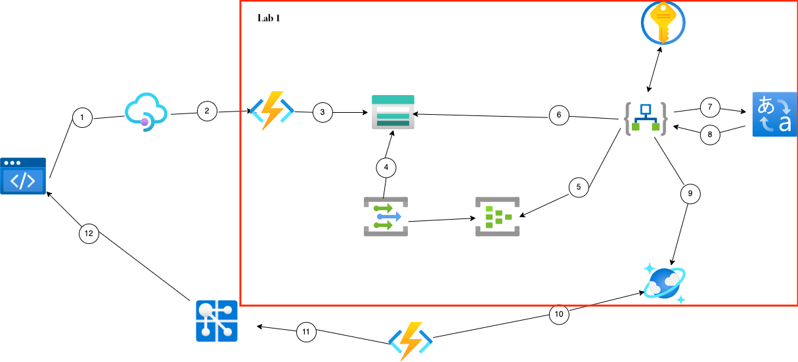

## Create a resource group (5 minutes)

Let's start by creating the resource group for this Hand's On Lab. The resource group is a logical structure to store Azure components used to group your Azure resources.

<div class="info" data-title="Note">

> For the purpose of this lab we will create all the resources in the same region, for instance France Central (francecentral) or West Europe (westeurope).

</div>

Remember, the naming convention for a resource groups will be: `rg-<environment>-<region>-<application-name>-<owner>-<instance>`

<div class="task" data-title="Resources">

> [Resource Groups][resource-group]

</div>

[resource-group]: https://learn.microsoft.com/fr-fr/cli/azure/group?view=azure-cli-latest

<details>
<summary>Toggle solution</summary>

```bash
# Use az account list-locations to get a location:

az account list-locations -o table

# Then create the resource group using the selected location:

az group create --name <resource-group> --location <region>
```

</details>

## Create the storage account (5 minutes)

The Azure storage account is used to store data objects, including blobs, file shares, queues, tables, and disks. You will use it to store the audios files inside an `audios` container.

With the resource group ready, let's create a storage account with a container named `audios` that will store all audios. The naming convention for a Storage Account is: `st<environment><region><application-name><owner><instance>`.

<div class="info" data-title="Note">

> Azure Storage Account names do not accept hyphens and cannot exceed a maximum of 24 characters.

</div>

Choose a Locally redundant storage (Standard LRS).

Once the storage account is ready, create a blob container named `audios` with `private access`.

<div class="task" data-title="Resources">

> [Storage Account][storage-account]<br> 
> [Storage Account Container][storage-account-container]

</div>

[storage-account]: https://learn.microsoft.com/fr-fr/cli/azure/storage/account?view=azure-cli-latest
[storage-account-container]: https://learn.microsoft.com/fr-fr/cli/azure/storage/container?view=azure-cli-latest

<details>
<summary>Toggle solution</summary>

```bash
# Create the Storage Account with Standard LRS

az storage account create -n <storage-account-name> \
                          -g <resource-group> \
                          -l <region> \
                          --sku Standard_LRS
```

Based on the command line below, to create the container for the audio files you need to get an access key:


```bash
# Then create the audios container inside it

az storage container create -n audios \
                            --account-name <storage-account-name> \
                            --account-key <storage-account-key>
```

To check everything was created as expected, open the [Azure Portal][az-portal] and you should retrieve your container:


</details>

[az-portal]: https://portal.azure.com

## Detect a file upload event (10 minutes)
### Create the Event Grid System Topic

Serverless is all about designing the application around event-driven architectures. Azure offers several options when it comes to message and event brokering, with the principal following services : 
- Event Grid is a `serverless` eventing bus that enables event-driven, reactive programming, using the publish-subscribe model.
- Service Bus is a fully managed enterprise `message broker` with message queues and publish/subscribe topics.
- Event Hub is a big data streaming platform and event ingestion service. It can receive and process millions of events per second.

<div class="info" data-title="Note">

> Each of these services offer their own set of capabilities and will be preferred depending on the expected architecture design and requirements. 
> You can find a detailed article which compares the pros and cons of each of these solutions [following this link][azure-messaging-services]

</div>

The Event Grid is an event broker that you can use to integrate applications while subscribing to event sources. These events are delivered through Event Grid to subscribers such as applications, Azure services, or any accessible endpoint. Azure services, First and Third-party SaaS services as well as custom applications can be the source of these events. 

The main Event Grid concept we'll use for the rest of this lab is called `System Topic`. A system topic in Event Grid represents one or more events published by Azure services such as Azure Storage and Azure Event Hubs. It basically plays the role of a pub-sub topic centralizing all the events of the associated Azure resource, and send them to all the subscribers based on their defined `event filters`.

You can create Event Grid System Topics :
- Directly from the resource you want to monitor (for instance a storage account) using the `Events` menu. A system topic will be created automatically with a unique name and will be linked to the resource.
- Manually, using the `System Topics` resource type in the azure portal, or thanks to the Azure CLI. This will allow you to define the name of the system topic and the resource it will be linked to.

For this step, creating the Event Grid System Topic will be enough, as the actual `event subscription` and `event filters` will be defined and automatically created by the Logic App trigger setup [later on](workshop/serverless-overview/?step=2#trigger-the-logic-app).

Here are the parameters to use to create the Event Grid System Topic:
- Topic type : `Microsoft.Storage.StorageAccounts`
- Source : Select the storage account created in the previous steps (`stdevhol...` in our lab)
- Location : Must be the same location as the storage account

The naming convention for an Event Grid System Topic is: `egst-audio-storage-<environment>-<region>-<application-name>-<owner>-<instance>`

<div class="tip" data-title="tip">

> To get access to the identifier of a resource, go to the `Overview` tab and click en `Json View` on the top right and you will see it.

</div>

<div class="task" data-title="Resources">

> [Choose between Azure Messaging Services][azure-messaging-services]<br> 
> [Event Grid System Topic][event-grid-system-topic]<br> 
> [Event Grid Topic Subscription][event-grid-topic-subscription]<br> 

</div>

[event-grid-system-topic]: https://learn.microsoft.com/en-us/azure/event-grid/system-topics
[event-grid-topic-subscription]: https://learn.microsoft.com/en-us/cli/azure/eventgrid/system-topic/event-subscription?view=azure-cli-latest
[azure-messaging-services]: https://learn.microsoft.com/en-us/azure/service-bus-messaging/compare-messaging-services

<details>

<summary>Toggle solution</summary>

To create an Event Grid System Topic, several parameters are mandatory : 
- `--topic-type` must be set to the `type` of resource raising the events (`microsoft.storage.storageaccounts` in our lab)
- `--source` will define the actual Azure `resource` from which we want to centralize the events (`stdevhol...` in our lab) 
- `--location` must be the same as the source resource.

```bash

#Create the event grid system topic
az eventgrid system-topic create \
  -g <resource-group> \
  --name <event-grid-system-topic-name> \
  --topic-type microsoft.storage.storageaccounts \
  --source /subscriptions/<subscription-id>/resourcegroups/<resource-group>/providers/Microsoft.Storage/storageAccounts/<storage-account-name> \
  --location <region>

```

Now you should see the Event Grid System Topic in your Resource Group : 

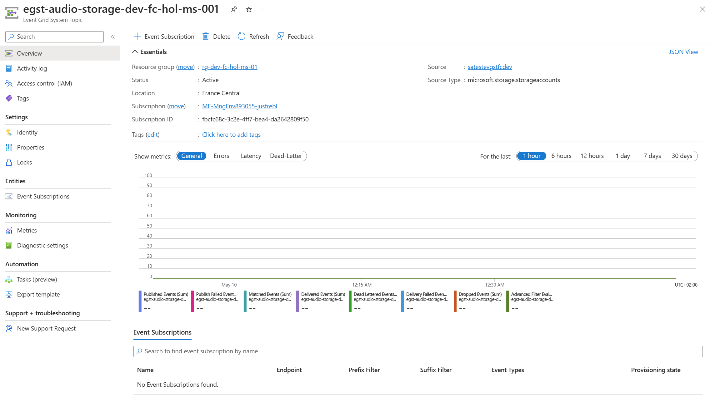

</details>

## Process the event (2 hours)

You'll now build a Logic App workflow that will trigger when a blob will be uploaded to the storage account created earlier.
This section of the Lab will describe all the steps that the Logic App will take to address this scenario : 

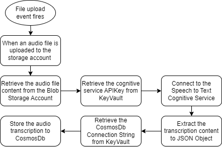

### Create the Logic App (10 minutes)

Azure Logic Apps is an integration platform as a service where you can create and run automated workflows with little to no code. The design of Logic Apps is mainly designer oriented, and a visual designer can be used to compose a workflow with prebuilt operations which can quickly build a workflow that integrates and manages your apps, data, services, and systems. While creating and testing a flow is way easier with the help of the designer, it still gives capabilities to export the resulting flow as a JSON `template` file to enable versioning, DevOps or separate environment requirements. 

Logic Apps offer two main hosting plans which currently differ in functionalities: consumption (multi-tenant) and standard (single-tenant):

- `Standard` mode is a dedicated hosting environment (single-tenant) for which resource allocation (CPU/RAM) will be selected at the creation of the resource. This option will let you build different various workflows in the same resource (dedicated capacity) as long as it has enough resources allocated to execute them. This model is billed at a fixed hourly/monthly rate regardless of its actual usage. 
- `Consumption` is the serverless option for Logic Apps and will be the fastest way to start with Logic Apps workflow. This model will let you design one workflow per resource and will make sure necessary resources are available for any parallel executions. As a rule of thumb, a Logic Apps workflow in consumption will be billed based on the actual number of executions as well as the overall number of actions (aka building blocks) that compose it.

In our serverless scenario, we will create a Logic Apps Workflow in `consumption` mode. 

The naming convention for Logic Apps is: `logic-<environment>-<region>-<application-name>-<owner>-<instance>`

Once the Logic App resource is created, create a blank `template` workflow. 

Below is the `definition template` to save locally in a JSON file named `my-blank-template.json` if you decide to create the logic app via the Az CLI.

```json
{
  "definition": {
    "$schema": "https://schema.management.azure.com/providers/Microsoft.Logic/schemas/2016-06-01/workflowdefinition.json#",
    "actions": {},
    "contentVersion": "1.0.0.0",
    "outputs": {},
    "parameters": {},
    "triggers": {}
  },
  "parameters": {}
}
```

<div class="task" data-title="Resources">

> [Azure CLI Extension][azure-cli-extension]<br> 
> [Azure Logic App][azure-logic-app]

</div>

[azure-cli-extension]: https://learn.microsoft.com/en-us/cli/azure/azure-cli-extensions-overview
[azure-logic-app]: https://learn.microsoft.com/en-us/cli/azure/logic/workflow?view=azure-cli-latest

<details>
<summary>Toggle solution</summary>

```bash

# Install the Logic App extension for Azure CLI
az extension add --name logic

# Create a logic app in consumption mode
az logic workflow create --resource-group <resource-group>
                         --location <region>
                         --name <logic-app-name>
                         --definition <path-to-default-workflow.json>

```

</details>

### Trigger the Logic app (20 minutes)

Next step is to actually trigger the Logic App based on the event raised by Event Grid when a file is uploaded to the audios' container.

Logic Apps offers different components which can be used to define the `steps` of a flow as a chain of `actions` and `controls`. Here are the main ones : 
- Operations : `Triggers` and `Actions` are the main building blocks of a Logic App. A `trigger` is the event that starts the workflow and an `action` is a step in this workflow. 
- Controls : Switch, Loop, Condition, Scope are used to control the flow of the steps composing the actual logic of the workflow.
- Connectors : Standard and Enterprise connectors are used to connect to different first of third party services and applications. These connectors abstract the complexities of interacting with these services by defining their required and optional inputs as well as deserializing their outputs to `dynamic objects` usable in the rest of the flow steps.

Here's an example of what a simple flow could look like in Logic Apps : 
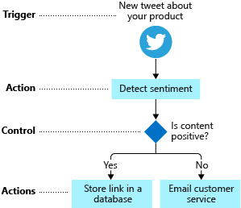


Let's start with our first step :
We will use the `Event Grid` connector to `trigger` the Logic App when a file is uploaded to the storage account `audios` container.

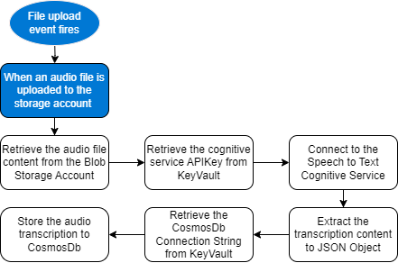

This workflow will subscribe to the `Blob created event` raised and passed on by an Event Grid `subscription` to the `System Topic` created earlier. 

While you create this trigger, you will be asked to provide the actual resource or System Topics' details that will be used to trigger the Logic App.
In our case, select and connect to the `Storage account` created earlier.

Then define the actual conditions you want to meet to trigger the Logic App.
In our case, we only want to trigger the flow if the following criteria are met :

- Only trigger on `blob created` events
- The file is uploaded in the `audios` container otherwise ignore it
- The file extension is `.wav`

The naming convention for Event Subscription is: `evgs-audios-uploaded-<environment>-<region>-<application-name>-<owner>-<instance>`

<div class="info" data-title="Note">

> While saving the Logic Apps trigger settings, the Event Grid connector will actually create a new Event Grid subscription to the System Topic created earlier. You can check this by navigating to the Event Grid System Topic in the Azure Portal and checking the `Event Subscriptions` tab : 
>  

</div>

Here you can download a basic audio file to validate and test the logic app triggers as expected: [Audio demo](assets/whatstheweatherlike.wav).

If you have set everything as expected, you should see the following entry in the Logic App's run history after uploading the example file in your storage account audios container : 


<div class="task" data-title="Resources">

> [Logic Apps Event Grid Trigger][logic-apps-event-grid-trigger]<br>
> [Event Grid Subject Filter][event-grid-subject-filtering]

</div>

[logic-apps-event-grid-trigger]: https://learn.microsoft.com/en-us/connectors/azureeventgrid/#when-a-resource-event-occurs
[event-grid-subject-filtering]: https://learn.microsoft.com/en-us/azure/event-grid/event-filtering#subject-filtering

<details>
<summary>Toggle solution</summary>


In the [Azure Portal][az-portal] inside the Logic App just created click on the `Edit` button. Then select `Blank Logic App`. In the triggers list search for `Event Grid` and select the `When a resource event occurs` trigger.

You will then select your `Azure Subscription`, `Microsoft.Storage.StorageAccounts` as a Resource Type and the actual storage account created earlier.

Next step would be to configure the event type we want to listen to. In our case, we will select `Blob created` as the event type Item.

Parameters below will help in filtering the events we want to listen to. In our case, we will filter on the `audios` container, and the `.wav` file extension.
The convention to filter on a specific blob container is as follows : `/blobServices/default/containers/<container-name>`.

Finally, set the Event Grid `Subscription Name` to `evgs-audios-uploaded-<environment>-<region>-<application-name>-<owner>-<instance>`.

Once everything is set, click on the `Save` button and the trigger operation should look like this : 

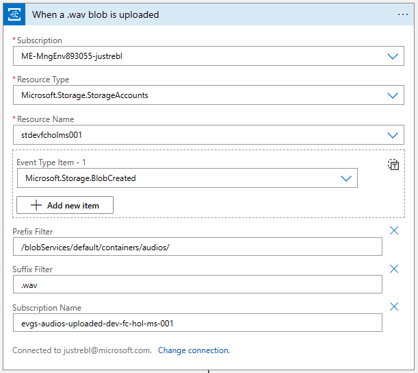 

It is also possible to rename the different operations of your Logic App to make it easier to read and understand. To do so, click on the `...` button on the top right corner of the block and select `Rename`.

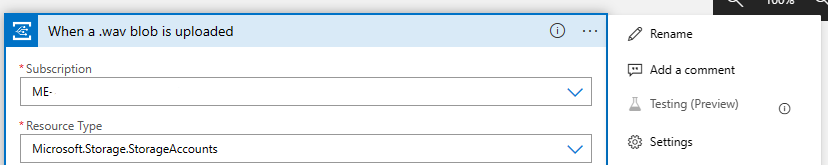

</details>

[az-portal]: https://portal.azure.com


### Retrieve file content (30 minutes)

Now we have a blob upload event triggering the Logic App, we will be able to work with extended `metadata` shared in the event message.

<div class="info" title="Note">

> It's important to note an event grid event message is limited to 1MB per event, thus it will not provide the actual content of the file uploaded to the storage account. Instead, it will contain the path to the file in the storage account. This is why we need to use the `Get blob content` action to retrieve the actual content of the file.

</div>

One of the event fields is the `subject` which is the path to the event source : The uploaded file in the storage account.
To make flow design easier, it is possible to provide with a sample json payload string and Logic Apps will automatically generate a more convenient object to manipulate in the rest of the flow design.

Event Grid will communicate events based on a common schema by default, that can be found [here][event-grid-common-schema]. 
As the Event Grid Trigger is an operation built-in in Logic Apps, the designer is already taking care of this JSON parsing operation for us and provides with a well defined object to work with as `Dynamic Content` for the rest of the flow.

This will help us to retrieve the actual content of the file and pass it on to the cognitive service in the next step.
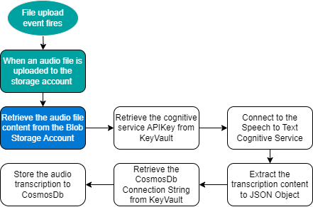

Based on below resources and the previous definition step, you should be able to complete this task.

<div class="tip" data-title="tip">

> To help you troubleshoot the flow, you can use the `Run History` tab and check the `Inputs` and `Outputs` of each operation : 
> 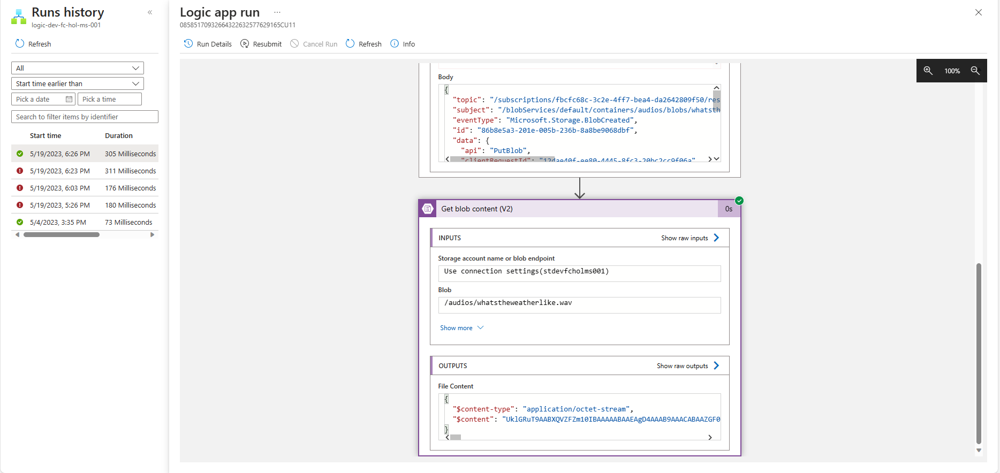

</div>

<div class="task" data-title="Resources">

> [Logic Apps Parse Json][logic-app-parse-json]<br> 
> [Logic App Storage Account Action][logic-app-storage-action]<br>

</div>

[logic-app-parse-json]: https://learn.microsoft.com/en-us/azure/logic-apps/logic-apps-perform-data-operations?tabs=consumption#parse-json-action
[logic-app-storage-action]: https://learn.microsoft.com/en-us/azure/connectors/connectors-create-api-azureblobstorage?tabs=consumption
[event-grid-common-schema]: https://learn.microsoft.com/en-us/azure/event-grid/event-schema#event-schema


<details>
<summary>Toggle solution</summary>

First of all, add a new step after the Event Grid trigger and search for `Azure Blob Storage` as an action. Select `Get blob content (V2)` as the action to use.

This operation needs to be parameterized with the authentication information to access the storage account.

In the `Connection Name` field, fill in with `StorageAccountConnection`. 

Select the `Access Key` authentication method and set the name of the storage account created earlier.

Finally, retrieve the `Primary Key` from your Storage Account `Access keys` panel and fill in the `Access Key` field and click `Create`.


You now need to provide the path to the file we want to retrieve the content from after selecting the connection settings you configured above.

As the Event Grid Trigger operation already takes care of the JSON parsing, we can directly use the `subject` field as input for the `Blob` field.
While clicking on the `Blob` field you should be presented with a list of `Dynamic content` available. These will be updated based on the previous steps known by the action being edited.

Update the `Blob` field with the path of the audio file extracted from the event grid `data.url` property thanks to the `uriPath` function:

```js

// This will extract the path from the uri provided as an input
// It's important to make sure the Event Grid trigger output is recognized as dynamic content in the interface before using it in the formula field 
uriPath(triggerBody()?['data']?['url'])
```

`uriPath()` will extract the path from a uri provided as an input, in our example `https://<storage-account>.blob.core.windows.net/audios/whatstheweatherlike.wav` will become `audios/whatstheweatherlike.wav`.

Your Logic App should look like this:

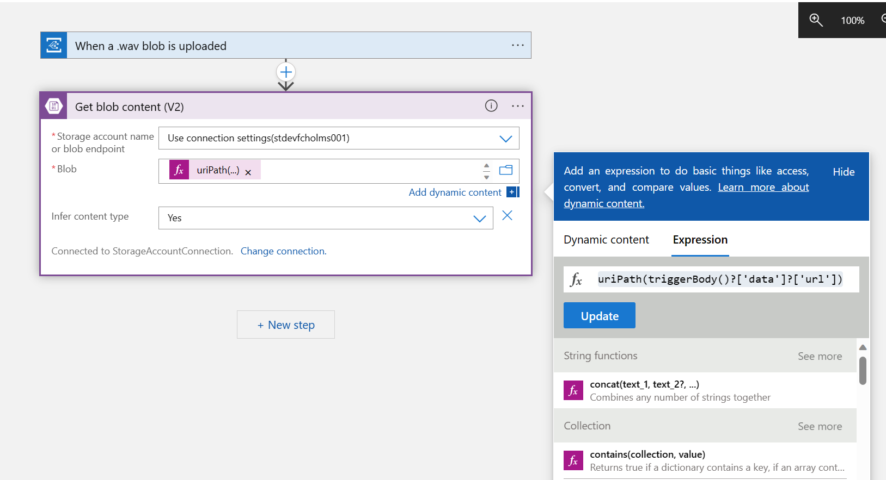

</details>

### Consume Speech to Text APIs (30 minutes)

The Azure Cognitive Services are cloud-based AI services that give the ability to developers to quickly build intelligent apps thanks to these pre-trained models. They are available through client library SDKs in popular development languages and REST APIs.

Cognitive Services can be categorized into five main areas:

- Decision : Content Moderator provides monitoring for possible offensive, undesirable, and risky content. Anomaly Detector allows you to monitor and detect abnormalities in your time series data. 
- Language : Azure Language service provides several Natural Language Processing (NLP) features to understand and analyze text.
- Speech : Speech service includes various capabilities like speech to text, text to speech, speech translation, and many more.
- Vision : The Computer Vision service provides you with access to advanced cognitive algorithms for processing images and returning information.
- Azure OpenAI Service : Powerful language models including the GPT-3, Codex and Embeddings model series for content generation, summarization, semantic search, and natural language to code translation.

To access these APIs, create a `cognitive service` resource in your subscription. This will instantiate a resource with an associated `API Key` necessary to authenticate the API call owner and apply rate and quota limits as per selected pricing tier.

We now want to retrieve the transcript out of the audio file uploaded thanks to the speech to text cognitive service.

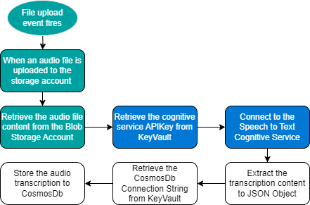

To do this, you will have to:

- Instantiate the cognitive service as a `Free` tier
- Retrieve your auto-generated `Api Key` 
- Call the speech to text API

<div class="important" data-title="Security">

> Remember to store secrets as connection strings and `Api keys` in an Azure Key Vault to manage and secure their access.

</div>

The naming conventions are:

- Cognitive services: `cog-<environment>-<region>-<application-name>-<owner>-<instance>`
- Key Vault: `kv-<environment>-<region>-<application-name>-<owner>-<instance>`

<div class="task" data-title="Resources">

> [What are Cognitive Services][cognitive-services]<br>
> [Cognitive service Apis][cognitive-services-apis]<br> 
> [Cognitive Service Getting Started][cognitive-service-api]<br>
> [Create a Key Vault][key-vault]

</div>

[cognitive-services]: https://learn.microsoft.com/en-us/azure/cognitive-services/what-are-cognitive-services
[cognitive-services-apis]: https://learn.microsoft.com/en-us/cli/azure/cognitiveservices/account?view=azure-cli-latest
[key-vault]: https://learn.microsoft.com/fr-fr/cli/azure/keyvault?view=azure-cli-latest
[cognitive-service-api]: https://learn.microsoft.com/en-us/azure/cognitive-services/speech-service/get-started-speech-to-text?tabs=macos%2Cterminal&pivots=programming-language-rest

<details>
<summary>Toggle solution</summary>

```bash
# Let's create the speech to text service account as free tier
az cognitiveservices account create -n <cognitive-service-name> -g <resource-group> --kind SpeechServices --sku F0 -l <region> --yes
# Create the Key Vault to secure the speech to text API key
az keyvault create --location <region> --name <key-vault-name> --resource-group <resource-group>
```

To allow the Logic App to access the Key Vault, you need to grant access to it. Go to your Logic App and inside the identity tab, turn on the `System Identity`:


Then in your Key Vault, go to `Access policies` and create a new one, set the Secret access to `Get` and `List`:


Then search for your logic app.


Now inside your Key Vault, in the `Secret` section add a new one called `SpeechToTextApiKey` and set a key from the cognitive service.


With all of these ready, add a new action before the loop by searching for `Key Vault` and then select `Get Secret`. This will load the speech to text API key once.


Select the Key Vault and the name of the secret.


With that ready, add a new action in the loop by searching for `Http`, then fill in the different parameters like this:


Notice the region of your cognitive service account and the language to use are specified in the API Url.

To validate the flow, go to your storage account and delete the audio file from the `audios` container and upload it once again (to trigger the updated logic app).
In the Logic App `Run History`, you should see the transcript of the audio file as a text output from the HTTP call to Speech to Text API.

</details>

### Store data to Cosmos DB (30 minutes)

Azure Cosmos DB is a fully managed NoSQL database which offers Geo-redundancy and multi-region write capabilities. It currently supports NoSQL, MongoDB, Cassandra, Gremlin, Table and PostgreSQL APIs and offers a serverless option which is perfect for our use case.

Now the cognitive service provided with a transcript of your audio file, you will have to store it in a NoSQL database inside Cosmos DB:

- Create a Cosmos DB account and select the `NoSQL` API
- Set the Capacity Mode to `Serverless`
- Create a database named : `HolDb`
- Add a new collection to store the transcripts : `audios_transcripts`

The naming convention for Cosmos DB account is `cosmos-<environment>-<region>-<application-name>-<owner>-<instance>`

Now we can add the last step of the Logic App flow that will store the transcript in the Cosmos DB database using the `Create or update document V3` operation. Once again, the action will help you set the connection to the cosmos DB collection and ease the insert/update operations by providing a JSON schema.

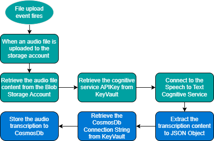


<div class="task" data-title="Resources">

> [Serverless Cosmos DB][cosmos-db]
> [Logic App Cosmos DB action][logic-app-cosmos-db-action]

</div>

[cosmos-db]: https://learn.microsoft.com/en-us/azure/cosmos-db/scripts/cli/nosql/serverless
[logic-app-cosmos-db-action]: https://learn.microsoft.com/en-us/azure/connectors/connectors-create-api-cosmos-db?tabs=consumption

<details>
<summary>Toggle solution</summary>

```bash
# Create the Cosmos DB account using serverless
az cosmosdb create --name <cosmos-db-account-name> \
                   --resource-group <resource-group> \
                   --default-consistency-level Eventual \
                   --locations regionName="<region>" \
                   failoverPriority=0 isZoneRedundant=False \
                   --capabilities EnableServerless

# Instanciate the database inside it
az cosmosdb sql database create --account-name <cosmos-db-account-name> \
                                --resource-group <resource-group> \
                                --name HolDb

# Create the item collection also called container
az cosmosdb sql container create --account-name <cosmos-db-account-name> \
                                 --resource-group <resource-group> \
                                 --database-name HolDb \
                                 --name audios_transcripts \
                                 --partition-key-path "/id"
```

In the last run of your Logic App look at the output body of your HTTP action, and you should see something like this:

```json
{
  "RecognitionStatus": "Success",
  "Offset": 1500000,
  "Duration": 32400000,
  "DisplayText": "What's the weather like?"
}
```

To help you manipulate the JSON output from speech to text add a `Parse Json` action into the Logic App and use the above as a "Sample payload to generate schema" and choose the `Body` response as input:

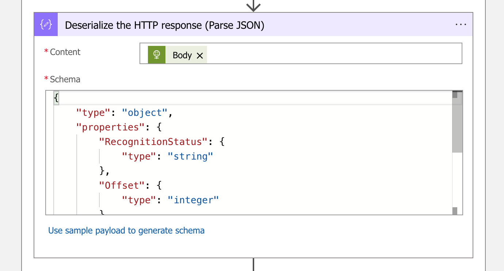

Then add a new step and search for `Cosmos DB`, select `Create or update document (V3)` and set the connection with your Cosmos Db Instance. Select the `Access Key` authentication type and set the `primary key` you can find in the `Keys` section of your Cosmos DB account :

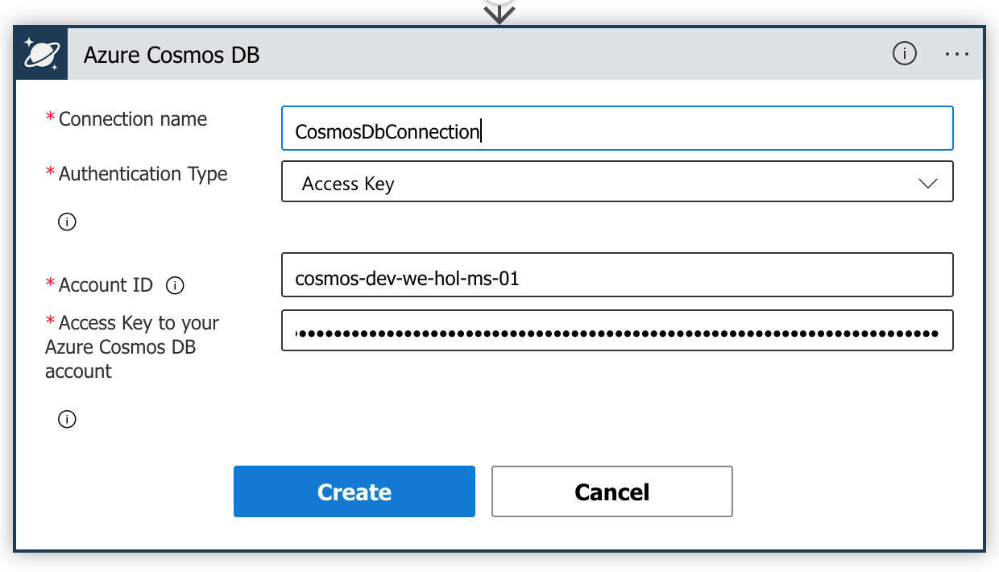

Finally, it's time to compose the document object to insert using JSON and the `dynamic content` from the previous steps. The document should look like this:

```json
{
  "id": <guid-here>,
  "path": <audio-file-storage-account-path>,
  "result": <cognitive-service-text-result>,
  "status": <cognitive-service-status-result>
}
```

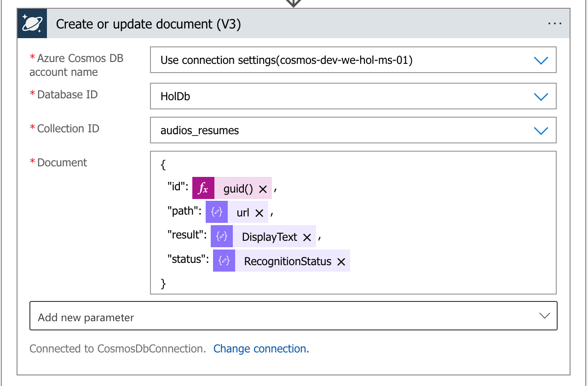

You can now validate the workflow : delete and upload once again the audio file. You should see the new item created above in your Cosmos DB container !

</details>

## Add an API (1 hour)

### Azure Functions : A bit of theory

Azure Functions is a `compute-on-demand` solution, offering a common function programming model for various languages. To use this serverless solution, no need to worry about deploying and maintaining infrastructures, Azure provides with the necessary up-to-date compute resources needed to keep your applications running. Focus on your code and let Azure Functions handle the rest.

Azure Functions are event-driven : They must be triggered by an event coming from a variety of sources. This model is based on a set of `triggers` and `bindings` which let you avoid hardcoding access to other services. Your function receives data (for example, the content of a queue message) in function parameters. You send data (for example, to create a queue message) by using the return value of the function : 
- `Binding` to a function is a way of declaratively connecting another resource to the function; bindings may be connected as input bindings, output bindings, or both. Azure services such as Azure Storage blobs and queues, Service Bus queues, Event Hubs, and Cosmos DB provide data to the function as parameters. 
- `Triggers` are a specific kind of binding that causes a function to run. A trigger defines how a function is invoked, and a function must have exactly one trigger. Triggers have associated data, which is often provided as a parameter payload to the function.

In the same `Function App` you will be able to add multiple `functions`, each with its own set of triggers and bindings. These triggers and bindings can benefit from existing `expressions`, which are parameter conventions easing the overall development experience. For example, you can use an expression to use the execution timestamp, or generate a unique `GUID` name for a file uploaded to a storage account. 

Azure functions run and benefit from the App Service platform, offering features like: deployment slots, continuous deployment, HTTPS support, hybrid connections and others. Apart from the `Consumption` (Serverless) model we're most interested in this Lab, Azure Functions can also be deployed a dedicated `App Service Plan`or in a hybrid model called `Premium Plan`.

### Azure Functions : Let's practice (1 hour)

At this stage in our scenario, the serverless transcription engine is ready and the first lab is almost complete. The last thing you need to add is an API to upload the audio file with a unique `GUID` name to your storage account. 

For this step you will create an `Azure Function` with a POST `HTTP Trigger` and a `Blob Output Binding` to upload the file to the storage account. The Blob Output Binding will use a `binding expression` to generate a unique `GUID` name for the file.

Make sure to create an Azure Function App resource in the Azure portal (or Az CLI) with:

- The `Linux` Operating System
- A plan type set to `Consumption (Serverless)`
- The language you are most comfortable with (Python in our example)

Once the resource is ready in Azure, you can create the Function App locally to ease the development experience on your desktop. The Azure Function Core Tools installed as part of the prerequisites will help you with that.  

An Azure Function example solution will be provided below in Python.

The naming conventions to use are:
For the Azure function: `func-<environment>-<region>-<application-name>-<owner>-<instance>`
For the storage account associated to it: `stfunc<environment><region><application-name><owner><instance>`

<div class="info" data-title="Notes">

> Azure Functions in `consumption` (Serverless) mode will need an associated Storage Account in which store the Function App package. A default one will be created if not specified, but if you want to use an existing storage account to, make sure to use the same region for both the Function App and the Storage Account. 

</div>

<div class="task" data-title="Resources">

> [Azure Functions][azure-function]<br>
> [Azure Function Core Tools][azure-function-core-tools]<br>
> [Basics of Azure Functions][azure-function-basics]<br>
> [HTTP Triggered Azure Function][azure-function-http]<br>
> [Blob Output Binding][azure-function-blob-output]
> [Azure Functions Binding Expressions][azure-function-bindings-expression]

</div>

<details>
<summary>Toggle solution</summary>

```bash

# Create an Azure storage account dedicated to the Azure Function App.
az storage account create --name <function-storage-account-name> \
                          --location <region>  \
                          --resource-group <resource-group> \
                          --sku Standard_LRS

# Create a serverless function app in the resource group.
az functionapp create --name <function-name> \
                      --storage-account <function-storage-account-name> \
                      --consumption-plan-location <region>
                      --runtime python
                      --os-type Linux
                      --resource-group <resource-group> \
                      --functions-version 4
```

You must create a storage account dedicated to your Azure Function in order to not mix the audios files and the Azure Function specificities.

For the coding part, let's create a function using the [Azure Function Core Tools][azure-function-core-tools], **create a folder** and then run:

```bash

# Locally create a folder for your function app and navigate to it
mkdir <function-app-name>
cd <function-app-name>

# Create the new function app as a python project V1 (a Preview V2 also exists and we'll update the lab once generally available)
# No need to specify a name, the folder name will be used by default
func init --worker-runtime python --model V1

# Create a new function endpoint with an HTTP trigger to which you'll be able to send the audio file
func new --language python --name AudioUpload --template 'HTTP Trigger'

# Open the new projet inside VS Code
code . 

```

Create a dev environment for the project:

```sh
python3 -m venv .venv
```

This will ensure the packages needed for your project are installed only for it.

Then, activate the dev environment:

```sh
# Linux
source .venv/bin/activate

# Windows
.\.venv\Scripts\activate
```

Install python packages for the project:

```sh
pip install -r requirements.txt
```

- Create a `func.py` at the same level of `__init__.py`.
- Copy all the content of `__init__.py` into `func.py`.
- Leave the `__init__.py` empty, this is a best practice for Python and the file is mandatory for Python itself to find the other files in the folder.

Update the `function.json` with two environment variables:

- the storage account container : `STORAGE_ACCOUNT_CONTAINER`
- the Storage Account connection string : `STORAGE_ACCOUNT_CONNECTION_STRING`

And don't forget to change the `scriptFile` to use `func.py`:

```json
{
  "scriptFile": "func.py",
  "bindings": [
    {
      "authLevel": "function",
      "type": "httpTrigger",
      "direction": "in",
      "name": "req",
      "methods": ["post"]
    },
    {
      "type": "http",
      "direction": "out",
      "name": "$return"
    },
    {
      "name": "outputblob",
      "type": "blob",
      "path": "%STORAGE_ACCOUNT_CONTAINER%/{rand-guid}.wav",
      "connection": "STORAGE_ACCOUNT_CONNECTION_STRING",
      "direction": "out"
    }
  ]
}
```

Open the Azure Function App resource in the [Azure Portal][az-portal] and go to the `Configuration` panel. Then update the app settings with the `STORAGE_ACCOUNT_CONTAINER` to `audios` and get a connection string from the storage account with your audios container and set the `STORAGE_ACCOUNT_CONNECTION_STRING`.

Update the `func.py` to:

```python
import logging

import azure.functions as func

def main(req: func.HttpRequest, outputblob: func.Out[bytes]) -> func.HttpResponse:
    for input_file in req.files.values():
        filename = input_file.filename
        contents = input_file.stream.read()

        logging.info('Filename: %s' % filename)
        outputblob.set(contents)

    return func.HttpResponse(
        "This HTTP triggered function executed successfully.",
        status_code=200
    )
```

Deploy your function using the VS Code extension or by command line:

Deploy your function using the VS Code :
- Open the Azure extension in VS Code left panel
- Make sure you're signed in to your Azure account
- Open the Function App panel
- Right click on your function app and select `Deploy to Function App...`

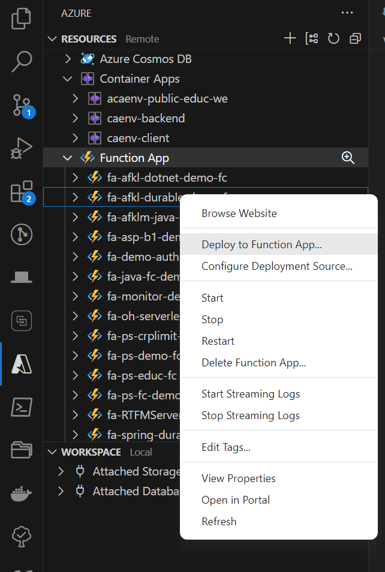

Deployment via Azure Function Core Tools : 
```bash
func azure functionapp publish func-<environment>-<region>-<application-name>-<owner>-<instance>
```

Let's give a try using Postman:

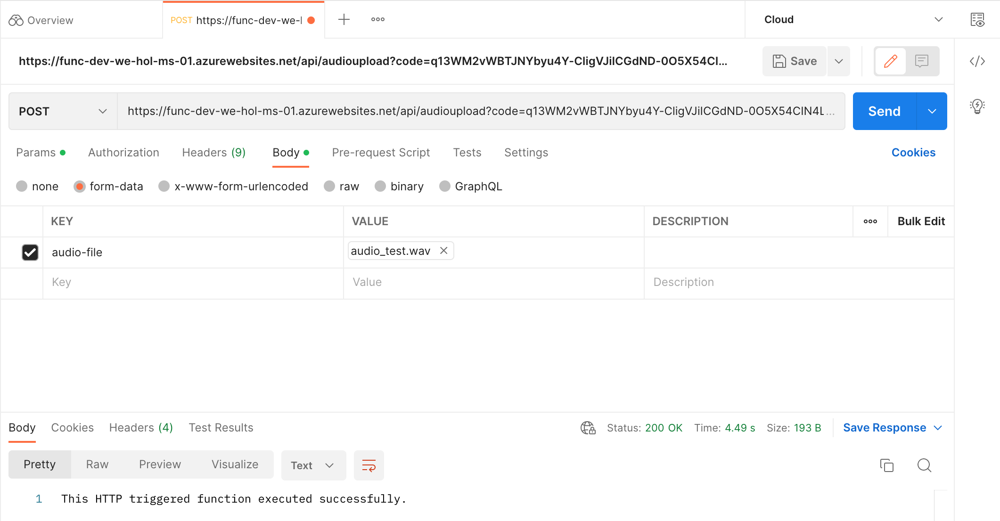

</details>

## Lab 1 : Summary 

By now you should have a solution that : 
- Reacts to new audio files added to a blob storage, based on a specific file type (.wav only), and destination (`audios` container).
- Will invoke the execution of a Logic App Workflow responsible for retrieving the audio transcription thanks to a Speech to Text (Cognitive Service) call.
- Once the transcription is retrieved, the Logic App will store this value in a CosmosDB database.

The Azure Function API created in the last step of this Lab also paves the way to the next lab (Coming soon) where a Web App frontend will be added to the scenario. It also offers a first security to the solution as the Azure Function API requires a key to be called, as well as makes sure all the files are stores with a uniquely generated name (GUID).

The entire architecture is `serverless` : Azure compute resources will only be consumed when a new audio file is uploaded via the Azure Function API. You can leave the resources for a few days to see that *no compute resources are billed* when no audio file is uploaded.

Once you're done with this lab you can delete the resource group you created at the beginning. 
To do so, click on `delete resource group` in the Azure Portal to delete all the resources and audio content at once. The following Az-Cli command can also be used to delete the resource group :

```bash

az group delete --name <resource-group-name> 

```

To resume with Lab 2, Infrastructure as Code will be provided to help you deploy the solution in an automated way.

[az-portal]: https://portal.azure.com
[azure-function]: https://learn.microsoft.com/en-us/cli/azure/functionapp?view=azure-cli-latest
[azure-function-core-tools]: https://learn.microsoft.com/en-us/azure/azure-functions/functions-run-local?tabs=v4%2Cwindows%2Ccsharp%2Cportal%2Cbash
[azure-function-basics]: https://learn.microsoft.com/en-us/azure/azure-functions/supported-languages
[azure-function-http]: https://learn.microsoft.com/en-us/azure/azure-functions/functions-bindings-http-webhook-trigger?pivots=programming-language-python&tabs=python-v2%2Cin-process%2Cfunctionsv2
[azure-function-blob-output]: https://learn.microsoft.com/en-us/azure/azure-functions/functions-bindings-storage-blob-output?pivots=programming-language-python&tabs=python-v2%2Cin-process
[azure-function-bindings-expression]: https://learn.microsoft.com/en-us/azure/azure-functions/functions-bindings-expressions-patterns

---

# Lab 2 : Serverless Website

Coming soon...