## The Serverless Workshop

### Before you start

Welcome to this Azure Serverless Workshop. In this lab, you will use different types of serverless services on Azure to achieve a real world scenario. Don't worry, this is a step by step lab, you will be guided through it.

During this workshop you will have the instructions to complete each steps, try to find the answer before looking at the solution.

### Prerequisites

Before starting this workshop, be sure you have:

- An Azure Subscription with **enough right** to create and manage services
- The [Azure CLI][az-cli-install] installed on your machine
- The [Azure Functions Core Tools][az-func-core-tools] installed, this will be useful for creating the scaffold of your Azure Functions using command line.

<div class="task" data-title="Task">

> Before starting, login to your Azure subscription locally using Azure CLI and inside the [Azure Portal][az-portal] using your own credentials.

</div>

<details>
<summary>Toggle solution</summary>

```bash
# Login to Azure
az login
# Display your account details
az account show
# Select a specific subscription if you have more than one or the wrong one selected
az account set --subscription <subscription-id>
```

</details>

### Scenario overview

The goal of the lab is to upload an audio file to Azure and receive the content inside a Single Page Application. Here is a diagram to explain it:

![global shema]

1) The user upload the audio file to the Web application
2) The web application communicate if an APIM (API Management) which is a facade for multiple APIs
3) An Azure Function which works as a simple API will upload the file to a Storage Account.
4) When the file is uploaded the Event Grid service will detect it and send a "Blob created event" to an event Hub
5) The Event Hub will be consumed by a Logic App which will be responsible from sending the audio file from the Storage Account to the Azure cognitive service.
6) The speech to text service will proceed the file and return the result to the Logic App.
7) The Logic App will then store it inside a Cosmos Db database
8) An other Azure Function will listen to this Cosmos Db and get the text just uploaded to send it to the Web pub/sub service.
9) Finally the Web pub/sub service which works like a websocket will notify the Web Application with the content of the audio file.

<div class="info" data-title="Note">

> The Azure Key Vault will be used to store the different secrets needed for this scenario.

</div>

You will get more details about each of these services during the Hands On Lab.

### Naming convention

Before starting to deploy any Azure services, it's important to follow a naming convention. Based on the official [documentation][az-naming-convention] we need to define a few things:

- The application name
- The environment
- The region
- The instance number

We will also add an owner property, so for the purpose of this lab the values will be:

- The application name: `hol` (for Hands On Lab)
- The environment: `dev`
- The region: `we`
- The instance: `01`
- The owner: `ms`

So we will use this convention:

```xml
<!--If the resource dashes: -->
<service-prefix>-<environment>-<region>-<application-name>-<owner>-<instance>
<!--If the resource does not autorize any special caracters: -->
<service-prefix><environment><region><application-name><owner><instance>
```

<div class="info" data-title="Note">

> Be sure to use your own value to have unique names or use your own convention. 

</div>

With everything ready let's start the lab!

[az-cli-install]: https://learn.microsoft.com/en-us/cli/azure/install-azure-cli
[az-func-core-tools]: https://learn.microsoft.com/en-us/azure/azure-functions/functions-run-local?tabs=v4%2Clinux%2Ccsharp%2Cportal%2Cbash#install-the-azure-functions-core-tools
[az-naming-convention]: https://learn.microsoft.com/en-us/azure/cloud-adoption-framework/ready/azure-best-practices/resource-naming
[az-portal]: https://portal.azure.com
[vs-code]: https://code.visualstudio.com/

---

## Create a resource group

Let's start by creating the resource group for this Hand's On Lab.

<div class="info" data-title="Information">

> For the purpose of this lab we will create all the resources in the same region, for instance West US (westus) or West Europe (westeurope).

</div>

Remember, the naming convension for resource groups will be: `rg-<environment>-<region>-<application-name>-<owner>-<instance>`

<div class="task" data-title="Resources">

> [Resource Groups][resource-group]

</div>

[resource-group]:https://learn.microsoft.com/fr-fr/cli/azure/group?view=azure-cli-latest

<details>
<summary>Toggle solution</summary>

```bash
# Use az account list-locations to get a location:

az account list-locations -o table

# Then create the resource group using the selected location:

az group create --name <resource-group> --location <region>
```

</details>

---

## Configure the storage account

With the resource group ready, let's create a storage account with a container named `audios` that will store all audios. The naming convention for Storage Accounts is: `st<environment><region><application-name><owner><instance>`.

Choose a Locally redundant storage: Standard LRS

<div class="task" data-title="Resources">

> [Storage Account][storage-account]<br>
> [Storage Account Container][storage-account-container]

</div>

[storage-account]:[https://learn.microsoft.com/fr-fr/cli/azure/storage/account?view=azure-cli-latest]
[storage-account-container]:[https://learn.microsoft.com/fr-fr/cli/azure/storage/container?view=azure-cli-latest]

<details>
<summary>Toggle solution</summary>

```bash
# Create the Storage Account with Standard LRS

az storage account create -n <storage-account-name> \
                          -g <resource-group> \
                          -l <region> \
                          --sku Standard_LRS
```

Based on the command line below, to create the container for the audios files you need to get one of the access key:

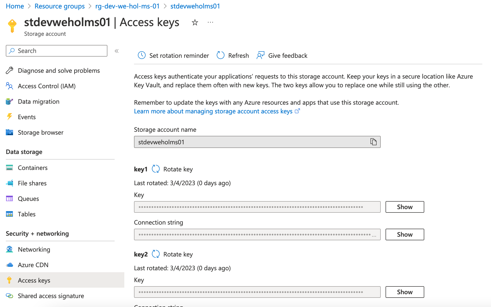

```bash
# Then create the audios container inside it

az storage container create -n audios \
                            --account-name <storage-account-name> \
                            --account-key <storage-account-key>
```

If everything is fine, open the [Azure Portal][az-portal] and you will retreive your container:


</details>

[az-portal]: https://portal.azure.com

---

## Detect the audio uploaded

### Create an Event Grid

Next step is to setup a way to listen to the audios files uploaded by the user in the storage account container. To start, we will upload them directly using the [Azure Portal][az-portal] and further in the lab we will use a user interface and a dedicated API.

To detect the upload you will use a service called Event Grid, and use the `System topic`.

The naming convention for Event Grid topics is: `egst-<environment>-<region>-<application-name>-<owner>-<instance>`.

<div class="task" data-title="Resources">

> [Event Grid][event-grid]

</div>

[event-grid]:https://learn.microsoft.com/en-us/cli/azure/eventgrid/system-topic?view=azure-cli-latest

<details>
<summary>Toggle solution</summary>

```bash
# Create the Event Grid system topic
az eventgrid system-topic create -g <resource-group> \
                                 --name <event-grid-system-topic-name> \
                                 --location <region> --topic-type microsoft.storage.storageaccounts \
                                 --source /subscriptions/<subscription-id>/resourceGroups/<resource-group>/providers/Microsoft.Storage/storageAccounts/<storage-account-name>
```

</details>

### Create an Event Hub

The Event Grid previously created will listen to the Storage Account, but before adding this mecanism we need to create another service: The Event Hub. This one is responsible for broadcasting the event creating by the Event Grid service. With that in placethe event can be consumed by multiple services. In our case, a Logic App will be triggered based on the Event Hub broadcasting.

The naming convention for Event Hub Namespace is: `evhns-<environment>-<region>-<application-name>-<owner>-<instance>` and for the event hub: `evh-audios-uploaded-<environment>-<region>-<application-name>-<owner>-<instance>`.

- Use the `Basic` SKU for the Event Hub Namespace.
- Define the message retention to 1 and partition count to 2 for the Event Hub.

<div class="task" data-title="Resources">

> [Event Hubs Namespace][event-hubs-namespace]<br>
> [Event Hubs Event][event-hubs-event]

</div>

[event-hubs-namespace]:[https://learn.microsoft.com/en-us/cli/azure/eventhubs/namespace?view=azure-cli-latest]
[event-hubs-event]:[https://learn.microsoft.com/en-us/cli/azure/eventhubs/eventhub?view=azure-cli-latest]

<details>
<summary>Toggle solution</summary>

```bash
# Create the Event Hub Namespace
az eventhubs namespace create --resource-group <resource-group> \
                              --name <event-hub-namespace> \
                              --location <region> \
                              --sku Basic 

# Create the Event Hub Instance
az eventhubs eventhub create --resource-group <resource-group> \
                             --namespace-name <event-hub-namespace> \
                             --name <event-hub-name> \
                             --message-retention 1 \
                             --partition-count 2
```

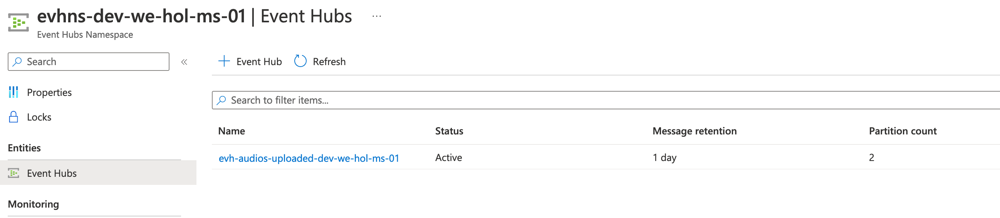

</details>

### Add an Event Subscription

Now, you will need to subscribe to the Storage Account with your Event Grid and use the Event Hub as a broadcaster.
To achieve this, you need to meet these triggers criterias:
- Only on blob creation
- If the file is uploaded in the `audios` container otherwise ignore it
- If the file extension is `.wav`
- The Event Grid trigger the Event Hub

The naming convention for Event Subscription is: `evgs-audios-uploaded-<environment>-<region>-<application-name>-<owner>-<instance>`

<div class="tip" data-title="tip">

> To get access to the identifier of a resource, go to the `Overview` tab and click en `Json View` on the top right and you will see it.

</div>

<div class="task" data-title="Resources">

> [Event Grid Topic Subscription][event-grid-topic-subscription]

</div>

[event-grid-topic-subscription]:https://learn.microsoft.com/en-us/cli/azure/eventgrid/system-topic/event-subscription?view=azure-cli-latest

<details>
<summary>Toggle solution</summary>

```bash
# Create the event grid system topic subscription
az eventgrid system-topic event-subscription create --name <event-grid-system-topic-subscription-name> \
                                             -g <resource-group> \
                                             --system-topic-name <event-grid-system-topic-name> \
                                             --event-delivery-schema eventgridschema \
                                             --included-event-types Microsoft.Storage.BlobCreated \
                                             --subject-begins-with /blobServices/default/containers/audios/blobs \
                                             --subject-ends-with .wav \
                                             --endpoint-type eventhub \
                                             --endpoint /subscriptions/<subscription-id>/resourceGroups/<resource-group>/providers/Microsoft.EventHub/namespaces/<event-grid-system-topic-name>/eventhubs/<event-hub-name>
```

If you did everything correctly you should see the event subscription like this:

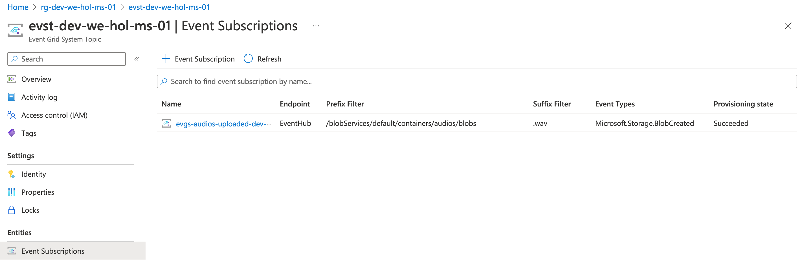

</details>

---

## Process the event

### Create the Logic App

The action of uploading an audio file is now exposed by the event hub. It's time to consume this event.

Let's create a Logic App in consumption mode which is triggered by the event hub every 10 seconds.

The default workflow to use is:

```json
{
    "definition": {
        "$schema": "https://schema.management.azure.com/providers/Microsoft.Logic/schemas/2016-06-01/workflowdefinition.json#",
        "actions": {},
        "contentVersion": "1.0.0.0",
        "outputs": {},
        "parameters": {},
        "triggers": {}
    },
    "parameters": {}
}
```

The naming convention for Logic Apps is: `logic-<environment>-<region>-<application-name>-<owner>-<instance>`

<div class="task" data-title="Resources">

> [Azure Cli Extension][azure-cli-extension]
> [Azure Logic App][azure-logic-app]

</div>

[azure-cli-extension]:https://learn.microsoft.com/en-us/cli/azure/azure-cli-extensions-overview
[azure-logic-app]:https://learn.microsoft.com/en-us/cli/azure/logic/workflow?view=azure-cli-latest

<details>
<summary>Toggle solution</summary>

```bash
# Install the logic extension
az extension add --name logic

# Create a logic app in consumption mode
az logic workflow create --resource-group <resource-group> 
                         --location <region> 
                         --name <logic-app-name> 
                         --definition <path-to-default-workflow.json>
```

</details>

### Trigger the logic app

Next step is to trigger the Logic App based on the Event Hub when a file is uploaded to the audios container.

A basic audio file to test the trigger can be download here:
<audio controls>
  <source src="audio.mp3" type="audio/wav">
</audio>

<div class="task" data-title="Resources">

> [Logic Apps Triggers][logic-apps-triggers]

</div>

[logic-apps-triggers]:https://learn.microsoft.com/en-us/azure/connectors/connectors-create-api-azure-event-hubs

<details>
<summary>Toggle solution</summary>

In the [Azure Portal][az-portal] inside the Logic App just created click on the `Edit` button. Then select `Blanc Logic App`. In the triggers list search for `Event Hub` and select the `When events are available in Event Hub` trigger.

You will need to go to the `Shared Access Policies` inside your event hub to create an access key with `Listen` *only* property:

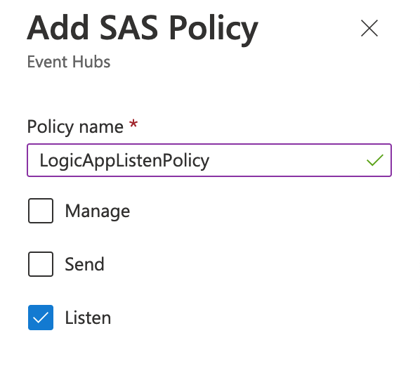

With that done, you will be able to connect to the Event Hub using the primary or secondary connection string:

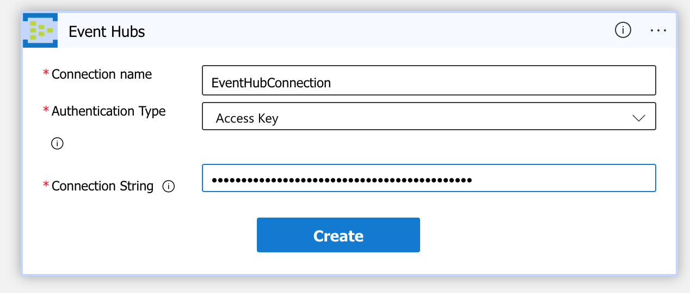

Next step, you can configure the event hub trigger:

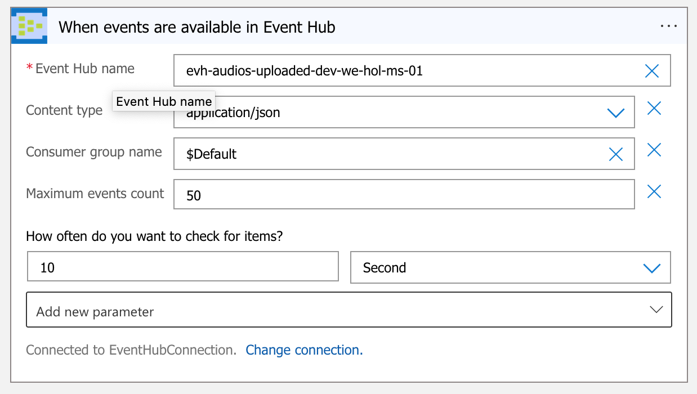

Finally, if you upload a file in the audios container, after a few seconds, if you look at your logic app `Runs history` you will see a succeeded status.
</details>

[az-portal]: https://portal.azure.com

### Download the blob

With the trigger ready, you need to extract the audios blob path and prepare it to be consumed by the cognitive services.

<div class="task" data-title="Resources">

> [Logic Apps Consumption mode][logic-app]<br>
> [Logic App Storage Account Action][logic-app-storage-action]

</div>

[logic-app]:[https://learn.microsoft.com/en-us/azure/logic-apps/logic-apps-perform-data-operations?tabs=consumption#parse-json-action]
[logic-app-storage-action]:[https://learn.microsoft.com/en-us/azure/connectors/connectors-create-api-azureblobstorage?tabs=consumption]

<details>
<summary>Toggle solution</summary>

First thing to do is to parse the json content. To do so, search for `parse json` in the workflow editor and choose the content input with `Content` which is the event hub content data. 
For the schema part, just click on `Use sample payload to generate schema` and copy paste one of the json object inside the output `Content` received from a previous successfull run.

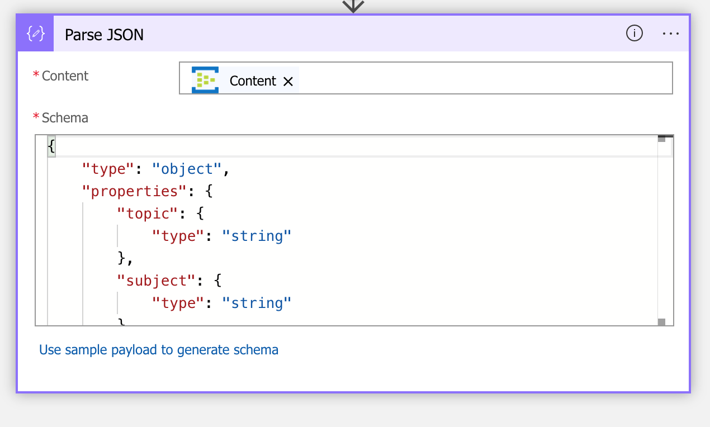

Because the Content is an array, you need to loop over it for the next action. To do so, search `For each` action and then select `Body` as input.

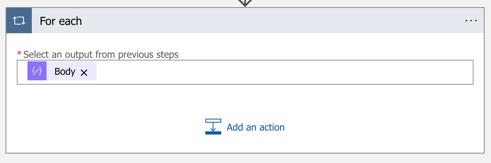

Then, search for `Azure Blob Storage` and select the `Get blob content using path (V2)` action. As we did previously, create a connection service with the `Access Keys` of the Storage account:

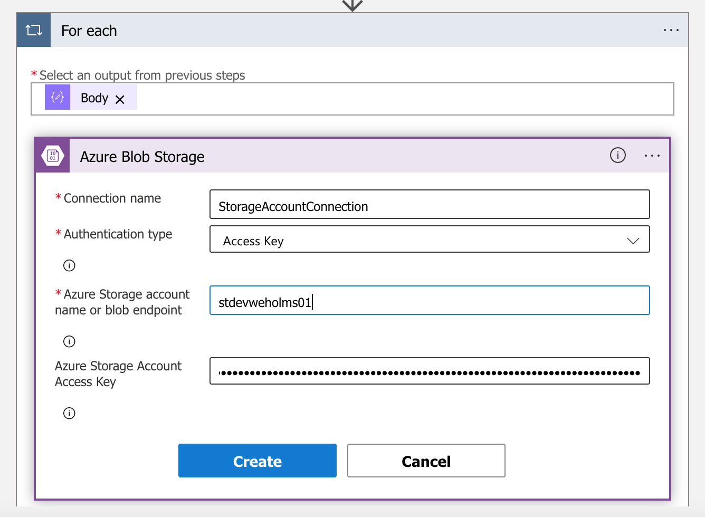

Finally, update the information to get the path of the audio file just uploaded using a `split` query:

```js
split(items('For_each')['data']['url'], '.blob.core.windows.net')[1]
```

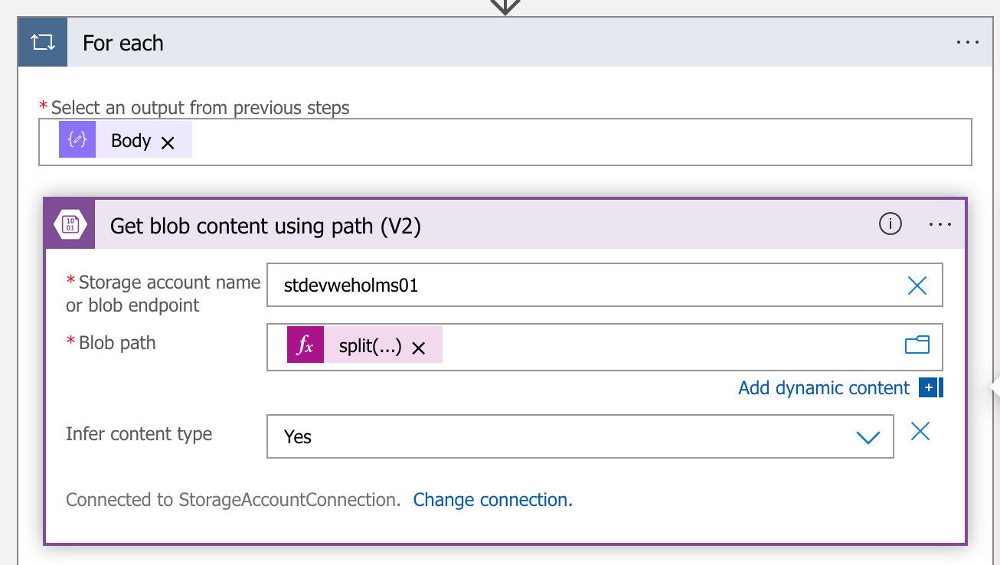

</details>

### Use the cognitive services

Next step is to transform the audio file into text using the cognitive service with the speech to text service. 
To do this, you will have to:
- Instanciate the cognitive service
- Call the speech to text API

<div class="important" data-title="Security">

> Remember to store secrets values if necessary in a Key Vault before using them.

</div>

The naming conventions are:
- Cognitive services: `cog-<environment>-<region>-<application-name>-<owner>-<instance>`
- Key Vault: `kv-<environment>-<region>-<application-name>-<owner>-<instance>`

<div class="info" data-title="Resources">

> [Cognitive service][cognitive-service] <br>
> [Key Vault][key-vault] <br>
> [Cognitive Service Api][cognitive-service-api]

</div>

[cognitive-service]:
[key-vault]: https://learn.microsoft.com/fr-fr/cli/azure/keyvault?view=azure-cli-latest
[cognitive-service-api]:https://learn.microsoft.com/en-us/azure/cognitive-services/speech-service/get-started-speech-to-text?tabs=macos%2Cterminal&pivots=programming-language-rest

<details>
<summary>Toggle solution</summary>

```bash
# Let's create the cognitive service account with speech to text service
az cognitiveservices account create -n cog-dev-we-hol-ms-01 -g rg-dev-we-hol-ms-01 --kind SpeechServices --sku F0 -l WestEurope --yes
# Create the Key Vault to secure the speech to text API key
az keyvault create --location westeurope --name kv-dev-we-hol-ms-01 --resource-group rg-dev-we-hol-ms-01
```

To allow the Logic App to access the Key Vault, you need to grant access to it. Go to your Logic App and inside the identity tab, turn on the `System Identity`:


Then in your Key Vault, go to `Access policies` and create a new one, set the Secret access to `Get` and `List`:


Then search for your logic app.

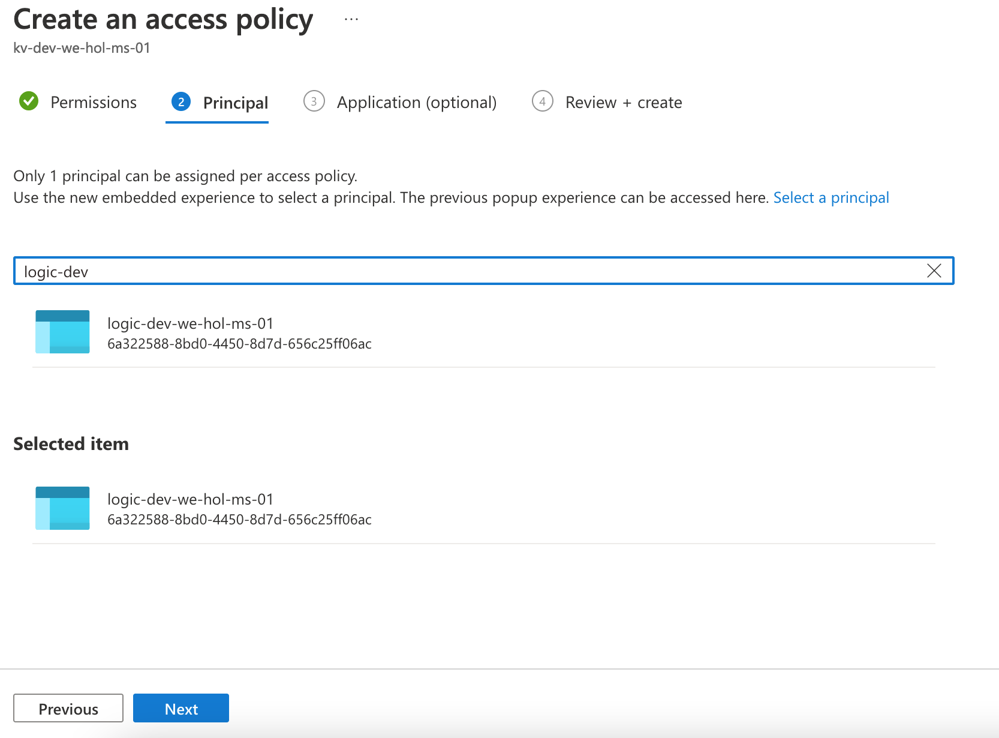

Now inside your Key Vault, in the `Secret` section add a new one called: `SpeechToTextApiKey` and set a key from the cognitive service.

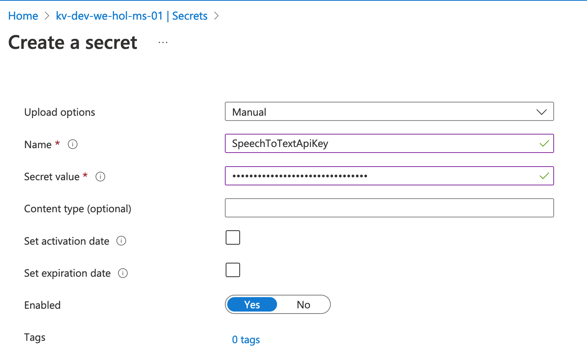

With all of these ready, add a new action before the loop by searching for `Key Vault` and then select `Get Secret`. This will load the speech to text API key once. 

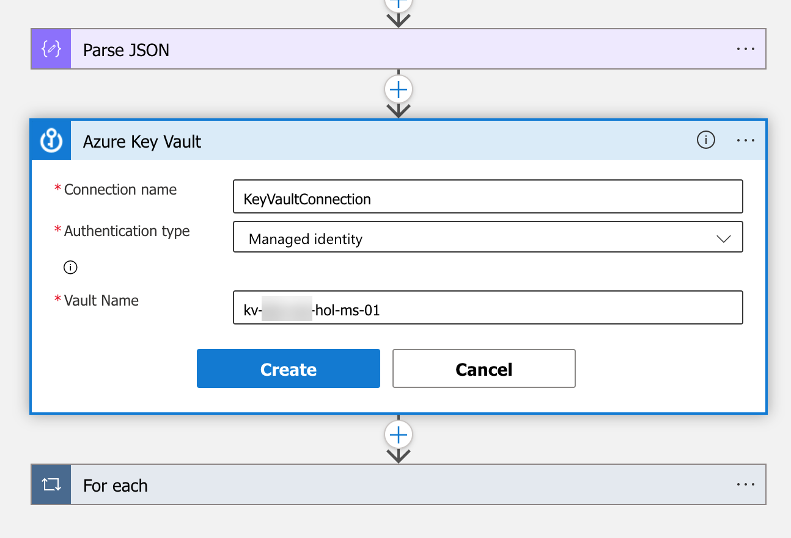

Select the Key Vault and the name of the secret.

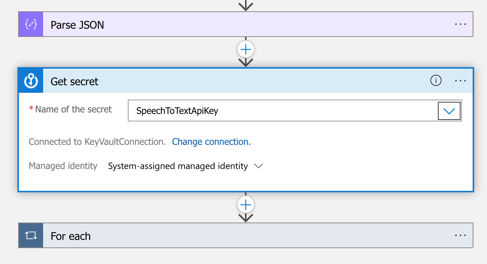

With that ready, add a new action in the for loop by searching for `Http`, then fill the different parameters like this:

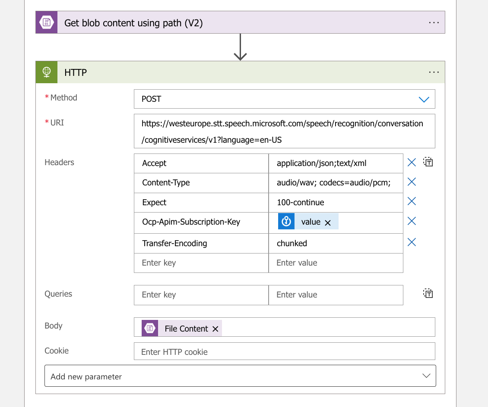

Upload the audio file and you should see the content as a text.

</details>

### Store data to Cosmos Db

With the audio transformed to text, you will have to store it in a NoSQL database inside Cosmos Db:
- Database info: `HolDb`
- Collection to store the texts: `audios_resumes`

<div class="info" data-title="Resources">

> Cosmos Db

</div>

SOLUTION:

```bash
# Create the Cosmos Db

```

Inside `Data Explorer` create the database and the collection.

IMAGE

Go back to the Logic App and add add a new action, search for `Cosmos Db` and select `action`:

Create the connection with your Cosmos Db Instance:


Finally, it's time to compose the document object to insert using JSON:

```json
{
    "id": "",
    "text": ""
}
```

Give a try and fortunately, you will see a new item in your Cosmos Db!


---


Download file
Link display


## Create an Azure Function

In the [Azure Portal][az-portal], search for `Azure Functions` and create a new one:

[IMAGE of creation with parameters]

The naming format to use must be: func-<environment><region><application-name><owner><instance>

Make sure to:
- Select the `Linux` Operating System
- Have a plan type set to `Consumption (Serverless)`

Then select the language you want to use for it. In this lab we will use `python`, however if you want to use any other language in the list you are confortable with it, of course do it!

Leave other default options as is and press the `Create` button.

   
ajouter les SPEECH_KEY et SPEECH_REGION dans les app settings
https://learn.microsoft.com/en-us/azure/cognitive-services/speech-service/get-started-speech-to-text?tabs=macos%2Cterminal&pivots=programming-language-python

Namming:
https://learn.microsoft.com/en-us/azure/cloud-adoption-framework/ready/azure-best-practices/resource-naming

Identité à ta function app
supprimer SAS token et utiliser identité managé
ajouter au keyvault les clés
Output binding cosmosdb

<audio controls><source src="audio.mp3" type="audio/mp3"></audio>