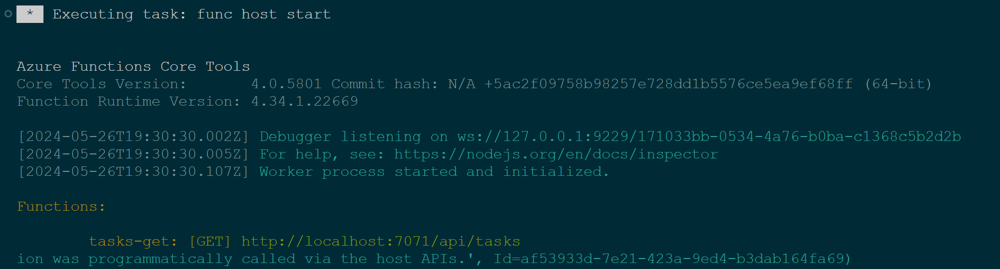

# Develop and deploy your fullstack web app with Azure Static Web Apps and Cosmos DB

In this workshop, you will learn how to create a full application with a `frontend`, a `serverless backend`, `user authentication` and a `database` to store your data.

Don't worry if you are not familiar with Microsoft Azure. This workshop will walk you through some of the most important services if you are a web developer. We will see how to use `Cosmos DB` with the `MongoDB` API, `Azure Static Web Apps` to host your client application and `Azure Functions` for your backend and `GitHub Actions` to automate your app deployment!

At the end of this workshop, you will have a full understanding on how to develop and deploy a simple web app on Azure.

### Prerequisites

To do this workshop, you will need:
* Basic JavaScript knowledge
* [A Microsoft Azure account](https://azure.microsoft.com/free/)
* [A GitHub account](http://github.com/)
* [Visual Studio Code](https://code.visualstudio.com/) (VSCode)
* [Node.js 20 installed](https://nodejs.org/)


---

## What's Azure Static Web Apps?

Azure Static Web Apps is a service that enables developers to deploy their web applications on Azure in a seamless way. This means developers can focus on their code and spend less time administering servers!

So, with Azure Static Web Apps (aka SWA), developers can not only deploy frontend static apps and their serverless backends but they can also benefit from features like `Custom domains`, `pre-prod environments`, `authentication providers`, `custom routing` and more.
 
### Who is it for?
Azure Static Web Apps is for every developer who wants to spend more time in their code editor than they do managing resources in the cloud.

If you are a so-called "Full stack developer", then you probably want to deploy both your frontend and your backend to the cloud, ideally with limited administration and configuration management.

### Front end developers
Azure Static Web Apps supports many frameworks and static site generators out of the box. If you are using a framework like `Angular`, `React`, `Vue.js`, a site generator like `Gatsby`, `Hugo` or one of the many solutions Azure Static Web Apps supports, then you don't have to take care of the deployment. If you have a specific need to customize the build for your app, you can configure it yourself very easily!

### Backend developers
Azure Static Web Apps relies on `Azure Functions` for your application backend. So, if you are developing in `JavaScript`, `Java`, `Python` or `.NET`, SWA makes it very easy to deploy your backend as well!

<div class="info">

> You can find the official Static Web Apps documentation here: [learn.microsoft.com/azure/static-web-apps/](https://learn.microsoft.com/azure/static-web-apps/)

</div>

Oh, and did I forget to mention there is a Free tier for Static Web Apps? You can start using it for free and only pay once your application gets popular!

---

## Start with a website

Once upon a time, there was a website that needed a place to live, be visible to the world and have a backend to be more interactive.

Go to [this GitHub repository](https://github.com/themoaw/swa-workshop) and click on `Use this template`. 


You will be redirected to the repository creation page. Enter a name for your new repository, set the repo visibility to `public` and click on `Create repository from template`.

Once the repository is created, clone it locally using git.

You now have your baseline project. Open your repository folder in VSCode.

---

## Create an Azure Static Web App

Start by opening the [Create Static Web App form](https://portal.azure.com/#create/Microsoft.StaticApp) in the Azure Portal. This link will take you directly to the Static Web App creation form. You may be prompted to log into your Azure Subscription. If you don't have one you can create a Free trial.  

Let's fill it out!

* Select your Subscription.
* Create a new Resource Group.

<div class="info">

> In Azure, a Resource Group is a logical structure that holds resources usually related to an application or a project. A Resource Group can contain virtual machines, storage accounts, web applications, databases and more.

</div>

* Give a Name to your Static Web App.
* Select the Free Plan (we won't need any feature in the Standard Plan for this workshop).
* Select `West Europe` for your backend.

<div class="tip" data-title="tip">

> It's recommended to host your backend in a Region closest to your users.

</div>

* Select `GitHub` as a deployment source.

We are going to host our website source code on GitHub. Later in the workshop, we will see how Static Web Apps will automaticaly deploy our website every time we push new code to our repository.

* Sign in with your GitHub account and select the repository and the branch of your project.

As we mentioned at the beginning of the workshop, our app will have a backend and a frontend. In order for Static Web App to know what to deploy and where, we need to tell it where our apps are located in our repository.

Azure Static Web Apps can handle several well-known frontend frameworks and can "compile" your Angular, React or Hugo application before deploying them.

In our case, we have a very simple JavaScript application which does not require anything to run. So, let's choose `Custom`.
* In the `App location`, enter the `/www` folder as this is where our frontend is.
* In the `Api location`, enter the `/api` folder as this is where our backend is.
* In the `Output`, enter the `/www` folder as your frontend does not need any build system to run.


* Click on `Review + Create` and then on `Create`.

After a few minutes, your Static Web App will be created on Azure and your website deployed.

Once the resource is created, you should `pull` your repository in VSCode as a few files have been added to your GitHub repo by Azure.

### So, what just happened?

#### On GitHub

When Azure created your Static Web App, it pushed a new YAML file to the `.github/workflow` folder of your repository.

The files in this folder describe GitHub Actions, which are event-based actions that can be triggered by events like a `push`, a `new pull request`, a `new issue`, a `new collaborator` and more. 

You can see the complete list of triggers [here](https://docs.github.com/en/actions/reference/events-that-trigger-workflows)

<div class="info">

> If you are not familiar with GitHub Actions, you can read about them [here](https://github.com/features/actions).

</div>

Let's have a look at the YAML file Azure created for us:

```yaml
on:
  push:
    branches:
      - main
  pull_request:
    types: [opened, synchronize, reopened, closed]
    branches:
      - main
```

Here, you can see that the GitHub Action is going to be triggered every time there is a `push` on the `main` branch or every time a Pull Request is `opened`, `synchronize`, `reopened` or `closed`.  

As we want our website to be redeployed automatically every time we push on our main branch, this is perfect!

Take a few minutes to read the YAML file and understand what exactly happens when the GitHub Action is triggered. You can see that most of the information you entered when you created your Static Web App on Azure is here.

<div class="tip" data-title="tip">

> The YAML file is in your GitHub repository so you can edit it! Your frontend site folder name changed? No problem, just edit the file and push it to GitHub!

</div>

In your folder find the YAML file `.github\workflows\<YOUR-STATIC-APP-NAME-XXXX>.yml` and change the `actions/checkout@` section to adopt new nodejs version(i.e. 20).  

```yaml
steps:
      - uses: actions/checkout@v3
```
to 

```yaml
steps:
      - uses: actions/checkout@v4
```

Save the changes and push the file in repo.

Go to Terminal in VS Code and type below command in your working app directory

```bash
git add .
git commit -m "changed the checkout action version"
git push
```
This will trigger the GitHub Action to deploy the changes.

Now, go to your GitHub repository in a web browser and click on the `Actions` tab. Here, you will see the list of all the GitHub Actions that have been triggered so far. Click on the last one to see your application being deployed.


#### On Azure

Once your Static Web App is created, go to the Resource page. You can find the list of all your Static Web Apps [here](https://portal.azure.com/#blade/HubsExtension/BrowseResource/resourceType/Microsoft.Web%2FStaticSites).

In the Overview panel of your Static Web App, look for the `URL` parameter. This is the url of your website. 


Open the link and you can see that your TODO list app has been deployed and is accessible to the world!

Congratulations, you deployed your first Static Web App on Azure! 🥳

---

## Test your project locally

There are two ways to test your project. You can either push your code on GitHub every time you need to test it (not recommended), or use the `Static Web Apps CLI`.

### The Static Web App CLI

The Static Web Apps Command Line Interface, also known as the `SWA CLI`, serves as a local development tool for Azure Static Web Apps. In our case, we will use the CLI to:

* Serve static app assets
* Serve API requests
* Emulate authentication and authorization
* Emulate Static Web Apps configuration, including routing

You can install the CLI via npm.

```bash
npm install -g @azure/static-web-apps-cli
```

We are only going to use a few features of the CLI so if you want to become a SWA CLI expert, you can find all the features the CLI provides [here](https://github.com/Azure/static-web-apps-cli)

### Run your project locally

The CLI offers many options, but in our case we want it to serve both our API located in our `api` folder and our web application located in our `www` folder.

In your terminal, type the following command to start your project:

```bash
swa start www --open
```

A local web server will be started at [http://localhost:4280](http://localhost:4280) to run your app.

<div class="warning" data-title="important">

> Later on, you will need to add the option `--api-location api` to also start the Azure Functions API server. You'll be able to test your API at [http://localhost:7071/api/tasks](http://localhost:7071/api/tasks).
> 
> The CLI may take more time than usual to launch your Azure Functions, especially the first time as it may need to download the needed tools.

</div>

Congratulations, you now have everything you need to test your app on your computer! 🥳

---

## Let's add a backend

Now that our TODO frontend is deployed, we want to make it interactive and need to add a backend!  

Azure Static Web Apps relies on Azure Functions for your application backend. Azure Functions is an Azure service which enables you to deploy simple code-based microservices triggered by events. In our case, events will be HTTP requests.

<div class="info">

> Ever heard of Serverless or FaaS (Function as a Service)? Well, you get it, this is what Azure Functions is ^^.

</div>

### Installation

You can create an Azure Function from the [Azure portal](https://portal.azure.com/) but let's be honest, it's so much easier to stay in VSCode and use the Azure Functions extension.

So, start by installing the Azure Function extension from VSCode.

You can download the extension either directly from the `Extension panel (Ctrl + Shift + X)` in VSCode or by going [here](https://marketplace.visualstudio.com/items?itemName=ms-azuretools.vscode-azurefunctions) and clicking on the `Install` button.

Install the [Azure Functions extension](https://marketplace.visualstudio.com/items?itemName=ms-azuretools.vscode-azurefunctions&WT.mc_id=javascript-76678-cxa) v1.10.4 or above for Visual Studio Code. This extension installs [Azure Functions Core Tools](https://learn.microsoft.com/en-us/azure/azure-functions/functions-run-local) for you the first time you locally run your functions. 

> Functions runtime v4 requires version 4.0.5382, or a later version of Core Tools.

Go to VSCode terminal or windows cmd and check the version of Core tools as 

```bash
func -v
> 4.0.5801
```

### Create your Function app

Azure Functions live in an Azure Functions App. When you create your Function App, a single Azure Function will be created by default. You can then add more Functions as required.

So, let's create our Functions App and a Function to retrieve our task list for our TODO frontend.

* In VSCode, open the Command panel using `Ctrl + Shift + p` and search for `Azure Functions: Create new project`. 
* Select the `api` folder. This is where our Function App will be created.
* Choose `JavaScript` as this is the language we are going to use to write our Function.

<div class="info">

> Azure Static Web Apps don't support all the languages you can develop Azure Functions with. Supported backends can be developed using  JavaScript, TypeScript, Python or C#.

</div>

* Select `Model v4`.
* As we are creating a REST API that will be called by our website, the trigger we are looking for is the `HTTP trigger`. 
* Our first Function will be used to retrieve our task list. Let's call it `tasks-get`. 
<!-- * Select the `Anonymous` authorization level. -->

<div class="info">

> If you want to learn more about the different authorization levels for Functions and how to secure your API, check out the docs [here](https://learn.microsoft.com/azure/azure-functions/security-concepts).

</div>

A function will be created for you so you don't start with a blank project. Let's modify the scaffold for our needs.

Right now, we don't have a database to store our users or our tasks so let's use an array as a "fake" database.

```json
const tasks = [
    {
        id: 1,
        label: "🍔 Eat",
        status: ""
    },
    {
        id: 2,
        label: "🛏 Sleep",
        status: ""
    },
    {
        id: 3,
        label: "</> Code",
        status: ""
    }
];
```

<div class="task" data-title="todo">

> Modify the Azure Function (api\src\functions\tasks-get.js) so it returns the list of tasks.

</div>

Once deployed, you will be able to call your function like any REST API. 

### Configure your endpoints

By default, when an Azure Function is created using the VSCode extension, the function will support `GET` and `POST` requests and the URL will end with your function name. In our case, the `tasks-get` function can either be called using
* `GET https://your-website-url.com/api/tasks-get`
* `POST https://your-website-url.com/api/tasks-get`

This is not exactly what we need. 

As we only need our Function to retrieve a list of tasks, let's remove the `POST` method in the `methods` array from the file `api\src\functions\tasks-get.js` so our Function can only be called using `GET` requests.

```javascript
...
app.http('tasks-get', {
    methods: ['GET'],
    authLevel: 'anonymous',
...
```

The other thing you may want to change is the URL of your Function. Having a route called `/api/tasks-get` is not very standard. You can easily change your endpoint name in the `api\src\functions\tasks-get.js` file by adding a `route` parameter as below.

```javascript
app.http('tasks-get', {
    methods: ['GET'],
    authLevel: 'anonymous',
    route: 'tasks'
```

Now, your Function is only accessible using a `GET /api/tasks` request.

### Run the function locally

Visual Studio Code integrates with Azure Functions Core tools to let you run this project on your local development computer before you publish to Azure.

1. To start the function locally, press `F5` or the **Run and Debug** icon in the left-hand side Activity bar. 

If you get the Storage pop-up message, select the local Emulator option.

The **Terminal** panel displays the Output from Core Tools. Your app starts in the **Terminal** panel. You can see the URL endpoint of your HTTP-triggered function running locally.



If you have trouble running on Windows, make sure that the default terminal for Visual Studio Code isn't set to **WSL Bash**.

2. With Core Tools still running in Terminal, choose the Azure icon in the activity bar. In the **Workspace** area, expand **Local Project > Functions**. Right-click (Windows) or Ctrl - click (macOS) the new function and choose **Execute Function Now....**


3. In **Enter request body** you see the request message body value of `{ "name": "Azure" }`. Press Enter to send this request message to your function.

4. When the function executes locally and returns a response, a notification is raised in Visual Studio Code. Information about the function execution is shown in **Terminal** panel.

5. With the **Terminal** panel focused, press `Ctrl + C` to stop Core Tools and disconnect the debugger.

You've done it! You wrote your first Azure Function. Congratulations! 🥳

---

## Add authentication

Azure Static Web Apps manages authentication out of the box. There are pre-configured providers and you can add you own custom providers if needed. Among the pre-configured ones are `Twitter` are `GitHub`

<div class="info">

> If you are using the CLI, you won't really be connecting to the selected provider. The CLI offers a proxy to simulate the connection to the provider and gives you a fake userId.

</div>

### Sign in & Sign out

When I said "out of the box", I really meant it. You don't need to do anything for most of the providers. Let's use the GitHub one for our application. The only thing you will have to do is add a button in your frontend that redirects to `/.auth/login/github`.

<div class="task" data-title="todo">

> Update the Login button in the www/login.html so your users can sign in using GitHub. 

</div>


By default, once logged in, your users are redirected to the same page. However, we would like our users to be redirected to our TODO page after successfully logging in. You can do that by using the `post_login_redirect_uri` query param at the end of the url.  
Eg. `?post_login_redirect_uri=/index.html` 

Change the login button code as below

```html
<a class="login-button" href="/.auth/login/github?post_login_redirect_uri=/index.html">Login with GitHub</a>

```
Then, navigate to [http://localhost:4280/login.html](http://localhost:4280/login.html) to test.

<div class="tip">

> If you are building a React app, go [check the Microsoft Learn module](https://learn.microsoft.com/learn/modules/publish-static-web-app-authentication/) that will show you how to do it.

</div>

### Getting user information

Once your user is authenticated, you can retrieve the user's information by fetching the url `/.auth/me`. This will return some JSON containing a clientPrincipal object. If the object is null, the user is not authenticated. Otherwise, the object contains data like the provider, the roles and the username.

```json
{
  "identityProvider": "github",
  "userId": "d75b260a64504067bfc5b2905e3b8182",
  "userDetails": "<your_git_user>",
  "userRoles": ["anonymous", "authenticated"]
}
```
The `userId` is unique and can be used to identify the user. We will use it later in our database.

<div class="task" data-title="todo">

> Complete the `getUser()` method in `www/app.js` to retrieve the logged-in user information and display the username in the `<div id="username></div>` element located at the top left of your web page.

</div>

So change the `getUser` function from `www/app.js` as below

```javascript

async function getUser() {
    const response = await fetch('/.auth/me');
    const payload = await response.json();
    const { clientPrincipal } = payload;
    usernameElement.textContent = clientPrincipal.userDetails;
}

```

### Testing all together

1. Start the Function in Debug mode which will expose the `tasks` api at http://127.0.0.1:7071/api/tasks

2. Start the Frontend locally using the command `swa start www --open`

3. Enter http://localhost:4280/login.html

4. Login - Just enter the GitHub **User ID** and click **Login**


5. To Do Index.html - This will call the `tasks` api and load the tasks. Also it will fetch the get user details and show at top left side.


Congratulations, you can now log into your app! 🥳

---

## Routes & Roles

In many cases, your routes will be managed by your frontend, especially if you are using a framework such as React or Angular. 

You may also be used to managing authorization on your backend for your API calls.

Azure Static Web Apps offers you the possibility to handle HTTP requests in a single file. Start by creating a file called `staticwebapp.config.json` in your `www` folder.

<div class="box info">

> You need to restart the CLI each time your make a change in the <code>staticwebapp.config.json</code> file.

</div>

### Secure our website and APIs

There are many properties available to configure your Static Web App but let's concentrate only on the few we need in our app.

The `routes` parameter is an array of all the rules for your routes. For example, in our case, we would like to prevent unauthenticated users from calling our API. We can do that very easily.

```json
{
   "routes": [
      {
          "route": "/api/tasks/*",
          "allowedRoles": [
              "authenticated"
          ]
      }
    ]
}
```

What if we want to restrict a part of our frontend to authenticated users? We can do exactly the same with any frontend route.

```json
{
   "routes": [
      {
          "route": "/",
          "allowedRoles": [
              "authenticated"
          ]
      }
    ]
}
```

Now you have made this change your website root will only be accessible to logged in (authenticated) users.

### Manage HTTP error codes

 You will notice that your unauthenticated users are redirected to a default 401 (HTTP Unauthorized) web page. We can customize that using another property in the config file. The `responseOverrides` property enables you to redirect a user to a specific page when an HTTP code is returned. Let's redirect all non-authenticated users to the `login.html` page.

```json
{
   "responseOverrides": {
        "401": {
            "rewrite": "/login.html"
        }
    },
}
```

Here, we simply tell our Static Web App to redirect every 401 response to the `login.html` page.

<div class="task" data-title="todo">

> Create a `custom-404.html` page in your www folder and add a rule to redirect users to this page when they enter a URL which does not exist (HTTP error code 404).

</div>

So final file `staticwebapp.config.json` should be look like below
```json
{
    "routes": [
       {
           "route": "/",
           "allowedRoles": [
               "authenticated"
           ]
       },
       {
        "route": "/api/tasks/*",
        "allowedRoles": [
            "authenticated"
        ]
    }
    ],
    "responseOverrides": {
        "401": {
            "rewrite": "/login.html"
        },
        "404": {
            "rewrite": "custom-404.html"
        }
    }
}
```

Now, try to go to a non-existent page on your website like `/hello.html`. You should be redirected to the `custom-404.html` page you just created.

<div class="tip">

> This is also very useful if you are doing a Single Page Application (SPA) where the routing is managed on the client. You may then need to redirect all your URLs to `index.html`. Check the `navigationFallback` property in the documentation [here](https://learn.microsoft.com/azure/static-web-apps/configuration).

</div>

Congratulations, your website and your APIs are now secured and you have a seamless workflow for your users. 🥳

---

## Store your data in a database

There are several databases available on Azure. One of the most powerful ones is `Cosmos DB`. Azure Cosmos DB is a fully managed NoSQL database which supports several APIs. When you create your Cosmos DB Database, you can choose which API you want to use. Among the most popular ones are `MongoDB`, `SQL` and `Cassandra`.

### Setup your dev environment

Let's go back to our Azure Function in VSCode. We will be using the Cosmos DB MongoDB API, so we need a library to connect to our database. In the `/api` folder, open the `package.json` file and add `"mongodb": "^4.0.1"` to the `dependencies` property as shown below.

```json
...
  "dependencies": {
    "mongodb": "^4.0.1"
  },
...
```

In a terminal, type `npm install` and hit enter. This will download the dependencies for you to the `node_modules` folder of your Azure Functions App.

While you are in VSCode, let's install the `Azure Databases` extension. This will allow you to explore your database and make queries from VSCode without having to go to the Azure Portal.

In the extension menu of VSCode, search for `Azure Databases` or [here](https://marketplace.visualstudio.com/items?itemName=ms-azuretools.vscode-cosmosdb) and click on `Install`.

### Create your database

Start by opening the [Create Azure Cosmos DB form](https://portal.azure.com/#create/Microsoft.DocumentDB) in the Azure Portal. For our application, we are going to use the `MongoDB` API so select `Azure Cosmos DB for MongoDB` and click `Create`.

* Select `Request unit (RU) database account` and click `Create`
* Select your Subscription.
* Select the same Resource Group you used earlier in this workshop for Static Apps.
* Enter a name to identify your Cosmos DB Account. This name must be unique.
* Select the Location where your Account is going to be hosted. We recommend using the same location as your Static Web Apps. 
* Availability Zones, keep them default i.e. `Disable` as this is for workshop.
* Select `Provisioned throughput` there and next ensure you select `Apply` for `Apply Free Tier Discount`.
* For `Version` keep the default i.e. `6.0`.
* Click on `Review + Create` and then on `Create`.

Creating the Cosmos DB Accounts may take some time so grab a cup of hot chocolate and be ready to deal with Cosmos DB!

☕

OK, let's go back to VSCode. In the Azure Extension, in Resources area, when you click on your Azure Subscription, you now have the `Database` tab where you should see the Cosmos DB Account you just created. If you don't see it, just click the refresh button.

Once you see your Account, right click on it, select `Create Database` and enter a name(in VS Code top pallet). Then it will ask for Collection and name it `tasks` as it will be used to store our tasks.


### Add some data

Let's focus on our existing Azure Function. We will see later how to create a Function to add new tasks in our database.  

Right now, we just want to get our tasks from the database instead of the static JSON array we created earlier in our Function.

In VSCode, right click on your `tasks` collection and select `Create Document`.  To get the userId, just log into your web application(http://localhost:4280/.auth/me) and copy from userId field.


Edit the generated document to include the below json and make sure to replace the **userId** by the one of your logged in user copied from earlier.

```json
{
  "_id": {
    "$oid": "<GENERATED_DO_NOT_REPLACE>"
  },
  "userId": "<YOUR_USER_ID>",
  "label": "Buy tomatoes",
  "status": "checked"
}
```

Do it again for the two following tasks: Create new Document and edit to add below. In the end you will have 3 separate documents in `tasks` collection.

```json
{
  "_id": {
    "$oid": "<GENERATED_DO_NOT_REPLACE>"
  },
  "userId": "<YOUR_USER_ID>",
  "label": "Learn Azure",
  "status": ""
}
```

```json
{
  "_id": {
    "$oid": "<GENERATED_DO_NOT_REPLACE>"
  },
  "userId": "<YOUR_USER_ID>",
  "label": "Go to space",
  "status": ""
}
```

### Let's code

Now that we have our database set up and have added some data to it, let's make sure our user interface displays it!

In your `tasks-get` Azure Function, start by importing the `mongoClient` from the MongoDB library we installed earlier.

```javascript
const mongoClient = require("mongodb").MongoClient;
```

When your Static Web App calls the API, the user information is sent to the Function in the `x-ms-client-principal` HTTP header. 

You can use the code below to retrieve the same user JSON you get in the `clientPrincipal` property when you go to `/.auth/me`.

```javascript
const header = request.headers.get('x-ms-client-principal');
const encoded = Buffer.from(header, 'base64');
const decoded = encoded.toString('ascii');
const user = JSON.parse(decoded);
```

Let's see how the MongoDB API works:

* First, your need to connect to your server (in our case our Cosmos DB Accounts)

In order to connect your application to your database, you will need a connection string.  

You can find your server connection string in the Azure Portal. But, as always, you can stay in your VSCode. In the Azure Database extension, right click on your database server and select `Copy Connection String`.


Add your connection string to your ```local.settings.json``` file
```javascript
"values": {
  ...
  "COSMOSDB_CONNECTION_STRING": "<your_connection_string>",
  ...
}
```

Now, let's connect!  


```javascript
const client = await mongoClient.connect(process.env.COSMOSDB_CONNECTION_STRING);
```

### Request your data

Once you are connected to your Cosmos DB server using the MongoDB API, you can use this connection to select a database.

```javascript
const database = client.db("YOUR_DB_NAME");
```

Replace `YOUR_DB_NAME` by the name you entered when you created your database.

Then, query the document where the userId property is the same as the userId sent in the headers when your Function is called.

```javascript
const response = await database.collection("tasks").find({
    userId: user.userId
});

const tasks = await response.toArray();
```

<div class="task" data-title="todo">

> Update your Azure Function so it returns the tasks in the database associated to your logged in user.

</div>

**Final function should look like this**

```javascript
app.http('tasks-get', {
    methods: ['GET'],
    authLevel: 'anonymous',
    route: 'tasks',
    handler: async (request, context) => {
        
        context.log(`Http function processed request for url "${request.url}"`);

        const header = request.headers.get('x-ms-client-principal');
        const encoded = Buffer.from(header, 'base64');
        const decoded = encoded.toString('ascii');
        const user = JSON.parse(decoded);

        const client = await mongoClient.connect(process.env.COSMOSDB_CONNECTION_STRING);
        const database = client.db("<YOUR_DB_NAME>");

        const response = await database.collection("tasks").find({
            userId: user.userId
        });
        
        const tasks = await response.toArray();

        return { 
            body: JSON.stringify(tasks),
            headers: {
                'Content-Type': 'application/json'
            }
        }
    }
});
```

Test your website locally and push your changes to GitHub. The GitHub Action will be triggered and your website deployed. 

Last step, setting up environment variable for Static App for CosmosDB connection string.

Go to portal, search for 'Static Web App' and click your app, the in left panel, select `Environment variables`.
Click `+ Add` and give the name `COSMOSDB_CONNECTION_STRING` and copy the value as we did earlier and Apply.

Go check the public URL, you should see the tasks of your database.


If you are not able to see the tasks, see if the userId(from login data) is same as you saved earlier in CosmosDB document. This userId can be seen in browser, right click Inspect -> Network -> Me attribute. If they are not, then you have to update the user Id again in CosmosDB.


---

## Bonus

### Finish your application

You now know how to create and publish an app with a frontend, a backend, a database and some user authentication.

However, in order to make your TODO app fully functional, you need to add a few more features. The good news? You have everything your need to do it!

#### Add a new task

We have already added the source code to call the API in the frontend so all you need to do is to create the Azure Function and connect it to the database.  

<div class="task" data-title="todo">

> Create one Azure Function to add a new task to the database. You don't need to create a new project, just create new Function in your existing Function App project in VSCode.

</div>

#### Update a task

You may have noticed that there is a `status` attribute in every task in your database. The value can be either `""` or `"checked"`. Right now, there is no way to change this status.   

<div class="task" data-title="todo">

> Write an Azure Function and the JavaScript code in your frontend to update this status.

</div>

### Monitor your app

You now know how to create resources on Azure and how connection string work. 

You may have noticed that, once deployed, we don't have any logs for our app which means we have no way to know what happens if there are any issues.

<div class="task" data-title="todo">

> Create an [Application Insights](https://learn.microsoft.com/azure/azure-monitor/app/app-insights-overview) resource in your Resource Group and connect it to your Static Web App.

</div>

---

## Conclusion

Congratulations, you've reached the end of this workshop!


### Solution

You can download the completed app code with the features to add and update a task [here](assets/swa-workshop-final.zip).
