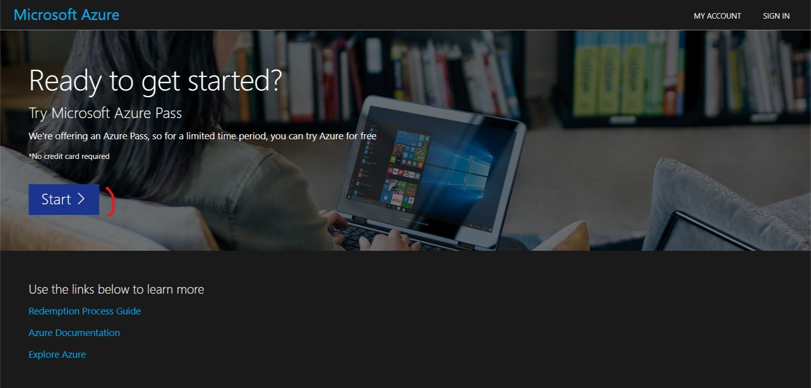
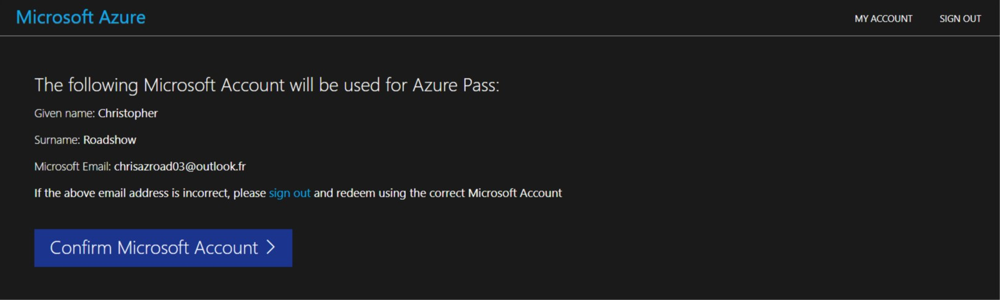
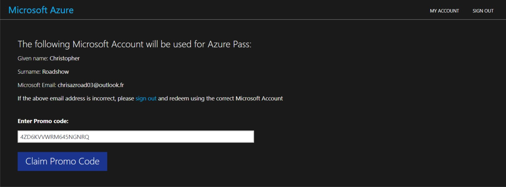
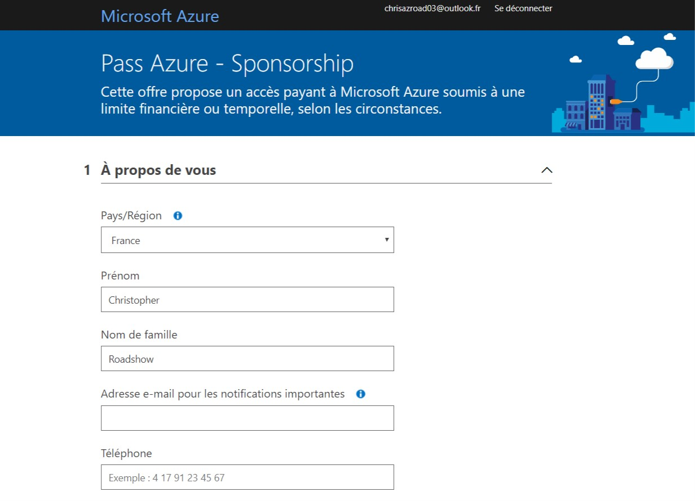

# Préparez votre environnement

Afin de réaliser ce workshop, vous aurez besoin de: 

- **Node.js**: https://nodejs.org (v12.13 minimum)
- **Git**: https://git-scm.com
- **Un compte GitHub**: https://github.com/join
- **Un éditeur de code**, par exemple: https://aka.ms/get-vscode
- **Un navigateur**, par exemple: https://www.microsoft.com/edge
- La **CLI Gastby**, à installer en copiant la commande suivante dans un terminal: `npm install -g gatsby-cli` (nécessite d'avant installé Node.js avant)
- **Une souscription Azure**, voir ci-dessous pour les détails

## Configurer son compte Azure

Il existe différentes manières d'obtenir une souscription à Microsoft Azure. 
Ce compte est nécessaire afin de créer les ressources Azure pour ce workshop.
Les ressources utilisées le seront dans les limites des tiers gratuits, il se peut cependant que des frais soient occasionnés en suivant ce workshop.

Afin de vous aider à créer votre compte Azure, choisissez l'option qui 
correspond le mieux à votre situation :

- [J'ai déjà un abonnement](#already-sub)
- [Je suis étudiant](#student)
- [Je suis un abonné MSDN/Visual Studio](#vss)
- [J'ai un Azure Pass](#azure-pass) (Si vous n'avez pas de compte étudiant, un Azure Pass vous sera donné au début du workshop)
- [Je n'ai rien de tout cela](#nothing)

### J'ai déjà un abonnement Azure :id=already-sub

C'est une excellente nouvelle ! Il faudra toutefois veiller à vérifier que vous avez les autorisations nécessaires
afin de pouvoir créer des ressources sur cet abonnement. 

Vous pouvez maintenant [vérifier si tout est prêt pour la prochaine étape](#self-check).

### Je suis étudiant :id=student

En tant qu'étudiant, vous avez probablement accès à l'offre **Azure For Students**.
Pour le savoir, rendez-vous sur la [page dédiée][azure-student], et cliquez sur **Activate Now**.
On vous demandera alors de confirmer vos informations personnelles, ainsi que votre numéro de téléphone afin de recevoir
un SMS de validation.

!> Si, à un moment dans le parcours d'inscription, vos informations de carte bleue vous sont demandées, c'est probablement qu'il y a eu une erreur dans le parcours.

Il se peut que votre portail étudiant vous amène directement sur le portail Azure, sans toutefois avoir de souscription
Azure. Dans ce cas, recherchez "Education" dans la barre de recherche en haut à droite. Sur cette page éducation,
cliquez sur le bouton **Claim your Azure credit now** afin de démarrer le processus de création d'abonnement.

Dans le cas où votre établissement d'enseignement ne serait pas reconnu, vous pouvez toujours 
[créer un abonnement d'essai](#nothing).

Vous pouvez maintenant [vérifier si tout est prêt pour la prochaine étape](#self-check).

### Un employé Microsoft m'a communiqué un _Azure Pass_ :id=azure-pass

Vous êtes sur un événement et un employé vous a communiqué un code _Azure Pass_? Dans ce cas
vous pouvez l'utiliser afin de créer un abonnement. Avant de démarrer, assurez-vous : 

- d'avoir un compte Microsoft (anciennement Live). Vous pouvez en créer un sur [account.microsoft.com](https://account.microsoft.com),
- que ce compte n'a jamais été utilisé pour un autre abonnement Azure. Si vous avez déjà eu un compte d'essai ou payant
avec la même adresse, il vous sera alors impossible d'utiliser l'Azure Pass.

!> Si, à un moment dans le parcours d'inscription, vos informations de carte bleue vous sont demandées, c'est probablement qu'il y a eu une erreur dans le parcours. Demandez de l'aide à l'employé Microsoft.

1. Rendez-vous sur [microsoftazurepass.com][azurepass] et cliquez sur **Start**,

2. Connectez vous avec un compte Microsoft Live **Vous devez utiliser un compte Microsoft qui n'est associé à aucune
 autre souscription Azure**
3. Vérifiez l'email du compte utilisé et cliquez sur **Confirm Microsoft Account**

4. Entrez le code que nous vous avons communiqués, puis cliquez sur **Claim Promo Code** (et non, le code présent sur la
 capture d'écran n'est pas valide ;) ),

5. Nous validons votre compte, cela prend quelques secondes

6. Nous serez ensuite redirigé vers une dernière page d'inscrption. Remplissez les informations, puis cliquez sur **Suivant**

7. Il ne vous restera plus que la partie légale: accepter les différents contrats et déclarations. Cochez les cases que 
vous acceptez, et si c'est possible, cliquez sur le bouton **Inscription**

Encore quelques minutes d'attente, et voilà, votre compte est créé ! Prenez quelques minutes afin d'effectuer la 
visite et de vous familiariser avec l'interface du portail Azure.

Vous pouvez maintenant [vérifier si tout est prêt pour la prochaine étape](#self-check).

### Je suis un abonné Visual Studio / MSDN :id=vss

Vous avez accès à un crédit mensuel gratuit dans le cadre de votre abonnement. Si vous ne l'avez pas déjà activé,
il suffit d'aller sur la [page dédiée](https://azure.microsoft.com/pricing/member-offers/credit-for-visual-studio-subscribers/?WT.mc_id=javascript-19816-yolasors)
puis de cliquer sur le bouton **activer**.

Vous pouvez maintenant [vérifier si tout est prêt pour la prochaine étape](#self-check).

### Je n'ai rien de tout cela :id=nothing

Vous pouvez toujours créer un [abonnement d'essai][azure-free-trial]. Les informations de carte bleue vous seront
demandées afin de s'assurer que vous êtes une personne physique.

Vous pouvez maintenant [vérifier si tout est prêt pour la prochaine étape](#self-check).

### ✅ Vérifions si votre compte Azure a bien été créé  :id=self-check

Avant de passer à l'étape suivante, nous allons nous assurer que votre souscription
a bien été créée. Pour cela, quelques étapes suffisent : 

1. Rendez-vous sur [le portail Azure][azure-portal],
2. Dans la barre de recherche en haut de la page web, entrez "Subscriptions", puis cliquez sur
l'élément 
3. Une liste apparaît, dans laquelle vous devez avoir un élément avec un status Actif 

>La capture d'écran indique un nom d'abonnement _Azure for Students_. Ce nom
>peut différer en fonction du type d'abonnement Azure, ainsi que de qui l'a créé.
>Il est en effet possible de rennomer son abonnement avec un nom plus de

**Félicitations**, vous êtes prêt pour le workshop! 🥳

[azurepass]: https://www.microsoftazurepass.com/?WT.mc_id=javascript-19816-yolasors
[azure-portal]: https://portal.azure.com/?feature.customportal=false&WT.mc_id=javascript-19816-yolasors
[azure-free-trial]: https://azure.microsoft.com/free/?WT.mc_id=javascript-19816-yolasors
[azure-student]: https://azure.microsoft.com/free/students/?WT.mc_id=javascript-19816-yolasors

---
Merci à [Christopher Maneu](https://twitter.com/cmaneu) pour ces instructions détaillées en français.
