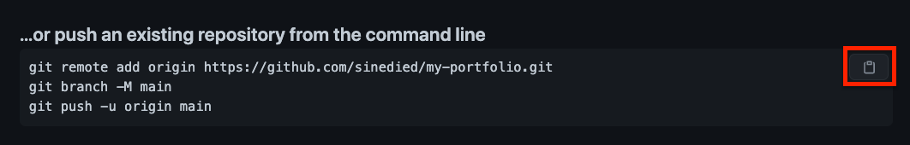

# Create and deploy your online portfolio with Gatsby, GitHub and Azure Static Web Apps

TODO: add short description

## Workshop Objectives
- Bootstrap a Gatsby app from a template
- Create a GitHub repository to push your code
- Deploy your website on Azure Static Web Apps with a CI/CD pipeline
- Understand how Gatsby works with React and Markdown
- Create your own content 😎

## Prerequisites

| | |
|---------------------|-----------------------------------------------|
| Node.js v12.13+     | https://nodejs.org                            |
| Git                 | https://git-scm.com                           |
| GitHub account      | https://github.com/join                       |
| Azure account       | https://aka.ms/student/azure                  |
| A code editor       | https://aka.ms/get-vscode                     |
| A browser           | https://www.microsoft.com/edge                |
| Gastby CLI          | Run `npm install -g gatsby-cli` in a terminal |

You can test your setup by opening a terminal and typing:

```sh
npm --version
git --version
gatsby --version
```

---

## 1. Bootstrap Gatsby app

### What's [Gatsby](http://www.gatsbyjs.com)?

It's an **open-source** static website generator and **framework**, allowing you to create website content from various data sources like JSON, **Markdown**, a database, an API and more, all based on **React** components.

#### Features
- Themes and starter templates
- Plugins
- Built-in GraphQL support
- Ideal for portfolios, blogs, e-shops, company homepages, web apps...

### Create Gatsby app

```sh
# See available commands
gatsby --help

# Create new app
# (package install might take a while...)
gatsby new my-portfolio https://github.com/sinedied/gatsby-portfolio

# Start development server
cd my-portfolio
gatsby develop
```

### Push to GitHub

1. Create a new repo with the name `my-portfolio`: https://github.com/new
2. Push your code to the repo, by copy/pasting the commands shown on GitHub:
  
3. After the push is finished, check that your code is visible on GitHub

---

## 2. Deploy your app on Azure Static Web Apps

### What's the cloud? ☁️

It's just someone else's computer. 🙂
More seriously, we call "the cloud" software and services that you can access remotely over the internet.

There are 3 main categories of cloud computing services:

| | | |
|----------------------|----------------------|----------------------|
| **IaaS**             | **PaaS**             | **SaaS**             |
| Infrastructure as a Service<br>(Storage, computing, networking) | Platform as a Service<br>(Focus on your code/data) | Software as a Service<br>(Ready-to-use software) |

### [Azure Static Web Apps](https://aka.ms/docs/swa)

#### What's Azure Static Web Apps (SWA)?

It's an all-inclusive **hosting service** for web apps with **serverless APIs**, based on a continuous integration and deployment pipeline from a GitHub repository.

#### Features
CI/CD, assets hosting, APIs, SSL certificate, route control, authentication, authorization, CDN, staging environments...

### Deploy to Azure Static Web Apps

1. Open Azure portal: [aka.ms/create/swa](https://aka.ms/create/swa)
2. Create new resource group `my-portfolio`
3. Enter a name and choose a region
4. Sign in to GitHub and select your GitHub repo and `main` branch
5. In **Build Details**, choose the `Gatsby` build preset
6. Click **Review + create**, then **Create**

### The deployment workflow

In the Azure portal, in the created resource, select **GitHub Actions runs**.

> You can see the **C**ontinous **I**ntegration (CI) and **C**ontinuous **D**eployment (CD) jobs running.

#### How the process works?

- Azure made a new commit in your repo with `.github/workflows/<name>.yml`
- The workflow is built with [GitHub Actions](https://github.com/features/actions)
- Every **new commit** triggers a new build and deployment
- You can preview changes separately using a **pull request**

---

## Step 3: Create your own content

### Gatsby app structure

```sh
|-- config/             # Website config: title, description, URL, links...
|-- content/            # Pages content: markdown, images
  |-- imprint/
  |-- index/
    |-- about/
    |-- contact/
    |-- ...
|-- src/                # React source code and components
|-- static/             # Static assets, like your resume in PDF
|-- public/             # Built version of your website (with gatsby build)
|-- gatsby-config.js    # Gatsby plugins configuration 
|-- gatsby-browser.js   # Browser events hooks
|-- package.json        # Your Node.js app details

```

### The `config/index.js` file

#### It contains the website settings:
- Metadata about the site
- Theme colors
- Optional RSS feed to display
- Social media links
- Navigation menu settings

#### Task
- Open a terminal and run `gatsby develop`
- Edit `/config/index.js` to make it yours 🙂

*TODO*
- [ ] Change the website title and info
- [ ] Personalize the colors
- [ ] Change or hide RSS feed
- [ ] Set social media links

### What's [Markdown](https://commonmark.org/help/)?

Markdown is a lightweight markup language for creating formatted text (HTML) using a plain-text editor.

#### Example code vs result

```md
# Header

Some text in **bold** or *italic* with a [Link](http://link.com).

- Item 1
- Item 2
- Item 3
```

Will be displayed as:

# Header

Some text in **bold** or *italic* with a [Link](http://link.com).

- Item 1
- Item 2
- Item 3
]

### What's [MDX](https://mdxjs.com/)?

MDX is markdown with JSX<sup>*</sup> support.

```mdx
# Hello, *world*

Below is an example of JSX embedded in Markdown.<br>
Try and change the background color!

<div style={{ backgroundColor: 'tomato' }}>
  <h3>This is JSX</h3>
</div>
```

<sup>*</sup>JSX: a syntax extension to JavaScript used in React to produce HTML. [More info](https://reactjs.org/docs/introducing-jsx.html)

### `/content` files

- Used by Gatsby to create your website content
- They use MDX with [Front Matter](https://jekyllrb.com/docs/front-matter/) (metadata in text format at the top)
    ---
    title: "I'm a Gatsby Starter"
    icon: "waving-hand.png"
    subtitle: "one-page portfolios"
    ---

- You can put images next to .mdx files
- You can add or create as many as you need

#### Task

- Put your own content there! 🌈

> **Tip**: To redeploy, commit and push<br>your changes

*TODO*
- [ ] Change hero content
- [ ] Put your story in about section
- [ ] Change contact details
- [ ] Feature your skills in interests section
- [ ] Show your projects

---

## Step 4: Go Further (Bonus)

### React components

The `src` folder contains the React app behind your website.

You can also create custom components to change the visual look of the content.
See `src/components/styles/underlining.js` for example.

>**Note:** The [Styled Components](https://styled-components.com/) library is used for CSS styling.

*TODO*
- [ ] Create a custom component
- [ ] Use it in a content a file

### For home study

#### GraphQL

Gatbsy has built-in support for consuming data from [GraphQL](https://graphql.org/). You can follow this tutorial to learn about GraphQL and how to use it in Gatsby:

**👉 https://aka.ms/learn/gatsby-graphql**

#### API

Gatbsy and Azure Static Web Apps are not limited to static data. You can follow this tutorial to learn how to create your own serverless API with JavaScript and deploy it on with Static Web Apps:

**👉 https://aka.ms/learn/swa-api**

#### Resources
- Gatbsy: https://www.gatsbyjs.com/
- Learn Markdown: https://commonmark.org/help/
- More Static Web Apps tutorials: https://aka.ms/learn/swa
- Intro to React: https://reactjs.org/tutorial/tutorial.html
