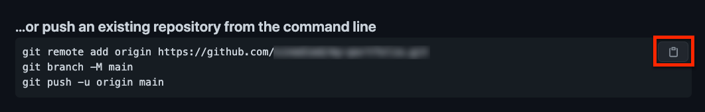

# Build, deploy and audit a serverless PWA with Azure Static Web Apps

In this workshop we'll learn how to build and deploy your first PWA with Angular, from scratch!
Let's find out in practice the changes necessary to transform your web app into a PWA, and manage offline mode, app install and updates.

After setting up continuous deployment for your app using Azure Static Web Apps and GitHub Actions, we'll gradually improve your app by checking the useful metrics to keep in mind. And even if you've never touched Angular, you can still follow this workshop as it's not the focus here 😉.

## Workshop Objectives
- Create an Angular app and turn it into a PWA (Progressive Web App)
- Set up continuous deployment on Azure Static Web Apps
- Configure service worker to add offline support
- Audit your app performance with Lighthouse 
- Create a serverless API with Azure Functions
- Review caching and updating strategies
- Handle app updates

## Prerequisites

| | |
|---------------|-----------------|
| Node.js v14.17+ | https://nodejs.org |
| Git | https://git-scm.com |
| GitHub account | https://github.com/join |
| Azure account | https://aka.ms/student/azure |
| A code editor | https://aka.ms/get-vscode |
| A chromium-based browser | https://www.microsoft.com/edge |

You can test your setup by opening a terminal and typing:

```sh
node --version
git --version
```

---

## Bootstrap app, setup repository & deploy

### Create Angular app

Open a terminal and type these commands:

```sh
# Install Angular CLI
npm install -g @angular/cli@latest

# Create Angular app
ng new my-pwa --minimal --defaults
cd my-pwa

# Test it
ng serve --open
```

### Push your app to GitHub

1. Create new repo: https://github.com/new

    <div class="tip" data-title="tip">
  
    > With GitHub CLI (https://cli.github.com) you can do it directly from command line: `gh repo create <name> --public`

    </div>

2. Push your code to the repo, by copy/pasting the commands shown on GitHub:

  

### What's Azure Static Web Apps?

Static Web Apps (or SWA for short) is an all-inclusive **hosting service** for web apps with **serverless APIs**, based on a continuous integration and deployment pipeline from a GitHub or Azure DevOps repository.

It provides a lot of features out of the box, like:
- CI/CD
- Assets hosting
- APIs
- SSL certificate
- Route control
- Authentication
- Authorization
- CDN
- Staging environments
- And more...

### Deploy to Azure Static Web Apps

1. Open Azure portal: [aka.ms/create/swa](https://aka.ms/create/swa)

2. Create new resource group `my-pwa`

3. Enter a name and choose a region

4. Sign in to GitHub and select your GitHub repo and `main` branch

5. In **Build Details**, choose the `Angular` build preset

6. For the **API location**, enter `/api`

7. For the **Output location**, enter `dist/my-pwa`

8. Click **Review + create**, then **Create**

### The deployment workflow

In the Azure portal, in the created resource, select **GitHub Actions runs**.

> You can see the **C**ontinous **I**ntegration (CI) and **C**ontinuous **D**eployment (CD) jobs running.

#### How the process works?

- Azure made a new commit in your repo with `.github/workflows/<name>.yml`
- The workflow is built with [GitHub Actions](https://github.com/features/actions)
- Every **new commit** triggers a new build and deployment
- You can preview changes separately using a **pull request**

---

## 2. Audit your app and update it to a PWA

### Audit your app

1. Open your deployed website URL

2. Open DevTools with `F12` or `OPTION+COMMAND+I` (Mac)

3. Navigate to **Lighthouse** tab

4. Click on **Generate report**

### Update your app to a PWA

```sh
# Make your app a PWA
ng add @angular/pwa

# See the changes
git diff
```

<div class="info" data-title="note">

> There is no `ngsw-worker.js` file, it will be automatically generated during build based on `ngsw-config.json`.

</div>

<div class="tip" data-title="tip">

> If you're not using Angular, [WorkBox](https://developers.google.com/web/tools/workbox) is an alternative service worker library that works with any website.

</div>

### Test your app offline

Commit and push your changes:
```sh
git add . && git commit -m "add PWA support" && git push
```

Then wait for the updated version of your app to be deployed.

Once your new version is deployed:

- Open your web app again then **generate an audit report again**.

- Take a look at **Application** tab.

- Go to **Network** tab, switch from `online` to `offline` and refresh.

---

## 3. App API and update service worker config

### Add API

The API is based on Azure Functions: [aka.ms/go/functions](https://aka.ms/go/functions)

```sh
# Create API folder
mkdir api && cd api

# Create functions config file
echo "{ \"version\": \"2.0\" }" > host.json

# Create function folder
mkdir hello && cd hello
```

<div class="tip" data-title="tip">

> If you install Azure Functions Core Tools ([aka.ms/tools/func](https://aka.ms/tools/func)) you can just use `func init` instead. You can also test your functions locally with `func start`.

</div>

#### Create new function

Create a file `index.js` with this content:

```js
async function GetHello(context, req) {
  context.res = {
    body: 'Hello from API at ' + new Date().toLocaleTimeString()
  };
};

module.exports = GetHello;
```

Create a file `function.json` with this content:
```json
{
  "bindings": [
    {
      "authLevel": "anonymous",
      "type": "httpTrigger",
      "direction": "in",
      "name": "req",
      "methods": ["get"]
    },
    {
      "type": "http",
      "direction": "out",
      "name": "res"
    }
  ]
}
```

### Update API in Angular app

Edit `src/app/app.component.ts` to add this:
```ts
export class AppComponent {
  hello = '';

  async ngOnInit() {
    try {
      const response = await fetch('api/hello');
      if (!response.ok) {
        throw new Error(response.statusText);
      }
      this.hello = await response.text();
    } catch (err) {
      this.hello = 'Error: ' + err.message;
    }
  }
}
```

Edit `src/app/app.component.html` and replace all content with this:
```ts
Message: {{ hello }}
```

#### Deploy and test API

Commit and push your changes:
```sh
git add . && git commit -m "add API" && git push
```

#### Once your new version is deployed

- Open your web app again and hit `shift` + refresh (don't forget to switch back to `online` first!).

- Go to **Network** tab, switch from `online` to `offline` and refresh.

😱

### Update service worker config

Edit `ngsw-config.json`: .float-right[**docs:** https://angular.io/guide/service-worker-config]
```json
{
  ...
  "dataGroups": [
    {
      "name": "api",
      "urls": ["/api/hello"],
      "cacheConfig": {
        "maxSize": 1,
        "maxAge": "1m",
        "strategy": "freshness"
      }
    }
  ]
}
```

#### Deploy and test API (again)

Commit and push your changes:
```sh
git add . && git commit -m "update SW config" && git push
```

#### Once your new version is deployed

- Open your web app again and hit `shift` + refresh (don't forget to switch back to `online` first!).

- Go to **Network** tab, switch from `online` to `offline` and refresh.

😎

### Test home screen install

Open your app on your mobile phone.

#### Android

Refresh a few times to see the install banner, or tap menu and choose **Add to home screen**.

<div class="tip" data-title="tip">

> You can customize install UI using `beforeinstallprompt` event, see https://web.dev/customize-install

</div>

#### iOS

Tap the share button and choose **Add to home screen**.

---

## 4. Manage app updates

### Using `SwUpdate` service

Have a look at the docs here: https://angular.io/guide/service-worker-communications

This service allows you to:
- Get notified of available updates
- Get notified of update activation
- Check for updates
- Activate latest updates

### Add update button

Edit `src/app/app.component.ts`, and add this:
```ts
import { SwUpdate } from '@angular/service-worker';
...

export class AppComponent {
  ...
  updateAvailable$ = this.swUpdate.available;

  constructor(private swUpdate: SwUpdate) {}

   async update() {
     await this.swUpdate.activateUpdate();
     document.location.reload();
   }
}
```

Edit `src/app/app.component.html` and replace its content with:
```html
Message: {{ hello }}

<p *ngIf="updateAvailable$ | async; else noUpdate">
  An update is available!
  Click here to apply:
  <button (click)="update()">Update</button>
</p>
<ng-template #noUpdate>
  <p>No update available.</p>
</ng-template>
```

#### Commit and redeploy

Commit and push your changes:
```sh
git add . && git commit -m "add SW updates" && git push
```

#### Once your new version is deployed

- Open your web app again and hit `shift` + refresh in your browser.

- Check that you see the message `No update available.`, meaning that your app is up-to-date.

### Create a new version of your app

- Add `<h1>New version!</h1>` to the top of `src/app/app.component.html`.

- Commit, push and wait for the new version to be deployed:
```sh
git add . && git commit -m "minor update" && git push
```

#### Once your new version is deployed

- Hit refresh **ONCE** and **WITHOUT** holding shift. 
  You should see the **Update** button appear after waiting a bit.

- Click **Update**, and the new version should appear.

---

## Go further

Now that you got all the basics, you can go further and build your own PWA!
You can use these resources to help you in your journey:

### Public APIs (to get some app ideas)
- https://github.com/public-apis/public-apis
- https://apilist.fun

### Additional resources
- Angular Service Worker: https://angular.io/guide/service-worker-intro
- Workbox: https://developers.google.com/web/tools/workbox
- Azure Static Web Apps: https://aka.ms/docs/swa
- Web Capabilities (Project Fugu 🐡): https://web.dev/fugu-status/
- Ngx Rocket: https://github.com/ngx-rocket/generator-ngx-rocket
  * Responsive PWA app generator with Material/Ionic/Bootstrap templates, i18n and more
